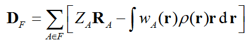
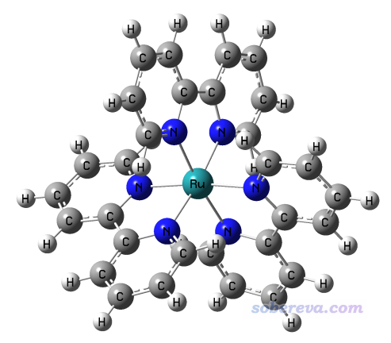
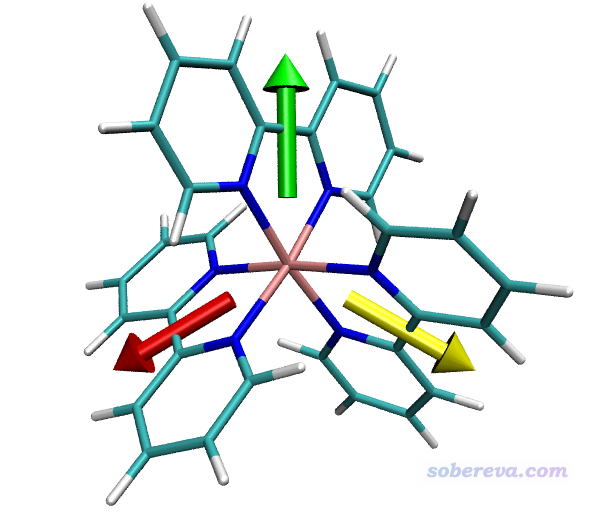
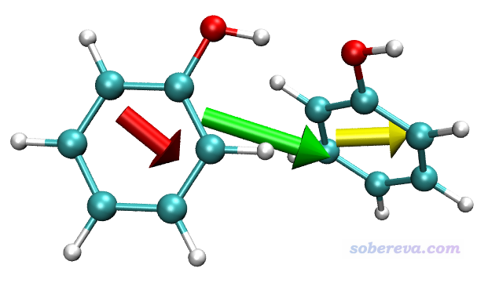

**使用Multiwfn计算分子片段的偶极矩和复合物中单体的偶极矩**

Calculation of dipole moment of molecular fragments and dipole moment of monomers in complexes using Multiwfn

文/Sobereva@[北京科音](http://www.keinsci.com)  2020-Jun-23

## 1 原理

时不时有人问怎么计算一个分子中某些片段的偶极矩，或者问怎么计算一个分子复合物中各个分子的偶极矩，确实这对于分析局部的极性很有意义，在本文就通过例子对做法进行说明。做这种分析必须使用2020-Jun-22之后更新的Multiwfn程序，可以在<http://sobereva.com/multiwfn>免费下载，相关基本知识看《Multiwfn FAQ》（<http://sobereva.com/452>）和《Multiwfn入门tips》（<http://sobereva.com/167>）。此功能需要使用含有波函数信息的文件作为输入文件，比如wfn、wfx、mwfn、fch、molden等，产生的方式见《详谈Multiwfn支持的输入文件类型、产生方法以及相互转换》（<http://sobereva.com/379>）。

简单来说，计算一个体系中由某些原子构成的片段F的偶极矩矢量就是计算

其中R是原子核位置，Z是原子核电荷，ρ是电子密度，w是原子的权重函数。计算片段偶极矩矢量需要用Multiwfn的主功能15（模糊空间分析），目前支持Hirshfeld、Becke、Hirshfeld-I形式的原子权重函数。本文就用比较常用，而且物理意义比较清楚的Hirshfeld权重函数来算。

需要注意的是，如果某个片段的净电荷不为零，则这个片段的偶极矩是有原点依赖性的，即平移体系会令它发生改变。多数情况下被计算的片段的净电荷不为0，却也没有办法完全避免原点依赖性，只能是在讨论的时候留意这个问题，予以恰当讨论。

笔者之前还写过一篇与本文有一定关系的文章《使用Multiwfn+VMD绘制片段贡献的跃迁偶极矩矢量》（<http://sobereva.com/396>），感兴趣者推荐看看，这对于考察体系的不同区域对电子激发的振子强度的影响很有益。

## 2 计算分子片段的偶极矩实例

本节计算下面这个单重态[Ru(bpy)3]2+阳离子体系的各个配体的偶极矩，其wfn文件可以在这里下载：<http://sobereva.com/attach/558/Ru_bpy_3.zip>。此文件的结构使用BP86泛函结合SDD和6-31G*进行优化，波函数用B3LYP结合SDD和6-311G*在IEFPCM模型描述的水环境下产生。此体系分子结构如下：

启动Multiwfn后载入Ru_bpy_3.wfn，然后依次输入  
15  //模糊空间分析  
-1  //选择原子权重函数  
3   //基于内置原子密度的Hirshfeld权重函数  
-5  //定义功能1、2计算时考虑的原子范围  
2-21  //体系中一个配体里的原子序号  
2  //计算原子和分子多极矩

此时Multiwfn依次计算各个原子的多极矩，最后给出这些原子对应的片段的电子数、偶极矩和不同形式的多极矩：

             *****  Molecular dipole and multipole moments  *****  
 Total number of electrons:     81.427849  
 Molecular dipole moment (a.u.):      -0.000000      4.348703      0.000000  
 Molecular dipole moment (Debye):     -0.000000     11.053300      0.000000  
 Magnitude of molecular dipole moment (a.u.&Debye):      4.348703     11.053300  
 Molecular quadrupole moments (Standard Cartesian form):  
 XX=  -41.258381  XY=   -0.000000  XZ=  -15.828189  
 YX=   -0.000000  YY=  -13.049129  YZ=   -0.000000  
 ZX=  -15.828189  ZY=   -0.000000  ZZ=  -33.042376  
 Molecular quadrupole moments (Traceless Cartesian form):  
 XX=  -18.212629  XY=   -0.000000  XZ=  -23.742283  
 YX=   -0.000000  YY=   24.101250  YZ=   -0.000000  
 ZX=  -23.742283  ZY=   -0.000000  ZZ=   -5.888621  
 Magnitude of the traceless quadrupole moment tensor:   25.129610  
 Molecular quadrupole moments (Spherical harmonic form):  
 Q_2,0 =  -5.888621   Q_2,-1=  -0.000000   Q_2,1= -27.415227  
 Q_2,-2=  -0.000000   Q_2,2 = -24.429930  
 Magnitude: |Q_2|=   37.189945  
 Molecular octopole moments (Cartesian form):  
 XXX=    0.0000  YYY= -455.8273  ZZZ=   -0.0000  XYY=   -0.0000  XXY= -217.0765  
 XXZ=    0.0000  XZZ=    0.0000  YZZ= -176.7460  YYZ=    0.0000  XYZ=  -85.0737  
 Molecular octopole moments (Spherical harmonic form):  
 Q_3,0 =    -0.0000  Q_3,-1=   -20.8698  Q_3,1 =     0.0000  
 Q_3,-2=  -329.4892  Q_3,2 =    -0.0000  Q_3,-3=  -154.4790  Q_3,3 =     0.0000  
 Magnitude: |Q_3|=    364.5030

这些量的具体定义看Multiwfn手册3.18.3节，这里不细说。我们当前关心的只有  
Molecular dipole moment (a.u.):      -0.000000      4.348703      0.000000  
这一行，即偶极矩矢量为(0.0,4.3487,0.0) a.u.。

然后我们计算其它片段的偶极矩，依次输入  
-5  //重新定义片段  
42-61  
2  //计算原子和分子多极矩  
-5  //重新定义片段  
22-41  
2  //计算原子和分子多极矩

汇总一下，三个配体的偶极矩分别为：  
2-21片段： ( 0.000000  4.348703  0.000000) a.u.  
42-61片段：( 3.766463 -2.173911  0.001788) a.u.  
22-41片段：(-3.766463 -2.173911 -0.001788) a.u.

下面，我们用VMD程序将偶极矩的箭头画出来以便于观看。VMD可以在<http://www.ks.uiuc.edu/Research/vmd/>免费下载，本文用的是VMD 1.9.3。wfn格式没法载入VMD，所以我们先把当前体系转换为VMD可以载入的xyz格式。在当前Multiwfn窗口中输入  
0  //返回主菜单  
100  //其它功能(Part 1)  
2   //导出文件  
2   //导出为xyz格式  
直接按回车用默认路径，然后Ru_bpy_3.xyz就产生在当前目录下了。

将Ru_bpy_3.xyz载入VMD，然后将Multiwfn的examples\scripts目录下的drawarrow.tcl里的全部内容复制到VMD文本窗口里，这样就定义了一个新的名为drawarrow的命令，我们用这个命令来绘制片段偶极矩。

在VMD的文本窗口里运行以下命令  
draw color green  
 drawarrow "serial 2 to 21" 0.000000 4.348703 0.000000 0.7  
 draw color red  
 drawarrow "serial 42 to 61" 3.766463 -2.173911  0.001788 0.7  
 draw color yellow  
 drawarrow "serial 22 to 41" -3.766463 -2.173911 -0.001788 0.7

这些命令代表分别用绿、红、黄色箭头把三个片段偶极矩绘制出来。双引号里面是选择相应片段里的原子的选择语句，语法详见《VMD里原子选择语句的语法和例子》（<http://sobereva.com/504>）。之后的三个参数是偶极矩的X/Y/Z分量，最后的参数0.7是在绘图时把偶极矩数值乘上这个系数再绘制，起到控制箭头长度、令图像美观的目的。绘制出来的图像如下。分子的显示方式可以在Graphics - Representation界面调节。

偶极矩是从负电中心指向正电中心。由图可见每个片段的始端都是两个氮的方向，这是因为氮带负电，而且有丰富的孤对电子。显然当前的结果完全合理。

如果之后想删掉箭头，在文本窗口运行draw delete all命令。

值得一提的是，当前这个体系里三个片段的偶极矩是对称分布的，这是因为中心金属正好在坐标原点上。由于每个配体的净电荷不为零，因此如果在做产生波函数的任务之前把体系平移一下，最终得到的三个箭头就不以Ru为中心对称了。所以要注意原点位置问题。

有读者问如果片段里的原子序号是不连续的怎么输入。假设片段里原子序号是4,9-15,89-100,111，上面例子里的双引号里就写serial 4 9 to 15 89 to 100 111，即把-替换为[空格]to[空格]，把逗号替换为[空格]，即可。

## 3 计算分子复合物中单体偶极矩实例

下面这个例子我们计算一下苯酚二聚体中每个苯酚单体的偶极矩，并且连同二聚体的总偶极矩一起用VMD画出来。

启动Multiwfn，然后输入  
examples\phenoldimer.wfn  //自带的苯酚二聚体波函数文件  
15  //模糊空间分析  
-1  //选择原子权重函数  
3   //Hirshfeld  
2  //计算原子和分子多极矩  
由于我们当前还没定义片段，所以Multiwfn最后给出的下面的信息直接就是二聚体的偶极矩了  
Molecular dipole moment (a.u.):       1.227306     -0.128087      0.650833

之后和上一节的例子一样，对第一个苯酚（1~13号原子）和第二个苯酚（14~26号原子）分别计算片段偶极矩，结果分别为(0.570356 -0.356257 0.284025) a.u.和(0.656950 0.228171 0.366808) a.u.。这两个苯酚的偶极矩的矢量和与前面输出的二聚体的偶极矩是相同的。

和前例一样，把当前结构导出成xyz文件并载入VMD，并且把drawarrow.tcl里的内容拷到VMD的文本窗口里运行，之后输入以下命令进行绘制：  
draw color green  
 drawarrow all 1.227306 -0.128087 0.650833 2  
 draw color red  
 drawarrow "serial 1 to 13" 0.570356 -0.356257 0.284025 2  
 draw color yellow  
 drawarrow "serial 14 to 26" 0.656950 0.228171 0.366808 2

这些语句代表二聚体的偶极矩用绿色箭头绘制，all代表整个体系。两个苯酚的偶极矩分别用红色和黄色绘制。由于苯酚的偶极矩较小，为了让图中箭头足够长，所以命令末尾用了2来让箭头长度变成偶极矩大小的两倍。

得到的图像如下

可见由于两个苯酚的偶极矩的方向基本相同，二者的矢量和所对应的二聚体的偶极矩比单体偶极矩大得多。
