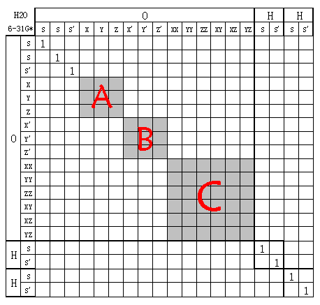

**由Mulliken布居和Lowdin布居再谈旋转不变性问题**Talking again rotation invariance of Mulliken population and Lowdin population  
  
文/Sobereva @[北京科音](http://www.keinsci.com/)   2010-Feb-20

  
  

### 前言：

最近看到两篇Mayer的讨论Lowdin布居旋转不变性问题的文章Int. J. Quant. Chem, 106, 2065-2072和CPL, 393, 209-212，受到启发，继之前写的《谈谈原子轨道朝向引起的量化计算结果与经验观念的差异》（<http://sobereva.com/52>），本文对旋转坐标问题作进一步讨论。  
  
注：本文说轨道时是指原子轨道，极小基与之对应。说原子内基函数时，则含义更为普遍，包括用了扩展基的情况，此时与原子轨道无对应关系。  
  
  

## 1. 基本概念回顾

基函数的变换可以分为线性和非线性，常见的都是线性变换，此时变换关系可以用变换矩阵X来表示。设有a基函数集a(1),a(2)...和b基函数集b(1),b(2)...变换矩阵为X；共轭矩阵为X`。则有b(i)=∑[k]X(k,i)a(k)。若有一个算符Y，a为基时叫O，即O(i,j)=<a(i)|Y|a(j)>；b为基时叫P，即P(i,j)=<b(i)|Y|b(j)>。则有P=X`OX。若有一个波函数在a为基时以向量c表示，在b为基时以c"表示，则有c=Xc"。  
  
基函数的酉变换是线性变换的特例，只有当变换前后都是正交归一集时线性变换才是酉变换，此时X是酉矩阵，即XX`=I。由∑[k]|a(k)><a(k)|=1和∑[k]|b(k)><b(k)|=1的关系可推得矩阵元X(i,j)=<a(i)|b(j)>。  
  
基函数的线性变换在量子化学计算中经常用到，例如由原来不同类型轨道变换为杂化轨道（如s、p轨道组合成sp3轨道），由扩展基变换为自然原子轨道或AOIM轨道，由非正交基函数变换为正交基，由原子基函数变换为群轨道成为分子所属点群不可约表示的基等等。本文涉及的是由分子旋转（即朝向改变）导致的基函数变换，这里只讨论笛卡尔型高斯函数为基函数的情况，如果是STO、球谐高斯函数，则实际上分子旋转引起的是其角度部分波函数原点的变化。  
  
有的量化方法有基函数线性变换不变性，例如《谈谈原子轨道朝向引起的量化计算结果与经验观念的差异》已经证明了HF方法的这个特点，在推导中只利用了线性变换的规则。而有的量化方法不具备基函数线性变换不变性，只具备酉变换不变性，Lowdin布居就是如此。  
  
一些引起基函数线性变换的操作在某些条件下可回归为酉变换，尤其是分子的旋转操作这点很重要。了解了这些条件，才能正确地使用量化方法。下面先谈谈重要的原子基函数正交性问题。  
  
  

## 2. 原子基函数的正交性

类氢原子轨道：原子内轨道都正交。  
  
STO(Slater type orbitals)：相对于类氢原子轨道修改了径向部分的形式，使其波节消失，每个STO仍对应于一个原子轨道（虽然高精度计算时也可以用多个STO展开一个原子轨道）。不同类型（指s、p、d...后同）之间的轨道都正交；相同类型不同主量子数轨道间不都正交，不正交情况例如3px与4px。  
  
球谐型GTF(Gaussian type function)：将STO的径向形式修改为了r^n*exp(-α*r^2)，与原子轨道主量子数不再相关，紧缩或弥散只取决于α值，使用扩展基时与原子轨道无一一对应关系，一般用壳层来描述，一个壳层是指结合一个特定的轨道指数的类型相同的几个基函数，在此不考虑SP壳层这样的类型混合的特例。相同壳层内的基函数都正交。不同类型的不同壳层间的基函数都正交，相同类型的不同壳层见基函数不都正交，不正交情况例如分裂价基的两套壳层间的角度部分行为相同的轨道。  
  
笛卡尔型GTF：将球谐型GTF的角度部分改为x^i*y^j*z^k形式。与球谐型GTF正交性的区别是对于d、f、g...类型的相同壳层内的基函数不都正交，例如d型的XX、YY、ZZ间不正交、f型的XXY与YZZ不正交等等。这是因为对这些情况，将重叠积分中两个笛卡尔型GTF相乘化为一个GTF后，其i、j、k项都是偶数，所以x、y、z方向积分分量都不为0，故相乘也不为0。球谐型GTF可由笛卡尔型GTF组合得到，详见《谈谈5d，6d型d壳层波函数与它们在高斯中的标识》（<http://sobereva.com/51>）和Int.J.Quant.Chem,54,83-87。  
  
在分子中，以上这些原子基函数由于原子间的重叠，导致原子间的基函数不正交。但注意对于一些半经验方法，如AM1、PM3，用了重叠矩阵元S(i,j)=δ(i,j)的近似。  
  
  

## 3. 旋转分子引起的基函数的变换

上一篇文章已提到，令坐标轴不动而旋转分子，等于令分子不动而旋转坐标轴，由于GTF与坐标轴是绑定的，所以等于对基函数进行了线性变换。变换过程并不会令原子间的基函数发生混合，也不会令不同壳层间的基函数发生混合。如果将基函数按顺序排列，则变换矩阵是对角块形。例如6-31G*（笛卡尔型GTF）的H2O分子因旋转引起的基函数线性变换矩阵X：  
  

  
图中'符号用于区分分裂价基的两个壳层。灰色区域是未知的不一定是0的值，是多少以及是不是0取决于怎么旋转。图中基函数的排序是为了紧凑，描述方便，当然实际量化程序中的基函数排序并不一定是这样，但并不会对下面的讨论结果有什么影响。  
  
现在讨论这个矩阵什么时候是酉矩阵。由于旋转不会改变基函数之间的正交性，如果之前全部原子基函数都正交，旋转后显然也都正交，毫无疑问这必然是酉矩阵。但这个条件很难满足，实际上，旋转操作的变换矩阵是酉矩阵的条件没有这么强硬。从图中可见，由于旋转只引起壳层内轨道的混合，而壳层间的矩阵元为0，所以只要每个壳层内基函数都正交，则整个变换矩阵就是酉矩阵。同原子的壳层间基函数不完全正交，以及不同原子间基函数不正交这都没有关系，在旋转操作中不会“暴露”出来。  
  
可以容易地做出证明。设图中三个灰色子矩阵分别叫A、B、C，分别对应于三个壳层内基函数的变换。假设使用的基组满足壳层内轨道正交时，则A、B、C矩阵都是酉矩阵。根据分块矩阵相乘规则，XX`的三个对角块就分别是AA`、BB`、CC`，显然都为单位矩阵，故XX`也为单位矩阵，即X为酉矩阵。  
  
前面提到了，球谐GTF在壳层内基函数正交，所以用这样基函数时X为酉矩阵，用STO、类氢原子轨道时也是。而用笛卡尔型GTF，如果涉及到d及以上角动量壳层时由于壳层内基函数不完全正交，则旋转引起的只能说是线性变换。例如上图中用的是6d轨道，壳层内不都正交，故CC`!=I，所以此时XX`!=I，若在Gaussian中加上5d关键词，即使用球谐型d轨道，则图中的变换矩阵就是酉矩阵了。  
  
  

## 4. Mulliken布居、Lowdin布居与的旋转不变性问题

Mulliken布居可以写成矩阵形式，P为密度矩阵，S为重叠矩阵，则PS矩阵的第(i,i)矩阵元就是第i个基函数的Gross原子布居数，也就是这个基函数被Mulliken布居分配到的电子数，显然∑[k∈α](PS)(k,k)就是α原子的Mulliken电荷。Lowdin布居就是做Mulliken布居之前先用Lowdin正交化方法使全部基函数之间正交化，变换矩阵为X=S^(-0.5)。设P'、C'、S'为正交化后基函数的密度矩阵、系数矩阵（只含占据轨道的展开系数，矩阵元i,j为第j个分子轨道第i个基函数系数）和重叠矩阵，则P'S'=P'=C'C'^(T)=X^(-1)CC^(T)X^(-1)^T=S^(0.5)CC^(T)S^(0.5)^T=S^(0.5)PS^(0.5)，所以S^(0.5)PS^(0.5)的第(i,i)个矩阵元就是Lowdin布居给基函数i分配的电荷。注意由于AM1、PM3等半经验方法对重叠矩阵近似为单位矩阵，此时Lowdin布居与Mulliken布居是等价的。  
  
电荷布局方法应当具备旋转不变性，否则分子一旋转，原子电荷就变了，尤其还会出现等价原子电荷不相等的情况，这是完全没有物理意义的。Mulliken布居得到的原子电荷具备旋转旋转不变性，只需证明旋转后的∑[k∈α](P'S')(k,k)与旋转前的∑[k∈α](PS)(k,k)相等即可。  
  
后面的证明需要用到如下关系：  
S'=X`SX。当X为酉矩阵时，S'^(0.5)=X`S^(0.5)X，证明见CPL,393,p209-212。  
P'=X^(-1)PX`^(-1)。当X为酉矩阵时，可进一步写为X`PX。  
  
Mulliken布居所得α原子电荷Q(α)=∑[k∈α](PS)(k,k)=∑[k∈α](X^(-1)PX`^(-1)X`SX)(k,k)=∑[k∈α](X^(-1)PSX)(k,k)。  
接下来要利用X矩阵为原子对角块矩阵的性质进行变换。上式继续写为∑[k∈α]∑[m]X^(-1)(k,m)(PSX)(m,k)=∑[k∈α]∑[m]∑[n]X^(-1)(k,m)(PS)(m,n)X(n,k)。由于只有m∈α且n∈α时式中X^(-1)(k,m)、X(n,k)才不为0，所以改写为∑[k∈α]∑[m∈α]∑[n∈α]X(n,k)X^(-1)(k,m)(PS)(m,n)，这就是求X、X^(-1)、PS三个矩阵的原子α的对角块相乘的矩阵的迹，由于X和X^(-1)的原子α的对角块相乘为单位矩阵而被消掉，所以最终得到∑[n∈α](PS)(n,n)，可见与旋转前的∑[k∈α](PS)(k,k)是等价的。这就证明了Mulliken布居得到的原子电荷具备旋转不变性。  
  
上面的证明只用了X矩阵为原子对角块的特点，而X不仅有这个特点，由于壳层间不会混合，故更进一步有壳层对角块的特点，所以可以完全相同地证明Mulliken布居分配给每个壳层的电荷不随旋转而改变。但每个壳层内，比如P壳层的X、Y、Z轨道之间经旋转是混合的，所以分给它们的电荷会经旋转而改变。但如果是绕比如Z轴旋转，则Z轨道不参与混合，X矩阵中3*3的P壳层的块就又分成了2*2的XY的块和1*1的Z的块，通过同样方法又可证明，旋转后P壳层内只有X、Y轨道上的电子数改变，但二者的总和不变；Z的电子数不变。  
  
再来考察Lowdin布居，先假设X为酉矩阵的情况，看看是否经旋转后原子电荷也不变，即能否令∑[k∈α](S'^(0.5)P'S'^(0.5))(k,k)回归到∑[k∈α](S^(0.5)PS^(0.5))(k,k)。  
Q(α)=∑[k∈α](S'^(0.5)P'S'^(0.5))(k,k)=∑[k∈α](X`S^(0.5)XX`PXX`S^(0.5)X)(k,k)=∑[k∈α](X`S^(0.5)PS^(0.5)X)(k,k)，然后如同证明Mulliken布居的过程一样，利用X可视为原子对角块矩阵特点，可写为∑[k∈α](S^(0.5)PS^(0.5))(k,k)。所以，旋转不会令Lowdin布居所得原子电荷改变。  
  
当X不为酉矩阵时，由于S'^(0.5)!=X`S^(0.5)X，上面的推导第一步就不过去。所以只有使用球谐型GTF、STO来满足旋转操作的变换矩阵为酉变换条件时Lowdin布居才有旋转不变性，而用了6d、10f这样笛卡尔型GTF基函数时则原子电荷会受分子朝向影响。由于X不仅是原子对角块更是壳层对角块矩阵，故Lowdin布居是否具有壳层上电子数的旋转不变性也依赖这个条件。  
  
以上的结论是容易在Gaussian中自行验证的。Mulliken布居是默认输出的，用iop(6/80=1)可以输出Lowdin布居。使用含d基函数的基组，随便计算一个分子（朝向不要摆正），对比加nosymm与不加nosymm（会令朝向不同）搭配5d和6d（若含f则也考虑7f与10f）的情况，就可以验证上述结论。但可能由于数值精度和舍入误差问题使结果末位有一点点差异，不应把这种情况作为不符合旋转不变性的例子。Lowdin布居尽管在5d下不符合旋转不变性，但旋转并不会令电荷变化太大，一般仅在0.01数量级以下，也可能正是因为改变的微不足道而使大家长期忽视了这个问题。而随着原子的6d、10f型轨道更多的加入基组，这个问题会变得相对更明显一些。实际上Lowdin布居提出的年代用的还多是STO基组，并没有这个问题，只是后来大家将之沿用到笛卡尔型GTF基组上，却忘了考虑这个问题。  
  
  

## 5. 基函数变换操作对Mulliken布居和Lowdin布居的一般性影响

可以将X对Mulliken布居和Lowdin布居的影响一般化考虑：X是什么样对角块矩阵决定了哪些基函数会混合，变换操作一定会使块内每个基函数的电子数发生变化；保持块内基函数电子数之和不改变，对Lowdin布居X必须是酉矩阵，而对Mulliken布居X没这个要求。X的形状影响X成为酉矩阵所用基函数条件，仅当每个块内基函数都正交时X才为酉矩阵。  
  
由此可以将问题拓展考虑。假设旋转会使同原子内的壳层混合，即令X不具备壳层对角块特征，则想让X为酉矩阵从而不令旋转改变Lowdin布居的原子电荷，则不得不使用在原子内完全正交的基函数；而Mulliken布居则可以随意选用原子基函数种类。还可以进一步考虑其它基函数变换操作而不限于分子的旋转。例如要将极小基的CO2分子中每个原子的2px和2py和2s轨道组成不正交的杂化轨道（这里不以常见的sp2方式杂化，因为三个sp2轨道间正交），则变换矩阵X对角线上除了1以外有三个3*3的块，所以这三个轨道杂化前后电子数一定会变。尽管每个原子的2px、2py、2s之间正交，但变换后的三个杂化轨道间不正交，所以小块不是酉矩阵，故而X不是酉矩阵，所以用Lowdin布居时三个杂化轨道的布居数之和不等于2px、2py和2s轨道的和。而Mulliken布居的不变性对X是不是酉矩阵没要求，所以那三个轨道杂化前后布居数总和不变。  
  
旋转不变性是个容易忽视但又重要的问题，在开发新的量化方法时，应当检验方法是否具备这个性质。在实际应用中如果发现某些方法存在这个问题，则不妨撰文讨论，以引起更多人的重视。
