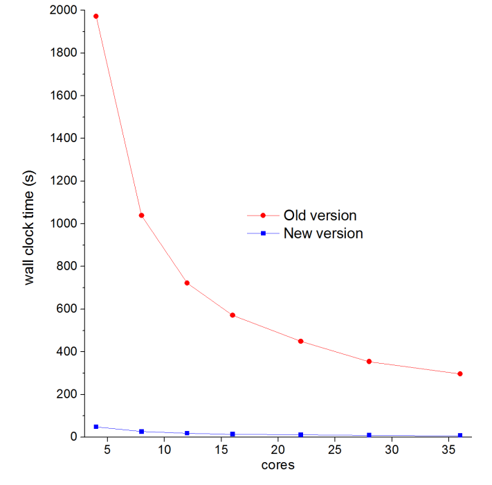
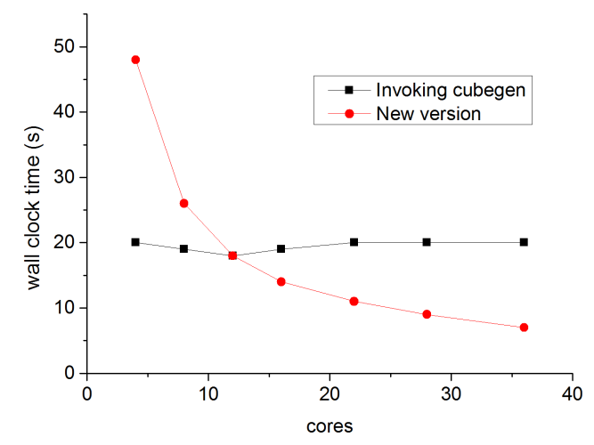
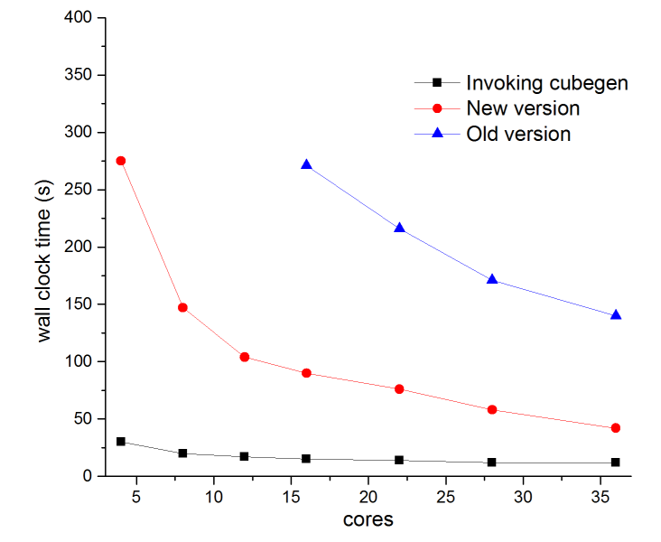

**2021-Aug-31补充**：本文提及的Multiwfn采用的新的静电势计算方法已经正式发表于Phys. Chem. Chem. Phys.期刊，请阅读《Multiwfn使用的高效的静电势算法的介绍文章已于PCCP期刊发表！》（<http://sobereva.com/614>），里面包含更多测试数据和相关事项的说明。

**Multiwfn的计算静电势的内部代码速度得到了巨幅提升！**

Internal code in Multiwfn for calculating electrostatic potential has been significantly faster!

文/Sobereva@[北京科音](http://www.keinsci.com)  2020-Jul-11

## 1 前言

Multiwfn是如今已非常流行的量子化学波函数分析工具，主页见<http://sobereva.com/multiwfn>。Multiwfn最早版本计算静电势的代码速度很慢，为了使得静电势分析相关的功能尽可能有实用性，后来Multiwfn的大部分涉及静电势分析的功能中都支持了调用cubegen算静电势，在《Multiwfn现已可以调用cubegen使静电势分析耗时有飞跃式的下降！》（<http://sobereva.com/435>）中做了专门介绍，这使得静电势计算占大头的分析的耗时甚至降低两个数量级，在速度上非常理想，但是这样做仍有不足：  
1 用户的机子必须装了Gaussian。然而很多人没钱买Gaussian，或者被Gaussian给ban了，想买也买不了。  
2 输入文件必须含有基函数信息。具体来说，fch/fchk可以直接用，如果是molden/mwfn/gms格式，也可以先用Multiwfn的主功能100的主功能2转成fch再当输入文件，这样也能调用cubegen算静电势。但如果输入文件是wfn、wfx这样的只含GTF信息的格式，就没法用cubegen加速了

最近坛友coolrainbow与我联系，提供了一套基于他开发的LIBRETA电子互斥积分库的高效的静电势计算代码，比之前版本Multiwfn内部的静电势计算代码快非常多。从2020-Jul-11版更新的Multiwfn开始，这套新代码已经植入Multiwfn用于静电势计算。Multiwfn支持的任何含有波函数信息的格式（wfn/wfx/mwfn/fch/molden/gms）都可以基于这套代码计算静电势。

## 2 速度测试

下面通过几个例子对新的、旧的Multiwfn的内部静电势计算代码，以及调用cubegen计算静电势时的计算耗时进行对比。使用2*XEON-E5 2696v3（共36核）在CentOS 7下进行测试。

RESP电荷的计算是Multiwfn中非常常用的功能，见《RESP拟合静电势电荷的原理以及在Multiwfn中的计算》（<http://sobereva.com/441>）。这里计算18-轮烯（C18H18）在def2-TZVP基组下的波函数（1062个GTF）的RESP电荷。

新的静电势计算代码比老的快约40倍！在个人的4、6核机子上，如果是老版本Multiwfn，对这样大小的波函数算RESP电荷几乎算不动，得等半个小时左右，而使用新版本后就轻轻松松了，半分多钟就能算完。

还是上面的体系和任务，下面再与调用cubegen时的耗时对比一下

虽然核数少的时候没有调用cubegen快，但对于十几核的服务器，新代码和cubegen计算速度就基本没差别了，在几十核的服务器上速度甚至比cubegen还要明显更快！注：G16的cubegen计算静电势名义上是支持并行的，但计算拟合静电势电荷时，拟合点的位置是不规则排布的，这种情况下cubegen基本没并行效果，在笔者来看这是Gaussian开发者考虑不周所致，没有把这种场合并行化做好。

对于用主功能12做分子表面静电势分析，加速的效果和上面也是相同的。

下面是用主功能5计算静电势格点数据速度的对比，对象是多巴胺（22个原子，6-311G(d,p) 基组，440 GTF），共计算53.8万个点

由于Multiwfn老版本的计算静电势格点数据的功能专门对这种任务做了格点排布层面的特殊优化，而新的静电势计算代码是对每个点独立计算的（即没有根据格点的矩形分布特征做额外特殊优化），所以速度提升幅度没拟合静电势电荷的情况那么夸张，但仍快了两倍左右。由于cubegen在计算格点数据时应该是针对格点分布做了充分的优化，而且考虑了壳层/基函数的收缩来提升代码效率（而Multiwfn的静电势代码是纯粹基于GTF做的），因此耗时明显更低，并且此时有并行效果（4核时30秒，16核15秒）。

## 3 总结&其它

目前Multiwfn新版本对于静电势计算对规则是这样的：  
1 如果输入文件是fch/fchk/chk，并且settings.ini里如实定义了本机里cubegen的位置，cubegen会被自动调用算静电势（不是所有算静电势的情况都会调用，支持的任务类型在<http://sobereva.com/435>里说了）

2 对于其它情况，Multiwfn自动使用coolrainbow开发的新的代码计算静电势。但如果想改为老版本代码，把settings.ini里的iESPcode参数从默认的2改为1即可。

如果你是Gaussian用户且使用的是核数较多的服务器，而且做的和静电势有关的分析不涉及计算静电势格点数据（比如不是用主功能5，或者做静电势盆分析之类），那么没必要调用cubegen，直接用Multiwfn自己的静电势代码计算即可。

**重要提示**：测试发现，Windows版Multiwfn做静电势相关的计算时，当并行核数（settings.ini里的nthreads控制）超过10左右，继续增加核数会导致耗时不降反升，核数特别多的话甚至卡住不动。因此若设的nthreads大于10，Multiwfn会自动把计算静电势部分的并行核数降为10。如果你的机子有更多核且想充分发挥性能，应当改用Linux版。Multiwfn的其它功能没这个问题。

调用cubegen计算静电势、基于Multiwfn的新的和旧的静电势计算代码这三种情况下静电势计算结果会有细微差别，但完全是可忽略程度，因此和老版本结果仍然完全有可比性。

如果大家发现新版本Multiwfn有任何bug，欢迎反馈。

由于这部分新代码的引入，Multiwfn的编译方式略有改变。目前Multiwfn源代码包里关于新的静电势计算代码有两个版本：  
(1)较快的版本：这是Multiwfn官网上预编译版在编译时用的，上面的测试也是对于这个版本而言的。缺点是编译耗时很高，基于这个版本的Multiwfn完整编译需要20分钟左右。  
(2)较慢的版本：计算静电势速度不到上面的一半，但编译耗时低几倍。  
用户可以自行决定基于哪个静电势代码编译Multiwfn。如果你不怎么需要计算静电势，编译时可以基于较慢的版本编译。默认是编译较慢的版本，要编译较快的版本请注意阅读源代码包里的说明文件。

## 4 致谢

在此文最后，笔者诚挚感谢coolrainbow提供基于LIBRETA库的新的静电势计算代码。如果静电势分析不是调用的cubegen，且iESPcode是默认的2，即使用的是这套新的代码算的静电势，在写文章的时候，在引用Multiwfn原文及How to cite Multiwfn.pdf文档里提到的相关文章的同时，也建议引用coolrainbow开发的LIBRETA电子积分库的原文：Jun Zhang, J. Chem. Theory Comput., 14, 572-587 (2018)。

**2021-Aug-31更改**：由于介绍此静电势算法以及在Multiwfn中的实现的文章已专门发表在Phys. Chem. Chem. Phys. DOI: 10.1039/d1cp02805g，因此目前请按照《用Multiwfn使用的高效的静电势算法的介绍文章已于PCCP期刊发表！》（<http://sobereva.com/614>）文末的要求引用Phys. Chem. Chem. Phys.上的文章。
