**使用Multiwfn绘制NMR谱**

Using Multiwfn to plot NMR spectra

文/Sobereva@[北京科音](http://www.keinsci.com)

First release: 2020-Oct-8   Last update: 2023-Jan-16

**摘要**：流行的波函数分析程序Multiwfn（<http://sobereva.com/multiwfn>）也有强大、灵活、易用的光谱绘制功能，支持绘制UV-Vis、ECD、IR、Raman、VCD、ROA，见《使用Multiwfn绘制红外、拉曼、UV-Vis、ECD、VCD和ROA光谱图》（<http://sobereva.com/224>）。从Multiwfn 3.7版开始，还支持了NMR谱的绘制，在此文就结合具体例子进行介绍。至于NMR光谱计算方面的知识，在此文不做展开介绍，在北京科音的初级和中级量子化学培训班里都有非常详细讲解（见北京科音官网<http://www.keinsci.com>的“科研培训”栏目），欢迎参加。

## 1 关于NMR谱和Multiwfn的绘制功能

NMR（核磁共振）谱是化学领域最重要的谱之一，能够展现原子所处的化学环境。大多数主流量子化学程序都有计算各个原子核位置的磁屏蔽张量的功能。磁屏蔽张量的对角元的平均值对应于各向同性磁屏蔽值（σiso，以下简称为磁屏蔽值），令参考物质中相应元素的原子的σiso减去当前化学物质中的原子的σiso，就是一般所说的化学位移。将化学位移用洛伦兹函数进行展宽，就可以得到和实验对照的NMR图谱（本文不考虑核自旋-自旋耦合造成的峰的分裂问题）。如果体系有多个构象，而且构象间转变速率较快，那么实际观测到的NMR峰的位置将是各个构象的权重平均。另外，如果有n个同元素的原子的磁屏蔽值非常接近，应当将它们视为是简并的，当做强度（简并度）为n的一个信号来对待。

Gaussian是计算NMR最常用的量子化学程序，其御用的图形界面GaussView可以载入Gaussian的NMR任务的输出文件绘制NMR谱，但有明显局限性：  
(1)GaussView 6之前的版本无法得到NMR曲线图，而从6开始，虽然能给出NMR曲线，但是却没法导出曲线数据（至少对6.0.16版而言），因此无法放到诸如Origin之类的程序里进一步调整作图效果  
(2)绘制NMR谱的时候不支持构象权重平均，也没法对特定一批原子的磁屏蔽值取平均  
(3)只能对Gaussian的输出文件进行绘制  
(4)收费，而且不便宜

而使用Multiwfn绘制NMR则有很多好处  
(1)开源免费  
(2)不仅支持Gaussian，还可以基于ORCA、CP2K、BDF输出的文件绘制，输入文件例子见Multiwfn手册3.13.5节。而对于其它程序的用户，还可以自行把计算结果整理成Multiwfn支持的通用的记录磁屏蔽值的格式从而用Multiwfn绘图（例子见自带的examples\spectra\NMR\general.txt文件）  
(3)支持绘制构象权重平均谱，也可以同时绘制多个体系  
(4)可以对指定的一批原子的磁屏蔽值取平均（例如甲基的三个氢）  
(5)各个峰对应的原子序号可以直接标在图上，标注的风格可调  
(6)可以基于标度法绘制NMR谱。标度法是极为重要的NMR的计算方法，详见《谈谈如何又好又快地计算NMR化学位移》（<http://sobereva.com/354>）  
(7)曲线数据、离散竖线数据可以用选项2导出，便于在第三方程序如Origin里绘制以更灵活地调整作图设置  
(8)内置了很常用的NMR计算级别对应的TMS的C、H磁屏蔽参考值，以及标度法的参数  
(9)作图选项可以很灵活的控制，比如曲线的颜色和粗细、是否显示格子/曲线/竖线、峰的半高全宽(FWHM)、判断简并的阈值、横/纵坐标轴范围等等  
(10)作图选项可以保存和导入，免得每次作图都重新设置一遍。具体来说，在界面里输入s代表保存设置到某文件，输入l代表从某文件中载入设置  
(11)可导出的图片格式非常丰富，如tif、png、gif等位图格式（尺寸通过settings.in文件里的graph2Dsize参数设置），以及pdf、svg、wmf、eps等矢量图格式。笔者最建议用pdf，线条非常光滑、可无损缩放

一般来说，对单一结构，绘制NMR谱的流程是这样：  
(1)先用Gaussian等程序做NMR任务计算  
(2)用Multiwfn载入输出文件，进入主功能11，选择NMR  
(3)通过选项6选择考虑的元素是什么  
(4)通过选项7设置怎么得到化学位移，是基于参考物质的值求差计算，还是用标度法  
(5)选择0绘制光谱检查效果。如果有不满意的，再通过界面上的选项调整  
(6)选择1把光谱导出成图像文件（导出的格式可通过界面里的选项-3选择）

下面，笔者就通过一系列实例演示如何通过Multiwfn方便灵活地针对各种情况绘制NMR谱，请读者务必举一反三。本文只涉及最常见的1H和13C谱，对于其它元素的NMR谱也可以用和本文相同的做法绘制。下面例子中涉及的文件有的在Multiwfn自带的examples\spectra\NMR目录下直接提供了，其它的可以在这里下载：<http://sobereva.com/attach/565/file.zip>。本文的计算都使用Gaussian 09 D.01版。Multiwfn对应于官网上最新版本的情况。

Multiwfn可以在官网<http://sobereva.com/multiwfn>免费下载。如果不了解此程序，建议参看《Multiwfn入门tips》（<http://sobereva.com/167>）和《Multiwfn FAQ》（<http://sobereva.com/452>）。

## 2 例1：使用常规方法计算和绘制二乙烯酮的1H和13C NMR谱

二乙烯酮（diketene）的结构，以及它在氘代氯仿环境中的H和C的实验化学位移如下所示

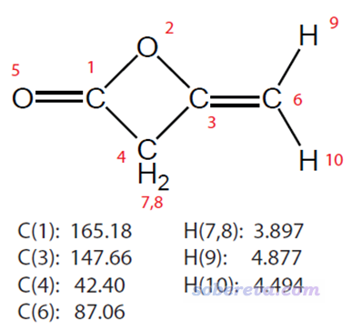

按照常规方法计算1H和13C NMR的话，需要先计算四甲基硅烷(TMS)的氢和碳的磁屏蔽值，并且其优化的级别和计算NMR的级别，包括方法、基组、溶剂模型，必须和计算自己的物质完全相同。J. Chem. Theory Comput., 10, 572 (2014)的有机体系的NMR测试体现出在Gaussian直接支持的普通泛函里B97-2表现较好，所以本文用它来算NMR，基组使用足够好的def2-TZVP（实际上用pcSseg-1基组算NMR与之精度差不多但便宜得多，要用的话需要自行去BSE基组数据库拷定义）。在NMR计算时都使用SMD表现氯仿环境，不熟悉溶剂模型的话看《谈谈隐式溶剂模型下溶解自由能和体系自由能的计算》（<http://sobereva.com/327>）。优化不需要用大基组，见《浅谈为什么优化和振动分析不需要用大基组》（<http://sobereva.com/387>），此例就用def2-SVP。优化用的泛函就用常规的B3LYP，对于当前情况没有任何问题，更多信息见《谈谈量子化学研究中什么时候用B3LYP泛函优化几何结构是适当的》（<http://sobereva.com/557>）。由于氯仿这样极低极性溶剂对结构优化没什么影响，因此为了省时在优化时就没用。

TMS以及二乙烯酮的优化任务、NMR任务的输出文件都在本文文件包里提供了。在TMS_NMR.out中可看到  
      2  C    Isotropic =   186.8707   Anisotropy =     7.5367  
和  
       3  H    Isotropic =    31.5143   Anisotropy =     9.1687  
即曰参考物质的13C和1H的磁屏蔽值分别为186.8707和31.5143 ppm，把这个值记住。由于TMS是Td点群的，计算前笔者也对称化过结构，故所有氢都等价、所有碳都等价，所以不需要再看其它的氢和碳的值。

启动Multiwfn，然后输入  
diketene_NMR.out  //本文文件包里的二乙烯酮的NMR任务的输出文件  
11  //绘制光谱  
7  //NMR  
现在就进入了NMR绘制界面了。

我们先绘制碳谱。从屏幕上的选项6的提示可见，当前默认就是只考虑碳，所以不用改这项。如果现在直接选择选项0绘图，绘制的是各个碳的磁屏蔽值。但我们想获得能与实验相对比的化学位移谱图，因此现在选择选项7来设置将磁屏蔽值转化为化学位移的方式。之后我们选1 Set reference shielding value to determine chemical shift，代表提供参考值来得到化学位移。之后程序提示你输入参考物质的磁屏蔽值，我们输入前面得到的TMS的C的磁屏蔽值186.8707即可（Multiwfn程序的设计超级贴心，已经把B97-2/def2-TZVP等常用的NMR计算级别在氯仿下的TMS参考值内置了，所以如屏幕所示，这一步如果我们直接输入a来选择与当前情况对应的B97-2/def2-TZVP G09的值也行，和手动输入186.8707完全等价）。

现在磁屏蔽值已经转化成了化学位移了，我们选择选项0绘图，得到下图

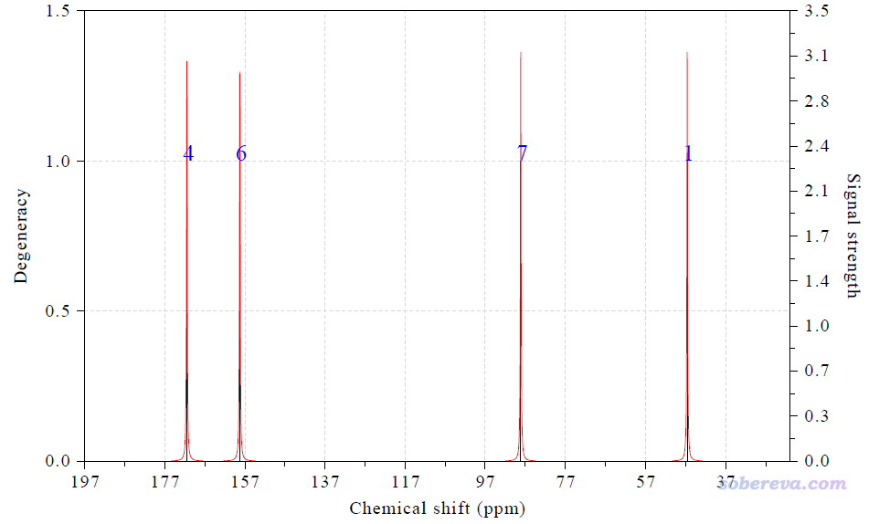

与此同时，在文本窗口还给出了具体数值：

Term:    1   Chemical shift:    46.583 ppm   Atom:    1(C )  
 Term:    2   Chemical shift:   171.456 ppm   Atom:    4(C )  
 Term:    3   Chemical shift:   158.244 ppm   Atom:    6(C )  
 Term:    4   Chemical shift:    88.132 ppm   Atom:    7(C )

上图中，黑色竖线的横坐标位置对应于化学位移值，竖线高度对应于左侧的坐标轴，即简并度。因为当前所有碳的化学位移相差都较明显，所以简并度都为1。图中红线是将黑色竖线用洛伦兹函数进行展宽得到的，数值对应于右边的坐标轴，含义是NMR的信号强度。图中蓝色的数字是相应的峰对应的碳原子在当前体系中的序号（和GaussView里看到的序号一致）。

这四个碳的化学位移的实验值从小到大是42.40、87.06、147.66、165.18 ppm，而上面给出的计算值是46.58、88.13、158.24、171.46 ppm，可见有的和实验相符很好，有的差异大一些（有的原子就是难算准，想要更准的话，考虑用专为NMR优化的KT1泛函算，Dalton程序支持；也可以用耦合簇算NMR，Dalton和CFOUR程序支持）。

下面我们绘制1H NMR谱。输入以下内容  
6  //选择被考虑的元素  
H  //氢  
7  //选择确定化学位移的方式  
1  //输入参考值  
31.5143  //之前计算TMS得到的氢的磁屏蔽值。这里输入a也是等效的，因为这本身就是内置的值  
0  //绘制谱图  
现在看到下图

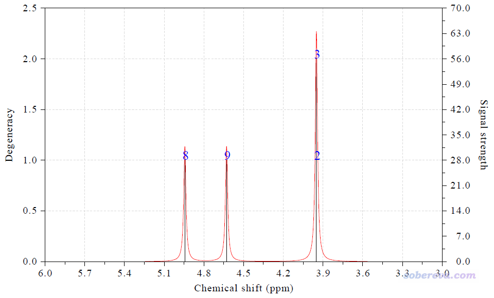

屏幕上显示的具体化学位移值：

Term:    1   Chemical shift:     3.950 ppm   Atom:    2(H )    3(H )  
 Term:    2   Chemical shift:     4.944 ppm   Atom:    8(H )  
 Term:    3   Chemical shift:     4.629 ppm   Atom:    9(H )

由于体系是Cs对称性的，在镜面两侧的2H和3H化学环境完全相同，所以化学位移也精确相同，故被视为了简并，因此上图中黑色竖线高度是其它的两倍。上面三类氢的实验的1H的化学位移分别是3.897、4.877、4.494 ppm，计算值与之相比差异分别是+0.053、+0.067、+0.135 ppm，误差不大，结果理想。

如果大家想修改作图效果，用屏幕上的相应选项即可，文字提示得都很明白，若有看不明白的试试便知，有些在Multiwfn手册的3.13.5节有详细解释。如果你想把各个原子的磁屏蔽值和以当前方式确定的化学位移都导出，可以选选项-2，会在当前目录下输出NMRdata.txt，内容如下，其中Shielding(iso)就是Gaussian输出文件里的原子的磁屏蔽值。

    Atom       Shielding(iso)      Chemical Shift  
     2(H )          27.564                3.950  
     3(H )          27.564                3.950  
     8(H )          26.570                4.944  
     9(H )          26.886                4.629

## 3 例2：乙醛的1H NMR谱

这一节我们绘制乙醛的1H NMR谱。这个例子主要是让大家注意有些原子的磁屏蔽值要取平均的问题。使用上一节的计算方法产生的乙醛的NMR任务的输出文件是examples\spectra\NMR\Acetaldehyde.out，体系结构如下

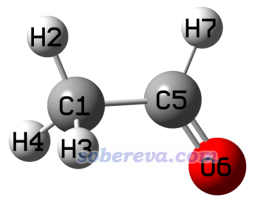

由于甲基的旋转势垒非常低，所以在实际环境中甲基的旋转频率非常高，1H NMR实验分辨不了甲基上的三个氢的信号，它们在实验谱上一起对应同一个峰。而由于我们计算乙醛用的结构是Cs对称性的，所以H2与H3和H4的磁屏蔽值不同。因此我们在绘制NMR谱之前，必须将它们的磁屏蔽值取平均。

启动Multiwfn，然后输入  
examples\spectra\NMR\Acetaldehyde.out  
11  //绘制光谱  
7  //NMR  
6  //选择被考虑的元素  
H  //氢  
7  //选择确定化学位移的方式  
1  //输入参考值  
a  //用内置的G09下用B97-2/def2-TZVP在SMD表现的氯仿环境下算的TMS的值，优化级别也和当前例子一样  
10  //对某些原子取平均  
2-4  //甲基上的H2、H3、H4（序号也可以不连续）  
0  //绘制谱图  
此时看到下图

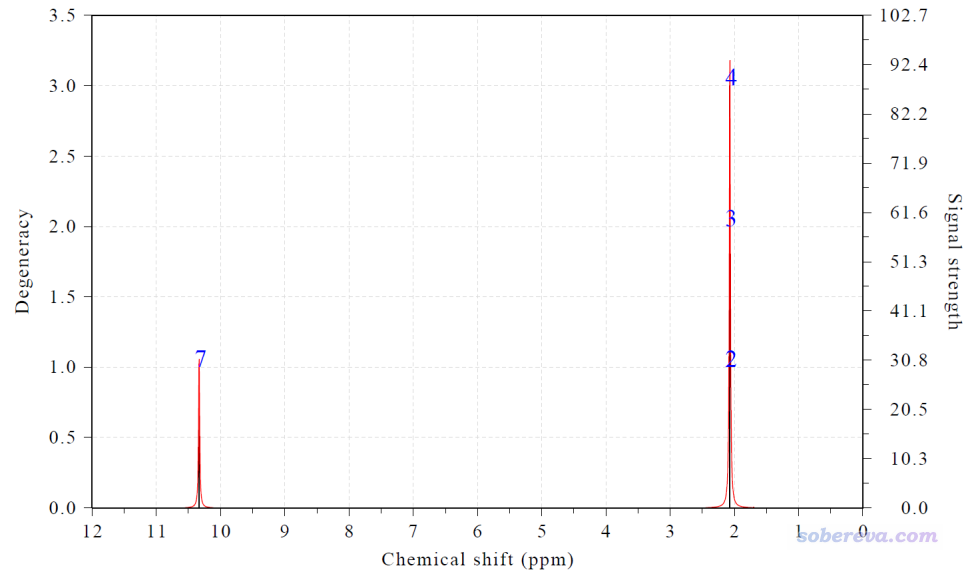

屏幕上输出的信息为  
Term:    1   Chemical shift:     2.070 ppm   Atom:    2(H )    3(H )    4(H )  
 Term:    2   Chemical shift:    10.333 ppm   Atom:    7(H )

氯仿下乙醛的甲基氢的化学位移实验值为2.12 ppm，我们如上得到的是2.07 ppm，和实验相符很好。

## 4 例3：基于标度法绘制2,5-降冰片二烯的NMR谱

这一节我们基于标度法（scaling method）得到的化学位移绘制2,5-降冰片二烯（2,5-norbornadiene）的1H和13C NMR谱。此体系的结构和氯仿下的实验化学位移如下

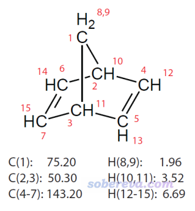

标度法引入了前人事先拟合的斜率和截距参数，在很便宜的级别下就能得到系统性误差较小的化学位移值，多数情况下比用前面的标准方法得到的绝对误差明显更小，而且还不需要自行先计算参考物质的磁屏蔽值，因此还更为方便。如果没看过此文的话一定要仔细看：《谈谈如何又好又快地计算NMR化学位移》（<http://sobereva.com/354>）。此例用的计算级别是标度法中又好又便宜的一种，即用B3LYP/6-31G*在气相下优化，然后用B3LYP/6-31G*结合SMD表现的氯仿环境算NMR。此情况对于1H，拟合的斜率为-1.0157、截距为32.2109，而对于13C，斜率为-0.9449、截距为188.4418。这个级别对应的2,5-降冰片二烯的NMR任务的输出文件为本文文件包里的2,5-norbornadiene_NMR.out。

启动Multiwfn，然后输入  
norbornadiene_NMR.out  
11  //绘制光谱  
7  //NMR  
7  //选择确定化学位移的方式  
2  //设置标度法的斜率和截距  
-0.9449,188.4418  //用于13C NMR的斜率和截距。这一步也可以直接输入a来使用内置的当前级别的斜率和截距值（真贴心！）  
0  //绘图  
得到的图像如下

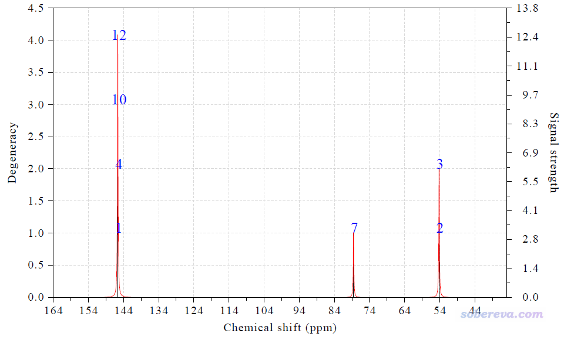

文本窗口显示的化学位移值如下

Term:    1   Chemical shift:   145.622 ppm   Atom:    1(C )    4(C )   10(C )  
 12(C )  
 Term:    2   Chemical shift:    54.211 ppm   Atom:    2(C )    3(C )  
 Term:    3   Chemical shift:    78.544 ppm   Atom:    7(C )

和前面图中的实验值相比，三种碳的误差分别为2.42、3.91、3.34 ppm，能有这样的结果是比较理想的。

再来绘制1H的NMR谱，依次输入  
6  //选择考虑的元素  
H  //氢  
7  //选择确定化学位移的方式  
2  //设置标度法的斜率和截距  
-1.0157,32.2109  //也可以直接输入a  
0  //绘图  
为避免啰嗦，结果就不在这里展示了。

## 5 例4：绘制缬氨酸的构象权重平均的1H NMR谱

本例演示如何在Multiwfn中绘制各个构象以及构象权重平均的NMR谱，体系的某些原子在不同构象下的化学位移往往明显不同。构象的分布比例可以通过《根据Boltzmann分布计算分子不同构象所占比例》（<http://sobereva.com/165>）介绍的做法计算，在需要获得各个构象的自由能，自由能的计算看《谈谈隐式溶剂模型下溶解自由能和体系自由能的计算》（<http://sobereva.com/327>）和《使用Shermo结合量子化学程序方便地计算分子的各种热力学数据》（<http://sobereva.com/552>）。如果你不知道体系都有什么可能的构象的话，可以用免费灵活的Molclus程序做构象搜索，见官网<http://www.keinsci.com/research/molclus.html>。

已知缬氨酸在水中有如下两种构象，笔者之前计算出的构象分布比例也给出了。本例我们要绘制它的构象权重的1H NMR谱

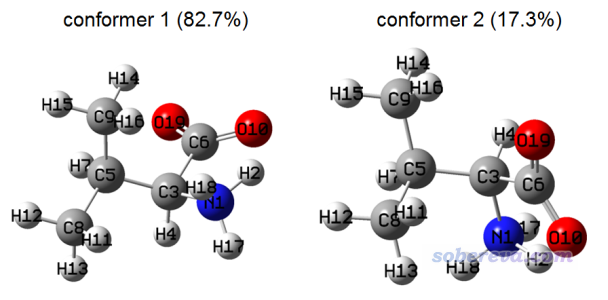

此体系是有现成的重水下的实验NMR谱的，见<https://hmdb.ca/spectra/nmr_one_d/1582>，我们要与实验谱进行对比。在重水中，质子化的氨基的氢会被重水中的重氢所取代，因此这些氢是没有NMR信号的，在绘图的时候需要消除掉，具体来说就是在Multiwfn中将这些氢的强度值设为0（默认是1）。另外，如前所述，还需要将每个甲基的氢的磁屏蔽值取平均。

Multiwfn的examples\spectra\NMR\valine目录下的conf1.out和conf2.out是上面图中的两个构象在B97-2/def2-TZVP下做的NMR任务的输出文件，几何结构是在B3LYP-D3(BJ)/6-311G**下进行优化的，这两个任务都用了IEFPCM模型表现了水环境。TMS也必须在这个级别下计算，相应的NMR任务输出文件是此目录下的TMS.out，可见其中氢的磁屏蔽值是31.8294 ppm。

为了绘制构象权重的NMR谱，需要创建一个含有每个构象NMR任务输出文件的文本文件，里面也写上构象的权重（0至1之间，总和必须为1），文件名要么是multiple.txt，要么末尾是_multiple.txt。比如我们创建valine_multiple.txt，内容如下  
examples\spectra\NMR\valine\conf1.out 0.825  
 examples\spectra\NMR\valine\conf2.out 0.175

注意，如果你用的是Linux版Multiwfn，路径应当用反斜杠，并且文件名必须用双引号扩住，即写为：  
"examples/spectra/NMR/valine/conf1.out" 0.825  
 "examples/spectra/NMR/valine/conf2.out" 0.175

启动Multiwfn后输入  
valine_multiple.txt  
11   //绘制光谱  
7   //NMR  
6   //设置被考虑的元素  
H   //氢  
7   //设置化学位移的计算方式  
1   //设置参考值  
31.8294  //来自TMS.out  
10   //化学等价原子取平均  
11-13   //甲基上的三个氢的序号  
10   //化学等价原子取平均  
14-16   //另一个甲基上的三个氢的序号  
11  //设置某些原子的强度值  
2,17,18  //质子化氨基上的三个氢的序号  
0  //强度设为0，即它们在谱图中将不可见  
0  //绘制NMR  
此时看到下图

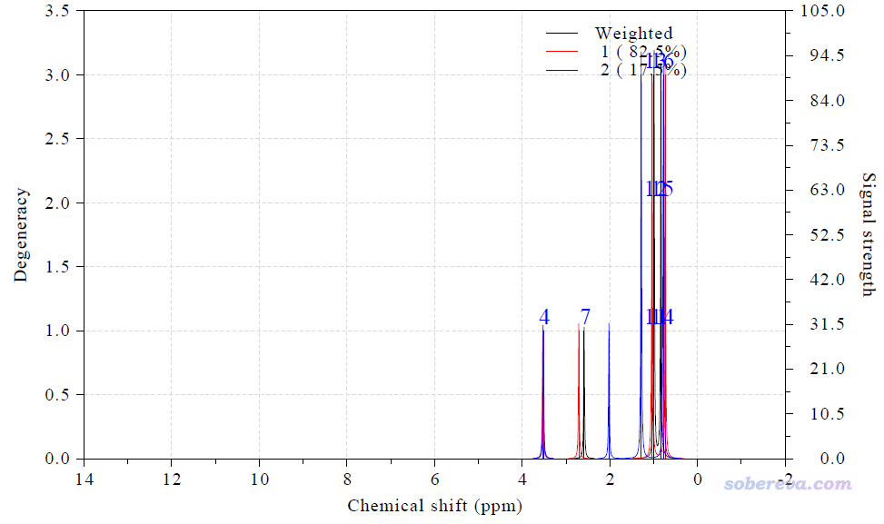

图中黑线是权重的NMR谱，红线和蓝线分别是两个构象的NMR谱。此时在文本窗口还输出了两个构象，以及构象权重平均的化学位移，如下所示。Strength是强度值，可见H2、H17、H18的强度已经被设为了0，而每个甲基的三个氢都被合并为了一项，强度为3，相当于简并度为3。

 System    1:  
  Term:    1   Chemical shift:    11.503 ppm   Atom:    2(H ) Strength: 0.000  
  Term:    2   Chemical shift:     3.530 ppm   Atom:    4(H ) Strength: 1.000  
  Term:    3   Chemical shift:     2.710 ppm   Atom:    7(H ) Strength: 1.000  
  Term:    4   Chemical shift:     1.038 ppm   Atom:   11(H )   12(H )   13(H ) S  
 trength: 3.000  
  Term:    5   Chemical shift:     0.741 ppm   Atom:   14(H )   15(H )   16(H ) S  
 trength: 3.000  
  Term:    6   Chemical shift:     4.052 ppm   Atom:   17(H ) Strength: 0.000  
  Term:    7   Chemical shift:     3.898 ppm   Atom:   18(H ) Strength: 0.000

 System    2:  
  Term:    1   Chemical shift:    11.223 ppm   Atom:    2(H ) Strength: 0.000  
  Term:    2   Chemical shift:     3.519 ppm   Atom:    4(H ) Strength: 1.000  
  Term:    3   Chemical shift:     2.023 ppm   Atom:    7(H ) Strength: 1.000  
  Term:    4   Chemical shift:     0.780 ppm   Atom:   11(H )   12(H )   13(H ) S  
 trength: 3.000  
  Term:    5   Chemical shift:     1.286 ppm   Atom:   14(H )   15(H )   16(H ) S  
 trength: 3.000  
  Term:    6   Chemical shift:     4.400 ppm   Atom:   17(H ) Strength: 0.000  
  Term:    7   Chemical shift:     3.789 ppm   Atom:   18(H ) Strength: 0.000

 Weighted data:  
  Term:    1   Chemical shift:    11.454 ppm   Atom:    2(H ) Strength: 0.000  
  Term:    2   Chemical shift:     3.528 ppm   Atom:    4(H ) Strength: 1.000  
  Term:    3   Chemical shift:     2.590 ppm   Atom:    7(H ) Strength: 1.000  
  Term:    4   Chemical shift:     0.993 ppm   Atom:   11(H )   12(H )   13(H ) S  
 trength: 3.000  
  Term:    5   Chemical shift:     0.836 ppm   Atom:   14(H )   15(H )   16(H ) S  
 trength: 3.000  
  Term:    6   Chemical shift:     4.113 ppm   Atom:   17(H ) Strength: 0.000  
  Term:    7   Chemical shift:     3.879 ppm   Atom:   18(H ) Strength: 0.000

上面的NMR谱还不太理想，横坐标范围太宽，而且图例挡住了谱图。因此我们做一些调整。接着输入  
3   //修改横坐标范围  
4,0,0.5  //范围从4到0，每0.5 ppm绘制一个标签  
12  //不显示竖线以使得图像更简洁  
18  //其它绘图设定  
5  //设置图例的横坐标位置  
1300  //让图例的横坐标位置比默认的更靠左。默认值是2200，数值越小就越靠左  
0  //返回  
0  //重新作图  
此时图像如下，非常干净清楚

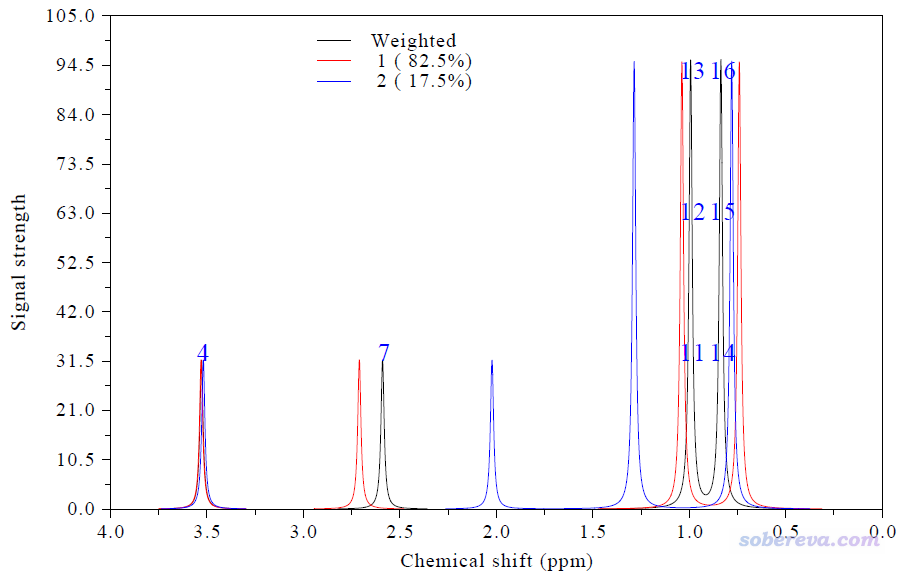

由图可见，H4的化学位移几乎完全不受构象影响，而H7，以及甲基氢，都受构象影响很大，故必须考虑构象的权重平均。

此体系的重水下的1H NMR实验谱如下

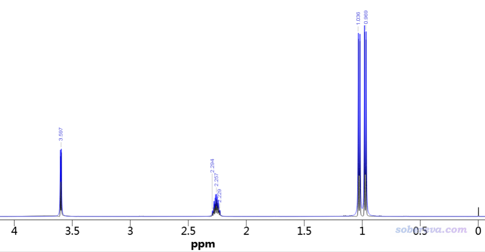

忽略实验谱中核自旋-自旋耦合效应造成的峰的分裂现象，我们得到的构象权重谱和实验谱相对照时基本特征都能吻合。特别是实验谱在1 ppm的地方有两个峰，我们的谱图也有这个特征。不过，实验谱在2.3 ppm有峰，而我们谱图的相应的峰位置在2.59 ppm，相差稍微多一些。这较大可能是因为计算出的构象分布比例还不是特别准确，构象分布对这个峰的位置影响极大。构象1和构象2的相应的峰位置分别是2.71和2.02 ppm（从Multiwfn的文本窗口的信息可见），因此构象2占的比例越大，这个峰的化学位移就越低。

顺带一提，利用当前界面的选项17的子选项2，可以要求只显示权重的谱，或者只显示两个构象各自的谱。

可以在当前界面里输入s将作图设置保存到一个文本文件中，以后重新作图时进入主功能11后就可以输入l从指定的文件中恢复作图设定。但对原子屏蔽值求平均、设置原子的强度值的操作需要每次重新做。

## 6 例5：同时绘制多个体系的NMR谱

Multiwfn中还可以同时绘制多个体系的NMR谱，有个前提是所有体系的原子数必须相同。本例我们把上一节的两个缬氨酸构象的NMR谱绘制到一起。

创建一个文本文件，文件名要么是multiple.txt，要么末尾是_multiple.txt。我们创建的multiple.txt的内容如下，每一行是一个NMR任务的输出文件路径，之后是图例文字  
examples\spectra\NMR\valine\conf1.out conformer 1  
 examples\spectra\NMR\valine\conf2.out conformer 2

启动Multiwfn，载入multiple.txt，然后按照前面例子的过程照常绘制，就可以得到下图，可见每个构象的每个峰对应的原子序号都标注上了，具体的峰位置在文本窗口里也都给出了。绘制此图所有要敲入的命令我在examples\spectra\NMR\valine\drawmulti.txt中也给出了，大家可以在载入输入文件后把此文件里的命令直接复制到Multiwfn窗口里。

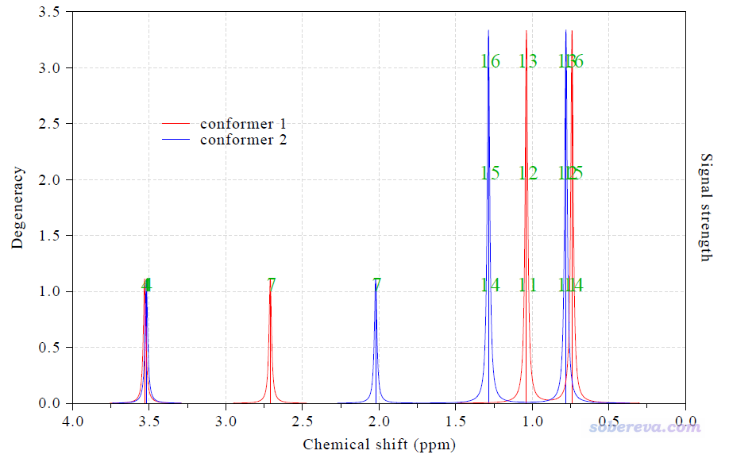

## 7 总结

本文介绍并演示了Multiwfn绘制NMR谱的功能，从本文的例子可见Multiwfn的这个功能非常方便灵活，一些地方设计得很贴心，考虑得很周到，鼓励大家在以后量子化学研究NMR中使用。此功能还有很多其它选项在上面的例子里没有提及，建议大家仔细把界面里的选项都仔细看一遍，以了解Multiwfn在绘制时都能做哪些设置。

本文只用Gaussian的输出文件作为了示例，对于ORCA用户，在Multiwfn中绘制NMR的操作是完全一样的，用ORCA的NMR任务的输出文件即可。ORCA做NMR任务的关键词很简单，比如! B3LYP/G 6-31G* NMR cpcm(chloroform)就代表用B3LYP/6-31G*在CPCM隐式溶剂模型表现的氯仿环境下做NMR计算。CP2K用户通过Multiwfn绘制NMR谱要用NMR计算产生的.data文件作为输入文件。也别忘了，如前所述，Multiwfn绘制NMR的功能支持通用的输入格式，因此如果大家是Dalton、GAMESS-US、NWChem、Q-Chem、Molpro、Dirac等其它量子化学程序的用户，乃至第一性原理程序的用户，也是可以靠Multiwfn绘制NMR谱的。
