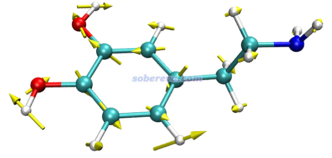
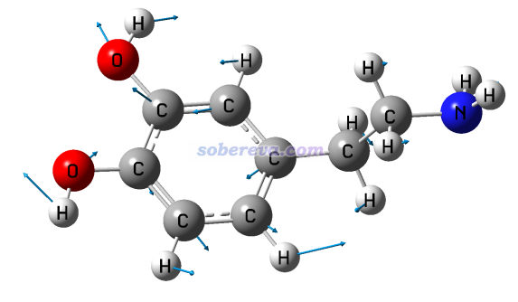
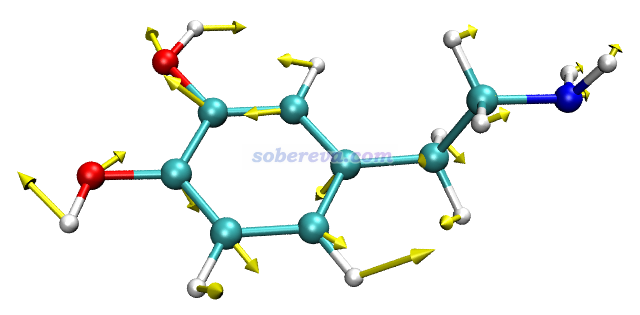

**在VMD中绘制Gaussian计算的分子振动矢量的方法**

Method for plotting molecular vibrational vectors calculated by Gaussian in VMD

文/Sobereva@[北京科音](http://www.keinsci.com)

 First release: 2020-Sep-8    Last update: 2024-Feb-4

Gaussian用户观看freq任务产生的振动矢量一般都是通过GaussView看（虽然也有ChemCraft等其它一些程序也可以看）。然而，起码对于GaussView 6来说，GaussView显示振动矢量的一个很大不足是箭头太细，而且头部不够粗，导致有时候都看不清楚，放在文章里不够美观。另外，GaussView绘制分子结构的作图选项不够灵活，而且还收费。VMD是极其流行的化学体系可视化程序，免费、灵活、图像效果好，本文介绍如何通过笔者写的VMD作图脚本非常方便地绘制Gaussian的振动分析任务产生的振动矢量。VMD可以在<http://www.ks.uiuc.edu/Research/vmd/>免费下载。

在这里下载笔者编写的绘图脚本和示例文件：<http://sobereva.com/attach/567/file.zip>。此脚本至少对于目前撰文时的VMD正式版中最新的1.9.3、Gaussian 09和16是完全适用的。

这里以绘制多巴胺的振动矢量为例进行演示。把文件包里的dopamine.out放到VMD目录下，这是多巴胺的Gaussian的freq任务的输出文件。然后我们得把这个.out文件转化成一个VMD可以认的结构文件的格式，比如可以把此文件载入GaussView，然后另存为.pdb或.mol2文件。也可以下载Multiwfn（<http://sobereva.com/multiwfn>），启动Multiwfn后载入此文件，然后选主功能100的子功能2，通过相应选项导出为.pdb或.xyz文件。

把文件包里的drawarrow.tcl和GauNorm.tcl都放到VMD目录下，然后用文本编辑器打开GauNorm.tcl，把开头的set filename后面的文件名改为dopamine.out。之后启动VMD，把多巴胺的结构文件载入VMD，然后在文本窗口输入source GauNorm.tcl执行此脚本，此时振动矢量信息就被读入了，与此同时定义了名为norm的绘制振动矢量的命令。之后在VMD的文本窗口输入比如norm 4，就可以把4号振动模式通过箭头画出来。

norm后面还可以接第2个参数，用来设置箭头长度是正则矢量的几倍，数值越大箭头越长，默认是3。norm后面还可以接第3个参数，用来设置箭头的半径，默认为0.05。比如norm 5 6 0.07就代表用6倍长度、0.07的半径绘制第5个振动矢量。默认是用黄色绘制箭头，如果想用别的颜色，把GauNorm.tcl中的draw color后面的yellow改成其它颜色名，比如cyan。

此例输入norm 17 5，然后令分子以CPK方式显示（在Graphics - Representation里把Drawing method改为CPK，再把Sphere Scale设为0.6），效果如下，可见非常理想！和GaussView显示的相对比，可见展现的信息是相同的，而GaussView画的箭头相比之下明显太小气了。

注意GauNorm.tcl开头还有个set ilinear语句，如果当前体系是线型体系，必须把后面的值改为1。

如果你在Gaussian做freq或opt freq任务中按照《在Gaussian中做限制性优化的方法》（<http://sobereva.com/404>）中的做法将N个原子的笛卡尔坐标冻结了，运行source GauNorm.tcl之前必须把里面set nfreeze后面的值设为N（默认为0，没有原子被冻结）。

如果你希望让箭头的始端位于各个原子上（和GaussView的风格一致），就把本文文件包里的drawarrow2.tcl放到VMD目录下，把GauNorm.tcl里的两处drawarrow都改为drawarrow2并保存。之后再按上文绘图即可。用norm 17 4命令，效果如下

