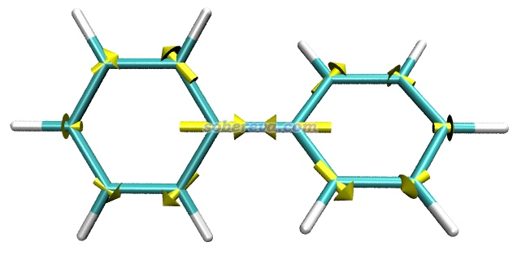
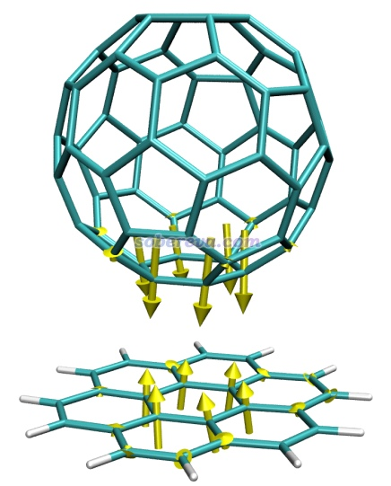
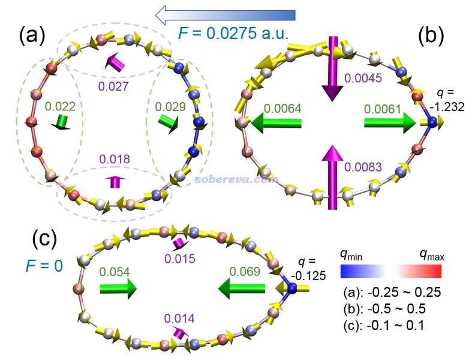

**在VMD中显示Gaussian计算的原子受力**

Displaying atomic forces calculated by Gaussian in VMD

文/Sobereva@[北京科音](http://www.keinsci.com)  2020-Sep-13

在量子化学研究中，原子受力往往是非常值得关注的量。Gaussian程序可以通过force关键词计算原子的受力，然后在GaussView中可以根据原子受力大小进行着色，但是没法绘制出受力矢量。本文介绍如何在免费、灵活、强大的VMD程序中，通过笔者自写的tcl脚本，将Gaussian计算的原子受力非常直观地通过箭头展现出来，这对于一些量子化学问题的研究很有益处。VMD可以在<http://www.ks.uiuc.edu/Research/vmd/>免费下载，本文使用VMD 1.9.3，Gaussian使用G16 A.03。

在此处下载绘图脚本和示例文件：<http://sobereva.com/attach/568/file.zip>。将其中的forcevec.tcl和drawarrow.tcl复制到VMD目录下。

用文本编辑器打开forcevec.tcl，可看到开头有几个设置：  
set filename：载入的Gaussian输出文件路径  
set sclfac：以a.u.为单位的原子受力矢量乘上这个系数就是绘制出的箭头的长度。应根据实际图像效果反复尝试找到最合适的  
set rad：箭头的粗细  
set color：箭头的颜色名  
set crit：如果某个原子的受力大小小于所有原子最大受力大小乘以这个系数，则这个原子的受力就不会用箭头绘制出来，由此可避免在受力相对非常小的原子上出现非常短的、没什么实际意义的箭头。默认为0.1

## 例1：联苯的基态极小点结构下在S1势能面上的原子受力

本文文件包里的biphenyl_S1force.out是在优化过的联苯的基态极小点结构下，用TDDFT算的S1激发态的原子受力的输出文件，用到的关键词在此文件里已经体现了。

把biphenyl_S1force.out载入GaussView，保存成pdb文件，然后把pdb文件载入到VMD里。然后将biphenyl_S1force.out挪到VMD目录下，用文本编辑器打开forcevec.tcl，把set filename后面的内容改为biphenyl_S1force.out，把set sclfac后面的内容改为20，然后保存文件。之后在VMD的文本窗口里输入source forcevec.tcl，脚本就从biphenyl_S1force.out里读取原子受力，然后绘制出了箭头。把背景改成白色，在Graphics - Representation里把显示方式改为Licorice后看到下图

根据原子受力可见，在体系所处的这个Franck-condon点位置，联苯中央的C-C键倾向于缩短。实际上在PBE0/6-311G*级别下，联苯的基态极小点结构下这个C-C键键长为1.478埃，而同级别下用TDDFT优化的S1态极小点下这个键长为1.413埃，明显短了很多。另外，从上图可见其它原子也有显著受力，这体现出苯环结构将要自发进行调整，确实S1态极小点下苯环的各个键长相对于S0态都有显著变化。

## 例2：晕苯与富勒烯复合物

笔者之前在PM6-D3下对晕苯与富勒烯形成的复合物进行了优化。这里看一下如果在优化的复合物结构的基础上，若把富勒烯与晕苯距离稍微拉远一点，原子受力是什么样的。本文文件包里complex_force.out就是在人为拉远的结构下用PM6-D3做force任务的输出文件，complex_force.pdb是相应的结构文件。将complex_force.pdb载入VMD，把complex_force.out复制到VMD目录下，将forcevec.tcl里的set filename后面写上complex_force.out。由于弱相互作用对应的原子间相互作用很弱，所以在set sclfac后面写上一个比较大的值，这里用1500。在VMD文本窗口里运行source forcevec.tcl，进一步调节下作图设置后看到下图

可见，由于富勒烯与晕苯之间的色散吸引作用，再加上当前结构下二者间距比平衡距离更远，两个分子彼此间挨得较近的原子上都出现了令二者距离进一步拉近的力。

## 例3：外电场下的18碳环的受力

笔者对18碳环及类似体系做过大量的理论研究，汇总见<http://sobereva.com/carbon_ring.html>。其中，笔者在名为Ultrastrong Regulation Effect of the Electric Field on the All-Carboatomic Ring Cyclo[18]Carbon（<https://chemistry-europe.onlinelibrary.wiley.com/doi/10.1002/cphc.202000903>）的论文中全面、深入研究了外电场对18碳环的几何结构、电子结构、电子吸收光谱等特征的影响，此文的介绍见《一篇文章深入揭示外电场对18碳环的超强调控作用》（<http://sobereva.com/570>）。在此文中通过类似于上文的做法绘制了下面的图（需要利用专门的tcl脚本）

此图体现的信息的详细解释请看上面提到的论文，这里只是简单提一下。这个图绘制了各个原子的受力，还用绿色箭头展现了左、右两侧原子的总体受力，用紫色箭头展现了上、下两侧原子的总体受力，划分方式在图(a)中通过虚线体现了。原子的颜色体现的是ADCH方法算的原子电荷，实现方法在《使用Multiwfn+VMD以原子着色方式表现原子电荷、自旋布居、电荷转移、简缩福井函数》（<http://sobereva.com/425>）中介绍了。图(a)体现出18碳环在原始结构下，如果刚加上外电场，此刻的受力并不会立刻造成碳环的整体变形，但会明显造成键长发生改变的倾向。图(b)体现出，在外电场下当碳环的结构已稍微经过弛豫、出现了一些变形后，此刻的原子受力就会明显倾向于让18碳环在顺着电场方向拉长，而在垂直于电场方向压扁，从而使碳环变得更加像椭圆。图(c)是在电场下优化后的结构，但是此刻撤掉了外电场，由绿色箭头可见此时18碳环有明显的恢复成原本圆形的倾向，体现出弹性特征。此图清晰地展现出电场下18碳环这个体系的独特的力学特性，如果不把受力绘制成箭头，很难予以这样深入的探讨。

若要绘制一批原子的总受力，可以在source forcevec.tcl之后，把下面的代码拷到VMD文本窗口里。这部分代码原本是笔者用来绘制上图中左侧5个原子总受力用的。4 5 6 7 8是被计算总受力的原子序号，总受力矢量及其模也会被输出到屏幕上。在绘制箭头时，为了让位置比较舒服，箭头中心位置取的是$atmleft 3 9 2 10的几何中心，即4 5 6 7 8加上相邻的3 9 2 10四个原子。

set atmleft "4 5 6 7 8"  
 draw color green  
 set fxleft 0  
 set fyleft 0  
 set fzleft 0  
 foreach i $atmleft {  
 set fxleft [expr $fxleft+$fx($i)]  
 set fyleft [expr $fyleft+$fy($i)]  
 set fzleft [expr $fzleft+$fz($i)]  
 }  
 puts "Left side force: $fxleft $fyleft $fzleft"  
 set normval [expr sqrt($fxleft**2+$fyleft**2+$fzleft**2)]  
 puts "Norm: $normval"  
 drawarrow "serial $atmleft 3 9 2 10" $fxleft $fyleft $fzleft $sclfac 0.2
