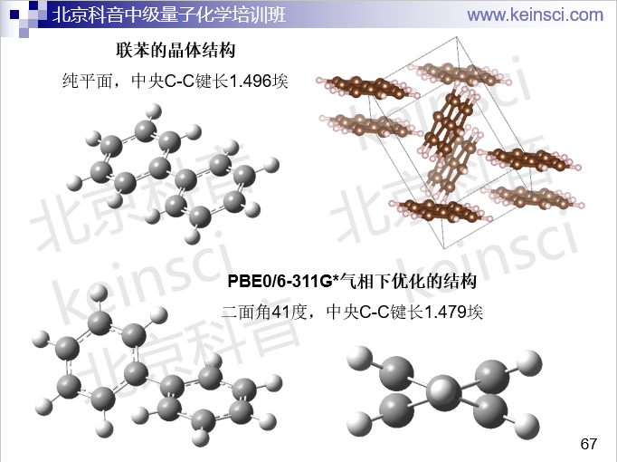

**实验测定分子结构的方法以及将实验结构用于量子化学计算需要注意的问题**

Methods for experimentally determining molecular structures and issues that need to be paid attention to when using experimental structures for quantum chemistry calculations

文/Sobereva@[北京科音](http://www.keinsci.com)

First release: 2020-Sep-10  Last update: 2021-Jan-4

笔者在网上答疑时，经常有人问类似于“实验测定的分子结构，做量子化学计算时还需要优化么？”这种问题。我觉得值得写一篇文章将实验测定分子结构的原理科普一下，并顺带谈谈相关问题。搞懂了测定原理、测定时的环境和计算时的条件的差异，才能充分搞懂实验测出的结构和理论计算的有没有可比性、在对比时需要注意什么、是否能将实验的结构直接用在理论计算中。下面对四种常见的测定分子结构的方法依次进行介绍和讨论。

## 1 微波谱（microwave, MW）

微波谱是测量气相小分子结构的常用方法，只能用于有永久偶极矩的分子，否则没有信号。分子的转动态能级差由转动光谱得到，信号一般出现在微波、远红外区。转动能级决定于转动常数和转动量子数（但还有离心畸变项等影响），转动常数可以基于转动惯量得到，而转动惯量又是基于原子坐标和原子质量计算的（Multiwfn手册3.100.21节有公式）。由于微波谱（微波范围的转动谱）可以测定转动常数，因此给出了分子几何结构信息。双原子分子是可以通过微波谱直接给出具体结构（键长）的，而对于多原子分子来说微波谱测定的转动常数只是体现了结构的一个侧面，还需要结合其它手段才可能得到所有原子的坐标，比如可以将测定的转动常数作为约束条件，用量子化学方法优化，或者基于红外光谱转化出的力场进行几何优化，最终得到所有原子坐标。（对于非线型体系，转动常数只有A、B、C这三个，通常小于内坐标数，因此原理上就不可能光靠测定转动常数获得完整的几何结构。但如果将体系中的原子做同位素替换，测量不同情况下的转动常数从而增加已知信息量，原理上倒也能获得完整的几何结构）

需要注意的是，实验测定的是有效转动常数，而势能面极小点结构（也称平衡结构）对应的是平衡转动常数，二者之间的差异由各个振动模式的振动-转动相互作用常数{α}以及振动量子数决定，这体现了振动运动对实际转动常数的等效影响。利用振动基态和振动激发态的转动光谱数据可以得到α，再结合微波谱给出的有效转动常数，就能得到与极小点结构直接对应的平衡转动常数。如果缺乏实验的α，α也可以通过理论计算得到，比如在Gaussian里用freq=anharm关键词就可以给出考虑了非谐振校正的α矩阵。

值得一提的是，一些文章里把量子化学程序计算的转动常数与实验微波谱测定的值相对照判断几何优化的结构的准确性。Grimme的ROT34测试集文章就是如此，包含了34种中等尺寸有机分子的实验转动常数，结合理论计算的α，测试了一系列理论方法的结构优化精度，见J. Comput. Chem., 35, 1509 (2014)。在J. Phys. Chem. A, 119, 2058 (2015)中，Barone等人根据实验转动常数结合量子化学算的α确定了47种有机分子的气相精确结构，称为B3se半实验数据集，之后在J. Chem. Theory Comput., 12, 459 (2016)中Adamo等人还用这个数据集测试了主流泛函优化结构的精度。

## 2 气相电子衍射（gas electron diffraction, GED）

电子衍射技术用于固体有扫描透射显微镜（STM）、电子背散射衍射技术（EBSD）等，也可以用于气体，称为气相电子衍射。这是把气体分子喷到衍射腔里，射入加速后的电子并测量衍射数据，由此可以获得各原子间的距离信息（例如可给出径向分布函数曲线），相当于测定了距离矩阵，也等同于得到了分子的几何结构信息。但单靠这种做法只能测定很简单的分子的结构，即不同原子间距离差异较大，因而容易通过峰位置指认不同原子间距离的情况。如果与转动谱等其它实验的信息相恰当结合，则可以更准确、测定更多的分子结构。对于分子略复杂而导致难以直接靠GED曲线确定所有原子位置的情况，也有不少研究将量子化学优化出的结构在GED解析时作为限制，比如J. Phys. Chem. A, 124, 5204 (2020)。

气相电子衍射测的是各原子间的热平衡距离，即对应于热可及振动态的权重振动平均距离，显然这样的原子间距离和精确势能面极小点结构对应的原子间距离是有不可忽略的差异的。即便只是在振动基态，由于势能面的非简谐性，振动平均结构也和极小点结构是存在一定差异的，在此文里专门说过：《谈谈温度、压力、同位素设定对量子化学计算结果产生的影响》（<http://sobereva.com/423>）。量子化学优化的坐标若要和GED给出的相对比，GED实验对应的温度应当较低，以尽量减少热平均距离和精确势能面极小点的差异。例如J. Chem. Theory Comput., 2, 1282 (2006)中构建了衡量DFT泛函优化过渡金属配合物精度的测试集，其中GED的数据都是刻意挑室温下或比之略高的，而那些常见的1000 K或更高温度下的GED数据都没纳入测试集。关于GED的更多细节、优缺点等信息可以参看Structure of Free Polyatomic Molecules-Basic Data (Kuchitsu,1998)一书第一章的介绍和讨论。这本书里收集了大量气相小分子、复合物的坐标，很大一部分都是靠MW、GED或者多种方法联用来测定的。顺带一提，免费的UNEX（<http://unexprog.org>）程序可以通过GED数据或者转动常数，或者将二者相结合来确定分子结构。

以上两种做法是最常见的获得气相分子结构的方法，尽管也有些文章还通过别的手段推断出了气相分子结构。有些文章在给出气相分子结构的时候明确说了是振动平均结构还是极小点结构，如果你要判断几何优化得准不准，显然应当参照后者来对比；如果你要直接用实验的结构来做一些计算，也应当用后者，此时不需要再对结构优化（但如果你是之后要做振动分析，由于振动分析的级别必须和几何优化完全一样，因此还是要先优化）。

## 3 X光衍射

培养足够大尺寸的单晶，然后做X光衍射是实验测定化学体系几何坐标最常用的做法。此方法本质上是获得晶体中的电子密度格点数据，再根据特定方法转化为原子核位置。这实质上对应的是热平均结构。特别要注意X光衍射测定的分子结构是晶体环境下的，由于分子间相互作用、堆积效应，势必会影响结构，显然多多少少会与气相结构存在差异。具体差异有多大，和分子的柔性、晶体环境中的相互作用非常密切。例如吡咯，属于刚性很强的分子，所以在晶体环境中和在气相中结构差异甚微。而对于柔性体系，晶体环境对构象的影响可能是相当大的，比如二面角能差好几十度。例如我在北京科音基础（中级）量子化学培训班（<http://www.keinsci.com/workshop/KBQC_content.html>）中展示的下面联苯这个例子，气相中是有二面角的，而在晶体环境中则成了平面的了

所以，对于柔性体系，不能用晶体结构和气相中优化的结构相对比来判断优化得是否准确。如果你的目的是考察真空状态下某个柔性分子的特征，显然也不能拿晶体结构未经优化直接用。

对于刚性体系，拿量子化学优化的结构与X光衍射的结构相对比来判断优化得是否靠谱，通常来说还算说得过去，尽管原理上并不严格，毕竟这种实验测的不是孤立状态势能面极小点结构，而且晶体中的分子间相互作用总是不可避免的。如果体系虽然是柔性，但只是将量子化学优化的某些刚性变量与实验的对比，倒是没明显问题。比如一个过渡金属配合物，其配体可能有很多柔性变量，但配位键的刚性通常都是很强的，所以如果只关心配位键键长的优化精度，一般可以与X光衍射的对比（但如果实验的解析度太差也不行）。

关于X光衍射有一个非常需要注意的是氢原子的位置的测定问题。相关讨论详见J. Phys. Chem. Lett., 12, 463 (2021)。X光衍射实验普遍用的是独立原子模型（independent atom model, IAM）方法获得原子位置，它将分子的电子密度近似视为孤立状态下的球对称的各个原子密度的叠加，但这忽略了原子的电子密度分布的各向异性，此问题对于带电子很少的氢特别严重，会导致得到的与氢相关的化学键明显偏短（对于其它元素倒没什么问题）。后来有人提出了Hirshfeld原子精修（Hirshfeld atom refinement, HAR），需要迭代进行，原子坐标随着迭代逐渐变化，每一轮迭代都要利用量化计算得到电子密度并涉及到做Hirshfeld划分。即便X光衍射精度较差，利用HAR依然可以得到和中子衍射测定的相仿佛的氢原子坐标（中子衍射是最为准确的获得氢的坐标的方法）。但HAR没有考虑环境效应，对于形成氢键的情况，环境效应对相应氢原子的位置影响绝不可忽视，通常能对键长影响零点零几埃。虽然用大团簇模型计算来考虑环境效应最理想，但是太昂贵。有人在使用HAR时，在量化计算过程中将环境分子的原子通过点电荷表现它对中心分子的影响，对结果有所改进，但还不算很理想。后来又有人提出了HAR-ELMO方法，将周围一定距离内的分子的波函数用极度定域化分子轨道（ELMO）表现，相当于以嵌入方法对中心分子进行计算，因此以比较便宜的方式较真实地展现了环境效应，得到的参与氢键的氢的键长和中子衍射得到的非常接近了，误差整体<=0.01埃。

虽然如上所述，目前已经有了能基于X光衍射较准确测定氢原子位置的方法，但由于已有的X光衍射的结构大多都是基于IAM方法确定的，因此千万不要轻易把X光衍射实验给出的cif文件里的氢的位置当做什么准确位置。对这种情况，如果你要把X光衍射得到的分子坐标用于量子化学计算，氢的位置是无论如何也要经过优化的。而重原子是否优化，看你的具体要求。如果是要研究分子在真空中或者溶剂环境中的状态，那么所有原子都得优化；如果是想尽可能表现晶体环境中分子的状态，那么就不要优化重原子了，只优化氢原子即可。具体来说，就是做冻结重原子的限制性优化，在此文说了做法《在Gaussian中做限制性优化的方法》（<http://sobereva.com/404>）。注意这和前面说的HAR明显不同，因为这种计算不涉及将X光实验测定的电子密度当做确定坐标的参考依据。显然，只优化氢的话，由于分子没有完全优化，当做孤立体系做振动分析很容易出现虚频，但这是不可避免的，也不要去在意这点。

在晶体环境中，周围的分子不仅仅影响被考察的分子的几何结构，对其电子结构也同样有影响。如果分子的极性较强（怎么考察看《谈谈如何衡量分子的极性》<http://sobereva.com/518>），计算当前分子时还应当恰当考虑周围分子对当前分子的极化作用，这对于计算诸如UV-Vis谱等方面可能影响不小。其中实现起来最容易，也是在绝大多数量子化学程序中都能实现的办法，是加上背景电荷，详见《基于背景电荷计算分子在晶体环境中的吸收光谱》（<http://sobereva.com/579>）中的非常详细的介绍和实例。

## 4 中子衍射

对于单晶，中子衍射和X光衍射一样可以测定晶体中的原子位置。X光衍射对应的是X光与电子云相互作用，而中子衍射对应的是中子与原子核相互作用，后者相对于前者的优点是可以直接测定氢原子核的位置（因为氢核会发生中子衍射），而且可以区分不同同位素。中子衍射除了用于晶体外，还可以用于气体、液体、无定型固体、粉末，可以获得径向分布函数等数据。现有的中子衍射测定的分子结构数目远少于X光衍射，因为需要核反应堆或散裂源作为中子源，这明显不是一般实验室可以拥有的，只有国家级的机构才有。而且用于中子衍射的单晶需要比X光衍射的有更大的尺寸，在样品制备上也难得多。在剑桥晶体学数据库CSD里既有X光衍射的也有中子衍射测定的结构。

最后再顺带说一下，网上有一些分子库，比如pubchem、chemspider等等，里面能直接下载分子结构文件。大家千万别随便下下来就用、甚至以为那就是真实结构。网上的一些分子结构文件如果没注明来源的话，很有可能只是根据分子的二维结构通过CORINA等等简单、经验的算法自动构建的，不仅不是什么真实结构，还非常粗糙，对于成键方式特殊的体系可能跟真实结构差异巨大。
