**一篇文章深入揭示外电场对18碳环的超强调控作用**

An article deeply reveals the ultrastrong regulation effect of external electric field on cyclo[18]carbon

文/Sobereva@[北京科音](http://www.keinsci.com)

First release: 2020-Sep-13  Last update: 2022-Jul-19

## 0 前言

2019年，Science的一篇文章中首次在凝聚相中观测到了由18个碳原子组成的环状体系，即18碳环（cyclo[18]carbon），其十分独特的几何结构和电子结构立刻引起了化学家们的极大关注，一年来就已经有20多篇相关的量子化学研究文章发表。笔者在18碳环方面开展了大量研究，撰写过诸多相关博文，并且还发表了不少论文，在这里有汇总：<http://sobereva.com/carbon_ring.html>，非常大家欢迎阅读和引用。

外电场（external electric field, EEF）对化学体系的影响一直以来都是理论化学研究的热门领域之一。如上面的文章里提到，18碳环具有两套高度离域的pi电子，而且此体系具有显著的柔性，这使得它对外电场的响应应当与常规化学体系有着极大的不同。为了弄清楚电场如何影响18碳环这一非常有趣的问题，笔者代表北京科音自然科学研究中心（<http://www.keinsci.com>），通过量子化学计算和波函数分析对此做了详细的研究，并发表了一篇研究文章ChemPhysChem, 22, 386 (2021)，文章访问地址：[**https://chemistry-europe.onlinelibrary.wiley.com/doi/10.1002/cphc.202000903**](https://chemistry-europe.onlinelibrary.wiley.com/doi/10.1002/cphc.202000903)。此文的pdf可以在<http://sobereva.com/carbon_ring.html>里提到的笔者发表的18碳环相关研究文章的网盘链接里下载。

值得一提的是，本文一多半内容都是靠免费强大的波函数分析程序Multiwfn（<http://sobereva.com/multiwfn>）完成的，此文也可以当做是Multiwfn的一个很好的应用范例。如果不利用Multiwfn的话，即便是电场调控18碳环的这样的十分新颖有趣的题材，也很难写得有深度、上档次、富有亮点。Multiwfn的相关信息见《Multiwfn FAQ》（<http://sobereva.com/452>）。本文提到的Multiwfn一律是指目前官网上的最新版本。本文中的有分子结构的图基本都是结合VMD绘制的。

下面，笔者简要地把这篇论文的内容做一下简明易懂的概括，具体详细讨论请参见论文。为了大家也能对其它新颖体系做出与文中类似分析，笔者下面也顺带着把在Multiwfn中的操作方式提及一下。

## 2 电场对结构的影响

加了电场后18碳环的几何结构会变成什么样？下面这张图展现出，随着电场增强，体系的最长轴的距离（最远的两个碳的距离）不断增加，即被逐渐拉长

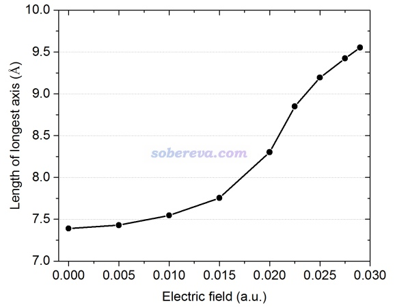

下面是几个有代表性的电场(F)下的具体结构图。可见当没有电场时体系是完美的环状（D9h点群），而电场很大的时候，体系就变成了椭圆，在电场方向被明显拉长，而在垂直于电场的方向被挤扁。下图中化学键的相对长短也通过对键进行着色以直观地体现。

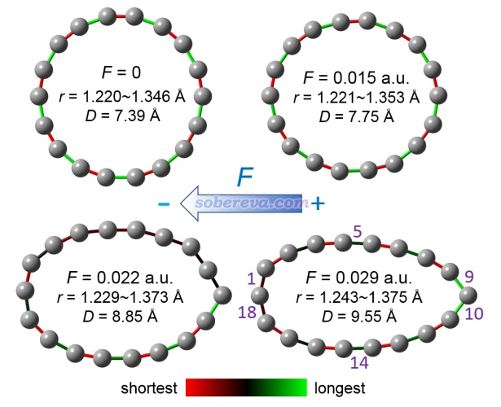

在不同电场下，按照原子连接顺序，C-C键的长度变化在下图给出了，键角变化在论文的补充材料里也给了。由此图可清晰、定量展现出电场对键的特征产生的影响，在论文中有具体讨论。绘制此图需要的数据可以用Multiwfn非常轻松地得到，见《使用Multiwfn计算Bond length/order alternation (BLA/BOA)和考察键长、键级、键角、二面角随键序号的变化》（<http://sobereva.com/501>）。

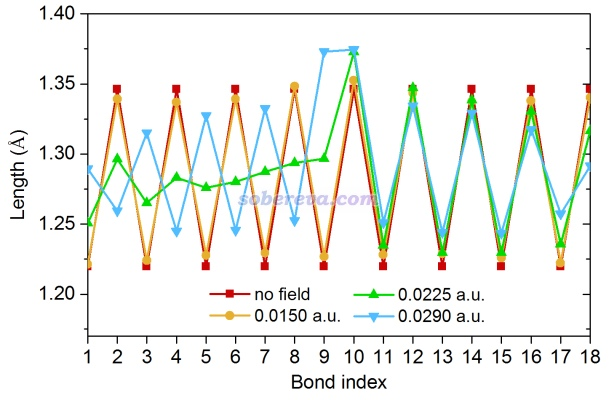

为了考察强电场下不同化学键强度的差异，文中用Multiwfn计算了笔者在J. Phys. Chem. A, 117, 3100 (2013)中提出的拉普拉斯键级（Laplacian bond order），这种键级的大小与C-C键的键解离能（BDE）有极好的线性相关性，详见《Multiwfn支持的分析化学键的方法一览》（<http://sobereva.com/471>）中的键级部分介绍。拉普拉斯键级值标注在了下图上（之后ps了一下给文字勾了个边），同时也用不同颜色对键着色直观展现了键级大小，越红（越绿）对应键级越小（越大）。这种图的做法详见《将Multiwfn计算的键级直接标注在分子结构图上的方法》（<http://sobereva.com/523>）。由下图可见，距离电场源头最近的原子（图中最右侧原子）的C-C键的键级是最小的，因此在强电场下这个原子是最不稳定的。另外，它对应的C-C-C键角也是整个环中最小的，电场在此处造成的结构扭曲最厉害，这是因为电场对它有最强的牵引效果，详见后文的原子受力分析。

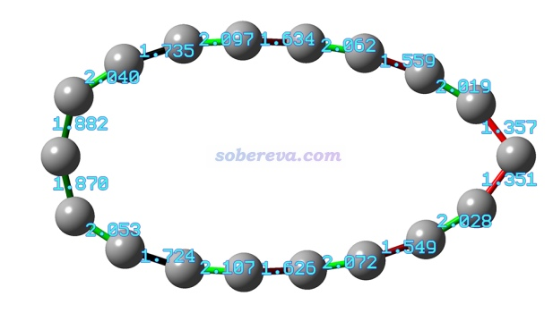

## 3 电场对电子结构的影响

笔者在Carbon, 165, 461 (2020)和《使用Multiwfn通过单位球面表示法图形化考察（超）极化率张量》（<http://sobereva.com/547>）中都已经证实了18碳环在顺着环平面方向上的极化率特别大，且明显大于垂直于环方向的分量，这是由于18碳环沿环平面的大共轭特征所致。也自然可以期望，如果电场平行于环平面施加，会对体系电子分布造成极大的影响。注意18碳环由于对称性，原本偶极矩为0，在电场下出现的偶极矩就相当于是诱导偶极矩。为了说明电场对18碳环电子的极化，笔者计算了18碳环在不同电场下的偶极矩，这是衡量体系被电场极化程度最简单直接的指标。然而，对于这么有特点的体系，光是计算个整体偶极矩实在太无聊了。注意18碳环的电子可以分为三部分，环平面外（out-of-plane）离域的pi电子，环平面内（in-plane）离域的pi电子，以及其它电子（1s轨道的内核电子，以及形成sigma键的电子），这三类电子对电场的响应明显是不同的。为了弄清楚18碳环的诱导偶极矩的本质，笔者用Multiwfn对这三类电子在不同电场下的偶极矩也分别做了计算，结果如下。

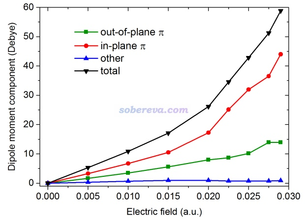

可见，体系总偶极矩随电场增加而迅速增加。其中对这诱导偶极矩贡献最主要的是in-plane pi电子，其次是out-of-plane pi电子。而没有整体离域能力的sigma和1s电子的可极化程度可以忽略不计。由于in-plane pi电子是18碳环（或某些双芳香性体系）绝无仅有的特征，因此18碳环对外电场超强的响应的关键就在于此。

注：使用Multiwfn计算in-plane pi电子贡献的偶极矩很简单。用Multiwfn载入波函数文件，利用主功能6的子功能26（修改轨道占据数），先把所有轨道占据数先清零，再把in-plane pi轨道的占据数设为原先的值（2.0）。然后退回到主菜单，进入主功能300的子功能5（计算电偶极矩和多极矩），给出的偶极矩信息就是in-of-plane pi电子贡献的了。类似地，可以计算out-of-plane pi电子、other电子贡献的偶极矩。更多相关信息参考《在Multiwfn中单独考察pi电子结构特征》（<http://sobereva.com/432>）。

电场是具体怎么影响18碳环的电子密度分布的？想直观说明这个问题，用密度差图再合适不过了。按照《使用Multiwfn作电子密度差图》（<http://sobereva.com/113>）的做法，笔者用Multiwfn计算了中强电场和无电场情况之间的密度差格点数据，然后按照《在VMD里将cube文件瞬间绘制成效果极佳的等值面图的方法》（<http://sobereva.com/483>）中的做法绘制了等值面图，如下图左侧所示。蓝色和绿色分别是加了电场后电子密度降低和增加的区域。可见电场对电子密度分布造成了极为显著的极化作用，电子整体大幅往电场源头方向移动。

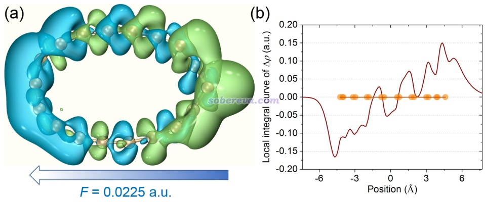

为了更便于考察沿着电场方向不同截面处的密度差，笔者用Multiwfn计算了密度差的局部积分曲线，即上图右半部分，其中每个桔黄色圆点都是一个碳原子的位置。此类图像绘制方法见Multiwfn手册的4.13.6节。从这个图上更能清晰地看出在电场源头一侧电子密度整体是增加的，而体系的另一侧电子密度是减小的。

静电势分布是分子体系非常重要的属性，相关知识和笔者写过的诸多有关博文看《静电势与平均局部离子化能综述合集 <http://bbs.keinsci.com/thread-219-1-1.html>》。笔者用《使用Multiwfn+VMD快速地绘制静电势着色的分子范德华表面图和分子间穿透图（含视频演示）》（<http://sobereva.com/443>）中的做法顺便绘制了较强电场下18碳环的范德华表面的静电势分布，如下所示。蓝色和红色分别对应静电势为负和为正的区域，表面静电势极大、极小点的位置和数值也都标注了。由图可见由于电子密度的显著极化，导致在接近电场源头一侧静电势全都为明显负值，最负可达-88.5 kcal/mol，而在另一头为明显的正值，最正可达106.4 kcal/mol。而在前述的<http://sobereva.com/524>中提到的笔者另一篇18碳环的研究文章中给出了18碳环在无外场情况下的分子表面静电势分布，数值仅分布在很窄的-2~8 kcal/mol区间内。因此通过静电势也能侧面体现出外电场对18碳环电子结构的极化作用有多么显著。

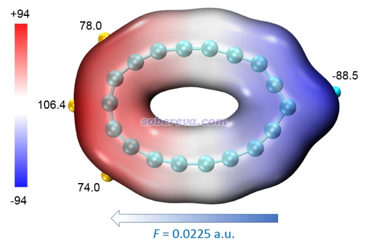

此文的研究考察的电场最强只到0.029 a.u.，因为继续增强的话电子就会脱离了，实际发现在更强的电场下若使用带弥散函数的基组，SCF完全收敛不了。下图(a)是使用Multiwfn绘制的极限电场0.029 a.u.的情况下的电子定域化函数(ELF)图，相关知识介绍和绘制方法看《ELF综述和重要文献小合集》（<http://bbs.keinsci.com/thread-2100-1-1.html>）以及Multiwfn手册4.4节的例子。ELF可以展现出体系中电子高度定域的区域，在图(a)最右侧明显出现了一大块近乎脱离体系的电子高定域性区域，这正体现出被外电场极化得近乎脱离体系的电子。

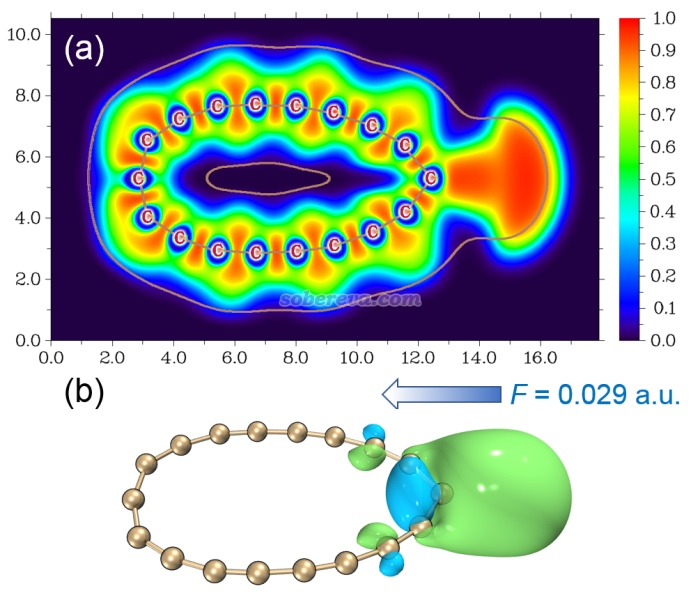

笔者也通过另一种非常流行的手段考察了被电场极化到近乎脱离18碳环的电子，即轨道定域化，相关知识以及在Multiwfn中的操作见《Multiwfn的轨道定域化功能的使用以及与NBO、AdNDP分析的对比》（<http://sobereva.com/380>）。之后笔者用《用VMD绘制艺术级轨道等值面图的方法（含演示视频）》（<http://sobereva.com/449>）中的做法绘制了与几乎掉下来的电子相对应的定域化轨道的图形，见上图(b)。由图可见通过轨道分析的角度，也充分体现出了有电子近乎要被电场揪下来；而且通过轨道的节面特征可见，这样的电子本质上是in-plane pi电子。这点和前面提到的in-plane pi电子特别容易被电场极化的事实是完全一致的。

## 4 电场导致18碳环结构变形的本质因素

为什么电场会导致18碳环的结构能够出现非常明显的变形？为了深入揭示这一点，笔者从能量变化和原子受力角度做了分析。

为了从能量角度深入探究，笔者将加外电场前后体系能量的变化分解为了下图的三个过程

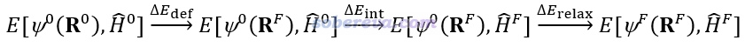

其中E是体系的电子能量，它由电子波函数（Ψ）和当前的哈密顿（H）共同决定，R是几何坐标。0和F上标分别代表无外场和有外场的情况。容易理解，Δdef体现出加外场后令几何结构变形造成的能量变化。ΔEint体现出在已变形的结构下，体系永久偶极矩与外电场相互作用造成的能量变化。ΔErelax体现出在已变形的结构下，在外电场下电子结构发生弛豫的过程中能量发生的变化。这三部分怎么算，在论文的补充材料里详细说明了。在不同外电场下体系总能量和各部分的变化如下所示

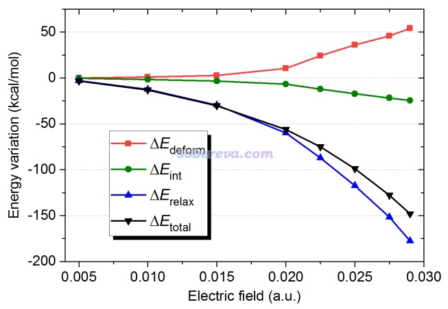

由上图红线可见，电场不很大时由于体系结构变形造成的能量升高程度很低，这一方面是因为结构扭曲尚不是很严重，另一方面是因为18碳环本身的柔性较大，易于变形。而当电场超过中等程度（0.02 a.u.）后，电场诱导的结构扭曲造成的能量升高就变得明显了，但之所以变形还是会发生，关键在于上图中蓝线所示的电子分布弛豫造成的能量降低程度非常大，这远远克服了结构扭曲造成的不利因素。会出现这个现象主要也是在于18碳环的in-plane pi电子的极化率很大，在电场下电子经过弛豫会形成很大的诱导偶极矩，显然它与外场的相互作用会导致能量下降得非常多。上图中的绿线展现了电场诱导的结构下的永久偶极矩与外电场的相互作用造成的能量降低，可见虽然这对能量降低有一定贡献，但是贡献不太大。

值得注意的是，在电场诱导而变形的结构下，哪怕撤掉电场，体系仍然有偶极矩，即变形的结构下是有永久偶极矩的。下图展示了不同外电场对应的结构下的永久偶极矩，可见也是随电场的增大而逐渐增大的，但其大小远不及存在外电场时的诱导偶极矩。

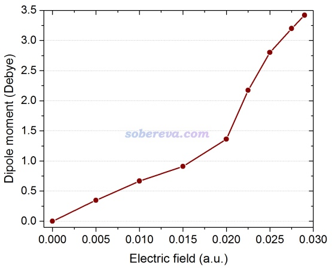

导致结构变形的直接驱动力无疑是原子的受力，而从能量变化角度去考察都是相对间接的。为了考察原子受力，笔者使用《在VMD中显示Gaussian计算的原子受力》（<http://sobereva.com/568>）中的做法计算了18碳环的原子在不同电场下的受力。同时，笔者也用Multiwfn计算了笔者在J. Theor. Comput. Chem., 11, 163 (2012)中提出的ADCH原子电荷，并根据《使用Multiwfn+VMD以原子着色方式表现原子电荷、自旋布居、电荷转移、简缩福井函数》（<http://sobereva.com/425>）中介绍的做法通过原子着色在图中做了直观的展示，越红电荷越正，越蓝电荷越负。注意回忆中学学过的，带电荷为q的粒子在电场矢量F下的受力矢量为f=qF，因此带净电荷的原子会由于电场而受到库仑力。下图(b)是18碳环在电场下结构弛豫过程中途的一帧结构，可见，图中最右侧带非常显著负电荷的碳原子在电场下有显著的朝着电场源头的受力，导致体系右侧被往右拉。而从体系中四个片段的受力（绿色和紫色箭头）来看，体系左侧受到整体向左的力，而上侧和下侧的原子都受到向环中央挤压的力，这导致体系会变得更加椭圆。而从图(c)可见，在碳环已经被电场拉长后，如果此时撤掉电场，则体系会受到强烈的复原力使之倾向于恢复圆形，这体现出18碳环相对于电场具有明显的弹性特征。

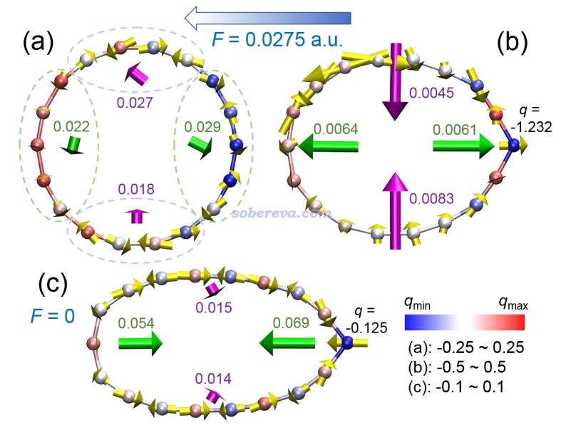

文中还计算了downhill路径，这种路径的产生算法和IRC类似，但不是从过渡态开始走的，结果如下。具体实现见《谈谈Gaussian产生downhill路径的功能》（<http://sobereva.com/571>）。这个轨迹体现出在电场下，18碳环从没加电场的极小点结构开始是如何弛豫的。可见一开始18碳环先出现一些键长、键角的调整，并没有立刻整体变形（这和上图中的(a)体现的受力情况一致）。而之后，在电场的驱动下18碳环逐渐被拉得越来越长、能量逐渐降低，这和上面的讨论是对应的。

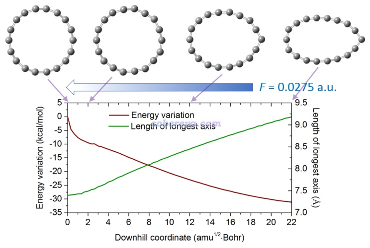

电场令18碳环能够显著的拉长这一点，在实际应用中具有明显意义。比如可以基于18碳环设计电场控制的可变形材料，在不同电场下会出现不同的伸缩。当然，目前离这还很遥远，毕竟怎么令反应性较强的18碳环稳定化、怎么大量化学合成，都是将18碳环及其衍生物应用于实际需要面对的最关键问题。

## 5 电场对18碳环的HOMO-LUMO gap和吸收光谱的影响

HOMO-LUMO gap是分子的十分重要的属性，也和分子导电性质关系密切，详见《正确地认识分子的能隙(gap)、HOMO和LUMO》（<http://sobereva.com/543>）中的讨论，因此十分值得探究电场如何影响18碳环的HOMO-LUMO gap。计算结果如下所示，可见电场对于HOMO能级影响相对较小，而对LUMO能级影响极大，尤其是在电场强度达到0.02 a.u.之后。这也进而令电场对18碳环的HOMO-LUMO gap有极强的调控作用。

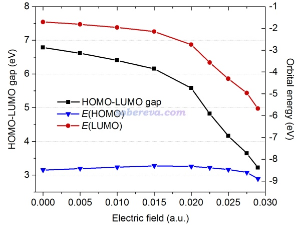

笔者也通过TDDFT计算了不同电场下的UV-Vis光谱，通过《使用Multiwfn绘制红外、拉曼、UV-Vis、ECD、VCD和ROA光谱图》（<http://sobereva.com/224>）文中的方法快速批量得到了不同电场下的吸收光谱曲线，然后一起导入Origin绘制了三维瀑布图，如下所示。由图可见，当电场不太大时，光谱曲线和没电场的时候都差不多，都只在紫外区有极强的吸收，这部分吸收的电子跃迁本质笔者在Carbon, 165, 461 (2020)里已做了详细的分析。当电场更大时，紫外区的吸收变弱，波长增加；与此同时，在可见光（380~750 nm）区域出现了新的吸收带，而且电场越强其吸收越强、波长越长。这体现出，通过电场，可以控制18碳环体系的颜色！因此有可能将18碳环或其衍生物制备成颜色可由电场调控的染料。

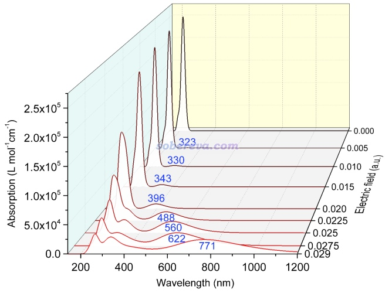

为什么电场越强导致吸收波长越长，即激发能越低？这里我们先姑且不管不同吸收峰的具体本质特征，就来看电场是怎么影响分子轨道能级的。下图把不同电场下的最高10个占据轨道（蓝色）和最低10个空轨道（红色）的能级绘制了出来（顺带一提，用Multiwfn载入波函数文件，比如.fch、.molden，进入主功能0，然后点图形窗口上方的Show orbital菜单里的选项，就可以直接把轨道能级在文本窗口里列出，直接从屏幕上就可以把数据复制出到Origin里，然后恰当绘制成散点图就有下图的效果）。从下图可见，当电场达到一定程度后，随着电场强度的增加，空轨道能级整体显著降低，而占据轨道能级变化相对小一些。由于电子激发能和占据-非占据轨道能级差关系密切（有一定正相关性），也自然可以理解为什么强电场可以令上图中的吸收峰的波长增加。当然，这里还要强调一下，激发能绝不简单地等于轨道能级差，见《正确地认识分子的能隙(gap)、HOMO和LUMO》（<http://sobereva.com/543>）里的详细说明。

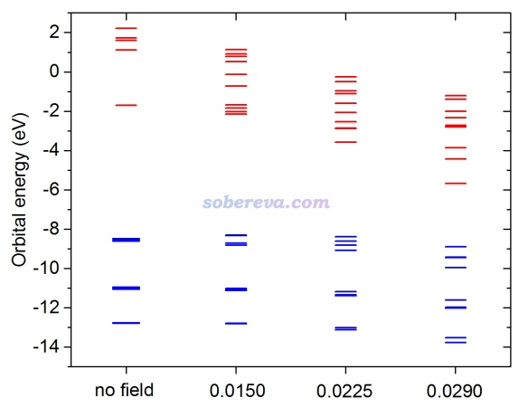

现在，我们更具体看一下加了强电场后在可见光区域的新出现的吸收峰的本质到底是什么。笔者按照《使用Multiwfn绘制红外、拉曼、UV-Vis、ECD、VCD和ROA光谱图》（<http://sobereva.com/224>）中的做法对较强电场（0.0275 a.u.）情况下的光谱曲线做了分解，把振子强度大于0.1的激发对总光谱的贡献曲线导了出来，然后都导入Origin里一起绘制成了曲线图。由下图可见，在最大吸收峰位置621.8 nm处（这个具体值在Multiwfn绘制光谱曲线的时候在文本窗口里直接会输出），有76.5 %都是S0->S6贡献的，由于它产生了主导，因此这里只关注S0->S6的激发特征。通过《使用Multiwfn便利地查看所有激发态中的主要轨道跃迁贡献》（<http://sobereva.com/529>）中介绍的方法，会发现这个激发是HOMO-3到LUMO跃迁主导的，贡献达到91%，因此此时关注这两个轨道就行了（顺带一提，如果没有主导的轨道跃迁，应当使用Multiwfn做空穴-电子分析或NTO分析，见《使用Multiwfn做空穴-电子分析全面考察电子激发特征》<http://sobereva.com/434>和《使用Multiwfn做自然跃迁轨道(NTO)分析》<http://sobereva.com/377>）。

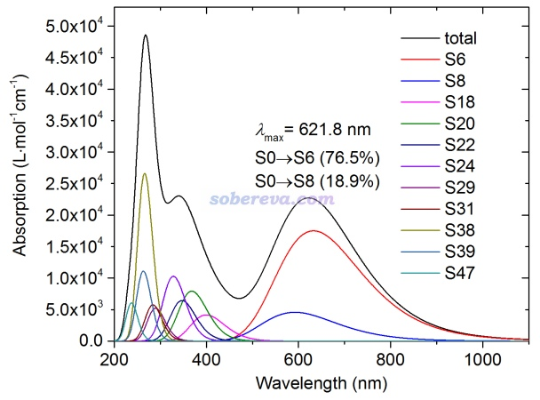

HOMO-3和LUMO这两个轨道的图形如下所示。可见，电子是从in-plane pi电子轨道跃迁到被电场高度极化到基本脱离体系的空轨道上的。由于这俩轨道对称匹配、有明显空间重叠，因此跃迁偶极矩必然不会非常小，这也导致S0->S6的振子强度不低，因此出现了对应的吸收带。如果想进一步讨论跃迁偶极矩，参见《Multiwfn支持的电子激发分析方法一览》（<http://sobereva.com/437>）中的“对跃迁偶极矩的分析”部分。

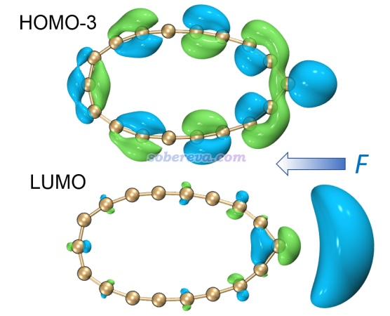

## 6 以化学方式加外电场：碱、碱土金属离子对18碳环的调控

虽然如上所示，使用较强的电场（0.02 a.u.，约1 V/埃）可以令18碳环的结构、光谱产生显著的改变，但是通过目前的技术手段，想加这样大小的电场是极难实现的。关于外加电场的技术手段，参见WIREs Comput. Mol. Sci., 10, e1438 (2020) DOI: 10.1002/wcms.1438里的讨论。于是，笔者思考能否通过更简单的方式实现等效的效果。笔者考虑到碱金属、碱土金属离子可以对周围施加显著的电场，于是笔者研究了这类离子与18碳环复合结构，来检验它们能否起到与外加电场类似的效果；如果证明可行，那么无疑非常有实际意义。

笔者考虑了18碳环与Li+、Na+、K+、Be2+、Mg2+、Ca2+的复合物，其中C18@Na+与C18@Mg2+优化后的结构如下所示，其余的在文章的补充材料里给出了。由图可见，Na+由于产生的电场不够强，并没有导致18碳环发生显著的形变，而Mg2+则对18碳环的结构产生了显著的极化，结构畸变程度与外加0.02 a.u.的电场的情况类似。

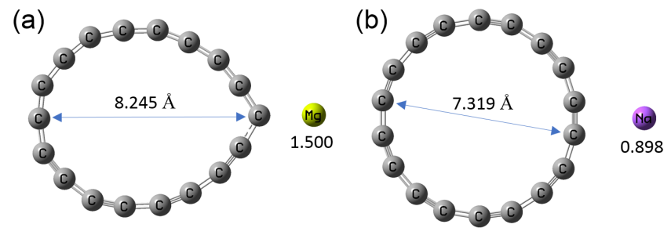

笔者又计算了18碳环与这些阳离子结合后的UV-Vis光谱，二价离子的情况如下所示，确实这些二价金属离子可以使得18碳环光谱在可见光区出现明显的新的吸收带，从而使之显色。而且，不同的离子带来不同位置和强度的吸收峰，因此可以通过恰当选择引入的离子来让体系显不同的颜色。笔者也计算了一价离子与18碳环结合的情况，见文中的补充材料，可见一价离子并没有导致18碳环在可见光区出现可查觉的吸收，这进一步体现了一价碱金属离子的电场尚不足以对18碳环造成足够的极化。

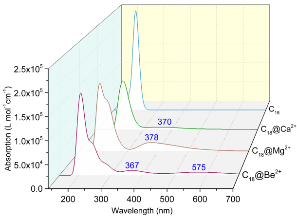

上图中C18@Mg2+在378 nm出现的新的峰的位置以及其强度和之前图像中加了0.02 a.u.电场的情况非常相近。那么，这个新的峰的本质是否也和直接加较强电场时相同？通过考察各个电子激发对C18@Mg2+的这个峰的贡献，可以判断这个峰主要来自于S0->S15的吸收。而这种激发通过《使用Multiwfn便利地查看所有激发态中的主要轨道跃迁贡献》（<http://sobereva.com/529>）中介绍的做法会发现同时有很多轨道跃迁共同贡献，因此没法光通过光观看轨道图形判断跃迁本质。于是笔者使用Multiwfn中强大且普适的空穴-电子分析方法进行了考察，详见《使用Multiwfn做空穴-电子分析全面考察电子激发特征》（<http://sobereva.com/434>）。得到的空穴（蓝色）和电子（绿色）分布图如下所示。由于电子激发过程是一个电子从“空穴”到“电子”方式转移的，因此此图展现出C18@Mg2+在可见光区的吸收主要对应于18碳环到Mg2+的电荷转移激发。这与上一节展现出的电子从18碳环主体激发到一个被电场严重极化到偏离18碳环的空轨道的本质是非常类似的，进一步体现出二价碱土金属离子可以等效展现出外加强电场效果。

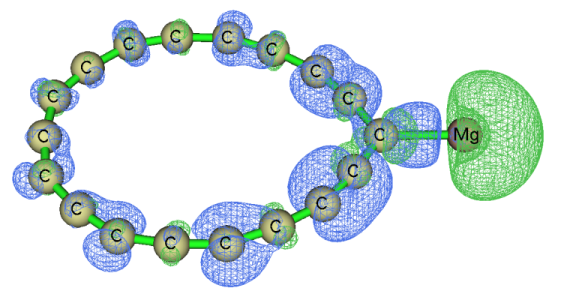

## 7 总结

本文介绍的笔者的文章中对新颖独特的18碳环在电场下的行为、特征做了充分的讨论，系统地研究了电场如何极为明显地影响其几何结构、电子结构和光谱特征，对未来更好地应用18碳环及其类似体系提供了新的思路。文中还使用了笔者想出来的一些非常规的研究方法来将内置本质进一步剖析清楚，比如能量变化分解、偶极矩变化分解、原子受力分析等等。本文可以作为广大Multiwfn用户研究电场对化学体系调控机制类型问题的一个很好的范例，本文也体现出灵活运用Multiwfn，在研究新颖体系、新颖问题上可以创造显著的价值。如果大家对于使用Multiwfn做本文的分析、绘图时有弄不明白的，欢迎在Multiwfn中文论坛上交流：<http://bbs.keinsci.com/wfn>。

论文中还有很多细节、更充分的讨论在本文中没有介绍，请感兴趣的读者完整阅读论文。论文的补充材料里也有许多补充讨论，比如电场方向对结果的影响，请勿忽略。

本文介绍的这个工作受益于近年笔者与江苏科技大学的刘泽玉同志在18碳环研究方面的学术合作，并且他在阅读文章时指出了其中存在的一处明显错误，在此表示感谢。
