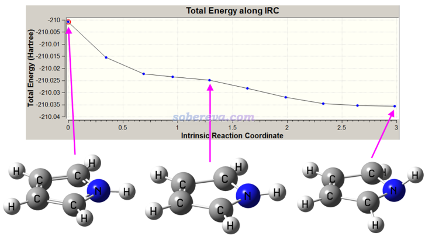
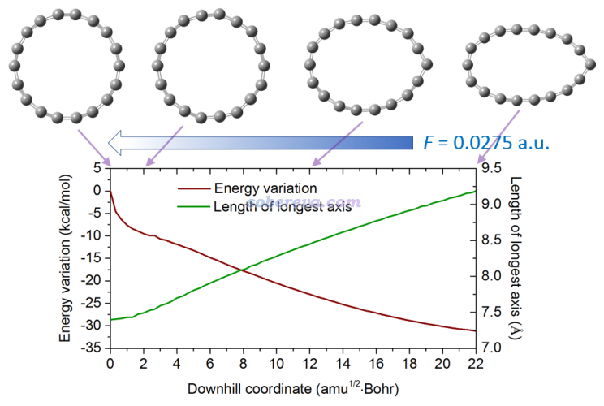
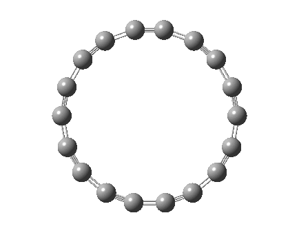

**谈谈Gaussian产生downhill路径的功能**

On the function of Gaussian program for generating downhill paths

文/Sobereva@北京科音  2020-Sep-14

## 1 前言

在Gaussian程序的IRC关键词中，有一个叫downhill（下坡）的选项，很多人都没有留意过，在本文就介绍一下此选项的实际用处。我们一般跑IRC都是从过渡态开始跑的，详见《在Gaussian中计算IRC的方法和常见问题》（<http://sobereva.com/400>），而IRC=downhill任务则可以以任意位置作为起点，Gaussian会按照IRC的算法得到一条downhill轨迹。这条轨迹相当于在质权势能面上体系不断沿着受力方向行进而走出来的理想轨迹，也可以认为是原子运动速度无穷慢的情况下原子走的真实运动轨迹。利用这个功能，我们可以考察体系从非平衡状态（不是当前势能面极小点的状态）向极小点结构弛豫的真实过程。下面就举两个例子说明其用法和意义。

下文涉及到的文件都可以在<http://sobereva.com/attach/571/file.zip>下载。

## 2 吡咯在T1激发态势能面的结构弛豫

吡咯的基态是单重态，在单重态极小点结构下此体系是C2v点群的平面体系。但是在最低的三重态（T1态）下，这个体系就不是平面的了。如果想研究吡咯在T1态势能面的S0极小点结构的位置开始逐渐弛豫向T1态极小点结构的过程，就可以跑downhill轨迹。相应输入文件是本文文件包里的pyrrole_downhill.gjf，关键词是# b3lyp/6-31g(d) IRC(calcall,downhill,maxpoints=100)，结构用的是B3LYP/6-31G*下优化的基态极小点结构。这里利用了maxpoints=100是让downhill轨迹尽可能跑得长一些，从而能走到尽可能接近极小点的位置。由于Gaussian（至少对于G09和G16）默认用的IRC算法HPC很不稳定，特别容易出现校正步不收敛的报错，所以这里用了calcall来很大程度上避免，同时也能增加生成的路径的精度。虽然这会造成耗时增加很多，但由于当前体系很小、计算级别又低，所以就无所谓了（众所周知，用LQA也可以避免校正步不收敛的报错，但都会造成downhill任务卡住，至少对于G09 D.01和G16 A.03经测试都有这个问题。若改用另一种IRC算法GS2来跑虽然原理上也可以，但我发现对于这个例子会失败）。

跑出来的downhill轨迹如下。和观看IRC一样，将输出文件载入到GaussView里，用Results - IRC就可以观看。

可见这个轨迹很好地描绘了体系在T1势能面下自发弛豫，从平面到弯曲的过程。如果你对轨迹末端的结构用0 3结合opt进一步做优化和振动分析，会发现上图最后的结构和进一步优化得到的结构差异甚微。

一定要注意downhill路径和几何优化路径并不相同，没有可替代关系。一方面，几何优化过程的步长是动态的，而不像一般的IRC或downhill轨迹那样是固定的；而且几何优化目的只是去找精确的极小点结构，为达到这个目的不择手段，并不要求过程本质是沿着质权势能面上体系受力方向走的，因此能量的变化也明显不是像downhill任务那样总是平滑下降的。此外，downhill任务至多只能走到一个很接近于与初始结构最近的极小点结构的位置，但不可能恰好落在这个极小点上，必须进一步做几何优化才能精确定位之。

## 3 18碳环在电场下的结构弛豫

在《一篇文章深入揭示外电场对18碳环的超强调控作用》（<http://sobereva.com/570>）文章中介绍了笔者的关于电场对18碳环各方面影响的研究工作，其中笔者就计算了18碳环在电场下的downhill路径。相应的输入文件是本文文件包里的orggeom_field_downhill.gjf，结构用的是没有外电场下优化的结构，关键词写的是  
#p wb97xd/6-311+G(2d) nosymm field=x+275 IRC(calcfc,ReCorrect=never,downhill,maxpoints=100)  
由于这个体系和基组不是很小、计算耗时并不低，所以为了避免出现校正步不收敛报错，没有用calcall，而LQA如前所述又没法用，所以用了ReCorrect=never，这直接去掉了校正步，不仅完全避免了报错，还能节约一些时间，但代价就是得到的downhill路径在有的地方不那么平滑，不过实际发现这对当前任务的不良影响不明显。这个任务给18碳环沿着X方向（平行于碳环的一个方向）加了0.0275 a.u.的外电场，并且为了让电场加的方向和GaussView里载入gjf文件并打开笛卡尔坐标轴时看到的情况对应，用了nosymm避免Gaussian自动把体系调整到标准朝向。由于加了较强外电场可能导致电子被极化得偏离体系显著，因此我的研究中加了弥散函数以确保描述精度。

这个任务跑出来的轨迹如下，是让GaussView把数据导出到文本文件后用Origin绘制的，图中蓝色箭头是外加电场的方向。图中绿色曲线是最长轴距离，相当于碳环最远的两个碳之间的距离。想得到这个曲线的最简单的做法是在GaussView的IRC观看界面左上角点Plots，选Plot Molecular Property，然后选Bond，输入最远的两个碳的序号，然后就会出现相应的距离变化图，然后在相应图上点右键后选保存数据即可。

这个是相应的动画：

从碳环的轴距曲线和动画可见，刚加外电场时，碳环没有马上发生整体的变形，而是一些键长、个别键角发生了调整，之后逐渐地开始变形，在电场的驱动下被约拉越长。变形的内在原因、驱动力是什么，笔者在前述的《一篇文章深入揭示外电场对18碳环的超强调控作用》中从能量和受力角度做了深入的分析，非常建议一看。
