**探究18碳环独特的分子间相互作用与pi-pi堆积特征**

Comprehensive exploration of the unique intermolecular interactions and pi-pi stacking characteristics of cyclo[18]carbon

文/Sobereva@[北京科音](http://www.keinsci.com)  2020-Oct-3

## 1 前言

18碳环（cyclo[18]carbon）是18个碳组成的环状体系，是近期最热门的分子，它具有与一般化学体系截然不同的几何结构、电子结构和各种性质。在2019年于凝聚相中被实验观测到后，这个新的碳的同素异形体打开了碳化学新的篇章，它在未来或许会有着如同富勒烯、石墨烯、碳纳米管一样的重要地位。

北京科音自然科学研究中心（<http://www.keinsci.com>）的卢天、陈沁雪，连同江苏科技大学的刘泽玉，通过量子化学计算和Multiwfn程序（<http://sobereva.com/multiwfn>）做的深入充分的波函数分析，在2020年5月已在碳化学的权威刊物Carbon（IF=8.8）上发表了两篇18碳环的研究工作，充分揭示了其成键本质、电子离域、芳香性、激发态、光学吸收、非线性光学特征，见Carbon, 165, 468 (2020) DOI: 10.1016/j.carbon.2020.04.099和Carbon, 165, 461 (2020) DOI: 10.1016/j.carbon.2020.05.023。近期，上述作者在Carbon刊物上发表了第三篇研究工作，专注于揭示18碳环的弱相互作用，特别是对小分子的吸附和pi-pi堆积问题，见***Carbon*, 171, 514-523 (2021) DOI: 10.1016/j.carbon.2020.09.048**，欢迎大家阅读和引用。北京科音自然科学研究中心已有的关于18碳环的研究工作汇总和各种相关博文见<http://sobereva.com/carbon_ring.html>。

下面，将对这篇文章的主要内容做浅显易懂的介绍、解读和相关评述，与论文原文存在互补性，请阅读本文后再仔细阅读原文。这篇文章不仅是一篇18碳环的研究文章，也是一篇使用Multiwfn做波函数分析研究新颖体系在高档次期刊发表文章的很好的范例，其中的分析方法和思想值得在其它研究中借鉴。

## 2 文章主要内容的介绍、解读和相关评述

下文大部分是弱相互分析，涉及的相关知识和操作在《Multiwfn支持的弱相互作用的分析方法概览》（<http://sobereva.com/252>）都有提到，如果没看过此文的话建议仔细看看。

## 2.1 静电势分析

碰到诸如18碳环这么一个特征新颖的分子，在研究其弱相互作用特征时不应急于去优化复合物、算结合能之类的，而应当先考察一下它与外环境可能有什么样的作用。分子间弱相互作用一般主要由静电作用和范德华作用两部分构成，相关知识见《谈谈“计算时是否需要加DFT-D3色散校正？”》（<http://sobereva.com/413>）中对弱相互作用本质的简要介绍。通过静电势可以直观地估计当前分子与其它分子的静电作用，相关信息见《静电势与平均局部离子化能综述合集》（<http://bbs.keinsci.com/thread-219-1-1.html>），Multiwfn是分析静电势极为强大而且非常易用的工具。范德华势是对静电势的重要补充，如果想要直观考察当前分子与外部分子的范德华作用，可以通过考察范德华势实现，这是Multiwfn独家支持的非常有实际意义的功能，详见《谈谈范德华势以及在Multiwfn中的计算、分析和绘制》（<http://sobereva.com/551>）。

我们先看18碳环的静电势。其等值面图如下图左侧所示，绿色和蓝色分别是静电势为0.001和-0.001 a.u.的等值面，紫色圆球是静电势极小点位置，具体数值也标上了。此图可以通过《绘制静电势全局极小点+等值面图展现孤对电子位置的方法》（<http://sobereva.com/493>）结合《在VMD里将cube文件瞬间绘制成效果极佳的等值面图的方法》（<http://sobereva.com/483>）中的绘图脚本轻易得到。作为对比，在下图右边给出了乙炔的这种图，为了便于比较，等值面数值用的是更大的0.01 a.u.。注意18碳环是较长和较短C-C键交替构成的，其中一个较短的C-C键在下图用红色箭头标注了。

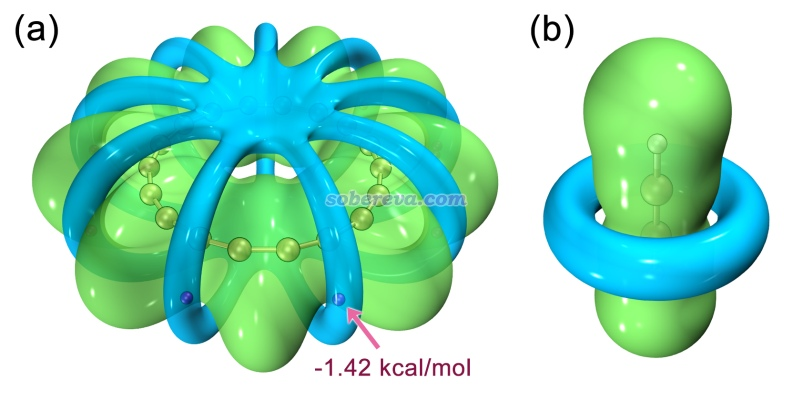

由上图可见，18碳环的静电势分布相当不均匀，围绕着较短的C-C键的环状区域静电势为负，而在其它区域基本为正，这是18碳环的C-C键的差异性所带来的。18碳环的C-C键在Carbon, 165, 468 (2020)中有充分的讨论，没看过此文的话建议仔细阅读以了解18碳环的电子结构特征。

下面是分子平面的静电势的填色图，可以把静电势分布展现得更充分、全面，其中蓝色实线是分子的范德华表面（电子密度0.001 a.u.等值面）。此图只要效仿Multiwfn手册中4.4节的平面图的绘制例子就可以非常容易地绘制出来。

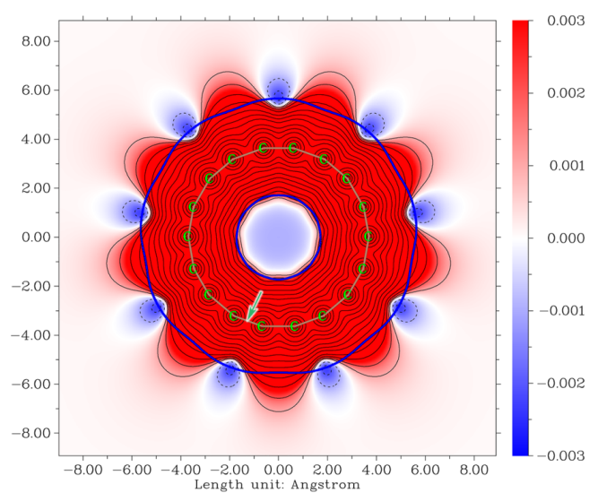

绕着18碳环的较短的C-C键有静电势为负的一圈，这和上面图中的乙炔的情况非常类似，也间接地反映出这种键实际上和乙炔一样形成了两套pi作用。但是，由于18碳环的静电势极小点仅为-1.4 kcal/mol，而乙炔的极小点则达到-20.0 kcal/mol，因此从侧面反映出18碳环的这种C-C键上的pi电子是明显少于乙炔的，远远算不上是典型的三重键。在Carbon, 165, 468 (2020)中也明确批判了一些文章将18碳环视为是单、三键交替的误导性说法。

分子范德华表面的静电势和分子间相互作用特征关系非常密切，因此文中给出了18碳环范德华表面上静电势的填色图，如下图所示。图中越红区域静电势越正，越容易与带负电的Lewis碱结合，而越蓝区域静电势越负，越容易与带正电的Lewis酸结合。范德华表面上静电势极小点和极大点分别用蓝球和黄球标注了。这种图可以通过《使用Multiwfn+VMD快速地绘制静电势着色的分子范德华表面图和分子间穿透图（含视频演示）》（<http://sobereva.com/443>）中的做法非常容易地绘制出来。另外，下图右侧还展现出了范德华表面上的静电势分布统计图，可以非常清晰地看出分子表面上不同数值范围的静电势的分布情况。这种图是在J. Phys. Org. Chem., 26, 473 (2013)和Struct Chem., 25, 1521 (2014)中提出的，可以按照《使用Multiwfn结合VMD分析和绘制分子表面静电势分布》（<http://sobereva.com/196>）所述的过程绘制。

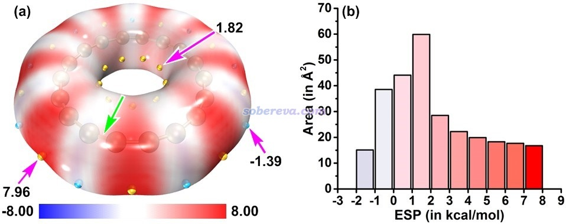

由上图可见，18碳环表面的静电势数值整体很小，而且分布在比较窄的范围内，其中静电势为正的部分占主导，且静电势最大处的绝对值也高于静电势最负处的绝对值。因此从纯静电角度来说，18碳环的外表面更容易和Lewis碱结合。静电势为正的部分集中出现在较长的C-C键周围，这也体现出由于这种键上的pi电子较少，对核电荷的屏蔽程度不够充分。

文中还用Multiwfn计算了分子极性指数（molecular polarity index, MPI），此指数的介绍见《谈谈如何衡量分子的极性》（<http://sobereva.com/518>）。这个指数相当于分子表面上静电势的绝对值的平均值。其数值越大，说明分子表面平均静电势偏离0越大，因此极性越大，与其它物质靠静电作用结合的能力整体越强。18碳环的MPI仅为2.6 kcal/mol，而同级别下计算的乙烷、乙烯、苯的MPI分别为2.6、6.7、8.4 kcal/mol，这进一步说明18碳环的整体极性很弱，只有通常被视为完全无极性的饱和烷烃的水平。这也体现出，如果要分析18碳环与其它分子的相互作用，静电作用应当不是主导因素，必须着眼于范德华作用。

此文还考察了18碳环的范德华体积、表面积和尺寸特征。其中提到18碳环的内径是3.44埃，这不是一个很小的数值，因此正如后面给出的复合物结构所体现的，一些很小的分子是可以被完全吸入18碳环中央的。关于分子尺寸/体积/面积的计算方法，见《使用Multiwfn计算分子的动力学直径》（<http://sobereva.com/503>）、《谈谈分子体积的计算》（<http://sobereva.com/102>）、《使用Multiwfn和VMD计算分子表面积和片段表面积》（<http://sobereva.com/487>）。

## 2.2 范德华势分析

范德华势的原理和计算方法看《谈谈范德华势以及在Multiwfn中的计算、分析和绘制》（<http://sobereva.com/551>）。这个方法基于UFF力场参数，在选定的探针原子下，可以给出分子与外环境的范德华势及其两个组成部分的分布，即交换互斥势和色散吸引势，其中后者起到吸引作用，对于研究分子间结合问题特别有意义。下图左侧是18碳环的以碳作为探针原子的范德华势的数值为-1.0 kcal/mol的等值面，黄球是最小点位置。下图右边是分子截面的范德华势的填色图，越蓝的区域色散吸引势越强。

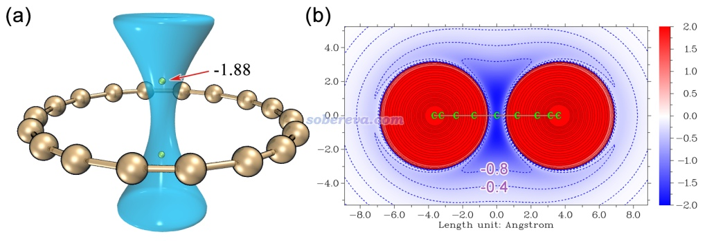

由上图可见18碳环对环中心轴线区域的色散吸引作用非常显著。对于像碳这样的第二周期原子来说，在碳环中心上方和下方的位置感受到的吸引作用是最强的，这是因为在环的正中心处位阻作用会较强，而偏离环中心太远的位置色散吸引作用又会过度衰减。在范德华势的极小点处其数值接近-2 kcal/mol，即曰若有一个碳原子在那里，18碳环靠范德华作用与它就有大约-2 kcal/mol（约-8 kJ/mol）的结合能，这对于本身通常很弱的范德华作用来说不是一个小数目。有这么大的范德华势的原因显然在于18碳环的排列非常规整有序，在上图的黄球位置可以同时感受到多达18个碳对它的色散吸引。

此例体现出范德华势在预测弱极性体系对周围分子吸附作用位点方面很有实际意义。在范德华势的原文DOI: 10.26434/chemrxiv.12148572中有更多例子，很建议一看。

## 2.3 18碳环与小分子的相互作用

为了考察18碳环与典型小分子的弱相互作用特征，文中优化了18碳环与一系列常见的小分子、稀有气体原子的复合物，这种模型和18碳环对小分子的吸附问题直接相关。同时还优化了18碳环与Na+阳离子的复合物以研究18碳环与离子的作用。其中一部分复合物如下图所示，另外一部分参见论文补充材料的图S3。下图不仅给出了几何结构，还同时绘制了RDG等值面图（也称NCI图），这种图是如今非常流行的图形化展现化学体系中存在的弱相互作用位置和特征的方法，Multiwfn是做这种分析非常好的程序，绘制方法和相关介绍见《使用Multiwfn图形化研究弱相互作用》（<http://sobereva.com/68>）、《用Multiwfn+VMD做RDG分析时的一些要点和常见问题》（<http://sobereva.com/291>）、《使用Multiwfn做NCI分析展现分子内和分子间弱相互作用》（<https://www.bilibili.com/video/av71561024>）。值得一提的是，为了确保得到的是18碳环与这些小分子的最稳定结合结构，文中通过genmer结合molclus程序做了二聚体构型搜索，相关信息见molclus主页<http://www.keinsci.com/research/molclus.html>。

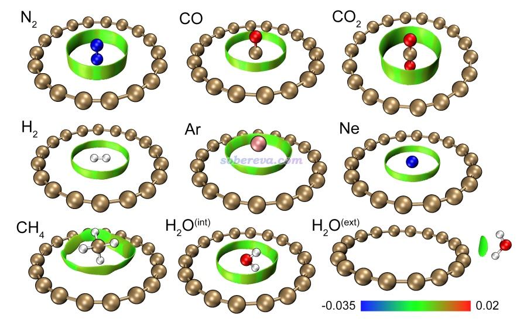

由上图可以看到，对于各种小分子和稀有气体原子，18碳环都会把它们吸到环的内侧区域。由于H2和Ne非常小，吸附后可以和18碳环共平面。而对于N2、CO2、CO等由第二周期原子形成的直链分子，都会垂直地插入到18碳环中央，这是因为以这种方式结合时可以让分子中的原子尽量充分浸在范德华势最负的区域，使得结合最稳定。对于CH4、Ar，由于其尺寸略大一些，位阻作用导致它们没法插入到碳环里面，所以是结合到环上方。水分子的情况比较特殊，做构型搜索后发现水分子在环内和环外结合都有对应的无虚频的极小点，这是其它分子没有出现的情况。上图中的RDG等值面把18碳环与小分子的相互作用区域非常直观地展示了出来，根据sign(lambda2)rho函数着色时都是显绿色，体现出这些作用区域电子密度很低、强度比较弱，可归为范德华作用。但由于当前RDG等值面比较广阔，绕着被吸附的分子周围有一大圈，说明作用区域比较大，碳环的每个原子都能与小分子充分作用上，所以正如后面的结合能所体现的，18碳环与小分子的结合强度其实一点也不低。

为了考察18碳环与小分子和钠离子的结合强度，文中使用计算弱相互作用精度很高的ωB97X-V/def2-QZVPP级别在counterpoise校正下计算了结合能。在普通泛函中，ωB97X-V算弱相互作用几乎是目前精度最高的（文中没有考虑用双杂化泛函，因为双杂化泛函算18碳环普遍定性错误，会优化成键长均衡的错误情况）。ωB97XD在Carbon, 165, 468 (2020)中被证明十分适合描述18碳环，而ωB97X-V是其后继者，而且也是长程校正泛函，因此有正确描述18碳环电子结构的能力，算此体系的弱相互作用问题是可靠的。另外，为了从能量角度了解18碳环与小分子的作用本质，文中用高精度的SAPT2+(3)δMP2/aug-cc-pVTZ级别做了SAPT能量分解计算，这不仅给出了总结合能，还给出了其中的物理成分，实现方法见《使用PSI4做对称匹配微扰理论(SAPT)能量分解计算》（<http://sobereva.com/526>）。在《透彻认识氢键本质、简单可靠地估计氢键强度：一篇2019年JCC上的重要研究文章介绍》（<http://sobereva.com/513>）中介绍的文章的测试中，也体现出SAPT2+(3)δMP2算结合能非常准确，可以达到近乎CCSD(T)的精度。上述两种方法算的结合能如下所示。可见这两种级别的结果差异不大，也体现出SAPT2+(3)δMP2给出的作用能的物理成分数据应当是可靠的。

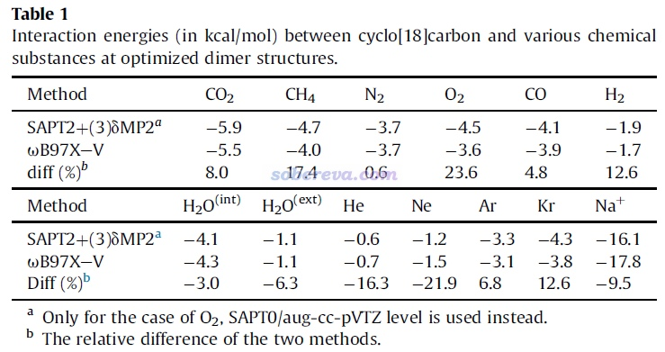

上面的数据体现出，至少从电子能量的变化看，18碳环对小分子的结合是较稳固的。比如它与CO2的结合能是-5.5 kcal/mol（-23 kJ/mol），这都赶上水二聚体中的氢键键能了。还可以看到，水在环内时的结合能-4.3 kcal/mol明显高于水在环外部的结合能-1.1 kcal/mol，这原因很容易理解，因为水在环内可以同时感受到所有碳原子的色散吸引，而在环外部时只有与之近邻的几个碳原子对它有显著的色散吸引作用，毕竟色散作用随距离衰减很快。

前面一直说小分子与18碳环的作用主要是范德华作用，现在再来看看严格的SAPT能量分解给出的结论如何。18碳环与各个物质的结合能的各种物理成分如下所示，可以看到确实18碳环与中性分子的结合主要是由于色散吸引所贡献，而静电作用虽然也对结合起到有利贡献，但贡献相对次要得多。这是因为如前所述，18碳环的整体极性很弱，特别是从分子范德华表面的静电势图来看，环内区域静电势很接近于0。诱导作用体现出分子间相互极化、电荷转移对能量的影响，这部分对于中性分子与18碳环结合几乎没贡献，相对来说，只有极性较大的水分子与18碳环结合时诱导项不可忽视。另外，由下图可见，诱导作用是18碳环与Na+有强烈结合作用的主因。

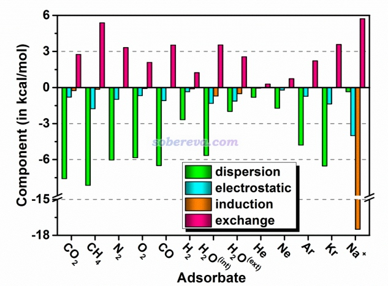

再深究一下，为什么所有考察的小分子中，唯独水分子在18碳环外部结合时存在极小点结构？文章在补充材料里专门通过静电势的互补角度做了详细讨论。读者如果没看过《静电效应主导了氢气、氮气二聚体的构型》（<http://sobereva.com/209>）的话非常建议一看，其中介绍的研究H2、N2二聚体的论文中指出分子间倾向于以静电势正负互补的方式结合来最大化静电吸引作用，这种作用可以明显影响分子间结合时的朝向和构型稳定性。当水分子与18碳环在外部结合时，如下面的分子表面静电势叠加图所示，18碳环外侧静电势为负的区域（蓝色）可以与水分子的静电势为正的区域（红色）高度互补，这造就了一个亚稳的二聚体结构，这也可以算是18碳环与水形成的pi-氢键。虽然水以这样方式与碳环结合的结合能-1.1 kcal/mol远不及它在环内结合时的-4.3 kcal/mol，看似研究这种结合模式的实际意义不大，但注意如果18碳环内侧已经被一个无极性或低级性的小分子占据了，那么再结合一个水分子的话，明显就应当以下图所示的方式结合了。

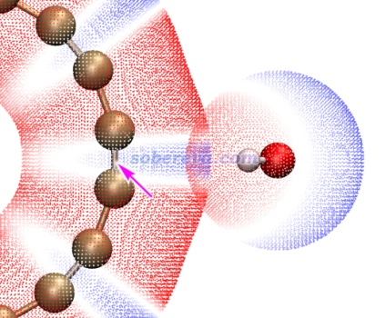

再来深究一下为什么18碳环与钠离子的结合能非常大，而且对结合的贡献是：诱导>静电>色散。文中为了考察这一点，在补充材料里通过Multiwfn绘制了ρ(C18...Na+)-ρ(C18)-ρ(Na+)密度差图的平面图以体现18碳环与钠离子结合前后电子密度分布的变化，如下图左侧所示。电子密度增加和降低部分分别以红色和蓝色展示。绘制方法参考《使用Multiwfn作电子密度差图》（<http://sobereva.com/113>）。为了将密度差分布展现得更清楚，文中还绘制了密度差的局部积分曲线，如下图右侧所示，这展现了每个截面的密度差的积分值。这种曲线的绘制方法见Multiwfn手册的4.13.6节。

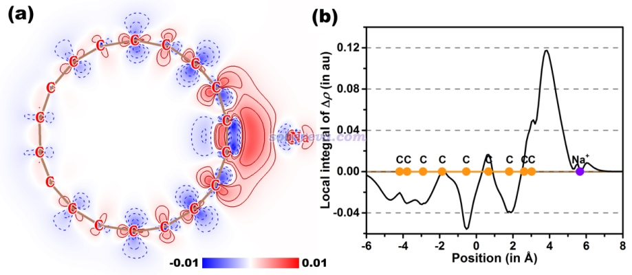

从上图可以清楚地看出，18碳环遇到钠离子后，由于受到其正电荷的吸引，电子密度被严重朝着钠离子方向极化，并大量转移到二者的结合区域。由于电子密度分布有如此大幅的改变，自然SAPT能量分解给出的诱导项会非常大。另外，如前所述，本身18碳环外侧区域也有静电势为负的部分，钠离子在结合时也正好出现在这样的区域，因此钠离子的正电荷与18碳环原本的电荷分布之间也有明显的静电吸引作用，这一定程度上体现在SAPT给出的较大的静电作用项上。

之所以18碳环能够被钠离子极化得这么厉害，关键在于18碳环在平行于环方向上的极化率非常大，这点在Carbon, 165, 461 (2020)中做了专门的研究，并且在《一篇文章深入揭示外电场对18碳环的超强调控作用》（<http://sobereva.com/570>）介绍的文章中做了很多相关讨论。

## 2.4 18碳环二聚体

18碳环的二聚体是十分值得研究的体系，因为这和18碳环纯物质、高浓度情况下其存在的形态关系密切。优化后的18碳环二聚体的结构如下所示，有D9d对称性。

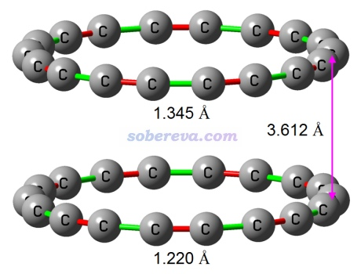

上图中红色和绿色分别对应较短和较长的C-C键，可见二聚体中是一个长键正好对着一个短键。为什么两个18碳环倾向于以这种交错方式排列？这可以通过两个单体的范德华表面静电势叠加图来考察，如下所示。由图可见，这种交错排列的结构下，每个较短的C-C键周围一圈静电势为负的区域正好能与另一个碳环的一个较长的C-C键周围一圈静电势为正的区域重合，再次体现出静电势互补对复合物结构的稳定化作用。

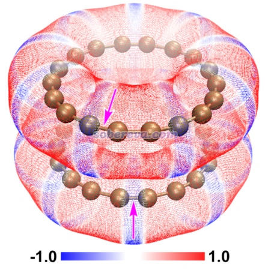

文中用ωB97X-V/def2-QZVPP结合counterpoise校正计算了18碳环二聚体的结合能，结果为-9.2 kcal/mol（-38.5 kJ/mol），这已经是一个很大的数值了，已经达到平行位错堆积的苯二聚体结合能的三倍以上了。之所以18碳环之间能结合得这么稳定，关键在于18碳环是个理想平面，上面全是pi电子，碳原子数又多，因此可以形成理想的、大面积的pi-pi堆积。

为了更进一步从能量角度了解18碳环二聚体结合的本质，文中在scaled SAPT0/jun-cc-pVDZ级别下做了能量分解，发现色散作用是主要贡献者，对吸引作用贡献了76%，而静电作用相对次要，只贡献了19%。由于18碳环极性很低，结合时彼此间的极化作用可以忽略不计，所以SAPT的诱导项仅贡献了5%。

为什么可以说18碳环二聚体之间是pi-pi堆积作用？文章给了如下明确的证据，完全满足Grimme在Angew. Chem. Int. Ed., 47, 3430 (2008)指出的pi-pi堆积作用的本质和特征  
(1)18碳环间的结合是色散作用主导  
(2)18碳环存在全局离域的pi电子  
(3)两个18碳环彼此间完全平行  
(4)两个18碳环的pi电子彼此之间有近距离接触。这点从下面的18碳环二聚体的LOL-pi函数的0.2等值面图可以看得非常清楚，等值面明确展现了pi电子的主要离域的区域。此图是用Multiwfn按照《在Multiwfn中单独考察pi电子结构特征》（<http://sobereva.com/432>）中介绍的方法绘制的，这种图对于考察电子离域特征特别价值。

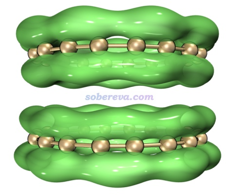

文中还绘制了18碳环二聚体的RDG填色等值面图，并且用Multiwfn做了AIM拓扑分析，将键径和临界点一起绘制了出来，如下所示，绘制方法参见《使用Multiwfn+VMD快速地绘制高质量AIM拓扑分析图（含视频演示）》（<http://sobereva.com/445>）。Multiwfn做拓扑分析的相关介绍见《使用Multiwfn做拓扑分析以及计算孤对电子角度》（<http://sobereva.com/108>），AIM的相关知识见《AIM学习资料和重要文献合集》（<http://bbs.keinsci.com/thread-362-1-1.html>）。

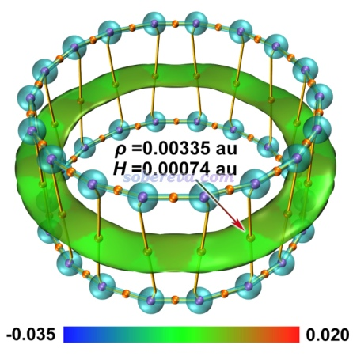

由上图可以明显看到两个18碳环之间形成了大面积的环状作用区域，其RDG等值面扁平，而且电子密度很低，这和典型的pi-pi堆积体系的RDG等值面特征完全一致，进一步体现出18碳环之间确实是形成了pi-pi堆积。上图中桔黄色的键径将密切作用的原子间的最有代表性的相互作用路径直观地展现了出来，与RDG等值面在图形化展现弱相互作用上有一定互补性。图中桔黄色圆球的是键临界点，其电子密度和能量密度标在了图上，可见电子密度相当小，而且能量密度为正，因此碳环间的共价作用特征可以忽略不计。关于使用键临界点特征讨论作用特征的方法，参看《Multiwfn支持的分析化学键的方法一览》（<http://sobereva.com/471>）中的AIM部分。

此文的一个审稿人提出了一个疑问：pi-pi堆积体系最稳定结构往往都是平行位错的结构，18碳环二聚体的这种D9d结构是否真的是能量最低结构？文中为了证明D9d就是能量最低结构，对单体间两种平行位错进行了扫描，一个是冲着一个碳的方向扫描，另一个是与之正交的垂直于一个C-C键的方向扫描，相对于D9d极小点结构的能量的变化如下图右侧所示，图片右下角是平行位错5埃时候的示意图。文章还顺带着对18碳环垂直间距进行了扫描，不同距离处的结合能如下图左侧所示，极小点位置在图上做了标注。

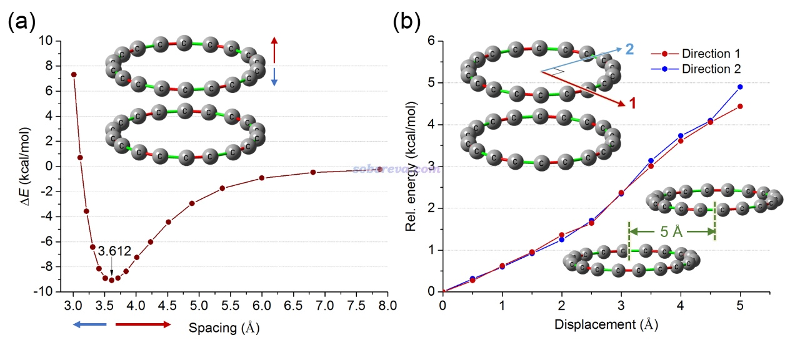

由上图可见，相对于优化后的D9d结构，无论怎么移动18碳环，都会令能量增加，因此前面研究的二聚体结构确实是能量最低结构。之所以苯二聚体的极小点结构是平行位错的，石墨中两层之间也是彼此错开的（每个碳对着另一层的六元环中心），这是因为这种方式排列一方面可以减小两个单体间的碳碳之间的交换互斥，一方面还可以增进静电吸引并一定程度回避pi电子之间的静电互斥。而对于18碳环，由于其独特的几何和电子结构特征，在面对面的交错排列堆积的结构下本身就满足了这些有利于结合的效应，若强行平行位错的话不仅不带来能量降低的因素，反倒因为减少了pi-pi堆积有效作用区域而令能量升高。18碳环二聚体的这种作用方式，可以说是独一无二、不同寻常的pi-pi堆积方式，在今后的pi-pi作用综述、介绍文章中很值得作为一个特殊例子进行提及。

最后，为了研究18碳环二聚体在真实情况下的动态行为，文章在较低的100 K温度的热浴下跑了4000 fs的从头算动力学模拟。为了直观展示构型变化过程，对整条轨迹中的一个碳环做了叠合消除其平动转动后，后每隔100 fs绘制了一次，叠加图如下所示。颜色红-白-蓝对应结构在整条轨迹中的时间。这种图的绘制方法可参考<http://sobereva.com/wfnbbs/viewtopic.php?id=331>。

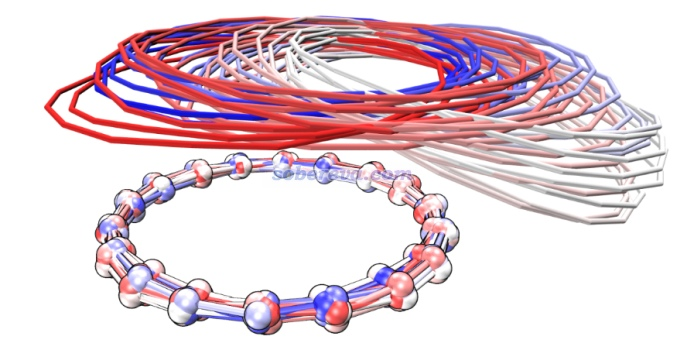

由上图可见，模拟开始后两个碳环之间出现了相对滑动，图中上方的碳环逐渐滑到了下面碳环边缘位置后还出现了明显的歪斜，但是之后上方的碳环由于回复力自发又变化回一开始的面对面堆积的结构了，这说明18碳环pi-pi堆积结构至少在低温下是具有稳定性的，不至于自发变成其它构型。

文章中对动力学轨迹还做了定量统计，以更准确地展现模拟过程中的二聚体结构变化。下图红色曲线展现了环中心间的距离变化，蓝色曲线展现了下方的碳环的法矢量和两个碳环连线的夹角变化。由图可见在4000 fs的模拟过程的中途，两个环之间的滑移达到了最大，但之后又基本复原了。做这种分析的方法见《计算分子动力学轨迹中两个环平面间的距离和夹角》（<http://sobereva.com/590>）。

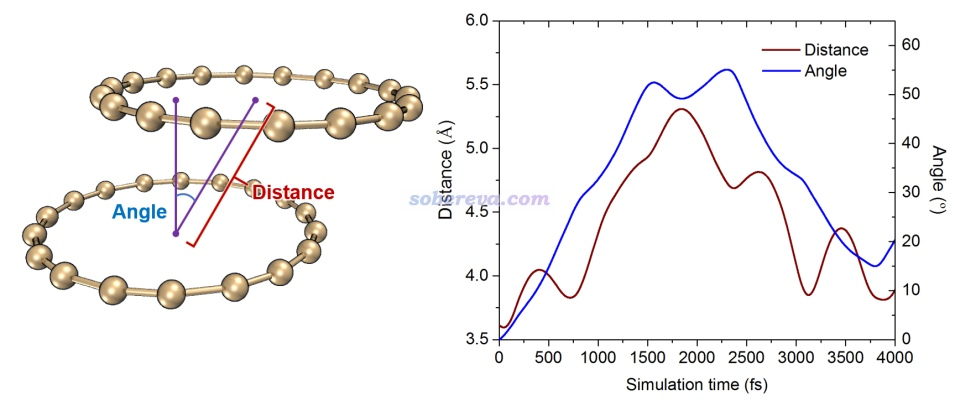

## 3 总结

本文介绍的Carbon, 171, 514-523 (2021)的文章中系统地研究了18碳环的分子间相互作用问题。文中除了常规的量子化学计算外，还充分灵活运用Multiwfn程序做了大量分析，使得弱相互作用的本质被研究得深入透彻，给讨论提供了丰富得多的视角。本文可以作为广大Multiwfn用户研究弱相互作用类型问题的一个很好的范例。若只是单纯做量子化学计算，而没有这些波函数分析的话，即便是以比较新颖热门的体系为题材，纯理论研究的文章也是很难发到像Carbon这样一区期刊上的。如果大家对于使用Multiwfn做本文的分析、绘图时有弄不明白的地方，欢迎在Multiwfn中文论坛上发帖咨询：<http://bbs.keinsci.com/wfn>。

顺带一提，第六届量子化学波函数分析与Multiwfn程序培训班预计在2020年11月中或下旬于北京举办，为期五天，幻灯片多达2200多页。其中会非常全面、深入、透彻地讲解所有非常重要的波函数分析方法以及Multiwfn（及NBO等其它）波函数分析程序的各种功能的使用。参加者将会充分领略到波函数分析在量子化学研究中能起到的重要理论和实际意义，并显著提升量子化学研究的深度和水准，从而发更好的文章。培训内容详细介绍见<http://www.keinsci.com/workshop/WFN_content.html>，相对于往届又有很多更新和扩充。报名将于培训的一个月前在“北京科音”微信公众号和北京科音官网（<http://www.keinsci.com>）上发布，欢迎关注、相互转告和参加！

**2024-Oct-31补充**：笔者后来还发表了其它的与碳环体系的弱相互作用有关的研究文章，非常推荐阅读：  
全面揭示各种碳环与富勒烯之间独特的pi-pi相互作用！  
<http://sobereva.com/727>  
8字形双环分子对18碳环的独特吸附行为的量子化学、波函数分析与分子动力学研究  
<http://sobereva.com/674>

另外，如果你对pi-pi研究感兴趣，强烈建议阅读《谈谈pi-pi相互作用》（<http://sobereva.com/737>）。
