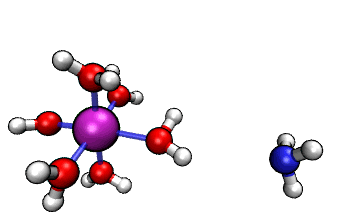
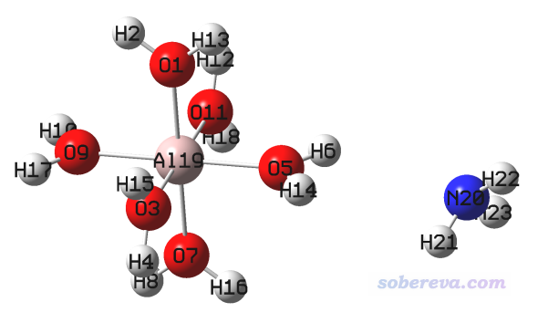
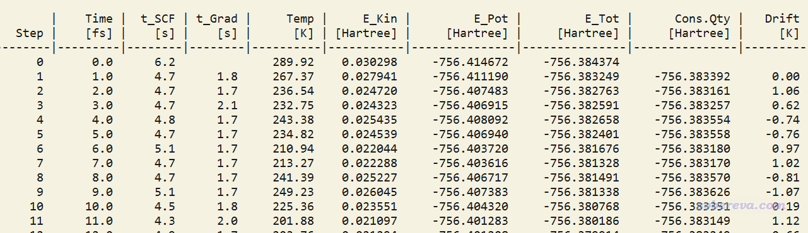
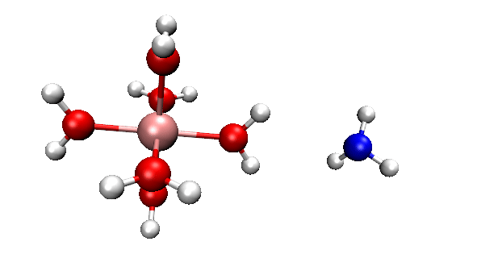
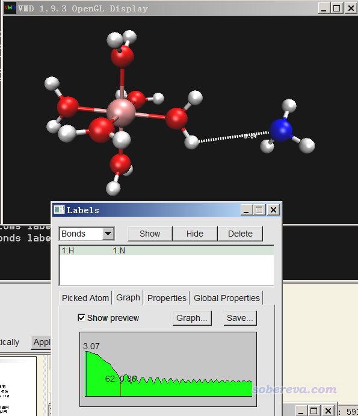
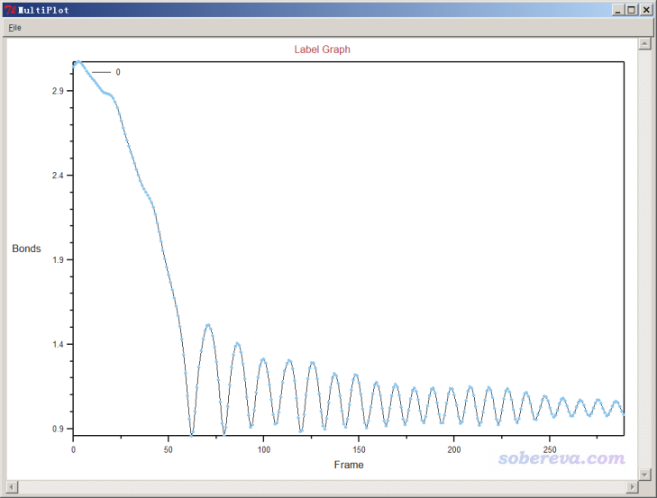
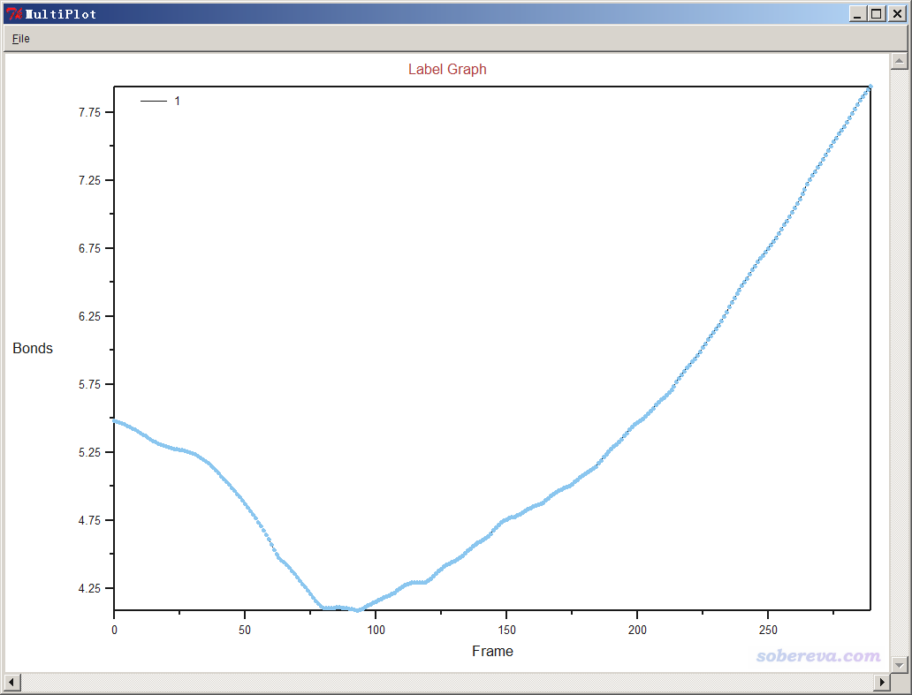

**使用ORCA做从头算动力学(AIMD)的简单例子**

A simple example of performing ab initio dynamics (AIMD) using ORCA

Sobereva@[北京科音](http://www.keinsci.com)

First release: 2020-Dec-13  Last update: 2025-May-9

## 1 前言

基于量子化学方法的动力学一般称为从头算动力学（Ab initio molecular dynamics, AIMD），相比于基于一般的经典力场的动力学，其关键优势在于精度高、普适性强、能够描述化学反应，代价是耗时相差N个数量级。ORCA量子化学程序有不错的做BOMD形式的从头算动力学的功能，使用很方便，而且本身ORCA做DFT的效率又高，是做孤立体系AIMD的首选程序之一。虽然有些特性不支持，比如没法像Gaussian的BOMD那样直接做准经典动力学，不能根据原子距离等标准判断什么时候自动结束任务等等，但都不是大问题。对于跑跑普通的AIMD来说，笔者感觉ORCA明显比Gaussian的ADMP或BOMD更好用（Gaussian的AIMD输入文件较为抽象，手册相应部分写得很烂，而且连个像样的热浴都没有），而且速度也明显更快。

笔者发表的18碳环（cyclo[18]carbon）的研究论文中，其单体和二聚体做的分子动力学就是用ORCA跑的，分别见《揭示各种新奇的碳环体系的振动特征》（<http://sobereva.com/578>）对中Chem. Asian J., 16, 56 (2021)和《全面探究18碳环独特的分子间相互作用与pi-pi堆积特征》（<http://sobereva.com/572>）中对Carbon, 171, 514 (2021)一文的介绍。在《18碳环等电子体B6N6C6独特的芳香性：揭示碳原子桥联硼-氮对电子离域的关键影响》（<http://sobereva.com/696>）中介绍的笔者的Inorg. Chem., 62, 19986 (2023)文章中还用ORCA跑了B6C6N6的高温动力学以证明其稳定性。在《18个氮原子组成的环状分子长什么样？一篇文章全面揭示18氮环的特征！》（<http://sobereva.com/696>）中介绍的笔者的ChemPhysChem, 25, e202400377 (2024)文章中还用ORCA跑了18氮环的动力学以考察其热分解行为。这些文章可以作为ORCA跑AIMD的典型范例，很推荐阅读和引用。

笔者在**北京科音高级量子化学培训班（**[**http://www.keinsci.com/workshop/KAQC_content.html**](http://www.keinsci.com/workshop/KAQC_content.html)**）**中会用多达两百多页的ppt专门深入详细讲AIMD的模拟，其中也包括ORCA做AIMD的各种细节、大量技巧以及诸多实例，并且此培训中还会系统讲授ORCA程序的使用，**因此是使用ORCA专门做AIMD的读者一定不可错过的培训**。而本文只是举一个简单的例子，帮助读者快速了解ORCA如何做最简单的AIMD。注意ORCA只适合跑孤立体系的从头算动力学，如果是做周期性体系的从头算动力学，CP2K是最佳的选择，在笔者讲授的北京科音CP2K第一性原理计算培训班（<http://www.keinsci.com/workshop/KFP_content.html>）中有极为全面、系统、详细的讲解并给了大量例子。

本文内容适用于Multiwfn最新版本、VMD 1.9.3、ORCA 4.2.x及以后版本的情况。

2021-Jul-7 针对ORCA 5.0的补充说明：对于2021-Jul-7及以后更新的Multiwfn，进入本文所述的Multiwfn产生输入文件的界面后，可以通过选项-11选择适合的ORCA版本，默认为ORCA 5.0及以后版本，而下文内容对应的是4.2.x版的情况。对于>=5.0版，Multiwfn自动设的热浴是CSVR，比之前版本唯一支持的Berendsen热浴更好，而且同样普适。而且在run后面多加了CenterCOM，这是从5.0版本开始支持的消除整体质心运动的选项，而下文里提到的constraint add center这一行就没有了。

## 2 实例：[Al(H2O)6]3+与NH3之间的质子转移

ORCA的MD模块的开发者网站上有个真空中[Al(H2O)6]3+与NH3之间的质子转移的动画，如下所示

可见NH3向带正电的[Al(H2O)6]3+逐渐靠近，水上的一个质子转移到了氨气分子上，然后由于静电互斥，NH4+就逐渐远离[Al(H2O)5(OH)]2+了。这里我们试图重现这个过程。下面提到的文件都可以在<http://sobereva.com/attach/576/file.zip>中获得。

我们首先获得[Al(H2O)6]3+的基本合理的结构。当然用ORCA优化也可以，这里笔者习惯性地用Gaussian来优化。在GaussView里搭建Al(H2O)6，保存为Al(H2O)6_optfreq.gjf，将关键词改为# B3LYP/6-31G* opt freq，将电荷改为3，然后用Gaussian运行之，就得到了优化后的[Al(H2O)6]3+结构。再用GaussView打开输出文件Al(H2O)6_optfreq.out，把一个氨气分子画在一个水的旁边，如下所示，然后保存为complex.gjf。

Multiwfn程序（<http://sobereva.com/multiwfn>）有很便利的生成ORCA常见任务的输入文件的功能，见《详谈Multiwfn产生ORCA量子化学程序的输入文件的功能》（<http://sobereva.com/490>），这里我们用Multiwfn生成ORCA的AIMD任务的标准输入文件。

启动Multiwfn，载入complex.gjf，然后输入  
oi  // 生成ORCA输入文件  
0  // 选择任务类型  
6  // 分子动力学  
1  // 计算级别用B97-3c  
在当前目录下就得到了ORCA的AIMD任务的标准输入文件complex.inp。

在complex.inp里面将相应几行改成下面这样：  
%maxcore  10000  
%pal nprocs   10 end  
timestep 1.0_fs  
initvel 298.15_K  
* xyz   3   1

现在的complex.inp的完整内容如下。以#为开头的行代表后面的设置被注释掉了，不会生效，想启用可以去掉#。此文件里也有大量Multiwfn自动添加的注释，只要一看注释马上就明白相应的行是什么含义，巨贴心，都省得查手册了。

! B97-3c noautostart miniprint nopop  
 %maxcore  10000  
 %pal nprocs   10 end  
 %md  
 #restart ifexists  # Continue MD by reading [basename].mdrestart if it exists. In this case "initvel" should be commented  
 #minimize  # Do minimization prior to MD simulation  
  timestep 1.0_fs  # This stepsize is safe at several hundreds of Kelvin  
  initvel 298.15_K no_overwrite # Assign velocity according to temperature for atoms whose velocities are not available  
  thermostat berendsen 298.15_K timecon 30.0_fs  # Target temperature and coupling time constant  
  dump position stride 1 format xyz filename "pos.xyz"  # Dump position every "stride" steps  
 #dump force stride 1 format xyz filename "force.xyz"  # Dump force every "stride" steps  
 #dump velocity stride 1 format xyz filename "vel.xyz"  # Dump velocity every "stride" steps  
 #dump gbw stride 20 filename "wfn"  # Dump wavefunction to "wfn[step].gbw" files every "stride" steps  
  constraint add center 0..22  # Fix center of mass at initial position  
  run 2000  # Number of MD steps  
 end  
 * xyz   3   1  
 [坐标部分]  
 *

下面简单说一下complex.inp里这些设置的含义、为什么这么设。  
• B97-3c是一个又便宜又不错的计算级别，在ORCA里还自动会启用RIJ加速，速度很快，因此很适合跑AIMD，描述当前体系没有问题。B97-3c的介绍见《详谈Multiwfn产生ORCA量子化学程序的输入文件的功能》（<http://sobereva.com/490>）的相应部分。但B97-3c也不是什么时候都能用，比如18碳环用纯泛函描述皆失败，见笔者在Carbon, 165, 468 (2020) 里的讨论，显然就不能用这个了，笔者跑涉及18碳环的AIMD的时候都用的是ωB97X-D3。  
• %pal nprocs   10 end代表用10核。笔者当前任务实际上是在双路E5-2696v3共36个物理核心的机子上跑的，但却故意用了10核。这是因为根据笔者以前的测试，发现ORCA做DFT的AIMD的并行效率不理想，尤其是对于小体系，用核数太多甚至反倒速度更慢（大家可以对实际情况短暂跑比如5步实测一下设多少核速度最快）。一般来说就设10核就行了，当机子里有明显更多核的时候，可以跑多个AIMD任务来充分利用计算资源，但应当对CPU内核进行绑定，否则AIMD计算速度可能显著降低，见《通过设置CPU内核绑定降低ORCA同时做多任务的耗时》（<http://sobereva.com/553>）。  
• %maxcore  10000代表每个ORCA进程最多用10000MB。其实完全没必要这么大，普通泛函下的AIMD不怎么耗内存，给1000都绝对够了。  
• restart ifexists这句被注释掉了。如果你的AIMD想续跑，且当前目录下有之前跑出来的与当前任务同名的后缀为.mdrestart的文件，可以取消注释，任务就会延续之前AIMD最后的状态续跑，新轨迹会在原有轨迹文件后面续写。  
• minimize这句被注释掉了。如果取消注释的话，动力学开始前会自动在当前级别下做几何优化。  
• timestep 1.0_fs代表动力学步长用1 fs。对于此例常温下的模拟，1 fs步长是合适的，改大的话可能造成动力学不稳定，而改小的话跑同样的时间长度需要更多步数导致需要更多耗时。如果追求绝对稳妥，或者是在明显更高温度下模拟，可以用0.5 fs。  
• initvel 298.15_K代表根据298.15 K温度通过Maxwell分布随机初始化原子速度。no_overwrite代表如果之前已经有初速度信息了（比如可以是续跑时从之前的mdrestart文件里继承来的），就不再产生新的初速度。  
• thermostat berendsen 298.15_K timecon 30.0_fs代表用Berendsen热浴控温在298.15 K（此例笔者用的ORCA 4.2.1只能用这个热浴，据悉从ORCA 5.0开始可以用更好的velocity rescale热浴），时间常数为30 fs，通常这个时间常数是合适的。  
• dump position stride 1 format xyz filename "pos.xyz"代表每一步都往当前目录下的pos.xyz文件里写入当前的坐标，因此pos.xyz是多帧xyz格式的轨迹文件。此格式的介绍见《谈谈记录化学体系结构的xyz文件》（<http://sobereva.com/477>）。  
• dump force和dump velocity开头的行都被注释掉了，这两行用于把模拟过程中的原子受力和原子速度分别保存到相应xyz文件里。dump gbw开头的行也被注释掉了，它可以在MD过程中每隔指定步数保存一次gbw文件，之后可以通过写脚本调用Multiwfn对它们进行批量分析，从而考察动力学过程中电子结构变化，得到丰富的有化学意义的信息（如动力学中的电荷转移情况、成键变化情况、电子定域性变化等等，在北京科音高级量子化学培训班里笔者会给出很多这种例子）  
• constraint add center 0..22代表将当前整个体系（0号到22号原子）的质心约束在初始位置。之所以这么做，是因为尽管ORCA在产生初速度时已经去掉了整体平移的速度分量，但实际模拟过程中由于数值问题，仍然往往会看到有明显的整体漂移的现象，因而有碍观察（在VMD里观看轨迹时还得做一下align才能消掉）。因此直接把质心位置约束住就没有这个问题了。  
• run 2000代表总共跑2000步，当前步长是1 fs，即最多跑2 ps。当前这个模拟的目的是观察到质子转移，跑多长时间合适并不好预估，所以可以一次先跑2000步看看，若不够到时候再续跑。值得一提的是，至少对于笔者现在用的ORCA 4.2.1，我发现如果一次跑的步数很多，达到2000步左右之后，之后每一步的耗时会有逐渐的上升趋势，原因不明。因此我建议每次跑最多不宜超过3000步，如果需要跑更长的话，最好分多段来跑。

**重要提示**：如果你用的是ORCA较新版本，应去掉constraint add center 0..22，而把run 2000改为run 2000 CenterCOM，否则可能跑不了。

现在用ORCA运行complex.inp，模拟过程中可以看到每一步的实时情况：

Step是当前的步数，Time是当前的时间，t_SCF和t_Grad分别是算这一步的SCF过程和计算受力的耗时，二者加和就是这一步的总耗时。可见每一步耗时约6~7秒，乘以要跑的步数就可以估计跑完整个任务的耗时。后面还可以看到每一步的温度、动能、势能等信息。由于当前体系原子数很少，温度相对于热浴的参考温度波动大是很正常的事。而且由于用了热浴，所以总能量E_tot也有明显波动。

VMD是观看动力学轨迹最好的程序，可以在<http://www.ks.uiuc.edu/Research/vmd/>免费下载。建议在模拟过程中，隔一阵子就用VMD把pos.xyz载入进去，看看当前的动态行为如何、跑成什么结构了。跑到289步的时候，笔者看了一眼pos.xyz，发现质子不仅已经完全转移，而且NH4+都已经跑走一定距离了，所以就没必要继续跑了，故把ORCA直接杀掉了。

模拟过程中ORCA还产生其它一些文件。complex.md.log是ORCA的MD模块输出的信息，相当于整个输出文件中的子集。complex.mdrestart是用来续跑的文件，每一步都会往里面写入当前步的时间、坐标、速度、受力等信息。complex-md-ener.csv是把每一步的时间、耗时、温度、能量等信息以csv格式保存的文件。还有其它一些零碎的文件，通常不是一般用户关心的，这里就不说了，都可以放心删掉，留着也没用。

现在我们来看模拟轨迹。建议大家根据《VMD初始化文件(vmd.rc)我的推荐设置》（<http://sobereva.com/545>）里说的修改VMD的初始化文件，从而添加自定义命令bt，这样在播放轨迹的时候对每一帧会自动重新判断成键关系。

启动VMD，载入pos.xyz（在本文文件包里已提供，共290帧）。然后在文本窗口输入bt，按回车，使得每帧都更新连接关系。然后再输入bw，按回车使得背景变为白色。选Graphics - Representation，将Drawing Method改为CPK。然后点击VMD界面右下角的三角播放动画，会看到如下结果。如果想在VMD图形窗口中显示出帧号或时间，看《使VMD播放轨迹时同步显示帧号》（<http://sobereva.com/13>）。

可见，我们跑出来的动力学现象和本文一开始的那个官方动画几乎完全一致。都是两个反应物先接近，然后形成复合状态时质子在二者之间震荡，最后NH4+跑掉。

如果想把质子转移情况通过距离随时间的变化曲线方式呈献给读者，可以在点击VMD的三维图形窗口后，按键盘上的2键（之后按r可以恢复为默认的旋转模式），然后点击两个原子正中心，二者之间就会增加Bond label（默认是以白色字显示距离，在黑背景下才看得清楚），这里笔者把N和转移过去的质子之间增加了Bond label。然后进入Graphics - Labels，切换到Bonds，选Graph，点击Show preview复选框，然后点击1:H 1:N这项，就会看到距离变化已经显示在预览窗口了，如下所示，其中红色和蓝色竖条标记的分别是最小距离和最大距离位置和数值。

如果点击Graph按钮，就会把曲线显示在大窗口中，如下所示。可见，在大约60帧，也即60 fs左右，N-H键就算是基本形成了，之后N-H键不断振动。

以类似方式，我们可以标记Al与N的距离，随时间变化如下所示。可见Al与N先接近，质子转移完毕后，二者就逐渐远离了。

在Labels窗口里还可以点击save，把距离变化数据保存到文本文件里，之后可以导入Origin等程序里绘制曲线。

用VMD还可以测量角度、二面角的变化，分别是在图形窗口里按3然后点三个原子、按4然后点四个原子进行标记，之后在Graphics - Labels里观看。

## 3 总结&其它

通过上面的例子，可以看到ORCA做AIMD是相当容易的，只要把Multiwfn支持的含有结构信息的文件（如pdb/gjf/xyz/mol/mol2/fch等等，见Multiwfn手册2.5节）载入Multiwfn，敲几下键盘产生标准AIMD任务的输入文件，然后根据实际情况稍微改几个设定就可以跑了。

以几十核的一般双路服务器的运算能力，ORCA里用B97-3c跑几十原子有机体系的几十ps的动力学不是特别困难的事。不过，能跑的时间尺度仍远远比不上xtb跑半经验层面DFT的GFN-xTB方法的动力学，xtb跑动力学的粗浅介绍和例子看此文的相应部分：《使用Molclus结合xtb做的动力学模拟对瑞德西韦(Remdesivir)做构象搜索》（<http://bbs.keinsci.com/thread-16255-1-1.html>）。因此，拿ORCA跑DFT的动力学之前，先拿xtb初步跑跑，找找感觉，大体摸索出自己期望的现象能出现的条件（如温度、初始结构、反应物相对位置和碰撞方式等），然后再用DFT跑通常是比较好的做法，免得做昂贵的DFT的MD试来试去把时间都耽误了。

本文只涉及了VMD一丁点皮毛，VMD对于做动力学的人是必须玩得非常溜的。笔者在北京科音分子动力学与GROMACS培训班（<http://www.keinsci.com/workshop/KGMX_content.html>）里对VMD有非常深入全面的介绍，包括tcl脚本的编写。利用VMD的tcl脚本可以对轨迹做千变万化的分析，有些分析诸如质心距离变化、平面间夹角变化、某几何变量分布统计、不同结构出现比率等，是必须靠写脚本才能实现的。

光是分析分析动力学过程的能量、结构变化是很肤浅的。利用Multiwfn，可以对ORCA跑的动力学的全过程的电子结构做深入透彻的分析，从而考察化学键、弱相互作用、电荷分布等等在动力学过程中的变化，由此能够从提供深入的视角，使研究文章信息更丰富、明显更上档次。非常建议详细阅读《详谈Multiwfn的命令行方式运行和批量运行的方法》（<http://sobereva.com/612>），里面第4节专门讲了怎么做这样的分析，你会发现特别容易也特别有价值。

如果Multiwfn创建ORCA做动力学输入文件的功能对你的实际研究产生了帮助，希望在写文章的时候提及诸如The input file of ab-initio molecular dynamics was prepared with the help of Multiwfn program并引用Multiwfn原文，这是对Multiwfn此功能开发最好的支持。
