**揭示各种新奇的碳环体系的振动特征**

Revealing the vibrational characteristics of various novel carbon ring systems

文/Sobereva@[北京科音](http://www.keinsci.com)  2020-Dec-21

## 1 前言

在2019年Science, 365, 1299中报道凝聚相下首次观测到18碳环（cyclo[18]carbon）后，几何和电子结构特征新颖奇特的碳单环类体系就受到了化学家们的极大关注。北京科音自然科学研究中心（<http://www.keinsci.com>）对此类体系开展了大量研究并陆续发表了相关文章，包括成键、芳香性、激发态、非线性光学、弱相互作用、电场效应等等，汇总见：<http://sobereva.com/carbon_ring.html>，其中也包括大量相关介绍文章、相关博文。

近期，北京科音自然科学研究中心的卢天、陈沁雪，连同江苏科技大学的刘泽玉，通过量子化学计算，发表了预测18碳环在内的各种尺寸碳环的振动行为的研究工作*Chem. Asian. J.***, 16**, 56 (2021)，欢迎阅读和引用，访问地址：[**http://doi.org/10.1002/asia.202001228**](http://doi.org/10.1002/asia.202001228)。

下面将对此研究的内容以白话的形式，用简单易懂的语言进行介绍，并交代不少相关技术细节。无论你是否对碳环类体系感兴趣，本文都是很值得一读的，通过本文可以获得对特征新颖体系的振动分析的一般性研究思想，这篇文章也可以作为团簇类体系振动问题研究的典型范例。

此文的图片皆是根据《使用Multiwfn绘制红外、拉曼、UV-Vis、ECD、VCD和ROA光谱图》（<http://sobereva.com/224>）介绍的方法，通过Multiwfn程序（<http://sobereva.com/multiwfn>）直接产生，或者由Multiwfn导出光谱曲线数据，然后在其它科学数据作图程序里绘制的。

## 2 18碳环的振动光谱

18碳环是所有碳环中重要性最高的，因为已经有了充分的实验证据。首先来看使用常规的谐振近似模型得到的18碳环的振动光谱，计算在ωB97XD/def2-TZVP下进行，这个级别被Carbon, 165, 468 (2020)证明很适合描述18碳环。模拟谱图时考虑了0.95的基频校正因子。如果不了解频率校正因子，见《谈谈谐振频率校正因子》（<http://sobereva.com/221>）。

下图是18碳环的红外光谱，两个最强的峰对应的振动模式在图中给出了，黄色箭头是振动导致的偶极矩变化方向矢量（谐振近似下只有振动导致偶极矩变化的模式红外强度才不为0）。蓝色文字是Multiwfn直接显示的峰的精确的波数。可见，虽然18碳环具有3*18-6=48个振动模式，但具有红外活性的只是极个别的模式。这是因为18碳环的极小点结构是D9h点群，根据群论，只有A2''或E1'不可约表示的振动模式才可能有非零的红外强度。虽然红外光谱曲线上只能展现那些有红外活性的振动模式，但Multiwfn模拟的谱图下方的竖线把所有振动模式的存在都充分展现了出来，并且绿色和蓝色分别表示平面内和平面外振动，因此这样的图片包含的信息比一般的红外光谱图丰富得多。由图可见中、高频振动只有平面内的，因为平面内的造成键伸缩的振动的模式才可能特别“刚”，而低频模式则是平面内和平面外都有，对应于整体形变或键角弯曲。图片下方的竖线高度还体现出了简并度，根据群论可知对应E1'不可约表示的振动模式都是双重简并的，因此很多竖线都是两倍高度。

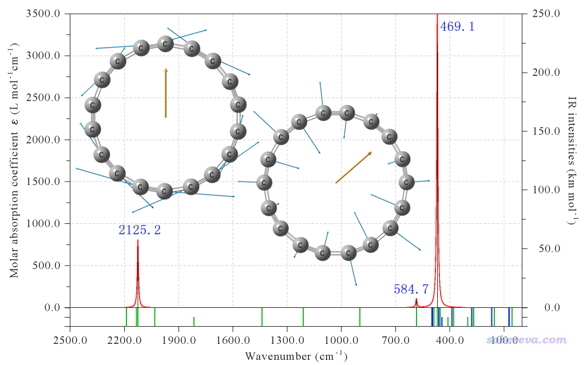

下图是基于谐振近似计算的Raman光谱。在绘图前已经通过Multiwfn将拉曼活性转化为了拉曼强度，入射光源设为了常用的532 nm，温度设为常温。根据群论，只有A1'、E1''和E2'不可约表示的振动模式才可能有拉曼活性。也只有这些模式，在振动时会造成体系极化率的变化。

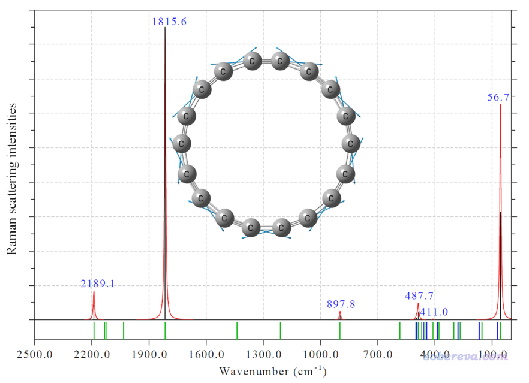

下面是几种特征振动模式。(a)是最高频的模式，对应键伸缩。(b)是最低频平面内变形振动，(c)是最低频的平面外变形振动。(b)和(c)的频率非常低，体现出18碳环整体具有显著的柔性，容易发生整体的弯曲。这点在后文的从头算动力学模拟中也清晰地体现了出来。

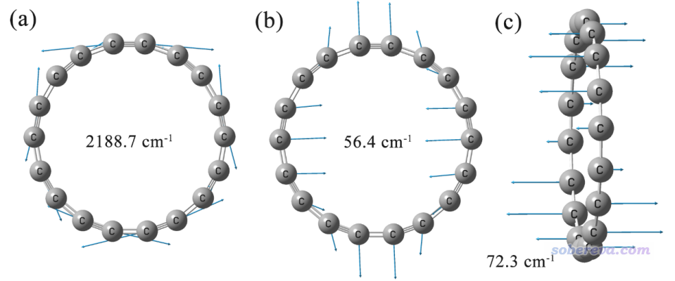

18碳环的振动的非谐振效应也很值得考察。只有考虑非谐振效应，才能考察泛音、合频吸收。GVPT2是非常流行的非谐振计算模型，虽然由于要计算能量对坐标的四阶导数因此很昂贵，但对于18碳环这样的体系在文中用的ωB97XD/def-TZVP这样的级别下用如今一般双路服务器还是算得动的，因此文中用GVPT2模拟了18碳环的非谐振红外光谱。非谐振光谱（蓝色）和相同级别下算的未考虑校正因子的谐振光谱（红色）在下图一起展示了。图中绿色文字标注的是基频（一个振动模式从振动基态跃迁到第1振动激发态），紫色文字标注的是合频（两个振动模式同时从各自的振动基态跃迁到第1振动激发态），斜杠前后两个模式是简并的。由图可见，非谐振光谱的基频相对于谐振光谱都有红移，这是普遍现象，因为谐振模型一般会系统性高估频率，频率越高的模式这个现象越明显。图中还可以见到，在750~1000波数范围有一大批强度很小的合频吸收。特别值得一提的是，在2500波数的位置有一个红外强度相当强的合频模式，对应于键角弯曲和键伸缩模式的非谐振耦合。一般合频模式的强度都是比较小的，当前这个峰非常强体现出18碳环的独特性。由于GVPT2模型和当前计算级别的精度的局限性，实际中这个合频吸收的强度未必真的如预测的那么强，但至少如果以后在实验中在2500波数附近发现了一个明显的吸收峰，应当归属为合频吸收。

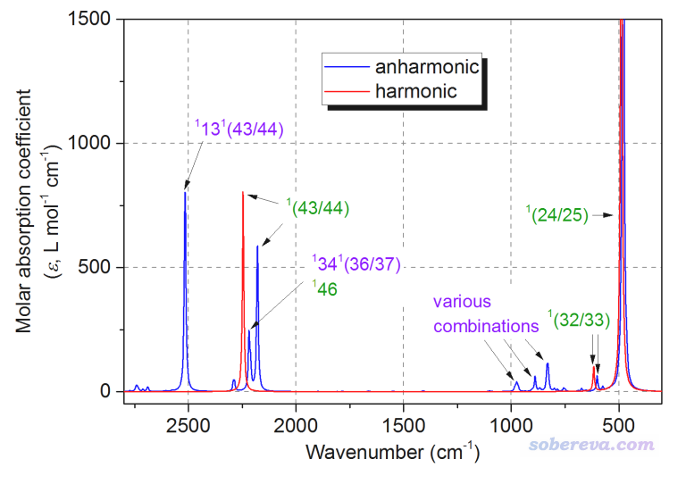

振动光谱大多是在溶液中测的，因此溶剂效应如何影响18碳环的振动光谱也很值得研究。下图展现了18碳环在几种非常常见而且极性明显不同的溶剂下的红外和拉曼光谱，可见在弱极性溶剂范畴，光谱特征受溶剂特征影响比较明显，溶剂极性越大则光谱强度越大。但在极性大于丙酮的各种溶剂中，18碳环的振动谱差异不大。

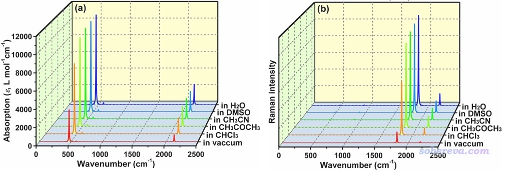

## 3 不同尺寸碳环振动光谱的对比

碳环体系的振动光谱对环尺寸的依赖性特别值得研究。这不仅很有理论意义，也很有实际意义，因为在特定尺寸碳环的合成中，其它尺寸的碳环也可能作为副产物出现。若了解碳环类体系振动光谱的规律性，则可以在实际中通过振动光谱检测不同碳环的存在。

文中用ωB97XD/def2-TZVP在真空中优化了从非常小的碳环C6到非常大的碳环C30的结构并做了振动分析，结构坐标可以在文章的补充材料里找到，对每个极小点结构还都做了波函数稳定性测试以确保结果有意义。下面的(a)是所有体系的红外光谱图，充分揭示了碳环的红外光谱是如何受环尺寸影响的。可见小碳环(<=C14)和中、大碳环（>=C16）的光谱特征有显著差异，即小碳环的红外光谱特征表现出很强的尺寸依赖性，而中、大碳环的尺寸只定量影响吸收峰的强度和位置。下图的(b)将中、大碳环峰位置差异放大了显示，可见随着碳原子数增加，峰位置是震荡变化的。而且满足4n和4n+2规则的两类碳环的振动峰位置逐渐趋于相同，可以预计随着换尺寸进一步的增大，振动频率将趋于收敛为一个定值。

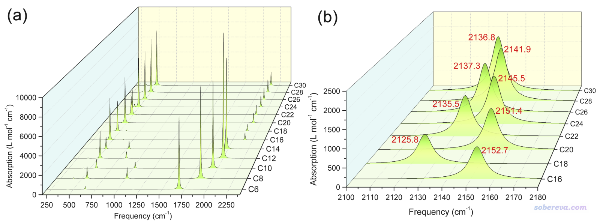

下图给出了不同尺寸碳环的拉曼光谱的对比，可见小碳环的拉曼强度比大碳环的拉曼强度弱得多。对于>=C18尺寸的碳环，满足4n和4n+2规则的碳环在2000波数左右展现出的振动特征很不一样，但到了C30时也比较接近了。

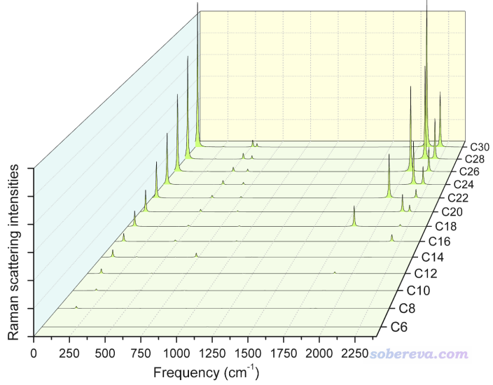

文中还详细研究了不同碳环间振动频率变化的规律性。文中发现虽然不同尺寸的碳环振动模式各有不同，但有一些有代表性的、共通的振动模式。如下图所示，很小的碳环C6和18碳环都有四种特征模式，即平面外交替键角弯曲、平面内交替键角弯曲、整体收缩/膨胀、键长交替伸缩。

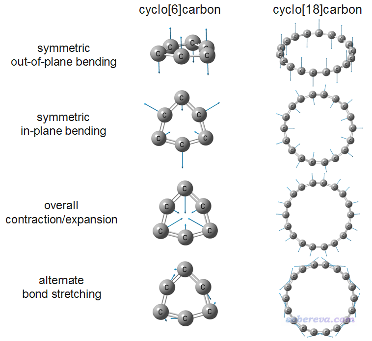

下图展现了以上四种特征模式的考虑了频率校正因子的谐振频率随碳环尺寸的变化。由图可见，>=C16后，所有的特征振动模式都呈现出逐渐收敛的趋势，键长交替伸缩模式的频率随着环上的原子数增加虽然有规律地波动但波动程度逐渐减小，而其它三个特征模式都平滑地单调变化。

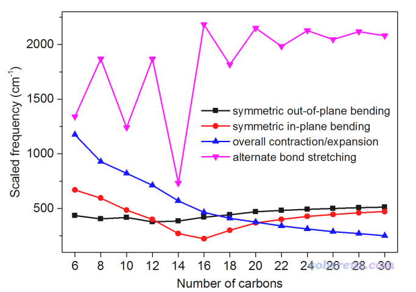

以上的对比展现出小于C16的环的内在电子结构受尺寸影响非常显著，彼此特征各异，还没有达到电子结构收敛的阶段。对于大于C30的环的振动特征，都不需要实际去计算了，因为根据本文中C16~C30的数据，通过外推就能可靠地估计出来振动峰位置。

## 4 18碳环的动力学行为

前面对18碳环的振动都是通过在极小点结构下静态地计算来考察的，而通过分子动力学研究实际情况下的动态行为，则可以提供明显互补的视角，更全面地理解18碳环的振动特征。

文中在ωB97X-D3/def-TZVP级别下，对18碳环在100K、200K、298.15K下分别做了2000 fs的从头算分子动力学模拟。这种模拟的做法参考《使用ORCA做从头算动力学(AIMD)的简单例子》（<http://sobereva.com/576>）。下图是模拟过程中相对于初始帧（极小点结构）的RMSD曲线图，此图展现出温度越高，体系整体结构波动越大。不管什么温度，热运动都引起分子整体骨架以约300 fs为周期规律性波动，折合于111 cm-1。在有限的模拟时间内，分子没有发生异构化或者分解，说明至少在真空中且不太高的温度下，18碳环是具有一定稳定性的。

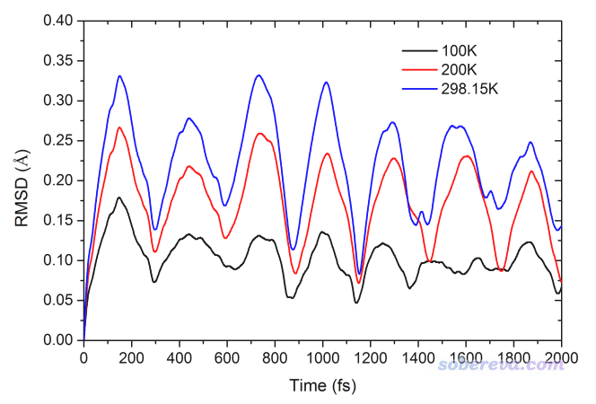

下图展现了不同温度模拟的18碳环的2000 fs轨迹的叠加图，每100 fs绘制一次，结构根据帧号按照红-白-蓝变化来着色。此图非常清楚地展现了18碳环的骨架的柔性特征，热运动导致体系既在平面内形变，也在平面外形变。而且温度越高形变幅度明显越大。在文章的补充材料里还给了动力学轨迹的动画，推荐一看。

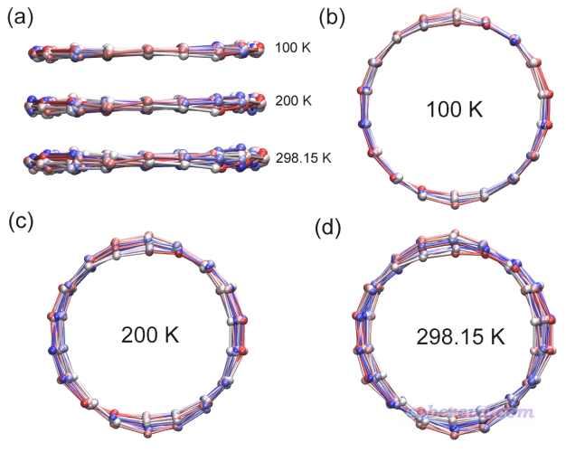

下图是298.15K下动力学模拟过程中所有键长的变化图。18碳环有两种C-C键交替出现，一种较长，一种较短。由图可见原本较长的C-C键始终较长，原本较短的C-C键始终较短，体现出在模拟过程中18碳环没有出现长-短键切换的异构化过程。

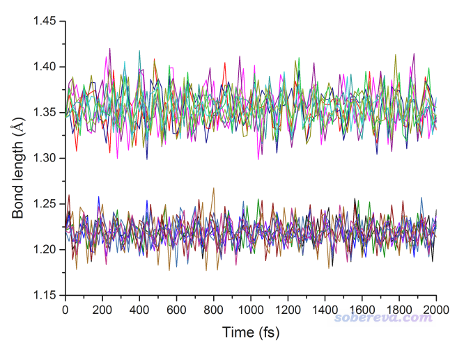

## 5 总结

该研究全面考察了各种尺寸碳环的振动光谱和振动行为，令化学家们更好地认识新奇的纯碳环类体系的特征。文中预测的红外光谱和拉曼光谱为利用这些光谱检测各种碳环的存在提供了重要的理论参考。在Chem. Asian. J. DOI: 10.1002/asia.202001228的原文中还有更多细节的讨论，欢迎大家阅读。
