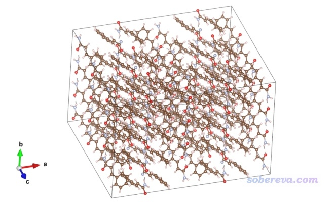
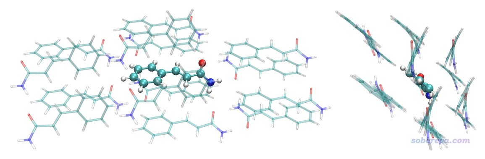
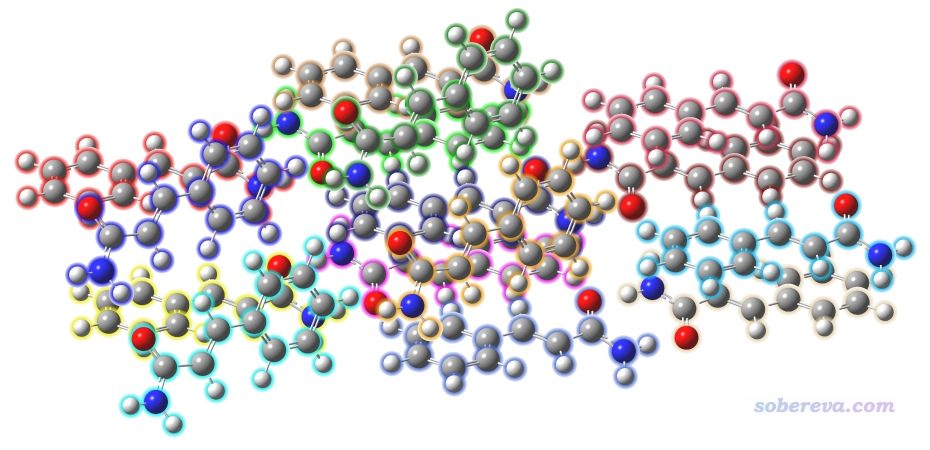
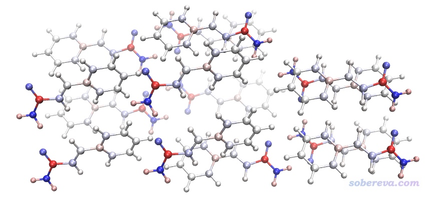
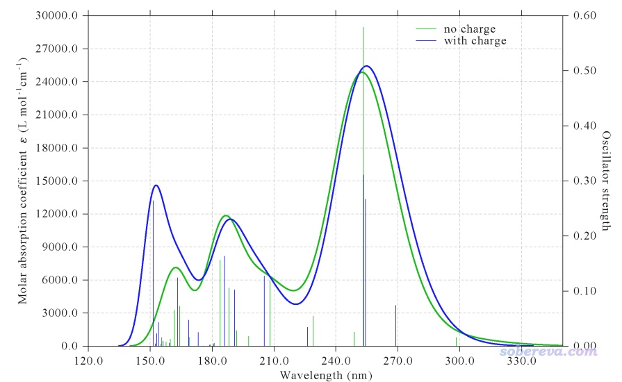

**基于背景电荷计算分子在晶体环境中的吸收光谱**

Calculating absorption spectrum of a molecule in crystal environment based on background charges

文/Sobereva@[北京科音](http://www.keinsci.com)  2020-Dec-23

## 1 前言

用Gaussian、ORCA等主流量子化学程序计算分子在真空中、在溶剂环境中的激发态和吸收光谱是非常简单的事，参考比如《Gaussian中用TDDFT计算激发态和吸收、荧光、磷光光谱的方法》（<http://sobereva.com/314>）、《Simulating UV-Vis and ECD spectra using ORCA and Multiwfn》（<http://sobereva.com/485>）。也有不少人需要计算分子在其晶体环境中的吸收光谱，这需要表现出周围分子产生的影响。笔者在网上经常看到有人对ONIOM一知半解，乱用ONIOM来试图实现这个目的，普遍做法严重不当，比如居然用对静电势重现性巨差的QEq电荷、居然不知道应当使用电子嵌入，导致结果根本不靠谱却浑然不知。在本文，笔者就专门介绍和演示如何正确地借助背景电荷来计算分子在晶体环境中的吸收光谱。本文的这种做法是被广为接受的。

## 2 原理

在讲具体例子前，先说一些最基本常识。背景电荷（background charge）在多数主流量子化学程序里都支持，它是指位于特定坐标的点电荷，其坐标和电荷值都是用户在输入文件里设置的。背景电荷对体系产生的静电作用，影响体系的电子结构，也因此影响体系的各方面特征，显然也包括电子激发相关性质，如激发能、振子强度、电子光谱。

在分子晶体中，分子是紧密排布的。下文管被计算激发态的那个分子叫中心分子，在晶体环境中它被周围一层分子围绕，这些分子在下文称环境分子。显然，要考察分子在晶体中的电子激发问题，应当把环境分子对它的影响恰当地考虑。环境分子与中心分子之间主要有范德华作用和静电作用。如果涉及到结构优化的话，这两种作用都需要表现出来。但在本文中，我们只计算晶体结构下的吸收光谱，不仅不涉及结构优化问题，而且环境分子与中心分子的范德华作用不会对其电子结构产生“直接”的影响，所以我们并不需要考虑范德华作用。环境分子对中心分子的静电作用有不同方式描述，比较高级的可以考虑用分布多级展开等，但通常情况下通过背景电荷以这种最粗糙、最省事的方式来表现就够了，这可以在一般量子化学程序计算中使用，而且对耗时的影响可忽略不计。具体来说，就是在环境分子各个原子核位置放置一个背景电荷，令电荷数值等于原子电荷。计算原子电荷的方法非常多，由于要求背景电荷必须能尽可能好地体现环境分子对中心分子的静电作用，因此当前所用的原子电荷必须对分子范德华表面附近的静电势有较好的重现性，毫无疑问首选是拟合静电势电荷。拟合静电势电荷是一类方法，有不同的具体实现，一般就用比较流行的CHELPG或者MK电荷即可，后文都用CHELPG。用知名的RESP电荷也可以，但对于当前问题不比CHELPG有任何优势。如果你对原子电荷了解甚少的话，务必阅读《原子电荷计算方法的对比》（<http://www.whxb.pku.edu.cn/CN/abstract/abstract27818.shtml>）和《RESP拟合静电势电荷的原理以及在Multiwfn中的计算》（<http://sobereva.com/441>）了解相关知识。看过之后自然就知道，用诸如QEq、NPA、AIM等对静电势重现性极差的原子电荷当背景电荷表现环境分子产生的静电作用是完全不能接受的。

X光衍射测得到的晶体结构中氢的位置一般是明显不准确的，见《实验测定分子结构的方法以及将实验结构用于量子化学计算需要注意的问题》（<http://sobereva.com/569>）。因此在计算中心分子之前，中心分子的氢的位置是必须优化的。这相当于限制性优化，即在优化过程中将重原子（非氢原子）位置冻结在X光衍射测的坐标上，见《在Gaussian中做限制性优化的方法》（<http://sobereva.com/404>）。在计算环境分子的拟合静电势电荷之前，也最好对环境分子的氢进行优化。显然，优化时不能对所有原子都做，因为真空环境和晶体环境明显不同，不冻结重原子的话体系结构就可能变得和晶体状态明显不符。

有人可能搞不明白用背景电荷和用ONIOM来实现环境分子对中心分子的影响有什么区别。实际上，用ONIOM可以实现和使用背景电荷相同的效果。具体来说，是从晶体中抠出一个团簇，将中心分子设为高层，用量子力学（QM）方式描述，而将环境分子设为低层，用分子力学（MM）描述，并将每个低层原子的电荷值设成拟合静电势电荷，并且要求程序用电子嵌入（electronic embedding），从而使得MM部分的原子电荷可以极化QM部分的电子结构。ONIOM的基本知识和应用我在北京科音中级量子化学培训班（<http://www.keinsci.com/workshop/KBQC_content.html>）里讲得非常详细，这里就不再多说了。对于单纯计算吸收光谱的目的，我非常不建议通过ONIOM来实现，因为这不仅把事情搞复杂、输出文件形式特殊，而且Gaussian做ONIOM得到的chk文件里不包含高层部分的波函数，因此之后无法用Multiwfn（<http://sobereva.com/multiwfn>）对中心分子做各种波函数分析，无法做很流行的空穴-电子、NTO、跃迁密度矩阵图等电子激发分析（见《使用Multiwfn做空穴-电子分析全面考察电子激发特征》<http://sobereva.com/434>和《Multiwfn支持的电子激发分析方法一览》<http://sobereva.com/437>），因此局限性特别大，纯粹是给自己找麻烦。只有当涉及到几何优化的问题，比如在晶体环境中优化分子的激发态，那才真的有必要用ONIOM，因为这样才能在优化时表现必不可少的环境分子和中心分子间的范德华作用，而这不属于本文的范畴。

## 3 实例：桂皮酰胺（cinnamide）晶体的UV-Vis光谱

通过这个例子笔者演示如何实际进行计算。主要过程包含以下步骤  
(1)构建晶体的超胞  
(2)抠出分子团簇  
(3)优化氢原子位置  
(4)分离中心分子和环境分子  
(5)对各个环境分子计算CHELPG电荷  
(6)构建包含背景电荷的中心分子的TDDFT输入文件并计算光谱

下文提到的每一个文件都可以在这个文件包里找到：<http://sobereva.com/attach/579/file.zip>。本文涉及的程序有VESTA 3.3.8、Multiwfn 3.8(dev)、VMD 1.9.3、Gaussian 16 A.03、GaussView 6.0.16（本文里许多GaussView的特征在更老的版本里没有）。Multiwfn可在<http://sobereva.com/multiwfn>免费下载，VMD可在<http://www.ks.uiuc.edu/Research/vmd/>免费下载，VESTA可在<http://jp-minerals.org/vesta/en/>免费下载。

### 3.1 构建晶体的超胞

桂皮酰胺晶体的cif文件是本文文件包里的cinnamide.cif。为了能抠分子团簇，我们先把原胞扩展成足够大的超胞。使用GaussView获得超胞的做法在《基于分子晶体cif文件抠出分子团簇结构》（<https://www.bilibili.com/video/av35864488/>）里我已经详细演示了，用GaussView的缺点是当产生的超胞原子数很多的话，GaussView可能要卡很久，而且GaussView也是收费的。这里笔者演示使用VESTA程序来实现这个目的。

启动VESTA，把cinnamide.cif拖入，选Edit - Edit Data - Unit Cell，再选Transform，将旋转矩阵的三个对角元分别设为2、4、3，代表在第1、2、3个方向延展复制成原先的2、4、3倍，然后点OK，然后选“是”，再点一次OK。此时的结构如下所示，明显超胞已经足够大了，肯定能挖出一个中心分子+最近一层环境分子的团簇。

然后选File - Export Data，格式选xyz，保存为supercell.xyz。问是否save hidden atoms too时选“是”。

### 3.2 抠出分子团簇

这部分的操作我在《基于分子晶体cif文件抠出分子团簇结构》（<https://www.bilibili.com/video/av35864488/>）中已经详细演示了。将Multiwfn文件包里的examples\getcluster.vmd拷到VMD目录下。然后启动VMD，将supercell.xyz载入VMD，然后在VMD的命令行窗口里输入source getcluster.vmd运行此脚本，文本窗口最后会提示same fragment as {within 3.5 of fragment 31}，说明用这个选择语句可以选中我们需要的团簇部分。如果对VMD选择语句不懂的话，看《VMD里原子选择语句的语法和例子》（<http://sobereva.com/504>）。

然后我们看看这个选择语句选中的区域到底是不是我们实际想要的，于是在VMD中选择Graphics - Representation，将same fragment as {within 3.5 of fragment 31}复制到Selected Atoms文本框里，然后按回车，就把团簇部分显示出来了。之后若恰当修改显示方式，让位于中间的fragment 31部分CPK方式显示，可看到下图，两个视角都给出了。可见确实中心分子周围紧紧包裹了一层环境分子，没有缺的也没有多余的，故是很理想的模型。

然后在VMD main窗口里点击当前体系，点右键选Save Coordinate，File type选mol2，Selected atoms输入same fragment as {within 3.5 of fragment 31}，然后点Save保存为cluster.mol2。

### 3.3 优化氢原子位置

当前团簇一共300个原子，包括1个中心分子和14个环境分子。对于Gaussian用户，优化氢原子的位置可以用B3LYP-D3(BJ)/6-31G*，对于目前主流的双路服务器来说做这个任务没明显压力。这里为了省时间，就用Gaussian 16里的PM7半经验方法优化，虽然优化的精度差一些，但比起不做优化强得多，结果也算定性合理了。将cluster.mol2载入GaussView，然后保存为cluster_optH.gjf，将内容修改为下面这样，代表只优化氢原子，详见《在Gaussian中做限制性优化的方法》（<http://sobereva.com/404>）。

# PM7 opt=ReadOpt  
   <---空行  
 generated by VMD  
   <---空行  
 0 1  
 [坐标部分]  
   <---空行  
 noatoms atoms=H  
   <---空行  
   <---空行

这个优化任务耗时不高，在笔者的普通4核笔记本上花了20分钟，共优化17步收敛了。你会发现优化后氢涉及的化学键比初始结构长了不少，也合理了很多。比如原先的氨基的两个N-H键一个是0.909埃，一个是0.938，明显偏短。而优化后，没形成氢键的N-H是1.0埃左右，形成了氢键的稍微长一点，是1.02~1.05埃。

目前还有一个问题，是团簇中各个分子里面的原子序号不连续，这导致没法用下一节介绍的工具便利地自动产生各个环境分子的输入文件。为解决此问题，用GaussView打开上面算完的cluster_optH.out，然后点击Edit - Standardize Z-matrix，此时每个分子里面的原子序号就变得连续了。下图将1-20、21-40、41-60...281-300原子序号的部分用不同颜色分别显示，可见确实是每个分子里面的序号都是连续的。

### 3.4 分离中心分子和环境分子

在GaussView中，在中心分子的任意一个原子上点右键，然后选择Select fragment of Atom x，使整个分子成为黄色，然后点Ctrl+X挪到剪切板里，再新建一个窗口，点Ctrl+V将中心分子粘进来（此时笛卡尔坐标和在团簇中相同），保存为center.gjf。之前的窗口中剩下的都是环境分子，保存为environ.gjf。

### 3.5 对各个环境分子计算CHELPG电荷

下面来计算环境分子的CHELPG电荷。我不建议将所有环境分子当做一个整体来一次性计算它们的CHELPG电荷，而应当对每个分子分别单独计算CHELPG原子电荷，原因有二：  
(1)计算耗时和原子数绝对不是呈线性正比关系，而一般是呈三次方左右的正比关系，因此所有环境分子一起算的话耗时远高于每个分子单独算之和，尤其是对于环境分子的总原子数很多的情况。  
(2)CHELPG电荷是通过拟合静电势得到的。根据此方法的拟合点的分布规则，若将所有环境分子视为整体确定拟合点的位置，有些情况下可能在中心分子区域分布的点数太少，导致拟合出的环境分子的CHELPG电荷对中心分子区域的静电势重现性不理想，也因此相应的背景电荷没法表现好环境分子对中心分子的静电作用。  
不过，将环境分子视为整体来算CHELPG电荷在原理上可以体现出环境分子间的耦合效应对环境分子的电子结构的影响，不过这点对于当前这种中性体系来说可以忽视。

可能有人觉得没必要对每个环境分子都挨个算电荷，认为只需算一个分子的CHELPG电荷，然后直接简单复制N次就能得到所有环境分子的原子电荷。这种想法在实际中是有问题的：  
(1)虽然我们已经让每个环境分子内部的原子序号是连续的，但原子顺序却往往是不同的。比如第一个环境分子可能是C1,C6,N2...，第二个环境分子可能是N2,C6,C1...  
(2)晶体中分子可能有不止一个构象，而拟合静电势电荷受构象影响很大  
(3)有的时候考察的是共晶，甚至环境分子都不止一种

为了使分别计算各个环境分子的过程尽可能省事，我写了一个名为splitwhole的程序，可以在<http://sobereva.com/soft/splitwhole_1.0.zip>下载。其中带后缀的是Windows下可执行文件，无后缀的是Linux下可执行文件。可以将含有一批原子的gjf文件提供给此程序，然后由用户输入各个片段里的原子序号，splitwhole就会基于当前目录下的模板文件template.gjf产生各个片段的gjf文件，之后就可以批量计算了。下面我们就借助这个程序实现对每个环境分子算CHELPG电荷。

创建一个名为template.gjf的模板文件，放在当前目录下，内容如下所示，任务是计算CHELPG电荷，并且用了nosymm关键词确保Gaussian在计算时不自动平移、旋转体系。nosymm的具体解释看《谈谈Gaussian中的对称性与nosymm关键词的使用》（<http://sobereva.com/297>）。CPU核数、内存上限请酌情设置。用此例的B3LYP/def-TZVP计算级别就足够得到合理的CHELPG电荷，如果想要更好可以用def2-TZVP。[GEOMETRY]这行代表此处会被替换为用户选择的片段中的原子坐标。如果是在Linux下运行。

%mem=5000MB  
 %nprocshared=36  
 # B3LYP/TZVP pop=CHELPG nosymm  
   <---空行  
 Title Card Required  
   <---空行  
 0 1  
 [GEOMETRY]  
   <---空行  
   <---空行

启动splitwhole，然后依次输入  
environ.gjf   //上一节得到的包含了所有环境分子坐标的gjf文件  
14  //指定14个片段，对应14个环境分子（environ.gjf一共280个原子，除以每个分子的原子数20便知）  
a 20  //代表将1-20、21-40、...、261-280依次定义为这14个片段  
然后当前目录下就出现了frag_0001.gjf、frag_0002.gjf...frag_0014.gjf，分别对应14个环境分子的输入文件，计算设定和template.gjf里的精确相同。

下面批量计算这14个gjf文件，可以用此文的脚本：《使用Gaussian时的几个实用脚本和命令》（<http://sobereva.com/258>）。在笔者双路E5-2696v3共36核机子上3分钟就都算完了，产生的out文件在本文的文件包里都给了。

在本文文件包里我提供了一个批量提取坐标和CHELPG电荷的Bash shell脚本getCHELPG.sh。注意里面开头有一行natm=20，代表当前被处理的体系原子数是20，算其它体系的时候别忘了改。将此脚本拷到14个out文件所在目录下，运行此脚本，就会依次从当前目录下所有out文件中提取信息，并在当前目录下产生bkchg.txt文件，前三列是提取出的原子的XYZ坐标（埃），最后一列是CHELPG电荷，如下所示：  
-11.079484 3.713347 -0.838676 0.272660  
 -12.081139 4.631418 -1.104034 -0.210476  
 -11.445682 2.427925 -0.472243 -0.188136  
 -13.413720 4.251740 -1.034406 -0.034063  
 -11.829578 5.657487 -1.375829 0.110713  
 -9.685301 4.146687 -0.924873 -0.163191  
 -12.773778 2.065556 -0.387473 -0.061724  
 ...略

感兴趣的读者可以把environ.gjf里的原子名那里一列复制到bkchg.txt的第一列，然后另存为bkchg.chg。之后可以通过Multiwfn把这个文件转化为bkchg.pqr文件，在VMD里显示并根据charge属性着色就可以非常直观地显示环境分子的原子位置和CHELPG电荷了。具体操作看《使用Multiwfn+VMD以原子着色方式表现原子电荷、自旋布居、电荷转移、简缩福井函数》（<http://sobereva.com/425>）。下图用的色彩刻度是-0.9~0.9，颜色根据蓝-白-红变化，因此越蓝的原子电荷越负、越红的越正，基本是白色的说明原子电荷接近0。可见跟我们期望的完全一致，比如苯环部分的原子电荷都不大，氨基氮的电荷很负、上面的氢的电荷比较正。

### 3.6 构建包含背景电荷的中心分子的TDDFT输入文件并计算光谱

下面我们终于可以开始做最终的计算了。上一节的bkchg.txt里的内容满足Gaussian的背景电荷的格式定义，因此只需要将其复制到3.4节创建的中心分子的输入文件center.gjf的坐标末尾空一行的地方，并且加上charge关键词代表当前任务要从输入文件末尾读取背景电荷设置。我们把计算任务设为PBE0/6-31G*下用TDDFT算20个激发态，不熟悉相关知识的话看《Gaussian中用TDDFT计算激发态和吸收、荧光、磷光光谱的方法》（<http://sobereva.com/314>）。改好的输入文件是本文文件包里的center_bkchg.gjf，内容如下

#P PBE1PBE/6-31G* TD(nstates=20) charge nosymm  
    <---空行  
 Title Card Required  
    <---空行  
 0 1  
  C                 -0.86593500    0.25621000    0.11508600  
  C                 -1.86773300    1.17440100   -0.15059900  
  C                 -1.23222000   -1.02932800    0.48142100  
  C                  0.52813200    0.68962600    0.02868400  
 ...略  
    <---空行  
 -11.079484 3.713347 -0.838676 0.272660  
 -12.081139 4.631418 -1.104034 -0.210476  
 -11.445682 2.427925 -0.472243 -0.188136  
 -13.413720 4.251740 -1.034406 -0.034063  
 -11.829578 5.657487 -1.375829 0.110713  
 ...略  
    <---空行  
    <---空行

现在对这个文件进行计算，输出文件是本文文件包里的center_bkchg.out，我们对它可以照常绘制光谱图。我们也对比一下不带背景电荷计算的情况，相应的输出文件是本文文件包里的center_only.out。利用Multiwfn可以非常方便地将两种情况的光谱放在一起显示，见《使用Multiwfn绘制红外、拉曼、UV-Vis、ECD、VCD和ROA光谱图》（<http://sobereva.com/224>）的第6节。UV-Vis对比图如下

图中绿线是没背景电荷的情况，蓝线是有背景电荷的情况。通过对比可见对于当前体系，在波长不是特别低的区域，背景电荷对UV-Vis光谱特征虽然有一些影响，但影响不算很显著。不过你若仔细看输出文件的话，会发现背景电荷对很多激发态的激发能和振子强度的影响其实是非常明显的。比如S1态在没加背景电荷的时候激发能是4.157 eV，加了背景电荷后是4.608 eV，振子强度也从原先的0.016增大到了0.074。对于其它一些分子，加不加背景电荷可能对光谱曲线形状、较强的峰的位置都有显著影响。

## 4 总结

本文非常详细地介绍了如何通过背景电荷表现分子晶体中周围的环境分子对被计算的分子的静电作用，使得通过一般的量子化学程序也可以计算晶体中的分子激发态和吸收光谱。当然，也可以在带着背景电荷计算的时候产生波函数文件，从而用Multiwfn考察分子环境中的电荷分布、成键、电子离域特征等问题。本文以Gaussian计算桂皮酰胺作为例子进行了演示，对于其它一般分子的情况也都是同样的处理过程。在很多其它程序如ORCA里也同样可以类似地设置背景电荷来计算，请读者举一反三来实现。

当前我们在计算时只考虑了距离中心分子最近的一层环境分子。虽然还可以再考虑更外层的环境分子，但不会有什么显著的改进，因为当前分子是中性的，根据电多极相互作用公式，这样的分子间的静电作用随距离衰减是很快的。但如果是阴阳离子构成的晶体，环境分子多考虑几层有益。
