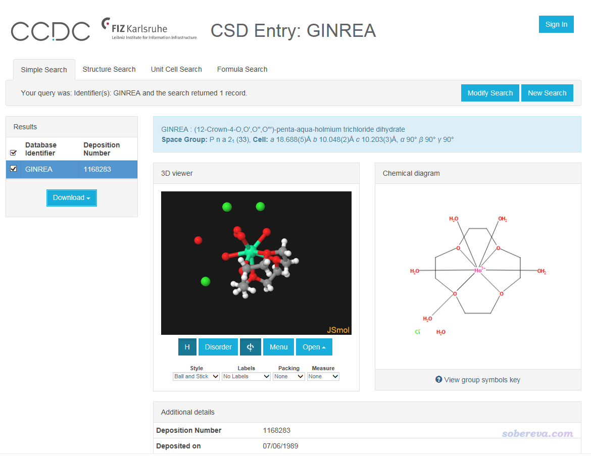
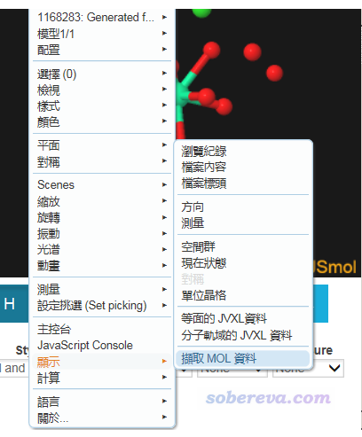
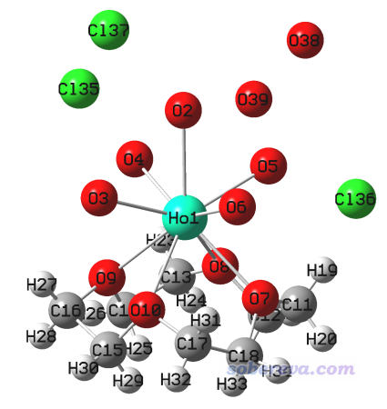
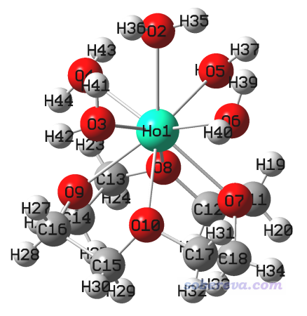
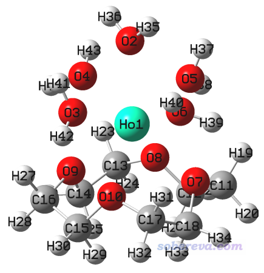
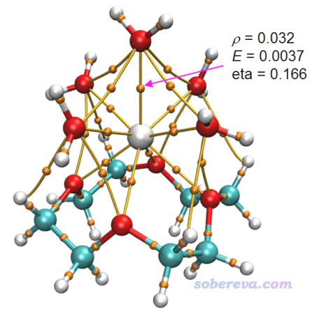
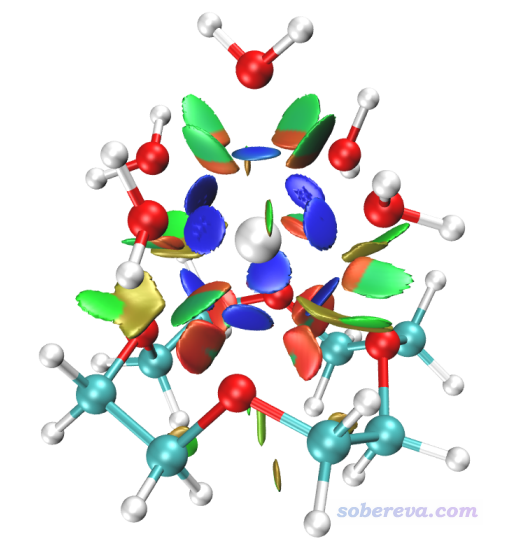
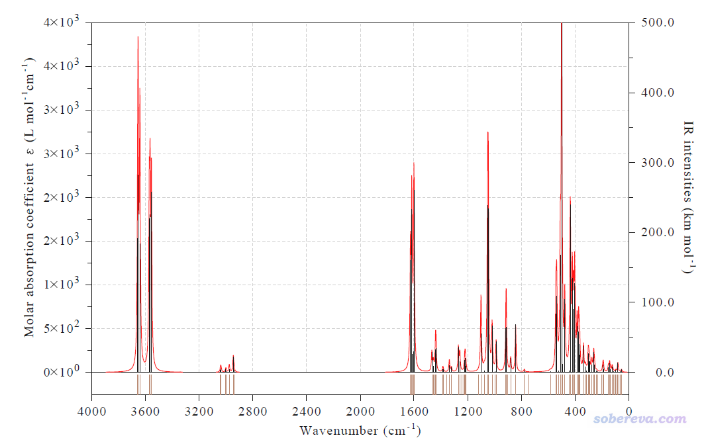

**使用Gaussian做镧系金属配合物的量子化学计算**

Using Gaussian to perform quantum chemistry calculations for lanthanide metal complexes

文/Sobereva@[北京科音](http://www.keinsci.com)  2021-Jan-13

## 0 前言

过渡金属配合物体系的量子化学计算比主族体系的计算通常更复杂，因为在判断自旋多重度方面需要更多考虑，SCF收敛整体更难（d轨道近简并所致），而且还有更高几率收敛到不稳定波函数。而镧系锕系配合物的计算甚至更困难，由于f轨道近简并导致SCF比过渡金属配合物还更难收敛（除非镧系锕系原子用大核赝势，此时不需要描述f电子），检测波函数稳定性的必要性更高，而且中心金属配位数也往往更高、考虑更复杂。本文给大家一个用Gaussian做DFT计算镧系金属配合物12-冠-4-五水合钬(III)阳离子的例子，希望通过此例令读者了解到镧系锕系金属配合物计算的相关知识和需要注意的相关问题，从而能举一反三地研究其它此类体系。

注：如果你的量子化学研究经验有限，本文提到的所有博文都要读，否则本文里一些说明难以充分、正确理解。如果你连用Gaussian算有机类体系都还不能熟练地计算，不建议现阶段看此文然后就开始一通折腾镧系锕系计算，应当看的是《谈谈学量子化学如何正确地入门》（<http://sobereva.com/355>）。

本文用到的计算程序是Gaussian 16 A.03，本文所谈的与Gaussian有关的情况对于这个版本都是适用的。相关分析用的是2021-Jan-10更新的Multiwfn 3.8(dev)版。

## 1 理论方法和基组、赝势的选取

### 1.1 理论方法

本文只涉及最常用的DFT计算。过渡金属配合物的泛函测试文章很多，但算镧系锕系用什么泛函最合适没有特别系统全面的测试。PBE0是值得优先考虑的，在不少文章里用于算镧系配合物，比如Inorg. Chem., 58, 411 (2019)里用就PBE0结合SDD赝势做了含Pr体系的计算。在SARC全电子基组的原文J. Chem. Theory Comput., 5, 2229 (2009)和Jorge 2-zeta全电子基组原文Chem. Phys. Lett., 643, 84 (2016)里，作者基于PBE0做全电子计算得到了挺好的结果。

PBE0不是唯一选择，笔者在《简谈量子化学计算中DFT泛函的选择》（<http://sobereva.com/272>）中提到的那些可以算过渡金属配合物的泛函也都可以尝试用于镧系配合物的计算，诸如BP86、TPSS、TPSSh等。一般体系计算非常常用的B3LYP不是上佳的选择，虽然在不少文章中也有人拿它算镧系。

镧系锕系元素相对论效应很显著，必须考虑相对论效应。其配合物可以用全电子基组结合相对论哈密顿（常见的有DKH2、DKH4、ZORA、X2C）做全电子相对论计算，也可以对镧系锕系原子用考虑了相对论效应拟合的赝势计算。在Gaussian中，对于这类体系的优化和振动分析一般应当基于赝势计算，因为Gaussian没有相对论哈密顿的解析导数，故这类任务极其耗时。

### 1.2 赝势和赝势基组的选择

对赝势缺乏了解的话，先看《谈谈赝势基组的选用》（<http://sobereva.com/373>）和《赝势的函数形式以及在量子化学程序中定义的方式》（<http://sobereva.com/188>）。另外，笔者在北京科音中级量子化学培训班（<http://www.keinsci.com/workshop/KBQC_content.html>）里有十分全面细致的关于赝势的专题讲解。对于计算镧系锕系，首选Stuggart赝势（亦称SDD赝势）。Stuttgart赝势对镧系锕系有大核和小核版本，在《详解Gaussian中混合基组、自定义基组和赝势基组的输入》（<http://sobereva.com/60>）中我专门介绍过。对于下文要计算的原子序号为67的Ho来说，大家去看Gaussian手册的Pseudo关键词部分（<http://sobereva.com/g09/k_pseudo.htm>），可知Gaussian对Ho内置了MWB28、MWB56、MWB57、MHF56、MHF57五种Stuttgart赝势。其中MHF的不用管，因为拟合赝势时没考虑相对论效应，结果根本没法用，诸如算的配位键键长都明显不合理。MWB28是以Wood-Boring方式考虑准相对论效应的相对论赝势，是小核赝势，把1s 2s 2p 3s 3p 3d共28个内核电子用赝势代替了。MWB56和MWB57是大核赝势，把1s 2s 2p 3s 3p 3d 4s 4p 4d 4f电子都赝化了。其中MWB56是专门给Ho(III)用的，Ho(III)相当于Ho丢了全部两个6s电子和11个4f电子当中的一个，由于1s 2s 2p 3s 3p 3d 4s 4p 4d一共有46个电子，再加上剩下的10个4f电子，因此一共是56个电子被赝化了。MWB57是专门给Ho(II)用的，其此时的全部11个f电子都被赝化了。用大核赝势的好处在于，由于在配合物中近简并的4f轨道不需要被描述，因此SCF收敛明显比较容易，而且相对于小核赝势来说计算也更快。大核赝势的缺点是精度一般不如小核赝势，而且可移植性差，不适合研究配位情况显著改变的化学过程（如涉及到配位键形成和断裂的反应、异构化），还需要自己恰当判断原子的价态。小核赝势用起来明显更为稳妥、普适，但缺点是耗时更高，而且由于4f电子的近简并导致SCF极其难收敛（实际算过的人肯定都深有体会），这令耗时更高。我建议小核赝势用在几何优化结束后的单点能计算、各种属性的研究（如计算激发态）、产生用于做波函数分析的波函数等场合（见《在赝势下做波函数分析的一些说明》<http://sobereva.com/156>），以及用于配位情况明显改变的过程的研究。

赝势和赝势基组是两码事，Stuttgart赝势有不同的与之兼容的描述价电子的赝势基组。对于DFT计算且要求不太高时，就用Gaussian里自带的Stuttgart赝势标配的赝势基组即可。如果想让结果更好，对镧系可以用def2-TZVP或更高级的def2-QZVP，它定义了赝势基组部分，对应的赝势是Stuttgart的MWB28小核赝势。在撰文时def2系列对于锕系没有定义，但可以用对锕系有定义的def系列，它也是定义了赝势基组部分并结合Stuttgart小核赝势。注意Gaussian至少截止到撰文时最新的G16 C.01仍没有内置镧系锕系的def/def2基组，必须去Turbomole基组库当中拷，见《在线基组和赝势数据库一览》（<http://sobereva.com/309>）。Lanl2赝势+标配基组支持La、U、Np、Pu，但用得很少，没必要考虑。CRENBL大核赝势也支持镧系锕系，但如今鲜有人用。

### 1.3 全电子相对论计算的基组选择

Gaussian支持DKH2和DKH4标量相对论哈密顿计算（另外还支持的DKH0和RESC太烂，这里就不提了），DKH2非常常用，比起非相对论计算耗时仅高一丁点。DKH4在原理上更精确，耗时比DKH2也就多个几分之一。对这两种情况的基组建议：  
• 用DKH2的情况：我建议对镧系元素用Neese搞的SARC基组，这是很好的3-zeta档次的基组，不特别昂贵结果又挺好。SARC有针对DKH2和ZORA优化的两种版本，显然当前情况要用前者。想要对镧系结果更好还可以用SARC2的DKH2版，是4-zeta档次的。二者在BSE上都有，不知道BSE是啥的话看《在线基组和赝势数据库一览》（<http://sobereva.com/309>）。SARC对前四周期没有定义，因此对于配体部分需要用其它基组，非常适合的是用Neese他们搞的针对DKH2重收缩的def2系列基组，但这没有公开发表，而只是内置于他们的ORCA程序中，在ORCA程序中用PrintBasis关键词打印出来定义再整理成Gaussian的格式虽然可以用，但稍麻烦，BSE上也没法直接获取。另一个对配体可以考虑的是Jorge专为DKH2优化的一套基组，从DZ到6Z档次都有，DZ和TZ版覆盖1~103号元素，BSE上搜Jorge即可下载到定义。如果你是做后HF计算，配体可以用带-DK后缀的给DKH2优化的Dunning相关一致性基组。  
• 用DKH4的情况：我建议用Weigend等人（def2系列基组的作者）提出的x2c-系列基组，涵盖前六个周期所有元素（包括镧系），在BSE上可以下载到基组定义，但在Turbomole基组库中种类最全。此基组专门给X2C相对论哈密顿计算而设计，用于精度也很高的DKH4计算也完全可以，此基组原文测试发现结合X2C还是DKH4误差差不多。x2c-有用于标量相对论计算（后缀为all）和二分量相对论计算（后缀为all-2c）的两类版本，后者更大，对于DKH4标量相对论计算用前者就够了。x2c-和def2系列一样有不同尺寸的版本，比如x2c-SVPall、x2c-TZVPall、x2c-QZVPall等。

相对论量子化学的原理和全电子相对论计算的各种相关知识我在北京科音（<http://www.keinsci.com>）的高级量子化学培训班里会很详细展开讲，并全面盘点全电子相对论计算可以用的所有基组，本文就不再多说了。

下面就演示具体计算例子12-冠-4-五水合钬(III)阳离子，涉及到的所有文件都可以在<http://sobereva.com/attach/581/file.rar>下载。

## 2 构建结构

作为例子要计算的12-冠-4-五水合钬(III)阳离子在剑桥结构数据库(CSD)里面有，不用我们自己画。它对应GINREA条目的阳离子部分，除此之外还有氯阴离子、游离的水分子，本文我们不考虑后两者，计算在真空下当做孤立体系来进行。

进入CSD搜索页面<https://www.ccdc.cam.ac.uk/structures/>，Identifier(s)里输入CSD识别码GINREA，就可以进入下面的页面

我们要导出其坐标。没必要先下载cif文件然后再提取分子，直接导出网页中显示的结构即可。做法是在3D窗口中点右键，选下面的选项

之后会出现一个文本框，把里面的内容复制到一个文本文件里，改名为GINREA.mol。

用GaussView打开这个mol文件，看到下图。由于GINREA条目是是X光衍射测定的结构，氢的位置一般没法准确确定或完全不能确定，水上只有氧原子。相关知识见《实验测定分子结构的方法以及将实验结构用于量子化学计算需要注意的问题》（<http://sobereva.com/569>）。

把三个氯离子，以及没有配位的两个水的氧原子都删掉，然后点击GaussView的加氢按钮，给配位水的氧上面都点上两个氢原子。如下所示

将当前结构保存为optfreq.gjf。

## 3 几何优化+振动分析

这个配合物的自旋多重度取决于Ho(III)的10个4f电子的排布，可以为单重态、三重态、五重态。在几何优化与振动分析过程中，按照前面的建议，我们用大核赝势来做这一步，此时4f电子是被赝化的，所以Ho(III)上的价电子就只有将5s和5p轨道都占满的8个电子了，而配体部分都是闭壳层电子结构，因此计算时应当设成单重态来算。

将optfreq改写为如下内容。

%chk=optfreq.chk  
 #p pbe1pbe/genecp em=gd3bj int=fine opt freq  
   <-- 空行  
 GINREA  
   <-- 空行  
 3 1  
 [坐标部分]  
   <-- 空行  
 C O H  
 6-31G*  <-- 此例对精度要求不高，对配体用低保基组  
 ****  
 Ho  
 MWB56  <-- 用大核Stuttgart赝势标配的赝势基组  
 ****  
   <-- 空行  
 Ho  
 MWB56  <-- 用大核Stuttgart赝势  
   <-- 空行  
   <-- 空行

用int=fine是因为PBE0对于DFT积分格点不敏感，用Gaussian 16默认的int=ultrafine积分格点太浪费了。这里加了DFT-D3(BJ)校正，实际上对这个体系的优化没必要加，但加了也没坏处，并且对于以后研究弱相互作用、金属-有机反应能、配体结合能等问题的精度还有改进，故索性就在本文所有计算中都加了。相关信息见《谈谈“计算时是否需要加DFT-D3色散校正？”》（<http://sobereva.com/413>）、《乱谈DFT-D》（<http://sobereva.com/83>）。

用Gaussian计算此任务，得到optfreq.out，最终结构如下，没有虚频

然后把这个结构保存成下一步的输入文件，名为SP_stableopt.gjf。

## 4 单点计算+波函数稳定性测试

下面演示怎么做单点计算来得到更好的能量。为此，把赝势改为小核赝势，如Gaussian手册pseudo关键词所述，直接写SDD对于Ho就等同于用了MWB28赝势。配体部分基组从之前的6-31G*增大到6-311G*。当然了，当前的基组仍只是中等档次，想要更好的结果建议对所有原子都用def2-TZVP（基组名直接写def2TZVP即可，不用genecp了）。

这次由于4f电子被显式地考虑了，我们也需要明确考虑此体系的自旋多重度问题。如果你拿不准，就把所有可能的自旋多重度，即单重态、三重态、五重态都算一下试试，看谁的能量低。也不需要非得等到SCF完全收敛后再对比能量，比如能量收敛到0.00001 a.u.了就可以停了，再迭代下去也不会改变太多，这种收敛精度下的不同自旋态的能量差就已经能说明问题了。实际上像当前这样的配体不计算也能估计到是高自旋的，即10个f电子里7个alpha、3个beta，因此是7-3+1=五重态。

由于镧系锕系配合物容易收敛到不稳定波函数，因此强烈建议加上stable=opt，使得程序对SCF收敛后的波函数进行检测，如果不稳定的话则自动试图优化到稳定波函数。《谈谈片段组合波函数与自旋极化单重态》（<http://sobereva.com/82>）中有更多相关讨论。

我们把SP_stableopt.gjf的内容改成下面这样，然后运行。

%chk=SP_stableopt.chk  
 #p PBE1PBE/genecp em=gd3bj int=fine stable=opt  
   <-- 空行  
 opted  
   <-- 空行  
 3 5  
 [坐标部分]  
   <-- 空行  
 C O H  
 6-311G*  
 ****  
 Ho  
 SDD  
 ****  
   <-- 空行  
 Ho  
 SDD  
   <-- 空行  
   <-- 空行

由输出文件SP_stableopt.out可见，在第一次做SCF的时候，跑了多达74轮SCF才收敛。小核赝势算镧系锕系配合物SCF收敛普遍就是很难，跑到一百多轮才收敛也很常见。虽然我很反感加大Gaussian本来默认得就已经很大的SCF迭代次数上限的行为，但算镧系锕系配合物的时候倒是可以总是加个SCF=maxcyc=200。在《解决SCF不收敛问题的方法》（<http://sobereva.com/61>）里我已经全面列举了解决SCF不收敛问题的方法，其中很多方法对其它体系容易见效，但对镧系锕系配合物仍然不好使。对于只需要得到DFT单点能的情况，如果在SCF迭代过程后期由于很微小的震荡就是死活不收敛，不得已时也可以加上SCF=conver=6放宽收敛限两个数量级。但对于G16来说（至少截止到撰文时最新的G16 C.01而言），收敛不到默认的tight收敛限（相当于SCF=conver=8）的话就不给做涉及能量导数的任务、TDDFT，甚至连我们当前想做的波函数稳定性测试也没法做，这个要求是G16很恶心的一点。

当前这个计算SCF能直接收敛已经挺幸运了，之前笔者还遇到几乎用了所有方法SCF都死活收敛不到默认收敛限的情况。后来总算发现有一个做法奏效，就是先用HF成分很高（50%）的BHandHLYP计算，由于HF成份很高所以gap大，对于前线轨道近简并体系的SCF比起PBE0容易收敛不少，然后在PBE0计算的时候读取BHandHLYP收敛的波函数当初猜，最终可算是收敛了。

不要因为SCF收敛了就高兴得太早，当前波函数稳定性测试有这样的输出：  
 Eigenvector   1:  5.002-A    Eigenvalue=-0.0080098  <S**2>=6.004  
      65B -> 91B       -0.13744  
      67B -> 91B        0.11409  
      70B -> 92B        0.52213  
      71B -> 90B       -0.56619  
      72B -> 91B        0.55567  
  The wavefunction has an internal instability.  
因此没收敛到稳定波函数上。于是按照stable=opt关键词的要求，Gaussian自动试图优化出稳定的波函数，这个过程非常耗时，而且也有出现不收敛的可能。完成后程序提示  
 Eigenvector   1:  5.002-A    Eigenvalue= 0.0007336  <S**2>=6.004  
      70B -> 91B        0.29385  
      70B -> 93B       -0.44577  
      71B -> 91B        0.15865  
      71B -> 93B        0.11464  
      72B -> 90B        0.57426  
      72B -> 92B       -0.52623  
  The wavefunction is stable under the perturbations considered.  
即波函数稳定了。最终chk文件SP_stableopt.chk里记录的就是稳定的波函数了，最后输出的能量-1944.2616578也是可以用的了，这比起第一次SCF收敛后得到的-1944.25769973低了10.4 kJ/mol。

顺带一提，从上面第一次波函数稳定性测试输出的以三行上可以了解到为什么波函数不稳定的一些端倪，这三项是系数绝对值最大的三个（如果你做TDDFT计算，也会发现第一激发能是负值，并且下面这三种轨道跃迁的系数绝对值很大）。  
     70B -> 92B        0.52213  
      71B -> 90B       -0.56619  
      72B -> 91B        0.55567  
如果你拿没用stable=opt关键词做当前任务得到的chk文件去看轨道，会发现beta的70、71、72是三个占据的4f轨道，beta的90、91、92是三个非占据的4f轨道，因此波函数不稳定的原因可能是4f壳层上的beta电子占据方式有问题。4f的alpha电子显然不可能有类似这种问题，因为7个alpha 4f电子已经把7个alpha轨道都占满了。

还值得一提的是，SP_stableopt.out中优化出来的稳定波函数的<S**2>是6.0037，这和5重态的理想值6.0几乎严格相同，这体现出当前体系自旋极化特征很弱，即alpha和beta占据轨道的空间分布几乎完全匹配。

## 5 一些相关分析

将SP_stableopt.chk用formchk转换为SP_stableopt.fchk，就可以用Multiwfn（<http://sobereva.com/multiwfn>）做各种各样的波函数分析了。Multiwfn的相关信息看《Multiwfn FAQ》（<http://sobereva.com/452>）和《Multiwfn入门tips》（<http://sobereva.com/167>），这里就随便举几个简单分析例子，都是研究此类体系在文献中常涉及的。

当前体系是五重态，alpha电子比beta多4个，多的这4个电子在哪里？可以用Multiwfn做一下布居分析。启动Multiwfn后载入SP_stableopt.fchk，然后依次输入  
7  //布居分析  
5  //Mulliken分析  
1  //输出Mulliken布居和原子电荷  
从输出中可见如下信息。由Spin pop.（自旋布居）那一列可见，4个alpha电子几乎完全定域在Ho的4f轨道上，在其它轨道或其它原子上的自旋布居可以忽略不计，这和我们期望的完全一致。如果不了解自旋布居的话，看《谈谈自旋密度、自旋布居以及在Multiwfn中的绘制和计算》（<http://sobereva.com/353>）。  
Population of each type of angular moment atomic orbitals:  
     Atom    Type   Alpha pop.   Beta pop.    Total pop.   Spin pop.  
     1(Ho)    s      2.09443      2.09001      4.18443      0.00442  
              p      6.02215      6.01624     12.03840      0.00591  
              d      5.21226      5.19202     10.40427      0.02024  
              f      7.02724      3.04892     10.07616      3.97832  
              g      0.00730      0.00744      0.01474     -0.00015  
     2(O )    s      1.94896      1.94910      3.89806     -0.00015  
              p      2.50701      2.50728      5.01430     -0.00027  
 ...略

再往下还能看到Mulliken原子电荷，即Atomic charge那一列。可见Ho明显带正电荷，五个配位水的氧带的负电荷量比冠醚的氧带的更多。如果用Multiwfn计算Hirshfeld、ADCH（原子偶极矩校正的Hirshfeld电荷）、CM5等其它流行的原子电荷也可以得到相同的结论。  
Population of atoms:  
     Atom      Alpha pop.   Beta pop.    Spin pop.     Atomic charge  
     1(Ho)     20.36337     16.35463      4.00875         2.28200  
     2(O )      4.46188      4.46230     -0.00042        -0.92418  
     3(O )      4.46066      4.46161     -0.00095        -0.92226  
     4(O )      4.46283      4.46346     -0.00063        -0.92628  
     5(O )      4.46074      4.46169     -0.00095        -0.92242  
     6(O )      4.46282      4.46344     -0.00062        -0.92625  
     7(O )      4.23562      4.23647     -0.00085        -0.47208  
     8(O )      4.23750      4.23856     -0.00106        -0.47606  
     9(O )      4.23556      4.23640     -0.00085        -0.47196  
    10(O )      4.23753      4.23859     -0.00106        -0.47612  
 ...略

镧系元素在配合物中多为三价（氧化态为3），还有少见一些的二价、四价、五价，在Inorg. Chem., 58, 411 (2019)中还研究了一价的情况。前面我们将此体系中的Ho视为了最常见的三价并用了相应的大核赝势，但视为三价是否一定合理？这里按照《使用Multiwfn通过LOBA方法计算氧化态》（<http://sobereva.com/362>）所述的方法进行检验。按照文中的过程计算，采用50%作为判断阈值，得到如下输出  
Oxidation state of atom   1(Ho) :  3  
 Oxidation state of atom   2(O ) : -2  
 Oxidation state of atom   3(O ) : -2  
 Oxidation state of atom   4(O ) : -2  
 Oxidation state of atom   5(O ) : -2  
 Oxidation state of atom   6(O ) : -2  
 ...略  
可见Ho确实可以视为是三价的。

Atoms-in-molecules (AIM)理论是非常流行的考察原子间相互作用的一套理论，相关信息见《Multiwfn支持的分析化学键的方法一览》（<http://sobereva.com/471>）和《使用Multiwfn做拓扑分析以及计算孤对电子角度》（<http://sobereva.com/108>）中的相关介绍以及《AIM学习资料和重要文献合集》（<http://bbs.keinsci.com/thread-362-1-1.html>）中的大量资料。对当前的体系，按照《使用Multiwfn+VMD快速地绘制高质量AIM拓扑分析图（含视频演示）》（<http://sobereva.com/445>）中的做法绘制的AIM拓扑图像如下，其中将随便选的一个Ho-O键的键临界点（BCP）的几个属性标注上了。

化学键是共价作用还是非共价作用在《Multiwfn支持的分析化学键的方法一览》中笔者介绍过怎么根据BCP的属性判断。由于这个BCP的能量密度大于0，而且eta指数小于1，所以可以被认为是非共价作用为主，而共价作用特征非常微弱。读者也可以用Multiwfn算一下Mayer键级，会发现Ho-O的键级值非常小，也体现出Ho-O键更类似于离子键，结合主要靠的是带显著正电荷的Ho与带显著负电荷的氧之间的静电吸引作用。

RDG方法是非常流行的图形化展现非共价相互作用的方法，因此配体之间的弱相互作用，以及配位氧与Ho的非共价作用都应当能被RDG方法所展现，原理和绘制操作详见《使用Multiwfn图形化研究弱相互作用》（<http://sobereva.com/68>）、《用Multiwfn+VMD做RDG分析时的一些要点和常见问题》（<http://sobereva.com/291>）和视频演示《使用Multiwfn做NCI分析展现分子内和分子间弱相互作用》（<https://www.bilibili.com/video/av71561024>）。当前体系的着色的RDG等值面图如下所示，可见位阻作用区域（红色），配体间较显著的范德华作用区域（绿色），以及Ho与配位氧之间的明显的吸引作用都被展现了出来。

此体系中与Ho配位的原子非常多。如果想简单快速可靠地判断配位数的话，可以利用Multiwfn里的一个专门的功能。启动Multiwfn，然后载入SP_stableopt.gjf（用这个功能的输入文件只要有坐标信息即可，载入fchk当然也可以），然后输入  
100  
9  
[直接按回车]  
然后可以看到下面的输出，即Ho的配位数是9，很合乎我们的直觉。这个功能的判断原理介绍见Multiwfn手册3.100.9节  
  1  Ho  Sum of connectivity: 12.2412   Sum of integer connectivity:  9  
   2  O   Sum of connectivity:  2.9604   Sum of integer connectivity:  3  
   3  O   Sum of connectivity:  2.9800   Sum of integer connectivity:  3  
   4  O   Sum of connectivity:  2.9757   Sum of integer connectivity:  3  
 ...略

电荷分解分析(CDA)对于研究中心金属和配体的轨道相互作用很有价值，感兴趣者建议按照《使用Multiwfn做电荷分解分析(CDA)、绘制轨道相互作用图》（<http://sobereva.com/166>）所述进行分析。

最后，用Multiwfn基于optfreq.out绘制一下这个体系的红外光谱，方法和细节见《使用Multiwfn绘制红外、拉曼、UV-Vis、ECD、VCD和ROA光谱图》（<http://sobereva.com/224>），这里就不再累述过程了，得到的图像如下所示。当前体系用了混合基组，没有严格的频率校正因子可用，因此在Multiwfn里绘图时就用了占原子最多的6-31G*基组在PBE0下的基频校正因子，CCCDBD上给的值是0.95，相关知识见《谈谈谐振频率校正因子》（<http://sobereva.com/221>）。

## 6 全电子标量相对论计算

下面演示一下用DKH4相对论哈密顿结合很好的x2c-TZVPall全电子基组做计算，用当前这种级别计算比之前用小核赝势的那个例子精度明显更高，但也明显更昂贵，不过如果有个像样的双路服务器的话毫无压力。还是用之前优化过的结构，改写成下面这样，对应本文文件包里的SP_stableopt_DKH4_x2c-TZVPall.gjf。此处DKHSO代表做DKH4标量相对论计算。x2c-TZVPall基组定义是从BSE上拷来的。照旧我们还是要做波函数稳定性检测，并当发现不稳定时试图优化出稳定的波函数。

%chk=SP_stableopt_DKH4_x2c-TZVPall.chk  
 #p PBE1PBE/gen em=gd3bj int(DKHSO,fine) stable=opt  
   <-- 空行  
 DKH4 with x2c-TZVPall  
   <-- 空行  
 3 5  
 [坐标部分]  
   <-- 空行  
 H     0  
 S    3   1.00  
      34.0613410              0.60251978D-02  
       5.1235746              0.45021094D-01  
       1.1646626              0.20189726  
 S    1   1.00  
       0.32723041             1.0000000  
 S    1   1.00  
       0.10307241             1.0000000  
 P    1   1.00  
       0.8000000              1.0000000  
 ****  
 C     0  
 S    6   1.00  
   13602.8672210             -0.37777522999D-03  
    2025.6373438             -0.23576500983D-02  
     463.91231001            -0.11596012028D-01  
     130.82215199            -0.46115805966D-01  
      42.923923821           -0.14105167104  
      15.581525131           -0.31080969741  
 S    2   1.00  
       6.2892392533          -0.15604284118  
       2.6572302404          -0.96370811902D-01  
 S    1   1.00  
       0.57807742401          1.0000000000  
 S    1   1.00  
       0.22989985704          1.0000000000  
 S    1   1.00  
       0.95160774246D-01      1.0000000000  
 P    4   1.00  
      34.707038490            0.53684294999D-02  
       7.9558987851           0.35952788969D-01  
       2.3791715536           0.14232010989  
       0.81439359487          0.34277842056  
 P    1   1.00  
       0.28897779004          1.0000000000  
 P    1   1.00  
       0.10058968205          1.0000000000  
 D    1   1.00  
       1.0970000000           1.0000000000  
 D    1   1.00  
       0.31800000000          1.0000000000  
 F    1   1.00  
       0.76100000000          1.0000000000  
 ****  
 O     0  
 S    6   1.00  
   27129.7236970             -0.38412016008D-03  
    4027.0930191             -0.21890968046D-02  
     922.41748966            -0.10403684068D-01  
     260.46373931            -0.41183208891D-01  
      85.461818612           -0.12812329149  
      31.032450616           -0.29445956566  
 S    2   1.00  
      12.392742851           -0.16362839154  
       5.1198045492          -0.10697361899  
 S    1   1.00  
       1.1764031300           1.0000000000  
 S    1   1.00  
       0.46546138443          1.0000000000  
 S    1   1.00  
       0.18500871202          1.0000000000  
 P    4   1.00  
      63.347523551            0.61381103984D-02  
      14.624684698            0.42042980032D-01  
       4.4491599423           0.16170252002  
       1.5277866789           0.35706070979  
 P    1   1.00  
       0.52943458369          1.0000000000  
 P    1   1.00  
       0.17479105448          1.0000000000  
 D    1   1.00  
       2.3140000000           1.0000000000  
 D    1   1.00  
       0.64500000000          1.0000000000  
 F    1   1.00  
       1.4280000000           1.0000000000  
 ****  
 Ho     0  
 S    10   1.00  
 30665374.1250000             0.66695471846D-03  
 4895948.2993000              0.19386599630D-02  
 1050837.3977000              0.47658287331D-02  
  266278.7640400              0.11250169585D-01  
   76845.5599300              0.26218913848D-01  
   24489.0709730              0.60786144743D-01  
    8459.8494420              0.13512331601  
    3106.3269192              0.27484876838  
    1177.0152475              0.40496960964  
     449.39639997             0.26738683755  
 S    5   1.00  
    7931.4428438             -0.65012808265D-02  
    2062.9540658             -0.41639923229D-01  
     758.91395632            -0.89618339118D-01  
     212.99194519             0.24193617465  
      62.170129827            0.41282007533  
 S    1   1.00  
     111.79560111             1.0000000000  
 S    1   1.00  
      20.085848751            1.0000000000  
 S    1   1.00  
      10.408086826            1.0000000000  
 S    1   1.00  
       5.8445952034           1.0000000000  
 S    1   1.00  
       2.8986852103           1.0000000000  
 S    1   1.00  
       0.89005737804          1.0000000000  
 S    1   1.00  
       0.40024972043          1.0000000000  
 S    1   1.00  
       0.71739741553D-01      1.0000000000  
 S    1   1.00  
       0.29402884127D-01      1.0000000000  
 P    8   1.00  
  228101.0193500              0.39863207230D-03  
   35137.1587650              0.19960538599D-02  
    8359.3029774              0.89323482634D-02  
    2561.2112267              0.35889379966D-01  
     910.46609243             0.12249794321  
     361.78057659             0.30388576399  
     153.15183730             0.45389599787  
      65.520483330            0.25257470359  
 P    5   1.00  
    4474.3792479              0.56389120441D-03  
     281.65682206            -0.20022067678D-01  
      49.036380826            0.30557667261  
      24.143269547            0.60828263889  
      11.576198496            0.29432830931  
 P    4   1.00  
     301.86445103            -0.35271226558D-02  
       7.8265880455           0.49062342009  
       3.9718699429           0.58993778863  
       2.0434455994           0.22431999653  
 P    3   1.00  
       3.0206586049          -0.45894143382D-01  
       1.5399070185           0.22608423905  
       0.68956994737          0.65278925439  
 P    1   1.00  
       0.27321141746          1.0000000000  
 P    1   1.00  
       0.94210833607D-01      1.0000000000  
 P    1   1.00  
       0.38623978525D-01      1.0000000000  
 D    6   1.00  
    1844.7814682              0.27871573414D-02  
     527.76862601             0.21502263613D-01  
     198.48802324             0.97398372591D-01  
      84.848163250            0.27301874739  
      38.605610951            0.44077530105  
      18.126277426            0.31353513996  
 D    3   1.00  
      24.327558659            0.43274993682D-01  
      12.866617783            0.19755692505  
       7.1130943232           0.39095056285  
 D    1   1.00  
       3.6185615081           1.0000000000  
 D    1   1.00  
       1.6037544992           1.0000000000  
 D    1   1.00  
       0.47027114517          1.0000000000  
 D    1   1.00  
       0.12774649728          1.0000000000  
 D    1   1.00  
       0.34700000000D-01      1.0000000000  
 F    5   1.00  
     171.69748056             0.49321674004D-02  
      58.758874336            0.33460197436D-01  
      24.181400080            0.11575293621  
      10.879946094            0.24114731797  
       5.0028781306           0.31886369645  
 F    1   1.00  
       2.2593141386           1.0000000000  
 F    1   1.00  
       0.95842954854          1.0000000000  
 F    1   1.00  
       0.35729266508          1.0000000000  
 G    1   1.00  
       0.49850000000          1.0000000000  
 ****  
   <-- 空行  
   <-- 空行

此任务第一次SCF收敛后得到的波函数也和之前用小核赝势的时候一样，提示不稳定，然后优化出了稳定的波函数。

大家如果做Mulliken布居分析，和之前一样会发现是4个alpha单电子都在Ho上，但是Mulliken电荷如今是1.374，用小核赝势时是2.282，看似相差不小，这倒不是因为电子结构相差多少，而主要在于Mulliken电荷对基组的敏感性很强，这点在《原子电荷计算方法的对比》（<http://www.whxb.pku.edu.cn/CN/abstract/abstract27818.shtml>）一文中我专门说过。如果用对基组敏感性很弱的Hirshfeld、ADCH等电荷，会发现两种情况差不多。对当前全电子波函数算Mayer键级，虽然Ho-O的键级整体比之前用赝势的情况有明显增大，现在在0.3左右，但相对于一般的共价键的情况来说数值依然很小，这一方面是算出来的电子结构确实有些不同，另一方面是Mayer键级对基组也比较敏感。对当前波函数做AIM拓扑分析，BCP处的属性相对于之前有一些定量改变，但Ho(III)-O相互作用主体是非共价作用的结论还是不变的。
