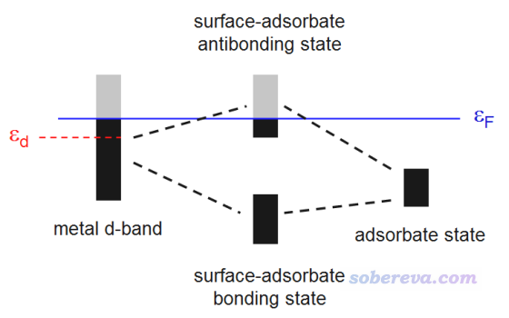
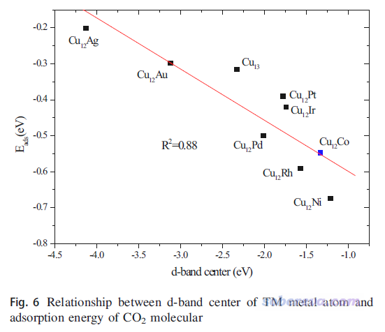
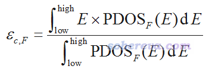
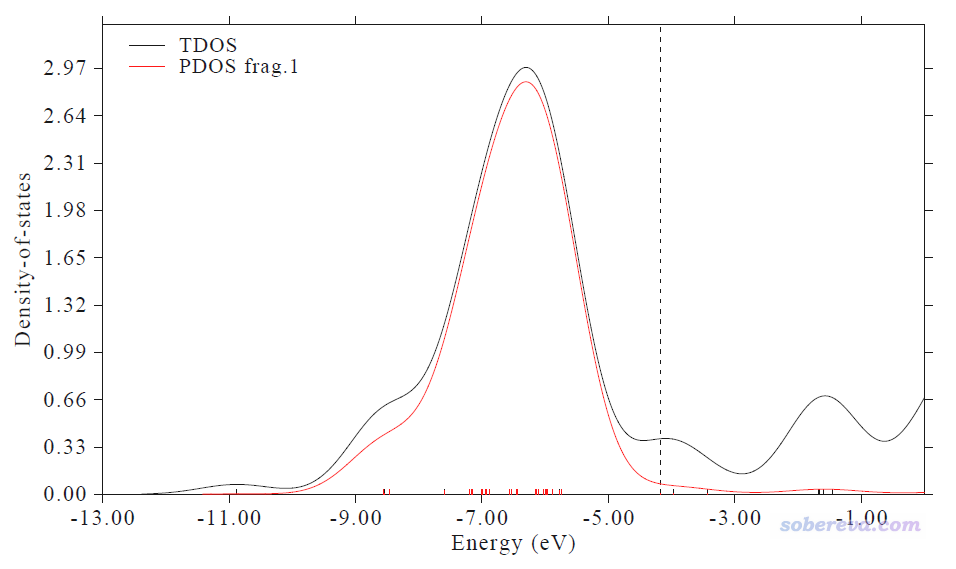
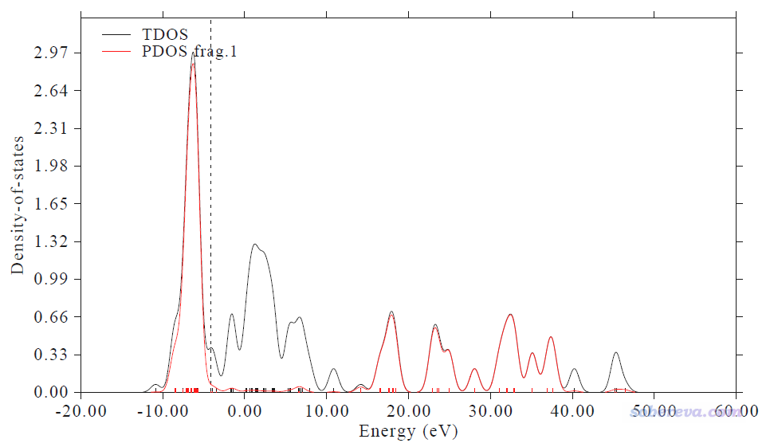

**使用Multiwfn计算过渡金属的d-band center（d带中心）**

Using Multiwfn to calculate d-band center of transition metals

文/Sobereva@[北京科音](http://www.keinsci.com)

First release: 2021-Jan-14  Last update: 2022-Jun-2

## 1 前言

Multiwfn具有灵活强大的绘制态密度（DOS）曲线的功能，见《使用Multiwfn绘制态密度(DOS)图考察电子结构》（<http://sobereva.com/482>），没看过此文的话务必先仔细看一下，否则无法理解后文的叙述和例子。d-band center与PDOS有密切的关系，在本文中将说明怎么用Multiwfn算d-band center位置。

Multiwfn可以在<http://sobereva.com/multiwfn>免费下载，相关知识见《Multiwfn入门tips》（<http://sobereva.com/167>）和《Multiwfn FAQ》（<http://sobereva.com/452>）。注意必须使用2021-Jan-14及以后更新的Multiwfn，否则没有本文提到的功能。

虽然本文第4节以孤立的团簇作为例子演示计算，但本文的方法也同样可以用于周期性体系。按照《详谈使用CP2K产生给Multiwfn用的molden格式的波函数文件》（<http://sobereva.com/651>）的做法用CP2K程序对周期性体系产生molden文件，就同样可以按<http://sobereva.com/482>的做法绘制d原子轨道的PDOS，也因此可以同样以下文的方式得到d带中心。在北京科音CP2K第一性原理计算培训班（<http://www.keinsci.com/workshop/KFP_content.html>）中对d带中心相关概念有比本文全面深入得多的讲解，并且给出了完整的Multiwfn与CP2K相结合计算金属表面体系d带中心的例子，欢迎参加。

## 2 d-band center简介

Hammer和Nørskov提出的d-band center模型被广泛并成功用于解释和预测不同过渡金属表面的催化活性，一些介绍参见、PNAS, 108, 937 (2011)、Sci. Rep., 6, 35916 (2016)。简单来说，过渡金属表面与小分子发生化学吸附时，过渡金属的d带与小分子的轨道会混合，产生成键态和反键态，如下所示，黑色和灰色分别是占据和非占据状态，εF是Fermi能级，其以下的态都是占据的。成键态总是被占据的，反键态被部分占据。过渡金属的d带相对于Fermi能级越高，反键态能量相对于Fermi能级也就越高、被占据的程度就越低、成键作用被削弱得就越少，因而过渡金属和小分子的化学结合作用就越强。

d-band center是指过渡金属表面体系的d态对应的PDOS的中心位置与Fermi能级的差值，即上图的εd，它可以视为衡量过渡金属表面对小分子化学吸附能力的简单的描述符。d-band center不仅常被搞第一性原理的研究表面催化的人拿来说事，做量子化学研究过渡金属团簇的很多人也拿这个试图解释计算的不同过渡金属团簇对小分子吸附能的差异，比如J. Clust. Sci., 29, 867 (2018)这篇文章就考察了Cu12TM (TM=Cu, Co, Rh, Ir, Ni, Pd, Pt, Ag, Au)，确实发现这些团簇的d-band center越正，团簇与CO2的结合就整体越强，如下所示。虽然相关性不算特别好，但还是能说明一定问题的

## 3 在Multiwfn中计算d-band center的方法

Multiwfn的主功能10在绘制PDOS时，对每个用户定义的片段（记为F），在文本窗口都会输出按照下式计算的中心位置，其中low和high分别是当前绘图时用的横坐标的下限和上限

所以，想计算d-band center的话，你只需要将片段定义为你想要考察的那些过渡金属的D基函数，并且让作图范围框住d带出现的能量范围，然后读取屏幕上输出的中心位置，再手动减去费米能级值即可。对于孤立体系来说，费米能级没有确切的定义，但习惯上可以直接取屏幕上显示的HOMO能级值，这点在文中应当交代一下。由于Multiwfn计算PDOS中心位置的功能很灵活，所以不仅可以用来计算d-band center，还可以试图用来计算别的类型band的center。

## 4 在Multiwfn中算d-band center一例：Cu13团簇

此例试图重现前述的J. Clust. Sci., 29, 867 (2018)一文中的Cu13的d-band center值。那篇文章用的是PBE/lanl2DZ算的此团簇，我用Gaussian在这个级别下也优化了一下，得到的fchk文件可以在这里下载：<http://sobereva.com/attach/582/Cu13.zip>。

启动Multiwfn，然后输入  
Cu13.fchk  
10  //绘制DOS  
-1  //定义片段  
1  //定义第1个片段  
cond  //以条件方式选择哪些基函数被加入  
a  //对原子序号范围不设限制  
a  //对基函数序号范围不设限制  
D  //基函数必须是D型  
q  //保存片段  
q  //返回DOS绘制界面  
8  //把单位从默认的a.u.切换为eV  
2  //设置横坐标范围  
-13,0,2  //下限、上限、作图的标签间隔分别设-13、0、3  
0  //作图

此时看到下图，红线是Cu13的d-band对应的PDOS。这和J. Clust. Sci.那篇文章里给的PDOS图的形状相差较大，主要是因为Multiwfn默认用的FWHM（半高全宽）比那篇文章里大得多。FWHM的设置在原理上不影响给出的d-band center值，故不用顾虑这点。另外，此图横坐标的数值和那篇文章里的图相差较大，那是因为那篇文章里对轨道能级进行了平移让HOMO能级恰好为0，我们不用管这个。

在文本窗口可看到下面的输出  
Center of TDOS:   -5.732445 eV  
Center of PDOS  1:   -6.510656 eV

Note: The vertical dash line corresponds to HOMO level at  -4.16932 eV

我们用HOMO能量当Fermi能级的话，此体系的d-band center就是-6.510656-(-4.16932)=-2.34 eV，J. Clust. Sci.那篇文章表3里给的值是-2.33 eV，可见相符极好。

作图的横坐标范围需要注意，这对给出的Center值有影响。从上面显示的PDOS图来看，我们此例用的-13.0 ~ 0.0 eV能量区间是适当的，充分扩住了d-band的出现范围。如果把横坐标范围设宽再作图，看到的是下图的情况

可见作图下限取得更低一些，比如到-20也完全没关系，反正在-13 eV往下都没有d-band出现了，因此设得更低不影响给出的center值。一般作图的能量上限取0就行了，千万不能把上限取得特别高，因为如上图所示，在>10 eV的高能区域d态PDOS又变得非常大，这是没有化学意义的非价层的态，纯粹是因为lanl2DZ是个扩展基（每个d轨道用两个D型基函数描述）所带来的现象。用上图的-20~60 eV的范围给出的PDOS中心位置是10.373 eV，明显是没意义的。

要注意对非限制性方法计算开壳层体系，由于自旋极化，alpha和beta自旋的d-band center的位置是不同的。对这类体系，Multiwfn默认是对alpha轨道绘制PDOS并计算其center。如果要考察beta的，必须在DOS绘制界面里选6 Choose orbital spin再选beta。如果alpha和beta轨道都考虑，就选Both。考虑的是什么自旋的应当在写文章的时候说清楚。
