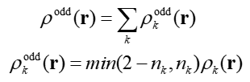
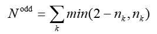
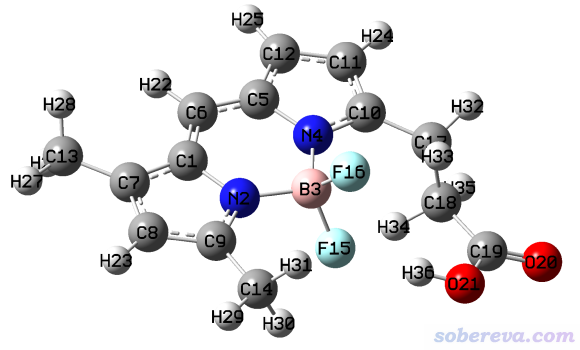
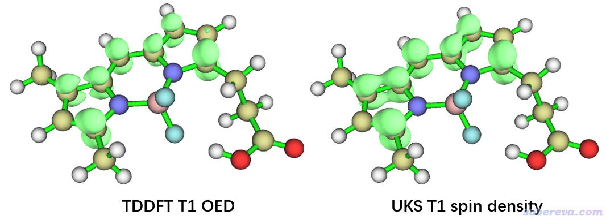
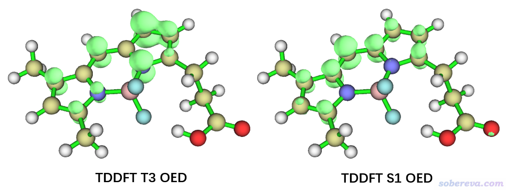
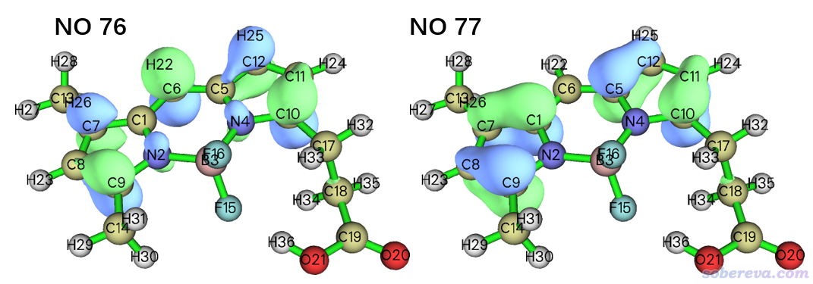

**使用Multiwfn计算odd electron density考察激发态单电子分布**

Using Multiwfn to calculate odd electron density to
study distribution of unpaired electrons of excited states

文/Sobereva@[北京科音](http://www.keinsci.com)  2021-Aug-14

## 1 前言

对于基态是开壳层的体系，比如自由基、过渡金属配合物等，要考察单电子分布，最常用也是最简单的做法就是做非限制性开壳层的DFT计算（UKS），然后绘制自旋密度图，见《谈谈自旋密度、自旋布居以及在Multiwfn中的绘制和计算》（<http://sobereva.com/353>）。UKS也常被用来计算基态是闭壳层体系的最低三重态激发态（T1态），也可以得到其自旋密度。常有人问诸如T2、T3态的单电子分布怎么得到，这些比T1更高的三重态一般没法直接靠UKS来计算而普遍使用TDDFT来计算。但是Gaussian、ORCA等常用量子化学程序的TDDFT计算并没法给出激发态的alpha和beta的密度，也相应地没法获得激发态的自旋密度来考察单电子分布情况。不过，可以利用Multiwfn将TDDFT计算的激发态密度转化为odd electron density（OED，可译为单电子密度函数），通过其图形可以考察激发态中哪里单电子多哪里单电子少。虽然OED不像自旋密度那样还能通过正负号体现单电子自旋方向，但一般也足够讨论实际问题。OED是个普适的函数，对于任何能产生密度矩阵的理论方法，比如CASSCF，也都能靠它来考察所得波函数的单电子分布。所以，自旋密度绝对不是考察单电子分布的唯一办法。

本文将介绍OED的定义，并演示怎么使用Multiwfn计算OED考察TDDFT算的三重态激发态的单电子分布，在Multiwfn手册4.A.6.1节还有OED的其它用法示例。Multiwfn可以在<http://sobereva.com/multiwfn>免费下载，相关基本常识见《Multiwfn入门tips》  
（<http://sobereva.com/167>）和《Multiwfn FAQ》（<http://sobereva.com/452>）。读者请使用2021-Aug-14及以后更新的Multiwfn版本。

## 2 OED的定义

早在Theor. Chim. Acta (Berl.), 48, 175 (1978), Yamaguchi等人就定义了一种基于密度矩阵的衡量单电子（odd electron）分布的函数。后来Head-Gordon在Chem. Phys. Lett., 372, 508 (2003)的9式定义了更好的衡量单电子数的表达式；基于其思想，Nakano等人在Theor. Chem. Acc., 130, 711 (2011)的2式给出了展现单电子空间分布的实空间函数，即前述的OED函数。

OED基于无自旋自然轨道进行计算，表达式如下

可见OED，即ρ_odd(r)，是由各个自然轨道贡献的，k循环所有自然轨道。min()代表取里面两个数的最小值，n_k是第k个自然轨道的占据数，ρ_k(r)是k轨道波函数的概率密度。上式min(2-n_k,n_k)体现的是k轨道对应的（有效）单电子数，对应轨道占据数距离闭壳层状态（0.0或2.0）的差距。其思想容易理解，如果轨道上的电子数n_k<1，则min(2-n_k,n_k)就直接等于n_k，即轨道上的这些电子都算是单电子；如果n_k>=1，则min(2-n_k,n_k)对应的是n_k与2的差值，这部分都当做单电子。

体系的总的（有效）单电子数可以把各个轨道的贡献加和得到

## 3 例子：BODIPY FL

为了演示如何利用OED展现TDDFT算的激发态的单电子分布，我们用下图所示的BODIPY FL荧光染料分子作为例子，本例涉及的文件都可以在此下载：<http://sobereva.com/attach/583/file.rar>。计算都用的是Gaussian 16，计算级别是算激发态常用的PBE0/6-31G*。所有计算用的结构都是S0基态的极小点结构（这没有什么特殊理由，随便举个例子而已）。

首先绘制TDDFT计算的T1波函数的OED，并且也与UKS计算的自旋密度进行对比来检验一下OED是否确实能合理展现单电子分布。利用下面的Gaussian输入文件（本文文件包里的TDDFT_T1.gjf）做TDDFT计算产生T1态的自然轨道，并将之导出为wfn文件

%chk=TDDFT.chk  
# PBE1PBE/6-31g(d) TD(triplet) out=wfn  
[空行]  
b3lyp/6-31g(d) opted  
[空行]  
0 1  
[坐标部分]  
[空行]  
TDDFT_T1.wfn

算完之后，当前目录下就有了TDDFT_T1.wfn，里面记录的是T1态的自然轨道（这是因为当前要求算出来的激发态都是三重态，而且默认的root是1。如果不了解相关知识的话看《Gaussian中用TDDFT计算激发态和吸收、荧光、磷光光谱的方法》<http://sobereva.com/314>）。如果你用的是G09 C.01以前的版本，关键词还需要加上density，否则导出的还是基态的DFT轨道。

作为对照，我们也用UKS算一下T1态，输入文件如下（本文文件包里的UKS.gjf）  
%chk=UKS.chk  
# PBE1PBE/6-31g(d)  
[空行]  
b3lyp/6-31g(d) opted  
[空行]  
0 3  
[坐标部分]

现在来绘制TDDFT的T1态的OED。启动Multiwfn，载入TDDFT_T1.wfn，然后输入  
6  //修改波函数  
26  //修改轨道占据数  
0  //选择所有轨道  
odd   //将轨道占据数转化成OED定义的单电子数，即min(2-n_k,n_k)  
q  //返回  
-1  //返回主菜单

由于当前的轨道占据数都已经是相应的（有效）单电子数了，所以接下来对电子密度做任何分析和绘制都等同于对OED来做。这里我们就只用主功能5来绘制一下等值面图。现在输入  
5  //计算格点数据  
1  //电子密度（当前等同于OED）  
3  //高质量格点  
-1  //观看等值面  
把等值面数值改为0.01 a.u.，就看到了下图左边部分。作为对照，将UKS计算产生的UKS.chk用formchk转化为fch并作为Multiwfn输入文件，按照《谈谈自旋密度、自旋布居以及在Multiwfn中的绘制和计算》（<http://sobereva.com/353>）所示的过程绘制自旋密度图，等值面数值也设为0.01 a.u.，如下图右边部分所示。

对比可见，两幅图并没显著差异，这说明基于TDDFT算的三重态激发态波函数绘制的OED可以正确反映单电子分布情况。

下面再绘制一下TDDFT算的T3和S1态的OED图，在Multiwfn里的操作同前，只不过Gaussian计算用的关键词有所不同，S1用的是# PBE1PBE/6-31g(d) TD out=wfn，T3用的是# PBE1PBE/6-31g(d) TD(triplet,root=3,nstates=5) out=wfn。相应得到的wfn文件TDDFT_S1.wfn和TDDFT_T3.wfn在本文的文件包里也都提供了。OED图如下所示。

可见T3态的单电子和T1一样也是分布在共轭平面部分的。S1的OED和前面T1的OED分布颇为相似，这主要也是因为T1和S1的轨道跃迁特征高度相似。从输出的组态系数来看，T1是  
      76 -> 77         0.71103  
      76 <- 77         0.15278  
S1是  
      74 -> 77        -0.15141  
      76 -> 77         0.69201  
      76 <- 77        -0.11347  
可见二者都是由76 -> 77完全主导的。

值得一提的是，在前述的主功能6的子功能26里输入odd对占据数进行转换后，屏幕上会提示所有轨道占据数的加和，比如T1的情况输出的是  
Sum of occupation numbers of selected orbitals:    1.840534  
T3的结果是1.988034，S1的结果是1.754538。这些值都很接近2，所以都可以认为差不多有两个有（效）单电子。

OED的分布还可以做定量考察。比如对T1态的情况，按照前文的过程在使用主功能6将轨道占据数转化为轨道的（有效）单电子数后，可以输入以下命令使用Becke划分计算原子的贡献  
15  //模糊空间分析  
1  //对实空间函数在各个原子空间进行积分  
1  //电子密度（此时对应OED）  
结果如下，显示了各个原子贡献值，以及占总值1.840534的百分比  
Atomic space        Value                % of sum            % of sum abs  
   1(C )            0.17890273             9.720169             9.720169  
   2(N )            0.04492675             2.440967             2.440967  
   3(B )            0.00539538             0.293143             0.293143  
   4(N )            0.04119946             2.238455             2.238455  
   5(C )            0.16279675             8.845096             8.845096  
   6(C )            0.21869844            11.882355            11.882355  
   7(C )            0.16878350             9.170369             9.170369  
   8(C )            0.07606307             4.132670             4.132670  
   9(C )            0.27330059            14.849007            14.849007  
  10(C )            0.26601172            14.452987            14.452987  
  11(C )            0.08853443             4.810266             4.810266  
 ...略  
这些定量数据和前面的OED等值面图对应很好，诸如C9、C10的贡献值最大，确实在前面的T1的OED等值面图上这俩原子上的等值面是最大的。Multiwfn里也可以改为Hirshfeld或Hirshfeld-I划分来计算原子的贡献，用选项1开始计算前先选择选项-1 Select method for partitioning atomic space修改原子空间划分方式，按提示操作即可。

读者如果感兴趣的话，还可以看看OED是主要由哪些自然轨道贡献的。使用主功能6将轨道占据数转化为轨道的（有效）单电子数后，可以进入主功能0，这是观看轨道的界面，详见《使用Multiwfn观看分子轨道》（<http://sobereva.com/269>）。在界面左上角选Orbital info. - Show all，然后在文本窗口里会看到各个轨道信息：

[略...]  
 Orb:    74 Ene(au/eV):     0.000000       0.0000 Occ: 0.004163 Type:A+B  
 Orb:    75 Ene(au/eV):     0.000000       0.0000 Occ: 0.008586 Type:A+B  
 Orb:    76 Ene(au/eV):     0.000000       0.0000 Occ: 0.906738 Type:A+B  
 Orb:    77 Ene(au/eV):     0.000000       0.0000 Occ: 0.907325 Type:A+B  
 Orb:    78 Ene(au/eV):     0.000000       0.0000 Occ: 0.006671 Type:A+B  
 Orb:    79 Ene(au/eV):     0.000000       0.0000 Occ: 0.004351 Type:A+B  
 [略...]

只有那些原先轨道占据数偏离0和2较大的自然轨道，当前对应的（有效）单电子数才较大。如上可见，OED的贡献主要来自76和77号自然轨道，贡献分别为0.906738/1.840534*100%=49.26%和0.907325/1.840534*100%=49.30%。它们的0.05等值面的波函数图形如下

如果将这俩轨道图和之前的T1的OED等值面图相对照，会发现OED图基本上就是这两个轨道的概率分布的简单叠加。之前做TDDFT计算时得到的TDDFT.chk里面包含的是基态的分子轨道，如果你用Multiwfn去查看轨道图形，会发现上面两个自然轨道的图形和此体系的HOMO、LUMO几乎完全一样，这也是因为如前面的组态系数所看到的，此体系的T1激发几乎完全是HOMO->LUMO所致，显然主要贡献单电子的两个自然轨道也必然恰好基本就是HOMO和LUMO的形状。

## 4 总结

本文介绍了专门用来展现单电子分布的OED的思想，并且通过实例演示了怎么使用Multiwfn非常方便地计算和绘制OED，以及如何考察原子和自然轨道对OED的贡献。虽然一般大家都是用自旋密度考察单电子分布，确实这也是严格的做法，但是很多理论方法在程序实现上或者原理上就是没法给出自旋密度，而只能给出总密度（以及相应的无自旋自然轨道），此时就只能通过OED来考察单电子如何分布了，凸显出OED的重要意义。本文示例的TDDFT算激发态只是这种情况之一，还有一个OED特别有用的情况是使用CASSCF计算双自由基体系的时候，参考比如《CASSCF计算双自由基以及双自由基特征的计算》（<http://sobereva.com/264>），这种情况也没法获得自旋密度，因此要考察单电子分布也需要利用OED。过程是先产生记录CASSCF自然轨道的wfn文件，然后按照本文例子操作即可绘制OED图。Multiwfn手册4.A.6.1节专门有个例子演示用OED考察丁烷双自由基的单电子分布情况，只不过基于的是UKS算的UNO自然轨道，你会发现得到的OED图和《谈谈片段组合波函数与自旋极化单重态》（<http://sobereva.com/82>）一文里的丁烷双自由基的自旋密度图几乎一样，只不过OED没有正负号来区分单电子是alpha还是beta。《18碳环等电子体B6N6C6独特的芳香性：揭示碳原子桥联硼-氮对电子离域的关键影响》（<http://sobereva.com/696>）中介绍的笔者的Inorg. Chem., 62, 19986 (2023)文中使用了OED对CASSCF计算的基态是自旋极化的单重态的B6C6N6计算了OED展现了其单电子分布，是个OED很典型的应用范例，推荐阅读和引用。

笔者认为通过OED也可以考察体系哪些地方有较强的电子相关效应，因为轨道占据数偏离整数正是由于电子相关效应所带来的，见最新版Multiwfn手册4.A.6.2节的例子。显然，这要求产生自然轨道的理论方法必须能恰当描述当前体系的电子相关效应才行。OED与Grimme在Angew. Chem. Int. Ed., 54, 1 (2015)和Chem. Eur. J., 23, 6150 (2017)提出的专门图形化展现静态相关主要来源FOD (fractional occupation number weighted density)函数的特征颇为相似，只不过FOD利用的是有限温度DFT计算得到的占据数，这种计算颇为便宜。

用Multiwfn计算OED绝不仅限于使用Gaussian产生的wfn文件作为输入，只要是用Multiwfn支持的记录波函数的格式，且里面记录的是自然轨道就可以。Multiwfn支持的波函数文件格式见《详谈Multiwfn支持的输入文件类型、产生方法以及相互转换》（<http://sobereva.com/379>）。
