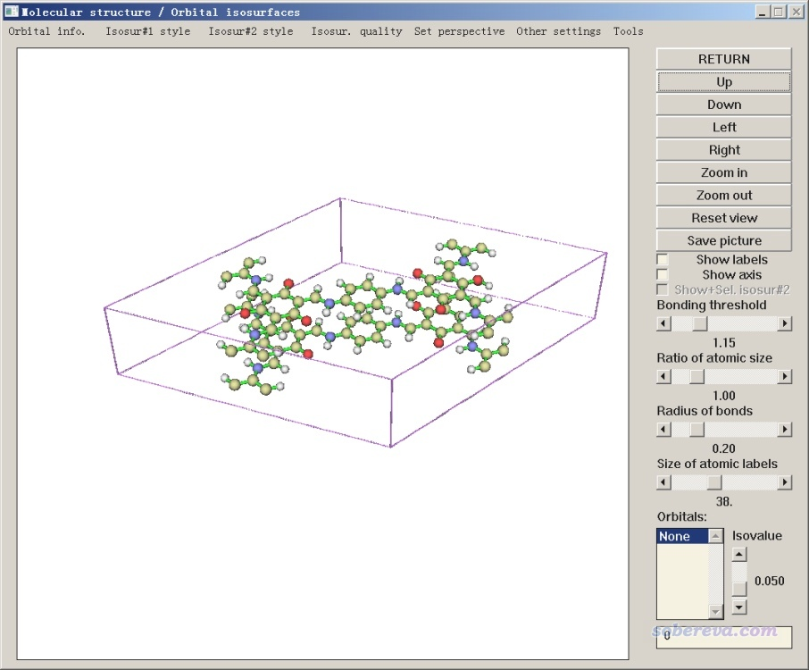
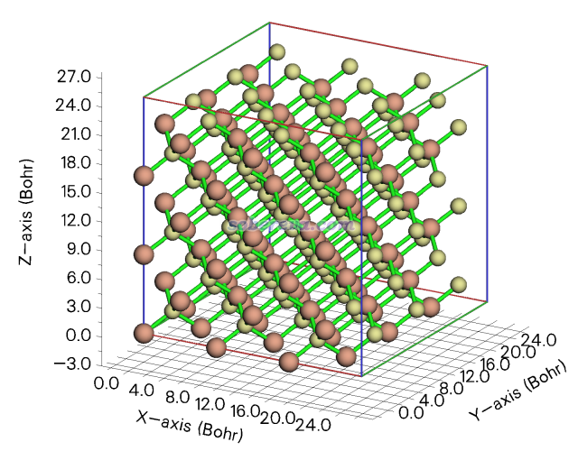

**使用Multiwfn非常便利地创建CP2K程序的输入文件**

Using Multiwfn to very conveniently create input file of CP2K

文/Sobereva@[北京科音](http://www.keinsci.com)

First release: 2021-Feb-22  Last update: 2025-Mar-31

## 1 前言

CP2K（<https://www.cp2k.org>）是速度超级快，功能又非常全面的第一性原理程序，受到越来越多的重视，有很多无可替代的重要价值。CP2K的一个问题是输入文件写起来极其繁琐，一个简单的任务的输入文件就要动辄上百行。而且有时用户还需要了解很多算法和数值实现细节、查阅繁复的手册，甚至还要google半天、参考不少自带测试文件才能最终写出能用的输入文件。这些问题使得CP2K这个优秀的程序不容易普及开来，初学者往往看到其极度复杂的输入文件就打退堂鼓了。

笔者的Multiwfn程序（主页&下载：<http://sobereva.com/multiwfn>）的主功能100的子功能2能产生大量量子化学程序的输入文件，诸如其中产生ORCA输入文件的功能在此文专门介绍过《详谈Multiwfn产生ORCA量子化学程序的输入文件的功能》（<http://sobereva.com/490>），给很多人带来了极大便利。为了让CP2K这个利器对于常见计算问题用起来尽可能方便、尽可能把手动挡变得像自动挡、令使用门槛尽可能低，使之能更充分地发挥其巨大价值，笔者在Multiwfn里加入了产生CP2K输入文件的功能，在此文将进行简要介绍。这个功能虽然注定不可能让完全零基础的CP2K用户毫无压力地使用CP2K，但至少已经把使用难度和复杂度降到极限了，用户只需要选择干什么、怎么干，即可产生一个完成度>95%的输入文件，之后一些必须根据实际情况调整的地方，比如平面波截断能大小等，再自行改一下即可，这使得CP2K用户得到了极大的解放！

如果Multiwfn的这个功能对你的研究产生了实际帮助，请在写文章时顺带提及输入文件是借助Multiwfn产生的（比如写the CP2K input files were generated with help of Multiwfn program），并按程序启动时显示的要求恰当引用Multiwfn。

Multiwfn产生CP2K输入文件的流程是：  
1 启动Multiwfn，载入一个Multiwfn可以识别的至少含有结构信息的文件  
2 进入主功能100的子功能2，选择产生CP2K输入文件（即选项25）。也可以直接在Multiwfn主菜单里输入cp2k进入此功能  
3 输入要产生的CP2K输入文件的路径  
4 通过各种选项设置如何进行计算  
5 选择0，得到CP2K输入文件

下面第2节先说载入到Multiwfn的输入文件的要求。第3节给出一些例子演示产生CP2K输入文件的过程。Multiwfn的这个功能始终不断打磨并且迎合CP2K最新版本的改变，**本文内容对应Multiwfn官网上最新版本的Multiwfn（不是今天刚下载的就不要觉得是最新的），一定不要用老版本！**Multiwfn产生CP2K输入文件的功能在未来还会不断扩展，尽量做到更强大更完美，并且尽量迎合未来版本CP2K发生的各种变化，届时本文也会相应地修改。

一定要注意，尽管靠Multiwfn创建CP2K输入文件非常方便，**也绝对绝对不能把CP2K当黑箱用！！！**因为正确、准确、高效率地使用CP2K做计算需要掌握的理论背景知识实在是超级多！**CP2K是一个手动挡而非自动挡的程序，千万不能以为自己刚会用Multiwfn敲几下键盘能创建出CP2K输入文件就等于会用CP2K了**。**北京科音CP2K第一性原理计算培训班**是从头一次性系统、完整学习第一性原理计算和CP2K程序的最佳途径，培训介绍见[**http://www.keinsci.com/workshop/KFP_content.html**](http://www.keinsci.com/workshop/KFP_content.html)，**里面讲的东西对合理使用CP2K至关重要**！不参加过一遍的话，用户根本意识不到使用CP2K居然有那么多关键细节和要点需要掌握，而且其中有很多东西和关键技巧，若不去仔细研究算法、啃CP2K开发者的相关论文乃至源代码、花精力做各种测试都是无从知晓的。因此北京科音CP2K第一性原理计算培训班是**从头开始用CP2K一定要参加一次的培训**，毫不夸张地说**其重要性相当于CP2K驾校**，而纯靠自己收集零七八碎的资料自学的话真的会走无数弯路、在试错上白浪费巨量时间（PS：我每天在网上回答大量CP2K问题，绝大部分人遇到的困难、犯的低级错误都是由于缺乏此培训里讲的这些关键性知识导致的，不具备这些知识一定会各种胡算瞎算）。培训内容涵盖面极广，ppt多达2200多页，讲义等同于CP2K使用圣经，对不同研究主题都给了精心准备的大量例子使得学员能举一反三。其中讲解利用CP2K做各类问题的研究时都会使用Multiwfn创建输入文件，学员从中会深切体会到Multiwfn对于CP2K的使用起到的重要价值。

## 2 给Multiwfn用的输入文件

Multiwfn支持什么输入文件这里都详细说了：《详谈Multiwfn支持的输入文件类型、产生方法以及相互转换》（<http://sobereva.com/379>）。对于产生CP2K的输入文件，显然载入到Multiwfn的文件中必须含有体系的结构才行。对于此类目的，Multiwfn支持一大波格式，如pdb/gro/xyz/mol/mol2/mwfn/wfn/wfx/molden/fch/cub/gjf/gro等等等等。

如果载入到Multiwfn的文件不包含晶胞信息，那么Multiwfn会默认将此体系视为孤立体系来设置CP2K里的计算参数，CP2K输入文件里的晶胞信息是在分子周围做一定距离的延展来得到的。

多数情况CP2K都是拿来算周期性体系的。若想让Multiwfn产生的CP2K输入文件里有实际的晶胞信息，载入到Multiwfn的文件里就必须有晶胞信息。用以下格式作为输入文件时，Multiwfn会既读取原子坐标也读取晶胞信息。  
(1)cif文件  
(2)含有CRYST1字段的pdb或pqr文件  
(3)CP2K的输入文件（必须以.inp或.restart为后缀）  
(4)GROMACS的gro文件  
(5)含有@<TRIPOS>CRYSIN字段的mol2文件  
(6)含有Ndim且其数值>0的mwfn文件（mwfn是Multiwfn私有的波函数文件格式，专门留出了字段记录晶胞信息，见mwfn介绍文章<https://doi.org/10.26434/chemrxiv.11872524>）  
(7)带有Tv（平移矢量）信息的Gaussian输入文件，即Gaussian做PBC任务的输入文件，可以通过GaussView直接创建  
(8)Gaussian做PBC任务产生的fch/fchk文件  
(9)含有晶胞信息的xyz文件。这是我自己定义的，如果xyz文件的注释行（第二行）包含诸如以下形式的内容（以埃为单位的平移矢量），就会被Multiwfn读取  
Tv_1: 7.426 0.0 0.0 Tv_2: 3.66 6.40 0.0 Tv_3: 0.0 0.0 10.0  
也可以按照extended xyz格式的方式在xyz文件的第二行记录晶胞信息，例如：  
Lattice="7.426 0.0 0.0 -3.66 6.40 0.0 0.0 0.0 10.0"  
(10)含有[Cell]字段的molden文件。此字段是我对molden格式做的扩展，这使得记录波函数的molden文件也能记录晶胞信息。大家可以直接手动往已有的molden文件里插入[Cell]信息，详见《详谈使用CP2K产生给Multiwfn用的molden格式的波函数文件》（<http://sobereva.com/651>）  
(11)VASP的POSCAR、CHGCAR、CHG、ELFCAR、LOCPOT文件。文件名里必须包含相应字样才能识别成相应格式，例如要作为POSCAR载入，文件名可以是POSCAR_miku或miku.POSCAR  
(12)Quantum ESPRESSO的输入文件  
(13)含有$periodic和$lattice信息的Turbomole坐标文件

## 3 产生CP2K输入文件的一些例子

下面就通过不同体系、不同类型计算演示一下Multiwfn产生CP2K输入文件的功能，这些例子也可以作为CP2K入门例子。这些例子只用到了一部分Multiwfn提供的选项，其它的请自行尝试，选项的含义都非常易于理解所以就不一一说了。下文用到的文件都在<http://sobereva.com/attach/587/file.zip>中提供了。笔者假定读者已经以正当方式安装了CP2K，安装方法见《CP2K第一性原理程序在CentOS中的简易安装方法》（<http://sobereva.com/586>）。由于本文只是举例，为了省计算时间，有些任务的k点取得比实际研究时应取的明显要少。

### 3.1 做COF（共价有机框架）化合物的单点任务

本文文件包里COF_12000N2.cif是个COF的晶体结构文件，本例用Multiwfn对它产生一个最简单的任务的输入文件，即PBE泛函结合DZVP-MOLOPT-SR-GTH基组做单点计算。

启动Multiwfn，然后依次输入  
COF_12000N2.cif  //写实际的路径。也可以把此文件拖到Multiwfn文本窗口里自动产生路径，省得手动输入了  
cp2k  //进入产生CP2K输入文件的功能  
[按回车]  //新产生的CP2K输入文件将为当前目录下的COF_12000N2.inp。也可以自己输入路径  
0  //直接生成输入文件

现在COF_12000N2.inp就在当前目录下出现了，可以直接用CP2K跑了。这样在默认设置下产生的输入文件对应PBE/DZVP-MOLOPT-SR-GTH算单点，只考虑gamma点。可以打开.inp看一下有哪些自己需要改的，一般来说自己根据实际需要改的也就是影响精度的设置，比如影响平面波部分计算精度的&MGRID里的CUTOFF和REL_CUTOFF、控制密度矩阵收敛限的&SCF里的EPS_SCF，这些问题本文就不多说了。

Multiwfn产生的CP2K输入文件里面有很多注释，即#后面的内容，这有助于对CP2K还不是特别熟的人了解选项的含义、明白怎么设置。输入文件里有些选项的值是根据我的使用经验和习惯设的，也有一些设置虽然是默认的，却也出现在了输入文件里，这个考虑是便于大家之后自己手动修改（要不然想改一个默认设置的话还得照着手册写一堆字段实在太费事了）。

下面再用COF举个例子，使用B97M-rV泛函结合6-31G*基组做GAPW形式的单点计算，并且要求算完后产生记录此体系波函数的.molden文件，可用于之后在Multiwfn中做波函数分析，见比如《使用IRI方法图形化考察化学体系中的化学键和弱相互作用》（<http://sobereva.com/598>）和《使用Multiwfn结合CP2K通过NCI和IGM方法图形化考察固体和表面的弱相互作用》（<http://sobereva.com/588>）。关于molden文件更多信息见《详谈使用CP2K产生给Multiwfn用的molden格式的波函数文件》（<http://sobereva.com/651>）。本例用较小的基组仅作为演示目的，对精度有要求的计算至少用6-311G**。值得一提的是，在纯泛函中，B97M-rV是对有机体系能量相关问题计算得最好之一，并且这个泛函自带rVV10色散校正。

启动Multiwfn后依次输入  
COF_12000N2.cif  
cp2k  
COF_GAPW.inp  
1  //设置理论方法  
11  //B97M-rV（通过libxc库实现）  
2  //设置基组  
10  //6-31G*  
-2  //要求产生.molden文件  
0  //产生输入文件  
现在当前目录下就有了COF_GAPW.inp，直接就可以跑了。跑完之后当前目录下会出现COF_GAPW-MOS-1_0.molden。

顺带一提，在Multiwfn的主功能0里可以直接看体系的结构和晶胞，由此可以确认一下结构和晶胞信息有没有被Multiwfn从输入的文件里正常载入。启动Multiwfn并载入COF_12000N2.cif后，选0，就会进入图形界面。关闭标签和坐标轴，并且点击菜单栏的Other settings里的Toggle showing cell frame，当前窗口将为下图所示的状态。可见原子位置和晶胞都正确。点击Save picture按钮可以在当前目录下得到线条明显更平滑的大尺寸图像文件。

也可以用Multiwfn载入CP2K的.inp输入文件或者CP2K计算过程中产生的.restart文件，在主功能0里可以看其中的结构是什么样。还可以载入它们后，进入主功能100的子功能2，选择导出gjf文件，这样得到的gjf文件里会有Tv描述的晶胞信息，可以放到GaussView里进行观看和编辑修改。还可以用主功能100的子功能2里的一堆选项转换成其它一大堆常见格式、一大堆计算程序的输入文件（包括Quantum ESPRESSO、VASP的POSCAR），贼灵活。

### 3.2 对SiC超胞做结构优化

这一节演示对SiC的3*3*3超胞用PBE/DZVP-MOLOPT-SR-GTH做晶胞参数不变的结构优化，并且开OT。

启动Multiwfn后输入  
SiC.cif  //在本文文件包里  
cp2k  
[按回车]  //产生的输入文件名为默认的SiC.inp  
-1   //选择任务  
3    //结构优化（不变胞）  
-11  //进入几何操作界面。这个界面有丰富的功能，见《Multiwfn中非常实用的几何操作和坐标变换功能介绍》（<http://sobereva.com/610>）  
19  //构建超胞  
3  //方向1为原先的3倍  
3  //方向2为原先的3倍  
3  //方向3为原先的3倍  
如果你想看一下当前结构的话，可以选0进入图形界面，会看到下图，可见结构没问题

接着输入  
-10  //返回到之前创建CP2K输入文件的界面  
4    //开启OT  
0  //产生输入文件

现在当前目录下的SiC.inp就可以直接跑了。

实际上，还有一种等价的创建SiC 3*3*3超胞输入文件的做法。进入Multiwfn的CP2K输入文件创建界面后，输入  
4    //开启OT  
-1   //选择任务  
3    //结构优化（不变胞）  
-9  //其它设置  
3  //设置三个方向晶胞重复次数  
3,3,3  
0  //返回  
0  //产生输入文件

在得到的输入文件中可以看到坐标部分只记录了原胞，但有两处MULTIPLE_UNIT_CELL  3  3  3，体现出是对3*3*3超胞进行计算。

### 3.3 优化Cu的晶胞

这一节创建的输入文件对应于在PBEsol/DZVP-MOLOPT-SR-GTH级别下对Cu晶体做原子坐标和晶胞的优化。由于是导体，所以用了smearing。由于用的是原胞算的，所以此例设了k点。

启动Multiwfn后依次输入  
Cu.cif  //在本文文件包里，是铜晶体的cif文件  
cp2k  
Cu_cellopt.inp  //在当前目录下产生Cu_cellopt.inp  
1  //设置理论方法  
-3  //PBEsol，很适合算固体晶格常数的泛函  
8  //设置k点  
3,3,3  
-1  //设置任务  
4  //优化原子坐标和晶胞  
6  //使用占据数smearing  
0  //产生输入文件

现在得到的Cu_cellopt.inp就可以直接算了。

### 3.4 氧化石墨烯+水分子的结构优化

这一节我们做一个氧化石墨烯+水分子的结构优化。具体来说，是在单层石墨烯的一个C-C键上加一个氧桥，然后放一个水分子到合适位置，与氧桥形成氢键。构建这个初始结构可以利用GaussView之类的程序。由于文字+图片方式表达起来太费事，我把GaussView里的操作录了个短小的视频：<http://sobereva.com/attach/587/gview_build.mp4>，其中旋转水分子的时候按住alt键，平移水分子的时候按住alt+shift键。按照视频建模完毕后，保存成gjf文件，就是此文文件包里的graphite_oxide_H2O.gjf，可见里面有Tv（平移矢量）信息。

此例的计算将使用PBE-D3(BJ)/TZVP-MOLOPT-GTH完成。由于当前体系有弱相互作用，所以加了DFT-D3(BJ)校正，相关知识见《谈谈“计算时是否需要加DFT-D3色散校正？”》（<http://sobereva.com/413>）。

启动Multiwfn，然后依次输入  
graphite_oxide_H2O.gjf  
cp2k  
opt.inp  //新产生的文件名  
-1  //设置任务  
3  //优化结构（晶胞尺寸不变）  
3  //设置色散校正  
2  //DFT-D3(BJ)  
2  //设置基组  
3  //TZVP-MOLOPT-GTH  
-7  //设置周期性  
XY  //当前体系是XY周期性，Z方向不考虑周期性  
0  //产生输入文件

之后就可以直接跑了。

顺带一提，在CP2K输入文件生成界面里选择优化任务后，可以通过选项9设置对哪些原子坐标进行冻结，可以通过诸如1,5,9-12,14-18形式方便地输入。这种选择语句还可以在GaussView里方便地生成，即把某些原子选中成黄色后，在Tools - Atom selection界面里就可以直接拷出来粘贴到Multiwfn窗口里。另外，Multiwfn让你输入被冻结的原子序号时若输入optH还可以直接实现冻结重原子而只优化氢原子的目的。

### 3.5 用GFN1-xTB方法跑含有216个水的盒子的动力学

GROMACS程序自带了一个做NPT动力学预平衡好的含有216个水的结构文件spc216.gro，在本文文件包里也给了。此例基于这个文件，创建一个用GFN1-xTB级别做NVT系综的从头算动力学的输入文件。GFN1-xTB是半经验层面的DFT，简要介绍见《盘点Grimme迄今对理论化学的贡献》（<http://sobereva.com/388>）和《将Gaussian与Grimme的xtb程序联用搜索过渡态、产生IRC、做振动分析》（<http://sobereva.com/421>）。

启动Multiwfn然后输入  
spc216.gro  
cp2k  
spc216_AIMD.inp  
-1  //设置任务  
6  //分子动力学  
10  //设置热浴  
2  //CSVR热浴，亦即GROMACS里的V-rescale  
1  //设置理论方法  
30  //GFN1-xTB  
0  //创建输入文件

在得到的spc216_AIMD.inp中，应结合注释根据实际需要做恰当修改，比如控制模拟步数的&MD里的STEPS、控制初始温度和控温温度的TEMPERATURE。诸如此类直接就可以手动很容易地改的参数，在Multiwfn的CP2K输入文件创建界面里一般就没有留出相应的选项了，因为完全没必要。

注：实际上 GFN1-xTB模拟纯水效果很差，密度明显偏高。此例只不过是个例子而已。

值得一提的是，在CP2K输入文件创建界面里选择动力学任务后，会看到还有几个相关选项：  
选项12：设置压浴  
选项-5：设置动力学轨迹格式。不用控压时默认是xyz，用控压时默认是尺寸明显更小而且记录盒子信息的二进制格式dcd。也可以用pdb格式，记录盒子信息，文件尺寸很大  
选项-6：设置每多少步把坐标写入一次轨迹文件

### 3.6 对HCN氢转移找过渡态、做振动分析

此例对HCN->NCH氢转移用dimer方法优化过渡态，之后再做个振动分析考察虚频情况。此例只是做个演示，对这种分子体系找过渡态的问题CP2K远远不如Gaussian，又不好用效率又极低。

首先用GaussView创建个看上去像这个异构化反应的过渡态的结构，保存为H2CO_TS.gjf。然后启动Multiwfn，输入  
H2CO_TS.gjf  
cp2k  
dimer.inp  
-1  //选择任务  
7  //搜索过渡态  
0  //产生输入文件

然后用CP2K运行产生的dimer.inp。算完后会看到有一个dimer-1.restart文件，这是CP2K输入文件，包含的是dimer任务最后一步的结构。基于这个结构，我们创建一个振动分析的输入文件。

启动Multiwfn，然后输入  
dimer-1.restart  
cp2k  
freq.inp  
-1  //选择任务  
5  //振动分析  
0  //产生输入文件

然后用CP2K运行产生的freq.inp。跑完之后可以看到有且只有一个虚频，目录下还出现了freq-VIBRATIONS-1.mol，里面用molden格式记录了振动矢量，可以用Molden程序观看振动模式。

### 3.7 计算氮化硼二维材料的REPEAT原子电荷

做涉及固体表面的经典力场的分子动力学模拟，需要有固体部分的原子电荷，REPEAT电荷对于这个目的是不错的选择，对于拟合固体表面的原子电荷比RESP更理想。此例创建一个CP2K算氮化硼板的REPEAT电荷计算的输入文件。

本文文件包里有个氮化硼晶胞文件BN.cif，用GaussView打开，删掉两层BN中的任意一层，并把盒子Z方向尺寸设为10埃（真空区不够大的话会令REPEAT电荷不合理），之后保存为BN.gjf。

启动Multiwfn，然后输入  
BN.gjf  
cp2k  
BN_REPEAT.inp  
-4  //输出原子电荷  
7  //REPEAT  
8  //设置k点  
6,6,6  
0  //产生输入文件

为了让结果更好，手动打开.inp文件，把ELEMENT N那行下面的基组改为TZV2P-MOLOPT-GTH。这个基组对B没有定义，所以对B还是用原先默认的DZVP-MOLOPT-SR-GTH。

然后用CP2K运行得到的BN_REPEAT.inp即可，算完后会得到一个.resp后缀的文件，里面就是各个原子的电荷值。B为0.478，很合理。当前目录下还有个.xyz文件，拖入VMD里可以看拟合点的分布。Multiwfn产生的CP2K算REPEAT电荷的拟合点分布设置是根据我的经验已调整到了比较合理的情况，一般不需要再做修改。

注意不要乱用REPEAT电荷，居然有人算体相致密晶体也试图用REPEAT电荷，这是绝对不行的，根本都没地方放拟合点怎么可能计算。应仔细看《一篇深入浅出、完整全面介绍原子电荷的综述文章已发表！》（<http://sobereva.com/714>）里介绍的我写的综述文章了解包括REPEAT电荷在内的各种原子电荷的原理和特点。并且务必看《使用Multiwfn对周期性体系计算Hirshfeld(-I)、CM5和MBIS原子电荷》（<http://sobereva.com/712>）了解周期性体系原子电荷计算的更多知识和操作方法。

### 3.8 用TDDFT算激发态

请看专门的文章：《使用CP2K结合Multiwfn对周期性体系模拟UV-Vis光谱和考察电子激发态》（<http://sobereva.com/634>）。

### 3.9 做杂化泛函计算

请看专门的文章：《CP2K做杂化泛函计算的关键要点和简单例子》（<http://sobereva.com/690>）。请看专门的文章《CP2K做杂化泛函计算的关键要点和简单例子》（<http://sobereva.com/690>）。此文不是可看可不看，而是必须要看，否则>99%的概率会犯严重错误！！！CP2K的杂化泛函计算功能绝对不能当黑箱用！

## 4 总结

Multiwfn创建CP2K输入文件的功能使得的CP2K程序使用变得相当简单，大大降低了使用门槛，不用再照着手册和例子一个输入文件写半天（而且还很容易写错、写得不合理），而只需要在Multiwfn里敲几下键盘就可以产生出一个基本能用的输入文件，而且借助此功能还可以通过GaussView方便地为CP2K计算来建模。这个功能也很有助于初学者学习CP2K的输入文件的编写。

Multiwfn创建CP2K输入文件的界面在未来还会加入更丰富的选项、让CP2K的更多的功能用起来变得更简单。**在发表文章时提及输入文件是借助Multiwfn创建的并恰当引用Multiwfn程序原文，是对Multiwfn这个功能继续开发最好的鼓励与支持**。

Multiwfn创建CP2K输入文件能做的任务远远不止上面演示的那些，还有NEB、NMR、路径积分分子动力学、X吸收光谱，支持的方法还有MP2、双杂化、GW、分子力场等等，在北京科音CP2K第一性原理计算培训班（<http://www.keinsci.com/workshop/KFP_content.html>）里都有非常全面深入讲解。
