**使用Multiwfn结合CP2K通过NCI和IGM方法图形化考察固体和表面的弱相互作用**

文/Sobereva@[北京科音](http://www.keinsci.com)

First release: 2021-Feb-27  Last update: 2025-Nov-28

## 1 前言

2010年提出的Noncovalent interaction (NCI)分析，也即Reduced density gradient (RDG)分析，是如今使用极为普遍的图形化考察化学体系中弱相互作用的方法，笔者写过诸多相关文章介绍原理和实现，还录了操作演示视频，如下所示，故本文对基本原理不再累述，并假定读者已经具备了背景知识  
• 《使用Multiwfn图形化研究弱相互作用》（<http://sobereva.com/68>）  
• 《用Multiwfn+VMD做RDG分析时的一些要点和常见问题》（<http://sobereva.com/291>）  
• 《通过键级曲线和ELF/LOL/RDG等值面动画研究化学反应过程》（<http://sobereva.com/200>）  
• 《使用Multiwfn做NCI分析展现分子内和分子间弱相互作用》（演示视频。<https://www.bilibili.com/video/av71561024>）  
• Multiwfn手册3.23.1节  
• 《使用Multiwfn研究分子动力学中的弱相互作用》（<http://sobereva.com/186>）  
笔者开发的Multiwfn是做NCI分析特别流行、好用的程序。但以前的版本主要面向分子体系，基于Gaussian、ORCA等量子化学程序产生的波函数进行分析。对于周期性体系往往也可以通过团簇模型结合Multiwfn做NCI分析，比如《使用量子化学程序基于簇模型计算金属表面吸附问题》（<http://sobereva.com/540>）里对银团簇表面吸附苯做了NCI分析、在Multiwfn原文J. Comput. Chem., 33, 580 (2012)里截取了尿素团簇做了NCI分析，但是还是有很多情况不便于或者几乎不适合用簇模型描述。为了让周期性体系的NCI分析可以非常容易地实现、使这个方法能考察更广泛的体系，从2021年2月更新的Multiwfn开始，Multiwfn也支持了结合CP2K程序产生的波函数做NCI分析，这使得图形化考察固体内部和表面的弱相互作用极其容易，将在本文进行详细示例。看了第3节的例子后你会发现计算过程真是巨简单。本文也会提及很多读者应了解的注意事项，以便在实际研究中遇到问题时恰当变通。如果读者不会用CP2K的话，强烈建议通过北京科音CP2K第一性原理计算培训班（<http://www.keinsci.com/KFP>）完整系统地学习，学过后很容易就能上手。

另外，Independent gradient model (IGM)也是非常重要的图形化研究弱相互作用的方法，相对于NCI的关键好处是可以很灵活地自定义片段，能只显示片段间的弱相互作用而不会受到片段内的干扰。此外，Multiwfn做IGM分析时还可以给出诸多定量指标便于讨论。Multiwfn做IGM分析在此文有详述：《通过独立梯度模型(IGM)考察分子间弱相互作用》（<http://sobereva.com/407>）。如今Multiwfn也将IGM分析扩展到了周期性体系，将在下文示例。本文还会顺带提及笔者提出的IGM方法的改良，即IGM based on Hirshfeld partition (IGMH)，比IGM图像效果明显好得多，详见《使用Multiwfn做IGMH分析非常清晰直观地展现化学体系中的相互作用》（<http://sobereva.com/621>）。

值得一提的是，Multiwfn还支持笔者提出的IRI方法，可以同时把弱相互作用和化学键作用区域直观地展现，很有实用价值，在《使用IRI方法图形化考察化学体系中的化学键和弱相互作用》（<http://sobereva.com/598>）中有专门的介绍，并且给了计算孤立体系和计算周期性体系的例子，强烈建议一看！

**笔者强烈建议用后来提出的IRI代替NCI，能明显展现更多有价值的信息！也强烈建议用后来提出的IGMH或mIGM代替IGM，图像效果好得多！**IRI和NCI的分析操作几乎完全相同，而IGMH/mIGM和IGM的分析操作几乎完全相同。在《一篇最全面介绍各种弱相互作用可视化分析方法的文章已发表！》（<http://sobereva.com/667>）和《Angew. Chem.上发表了全面介绍各种共价和非共价相互作用可视化分析方法的综述》（<http://sobereva.com/746>）中介绍的笔者的综述文章中对上述可视化分析方法有非常全面深入的介绍，里面也展示了用于周期性体系的例子，十分推荐阅读和引用！

Multiwfn可以在官网<http://sobereva.com/multiwfn>免费下载，不熟悉Multiwfn的话注意参看《Multiwfn FAQ》（<http://sobereva.com/452>）和《Multiwfn入门tips》（<http://sobereva.com/167>）。请读者务必使用2021-Feb-25日及之后更新的Multiwfn以确保情况和下文内容相符。本文例子中周期性体系的DFT计算部分使用CP2K 8.1版实现，安装方法见《CP2K第一性原理程序在CentOS中的简易安装方法》（<http://sobereva.com/586>）。CP2K结合Multiwfn可以非常容易地使用，见《使用Multiwfn非常便利地创建CP2K程序的输入文件》（<http://sobereva.com/587>）。本文绘图使用VMD 1.9.3版，可以在<http://www.ks.uiuc.edu/Research/vmd/>免费下载。

下文涉及的所有文件都可以在<http://sobereva.com/attach/588/file.rar>下载。cub文件比较大所以就没有提供了。

## 2 输入文件

在给出具体例子之前先介绍一下Multiwfn做NCI、IGM分析都需要用什么输入文件。

**后记**：关于这部分知识，更多、更详细的介绍见《详谈使用CP2K产生给Multiwfn用的molden格式的波函数文件》（<http://sobereva.com/651>）。

### 2.1 普通NCI分析用的输入文件

普通形式的NCI分析需要基于电子波函数计算电子密度及其导数。CP2K产生的molden文件记录了Gaussian型基函数描述的电子波函数，Multiwfn可以基于它做各种波函数分析，也包括NCI分析。CP2K产生molden文件的方法在《使用Multiwfn非常便利地创建CP2K程序的输入文件》（<http://sobereva.com/587>）的3.1节已经示例过。如果你习惯自己写CP2K输入文件的话，是在&DFT字段里加上以下内容  
&PRINT  
  &MO_MOLDEN  
    NDIGITS 8  
    GTO_KIND SPHERICAL  
  &END MO_MOLDEN  
&END PRINT  
这样CP2K计算完毕后就会在当前目录下产生一个.molden文件。

CP2K产生的molden文件还不能直接用于做周期性体系的NCI分析，因为标准的molden格式里没有晶胞信息。为了能让molden文件给Multiwfn提供晶胞信息，我给molden格式做了扩展，定义了[Cell]字段。用文本编辑器打开molden文件后，需手动在第二行插入[Cell]并在下面三行定义晶胞的三个平移矢量（埃），下面是个例子  
[Molden Format]  
[Cell]  
7.13358000 0.00000000 0.00000000  
0.00000000 7.13358000 0.00000000  
0.00000000 0.00000000 7.13358000  
[Atoms] AU  
C 1 4 0.000000 0.000000 0.000000  
C 2 4 1.685064 1.685064 1.685064  
C 3 4 0.000000 3.370128 3.370128  
...略  
让Multiwfn载入这样修改过的molden文件后，晶胞信息就会被读入，文件载入完毕后屏幕上就可以看到晶胞信息的提示了：  
Cell information:  
Translation vector 1   X=   13.480512  Y=    0.000000  Z=    0.000000 Bohr  
Translation vector 2   X=    0.000000  Y=   13.480512  Z=    0.000000 Bohr  
Translation vector 3   X=    0.000000  Y=    0.000000  Z=   13.480512 Bohr  
Cell volume:       2449.7350 Bohr^3    (        363.0134 Angstrom^3 )

有一点需要注意的是，如今CP2K计算普遍使用MOLOPT基组，这是个完全广义收缩的基组，而Multiwfn的计算代码并未对广义收缩的基组进行专门的优化，因此使用MOLOPT基组得到的波函数在Multiwfn里计算耗时会比较高。如果你有个像样的服务器那无所谓，但如果只有个个人PC，算NCI的格点数据的时候对稍大的体系会比较吃力。我一般建议用比如6-31G*、6-311G**之类基本像样的而且是片段收缩的全电子基组在CP2K里做个GAPW单点计算来得到NCI分析用的molden文件，比起用DZVP-MOLOPT-SR-GTH基组做GPW计算得到的molden文件在NCI分析耗时上能降低好几倍。另外，用全电子基组比起用MOLOPT这样的赝势基组还有个好处是内核电子被明确表达了。NCI分析对基组不敏感，一般用6-31G*就足够了，用更大基组也不会发现结果有什么可查觉的改变。

如果由于特殊情况，你就是想用诸如MOLOPT赝势基组在Multiwfn里做NCI等波函数分析，那么应当再手动改一下molden文件，使得Multiwfn明确知道各个原子的价电子数是多少（指的是使用此赝势时原子在孤立存在时的价电子数。和原子在当前体系里的实际价电子数没任何关系），这有两个必要性：  
• molden文件里并没有明确记录原子的价电子数，这导致Multiwfn算原子电荷的时候不知道实际上当前原子的核电荷数是多少，因此给出的原子电荷是不合理的。  
• 让Multiwfn知道被赝势赝化的电子数的话，Multiwfn会通过自带的EDF内核电子密度数据库提供内核电子密度，此时做纯粹基于电子密度的各种分析时结果会较接近于全电子基组的情况，即更为真实。关于这点详见《在赝势下做波函数分析的一些说明》（<http://sobereva.com/156>）。  
让Multiwfn知道各个原子价电子数是多少，可以通过以下两种修改molden文件的做法实现  
(1)把元素名后头的元素序号改成价电子数。比如molden文件的[Atoms]字段某一行原本是  
C 3 6 0.000000 0.000000 0.000000  
如果赝势赝化了碳的1s的两个电子，即价电子数为4，则改为  
C 3 4 0.000000 0.000000 0.000000  
(2)更方便的做法是直接在[Atoms]字段之前加入[Nval]字段，这是我对molden格式的扩展。例如插入以下内容  
[Nval]  
C 4  
O 6  
就告诉Multiwfn所有的碳都是4个价电子，氧是6个价电子。加入了[Nval]和[Cell]字段的一个例子见Multiwfn自带的examples\PBC\CP2K_diamond_2x2_DZVP-MOLOPT.inp。

注意CP2K在考虑k点的时候不能产生molden文件，Multiwfn本身也不支持考虑k点，所以对于小晶胞体系必须用足够大的超胞来计算。

实际上Multiwfn还可以基于Gaussian程序的PBC计算产生的fch文件做周期性体系的波函数分析。但对于二维、三维周期性体系，Gaussian的这个功能几乎什么都算不动，毫无实用性，这里就不提了。Multiwfn也可以基于含有晶胞平移矢量信息的mwfn格式（<https://doi.org/10.26434/chemrxiv.11872524>）做周期性体系的波函数分析，但CP2K目前版本产生不了。

### 2.2 准分子近似的NCI分析以及IGM分析用的输入文件

还有一种NCI分析是基于准分子近似（promolecular approximation）实现的，即使用原子自由状态电子密度简单叠加产生的近似的分子电子密度（准分子密度，promolecular density）进行计算。对于周期性体系的准分子近似的NCI分析，只需要给Multiwfn提供含有原子坐标和晶胞信息的文件作为输入文件即可，比如cif文件、Gaussian的PBC任务的gjf文件、含有CRYST1字段的pdb文件等，详见《使用Multiwfn非常便利地创建CP2K程序的输入文件》（<http://sobereva.com/587>）的第2节。

准分子近似的NCI计算耗时只是普通NCI分析的一个零头。而且由于只需要结构信息，用任何第一性原理程序优化坐标/晶胞都可以，也可以直接用实验的cif文件。但其结果合理性比普通的NCI略差，尽管通常来说定性一致。一般来说能算得动普通的NCI分析的时候就不建议用准分子近似。

IGM分析需要的输入文件和准分子近似的NCI分析完全一样，因为IGM分析也是完全依赖于几何结构和Multiwfn内置的自由状态原子密度实现的。

## 3 周期性体系的NCI分析示例

### 3.1 金刚石中的位阻作用

### 3.1.1 普通NCI分析

此例用NCI分析考察金刚石中的位阻作用。首先基于晶体结构，用Multiwfn产生一个做PBE/6-31G*单点计算并输出molden文件的CP2K输入文件，使用2*2*2的超胞。为此，用Multiwfn载入本文文件包里的金刚石的conventional cell的文件diamond.cif，然后输入  
cp2k  //创建CP2K输入文件  
diamond_222.inp  //要产生的CP2K输入文件名  
2  //选择基组  
10  //6-31G*  
-2  //要求产生molden文件  
-11  //几何操作  
19  //构建超胞  
2  //第1个方向重复的次数  
2  //第2个方向重复的次数  
2  //第3个方向重复的次数  
-10  //返回  
0  //产生输入文件

现在diamond_222.inp文件被产生在了当前目录下，CP2K算完后就有了diamond_222-MOS-1_0.molden。用文本编辑器打开它，然后把diamond_222.inp里的晶胞信息复制进去，此时此文件开头部分内容为   
 [Molden Format]  
 [Cell]  
 7.13358000     0.00000000     0.00000000  
 0.00000000     7.13358000     0.00000000  
 0.00000000     0.00000000     7.13358000  
 [Atoms] AU  
 C        1       6       0.000000       0.000000       0.000000  
 C        2       6       0.000000       3.370128       3.370128  
...略

启动Multiwfn，载入diamond_222-MOS-1_0.molden，然后输入  
20  //图形化分析弱相互作用  
1  //NCI分析  
9  //借助晶胞信息定义格点  
[按回车]  //使用0,0,0作为盒子原点。这里说的盒子是指被计算的格点均匀分布的区域，后同  
[按回车]  //使用晶胞的三个平移矢量的长度作为盒子三个边的长度  
0.2  //格点间距

现在Multiwfn就开始计算NCI分析用的RDG和sign(λ2)rho这两个函数的格点数据了。在笔者的2*E5-2696v3 36核服务器上仅仅11秒就算完了。之后选3把这两个函数的格点数据分别导出为当前目录下的func2.cub和func1.cub。将这两个cub文件以及Multiwfn自带的examples目录下的RDGfill.vmd都拷到VMD目录下，然后启动VMD，在VMD的文本窗口输入source RDGfill2.vmd执行此绘图脚本，再输入pbc box来绘制出盒子。之后在Graphics - Representation里选择正处于CPK风格的那个representation，通过界面上的Sphere Scale把原子球尺寸调成0.7。此时的sign(λ2)rho着色的RDG等值面图，也即一般说的NCI图，如下所示

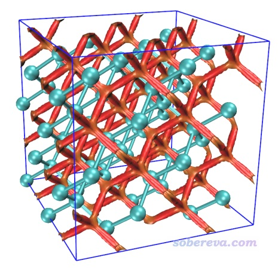

可见图像效果非常理想。红色的等值面在金刚石中呈网状分布，体现出金刚石里面有显著的位阻作用。读者有兴趣的话可以通过相同的方法去对硅也绘制这种图，你会发现硅当中也有网状的等值面，但颜色是绿色的，体现出由于硅的孔洞相对较大，孔洞中的位阻互斥就没那么强了。

通常做周期性体系NCI分析时格点都按照此例方式来设即可，这样格点会均匀分布在整个盒子里，从而把体系所有地方的弱相互作用都图形化展现出来。格点间距应根据需要恰当设置，想要更光滑的等值面就把格点间距设得更小。注意在盒子范围固定的情况下，计算耗时、cub文件的尺寸都和格点间距的三次方呈反比。此例如果把格点间距设成更小的0.13，你会发现得到的等值面上完全看不出任何锯齿，但耗时会增加为原先的(0.2/0.13)^3=3.6倍。

NCI分析中经常涉及到绘制RDG与sign(λ2)rho之间的散点图，做法在第1节里提到的笔者的RDG博文中，以及《绘制有填色效果的用于弱相互作用分析的RDG散点图的方法》（<http://sobereva.com/399>）中都做了介绍。周期性体系的NCI分析也可以这么绘制散点图，这里就不再演示了，这和分析孤立体系的操作没有任何区别。

### 3.1.2 准分子近似的NCI分析

现在再演示一下如何对金刚石超胞做准分子近似的NCI分析。用上一节的diamond_222.inp或者diamond_222-MOS-1_0.molden当做Multiwfn的输入文件都可以，因为它们都能给Multiwfn提供这种分析所需要的原子坐标和晶胞信息。这里用原胞diamond.cif作为输入文件进行演示，请大家举一反三。

启动Multiwfn，载入diamond.cif，然后输入  
300  //其它功能(Part 3)  
7  //对体系进行几何操作  
19  //构建超胞  
2  
2  
2  
-10  //返回  
0  //返回主菜单。现在内存里记录的金刚石的原胞已经成了2*2*2的超胞了  
20  //图形化分析弱相互作用  
2  //准分子近似的NCI分析  
9  //设置格点。同前，不再解释  
[按回车]  
[按回车]  
0.2  //格点间距（Bohr）

你会充分体会到准分子近似的NCI分析极快，一眨眼的功夫格点数据就算完了。之后选3导出cub文件，将导出的func1.cub、func2.cub以及Multiwfn自带的examples目录下的RDGfill_pro.vmd都复制到VMD目录下。启动VMD，在文本窗口里输入source RDGfill_pro.vmd，然后输入pbc box显示盒子。之后在Graphics - Representation界面里改一下CPK原子球尺寸，然后选Isosurface那个representation，把Isovalue改成0.2并按回车。此时图像如下，可见和普通NCI分析得到的图像特征定性一致。

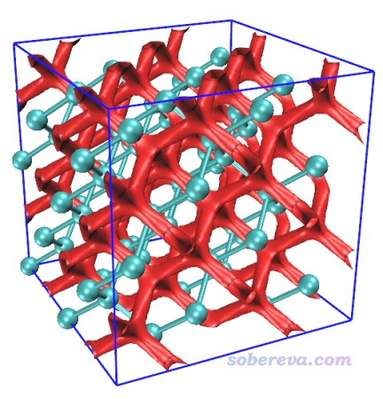

### 3.2 共价有机框架化合物（COF）中的弱相互作用

此例将对下面这个COF晶胞中的弱相互作用通过NCI方法进行图形化展现。

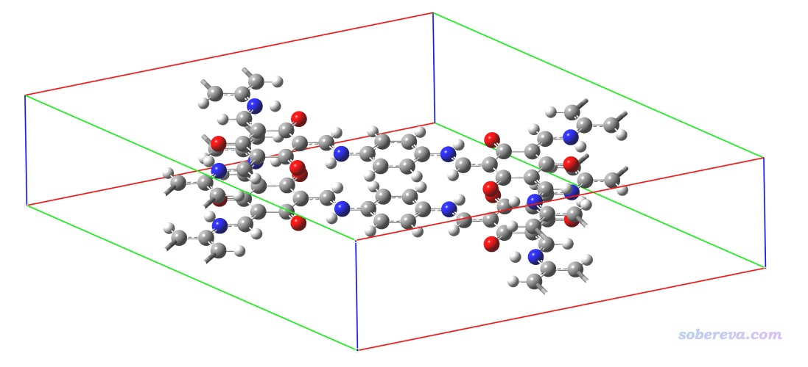

此体系的cif文件是本文文件包里的COF_12000N2.cif。这个晶胞已经很大了，显然没必要再弄成超胞。如《实验测定分子结构的方法以及将实验结构用于量子化学计算需要注意的问题》（<http://sobereva.com/569>）一文所述，X光衍射得到的晶体结构中氢的位置通常是不可靠的，所以本例我们在做NCI分析前用CP2K先优化一下氢原子的位置。

启动Multiwfn并载入COF_12000N2.cif，然后输入  
COF_12000N2.cif  
cp2k  
COF_opt.inp  
-2  //要求产生molden文件  
-1  //设置任务类型  
3  //优化结构但不优化晶胞  
9  //设置原子冻结  
optH  //只优化氢原子  
2  //选择基组  
10  //6-31G*  
0  //产生输入文件

这样就得到了PBE/6-31G*只优化COF中氢原子位置的CP2K输入文件COF_opt.inp。运行之，在36核服务器上十来分钟就算完了。之后可以看到一批以COF_opt-MOS-1_为开头的molden文件，它们记录了优化过程中各帧的波函数。其中序号最大的是COF_opt-MOS-1_4.molden，这是最后优化完的结构下的波函数文件。将COF_opt.inp里的晶胞信息手动加入到COF_opt-MOS-1_4.molden文件里作为[Cell]字段。

用Multiwfn载入COF_opt-MOS-1_4.molden，然后按照与3.1节完全相同的操作步骤让Multiwfn做普通的NCI分析。使用0.2 Bohr格点间距时，在笔者的36核服务器上花了不到一分钟算完。然后用前例说的RDGfill2.vmd脚本在VMD里对Multiwfn导出的func1.cub和func2.cub作图，结果如下

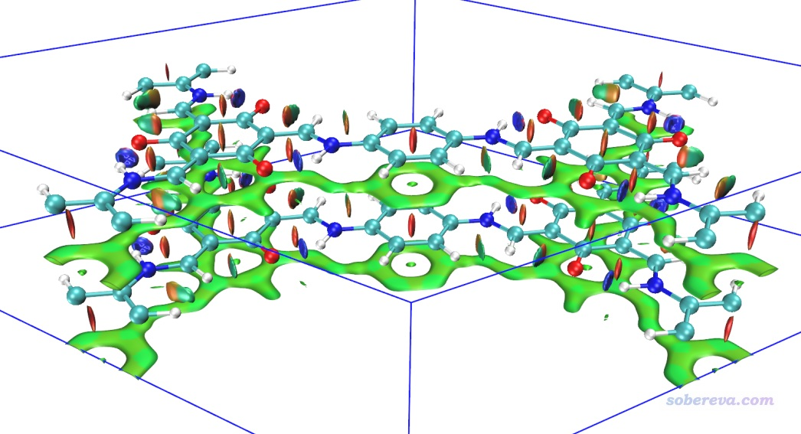

上图非常清晰直观地将COF晶胞中的两层结构间的大面积pi-pi堆积展现了出来。苯环中央的红色锥形等值面展现了环中的位阻作用。当前体系中强烈的N-H...O内氢键被非常蓝的圆片型等值面表现了出来。

上图一些等值面还不算特平滑，有的等值面边缘锯齿有点明显，将格点间距降到0.15会明显更好看，但耗时会多一倍多，每个cub文件增大到90兆。另外，上图左侧和右侧的N-H...O内氢键的圆片型等值面中间凹陷了一些，像缺了一块，这是因为这个内氢键很强，在作用区域有的地方电子密度超过了0.05 a.u.，而Multiwfn默认会把电子密度超过0.05 a.u.区域的RDG设为100来避免显示出强作用区域（如化学键）的等值面。为解决这个问题，可以把Multiwfn目录下的settings.ini中的RDG_maxrho从默认0.05设为改大到0.06 a.u.，这样重新计算和绘制后就不会看到这个强内氢键的RDG等值面中间凹陷（被屏蔽掉）一块了。

如果你想把上图中下方的相邻晶胞（-Z晶胞）的结构和RDG等值面也显示出来，就进入Graphics - Representation界面，对每个Representation都进入Periodic标签页并勾选上-Z，即可看到下图

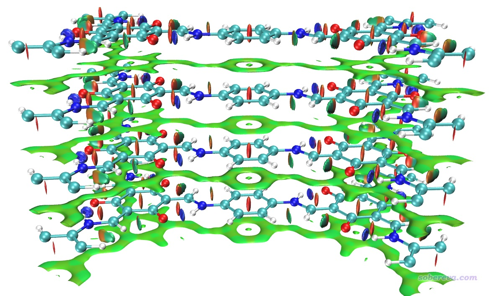

在之前不显示相邻镜像的NCI图中，我们看到在当前晶胞的底端也出现了大面积绿色等值面，这是这部分结构与-Z镜像晶胞的上层部分的相互作用所导致的，看起来很碍眼，怎么避免显示出来呢？在Multiwfn中有两种做法可以实现：  
(1)让盒子起点位置的Z坐标稍微大于0，并让盒子Z方向的尺寸适度小于晶胞的Z尺寸。具体来说，选择做NCI分析，进入设置格点界面后，还是选择模式9，然后输入以下内容  
0,0,1  //盒子原点的X、Y坐标都为0，Z坐标从1 Bohr开始，使得格点不会在晶胞最底层出现  
0,0,10.85  //让盒子的前两个边长等同于晶胞的前两个平移矢量长度，而令盒子的Z尺寸比晶胞Z尺寸小2 Bohr，使得格点不会在晶胞顶端分布（注：晶胞尺寸在Multiwfn载入文件后屏幕上直接显示了，Z尺寸是12.85 Bohr，减去2就是这里写的10.85 Bohr）  
0.2  //格点间距，同前  
用这样得到的cub文件在VMD里作图如下所示，可见很理想，只保留了晶胞中间两层结构间的层间和层内相互作用。

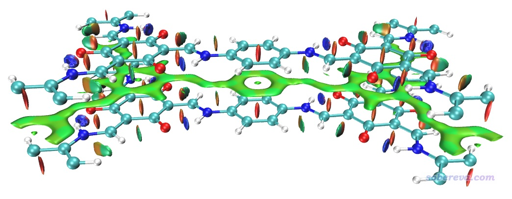

(2)另一种避免显示与镜像晶胞间的RDG等值面的方法是在Multiwfn计算时要求不考虑相应方向的周期性，我最推荐这种做法。比如对此例不想考虑Z方向的周期性，就把Multiwfn的settings.ini里的ifdoPBCxyz从原先的1,1,1改成1,1,0，这里0就代表第三个晶胞方向不考虑周期性（由于当前的晶胞第三个方向就是Z方向，所以等于不在Z方向考虑周期性）。这么改过之后照常计算和绘图即可，格点还是按原先方式设置，结果和上图完全相同。这种做法不仅方便，省得特意考虑格点分布范围，而且由于忽略了一个方向的周期性，计算耗时还下降了百分之几十，一举两得。

下面是对当前体系按照3.1.2节的过程绘制的准分子近似的NCI图的结果，忽略了Z方向周期性。计算耗时极低，只花了1秒就算完了，图像效果和普通NCI定性一致。

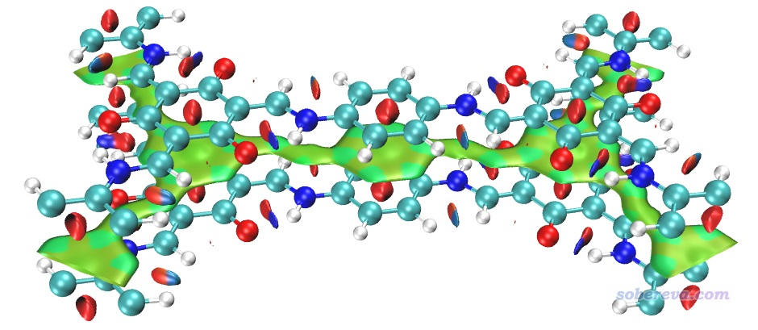

虽然准分子近似版NCI多数情况下和普通NCI定性一致，但是如果你对准确度要求比较高，比如考察氢键时想根据等值面蓝色的深浅程度判断强度，那么不要用准分子近似的版本，否则可能得到一些误导性结论，毕竟用准分子近似相当于没有考虑原子间相互作用引起的电子转移、极化效应对NCI分析结果的影响。

### 3.3 氧化石墨烯与水的相互作用

在《使用Multiwfn非常便利地创建CP2K程序的输入文件》（<http://sobereva.com/587>）文中曾使用PBE-D3(BJ)/TZVP-MOLOPT-GTH对氧化石墨烯+一个水分子的表面吸附体系做了几何优化，计算后得到了opt-1.restart文件，这其实是个CP2K的输入文件，里面记录了优化的最后一帧的信息。现在我们对这个结构做个NCI分析。首先基于这个文件创建一个PBE/6-311G**级别下的单点任务文件，用于得到molden文件。

启动Multiwfn后输入  
opt-1.restart  
cp2k  
SP.inp  
-2  //要求产生molden文件  
2  //修改基组  
11  //6-311G**  
0  //产生输入文件

用CP2K计算产生的SP.inp，算完后就有了SP-MOS-1_0.molden，然后把SP.inp里的晶胞信息手动写入到这个molden文件作为[Cell]字段。

启动Multiwfn，载入SP-MOS-1_0.molden。在计算前我们先进入主功能0看一下这个体系的结构特征，并且选图形窗口菜单栏的Other settings里的Toggle showing cell frame把晶胞边框显示出来，  
此时看到的图像如下所示

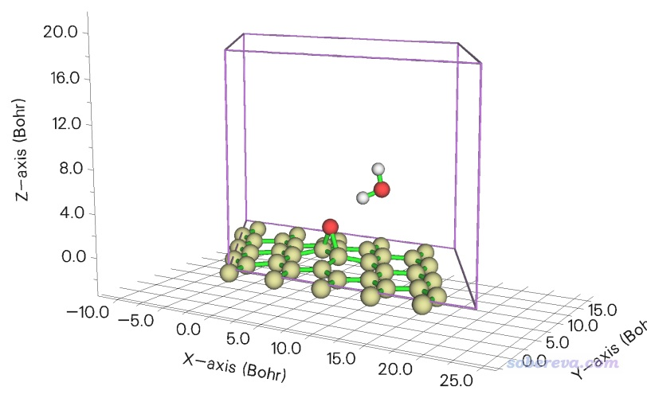

做这个体系的NCI分析时要注意，由于石墨烯板紧贴着盒子最下方，因此如果直接将0,0,0作为盒子原点位置，届时你会看到石墨烯里六元环中的位阻区域的RDG等值面被截断，不好看。为避免这个问题，一个做法是用Multiwfn的主功能300的主功能7里的选项1先把整个体系往Z的正方向挪比如2 Bohr（约1埃），另一个办法是定义格点的时候，让盒子原点Z位置适当小于0，比如-2.0 Bohr。另外，当前体系水分子上方有大量的真空区，为了节约时间，可以让Z方向盒子尺寸明显小于晶胞的Z尺寸（设成其一半就足够包围感兴趣的弱相互作用区域，可以节约一倍的计算时间）。下面计算时会考虑这两点。

在当前图形窗口的右上角点击RETURN关闭窗口，然后输入  
20  //弱相互作用图形化分析  
1  //NCI分析  
9  //借助晶胞信息定义格点  
0,0,-2  //盒子原点位置（Bohr）  
0,0,9  //当前晶胞Z方向尺寸是18.897 Bohr，令盒子Z尺寸取其一半，其它方向和晶胞尺寸相同  
0.15  //格点间距  
在笔者36核机子上13秒算完。算完后用选项3导出cub文件，和3.1.1节一样在VMD里结合RDGfill2.vmd脚本绘制NCI图，如下所示。为了让大家了解当前盒子范围，即格点数据计算的区域，在Graphics - Representation界面里我把对应Isosurface的那个representation里的Show下拉框从默认的Isosurface改为了Box+Isosurface。

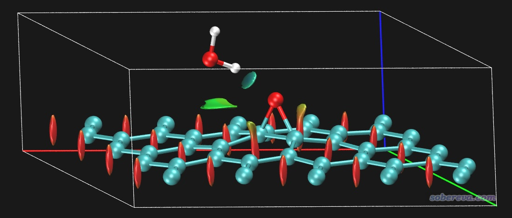

从上图可见，石墨烯每个环中央的位阻区域被清楚地通过红色等值面展现了出来。水与氧桥之间有一块淡蓝色圆片型等值面，体现出氢键的存在，但颜色不算很深，说明不算很强的氢键。在水分子与碳的接触区域还有一块绿色的等值面，体现出水和氧化石墨烯之间还有明显的范德华作用区域。上图白色方框展现的是盒子范围，可见盒子取得比较恰当，既没有截断任何等值面，也没有明显的浪费。由于当前体系与Z方向的镜像距离比较远，不会与其相互作用导致出现额外的RDG等值面，此例就没有刻意把settings.ini里的ifdoPBCxyz像前例一样改成1,1,0，但如果这么改一下的话倒是可以通过忽略Z方向周期性节约一些耗时。

### 3.4 C60晶体

此例考察一下C60富勒烯分子晶体中的弱相互作用，本文文件包里C60.cif是此体系的实验结构。这个体系的晶胞里原子数很多，有240个，若用普通NCI分析耗时会较高，而且此体系主要是pi-pi堆积作用，这种作用靠准分子近似的NCI就可以合理地展现出来，所以此例就只用准分子近似的NCI了。

启动Multiwfn，然后输入  
C60.cif  
20  
2  //准分子近似的NCI  
9  
[回车]  
[回车]  
0.15  //让图像较平滑，用较小的格点间距

计算完后导出cub文件并用RDGfill_pro.vmd在VMD里作图，如下所示

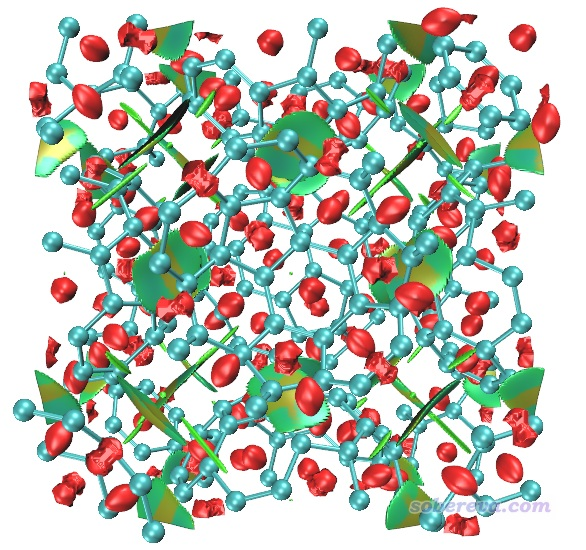

这个图像还不是很令人满意，主要是红色的表现位阻区域的等值面太多了，弄得图像很凌乱，不便于观察富勒烯之间的相互作用。为解决此问题，一方面可以用后文说的IGM，另一方面可以把sign(λ2)rho数值明显大于0的区域手动屏蔽掉。具体做法是在Multiwfn做NCI分析的后处理菜单里选-1先把RDG vs sign(λ2)rho的散点图绘制出来，如下所示

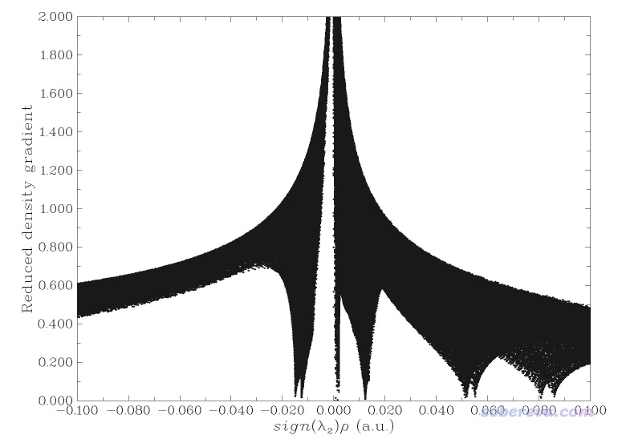

由图可见在sign(λ2)rho>=0.05的区域有很多戳到底的spike，它们是导致分子内位阻作用的等值面出现的原因。为了屏蔽掉它们，在Multiwfn后处理菜单中选-2 Set RDG value where value of sign(λ2)rho is within a certain range，输入0.02,999，然后输入100。此时sign(λ2)rho数值大于0.02的区域的格点的RDG值就都被设为一个很大的数值100了，如果再重新绘制散点图会看到下图，可见sign(λ2)rho>0.02区域的spike都已经没了。

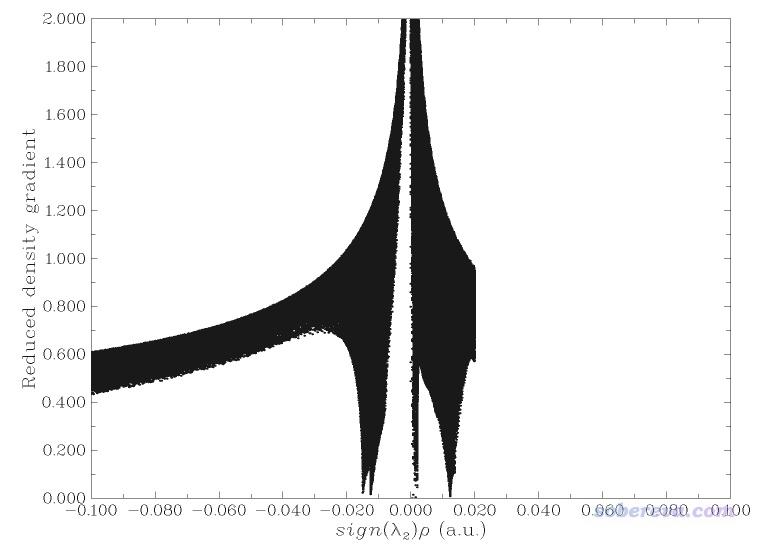

现在重新选择导出cub文件，然后再次用RDGfill_pro.vmd在VMD里作图。并且在VMD里把+X的镜像也显示出来便于考察。然后在VMD文本窗口里输入  
color Name C tan  
color change rgb tan 0.700000 0.560000 0.360000  
这会把碳的颜色改成黄褐色，因为原本的青色与等值面颜色的对比度不够强烈。再在Graphics - Representation里把分子结构显示方式改为Licorice，并把Bond Radius改为0.1，之后在VMD Main窗口里选Display - Orthographic改为正交视角。此时的图像如下

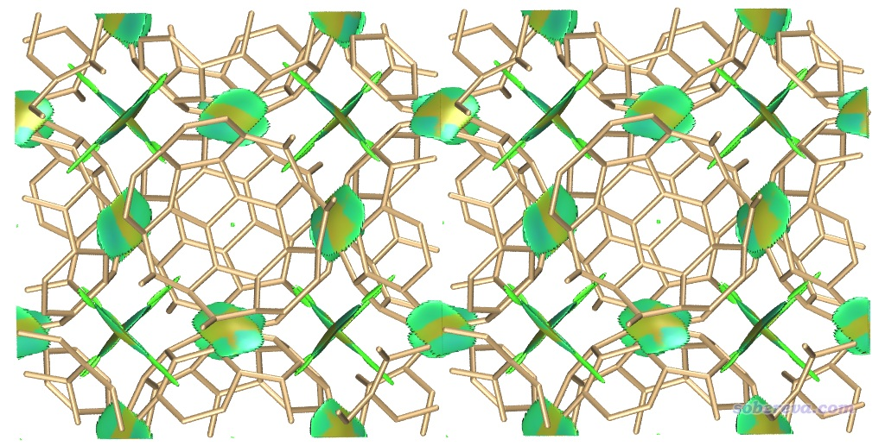

可见当前的等值面清楚地把每个富勒烯与相邻富勒烯之间的pi-pi堆积展现了出来。肯定有人注意到，上图中央的富勒烯中间有些C-C键是断开的，而且图像中央的RDG等值面中间有个黑色的细缝。这是因为VMD没法识别和显示当前晶胞里的原子与相邻镜像晶胞里的原子间的键，而且等值面在跨盒子的地方不可避免地会显示出个缝隙。如果想避免这俩问题让图像更完美，就只能在Multiwfn做这个准分子近似的NCI分析前，先用主功能300的子功能7的选项19把体系构造成2*1*1的超胞，然后再照常做NCI分析。此时计算耗时会明显增高，cub文件大小也会增加一倍。

### 3.5 Ih晶型的冰

此例用普通NCI方法考察Ih晶型的冰中的弱相互作用。Ih是常压下不是特别低温的情况时最稳定的冰的晶型，也是日常生活中我们接触到的冰的晶型。大家有兴趣也可以类似地考察其它晶型的冰中的弱相互作用。

先产生优化冰晶胞中氢位置的CP2K输入文件。启动Multiwfn，载入本文文件包里的H2O-Ice-Ih.cif，然后输入  
cp2k  
opt.inp  
-2  //产生molden文件  
2  //选择基组  
11  //6-311G**  
3  //开启色散校正  
2  //DFT-D3(BJ)  
-1  //设置任务类型  
3  //优化结构但不优化晶胞  
9  //设置冻结  
optH  //只优化氢  
0  产生输入文件

现在用CP2K进行计算，很快就算完了。把晶胞信息手动写入对应优化好的结构的opt-MOS-1_5.molden文件里作为[Cell]字段。由于冰当中的氢键作用相对较强，为了避免氢键对应的RDG等值面被截断，把RDG_maxrho设为0.07。然后照常做NCI分析。由于当前晶胞不大，用很小格点间距要算的格点数也不很多，因此为了图像效果尽量精甚细腻，此例用了0.13 Bohr这样很小的格点间距。

照常使用RDGfill2.vmd脚本在VMD里对Multiwfn做NCI分析后导出的cub文件作图。为了让冰当中的相互作用显得比较完整，在Graphics - Representation界面里把显示分子结构和显示等值面的representation都设成+X、+Y、-Y、+Z、-Z镜像都显示，并且设置雾化效果使得远处的物体被一定程度遮掩而避免扰乱视线。具体来说就是确保VMD Main的Display里的Depth cueing已经打开了，然后在Display - Display settings里把Cue Mode设成Linear，并把Cue Start和Cue End分别设为1.5和3.0。此时看到的图像如下。

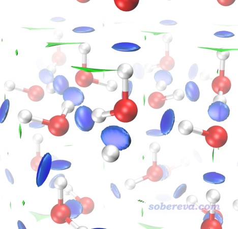

上图非常清楚地展现出在冰当中，每个水与周围四个水形成了氢键，而且RDG等值面非常蓝，体现出氢键强度较大。零星的绿色等值面体现出冰当中还有一些主要算是范德华作用的区域，但可以忽略不计。

### 3.6 NaCl表面吸附CO

本例绘制NaCl表面吸附一氧化碳的NCI图。根据诸多文章的研究，最稳定的吸附结构应当是一氧化碳的碳冲着Na+，此例也优化的是这种结构。用的是两层厚度3*3的氯化钠板，底层原子冻结，上层和CO都在优化过程中自由弛豫。先通过PBE-D3(BJ)/DZVP-MOLOPT-SR-GTH优化结构，然后PBE/6-31G*算单点得到波函数文件。此模型可以用GaussView很容易地搭建，保存成gjf并载入后通过Multiwfn很容易地就可以创建相应任务的CP2K输入文件，相关过程这里就不累述了。单点计算后得到的SP-MOS-1_0.molden在本文文件包里提供了。之后对此体系做普通NCI分析，用0.15 Bohr格点间距，图像如下所示。此体系计算耗时很高，为了节约时间，应恰当设置盒子Z方向尺寸，避免让格点分布在根本没原子出现的真空区。

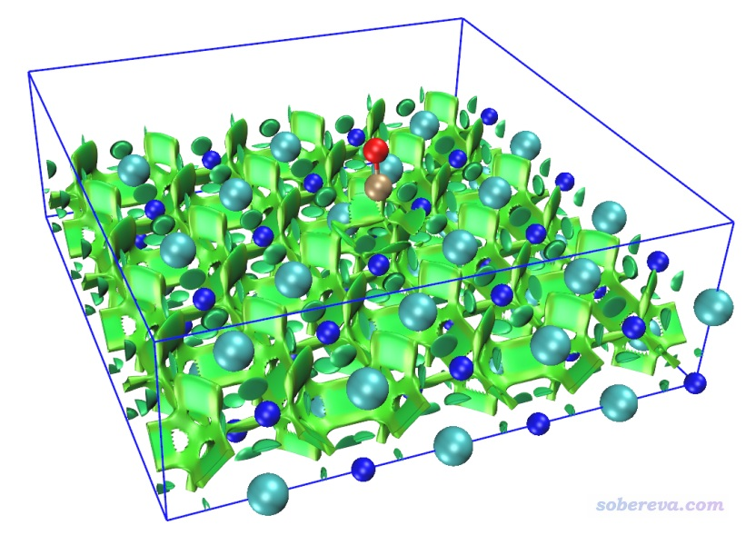

为了看得清楚，俯视图和侧视图也在下面给出

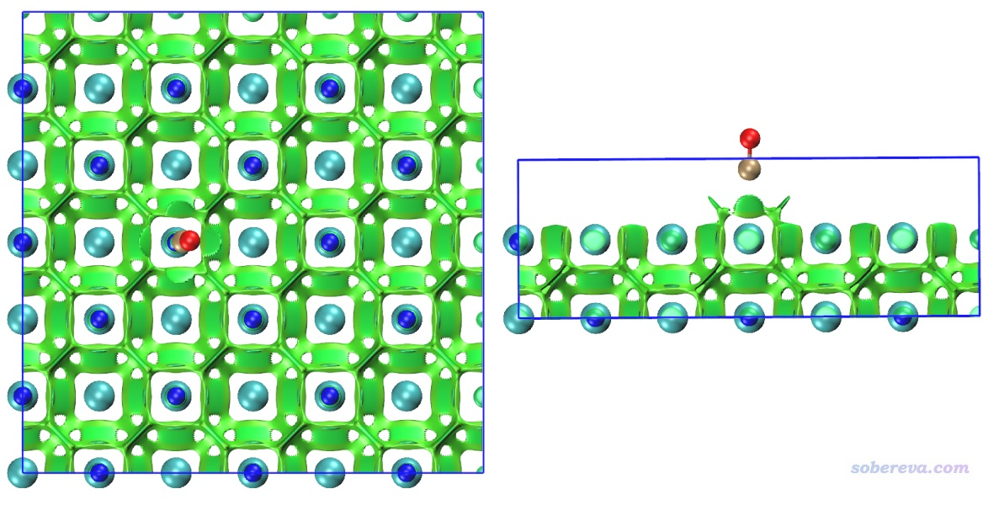

图中青色圆球是Cl-，蓝球是Na+，褐球是碳，红球是氧，蓝色方框展现的是计算的格点数据的分布范围。从此图可以清楚地看到一氧化碳的碳与Na+有明显的相互作用，与旁边的四个Cl-也有明显作用，并且Na+和Cl-之间也有显著相互作用。Na+带显著正电，它与碳的键轴末端的孤对电子明显会形成显著的静电主导的吸引作用（文献中的吸附能约为20 kJ/mol，不算小了），且Na+和Cl-之间毫无疑问是挺强的离子键，为何RDG等值面全都是绿色而不是蓝色？这是因为钠的半径较大，而且价层孤立状态下就只有一个电子，在当前体系中价电子就更少了，故在它与其它原子形成相互作用的区域必定电子密度（rho）比较低，所以sign(λ2)rho数量级很小，故着色是绿色。记住切勿盲目用RDG等值面颜色衡量作用强度，要正确理解NCI方法的本质和局限性。

上面的图有个明显的不足之处就是Na+和Cl-之间作用的等值面严重妨碍了观看氯化钠和一氧化碳之间的相互作用。既可以使用后文所述的IGM方法避免此问题，也可以使用Multiwfn的格点数据处理功能（主功能13）中的子功能14解决，它可以用来将NaCl板与一氧化碳交叠区域以外的区域的格点的RDG设成一个特定值，比如100，从而达到屏蔽NaCl内部相互作用的目的。下面就来这么屏蔽一下。NCI分析后导出的func2.cub是RDG的格点数据文件，将之载入Multiwfn，然后输入  
13  //主功能13  
14  //设置两个片段交叠区域以外区域格点的数值  
1.3  //原子球半径设为范德华半径乘以1.3（片段占据的区域是片段内所有原子球的叠加）  
100  //交叠区域以外的格点数值设为100  
2  //手动输入两个片段里的原子序号  
1-72  //片段1的原子序号，即NaCl板中的原子  
73,74  //片段2的原子序号，即CO的原子  
0  //将当前的格点数据导出为cub文件  
[按回车]  //格点数据导出为当前目录下的func2.cub

现在，用新得到的func2.cub替换原先的func2.cub，再用RDGfill2.vmd脚本作图，得到如下图像，可见非常理想，确实NaCl内部的等值面都被屏蔽掉了。为了效果更好，作图时笔者还设了景深雾化，并且把RDG等值面数值从默认的0.5稍微设大到了0.6，这样等值面更膨胀一些，边缘锯齿看起来也更小一点。

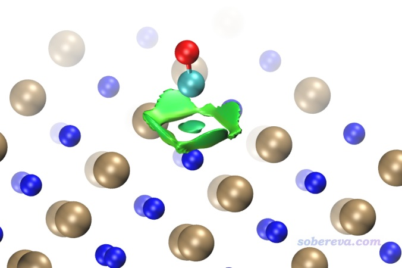

顺带一提，还可以在VMD中使用焦距虚化效果，如下所示，这样层次更清楚。也可以通过把原子球调大来提升层次感。

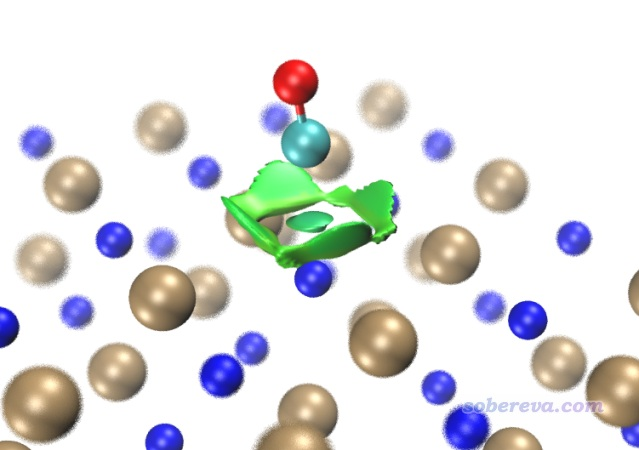

像上面这样只需要对一小部分区域作NCI图的情况，在Multiwfn里设置计算的格点范围的时候可以只让盒子框住感兴趣的区域（即感兴趣的等值面可能出现的区域），耗时能节约非常多。这通过恰当设置盒子原点和边长即可实现，也可以在格点设置界面里通过选项10 Set box of grid data visually using a GUI window在图形窗口里直观设置盒子的位置和尺寸，正如此文2.6节所示的情况：《使用量子化学程序基于簇模型计算金属表面吸附问题》（<http://sobereva.com/540>）。

## 4 周期性体系的IGM分析

IGM分析只需要原子坐标。如果体系虽然是周期性的，但是被考察的区域与晶胞边界有一定距离，那么完全可以按照《通过独立梯度模型(IGM)考察分子间弱相互作用》（<http://sobereva.com/407>）所述的当成孤立体系考察。比如Mater. Today Commun., 26, 102028 (2021)一文中，在笔者的建议下作者对他们研究的MOF吸附芳香化合物的问题做了IGM分析，如下所示，可见很好地展现出了MOF对分子的吸附时主要的作用区域。像这种情况就当成孤立体系计算做IGM计算就可以，考虑周期性的话耗时会明显更高。

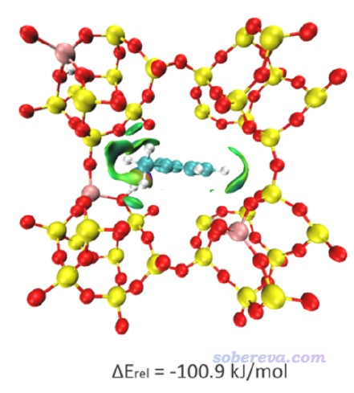

但也有一些情况IGM等值面要涉及到体系边缘，这种情况就必须当成周期性做IGM分析了，否则盒子边缘处的等值面就不正常了，比如3.2节的COF体系就是如此。这里我们就用IGM方法对COF这个体系做一下分析，如果没读过《通过独立梯度模型(IGM)考察分子间弱相互作用》一文的话请仔细阅读，基本知识本文不再累述。为了不显示出中心晶胞和相邻晶胞的相互作用对应的IGM等值面，还是把settings.ini里的ifdoPBCxyz设成1,1,0忽略掉Z方向的周期性。

启动Multiwfn，然后输入  
COF_opt-1.restart  //本文文件包里优化COF中氢原子位置任务产生的记录最终结构的restart文件  
20  //图形化分析弱相互作用  
10  //IGM  
2  //定义两个片段  
1-72  //第一个片段的原子序号，即两层COF其中一层中的原子  
73-144  //第二个片段的原子序号，即另一层COF中的原子  
9  //借助晶胞信息设置格点  
[按回车]  //用0,0,0作为盒子原点  
[按回车]  //用晶胞边长作为盒子边长  
0.4  //格点间距。IGM等值面不容易像RDG的那么容易有锯齿，所以可以用明显大得多的格点间距节约时间

本身IGM分析就很快，而且格点间距又大，在普通4核机子上不到半分钟就算完了。之后选3导出格点数据，在当前目录下就有了dg_inter.cub、dg_intra.cub、dg.cub和sl2r.cub，将它们都挪到VMD目录下。并且把Multiwfn目录下的examples文件夹中的IGM绘图脚本IGM_inter.vmd和IGM_intra.vmd都复制到VMD目录下。

启动VMD，然后在命令行窗口输入source IGM_inter.vmd，这会绘制出IGM方法中定义的sign(λ2)rho着色的δg_inter函数的等值面。但是直接显示出来的等值面非常窄，不能充分展现出两层MOF间的pi-pi堆积，这是因为默认的δg_inter等值面数值偏大。因此进入Graphics - Representation界面，把Isovalue改成更小的0.005，此时图像如下所示。可以看到此图非常清楚地展现出了层间pi-pi堆积作用，而且片段内的相互作用不像NCI那样被显示出来，同时等值面很平滑，可见Multiwfn做IGM分析又简单又快效果又非常好。IGM分析还有一个好处是可以把各个原子的贡献给出来，并可以由此给原子球着色凸显较重要的原子，详见前述的《通过独立梯度模型(IGM)考察分子间弱相互作用》。

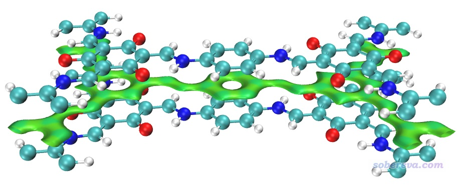

如果在VMD里输入source IGM_intra.vmd，可以把COF层内的相互作用，包括化学键作用和内氢键都展现出来（展现后者需要调小isovalue）。由于这不是此例我们感兴趣的，就不说了。

下面对本文3.6节考察过的NaCl吸附CO的体系做IGM分析，将NaCl和CO分别作为两个片段，操作方式同上。下图左侧和右侧对应0.005和0.003的δg_inter等值面。

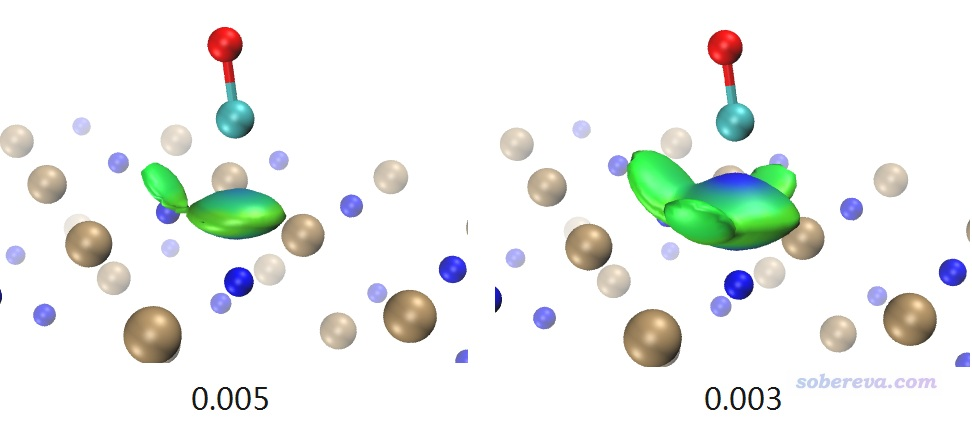

δg_inter数值取得越小，其等值面就可以把越弱的相互作用展现出来。如上所示，在0.005等值面的时候，C和Na+的相互作用区域很明显，但C和周围Cl-的范德华作用对应的等值面只显示出了CO稍微歪过去方向的那一小块。而将等值面数值降到0.003后，更多相互作用区域被等值面展现了出来，并且此时C和Na+接触的那部分等值面中央颜色已经很蓝了。为什么此时颜色这么蓝而不像RDG等值面那样是绿色的？这是因为此时的δg_inter等值面特别肥厚，已经延展到了比较靠近C的部分，此处电子密度已经不是很小了，sign(λ2)rho可以达到负零点零几了，因此对应的着色明显发蓝。

IGM等值面比较肥厚是IGM方法的十分明显的弊端，而且上面的颜色往往还会误导研究者，在笔者2022年提出的IGMH方法中被完美解决，而且IGMH比IGM原理更严格。读者务必看《使用Multiwfn做IGMH分析非常清晰直观地展现化学体系中的相互作用》（<http://sobereva.com/621>），里面有IGMH非常全面的介绍和与IGM的对比。在Multiwfn中的使用上，IGMH和IGM的区别仅仅在于主功能20里应选择11而非10，并且需要载入和NCI分析一样的含有波函数信息的输入文件。IGMH由于是基于波函数的分析，故耗时显著高于IGM，而且和NCI分析一样格点间距不宜太大以避免锯齿。对当前体系，为节约耗时，建议设置格点时让盒子仅框住感兴趣的作用区域，并且把ifdoPBCxyz设为0,0,0当孤立体系处理（因为CO与NaCl作用的位置离盒子边缘很远，这么做不会有不良影响）。基于IGMH方法绘制的δg_inter为0.002的等值面图如下所示，可见等值面和RDG的等值面很相似，都比较薄，而且和IGM一样都完全避免了NaCl板内的等值面妨碍考察CO的吸附，图像效果极度理想。**我建议凡是能得到波函数的情况，都应当用IGMH代替IGM**。

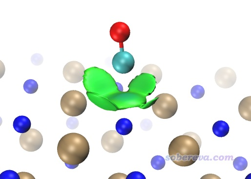

**2025-11-28后记**：如果你不方便得到波函数，又想耗时和IGM一样，那么**强烈建议用2025年我提出的mIGM代替IGM**，效果接近IGMH，同样比IGM强得多！介绍见《使用mIGM方法基于几何结构快速图形化展现弱相互作用》（<http://sobereva.com/755>）。**如今我已经完全不推荐使用IGM了！**

## 5 总结

本文详细介绍了如何使用Multiwfn基于CP2K第一性原理程序产生的波函数做NCI分析，还介绍了怎么对周期性体系做IGM分析，还对笔者提出的比IGM强得多的IGMH分析也做了简要示例。Multiwfn灵活方便的创建CP2K输入文件的功能，结合Multiwfn非常简单易用的NCI/IRI/IGM/IGMH/mIGM分析功能，真是使得固体和表面的弱相互作用图形化分析异乎寻常地简单。研究周期性体系中的弱相互作用不要再只是算算结构、算算能量、只靠数据讨论了，结合本文介绍的图形化分析方法可以令文章大为增光添彩、明显更吸引眼球，令枯燥抽象的分析讨论变得直观生动传神。

Multiwfn对周期性体系的分析绝不限于本文所介绍的。目前的版本已可以对周期性体系计算原子电荷、计算键级、做AIM拓扑分析、计算和绘制上百种实空间函数（如ELF、LOL、IRI、电子密度拉普拉斯、能量密度、自旋密度等等）、做范德华势分析（《谈谈范德华势以及在Multiwfn中的计算、分析和绘制》<http://sobereva.com/551>），等等。Multiwfn对周期性体系的支持详情看Multiwfn手册2.9节的说明。笔者在未来会陆续写更多的Multiwfn对周期性体系波函数分析的相关教程。读者也别忘了看《使用IRI方法图形化考察化学体系中的化学键和弱相互作用》（<http://sobereva.com/598>），其中有IRI研究周期性体系的介绍，比NCI分析能展现更丰富的信息，建议代替NCI。

顺带一提，如果你之前不会用CP2K的话，也完全不用担心什么。如本文所示，靠Multiwfn可以非常简单地创建本来特别繁琐复杂的CP2K输入文件，而且如前文提到的我的CP2K安装教程所写的，用CP2K预编译版都完全不需要自己编译，下载就能用。再加上CP2K又快又免费，结合Multiwfn做周期性体系的波函数分析简直不能更好用。所以即便你以前用的是Quantum ESPRESSO、CASTEP等其它第一性原理程序，也可以毫无压力地过度到Multiwfn+CP2K的分析组合上。
