**使用Multiwfn绘制分子和固体表面的距离投影图**

Using Multiwfn to plot surface distance projection map of molecules and solid surfaces

文/Sobereva@[北京科音](http://www.keinsci.com/) 

First release: 2021-Feb-28   Last update: 2026-Feb-8

## 1 前言

不止一次在思想家公社QQ群和计算化学公社论坛上有人问我下面的这种图是怎么绘制的

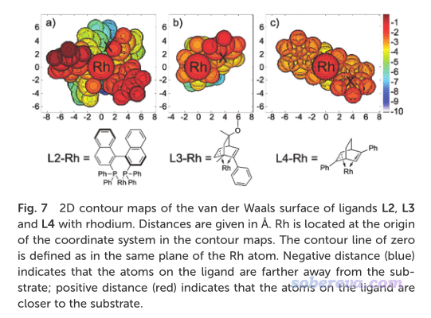

实际上上面这种图就是定义一个平面，把体系的范德华表面上各个位置距离此平面的垂直距离的大小通过不同颜色展现而已。可能有人觉得直接看范德华表面图不就完了，何必作这种图，实际上这种图是有一定独特价值的，可以把不同原子所在位置的深浅以直观且明确的方式显示，便于某些情况的讨论，比如原子被包埋情况、周围的原子产生的位阻情况等。下面笔者管这种图叫做“表面距离投影图”（surface distance projection map），我觉得这么称呼比较形象、贴切。

笔者在Multiwfn中已经实现了绘制类似上面这种图的功能。这个功能设置灵活，作图效果理想，而且支持不同方式定义体系表面。下文先简要介绍此功能的特征和用法，然后将通过一个[Ru(bpy)3]2+配合物的例子和一个Cu(111)表面的例子演示怎么绘制表面距离投影图。

读者请使用2021-Feb-28及以后更新的Multiwfn。Multiwfn可以在官网<http://sobereva.com/multiwfn>免费下载。不了解此程序的话请阅读《Multiwfn FAQ》（<http://sobereva.com/452>）和《Multiwfn入门tips》（<http://sobereva.com/167>）。

## 2 Multiwfn中的表面距离投影图的绘制功能的使用

表面距离投影图的绘制功能是Multiwfn的主功能300的子功能8。此功能支持三种体系表面的定义：  
(1)准分子(promolecular)电子密度的等值面。这种电子密度是将各个原子自由状态下的电子密度简单叠加得到的近似的电子密度，没有考虑原子间相互作用导致的电子转移和极化  
(2)基于电子波函数计算的电子密度的等值面  
(3)通过原子球叠加得到的表面。原子球半径是Bondi范德华半径乘以用户指定的系数  
耗时关系是(2)>(1)>(3)。通常建议用(1)，因为耗时低，表面处处光滑，还不需要提供波函数信息。(3)虽然耗时最低，但其表面在原子球交界处有明显缝隙。原理上(2)最理想，但耗时相对较高，而且需要做量子化学计算才能得到波函数。使用(1)或(2)时电子密度等值面取什么数值在很大程度上是随意的，可以根据实际需要并反复尝试。等值面数值取得越小，表面就越大。

对于以(1)或(3)方式定义表面的情况，需要用的输入文件只需要含有原子坐标即可，比如pdb/mol/mol2/xyz/gjf等等等等。对于用(2)的情况，输入文件必须包含波函数信息，比如wfn/wfx/mwfn/fch/molden等格式。Multiwfn支持的这些格式说明以及产生方式详见《详谈Multiwfn支持的输入文件类型、产生方法以及相互转换》（<http://sobereva.com/379>）。

此功能还支持周期性体系，考虑周期性的话输入文件必须包含晶胞信息。Multiwfn支持的包含坐标信息又包含晶胞信息的文件在《使用Multiwfn非常便利地创建CP2K程序的输入文件》（<http://sobereva.com/587>）第2节列举了，包含波函数信息又包含晶胞信息的文件在《使用Multiwfn结合CP2K通过NCI和IGM方法图形化考察固体和表面的弱相互作用》（<http://sobereva.com/588>）的2.1节说明了。

表面距离投影图在Multiwfn中的计算原理示意如下：

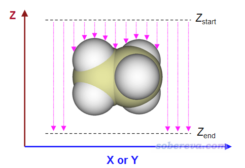

用户需要定义X和Y范围，这决定了作出来的图涵盖什么区域。还需定义Z_start和Z_end，对每个(x,y)坐标，程序会从Z_start往Z_end逐渐扫描，直到达到体系表面内或者达到Z_end。上图中粉色箭头长度就是表面距离投影图里每个(x,y)位置的数值的负值。根据计算原理可知，给Multiwfn用的输入文件中分子的朝向必须合适，这样得到的距离投影图才能说明你想说明的问题，比如原子在你感兴趣的方向的暴露情况。

程序在扫描的时候是有固定步长的，默认为0.05埃，这是精度与耗时的较好权衡。步长越小得到的Z位置精度越好，但耗时也越高。对于基于前述(1)、(2)方式定义体系表面的情况，程序在判断最终Z位置时还会自动做个线性插值，使得得到的Z坐标精度能提升一个数量级。

程序默认的X、Y范围是根据体系的边界原子位置自动往四周延展一些来确定的。Z_start默认为Z坐标最大的那个原子的坐标，用户也可以改得稍微再比它大一点。默认的Z_end是Z坐标最小的那个原子的坐标。X、Y方向的格点数越多，图像越精细，但耗时越高。默认这两个方向都是300个点，这就已经很大了。

程序默认绘制的是平面填色图+等值线图。色彩刻度下限和上限分别默认是Z_end-Z_start和0，等值线默认是25条，数值均匀分布在Z_end-Z_start和0之间。等值线的数目可以在计算前由界面里的相应选项修改，等值线具体定义也可以在计算后的后处理菜单里的等值线设定界面里自行修改。

## 3 实例1：绘制[Ru(bpy)3]2+阳离子配合物的表面距离投影图

此例对[Ru(bpy)3]2+阳离子配合物绘制表面距离投影图，Multiwfn自带的examples\excit\Ru(bpy3)2+.gjf文件里包含了其结构。将此文件载入Multiwfn，进入主功能0可以看到下图

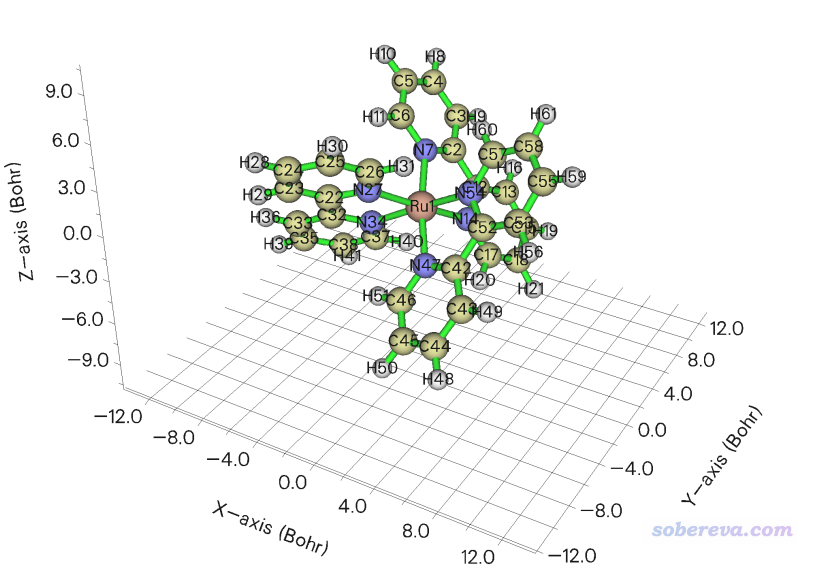

可见此体系中Ru被周围三个联吡啶配体所包围。表面距离投影图可以直观地反映过渡金属配合物中中心金属被包埋的程度，这和它是否容易与外界分子接触而发生反应有密切关系。当前我们就使用上图的分子朝向来绘图，如果想绘制其它朝向的话就在GaussView里按住alt键拖动分子旋转其朝向然后重新保存gjf文件。

点击主功能0的图形窗口右上角的RETURN按钮返回，然后输入  
300  //其它功能（Part 3）  
8  //绘制距离投影图  
0  //基于默认设置直接绘图  
此时程序就开始计算了，在默认设置下是以准分子密度0.05 a.u.等值面作为体系的表面。算完后会进入一个后处理菜单，里面提供了非常丰富的选项用于调节作图设置，请大家自行尝试，这里就不一一累述了。这里就直接选0把图像显示在屏幕上，你会看到下图（用于发文章的话记得应当用选项1保存图像文件，比直接在屏幕上显示的线条更平滑）

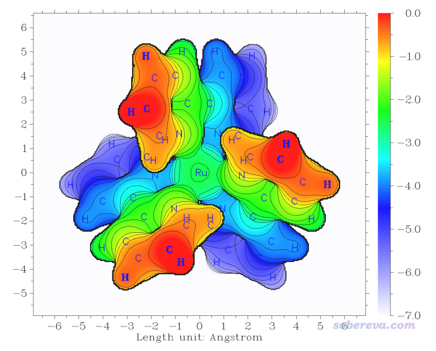

可见在默认设置下作图效果就已经非常好了，令人眼前一亮。Z位置不同的区域通过颜色很鲜艳地区分开了，等值线使得图像更有层次感。图中每个点的数值为Z'-Z_start，其中Z'是这个(x,y)位置处从Z_start向Z_end扫描过程中满足判断条件时的Z坐标。图中纯红色的地方数值为0，是因为刚开始扫描时，第一步在Z = Z_start的位置处就已经满足了判断条件（即电子密度>0.05 a.u.，处在体系表面内）。更直观地说，如果你把Z_start位置想象成当前屏幕的位置，图中越蓝的地方距离屏幕越远，而纯红的地方表示相应位置的表面在屏幕里侧。

下面我们再看改用原子球叠加定义分子表面时候的距离投影图是什么样子。输入如下命令  
-1  //返回之前的界面  
1  //设置对体系表面的定义  
3  //通过范德华球叠加定义表面  
1  //系数设为1，即直接使用Bondi范德华半径作为原子球半径  
0  //开始计算  
0  //在屏幕上显示图像

此时看到的图像如下所示

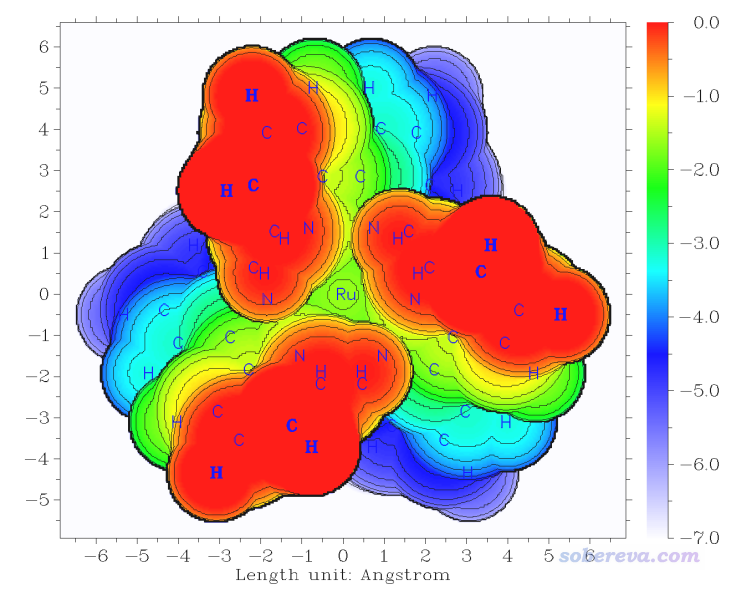

当前的图对应范德华表面的距离投影，可以很直观地看出Ru原子被显著地包埋于三个配体之间，因此外部物质很难有机会接触到Ru。通过这种图，可以通过配体的位阻效应讨论相似配合物发生金属-有机反应的难易程度、催化能力高低等问题。大家还可以根据图中的坐标刻度近似测量配体间距离以对位阻效应予以一些定量讨论。

上面基于原子球叠加定义的体系表面图在原子缝隙处不太平滑，而且对这种表面的定义Multiwfn没法做插值提升Z位置判断精度，所以线条稍有锯齿感（虽然也可以减小扫描步长来减轻，但会提升耗时）。

下面我们还是基于准分子密度做距离投影图，但使用比之前的0.05 a.u.小一个数量级的0.005 a.u.作为等值面数值。输入下面的命令  
-1  //返回之前的界面  
1  //设置对体系表面的定义  
1  //准分子密度  
0.005  //等值面数值  
0  //开始计算  
0  //在屏幕上显示图像

此时看到的图像如下所示。这个图和基于范德华球叠加时的图的基本特征极为相似，但是线条明显非常平滑了。我个人比较推荐以这种方式定义范德华表面来讨论位阻问题（虽然Bader用0.001 a.u.等值面作为气相下的范德华表面，但此时的等值面范围有点太大了，Ru完全被配体糊住了，显得太夸张了）

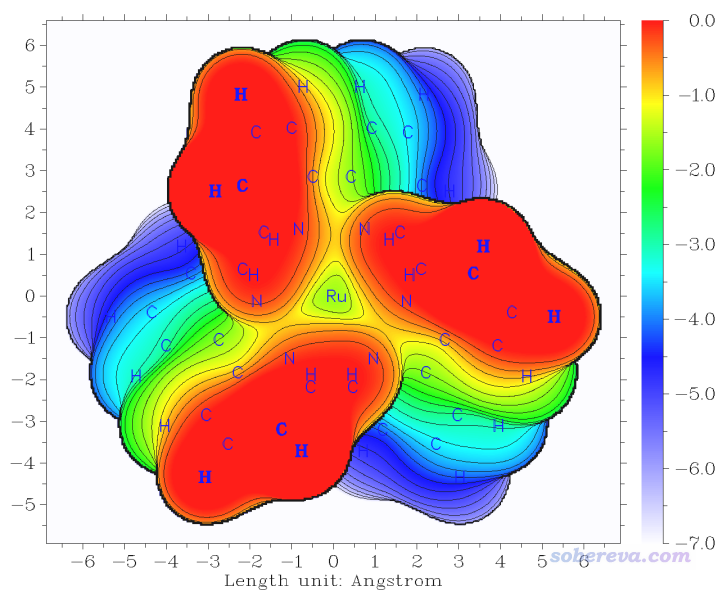

## 4 实例2：绘制Cu(111)晶面的表面距离投影图

下图举一个周期性体系的例子，对Cu(111)晶面绘制表面距离投影图。首先用GaussView基于Cu晶胞的cif文件切一个(111)晶面，厚度为三层，并且再平移复制一下，最终成为下面的样子，俯视图和侧视图都给了

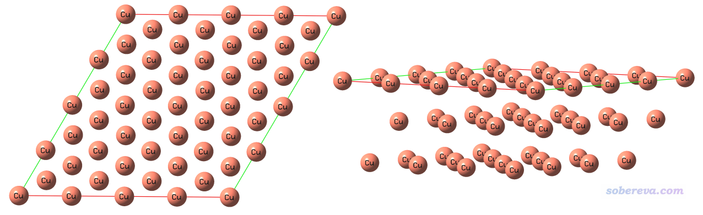

将此结构保存为Cu111_slab.gjf，此文件可以在此下载：<http://sobereva.com/attach/589/Cu111_slab.gjf>。注意此文件里有两个Tv（translation vector），这是两个平移矢量，体现这个体系是个二维周期性体系。Multiwfn载入这样含有周期性信息的文件后，在计算绘制表面距离投影图所需的数据的时候就会相应地考虑周期性。

启动Multiwfn，然后输入  
Cu111_slab.gjf  
300  //其它功能（Part 3）  
8  //绘制距离投影图  
7  //设置Z_start位置。默认情况正好是在最上层的Cu的原子核位置，这样体现不出Cu表面的形貌  
2  //令Z_start为2埃，相当于让扫描的起点处在Cu表面上方2埃处，这样可以把最上层Cu表面的形态展现出来  
0  //开始计算。此例用的是默认的准分子密度为0.05 a.u.的等值面作为体系表面

算完之后选0绘图，看到的图像如下。图中显示Cu标签的原子是原本晶胞范围内的原子。

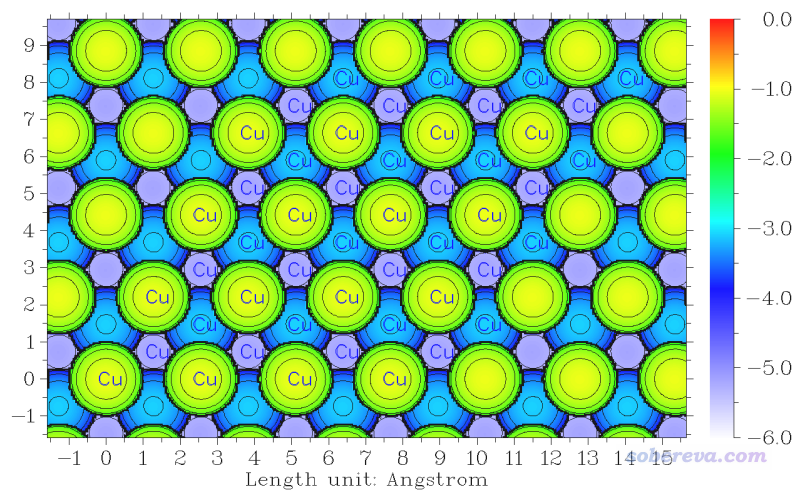

下面根据个人喜好可以调节作图设置，比如关闭图像后输入  
9  //修改色彩变化方式  
4  //光谱  
8  //修改色彩刻度  
-6,-0.5  
3  //切换是否显示原子标签  
7  //修改XYZ标签间隔  
2,2,0.5  
重新选0作图，效果如下

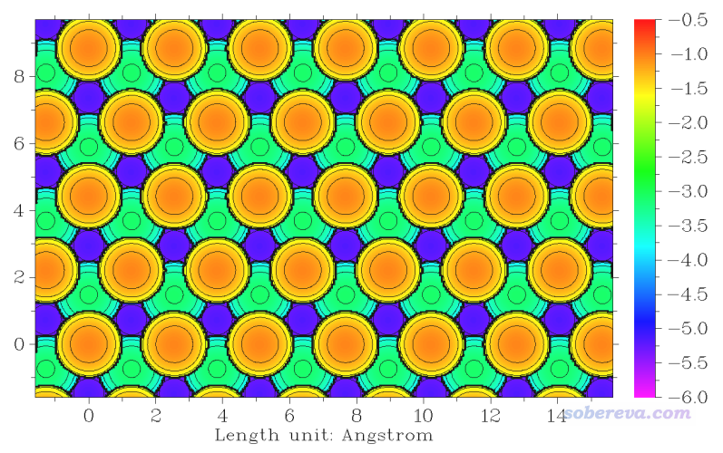

可见表面原子位置的相对深浅可以通过颜色很清晰地区分，在讨论固体表面特征的时候可以利用这种图。

顺带一提，如下图所示，这种晶面上有不同的特征位点，这在上面我们绘制的表面距离投影图中都可以非常清楚地看到，不同位点的深浅差异体现得十分清楚。

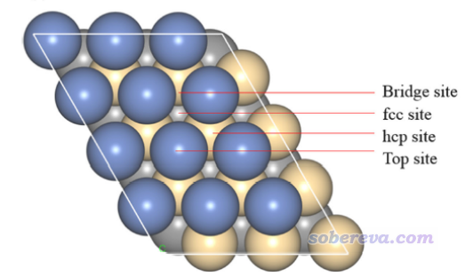

## 5 文献中的例子

唐本忠等人的Sci. Adv., 7, eabj2504 (2021)一文中使用了本文介绍的Multiwfn的功能，绘制了一系列类似分子的表面投影图，将体系结构特征差异很清楚地展现了出来。

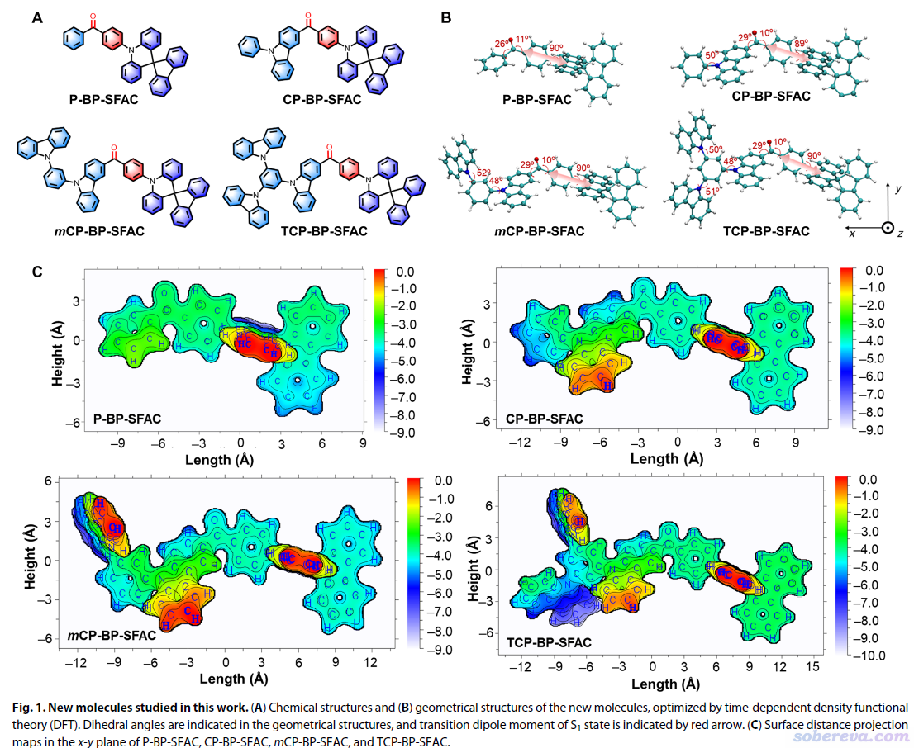

Houk等人的JACS (2022) <https://doi.org/10.1021/jacs.1c12664>一文中使用了本文介绍的Multiwfn的功能，考察了位阻效应。文中相关的图汇总放在下面了。

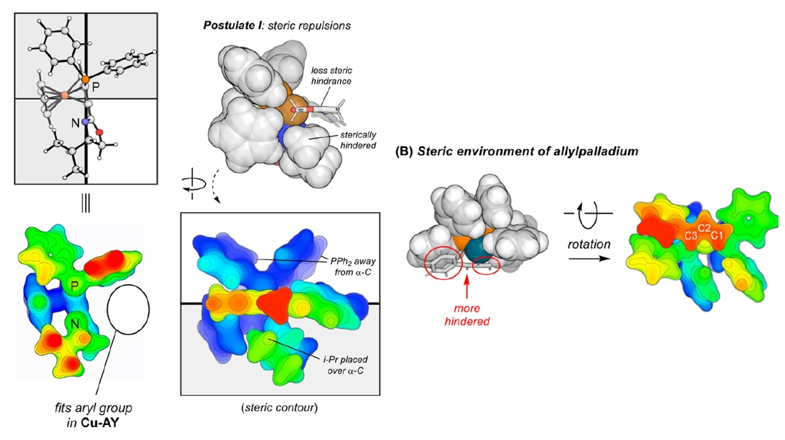

最后顺带一提，偶尔有人问我文献里的下面这种图怎么画。实际上用本文的功能即可，只不过Multiwfn产生图像之后你再用photoshop抠出一个圆形区域就完了。

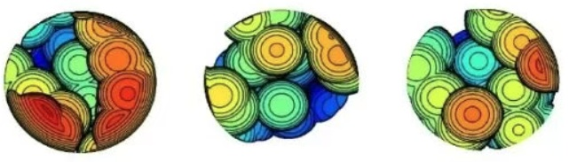
