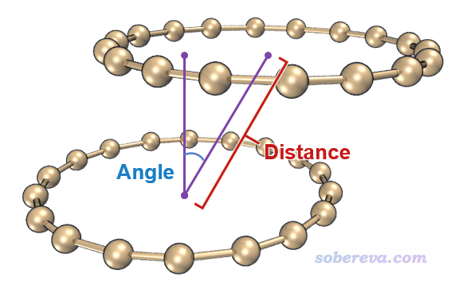
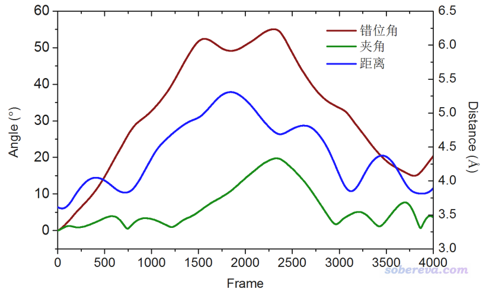

**计算分子动力学轨迹中两个环平面间的距离和夹角**

Calculating distance and angle between two ring planes in a molecular dynamics trajectory

文/Sobereva@[北京科音](http://www.keinsci.com)  2021-Mar-3

## 1 前言

在《全面探究18碳环独特的分子间相互作用与pi-pi堆积特征》（<http://sobereva.com/572>）曾介绍了笔者做的关于18碳环弱相互作用的研究，其中跑了18碳环二聚体的从头算动力学。当时为了统计模拟过程中两个碳环的间距和相对角度随模拟时间的变化，笔者在Multiwfn里写过一个子程序来实现。今天有人在思想家公社QQ群里问怎么获得环平面间夹角随模拟时间的变化，我决定干脆把Multiwfn里的这个隐藏功能给大家简单介绍一下，顺便又增加了计算环平面与笛卡尔平面间夹角的功能，可能有人用得着。请读者使用2021-Mar-3及以后更新的Multiwfn，否则会与本文不符。Multiwfn可以在<http://sobereva.com/multiwfn>免费下载。**研究文章中如果利用了本文的功能请引用Multiwfn启动时提示的Multiwfn原文。**

使用本文的功能需要用xyz轨迹文件作为输入，格式见《谈谈记录化学体系结构的xyz文件》（<http://sobereva.com/477>）。如果用ORCA或CP2K等程序跑动力学，直接就有了xyz轨迹；如果用GROMACS、AMBER等程序跑，可以用VMD载入后再保存为xyz轨迹。

## 2 计算两个环平面间夹角随时间的变化

这里就用18碳环二聚体在100 K下的动力学轨迹作为演示。此轨迹是我用ORCA跑的，方法参见《使用ORCA做从头算动力学(AIMD)的简单例子》（<http://sobereva.com/576>），一共4001帧，文件可以在这里下载：<http://sobereva.com/attach/590/C18dimer.rar>。

启动Multiwfn，然后输入  
C18dimer.xyz  
1000 //隐藏的主功能  
201 //隐藏的子功能  
1  //获得片段间几何中心距离和夹角  
4001  //轨迹总帧数  
1-18  //第一个片段里的原子序号，即第一个18碳环  
19-36  //第二个片段里的原子序号，即第二个18碳环

瞬间就算完了。在当前目录下出现了distangle.txt，每一列的内容是  
第1列：帧号  
第2列：两个片段的几何中心间的距离（埃）  
第3列：第一个片段平面的法矢量与两个片段几何中心连线之间的夹角，姑且可以叫错位角，体现相对错位程度，示意图见下  
第4列：两个片段的法矢量之间的夹角，即一般意义上的平面间夹角

将distangle.txt中的数据放到一起绘图，得到下图

注意程序给出的夹角的范围是[0,90]。Multiwfn是通过最小二乘法来得到与指定的片段结构尽可能吻合的平面，然后再利用其法矢量算夹角。这比起一些程序通过三个原子来定义平面合理多了，尤其是诸如18碳环这种环的柔性较高、在实际模拟过程中往往显著偏离平面的体系。

## 3 计算环平面与笛卡尔平面的夹角随时间的变化

例如有个轨迹文件叫Mio_Akiyama.xyz，想考察其中1,4-9,15,18这些原子构成的片段与XY、YZ、XZ平面的夹角随时间的变化，就在启动Multiwfn后输入  
Mio_Akiyama.xyz  
1000 //隐藏的主功能  
201 //隐藏的子功能  
2  //获得片段与笛卡尔平面间的夹角  
4001  //轨迹总帧数  
1,4-9,15,18  //片段里的原子序号  
然后在当前目录下出现了angle.txt。第一列是帧号，第2、3、4列分别是这个片段拟合出的平面与XY、YZ、XZ平面间的夹角，范围是[0,90]。
