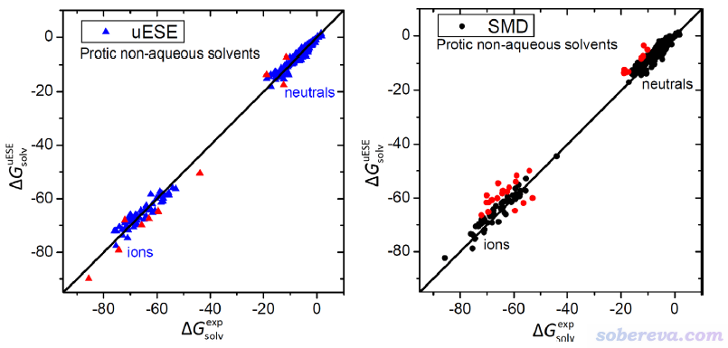
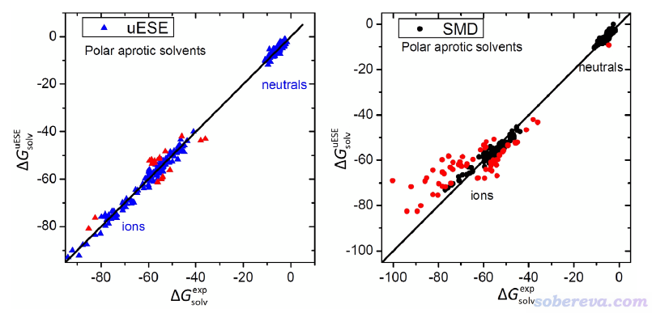

**比SMD算溶解自由能更好的溶剂模型uESE的使用**

Use of uESE, a solvent model that is better than SMD for calculating solvation free energy

文/Sobereva@[北京科音](http://www.keinsci.com) 2021-Apr-30

## 1 uESE溶剂模型简介

SMD是如今非常常用的溶剂模型，在《谈谈隐式溶剂模型下溶解自由能和体系自由能的计算》（<http://sobereva.com/327>）里笔者专门介绍过。在Gaussian程序中，SMD的极性部分等同于IEFPCM，而由于其非极性部分考虑较周到，因此溶解自由能计算精度较好。但是SMD算离子体系的溶解自由能误差远大于算中性体系的，通常需要用显式+隐式的杂化溶剂模型才能得到较好结果。

最近Vyboishchikov等人提出了uESE (universal Easy Solvation Energy Evaluation)溶剂模型，原文见J. Comput. Chem. (2021) DOI: 10.1002/jcc.26531。之前还有xESE溶剂模型，和uESE形式很相似，原文见Phys. Chem. Chem. Phys., 22, 14591 (2020)。uESE/xESE都像SMD一样考虑了溶质-溶剂相互作用的极性和非极性部分，但uESE/xESE和SMD有很大不同：  
(1)uESE/xESE的极性部分利用的是COSMO模型。通常COSMO是基于电子密度计算的，而是uESE/xESE的COSMO则是基于CM5原子电荷计算的；更具体来说，在求解表面显著电荷时利用使用CM5电荷计算溶质孔洞表面的静电势。  
(2)uESE/xESE模型并不纳入SCF迭代过程中，也不影响电子结构，不能计算带溶剂模型时的受力和Hessian，相当于是一个“后”溶剂模型。uESE/xESE仅适合基于CM5电荷算溶解自由能的目的。由于uESE/xESE中的参数是基于气相下B3LYP/def2-TZVP级别的结构和波函数计算的CM5原子电荷拟合的，所以自己用uESE/xESE的时候CM5电荷也得在这个级别下计算。  
(3)uESE/xESE包含对溶剂-溶质极性作用部分的经验校正项。  
(4)uESE/xESE对于不同类型溶剂使用不同的极性部分的校正项和非极性部分形式。溶剂分为四类：水，非水极性质子溶剂，极性非质子溶剂，非极性溶剂。  
(5)uESE/xESE拟合的经验参数中既有依赖于元素的，也有依赖于溶剂类型的，也有依赖于溶剂本身的。目前xESE只支持水，uESE支持约100种溶剂。极性部分校正项和非极性部分只有H,C,N,O,F,P,S,Cl,Br,I元素的参数（对于其它元素只能给出COSMO极性部分的结果）。而SMD不含依赖原子半径以外元素的参数。

uESE和xESE有什么存在意义？主要意义在于算溶解自由能从统计结果上比SMD更好，特别是对于离子体系。根据uESE原文的测试，溶解自由能计算精度（平均绝对误差，MAE）有下面的关系  
中性体系：xESE≈SM12>=uESE>=SMD  
阳离子体系：uESE>xESE>SMD>=SM12  
阴离子体系：uESE>xESE≈SMD12>>SMD  
即曰，算中性体系溶解自由能，用xESE会比SMD占一点优势。算阳离子用uESE比用SMD强得多。算阴离子更是绝对不能直接用SMD，不想用杂化溶剂模型的话至少也应当用uESE。根据测试，uESE算中性体系溶解自由能的MAE小于1 kcal/mol，算阴、阳离子溶解自由能的MAE差不多，都小于3 kcal/mol。而SMD算阴离子的MAE则达到8 kcal/mol左右。注：上面的SM12和SMD是同门的，但前者和uESE一样也是基于CM5原子电荷进行计算，不过极性部分利用的是广义Born方程形式。

下图左侧是uESE原文里算大量中性和离子在非水质子溶剂中的溶解自由能（纵坐标）与实验值（横坐标）的对比，右图是SMD算的情况，误差超过4 kcal/mol的用红色符号高亮。可见uESE算中性溶质的情况比SMD稍好，而计算离子的情况能好很多。

下图是计算在极性非质子溶剂中的溶解自由能的情况。可见此时SMD算离子的情况表现极差，特别是对于溶解自由能非常大的离子

需要注意的是以上都是统计数据，大家也不要指望算每个中性体系xESE都比SMD好、算每个离子体系uESE都一定比SMD好。笔者写此文的目的主要是提醒大家算离子体系的溶解自由能的时候，如果懒得用杂化溶剂模型，则至少要用uESE，切勿拿SMD凑合（除非有uESE不支持的元素）。

## 2 uESE和xESE程序的使用

uESE和xESE方法有同名的计算程序，可以在<http://iqcc.udg.edu/~vybo/ESE/>直接下载，Windows和Linux版可执行文件都提供了，不开源。这两个程序用的输入文件相同，uESE可以指定溶剂，而xESE只支持水溶剂。  
**2023-Sep-27注**：我发现此时以上链接已无法访问。笔者写此文时用的uESE和xESE程序可以在<http://sobereva.com/attach/593/uESE,xESE.zip>下载。

uESE和xESE都需要基于命令行使用。uESE在Windows下的使用格式是：uESE.exe [输入文件路径] -solvent [溶剂名]。可以用的溶剂见<https://github.com/vyboishchikov/ESE/blob/main/solvent-list.md>。

uESE/xESE的输入文件里需要提供各原子的元素在周期表里的序号、原子坐标，以及原子的CM5电荷。笔者开发的Multiwfn波函数分析程序（主页&免费下载：<http://sobereva.com/multiwfn>）直接就能计算CM5电荷。为了令用户能尽可能方便地产生uESE/xESE的输入文件，从2021-Apr-30更新的Multiwfn开始只要将settings.ini里的uESEinp参数设为1，则Multiwfn计算完CM5电荷后就会问你是否产生uESE/xESE的输入文件。使用uESE/xESE算溶解自由能用的输入文件若是Multiwfn产生的，**请注意在你发表的文章中提及，并按照Multiwfn启动时的提示恰当引用Multiwfn**。

Multiwfn计算CM5电荷需要提供含有波函数的信息作为输入文件，诸如.wfn/.wfx/.fch/.molden/.mwfn等等，产生方式见《详谈Multiwfn支持的输入文件类型、产生方法以及相互转换》（<http://sobereva.com/379>）。不了解Multiwfn的话参看《Multiwfn FAQ》（<http://sobereva.com/452>）。

## 3 使用uESE计算PhO-在乙腈中的溶解自由能实例

下面就通过一个例子演示uESE程序的使用，是PhO-（苯酚的羟基的质子解离掉后的阴离子）在乙腈中的溶解自由能计算。此例所有相关文件可以在<http://sobereva.com/attach/593/file.rar>下载。本例Gaussian使用G16 A.03版，Multiwfn是2021-Apr-30更新的3.8(dev)版，操作系统是Win 10 64bit。

首先用Gaussian对PhO-进行优化。根据uESE原文，应当用B3LYP/def2-TZVP在真空下进行。输入文件如下

%chk=C:\PhO-_optfreq.chk  
#p B3LYP/def2TZVP opt freq  
[空行]  
Title Card Required  
[空行]  
-1 1  
 C                  0.00000000    0.00000000   -1.80531390  
 C                  0.00000000   -1.20821014   -1.10754617  
 C                  0.00000000   -1.20820376    0.28716582  
 C                  0.00000000    0.00000000    0.98475086  
 C                 -0.00000000    1.20820376    0.28716582  
 C                 -0.00000000    1.20821014   -1.10754617  
 H                  0.00000000    0.00000000   -2.90492418  
 H                  0.00000000   -2.16044049   -1.65754504  
 H                  0.00000000   -2.16042940    0.83722286  
 H                 -0.00000000    2.16042940    0.83722286  
 H                 -0.00000000    2.16044049   -1.65754504  
 O                  0.00000000    0.00000000    2.41475076

计算完成后，检查输出文件确认没有虚频。然后用formchk将PhO-_optfreq.chk转换为PhO-_optfreq.fch。formchk的使用在《详谈Multiwfn支持的输入文件类型、产生方法以及相互转换》（<http://sobereva.com/379>）里说了。

将Multiwfn目录下的settings.ini里的uESEinp设为1，然后启动Multiwfn，载入PhO-_optfreq.fch，之后依次输入  
7  //布居分析与原子电荷计算  
16  //计算CM5电荷  
1  //使用内置的球对称化的自由原子密度  
[按回车]  //产生的uESE输入文件为当前目录下的PhO-_optfreq.inp  
然后就可以把Multiwfn窗口关了。

下载uESE的Windows版可执行文件uESE.exe到某处，把PhO-_optfreq.inp放到与此文件相同的目录下，然后按Win+R键，输入cmd进入命令行界面，通过cd命令进入此目录下（这种计算机基本常识不会的话自行Google），运行uESE PhO-_optfreq.inp -solvent acetonitrile。仅需一秒钟就能运行完，在输出信息中会看到  
 COSMO electrostatic energy =       -66.946 kcal/mol  
 Correction term =        12.393 kcal/mol  
 Total solvation free energy =       -54.554 kcal/mol

即曰溶解自由能是-54.554 kcal/mol。uESE/xESE给出的溶解前后都是1M浓度的溶解自由能。从SMD溶剂模型原文的补充材料里可以查到实验值是-55.1 kcal/mol（也是溶解前后都是1M的情况），可见此例uESE表现得极为理想，误差仅有0.55 kcal/mol，不过这很大程度上是运气好。

下面也用SMD模型算一下溶解自由能，做法在《谈谈隐式溶剂模型下溶解自由能和体系自由能的计算》（<http://sobereva.com/327>）里专门讲过。基于上面B3LYP/def2-TZVP气相下优化的结构，在M05-2X/6-31G*级别下算一次气相单点能和SMD模型表现的乙腈环境下的单点能，结果为  
# M052X/6-31G* scrf(SMD,solvent=acetonitrile)：-306.941786445 Hartree  
# M052X/6-31G*：-306.847792107 Hartree  
因此溶解自由能为627.51*(-306.941786445+306.847792107)=-58.98 kcal/mol。相对于实验的误差达到-3.9 kcal/mol，明显大于uESE的，这体现出了uESE的显著优势。

注意uESE模型在测试、拟合参数的时候对离子体系都是只考虑了带+1、-1电荷的离子。高价离子与溶剂相互作用显著强于一价离子，笔者估计用uESE肯定不会得到较好结果，必须用杂化溶剂模型。
