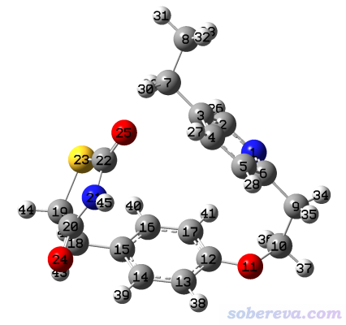
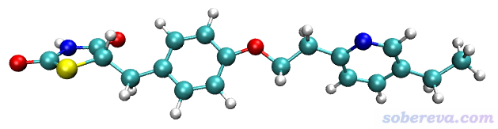
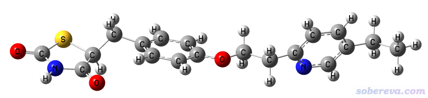
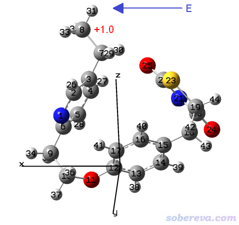
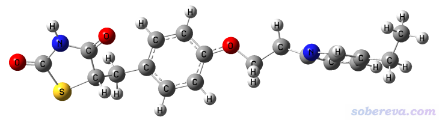
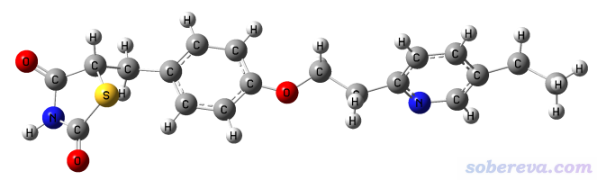
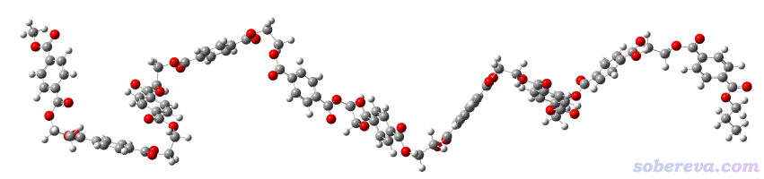
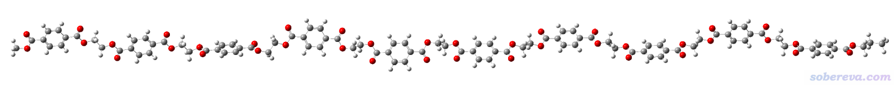
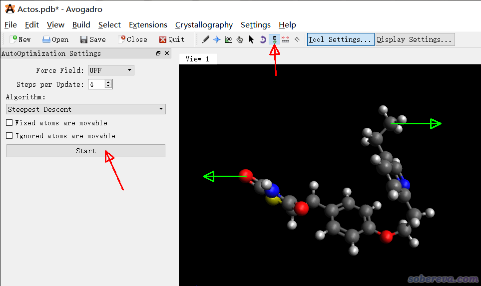

**利用Gaussian或ORCA程序把分子结构拉直的几种方法**

Several methods to straighten molecular structures using Gaussian or ORCA program

文/Sobereva@[北京科音](http://www.keinsci.com)

 First release: 2021-May-4   Last update: 2021-Jun-15

## 1 前言

有人问怎么把一个分子从已有的较为卷曲的构象转化成比较平直的构象。这有一些实际意义，比如通过genmixmem程序构造磷脂双层膜、用packmol程序构造表面活性剂的囊泡，都需要用户提供分子比较平直的构象的结构文件。一个非常简单、直观、效果又好的做法是使用SAMSON可视化程序里的twist工具，笔者在《生成混合组分的磷脂双层膜结构文件的工具genmixmem》（<http://sobereva.com/245>）里还提供了我录的一段操作视频。但可惜如今SAMSON程序免费版当中已经没有twist工具了，需要买收费版才行（虽然收费版也可以申请免费试用）。还有一个办法是在GaussView等程序里一个一个改二面角，但无疑这非常费时费力，特别是分子可旋转的键很多的时候。

在此文，笔者介绍如何利用Gaussian和ORCA量子化学程序以不同方式实现把分子从卷曲的结构拉直，里面用到的做法对于读者研究其它一些问题可能也会有启发。本文使用的例子是《将Confab或Frog2与Molclus联用对有机体系做构象搜索》（<http://bbs.keinsci.com/thread-20063-1-1.html>）中的例子，即Actos分子。通过Molclus程序（<http://www.keinsci.com/research/molclus.html>）搜索出的此体系的能量最低构象如下，我们后文将要把此结构拉直：

本文涉及的所有文件可以在<http://sobereva.com/attach/594/file.rar>下载，上面的结构是文件包里的Actos.xyz。Gaussian使用的是G16 B.01版，ORCA是4.2.1版。

## 2 通过ORCA拉直分子：给两个原子间加外力

笔者写过不少与ORCA的安装和使用有关的文章，参看<http://sobereva.com/category/ORCA/>，在**北京科音高级量子化学培训班**（<http://www.keinsci.com/KAQC>）里对ORCA有超级全面深入系统的讲授，故ORCA相关常识性问题这里就不再说了。在ORCA中优化时可以给两个原子在连线方向上加外力驱使它们远离，很适合用于拉直分子。对于上面图中展示的Actos分子，显然我们应当把最末端的两个重原子，即8和25号之间拉远。为此，写一个ORCA输入文件：

! AM1 opt nopop  
 %geom  
 POTENTIALS  
 { C 7 24 3.0 }  
 end  
 end  
 * xyz   0   1  
 [Actos.xyz里的坐标]  
  *

这里POTENTIALS下面花括号里的C代表constant force。注意原子序号是从0开始算的。3.0是把俩原子间拉远的力的大小，单位是nN。数值大小不是很重要，一般个位数大小就可以。数值太小的话拉不开，而太大的话会最终把一些化学键过度拉长、键角被过度拉大（不过键伸缩、键角弯曲相对于二面角扭转来说是很刚的，只要外力不是特别大这就不是明显问题）。这里用的AM1半经验方法是ORCA里能直接用的几乎最便宜的方法（虽然ORCA也支持力场计算，但还得搞参数，这里不考虑），注意此方法不支持并行计算。如果嫌AM1太low，也可以用稍微好一点的HF-3c（Hartree-Fock结合额外校正项），对不太大的体系也非常便宜。

用ORCA运行上面的输入文件，三分钟就算完了，最终得到的结构如下（即file文件包里ORCA目录下的Actos.xyz），可见完美地实现了我们的目的，分子被拉得很直

file文件包里的Actos_trj.xyz是优化轨迹，感兴趣者可以将之拖到VMD程序（<http://www.ks.uiuc.edu/Research/vmd/>）里看看优化过程。顺带一提，考察加外力对化学体系的影响专门有人做过大量研究，参见Chem. Rev., 112, 5412 (2012)、Angew. Chem. Int. Ed., 58, 5232 (2019)。

## 3 通过Gaussian拉直分子

在Gaussian程序中不支持直接给原子加外力，但有其它的方法也可以实现把分子拉直，将在下面几节介绍。

### 3.1 方法1：柔性扫描

Gaussian中做柔性扫描在《详谈使用Gaussian做势能面扫描》（<http://sobereva.com/474>）里笔者详细介绍过。显然，做两端的两个原子距离逐渐拉长的柔性扫描最终就可以得到被拉得平直的结构。写一个这种任务的Gaussian输入文件，如下所示

%nprocs=1  
 #T UFF opt(loose,nomicro,modredundant)

Generated by Multiwfn

  0  1  
 [Actos.xyz里的坐标]  
    
 8 25 S 50 0.5

这里有几个需要注意的地方：  
(1)为了耗时尽可能低，这里使用了Gaussian支持的最便宜的方法，即分子力场。这里用的是较粗糙但支持元素最广、用着最省事（不需要指定原子类型）的UFF力场。由于本例只需要得到一个较为平直的构象，对质量什么没要求，所以UFF就够了。  
(2)柔性扫描每一步相当于一次限制性优化，为了节约时间，用了loose收敛限降低每一步扫描的耗时。  
(3)opt里必须写nomicro。因为分子力场的优化在Gaussian里有专用的代码，不受modredundant设置的控制。而加了nomicro后，就会用通用的几何优化代码，虽然远没有分子力场专用的优化代码快，但此时可以设置柔性扫描。  
(4)分子力场计算时，至少对于这个体系，并行计算会令耗时不降反升，所以这里靠%nprocs=1刻意要求不用并行计算。  
(5)扫描的步长太小的话把分子拉直需要的步数太多，显然不行，而步长太大则容易导致中途报错（此时还没充分拉直），根据我的经验步长设0.5埃左右比较合适。由于事先往往不好估计拉直时两个原子相距多远，所以可以把扫描步数设得比较大（比如本例设50步），当分子已经被拉得很直后，继续扫下一步时程序通常会报错，此时用GaussView载入输出文件查看扫描轨迹，若最后一帧结构就是想要的平直的结构的话就取最后一帧结构即可。如果步数一开始设小了，导致最后没有完全拉直也没关系，拿最后一步的结构继续做拉长的扫描即可。  
(6)当前体系是之前我用DFT优化过的结构，已经很合理了，所以没有明确靠geom=connectivity指定原子间连接关系，而直接让Gaussian根据当前结构猜连接关系并用于力场计算。如果初始结构没有优化过，最好让GaussView保存出带有恰当连接关系的输入文件以免自动判断的连接关系有误。

使用Gaussian对上面的输入文件进行计算，算了1分钟左右扫描到第31步后报错，报错前最后一步结构如下所示，可见是我们想要的平直的结构。

### 3.2 方法2：利用外电场加外力

Gaussian里可以加外电场，外电场会给带电粒子施加额外的力，在《一篇文章深入揭示外电场对18碳环的超强调控作用》（<http://sobereva.com/570>）里介绍的笔者的文章中有很多介绍和讨论。因此，可以在UFF力场计算时，把25号原子坐标冻结住，而让8号原子带+1.0原子电荷，然后按照下图所示向X轴正方向加足够强度的电场，这样8号原子就会受电场力往X正方向运动，从而实现拉直分子的目的。

此例输入文件如下

%nprocs=1  
 # UFF opt(loose,nomicro,modredundant) field=x-300 nosymm

Generated by Multiwfn

  0  1  
 N      2.96734200   -1.21688000    2.24577900  
 C      2.32051000   -1.62618600    3.34057500  
 C      1.63462400   -2.84168400    3.45382100  
 C      1.64984500   -3.67567100    2.33272400  
 C      2.32098400   -3.26708600    1.18384000  
 C      2.96534100   -2.02795600    1.17397000  
 C      0.96378000   -3.24289700    4.74461900  
 C--1.0      1.95041300   -3.88295500    5.73536500  
 C      3.62426800   -1.48867000   -0.07067000  
 [略]  
    
 25 F

此例C--1.0代表对这个8号原子不手动指定原子类型（两个横杠之间没写内容），原子电荷为+1.0。没设原子电荷的原子的原子电荷默认为0。Gaussian里电场方向和习俗相反，因此field=x后面是负号。电场强度用300（0.03 a.u.）一般就可以，如果发现最终结果怪异，如有些键被拉得太长，结构都扭曲了，应当适当减小电场以减小外力；如果分子拉得还不够直，可以稍微增大电场来加大外力。nosymm必须写，要不然结构被自动弄到标准朝向下后外电场相对于分子的方向就和期望不符了，关于nosymm更多信息见《谈谈Gaussian中的对称性与nosymm关键词的使用》（<http://sobereva.com/297>）。nomicro还是要写，要不然冻结设定不生效，其电场设置也不会对优化起作用。

用Gaussian计算上面的输入文件，68步后收敛，耗时才十几秒。最终结构如下，可见是我们想要的

### 3.3 方法3：令两端的原子彼此间受到静电斥力

这个做法超级简单，而且超级快速（直接用分子力场的专用优化代码），比前述两种方法通常更值得推荐。原理很简单，即给两端的原子都设数值较大的相同符号的原子电荷，二者通过强烈的静电斥力自然就会彼此远离，从而把分子拉直。输入文件如下，只有8号和25号原子设了原子电荷，都设为了+10.0。设多大合适应当看实际情况，比如如果分子特别长，那么原子电荷应设大一些，要不然静电斥力不够强。此例输入文件如下

%nprocs=1  
 # UFF opt

Generated by Multiwfn

  0  1  
 [略]  
 C      0.96378000   -3.24289700    4.74461900  
 C--10.0      1.95041300   -3.88295500    5.73536500  
 C      3.62426800   -1.48867000   -0.07067000  
 [略]  
 S     -2.51218200   -3.05838400    3.26014600  
 O--10.0     -4.37962400   -3.91727700   -0.05061200  
 O     -1.13156500   -5.32519500    2.86775900  
 [略]

用Gaussian计算，仅花了一秒钟就算完了！结果如下所示，非常平直，特别理想！

网友还给我发过一个含有200多个原子的弯曲的很长的分子，如下所示

用这一节的做法也很顺利地优化成了平直的构象，如下所示。计算仅仅花了5秒钟。

## 4 总结

本文介绍了笔者想到的四种把分子从弯曲结构拉成平直的方法，思路各有不同。实际当中会遇上各种特殊情况，比如可能需要同时拉直两条链（如磷脂的两条尾巴），应当在理解这些方法思想的基础上根据实际情况恰当选择、灵活运用。

本文的做法适合一般中、小分子体系。如果是大分子体系，比如蛋白质，比较适合GROMACS等专门的基于分子力场计算的程序。在GROMACS里面可以用pull相关的选项做拉伸动力学（见比如《在Gromacs中模拟金纳米线拉伸过程（含视频）》<http://sobereva.com/153>），也可以将体系一端的原子定义为冻结组（freezegrps）而另一端定义为受常外力的组（acc-grps，结合accelerate设置）从而拉开。

值得一提的是，本文介绍的虽然是把分子拉直的方法，但实际上也可以将这些方法应用到研究环状、笼状、簇状等化学体系对外力造成的拉伸和压缩问题的研究上。

## 补充：使用Avogadro程序拉直分子的做法

通过Avogadro可视化程序也可以拉直分子，此程序可以在<http://avogadro.cc>免费下载。在此程序中拉直分子比较直观，直接按住鼠标拖拽即可，这和SAMSON可视化程序里的twist工具非常类似。启动Avogadro后，先载入pdb之类的结构文件，点击下图上方箭头所指的按钮，然后再点击下图左侧箭头所指的Start按钮，之后按住鼠标左键拖动特定原子即可，按照下图的绿色箭头分别把两端的原子往两头拉就能最终拉直。

Avogadro的这个功能实际上是持续通过指定的力场优化体系几何结构，因此当你拖动某个原子时，其它原子的位置会自发地弛豫来降低能量，因此键长、键角、二面角始终能保持比较合理的状态。但我发现Avogadro的这个功能拉直小分子不错，而拉直第3节最后那个特别长的聚合物则很难实现，而且特别卡顿。
