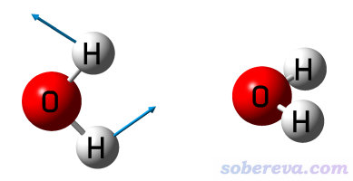
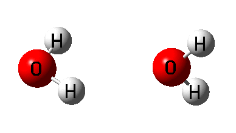
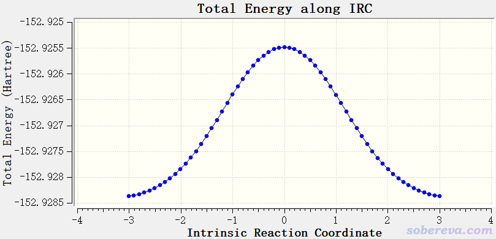
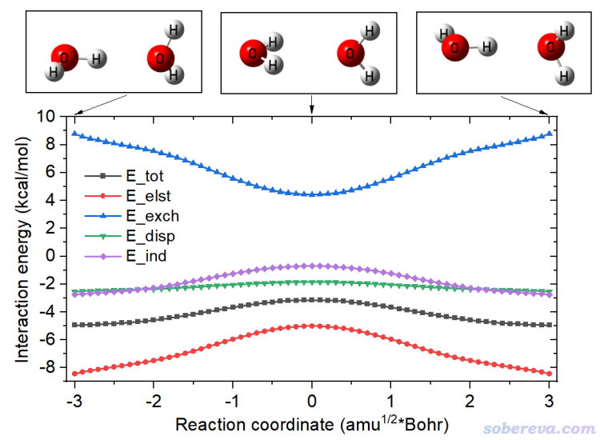

PS：此文介绍的工具主要是给一个外国合作者写的，所以文章写成了英文。

**对Gaussian计算的IRC轨迹上每个点用PSI4做SAPT分析的辅助工具**  
A tool for performing SAPT analysis via PSI4 for each point on the IRC trajectory calculated by Gaussian

Sobereva@[北京科音](http://www.keinsci.com)  2021-May-10

## 1 Preface

SAPT is an important and very popular energy decomposition method, and it has been well supported in the freely available PSI4 code. I have written two blog articles about SAPT analysis:  
"Using PSI4 to perform SAPT energy decomposition analysis" (<http://sobereva.com/526>)  
"A simple way to investigate the variation of SAPT energy decomposition terms with respect to molecular dimer separation" (<http://sobereva.com/469>)

Sometimes it is useful to perform SAPT analysis for each point of intrinsic reaction coordinate (IRC), so that variation of physical components of interaction energy can be studied to better shed light on the nature of the process. In order to facilitate this investigation, a utility named IRC_SAPT is developed by me, which will be described below.

## 2 IRC_SAPT code

IRC_SAPT can be downloaded here: <http://sobereva.com/soft/IRC_SAPT.zip>. The files with and without suffix are executable file of Windows and Linux platforms, respectively.

IRC_SAPT is able to conveniently convert output file of IRC task of Gaussian to SAPT input file for every IRC point.

Before starting IRC_SAPT, user should prepare a file named "SAPT_template.inp" in current folder, which is a template PSI4 SAPT file that will utilized by IRC_SAPT. SAPT_template.inp should be a standard SAPT input file, but the net charge, spin multiplicity and coordinate parts of the two fragments of SAPT analysis should be represented by [monomer1] and [monomer2]. See example in Section 3 for detail.

After booting up IRC_SAPT, user will be asked to input the path of Gaussian IRC output file, then input the number of forward and reverse IRC points to consider, and then input net charge, spin multiplicity and atomic indices for fragments 1 and 2, respectively. Finally, a batch of SAPT input files are generated in current folder, geometry in each one corresponds to an IRC point.

It is important to note that SAPT is in principle not suitable for decomposing the interaction between two fragments if their are chemical bond interactions among them. SAPT is best suited for decomposing weak interactions.

## 3 Example: Geometry transition of configuration of water dimer

This section illustrates how to use IRC_SAPT. The IRC corresponding to geometry transition of two configurations of water dimer is taken as example. It is worth to note that geometry and electronic structures of water dimer has been comprehensively investigated in J. Mol. Model., 26, 20 (2020) with help of Multiwfn code (<http://sobereva.com/multiwfn>), you may look at this paper if you have interest in characteristics of water dimer.

All files involved in this example can be downloaded here: <http://sobereva.com/attach/595/file.zip>  
The programs used in the calculations are Gaussian 16 A.03 and PSI4 1.3.2.

### 3.1 Calculate IRC trajectory

First, we optimize a transition state (TS) and perform frequency analysis for water dimer by Gaussian via keywords "# B3LYP/6-311+G** em=GD3BJ opt(calcfc,TS,noeigen) freq". The geometry and the only imaginary frequency mode is shown below

Then we generate IRC trajectory based on the optimized TS structure via these keywords: "# B3LYP/6-311+G** em=GD3BJ IRC(calcfc,recalc=3,LQA,maxpoints=50)". The IRC animation is shown below

The corresponding energy variation curve is

### 3.2 Generate PSI4 input files for IRC trajectory

Download IRC_SAPT.zip and decompress it. In the folder, you can find SAPT_template.inp, whose content is

memory 20000 MB

molecule dimer {  
 [monomer1]  
 --  
 [monomer2]  
 }  
 [RxCoord]

set {  
 basis aug-cc-pVTZ  
 scf_type DF  
 freeze_core True  
 }

energy('sapt2+(3)dmp2')  
 E_disp = variable('SAPT DISP ENERGY')  * psi_hartree2kcalmol  
 E_elst = variable('SAPT ELST ENERGY')  * psi_hartree2kcalmol  
 E_exch = variable('SAPT EXCH ENERGY')  * psi_hartree2kcalmol  
 E_ind  = variable('SAPT IND ENERGY')   * psi_hartree2kcalmol  
 E_tot  = variable('SAPT TOTAL ENERGY') * psi_hartree2kcalmol

psi4.print_out("\n")  
 psi4.print_out(" Summary of SAPT result (kcal/mol)\n")  
 psi4.print_out("   RxCoord      E_tot     E_elst     E_exch     E_disp      E_ind\n")  
 psi4.print_out("%10.6f %10.3f %10.3f %10.3f %10.3f %10.3f\n" % (rxcoord,E_tot,E_elst,E_exch,E_disp,E_ind))

As can be seen, the calculation level in this template file is SAPT2+(3)δMP2/aug-cc-pVTZ, which is shown to be able to accurately represent H-bond interaction in my work J. Comput. Chem., 40, 2868 (2019) DOI: 10.1002/jcc.26068. The "psi4.print_out" directives ask PSI4 to print reaction coordinate, total interaction energy and various components at the end of the task. The [RxCoord] line will be automatically replaced by IRC_SAPT with reaction coordinate. You can properly modify the calculation level and memory setting, other content should not be modified without special reason.

Now boot up IRC_SAPT and input  
IRC.out  //Actual path of Gaussian IRC output flie  
30,30  //IRC_SAPT detected that there are 30 forward and 30 reverse IRC points. We want to perform SAPT analysis for all points here  
0 1 //Net charge and spin multiplicity of fragment 1  
1-3  //Atomic indices of fragment 1, namely the first water molecule  
0 1 //Net charge and spin multiplicity of fragment 2  
4-6  //Atomic indices of fragment 2, namely the second water molecule

Now 61 PSI4 input files have been generated in current folder, the name ranges from 0001.inp (the first IRC point) to 0061.inp (the last IRC point), and as shown on prompt, 0031.inp corresponds to the TS geometry.

Move the generated SAPT input files and the psi4all.sh in IRC_SAPT folder to a new folder, then execute the psi4all.sh, then this script will invoke PSI4 in current machine to run all SAPT input files, the yielded output files have identical name as input files but with .out suffix. Note that psi4all.sh uses 36 threads to carry out PSI4 calculation, do not forget to modify it properly.

After all calculations have completed, copy the extract.sh in IRC_SAPT folder to the current folder and run it. This script will extract proper data from all .out file in current folder and collectively export them as energy.txt in current folder. The content is

 -3.001580     -4.952     -8.429      8.778     -2.541     -2.760  
  -2.903710     -4.940     -8.301      8.570     -2.507     -2.700  
  -2.803660     -4.920     -8.205      8.430     -2.486     -2.659  
 [ignored...]  
   2.803670     -4.920     -8.206      8.431     -2.486     -2.659  
   2.903720     -4.940     -8.302      8.571     -2.508     -2.701  
   3.001590     -4.952     -8.431      8.780     -2.541     -2.760

The meaning of each column is:  
Column 1: Reaction coordinate, in sqrt(amu)*Bohr  
Column 2: E_tot  
Column 3: E_elst  
Column 4: E_exch  
Column 5: E_disp  
Column 6: E_ind  
All energies are in kcal/mol.

### 3.3 Plot result

Finally, we use such as Origin program to plot the data. Import energy.txt into Origin and draw line+symbol map, using the first column as X-axis data, and other columns as Y-axis data, then properly modify plotting settings, the following map will be obtained.

From above map, it can be seen that the electrostatic attraction plays dominant role for stablizing the minimum configuration with respect to TS configuration, and induction effect also has some sort of contribution. Dispersion interaction is never as sensitive to dimer configuration as electrostatic and induction effects. Exchange repulsion effect largely cancels the stabilization effect of electrostatic and induction effects.
