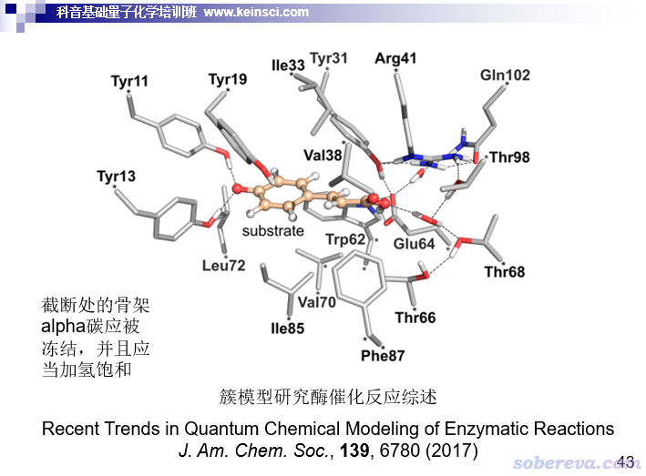
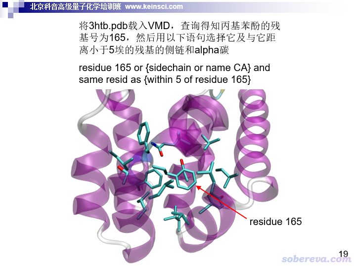
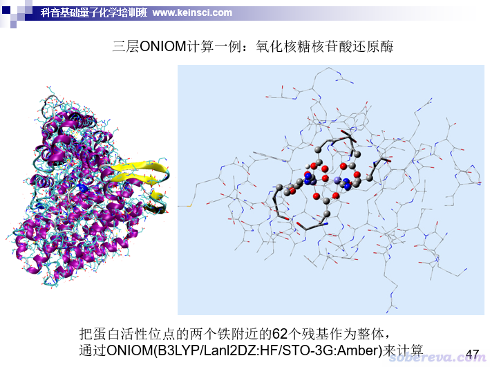

**要善用簇模型，不要盲目用ONIOM算蛋白质-小分子相互作用问题**

Make good use of cluster models and do not blindly use ONIOM to study protein-small molecule interaction problems

文/Sobereva@[北京科音](http://www.keinsci.com)  2021-May-22

初学者乱用、滥用Morokuma当年提出的ONIOM方法是一个长久以来就有的问题，我在网上答疑时经常强调初学者不要老想着用ONIOM。我主张ONIOM能不用就不用，因为麻烦事和细节问题太多，尤其是许多初学者连基本的计算都做不利落，还用ONIOM纯粹是自讨苦吃、自找麻烦。这两天在思想家公社QQ群答疑时连着碰到两个对量子化学计算一知半解的人问ONIOM的事，令我再次感到有的初学者但凡听说过点ONIOM的东西，若他们的研究涉及到酶催化、蛋白质-配体相互作用之类的问题，就会言必曰ONIOM。他们对ONIOM的实用价值和使用的必要性的认识真是有着极大的误区。在没必要用ONIOM的时候非要用，往往会导致初学者穷折腾、白浪费大量时间精力，最终还可能结果不理想，甚至被误导。笔者在此实在忍不住写个小文发表一下我对于初学者用ONIOM算蛋白-小分子体系的个人观点。此文主要是对初学者来说的，如果你用ONIOM都已经经验丰富，那就没必要看此文了。本文并不去详细具体讲ONIOM的原理和在Gaussian中的使用，这部分内容我在北京科音中级量子化学培训班（<http://www.keinsci.com/workshop/KBQC_content.html>）里会用100多页ppt专门做全面、系统的讲解并配以实例，欢迎参加。

简单来说，ONIOM是把两个，甚至三个不同的计算级别组合到一起的一种普适的方法，此文主要只涉及前种情况。比如ONIOM(QM:MM)就是把量子化学方法（QM）和分子力学（MM）结合起来，这也被叫做IMOMM。这种计算常被用于研究蛋白质与小分子的相互作用上，其中把需要较好精度描述的部分，或者普通分子力场描述不了的涉及成键断键的区域，用相对昂贵的量子化学方法描述。这部分叫做high layer (HL)，一般包括小分子以及与之近邻的氨基酸残基。而与小分子距离更远的相对来说不重要的区域，则使用耗时比QM低几个数量级的MM来描述，这部分叫做low layer (LL)。HL和LL的并集就是整个体系。注意ONIOM(QM:MM)和常说的QM/MM并不相同，一个关键区别在于QM/MM相当于把QM和MM分别描述的两块区域以恰当的方式拼接起来，因此MM计算的时候不会涉及到含有小分子的high layer部分。而ONIOM(QM:MM)能量的计算方式是E(QM,HL)+E(MM,整体)-E(MM,HL)，因此需要算三次能量，可见也涉及到通过MM算配体部分（因为配体在HL里）。

ONIOM的关键意义在于可以让算不动的体系算得动。比如整个蛋白酶可能含有几千个原子，用当下极好的机子，靠一般的量子化学程序以常规方式（不牵扯诸如分块求解），在常用的DFT方法结合像样基组的级别下算单点都算不动。而用ONIOM的话，可以把尺寸有限的最关键区域取为high layer用DFT描述，而其余部分靠极度廉价的MM描述，显然这样就算得动了。

看似ONIOM很美好，似乎不用就亏了似的，而我却对初学者主张能不用ONIOM就不用ONIOM，自然是因为其弊端太多了，举几个相对来说明显的问题：  
(1)需要补力场参数：算蛋白-小分子相互作用问题时，ONIOM用得较多的是ONIOM(QM:MM)形式，由于牵扯到力场计算，往往就必须补力场参数，这是特别麻烦、劳神的事情。由于涉及到蛋白质，通常力场用的是Gaussian内置的AMBER力场，然而AMBER力场局限性很大，只适合生物分子以及非常普通的有机分子，且支持的元素很有限，如果体系里有个过渡金属、硼之类不支持的元素，补参数那可就极为折腾、痛苦了。而且AMBER力场直接包含的成键项参数也只有成键方式很常见的情况，而算杂七杂八有机配体小分子的时候经常会提示缺bond、angle、dihedral等参数没法跑，于是你还得借助比如AmberTools里的Antechamber或者其它什么工具试图从GAFF等力场里弄来参数，有的时候还得靠Google搜参数、想办法借用参数等，甚至有时必须自己拟合参数，真是又花时间，又需要经验。初学者往往缺乏分子模拟方面与力场有关的知识，很可能补参数的时候把函数形式弄错了、把单位弄错了之类犯一些低级错误，导致计算用了错误的参数得到不合理的结果。初学者还很容易在输入文件里自定义力场参数的地方格式写不对，反反复复来来回回跟报错作斗争又耽误大量时间。Gaussian官方的exploring那本书第3版里有ONIOM(QM:MM)的一个例子，就那么区区一个例子，在准备工作方面就花了多达好几十页讲，正体现出ONIOM的麻烦程度有多高。初学者要是早知道同样的问题其实靠簇模型就能容易地可靠地研究，估计早没耐性折腾ONIOM了。  
(2)需要设置原子电荷：Gaussian里的分子力场通过原子电荷来计算原子间静电相互作用，所以做ONIOM(QM:MM)计算必须给原子设置原子电荷，而这也是麻烦事。对于蛋白质中的标准残基，GaussView保存ONIOM输入文件的时候直接就会赋予AMBER力场分子库里预置的原子电荷，但是碰上非标准残基，就得自己额外算原子电荷才行（比如构造模型体系，然后在Multiwfn里恰当施加约束算RESP电荷，见<http://sobereva.com/441>）。顺带一提，有人以为在力场名后头写个=QEq让Gaussian自动算QEq原子电荷就完事了，并不麻烦，这其实是大错特错，因为这种电荷对静电相互作用描述极其垃圾，看《原子电荷计算方法的对比》（<http://www.whxb.pku.edu.cn/CN/abstract/abstract27818.shtml>）里面关于静电势重现性的讨论，另外在此文也着重说了：《基于背景电荷计算分子在晶体环境中的吸收光谱》（<http://sobereva.com/579>）。  
(3)能用的理论方法有限：支持ONIOM的程序很少，截止到撰文时只有Gaussian、Q-Chem（仅支持力学嵌入）、MRCC（只支持QM和QM组合、力学嵌入）和ADF支持。因此诸如想在ORCA程序里开RIJCOSX做ωB97M-V泛函的ONIOM计算都无法直接实现，而这是非常有用的计算级别。  
(4)计算控制不灵活：Gaussian里用ONIOM(QM:MM)的时候一些常规关键词都不再兼容，比如opt里的柔性扫描设置、帮助收敛的许多设置等等，这是因为MM部分的优化默认用专门的代码。虽然opt里加上nomicro后可以用常规的opt选项来控制优化和柔性扫描，但是速度比默认情况慢得多。  
(5)几何优化收敛问题：用ONIOM(QM:MM)的时候比起常规的计算几何优化往往更难收敛。  
(6)用隐式溶剂模型时慢：Gaussian里用ONIOM(QM:MM)的时候一旦开启了隐式溶剂模型，速度会非常慢，因为原子数非常多的MM部分也要在溶剂模型计算时予以考虑，所以这部分耗时就不再是普通力场计算的耗时级别了。

由于上述问题，ONIOM远没有缺乏实践经验的一些初学者们想象的好用。

那么，不用ONIOM的话怎么算蛋白质-小分子相互作用类型的问题呢？答案是：簇模型（cluster model）。簇模型简单来说就是把原本很大或者周期性的体系的关键部分挖出来当做一个孤立体系进行计算。之前笔者还写过《使用量子化学程序基于簇模型计算金属表面吸附问题》（<http://sobereva.com/540>），也是簇模型的典型应用。其实簇模型算蛋白质-小分子作用差不多就等于把ONIOM的high layer拿出来单独做量化计算，但是需要自己手动对边界进行处理，如截断化学键的地方通常需加氢进行饱和避免存在悬键。并且计算的时候要把边界的非氢原子冻结，避免几何优化的时候截出来的簇严重坍塌、变形，失去在完整体系中的形态。

从已有的蛋白质-小分子复合物中挖团簇可以用VMD程序靠选择语句把距离小分子空间距离较近的一大片都保存成结构文件，需要用到比如same resid as {within 8 of resname MOL}的选择方式，参见《VMD里原子选择语句的语法和例子》（<http://sobereva.com/504>）。然后，再用GaussView打开VMD保存出来的粗略结构人工做进一步处理，比如恰当地加氢（注意恰当考虑质子化状态），删除除了alpha碳以外的蛋白质骨架原子（但并非总是要这样做，应根据实际情况随机应变，如骨架原子和小分子有明显作用时就不能删除），根据化学直觉恰当删除一些不是必须保留的、和分子相互作用不密切的残基来减少总原子数等等。如果你有个较好的双路服务器，把原子数控制到三百个以内，用普通泛函结合中等大小基组做优化、找过渡态什么的就都能算得动了。模型构建好后，就可以用Gaussian等量子化学程序照常计算了，除了要冻结边界原子外和计算普通体系无异，Gaussian里冻结原子的方式在此文说了：《在Gaussian中做限制性优化的方法》（<http://sobereva.com/404>）。当然了，做耗时较高的DFT优化之前，可以先用比如Gaussian支持的PM6-D3，或者结合xtb程序在GFN-xTB级别做预优化，参见《将Gaussian与Grimme的xtb程序联用搜索过渡态、产生IRC、做振动分析》（<http://sobereva.com/421>）。

为了让大家对簇模型有一个直观的印象，这里放我培训班里的一页ppt

另一页ppt，体现了VMD里如何恰当选取

另外，为了节约簇模型的计算时间，建议把距离小分子相对较远的蛋白质原子用较小的基组。很不重要、与相互作用区域或反应位点很远的原子甚至用3-21G这种垃圾基组都可以接受。这即是使用混合基组，见《详解Gaussian中混合基组、自定义基组和赝势基组的输入》（<http://sobereva.com/60>）。

簇模型计算用的结构和ONIOM的high layer的选取标准差不多。取多大是个重要问题，取大了算不动，取小了可能导致一些不可忽略的残基没考虑，这就必须结合实际计算条件、体系特点，根据理论化学直觉考量，没经验的话可以多参考一些文献里的模型，像上面ppt里的簇就比较合适，明显可见与小分子相互作用的残基都被考虑了，非常稳妥。如果担心考虑的残基不够充分，又不想让计算量明显更大而扩大体系，还是按前面说的，一定要善用混合基组来节约时间，恰当用混合基组就可以在同样的计算量下使用更大的簇、令结果更稳妥、减少在模型构建时候的纠结。

顺带一提，以前看到有初学者居然用ONIOM来试图实现不重要的区域用小基组，比如ONIOM(B3LYP/6-31G*:B3LYP/3-21G)，这纯粹就是胡搞瞎搞。这么做并不比用混合基组耗时低，而且会令结果精度更低（ONIOM分层的做法绝不是没有代价的，这相当于在层间相互作用描述上引入了近似，尤其是对于需要截断化学键的情况来说。好好了解一下ONIOM的原理、连接原子是怎么回事自然就清楚）。

算蛋白质-小分子作用问题，凡是用簇模型就很适合的情况，我总是建议用簇模型非ONIOM，因为簇模型没有前述ONIOM存在的弊端，用着省心。相比ONIOM(QM:MM)，簇模型的好处很明显：不需要麻烦地补任何力场参数，不涉及计算原子电荷，计算时候和计算普通体系没有任何差异（各种控制计算的关键词都能照常用、各种任务都能照常做），任何量子化学程序都能算簇模型，用隐式溶剂模型也不至于令耗时暴增。

也要强调的是，ONIOM相比簇模型，绝对不是没有任何用处。需要用ONIOM而不适合簇模型的情况有二  
(1)与小分子有密切作用的残基太多（比如小分子较大的情况就很常见），而且在保证结果合理的前提下把模型简化到极限、也考虑恰当用混合基组来节约时间，但还是算不动，那这时候就得靠ONIOM了，可以把一些相对次要但又不能完全舍弃的残基通过MM来描述。  
(2)研究的过程（与小分子反应、结合等）可能引起蛋白质较大范围区域结构的不可忽视的变化，这个时候显然就不能单纯用簇模型只考虑与小分子近邻的残基而且还把其骨架原子冻住了，而必须得通过力场把其它部分的蛋白质残基也都明确表现出来。

随着计算能力的提升，实际上ONIOM的用处是越来越小的。早年间，在DFT普遍也就算得动区区几十个原子的“贫穷”的时代，显然极难构造出能用的簇模型来合理描述蛋白质-小分子反应区域或结合位点，所以那个时代算这类问题ONIOM算是标准方法，不得不用。而如今，一万多块钱买个廉价服务器（如几十核的双路XEON E5 v3），拿DFT算二、三百个原子都没太大压力，大多数蛋白质-小分子作用的情况靠合理构建的簇模型都算得动，还非要屈辱地用ONIOM作甚，这不是自虐么？随着计算能力进一步发展，以后DFT算>500个原子早晚也会没有压力，到时候由于上面(1)的情况而必须用ONIOM的情况基本就完全消失了。

再顺带一提，很多早年间的ONIOM计算在现在来看基本就属于搞笑了。比如下面的ppt给了一个老文章里的例子

这个例子单纯是为了展示3层ONIOM是怎么回事，如今再用这么low的量化级别做计算，文章铁定发不出去。而且此例分成三层在如今来看没有任何意义，属于瞎折腾，因为现在直接用DFT结合中等基组别说把此例的high layer和medium layer放一起算都能算得飞快，甚至再把与medium layer相邻的一圈lower layer的残基都纳入然后作为簇模型来算也没有压力。所以，现在做蛋白质-小分子计算的新人，不要净参考一些老文章，那时候ONIOM的意义、ONIOM的使用方式对如今来说大多没有什么参考意义，盲目效仿只会自取其辱。PS：上例也是我强烈不推荐用ONIOM的情况，因为里面有铁，补参数可费劲了！
