**使用IRI方法图形化考察化学体系中的化学键和弱相互作用**

Using IRI method to graphically study chemical bonds and weak interactions in chemical systems

文/Sobereva@[北京科音](http://www.keinsci.com) 

First release: 2021-May-31  Last update: 2024-Mar-29

## 1 前言

原子间的相互作用在化学体系中无处不在。把相互作用图形化展现无疑对考察化学问题非常有益，可以令化学家快速直观了解体系中什么位置有什么样的相互作用。目前图形化展现相互作用的方法不少，有很多都已经非常流行，在波函数分析程序Multiwfn（<http://sobereva.com/multiwfn>）里全都支持，这里先简单回顾一下。Multiwfn中支持的RDG方法（也称NCI方法）可以通过着色等值面图直观地展现弱相互作用，见这些博文以及其中引用的其它相关博文：《使用Multiwfn图形化研究弱相互作用》（<http://sobereva.com/68>）、《使用Multiwfn结合CP2K通过NCI和IGM方法图形化考察固体和表面的弱相互作用》（<http://sobereva.com/588>）、《使用Multiwfn做aNCI分析图形化考察动态过程中的蛋白-配体间的相互作用》（<http://sobereva.com/591>）。Multiwfn支持的Hirshfeld surface分析可以通过着色的表面展现分子间相互作用位置和强度，见Multiwfn手册4.12.5和4.12.6节的例子以及演示视频《使用Multiwfn结合VMD绘制Hirshfeld surface图分析分子晶体中的弱相互作用》（<https://www.bilibili.com/video/av35738671/>）。也有一些方法可以图形化展现共价作用，例如Multiwfn支持的ELF、LOL、SCI、价层电子密度、电子密度拉普拉斯函数、变形密度等，相关博文和文章汇总见《ELF综述和重要文献小合集（<http://bbs.keinsci.com/thread-2100-1-1.html>）、《使用Multiwfn作电子密度差图》（<http://sobereva.com/113>）、《通过价层电子密度分析展现分子电子结构》（<http://www.whxb.pku.edu.cn/EN/10.3866/PKU.WHXB20170925>）。为了将弱相互作用和共价作用共同展现，有人提出将RDG和ELF联用，见比如此文的例子：《通过键级曲线和ELF/LOL/RDG等值面动画研究化学反应过程》（<http://sobereva.com/200>）。此外，Multiwfn支持的DORI函数可以通过其等值面直接将弱相互作用和化学键作用一起展现，见《使用DORI函数同时考察共价和非共价相互作用》（<http://sobereva.com/367>）。Multiwfn支持的IGMH方法也可以将化学键和弱相互作用都予以展现，但对不同强度的相互作用需要用不同等值面数值才能展现得比较鲜明，见《使用Multiwfn做IGMH分析非常清晰直观地展现化学体系中的相互作用》（<http://sobereva.com/621>）。另外Multiwfn还支持其它一些图形化的分析手段，如流行的atoms-in-molecules (AIM)、定域化轨道、键级密度（BOD）等，见《Multiwfn支持的分析化学键的方法一览》（<http://sobereva.com/471>）和《Multiwfn支持的弱相互作用的分析方法概览》（<http://sobereva.com/252>）中的相关信息。

虽然如上所示，已有的图形化展现相互作用的方法已经较为丰富，但之前始终没有一个能够很好地同时展现各种类型相互作用的方法。虽然DORI看似能做到，但其函数不仅定义很复杂（因此计算耗时也高、编程实现也不便），图像效果还特别差，等值面看着很杂乱。IGMH虽然也能展现各类相互作用，但没法在一张图里（即同一个等值面数值下）同时把不同强度的相互作用都展现清楚。RDG与ELF联用虽然图像效果还不错，但由于需要同时考虑两个函数，不仅绘图、分析起来很麻烦，计算耗时也高。

笔者通过对RDG函数的特征进行分析，发现只需要稍加修改，就可以通过其等值面非常清楚地把所有类型相互作用在一幅图里都展现出来，这个新的函数笔者命名为interaction region indicator (IRI)，可以译为“相互作用区域指示函数”。包含此函数的原理介绍、与其它方法的分析对比以及诸多应用实例已于近期发表在专注于化学领域方法学发展的新刊Chemistry-Methods上，欢迎阅读（此期刊是开放访问的，可免费下载），**也请记得引用**：  
Tian Lu,* Qinxue Chen, Interaction Region Indicator (IRI): A Simple Real Space Function Clearly Revealing Both Chemical Bonds and Weak Interactions, *Chemistry—Methods*, **1**, 231-239 (2021) <https://chemistry-europe.onlinelibrary.wiley.com/doi/10.1002/cmtd.202100007>

也非常推荐阅读和引用这里介绍的笔者的两篇重要的综述文章：《一篇最全面介绍各种弱相互作用可视化分析方法的文章已发表！》（<http://sobereva.com/667>）、《Angew. Chem.上发表了全面介绍各种共价和非共价相互作用可视化分析方法的综述》（<http://sobereva.com/746>），其中对IRI有充分的介绍并给了诸多应用例子！

在下面第2节，笔者将对IRI函数进行简要的介绍，更多细节和讨论请看上面的论文。然后在第3、4节将分别通过分子体系和周期性体系的实例演示如何通过Multiwfn波函数分析程序与VMD可视化程序相结合绘制IRI图。之后在第5节，将介绍笔者在上面论文里连带提出的IRI的变体IRI-π，此函数可以直观地展现化学体系中的π相互作用位置、类型和强度。由于IRI和IRI-pi计算方便快捷，有免费易用的计算程序，图像效果好，普适性强，预期在未来会得到广泛应用。

后文计算实例中用到的文件都可以在本文的文件包<http://sobereva.com/attach/598/file.zip>里找到。

## 2 IRI方法简介

### 2.1 IRI的定义

IRI函数的定义特别简单，如下所示：

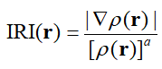

可见，只要有电子密度ρ及其梯度即可计算IRI。做完常规量子化学计算后，就有了波函数信息，就可以很容易地计算电子密度及其梯度。由于IRI不依赖于波函数，因此如果有很高解析度的实验测定的电子密度分布数据的话也可以用来计算IRI。

IRI中的参数a非常关键。IRI标准定义中的a取1.1，这是笔者对许多体系进行测试经验选取的最佳数值，此时IRI可以最理想地同时展现化学键和弱相互作用。如果a=4/3，那么IRI和RDG就仅相差前面一个常数系数而已。因此对于已经支持了RDG分析的程序，程序开发者仅仅需要改一行代码即可实现IRI。

和RDG分析一样，也可以把sign(λ2)ρ函数通过不同颜色投影到IRI等值面上来区分不同区域的作用强度和特征。这里λ2代表电子密度Hessian矩阵第二大本征值，sign()代表取符号，sign(λ2)ρ的含义请看IRI方法的原文，或者笔者对RDG方法的介绍文章《使用Multiwfn图形化研究弱相互作用》（<http://sobereva.com/68>）。在IRI原文中笔者建议使用下面的色彩刻度对IRI等值面通过sign(λ2)ρ来着色，这个图是Multiwfn程序的examples目录下的IRI_colorbar.png，用IRI图发文章的时候可以直接用，其中单位是a.u.

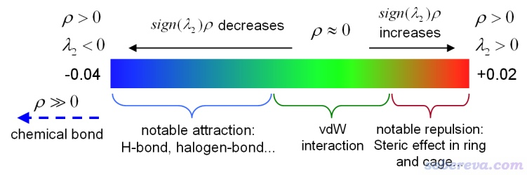

上面这种着色方式意味着如果某IRI等值面基本上是绿色，就说明此处是范德华作用区域（也可以是比如极弱的氢键，这种程度的氢键是色散作用占主导，详见《透彻认识氢键本质、简单可靠地估计氢键强度：一篇2019年JCC上的重要研究文章介绍》<http://sobereva.com/513>）。如果等值面颜色明显偏红，说明这里存在一定位阻作用，若是鲜红则说明位阻很强。如果等值面颜色明显偏蓝，说明存在显著的吸引作用，比如一般强度的氢键、卤键等。如果等值面完全是蓝色的，说明此处要么是相对来说很强的弱相互作用，因此作用区域的电子密度能达到>=0.04 a.u.的程度，要么是化学键作用，成键区域电子密度通常显著大于0.04 a.u.。

### 2.2 IRI与其它方法的对比

对于展现弱相互作用区域，IRI和RDG图像其实没有显著区别，但如果也要同时展现化学键作用，那么IRI相对于RDG的图像效果方面的优势很显著。下图是一个非常典型的含有分子间、分子内弱相互作用以及化学键作用的苯酚二聚体。

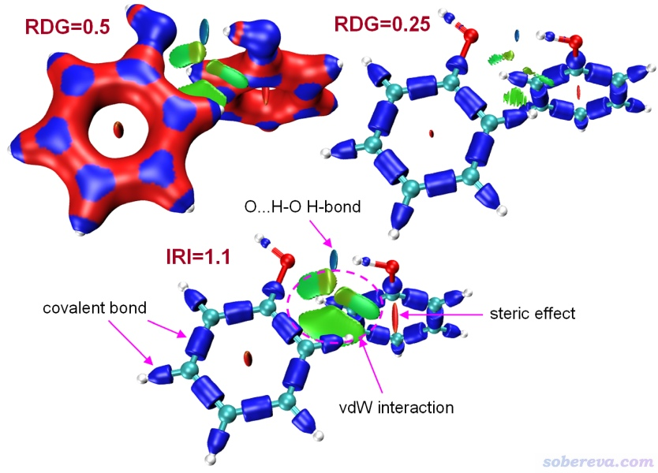

如上可见，作RDG图并且不设密度截断的话（平时做RDG分析弱相互作用时通常都设密度截断，从而令密度较大的地方不显示RDG等值面），如下所示，当等值面数值选取得适合展现分子间弱相互作用时（RDG=0.5），化学键作用就展现不清楚，等值面都连成一片；而当等值面数值设为RDG=0.25，此时化学键作用展现得不错，但弱相互作用区域的等值面就非常小了，很难观察。而IRI则选取了一个十分恰当的a参数，在IRI=1.1等值面下同时把共价键、环内位阻区域、分子间氢键和范德华作用区域都清晰地展现了出来。根据笔者经验，对多数体系IRI展现各种相互作用比较合适的等值面数值是0.9~1.1，Multiwfn提供的绘制IRI图的脚本里用的是1.0，对绝大多数情况效果都令人满意。大家也可以自行根据实际情况微调等值面数值来令等值面大小更合适、图像更美观、更易于分析。

IRI和DORI函数的目的一致，都是同时展现化学键和弱相互作用区域。但相比于IRI，DORI的图像效果实在太差了，计算还更耗时、定义还更复杂，所以以后DORI就没有任何存在意义了。下面是一个对比，考察的是实验上已合成出来的两个金刚烷之间由C-C键连接的体系。可见IRI图把范德华作用、位阻作用和化学键都展现得清清楚楚，图像很干净；而DORI图则显得噪音很明显，有许多细碎的等值面，而且描述化学键的等值面还都没有分离开，描述两个金刚烷之间作用的等值面边缘还特粗糙。DORI图像效果对等值面数值的选取特别敏感，但无论怎么调，图像效果始终都很烂。

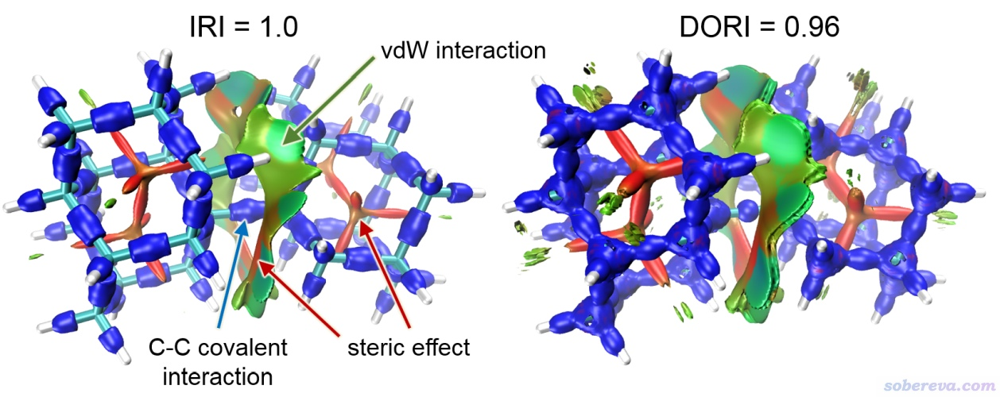

再看下面的G-C碱基对体系。(a)、(b)分别是sign(λ2)ρ着色的IRI和DORI等值面图，可见前者的等值面干干净净，把所有化学键、碱基间的氢键和范德华作用都展现了出来，而DORI图还是显得很粗糙，等值面形状很难看，许多化学键也区分不开。DORI的等值面效果为啥这么烂，可以从体系平面上的填色图来更充分考察。下图(c)、(d)分别是体系平面上的IRI和DORI填色图，由前者可以看到IRI函数变化比较光滑，从这幅图也可以直接清楚地看出在这个平面上此体系的各种相互作用出现的区域。而从DORI的填色平面图上看DORI的变化非常复杂、凌乱，自然其等值面图效果也很差，这本质上是因为DORI函数本身定义得就很不好。

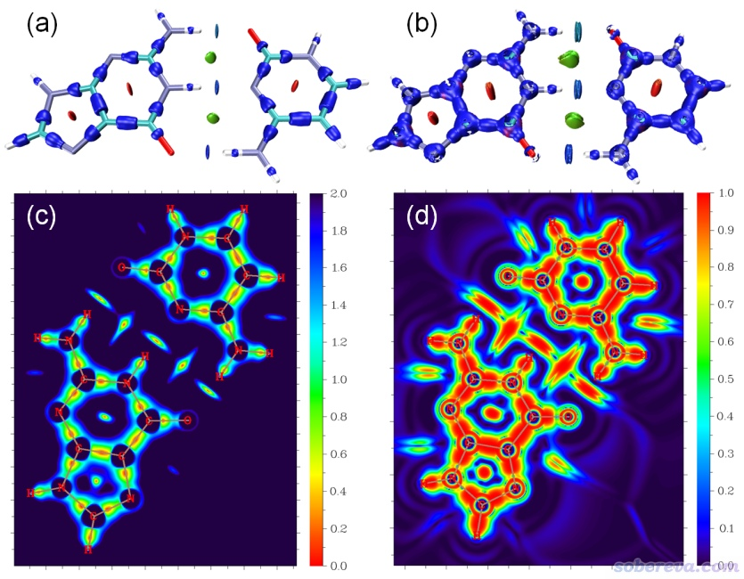

AIM理论通常用键临界点（BCP）、键径展现原子间的相互作用。但是这种方式对许多类型的相互作用区域展现得不够全面、直观，特别是有些明显存在氢键相互作用的地方还会被漏掉，即找不到相应的BCP。在IRI的原文中笔者就这个问题做了详细的理论分析，充分证明了为什么有些氢键只能靠IRI或RDG等值面才能展现，而相应的BCP则不存在。文中的讨论使用了下图的Ni(NH3)2(OH)2做为例子，从图上可见N-H...O的氢键没有对应的BCP，而在IRI图上则显示出蓝色的等值面，体现出这是绝对不可忽视的、强度不很弱的内氢键。

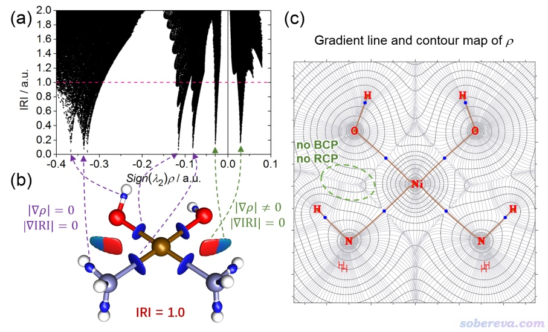

### 2.3 IRI应用于一些体系的效果

下面是IRI原文里绘制的各种类型体系的着色IRI图，笔者就不再一一分析了，原文里讨论得很详细，请自行阅读。总之从这些图可以看到，不管是普通的共价键、离子键，还是配位键，不管是周期表靠前还是靠后的元素的成键，IRI等值面一律都能将它们展现得非常清楚。与此同时，分子内各种弱相互作用也都能通过IRI图看得非常清楚，和化学直觉完全一致。值得一提的是，对于下面图中的二茂铁，不仅Fe-C作用通过等值面上的蓝色部分展现了出来，笼状区域以及C-Fe-C三元环内区域的强烈位阻作用也都以红色鲜明地体现了出来。

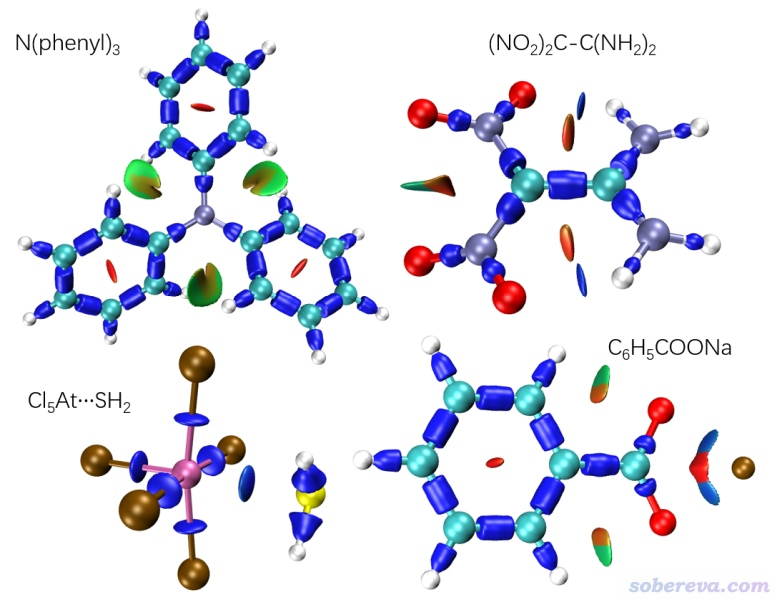

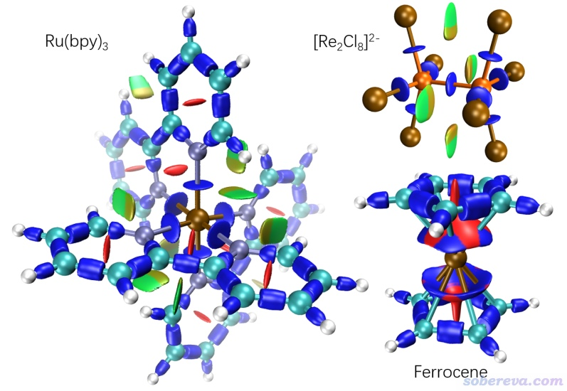

与RDG+ELF联用明显不同的是，IRI是单一且随核坐标改变能够平滑变化的函数，因此不仅可以用于考察势能面的极小点结构，还可以用于过渡态，乃至IRC路径上的各个点，从而生动鲜活地展现出整个化学过程中原子间相互作用是如何变化的，这对于深入理解反应的特征和本质非常有好处。下面是IRI原文的例子，是Diels-Alder加成过程，可见最初乙烯和1,3-丁二烯之间是范德华相互作用，随着反应的进行，两个片段间的等值面形状一点点变化，C-C之间的区域一点点变蓝，充分体现出共价键在一点点形成、逐渐变强，到最后变成了普通的C-C键。

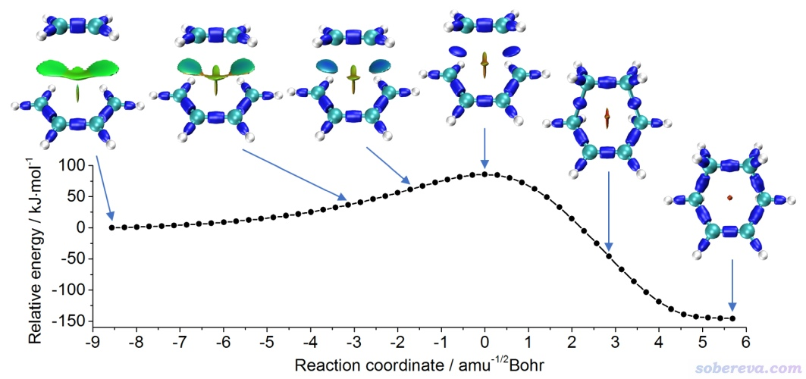

与上图对应的动图如下，可见此动画对反应中相互作用的变化展现得极为生动，也很能激发外行人的兴趣。通过批处理脚本，就可以自动调用Multiwfn对IRC的各个点依次计算、用VMD产生出IRC每个点的图像，最后再用ffmpeg或ImageMagick等程序就可以合并成动画。参考《通过键级曲线和ELF/LOL/RDG等值面动画研究化学反应过程》（<http://sobereva.com/200>）里的过程并结合Multiwfn里做IRI分析的操作步骤稍微举一反三就能实现。

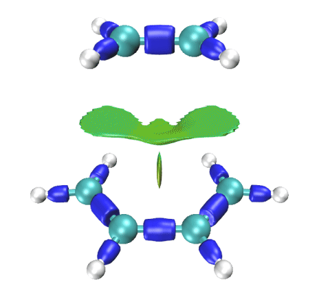

下面是OH- + CH3CH2Br → CH3CH2OH + Br-的SN2取代反应的IRI的动画，可见也把新键的形成、旧键的断裂、相互作用特征的变化展现得特别直观、灵动。

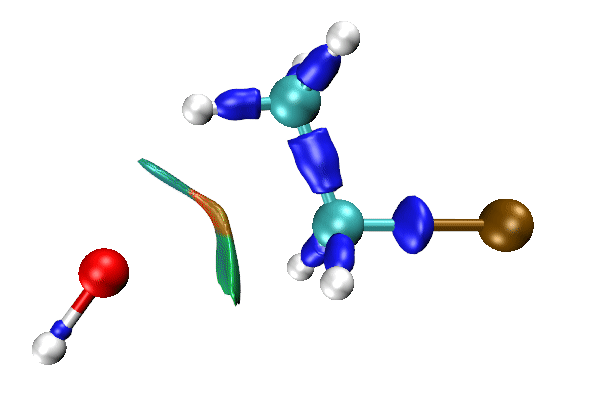

## 3 分子体系的IRI分析实例

### 3.1 苯酚二聚体的等值面图

下面以苯酚二聚体为例展示怎么通过Multiwfn+VMD绘制IRI图。读者务必使用2021年2月及以后更新的Multiwfn版本，Multiwfn最新版本可以在主页<http://sobereva.com/multiwfn>免费下载。如果对Multiwfn缺乏基本了解的话强烈建议看看《Multiwfn入门tips》（<http://sobereva.com/167>）和《Multiwfn FAQ》（<http://sobereva.com/452>）以补充常识知识。本文的VMD使用1.9.3版，可以在<http://www.ks.uiuc.edu/Research/vmd/>免费下载。Multiwfn+VMD绘制IRI图和绘制RDG图的过程极为相似，如果follow下文的例子遇到困难，建议看看绘制RDG图的演示视频（<https://www.bilibili.com/video/av71561024>）。能把RDG图画出来自然也就能把IRI图顺利画出来。

做IRI计算需要提供一个含有Multiwfn可以读入波函数信息的文件，用比如wfn/wfx/fch/molden/mwfn等格式都可以，格式介绍以及生成方法见《详谈Multiwfn支持的输入文件类型、产生方法以及相互转换》（<http://sobereva.com/379>）。本例就使用Gaussian 16在B3LYP-D3(BJ)/6-311G**级别下对苯酚二聚体做优化任务产生的fch文件当输入文件，这是本文文件包里的PhenolDimer.fchk。

启动Multiwfn，然后依次输入  
PhenolDimer.fchk  //此处输入PhenolDimer.fchk的实际路径  
20  //弱相互作用可视化分析  
4  //IRI分析  
3  //高质量格点。格点设置显著影响计算耗时和最终得到的图像中等值面的光滑程度，务必看一下《用Multiwfn+VMD做RDG分析时的一些要点和常见问题》（<http://sobereva.com/291>）中关于格点设置的说明。当前选的“高质量格点”的总格点数是固定的，对中、小体系够用，但对于很大体系时格点间距会较大，等值面还是会有锯齿、不光滑。对很大体系建议手动输入格点间距

用不了多久就算完了，在后处理界面选3 Output cube files to func1.cub and func2.cub in current folder，在当前目录下就出现了func1.cub和func2.cub，分别是记录sign(λ2)ρ和IRI格点数据的cube文件。把这两个文件移动到VMD目录下。然后把Multiwfn目录下的examples子目录下的IRIfill.vmd文件拷到VMD目录下，这是VMD作图脚本。

启动VMD，在文本窗口输入source IRIfill.vmd来执行这个脚本，VMD就会自动载入两个cub文件并且修改作图设置，然后就会看到下图，这就是IRI原文里的图2

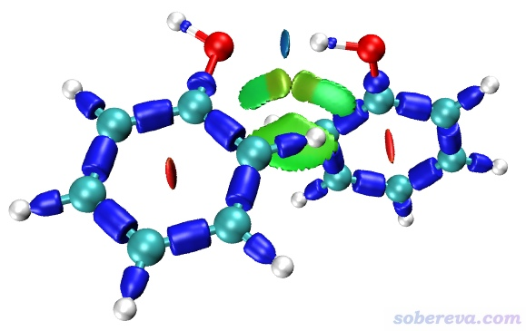

如果想修改IRI等值面数值的话，进入VMD main界面的Graphics - Representation，在Isovalue文本框里输入想设的值然后按回车即可。

顺带一提，如果你之前没看过《用Multiwfn+VMD做RDG分析时的一些要点和常见问题》（<http://sobereva.com/291>）的话强烈建议看一下，里面有很多重要的作图要点对于绘制IRI图也同样适用。

做过RDG分析的人都知道有个重要的RDG vs sign(λ2)ρ散点图。使用Multiwfn也可以绘制IRI vs sign(λ2)ρ散点图，也就是在Multiwfn计算IRI完毕后的后处理菜单中选-1 Draw scatter graph，然后就会看到下图

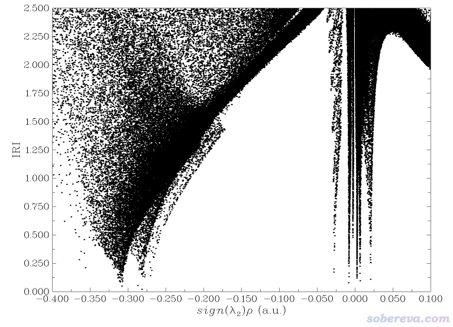

此图里sign(λ2)ρ在-0.04~0.03 a.u.范围内有好几个spike，对应的是苯酚间的弱相互作用，在小于-0.25 a.u.的部分还有好多spike，对应的是化学键作用。关于散点图的意义和分析请看前文里提到的那些RDG/NCI分析文章，这里就不多说了。

如果把散点数据导出成output.txt文件，并且使用Multiwfn文件包里的examples\scripts\IRIscatter.gnu脚本，还可以得到彩色的散点图，不仅明显更好看，通过颜色明显更便于对照指认各个spike和等值面的对应关系。例子见Multiwfn手册4.20.4节。

之前有人问绘制IRI图的时候能否只显示特定部分，从而避免其它区域的等值面在分析时产生干扰。这是可以的，有几种做法：  
(1)Multiwfn载入波函数文件后，在做IRI分析前，先进入主功能6，用选项-3或-4可以分别设置只保留哪些原子的贡献、扣除哪些原子的贡献。之后照常做IRI分析即可。  
(2)当Multiwfn让你设置格点的时候，恰当定义要计算的空间范围，使计算格点数据的区域只涉及你感兴趣的区域。Multiwfn提供了丰富、灵活的格点设置方式，见Multiwfn手册3.6节的介绍，特别是其中10 Set box of grid data visually using a GUI window的设置方式可以在图形界面里直接设置盒子的位置和大小，非常直观。  
(3)用Multiwfn的主功能13中的格点数据屏蔽功能可以只保留特定区域，参见Multiwfn手册4.13.4节的实例，在《使用Multiwfn结合CP2K通过NCI和IGM方法图形化考察固体和表面的弱相互作用》（<http://sobereva.com/588>）的3.6节也有这种做法的例子。

如果你只希望IRI展现弱相互作用区域，而不想把成键区域也表现出来，可以在Multiwfn做完IRI分析后选择屏幕上的选项9 Screen out covalent bond regions (set IRI to 100 for regions with sign(lambda2)rho < -0.1 a.u.)（此选项在2024-Mar-29及以后更新的Multiwfn里才有），之后sign(λ2)ρ小于-0.1 a.u.的区域内的IRI值就会被设为一个很大的值100。这样做的理由是形成化学键的区域通常电子密度都较大，因而sign(λ2)ρ比-0.1 a.u.更负，此区域的IRI设成很大的值后再绘制等值面图时就看不到这块区域了。之后你再导出func1.cub和func2.cub、用IRIfill.vmd脚本作图，就会发现成键区域确实已经看不见了，对苯酚的例子如下所示

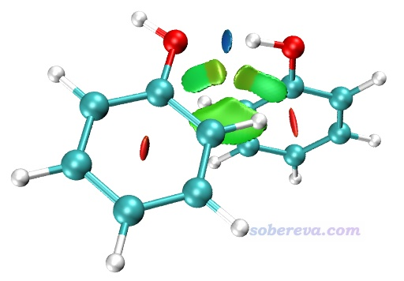

### 3.2 G-C二聚体的IRI平面填色图

这一节演示一下怎么获得前文中的G-C碱基对平面上的IRI填色图。注意读者务必用2022-Jul-4及以后更新的版本。

启动Multiwfn，载入本文文件包里的GC.fchk（这是Gaussian 16在B3LYP-D3(BJ)/6-311G**级别下优化G-C二聚体得到的）。在主功能0里可以看到此体系完全处于Z=0的XY平面上，因此我们将对这个平面作图。依次输入  
4  //绘制平面图  
24  //IRI  
1  //填色图  
直接按回车  //使用默认的格点数  
0  //设置体系向四周的延展距离（用于定义作图范围）  
2  //2 Bohr  
1  //XY平面  
0  //Z=0  
此时图像蹦出来了。在上面点右键关闭图像，然后输入下面的内容改进作图效果  
8  //显示键  
14  //棕色  
19  //设置色彩变化方式  
2  //Reversed rainbow  
4  //设置原子标签颜色  
1  //红色  
1  //设置色彩刻度下限和上限  
0,2  
-1  //重新绘制

此时看到下图，效果很理想。其中橙色+绿色区域对应存在明显相互作用的区域。

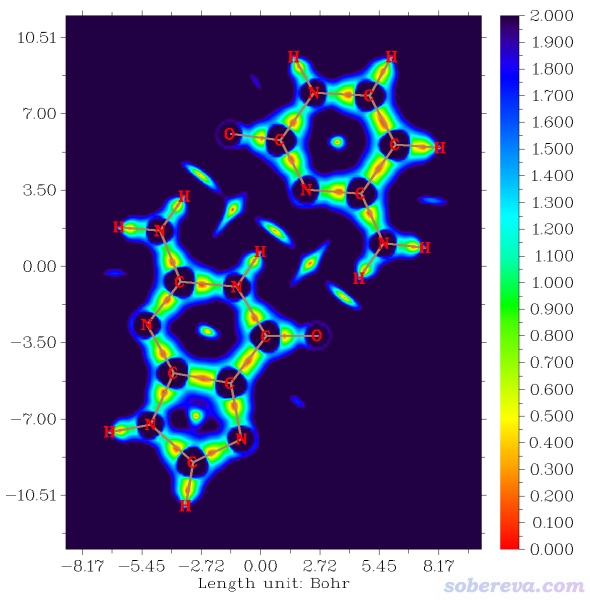

## 4 周期性体系的IRI分析实例

Multiwfn也可以基于CP2K第一性原理程序产生的周期性体系的波函数绘制IRI图。读者请先仔细阅读《使用Multiwfn结合CP2K通过NCI和IGM方法图形化考察固体和表面的弱相互作用》（<http://sobereva.com/588>）了解怎么用CP2K+Multiwfn+VMD绘制周期性体系的RDG图，然后只需要把选择RDG分析的地方改成选择IRI分析、把source RDGfill.vmd改成source IRIfill.vmd即可获得周期性体系的IRI图。

这里举一个简单的绘制例子，对重构之后的硅(001)表面绘制IRI图考察成键情况。如果不知道表面重构是怎么回事，看北京科音CP2K第一性原理计算培训班（<http://www.keinsci.com/KFP>）的下面这页幻灯片

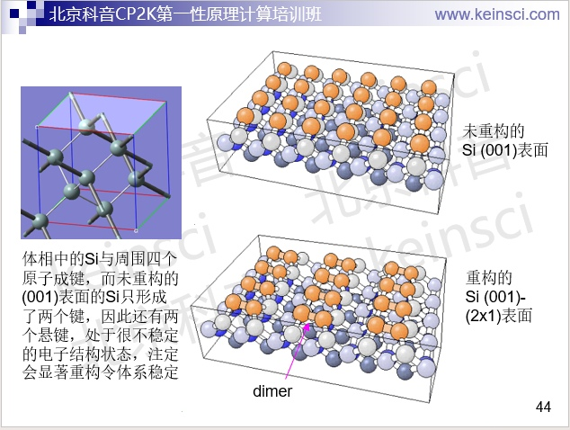

本文文件包里Si_surface.inp是CP2K的输入文件，是对表面重构后的结构在PBE/pob-TZVP级别下算单点并得到molden文件的任务。文件包里的Si_surface.molden是这个任务产生的molden文件，笔者已按照<http://sobereva.com/588>所述的方式将晶胞信息作为[Cell]字段手动加入了其中。

启动Multiwfn，载入Si_surface.molden。在开始IRI计算之前，我们可以先看一下此体系的原子位置和晶胞，便于我们确定最佳的格点设定。输入0进入主功能0，然后选择菜单上的Other settings - Toggle showing cell frame，此时可以看到下图

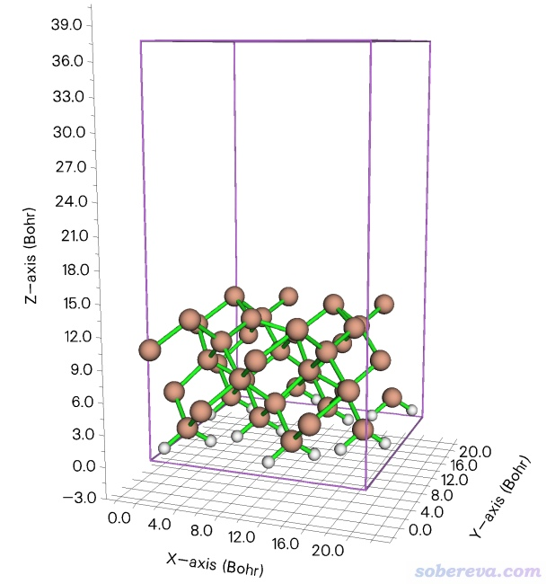

上图紫色的边框展现了CP2K做计算的时候的晶胞范围。结合上图的坐标轴，以及Multiwfn文本窗口显示的信息，我们可知此体系Z坐标最大的原子大约是Z=13 Bohr。

点击Return按钮关闭图形窗口回到Multiwfn主菜单，然后接着输入  
20  //弱相互作用可视化分析  
4  //IRI分析  
9  //基于晶胞的平移矢量定义格点  
按回车  //代表用(0,0,0)位置作为格点数据的原点（从前面的图可见这也正是当前晶胞的原点）  
0,0,16  //格点所在的盒子的三个方向的边长。前两个0代表第1、2方向的边长恰等于晶胞的第1、2方向的边长，16代表在晶胞的第3个方向（此例对应Z方向）取16 Bohr作为盒子的第三个方向边长。此时的盒子足矣涵盖所有原子所在的区域，不可能造成等值面被截断，同时又避免了计算真空区浪费耗时  
0.15  //格点间距。数值越小要算的点数越多，耗时越高，而图像越平滑

算完了之后还是像前面的例子一样选择3导出func1.cub和func2.cub，然后把它们挪到VMD目录下，把Multiwfn目录下的examples\IRIfill.vmd文件挪到VMD目录下，然后启动VMD并在文本窗口输入source IRIfill.vmd，马上就看到了图像。为了让效果更好，做如下调整  
(1)在VMD的文本窗口输入pbc box把盒子边框显示出来  
(2)对于当前这个体系，默认的IRI=1.0等值面不太合适，等值面偏大。因此进入Graphics - Representation，在Isovalue文本框里输入一个小一些的值0.7（可反复尝试来确定），此时图像效果较好  
(3)为了让图像更有层次感，选Display - Depth cueing开启景深效果。然后选Display - Display Settings，把Cue Mode设为Linear，把Cue Start和Cue End分别设为1.75和2.50

最终的图像如下，两个视角的图一起给出了

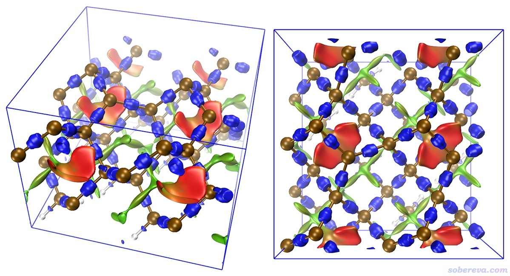

从上面的图可以看到每个Si-Si键都有相应的蓝色的IRI等值面出现，体现出这是化学键作用。在比较大的笼状区域里有很多绿色的IRI等值面，体现出这些区域中硅原子间形成了范德华作用。还有一些相对较小的笼和五元环状区域中IRI等值面颜色为明显的红色，直观地体现出这些区域存在显著的位阻作用。注意这种相对较小的笼、环是在硅表面重构形成新的Si-Si键后才出现的，体现出形成新键令能量降低是重构的驱动力，而在这个过程中也要同时克服造成新的位阻导致的能量升高因素。

## 5 IRI-π分析

在Multiwfn中有一套专门的分析π电子结构的流程，见《在Multiwfn中单独考察pi电子结构特征》（<http://sobereva.com/432>）以及笔者的专门的介绍论文Theor. Chem. Acc. 139, 25 (2020) <https://doi.org/10.1007/s00214-019-2541-z>。笔者将这种分析思路与IRI相结合，就诞生了IRI-π。简单来说IRI-π这个函数就相当于在计算IRI的时候只考虑π电子，或者说在Multiwfn里先把π轨道以外的轨道占据数清零然后照常计算IRI。IRI原文2.6节对IRI-π的特性做了专门的讨论，这里笔者只是简单说一下。

下图(a)和(b)分别是乙烯和乙炔的IRI-π等值面图。由于这个函数是专门展现π作用的，和位阻区域完全无关，所以按照下图的色彩刻度根据ρ着色即可，而没必要用sign(λ2)ρ来着色。由IRI-π等值面形状可见，乙烯这样一套π作用和乙炔这样两套π作用对应的等值面形状完全不同，前者只在π平面上、下方有等值面，而后者则是绕着键轴出现了环形等值面。因此根据等值面形状可以判断π作用类型。

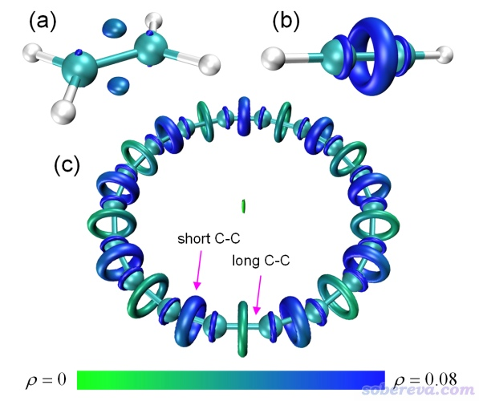

上图的(c)是电子结构很特殊的18碳环（cyclo[18]carbon）的ρ着色的IRI-π等值面图。关于这个体系笔者曾做过大量研究并发表了一系列研究文章，汇总见<http://sobereva.com/carbon_ring.html>。此体系有个特点是其中C-C键一长一短交替出现，由上图可见每个C-C键的IRI-π等值面都是环状的，说明每个C-C键都是两套π作用。但两类C-C键的π作用强度明显不同，较短的C-C键的环状IRI-π等值面颜色比较长的C-C键的更蓝，很直观地说明较短的C-C键的π作用区域电子密度更大，也因此π作用更强。

再看噻吩的例子。下图(a)和(b)是噻吩在不同等值面数值下的IRI-π等值面图，使用和上图一样的着色方式。由图(a)的等值面颜色可见Cα-Cβ的π作用比Cβ-Cβ的明显更强，这和一般常识以及Multiwfn可以计算的π电子的Mayer键级结论相符。对于图(b)展现的IRI-π=1.7等值面，哪怕不看颜色，光看等值面形状也能看出两种C-C键的显著区别。Cα-Cβ的IRI-π等值面都延伸到接近Cα和Cβ原子核的位置了，而Cβ-Cβ的IRI-π等值面只处在π作用区域处。因此，此例说明IRI-π函数在特定等值面数值下的形状也往往能判断π作用的强弱。

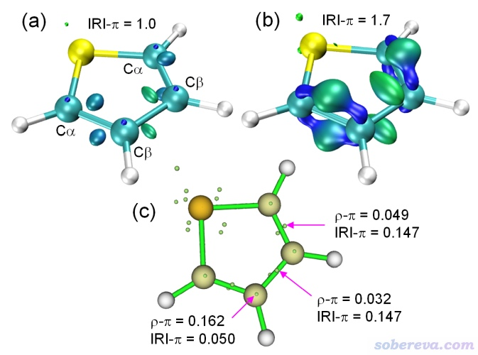

Multiwfn具有强大的盆分析功能，对Multiwfn支持的任意实空间函数都可以获得其极大、极小点位置以及这些位置的具体函数值，见《使用Multiwfn做电子密度、ELF、静电势、密度差等函数的盆分析》（<http://sobereva.com/179>）。之后还可以用Multiwfn的拓扑分析功能对盆分析给出的极值点位置进一步refine得到更准确的结果。这种操作对于IRI-π也照样适用。上图(c)里每个小绿球是Multiwfn搜索出的IRI-π的极小点位置（可视为π作用区域最有代表性的位置），相应位置的π电子密度（ρ-π）和IRI-π数值都给出了。可见Cα-Cβ的IRI-π的极小点位置的密度显著大于Cβ-Cβ的，在定量上进一步体现出见Cα-Cβ的π作用更强。

IRI-π在Multiwfn中的计算也很容易，限于本文的篇幅在这里就不详细介绍了，大家可以直接看IRI分析的英文教程<http://sobereva.com/multiwfn/res/IRI_tutorial.zip>里的相应部分，写得非常详细易懂。

 后来笔者发表了研究18碳环衍生物C18-(CO)n的成键特征和电子离域性的文章，见Chem. Eur. J., 28, e202103815 (2022)，在其中使用了IRI-π分析，所得图像如下所示，充分体现了IRI-π在研究pi作用特征、横向对比不同体系pi作用强度方面的价值。此文的深入浅出的介绍见《深入揭示18碳环的重要衍生物C18-(CO)n的电子结构和光学特性》（<http://sobereva.com/640>），非常欢迎大家阅读。此外，在《不寻常的环[18]碳前驱体C18Br6的电子结构和芳香性》（<http://sobereva.com/664>）里介绍的Chem. Eur. J., e202300348 (2023)文中还通过IRI-π考察了C18Br6的pi电子的特征、在《18碳环等电子体B6N6C6独特的芳香性：揭示碳原子桥联硼-氮对电子离域的关键影响》（<http://sobereva.com/696>）里介绍的Inorg. Chem., 62, 19986 (2023)文中还通过IRI-π考察了18碳环的等电子体B6N6C6和B9N9的pi作用特征。**非常推荐在引用Multiwfn原文、Chemistry Methods上的IRI原文的同时引用这几篇文章作为IRI-π的应用范例**。

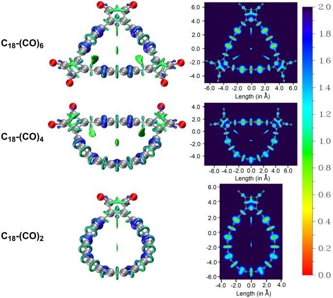

## 6 总结

本文介绍了近来新提出的IRI函数。此函数是图形化展现化学体系中各种相互作用很理想的函数，其定义简单，计算快速，编程实现容易，图像效果好，普适性强，有公开且免费的计算程序，作图简单方便，对孤立体系和周期性体系都能用，因此IRI有着独特的意义和显著的实用性，是计算化学家的波函数分析工具箱中的有用的新工具，欢迎大家在未来的研究中广泛使用。另外，IRI的变体IRI-π给分析π相互作用又增添了与以往截然不用的新方法，很值得在未来研究π相互作用的场合使用。
