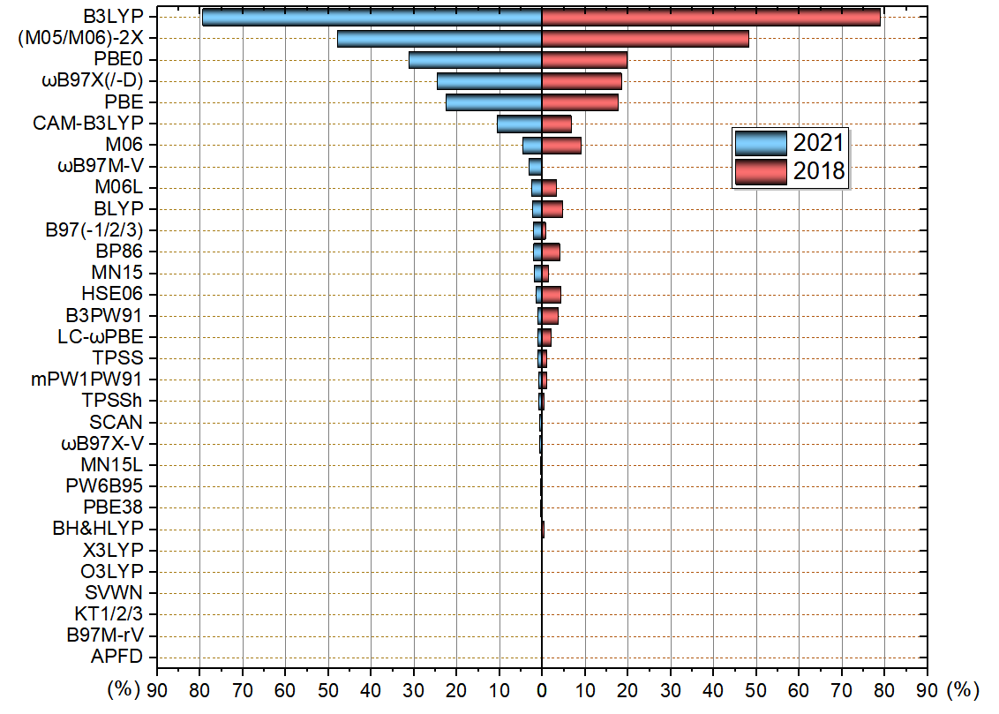
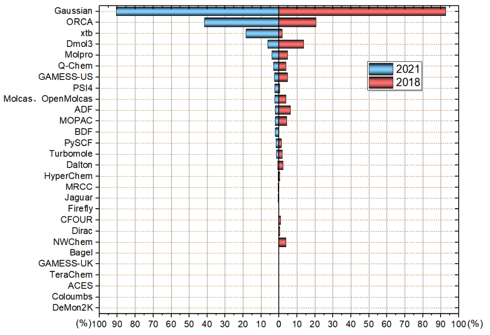
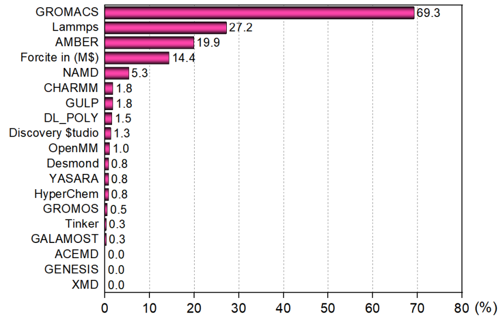
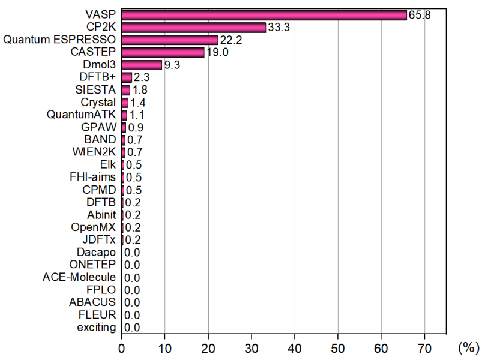

**后记**：2024年的投票结果见《2024年计算化学公社举办的计算化学程序和DFT泛函的流行程度投票结果》（<http://sobereva.com/706>）。

**2021年计算化学公社论坛“你最常用的计算化学程序和DFT泛函”投票结果统计**

文/Sobereva@[北京科音](http://www.keinsci.com)  2021-Jun-2

## 0 前言

2021年4月29号，在人气最高的计算化学专业论坛“计算化学公社”（<http://bbs.keinsci.com>）开展了为期一个月的四个投票：  
你最常用的DFT泛函投票（<http://bbs.keinsci.com/thread-22853-1-1.html>）  
你最常用的量子化学程序投票（<http://bbs.keinsci.com/thread-22854-1-1.html>）  
你最常用的分子动力学程序投票（<http://bbs.keinsci.com/thread-22855-1-1.html>）  
你最常用的第一性原理程序投票（<http://bbs.keinsci.com/thread-22856-1-1.html>）

现对投票结果进行总结和评论。未来预计每三年重新开展一次投票。要强调的是，这个投票只是体现流行程度，和方法/程序的好坏并没必然关系。

## 1 你最常用的DFT泛函投票

本次可投的泛函有31种，双杂化泛函不包括在内，明显几乎不会有人用的泛函也没纳入可投范围。投票范畴仅限量子化学计算，不包含第一性原理计算。关系特别近的，比如M05-2X和M06-2X、wB97X和wB97XD当做同一个泛函来计。此次投票者共712人，比2018年投票人数299增加了很多，体现出计算化学公社论坛的影响力日益增强。本投票每个人最多选6项，且所投的泛函必须占平时全部研究工作的10%以上，带不带DFT-D校正算同一个泛函。按照得票率（票数除以总投票人数）绘制的图如下，为便于对比2018年的结果也一起绘制了。此图中诸如某泛函对应60%就代表有60%的人平时较多使用此泛函，后文的统计图同理。

从结果来看，经历了27年，B3LYP还是目前流行程度最高的泛函，而且加上DFT-D校正之后又给其续命了。估计在接下来的10年内，虽然其流行度No.1的地位也许不保，但至少还会是用得最多的泛函之一。虽然B3LYP算能量问题已经落伍了，如今用这泛函算能量很容易挨审稿人批，见比如《坚持使用B3LYP算有机体系的人的下场》（<http://bbs.keinsci.com/thread-12773-1-1.html>），但优化、振动分析方面B3LYP的地位相当稳固，多数情况都能用，而且结果不错速度又快，这点在《谈谈量子化学研究中什么时候用B3LYP泛函优化几何结构是适当的》（<http://sobereva.com/557>）里专门说了。

M06-2X与B3LYP的得票率比例和2018年一样依然是6:10，真是挺巧的。M06-2X的流行程度顶多也就稳定在这个程度了，不会再上涨了。虽然M06-2X算有机问题、弱相互作用能量问题方面比B3LYP都强得多得多，并且明白这些问题的人越来越多，理应相对于B3LYP的得票率会进一步上升，但M06-2X有耗时高、容易出小虚频、容易收敛困难这些小问题，而且DFT-D3又令B3LYP在优化弱相互作用体系方面不落下风，而且比M06-2X算各种体系能量问题精度都更好的wB97M-V使用人数又逐渐增多，因此M06-2X的流行程度到现在这个程度基本算是达到瓶颈了。

PBE0、wB97X/X-D的得票率比2018年有所上涨，这有点令我意外，虽然有一些巧合因素，但也可能有一些必然因素。比如在我不少博文，以及计算化学公社论坛上不少帖子里，都提到PBE0-D3(BJ)算过渡金属配合物、算局域激发态是很好的选择，这有可能对PBE0的得票率上升有不可忽视的贡献。

2016年提出的wB97M-V在2018年的时候还不怎么为人所知，当时没有留给它选项。这次投票可见wB97M-V已经明显展露头角了，这有很多原因：在《简谈量子化学计算中DFT泛函的选择》（<http://sobereva.com/272>）以及计算化学公社论坛上不少讨论中都已经推荐了wB97M-V，在免费而且流行度日益上升的ORCA中已支持了wB97M-V，而且近年来不断有各种benchmark文章表明wB97M-V算能量的精度在普通泛函里是几乎最顶尖的。估计再过3年，wB97M-V的得票率比现在能上升一倍左右。

M06、M06L的得票率如今比2018低了不少。这也是因为这俩泛函在如今看来没什么用，它们在后来的许多benchmark文章里（哪怕是专门测过渡金属配合物体系的）表现得都很平庸，M06能用的情况用MN15几乎都是更好的选择，而必须用M06L这样纯泛函的时候（如静态相关很强的情况），也不如用改用更新的MN15L。

BLYP得票率降了很多，确实这如今也用处不大。在ORCA里为了计算快而用纯泛函的话，基本上我都推荐用B97-3c。

MN15得票率和2018年相比几乎没变，主要也是这泛函显得有点中庸，用户对它的刚性需求不多。

B3PW91、LC-wPBE、mPW1PW91、HSE06得票率比2018年显著降低，完全失势了，它们在量化计算里如今基本也都没多大用处，只要用户清醒地知道什么时候用什么泛函最恰当，这些泛函几乎在任何研究中都不会用到（也有一些例外情况，比如《使用Multiwfn预测晶体密度、蒸发焓、沸点、溶解自由能等性质》<http://sobereva.com/337>里提到的Politzer等人拟合的预测公式里的静电势描述符是基于B3PW91算的）。BP86下降不少其实有点可惜，这老东西其实在计算过渡金属体系方面还是挺有用的，比较鲁棒。B97(-1/2/3)得票率有所上涨，一定程度上可能是因为每次北京科音量子化学培训班的时候、网上答疑的时候我都建议用B97-2算NMR所致。

其它泛函就没什么好评价的了，基本上2018年没人用的泛函到现在还是没人用。有些很少有人用的泛函，比如SCAN、TPSSh其实都是有用武之地的，但用户基本都被其它更流行、表现也不错的泛函吸走了。

有一个泛函极度悲催，2018年就是唯一0票的，到2021年还是唯一0票的，它 就 是：APFD！3年前我就说，不好的泛函怎么打广告都没用，纵使某本书第三版通篇都用APFD（并由此给初学者一种错觉APFD是应当默认使用的），而且这书中文版也早已上市，但终究APFD还是完全不被接受。其实这么冷门的泛函在本次投票中理应不给其留出选项的，但我就想看看到底有没有哪怕一个初学者用了APFD，结果令我欣慰。

## 2 你最常用的量子化学程序投票

可投程序有28种，投票者共642人，显著超过2018年的233人。本投票每个人最多选三项，且所投的程序必须占平时全部研究工作的10%以上。按照得票率绘制的图如下

可见Gaussian依然是老大的位置，得票率稳居>90%。ORCA的用户数提升幅度很大，这来自于近些年ORCA的迅速的发展、在计算化学公社论坛和思想家公社QQ群里口耳相传。笔者近年也写了不少ORCA相关的博文（见<http://sobereva.com/category/ORCA/>），对于在国内普及ORCA起到了一定推动作用。虽然Gaussian的流行程度的地位在10年内难以动摇，ORCA若想充分代替Gaussian路还长得很，但明显ORCA对Gaussian的威胁与日俱增。

xtb的用户数是3年前的10倍有余！这是用户数增速最快的程序。xtb支持的GFN-xTB对于粗略优化、跑要求不高的动力学、结合Molclus做构象搜索（见比如《使用Molclus结合xtb做的动力学模拟对瑞德西韦(Remdesivir)做构象搜索》<http://bbs.keinsci.com/thread-16255-1-1.html>）颇为有用，速度又快结果通常也定性合理，实用性颇高，在论坛和群里也经常有人讨论xtb，因此其用户数猛增是理所应当的，但增速实在是比我想象得更快。老师傅MOPAC有种要被xtb乱拳打死的感觉。

Dmol3和ADF用户数猛跌！大势已去！我作出上面的统计图的时候，看到其流行度和3年前相差如此悬殊，我甚至噗~地喷出来。看来量子化学领域的用户明显逐渐趋于理性；如今信息越来越透明，计算化学公社论坛高质量的文章和讨论也在选择量子化学程序方面上起到了正确的导向，再加上免费的ORCA被越来越多的人认识，这都使得研究者们不再那么容易被又贵又*的程序所忽悠。Dmol3贼贵不说，程序还特弱，而且越来越显得过时，比如到现在还不支持10年前就有的DFT-D3（这年头基本没有主流程序不支持这个），Dmol3用户若发弱相互作用问题的文章只得尴尬地用DFT-D2，不被内行审稿人歧视才怪。如今在量子化学较高水平的交流群里，提问者一说要用Dmol3算xxx，大概率会被用异样眼光看待，通常要么没人理，或者被劝改用ORCA。对Dmol3还抱有幻想的初学者建议看看<http://sobereva.com/508>。至于ADF，之前我在<http://sobereva.com/489>里已经评述过，它相对于ORCA而言对于一般的研究真是没什么使用价值，还按年收费卖得老贵，2018年投票的时候其得票率明显高于其实用价值，今年的投票算是彻底打回原形了。

GAMESS-US越来越让人觉得有点老古董了，发展慢，使用又麻烦。由于卖点太少，使用门槛高，相关学习资源少，再加上ORCA来势汹汹，GAMESS-US流行度不断下降不难理解。

Molpro和阿Q流行度小降，也是对于大多数人缺乏刚性使用必要，又有其它程序的威胁所致。阿Q购买必要真是不大，以前泛函支持得多，特别是支持wB97M-V之类Gaussian没有的泛函还算是对一般应用性研究用户有价值的卖点，而如今ORCA不仅也支持了，而且挂着libxc还可以用各种泛函，折去了Q-Chem一个卖点（之前Q-Chem的TDDFT二阶解析导数的卖点就被G16折去了）。虽然阿Q乱七八糟功能支持丰富，但那些功能大多过于偏学术，而且又缺乏教程来推广，在大宗性研究中很少有机会用到。Q-Chem还有些相对有用的功能如今在ORCA、PSI4等其它免费程序里也都有替代品。Molpro的日子也不好过，MCSCF、多参考方法方面的老对手Molcas如今有了免费版OpenMolcas，这是挺致命的，而且ORCA这方面功能做得也越来越完善，以后Molpro的流行度可能还要降，更不好卖了。

PSI4用户上涨不少，一方面是PSI4近年来发展很快，另一方面和这个博文可能也有不小关系：《使用PSI4做对称匹配微扰理论(SAPT)能量分解计算》（<http://sobereva.com/526>）。估计目前国内用PSI4大多数都是冲着SAPT去的。

其它程序用户都很少。其中NWChem很惨，3年前流行度还能排个中游，如今流行度暴跌，没什么人用了。也的确对于普通应用性研究者来说，这个程序如今使用必要性很低，发展慢，也受到ORCA的严重挤压。

TeraChem是今年新加入投票的，只有惨淡的1票。这程序卖点是GPU加速，但这程序功能很少，卖得也不便宜，而且如今挖矿闹得GPU价格暴涨，TeraChem相对于用其它程序靠CPU计算（尤其是ORCA里开RI）来说真是没什么明显好处了。

## 3 你最常用的分子动力学程序投票

共有397人参与了“你最常用的分子动力学程序投票”，共有19个程序可投，都是基于经典力场的分子动力学程序。每个用户可以投3个，并且要求平时使用几率超过10%。结果如下

GROMACS用户数远超任何其它程序，其它动力学程序用户数目的总和才差不多等于GROMACS，这和我预期的完全一致。Tinker的用户数远低于我的预计，这也是个挺知名的程序，但在国内实在不人气。我不知道为啥有人会用HyperChem做动力学，这速度也太慢了，功能也太弱了，还收费，而且这个程序都已经停止开发很多年了。

## 4 你最常用的第一性原理程序投票

共有442人参与了“你最常用的第一性原理程序投票”的投票，共有26个程序可投，每个用户可以投3个，并且要求平时使用几率超过10%。结果如下

VASP流行度排第一，这个没有什么悬念，但远达不到Gaussian那样在量化领域里有无法撼动的地位。稍微出乎我意料的是这次摸底调查中体系出CP2K和Quantum ESPRESSO的用户数其实很多，比我想象中的多多了，这是令我比较欣慰的。我很希望看到有越来越多的人使用这样又强大又免费的程序代替卖得越来越贵的VASP。

CP2K能排到第二真是令我很意外，因为从这个程序原文的引用次数来看，比Quantum ESPRESSO要少得多得多，占VASP用户数可能也就是个零头。投CP2K的人这次这么多，一方面是CP2K用户群体确实增长较快，也略微有一定可能是因为今年Multiwfn支持了创建CP2K输入文件的功能（见《使用Multiwfn非常便利地创建CP2K程序的输入文件》<http://sobereva.com/587>），一下子把CP2K输入文件编写门槛极大地降低，并导致一些之前做量化而不做第一性原理计算的人开始尝试着使用CP2K算点东西了。CP2K这个大杀器以后必会被越来越多的人青睐，越来越流行，前途光明。也同时祝愿Quantum ESPRESSO的用户数与VASP的差距能越来越小。相比红红火火的CP2K，从投票结果看历史更久的CPMD几乎已经算是凉了，近年来也都不怎么发展了，快要退出历史舞台。

Abinit的用户数真是少得可怜，远低于我的预期，以这个免费又功能丰富的程序的体量来看用户数理应不该这么少。CASTEP和Dmol3目前虽然还有一些市场，但我估计过三年再次投票的话，得票率肯定会降低。Dmol3很多人用是为了图快，但把CP2K用好的话，多数情况下真没必要花大把银子买Dmol3。
