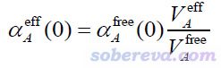
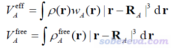
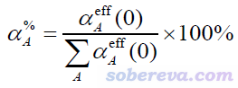

**使用Multiwfn计算分子中的原子极化率**

Calculating atomic polarizabilities in molecules using Multiwfn

文/Sobereva@[北京科音](http://www.keinsci.com)

 First release: 2021-Jun-4   Last update: 2024-Apr-25

## 1 前言

原子在孤立状态下的极化率是可以实验测量的，也很容易理论计算，在<http://ctcp.massey.ac.nz/index.php?menu=dipole&page=dipole>有全周期表各种元素的实验和高精度理论计算数据。分子的极化率可以视为是其中各个原子的有效(effective)极化率的总和（后文简称为“原子极化率”），但是分子环境中原子极化率通常不是实验可观测的（除非是所有原子等价，比如C60，就用分子极化率除以60就是各个碳的极化率），而且也没有唯一方式计算，毕竟光是定义分子中原子的空间的方法目前就得有不下20种。

本文将介绍Multiwfn支持的一种计算原子极化率的方法，使用简便，结果定性合理，对在实际研究中讨论哪些原子对分子的极化率起主要贡献这种问题非常有帮助。

笔者的另一篇文章《使用Multiwfn计算原子的C6色散系数》（<http://sobereva.com/709>）和本文介绍的方法有很强相关性，建议看完本文后阅读。

## 2 原理

在目前已经不怎么流行的Tkatchenko-Scheffler (TS)色散校正方法原文Phys. Rev. Lett., 102, 073005 (2009)中，作者提出了一种简单的计算分子中原子的静态极化率αeff(0)的做法。他们的想法很简单，认为原子的极化率正比于原子体积，因此如果已知孤立状态原子的极化率αfree(0)，那么根据分子环境中原子的有效体积V_eff和孤立状态下原子体积V_free的比值就可以估计出αeff(0)。在Chem. Rev., 117, 4714 (2017)一文中，这种做法被明确表达为

其中A原子的有效体积和自由状态体积以下面的方式计算。其中r是三维空间坐标，R是原子核坐标，ρ是分子的电子密度，ρ_free是原子在孤立状态下的密度。w是原子权重函数，原文用的是Hirshfeld权重函数（定义可以看《原子电荷计算方法的对比》<http://www.whxb.pku.edu.cn/CN/abstract/abstract27818.shtml>的2.5节），但也可以用其它的，比如Becke、Hirshfeld-I等。

值得一提的是，以这种方式计算出原子极化率后，还可以计算原子间色散系数C6，这被用于TS色散校正方法中。但这不是本文的范畴，就不多说了。

从2021-Jun-4更新的Multiwfn开始，已经在模糊空间分析（主功能15）中支持了上面介绍的TS方法计算原子极化率的功能。笔者同时还定义了原子对分子极化率的贡献百分比α%，表达式如下。通过这个量可以非常直观地了解分子极化率的主要来源。

## 3 实例：噻吩

这里以一个简单分子噻吩为例演示怎么用Multiwfn计算其中各个原子的极化率。Multiwfn用的是官网上最新版本，可以在<http://sobereva.com/multiwfn>免费下载。不了解Multiwfn者建议参看《Multiwfn入门tips》（<http://sobereva.com/167>）和《Multiwfn FAQ》（<http://sobereva.com/452>）。此例涉及的各种文件都可以在<http://sobereva.com/attach/600/file.rar>里下载。

使用Multiwfn算原子极化率需要准备分子的波函数文件，以及其中各个元素的波函数文件，后者用来计算前文式子中的ρ_free。可以使用任意量子化学程序计算Multiwfn支持的任意波函数文件格式，比如可以用Gaussian计算wfn、wfx、fch文件，也可以比如用ORCA计算molden文件，等等。参看《详谈Multiwfn支持的输入文件类型、产生方法以及相互转换》（<http://sobereva.com/379>）。这里我们就用Gaussian计算fch文件。

先对噻吩进行优化（这里顺带做了振动分析，非必需），输入文件如下。就用中等的计算级别比如B3LYP/def-TZVP就够了。

%chk=C:\gtest\thiophene.chk  
# B3LYP/TZVP opt freq  
[空行]  
Title Card Required  
[空行]  
0 1  
 C                  0.00000000   -1.22130969   -0.02179399  
 C                  0.00000000   -0.71608155    1.25941477  
 C                 -0.00000000    0.71608155    1.25941477  
 C                 -0.00000000    1.22130969   -0.02179399  
 S                  0.00000000    0.00000000   -1.16395234  
 H                  0.00000000   -2.27646271   -0.28794720  
 H                  0.00000000   -1.31244733    2.17357142  
 H                 -0.00000000    1.31244733    2.17357142  
 H                 -0.00000000    2.27646271   -0.28794720

算完后把thiophene.chk用formchk转换成fch。然后对其中包含的元素C、H、S原子分别做单点计算得到fch文件。比如C的输入文件如下。注意C、S基态都是三重态。

%chk=C:\gtest\C.chk  
# B3LYP/TZVP  
[空行]  
Title Card Required  
[空行]  
0 3  
 C

三种原子都这么算完后，我们就有了C.fch、H.fch和S.fch。

现在启动Multiwfn，输入thiophene.fch的路径载入之，然后输入  
15  //模糊空间分析  
-1  //修改原子空间定义方式  
3  //从原先默认的Becke切换为TS方法原文用的Hirshfeld划分  
13  //计算原子有效体积、自由体积和极化率  
H.fch  //H的孤立状态的波函数文件的路径  
C.fch  //C的孤立状态的波函数文件的路径  
S.fch  //S的孤立状态的波函数文件的路径

一眨眼就算完了，输出信息如下

Atom    1(C )  Effective V:    31.054  Free V:    34.930 a.u.  Ratio: 0.889  
Atom    2(C )  Effective V:    30.656  Free V:    34.930 a.u.  Ratio: 0.878  
Atom    3(C )  Effective V:    30.656  Free V:    34.930 a.u.  Ratio: 0.878  
Atom    4(C )  Effective V:    31.054  Free V:    34.930 a.u.  Ratio: 0.889  
Atom    5(S )  Effective V:    70.406  Free V:    74.333 a.u.  Ratio: 0.947  
Atom    6(H )  Effective V:     5.670  Free V:     7.888 a.u.  Ratio: 0.719  
Atom    7(H )  Effective V:     5.590  Free V:     7.888 a.u.  Ratio: 0.709  
Atom    8(H )  Effective V:     5.590  Free V:     7.888 a.u.  Ratio: 0.709  
Atom    9(H )  Effective V:     5.670  Free V:     7.888 a.u.  Ratio: 0.719  
Calculation took up       3 seconds wall clock time

Atomic polarizabilities estimated using Tkatchenko-Scheffler method:  
   1(C ):  10.046 a.u.  Contribution: 14.12 %  (Ref. data:  11.300 a.u.)  
   2(C ):   9.917 a.u.  Contribution: 13.94 %  (Ref. data:  11.300 a.u.)  
   3(C ):   9.917 a.u.  Contribution: 13.94 %  (Ref. data:  11.300 a.u.)  
   4(C ):  10.046 a.u.  Contribution: 14.12 %  (Ref. data:  11.300 a.u.)  
   5(S ):  18.375 a.u.  Contribution: 25.82 %  (Ref. data:  19.400 a.u.)  
   6(H ):   3.239 a.u.  Contribution:  4.55 %  (Ref. data:   4.507 a.u.)  
   7(H ):   3.194 a.u.  Contribution:  4.49 %  (Ref. data:   4.507 a.u.)  
   8(H ):   3.194 a.u.  Contribution:  4.49 %  (Ref. data:   4.507 a.u.)  
   9(H ):   3.239 a.u.  Contribution:  4.55 %  (Ref. data:   4.507 a.u.)  
Sum of atomic polarizabilities:    71.168 a.u.

可见程序先输出了有效体积和自由体积，并且把二者的比值输出了。S和H的Ratio都小于1，说明它们在噻吩中的有效体积相比于孤立状态都有所降低，而降低的程度各有不同。接下来程序根据TS方法算出了原子极化率，比如S是18.375 a.u.，这就相当于其Ratio值0.947与硫在孤立状态下的极化率19.4（Ref. data后面显示的，即前文说的αfree(0)）的乘积。各种元素的αfree(0)是Multiwfn内置的，是<http://ctcp.massey.ac.nz/index.php?menu=dipole&page=dipole>里的表格中的推荐值，一直到120号元素都有。Contribution后面给出的值是前文说的α%，即此原子的极化率占所有原子极化率加和的百分比，明确体现了原子贡献程度。从单个原子贡献来看，硫原子对噻吩的极化率的贡献最大，其次是碳原子，贡献最小的是氢原子。

最后程序给出的71.168 a.u.是所有原子极化率的加和。如果计算原子极化率的方法完美，这个值应当恰好等于分子的实验极化率或者高精度方法计算的结果。但TS方法毕竟不严格，而且受原子空间划分方式选取的影响大，所以也不要指望这么算出的原子极化率的加和能与分子极化率太相符。如果你不熟悉分子极化率的计算的话，参看《使用Multiwfn分析Gaussian的极化率、超极化率的输出》（<http://sobereva.com/231>），笔者用PBE0/aug-cc-pVTZ级别算了下当前这个体系的（各向同性）分子极化率，结果是64.0 a.u.。虽然原子极化率的加和与这个值有一定差异，定量讨论原子贡献的绝对值有些牵强，但只是根据α%讨论原子贡献相对的大小的话，是完全没问题的。

Multiwfn里也可以基于Becke或Hirshfeld-I划分计算原子极化率，就是在选择划分方式的界面里选择相应选项，然后照常用选项13计算即可。大家会发现不同划分下得到的原子极化率的结果是有一定差异的，对于体系中有离子性很强的原子，在原理上用Hirshfeld-I更好一些，因为从方法允许原子空间自洽地调整，但需要花费更多的耗时。

比如这里再用Hirshfeld-I方法算一下，输入  
-1  //修改原子空间定义方式  
4  //Hirshfeld-I划分  
1  //开始构造Hirshfeld-I权重函数  
13  //计算原子有效体积、自由体积和极化率  
由于我们上次计算的时候已经输入过H.fch、C.fch和S.fch的路径了，所以这次程序就不要求你重新输入一遍了。这次的结果为

Atomic polarizabilities estimated using Tkatchenko-Scheffler method:  
   1(C ):  12.625 a.u.  Contribution: 17.05 %  (Ref. data:  11.300 a.u.)  
   2(C ):  10.597 a.u.  Contribution: 14.31 %  (Ref. data:  11.300 a.u.)  
   3(C ):  10.597 a.u.  Contribution: 14.31 %  (Ref. data:  11.300 a.u.)  
   4(C ):  12.625 a.u.  Contribution: 17.05 %  (Ref. data:  11.300 a.u.)  
   5(S ):  16.755 a.u.  Contribution: 22.62 %  (Ref. data:  19.400 a.u.)  
   6(H ):   2.693 a.u.  Contribution:  3.64 %  (Ref. data:   4.507 a.u.)  
   7(H ):   2.741 a.u.  Contribution:  3.70 %  (Ref. data:   4.507 a.u.)  
   8(H ):   2.741 a.u.  Contribution:  3.70 %  (Ref. data:   4.507 a.u.)  
   9(H ):   2.693 a.u.  Contribution:  3.64 %  (Ref. data:   4.507 a.u.)  
Sum of atomic polarizabilities:    74.069 a.u.

可见和之前的Hirshfeld划分时的结果相仿佛。读者也可以尝试用Becke划分再算一次。根据笔者的简单测试，Hirshfeld划分得到的原子极化率的加和倾向于高估分子极化率，而Becke划分时则倾向于低估。

最后，值得一提的是大家可以把原子对极化率的贡献通过原子着色方式直观地展现，便于读者一目了然地看出哪些原子贡献较大。参考《使用Multiwfn+VMD以原子着色方式表现原子电荷、自旋布居、电荷转移、简缩福井函数》（<http://sobereva.com/425>）里的做法举一反三即可。
