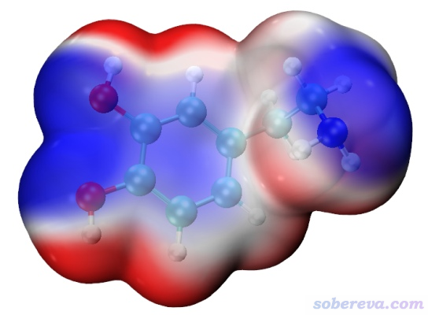
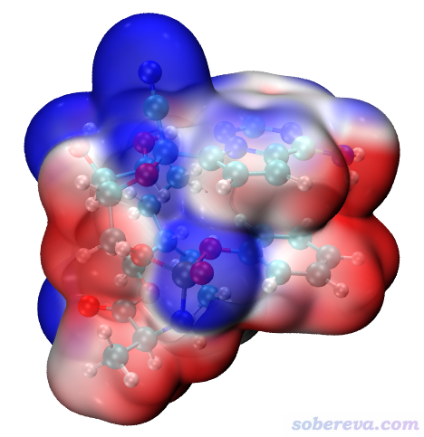

**巨幅降低Multiwfn结合VMD绘制分子表面静电势图耗时的一个关键技巧**

A key skill that greatly reduces the time-consuming of using Multiwfn combined with VMD to draw molecular surface electrostatic potential maps

文/Sobereva@[北京科音](http://www.keinsci.com)  2021-Jun-30

## 1 前言

Multiwfn（<http://sobereva.com/multiwfn>）有十分强大的静电势分析功能，按照《使用Multiwfn+VMD快速地绘制静电势着色的分子范德华表面图和分子间穿透图》（<http://sobereva.com/443>）的做法还可以非常方便地结合VMD绘制效果很好的分子表面静电势图，此方法已经被大量文章所使用。此文中有一个脚本是ESPiso.bat，它会调用Multiwfn来分别计算电子密度和静电势的格点数据并导出为cub格式，之后就可以靠VMD绘制静电势着色的电子密度等值面图。文中提到，由于计算静电势格点数据耗时很高，所以强烈建议让Multiwfn调用Gaussian自带的cubegen程序来实现这一步，因为cubegen计算静电势格点数据比Multiwfn内部代码速度更快。

有一日笔者突然想到一个主意：VMD里将静电势映射到电子密度等值面上的时候是利用电子密度等值面附近格点上的静电势插值来实现的，这些被实际利用到的格点只不过占所有格点的很小比例，如果在Multiwfn计算静电势的时候忽略掉其它格点（即不计算距离范德华表面较远的格点的静电势），不就能巨幅节约计算静电势格点数据步骤的耗时？笔者遂将这个想法实现进了Multiwfn，发现耗时降低了一个数量级，以前很难算得动的体系现在都能算得很轻松，而且比调用cubegen的时候耗时还低得多！下面就对这个极为重要的节约耗时的方法做一下具体说明。读者必须用2021-Jun-30及以后更新的Multiwfn版本。

## 2 设置方法

在Multiwfn的settings.ini里有一个参数ESPrhoiso，默认为0，代表不使用这种降低耗时的方法。如果设为某个不为0的值，比如设为0.001，就代表在通过主功能5计算静电势格点数据的时候，在0.001 a.u.电子密度等值面附近的格点才被计算静电势，而其它格点的静电势直接被当做0。为了方便，这个参数也可以通过命令行来设置，比如可以写Multiwfn nico.wfn -ESPrhoiso 0.001。用命令行参数设置的优先级高于settings.ini里的设置。

由于这个做法节约耗时效果极佳，而且对所得图像质量没有任何不良影响，因此从2021-Jun-30更新的Multiwfn开始，在自带的ESPiso.bat和ESPiso.sh脚本里已经默认加了-ESPrhoiso 0.001选项。因此在计算静电势格点数据的时候你会从Multiwfn的窗口中看到类似以下提示：  
Note: ESP will be calculated only for the grids around isosurface of electron density of 0.001000 a.u.  
 Detecting the grids for calculating ESP...  
 Number of grids to calculate ESP:       56473  
这里Multiwfn首先计算了电子密度格点数据，然后判断出共有56473个格点在电子密度0.001 a.u.等值面附近，因此需要之后被计算静电势。

显然，使用《使用Multiwfn+VMD快速地绘制静电势着色的分子范德华表面图和分子间穿透图》（<http://sobereva.com/443>）里的ESPiso.vmd脚本在VMD中绘图的话，你想绘制哪个电子密度等值面的静电势着色图，ESPrhoiso就应该设多少。比如你设ESPrhoiso为0.001，那么若在VMD里把电子密度等值面手动改为0.002，等值面颜色就会很古怪了。

使用这种节约耗时的做法时不能让Multiwfn调用cubegen来算静电势格点数据，否则没有效果。

下面把Multiwfn的上述节约耗时的做法的细节交代一下，感兴趣的读者可以了解一下，一般用户不用看。在settings.ini里有个ESPrhonlay参数，下面简写为n，其值默认为1。Multiwfn会对每个格点进行检测，看看围绕它周围的n层格点里是否电子密度有的大于ESPrhoiso而有的小于ESPrhoiso，如果是的话，则这个格点就被视为电子密度等值面附近的格点（边界格点），故需要被计算静电势。例如n=1，就需要对当前格点周围26个格点进行检验，如果n=2就需要对周围两层厚度的共124个格点进行检验。实际发现n=2时被判断为边界格点的数目比n=1时大约多一倍，因此静电势计算耗时也多一倍左右。n=2的时候是绝对不牺牲所得图像质量的，而用更便宜的n=1的时候往往会造成VMD里显示的分子表面静电势图在个别地方颜色有轻微瑕疵（轻微发白，白色对应静电势为0的情况），这大抵是VMD对静电势插值时利用到了与边界格点相邻的没有计算静电势的格点所致，而这样的格点的静电势被当成0，和周围边界格点的静电势相差太大。为了弥补这个问题，Multiwfn自动会在计算完所有边界格点的静电势后，对所有非边界格点进行循环，如果发现某个非边界格点的上下左右前后的格点里存在边界格点的话，就用它的静电势当做当前这个非边界格点的静电势。实测n=1在这样处理情况下得到的图像效果和n=2没有任何区别，而比用n=2便宜一倍。因此ESPrhonlay参数默认是1，这是非常安全的，不损害图像视觉效果。

## 3 实际加速效果测试

### 3.1 小分子：多巴胺

这里对实际耗时进行对比测试。第一个体系是下图所示的多巴胺，共22个原子，波函数是B3LYP/6-311G**计算得到的，其表面静电势图如下

此例笔者用Intel i7-10870H（8核）普通家用CPU在Win10 64bit下进行测试，cubegen是G16 B.01自带的，测试的是Medium quality grid的设置下计算静电势格点数据：

Multiwfn内部代码算静电势：179秒（对均匀分布的共98*82*67=538412个点计算了静电势）  
Multiwfn内部代码算静电势 -ESPrhoiso 0.001：10秒（只对等值面附近28374个点计算了静电势）  
Multiwfn调用cubegen算静电势：33秒（对均匀分布的共98*82*67=538412个点计算了静电势）

可见，如果以默认情况，即用Multiwfn内部代码计算矩形盒子里所有格点的静电势，即便对这么个小分子耗时也是相当高的，花了三分钟。而使用ESPrhoiso设置后，由于被计算的28374个点只占全部538412个点的5%，耗时低了约20倍！比调用cubegen耗时还低得多！

如果直接用《使用Multiwfn+VMD快速地绘制静电势着色的分子范德华表面图和分子间穿透图》一文里的ESPiso.bat进行计算，由于默认计算的是Low quality grid的静电势格点数据，在-ESPrhoiso 0.001设置下仅需4秒即可算完，真是超快。

### 3.2 较大分子：瑞德西韦

下面再看更大的体系，瑞德西韦，共77个原子，波函数在B3LYP/6-31G*下产生，其表面静电势图如下。用的几何结构是笔者在《使用Molclus结合xtb做的动力学模拟对瑞德西韦(Remdesivir)做构象搜索》（<http://bbs.keinsci.com/thread-16255-1-1.html>）中做构象搜索得到的最稳定结构。

这里测试的是High quality grid设置下的静电势格点数据计算耗时。测试在双路E5-2696v3共36核机子上完成，用的是Linux版Multiwfn和cubegen。耗时如下  
Multiwfn内部代码算静电势 -ESPrhoiso 0.001：69 秒  
Multiwfn调用cubegen算静电势：105 秒

可见即便对于较大的体系、即便对于很多格点数、即便对于CPU核数较多的情况，利用本文的降低耗时的技巧，耗时也明显低于调用cubegen。

笔者也尝试了用i7-10870H（8核），直接用《使用Multiwfn+VMD快速地绘制静电势着色的分子范德华表面图和分子间穿透图》一文里的ESPiso.bat对瑞德西韦进行计算，涉及到计算Medium quality grid的电子密度格点数据和Low quality grid的静电势格点数据，在-ESPrhoiso 0.001设置下总共仅花了55秒就算完了。也就是说，在普通个人计算机上获得上面那张静电势图的计算代价还不到一分钟！这可谓相当理想了。

## 4 总结

本文介绍了一种特别重要的在Multiwfn结合VMD绘制静电势着色的分子表面图的过程中巨幅降低静电势计算耗时的方法。对于一般体系，用这种方法比让Multiwfn调用cubegen来算静电势格点数据还要耗时低得多，因此装有Gaussian的用户也没必要再让Multiwfn调用cubegen了，而对于没有Gaussian的用户，此文的做法更是带来巨大的福音。而且相对于调用cubegen，直接用Multiwfn自己的代码计算静电势还有一个好处就是可以监控计算进度，而调用cubegen的时候则完全被蒙在鼓里。

值得一提的是，根据笔者对其它体系的测试发现，对于目前的Multiwfn来说，体系越大，本文做法相对于调用cubegen的耗时优势越小。对于非常大的体系，比如150~200个原子及以上的，调用cubegen则大概率会快于利用本文介绍的方法。所以如果你要算非常大体系，比如《巨大体系的范德华表面静电势图的快速绘制方法》（<http://sobereva.com/481>）里所示例的体系，如果有cubegen能调用的话还是建议调用cubegen。
