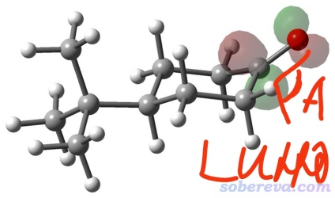
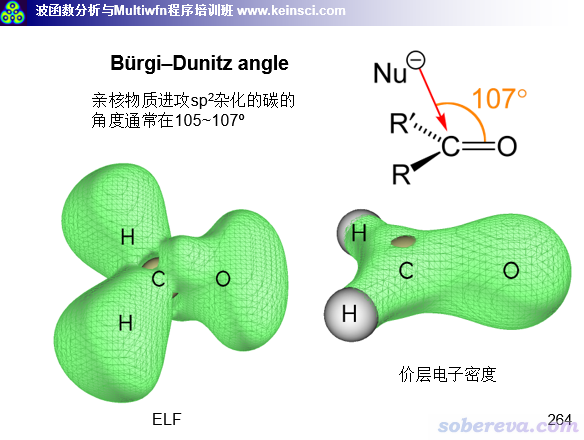
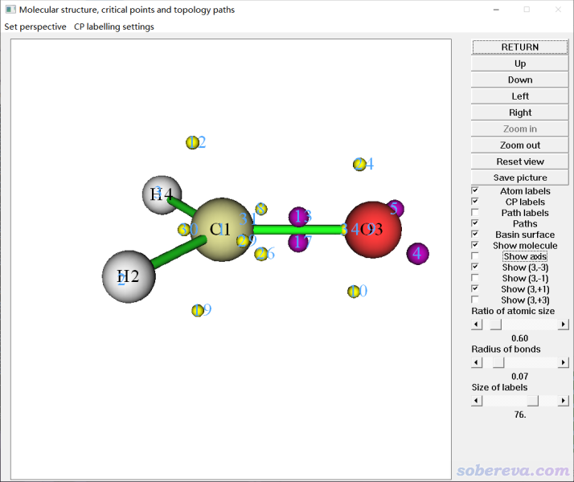
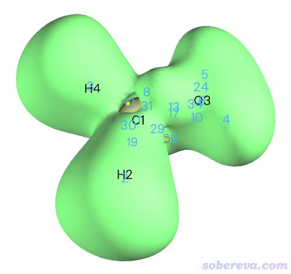
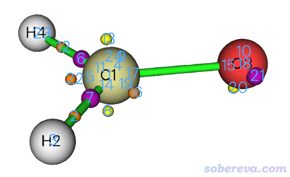
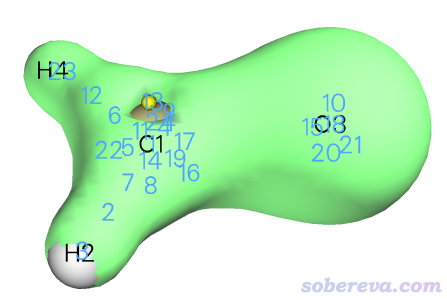
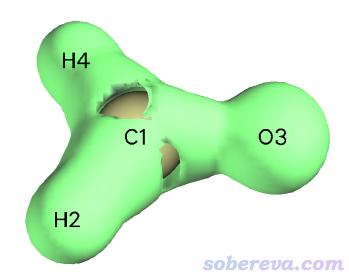
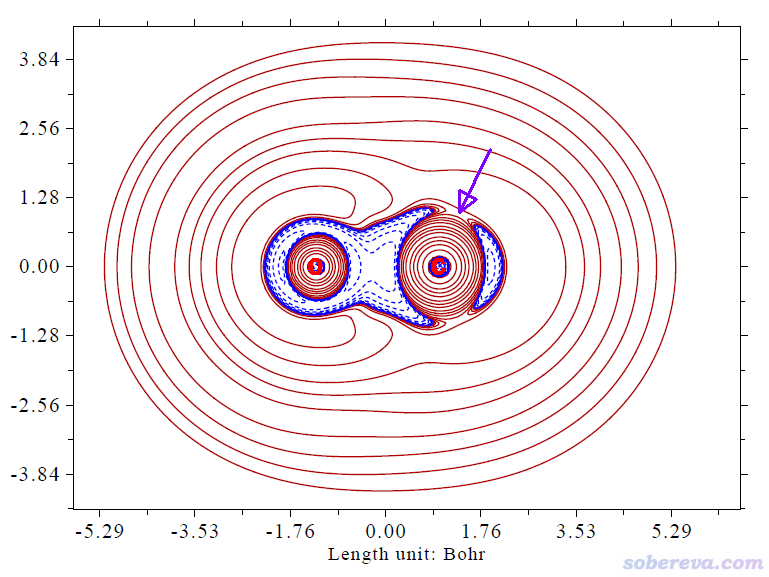
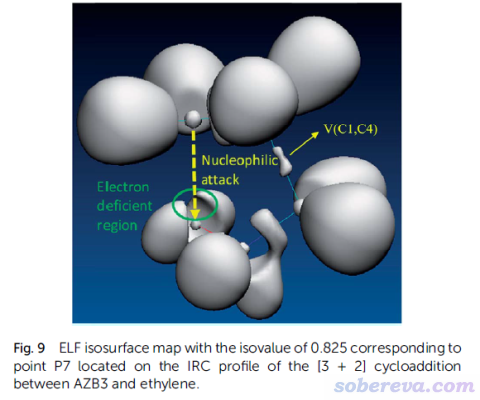
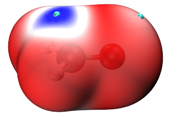

**通过电子定域化函数(ELF)、价层电子密度分析讨论亲核进攻的方向**

Studying direction of nucleophilic attack via electron localization function (ELF) and valence electron density analysis

文/Sobereva@[北京科音](http://www.keinsci.com)

First release: 2021-Jul-6   Last update: 2023-Jul-5

### 1 前言

最近有人在思想家公社QQ群问我，怎么计算下图的角度，其目的是解释亲核进攻方向问题

实际上，考察这个问题靠计算这个LUMO的角度不是什么好的做法。本身LUMO的物理意义就不严格，其分布特征受计算级别影响较大，而且跟亲核反应的关系也不如概念密度泛函理论里面的福井函数f+和双描述符紧密。

讨论亲核进攻方向这个问题真正比较好的做法使用Multiwfn做电子定域化函数（ELF）或价层电子密度分析。在笔者的量子波函数分析与Multiwfn程序培训班（<http://www.keinsci.com/workshop/WFN_content.html>）里正好专门有一页ppt和这个问题直接相关：

ppt中所示的伯基－丹尼兹角度（Bürgi–Dunitz angle）是亲核加成立体电子效应的一个术语，它描述了亲核加成反应中亲核试剂进攻亲电底物过程中的角度和方式。从上面的等值面图可见，ELF展现出在亲核进攻的方向上正好有一块区域的ELF较小，体现出电子在这里定域性较弱。虽然ELF的大小和电子密度的大小在原理上并没有直接的正相关性，但ELF在实际中可以表现出价层区域的电子由于形成孤对电子、共价键导致的自发凝聚的位置，因此上图中ELF较小的地方体现了这个碳原子的价层电子相对发散的区域。由于这种地方原子核被价电子遮挡程度最低，明显最容易被亲核进攻。关于ELF更多的知识看《ELF综述和重要文献小合集》（<http://bbs.keinsci.com/thread-2100-1-1.html>）。

笔者在2018年发表的Revealing Molecular Electronic Structure via Analysis of Valence Electron Density（<http://www.whxb.pku.edu.cn/EN/10.3866/PKU.WHXB201709252>）一文中专门讨论了价层电子密度的概念以及在化学问题的实际分析中的应用。价层电子密度是价层区域电子哪里多、哪里少的最简单直接的衡量。从上图可以看出，在易于发生亲核进攻的方向，碳的价层电子密度明显小于周围的区域，因此原子核在这个方向被屏蔽得最少，直接解释了伯基－丹尼兹角度的本质。

由上可见，在讨论亲核反应方向问题时，直接考察ELF、价层电子密度就可以，等值面图用Multiwfn可以非常快捷方便地画出来。但是，有时候我们需要做进攻夹角大小的讨论、在不同类似体系间横向对比。具体怎么将角度定量化没有唯一方法，笔者建议用Multiwfn对这两个函数做拓扑分析寻找恰当的临界点，之后测量一下它与C=O键的夹角，就能进行定量说明了。

下面就给出使用Multiwfn做拓扑分析考察亲核进攻角度的具体操作例子。作为例子的分子是甲醛，B3LYP/6-31G*下做几何优化得到的wfn文件可以在<http://sobereva.com/attach/606/H2CO.wfn>下载。Multiwfn程序可以在<http://sobereva.com/multiwfn>免费下载，如果不熟悉此程序的话，务必看《Multiwfn入门tips》（<http://sobereva.com/167>）和《Multiwfn FAQ》（<http://sobereva.com/452>）。如果你都不会绘制上面的等值面图的话，强烈建议看手册4.5节，有丰富的例子。

笔者之前有一篇博文《使用Multiwfn做拓扑分析以及计算孤对电子角度》（<http://sobereva.com/108>），其中第3节也介绍了Multiwfn对ELF做拓扑分析，并通过对应孤对电子的ELF极大点计算了孤对电子的角度。建议读者也仔细看看，和本文有密切联系。

### 2 电子定域化函数的拓扑分析

启动Multiwfn，输入H2CO.wfn的路径并载入之，之后输入  
2  //拓扑分析  
-11  //切换被分析的函数  
9  //ELF  
6  //在球形区域内设置一批初猜点  
-1  //以每个原子核为中心的球形区域内随机分布一批初猜点来搜索ELF的临界点，默认每个原子附近3 Bohr内撒1000个点（注：能找到哪些临界点和初猜位置有关。此选项每次撒的点的位置是随机的。选一次-1可能只能找到一部分临界点，之后再选一次或多次-1可能还能再找到其它的临界点）  
-9  //返回  
0  //观看结果

把窗口界面右侧的设置改成下图的情况，就看到下图的图像了

图中的小球是当前被分析的函数的临界点（critical point），即函数梯度为0的点，青色的文字是临界点序号  
。黄球是(3,+1)型临界点，相当于在某个方向是极大点但在与之正交的方向是极小点。紫球是(3,-3)型临界点，即ELF的极大点。从上图可见，与亲核进攻方向对应的ELF临界点是12或19号(3,+1)临界点。接下来我们只需测量一下这个临界点与C1-O3的夹角即可。

点图形界面右上角的RETURN按钮关闭窗口，然后输入  
-9  //测量临界点和原子间的几何关系  
c12 a1 a3  //c代表临界点，a代表原子  
测量的结果是106.67度。可见和常见的伯基－丹尼兹角度范围很相符。

值得一提的是，在Multiwfn里可以把临界点和等值面图绘制在一起，这样对临界点的位置和意义可以理解得更清楚。这里就把ELF等值面图也给画出来。输入以下命令  
q  //退出测量几何关系的界面  
-10  //返回主菜单  
5  //计算格点数据  
9  //ELF  
2  //中等质量格点  
-1  //观看等值面图

在图形界面里把Isosurface value改成0.53，此时可以看到下图。可见确实第12号临界点就是对应价层ELF很小的那个区域。具体来说，这个位置在碳原子的径向方向是ELF极大点，而在其它方向是ELF极小点，因此这个位置是ELF的(3,+1)型临界点。

### 3 价层电子密度的拓扑分析

下面做H2CO.wfn的价层电子密度的拓扑分析。载入文件后输入  
6  //修改波函数  
34  //将内层轨道占据数设为0。之后对电子密度进行分析就相当于对价层电子密度进行分析  
-1  //返回  
2  //拓扑分析（默认被分析的函数就是电子密度，所以不用改了）  
6  //在球形区域内设置一批初猜点  
-1  //以每个原子核为中心的球形区域内随机分布一批初猜点来搜索价层电子密度的临界点  
-9  //返回  
0  //观看结果

恰当设置后，看到下图。

其中第8、13号临界点对应的是价层区域电子密度最低的位置。点图形界面右上角RETURN按钮关闭窗口，然后输入  
-9  //测量临界点和原子间的几何关系  
c13 a1 a3  
测量的结果是95.47度。这个角度和基于ELF临界点测量的有一定出入，毕竟这两个函数的本质特征差异很大。由于夹角大于90度，因此还是能一定程度解释进攻方向性问题的。

之后输入  
q  //退出测量几何关系的界面  
-10  //返回主界面  
5  //计算格点数据  
1  //电子密度  
2  //中等质量格点  
-1  //观看等值面图  
调节显示方式后得到下图，可见13号临界点就是对应的价层电子密度最低的位置。

### 4 电子密度拉普拉斯函数

最后，再看另一个函数，电子密度拉普拉斯函数，它也能用来解释亲核进攻取向问题。笔者在Revealing Molecular Electronic Structure via Analysis of Valence Electron Density（<http://www.whxb.pku.edu.cn/EN/10.3866/PKU.WHXB201709252>）一文中对这个函数做了简要介绍，并且将它、ELF以及价层电子密度三者的共性和差异做了对比讨论，很建议大家看看。在很多问题上，这三个函数的分析结论是定性一致的。

电子密度拉普拉斯函数也可以用类似前面的例子通过Multiwfn做拓扑分析。不过比起ELF来说，对电子密度拉普拉斯函数做拓扑分析没有额外优势，而且更耗时，而且由于这个函数变化特别剧烈，收敛到临界点也往往困难得多，因此这里只是绘图考察一下。

我们先用Multiwfn绘制电子密度拉普拉斯函数的等值面图。载入H2CO.wfn后依次输入  
5  //计算格点数据  
3  //电子密度拉普拉斯函数  
3  //高质量格点  
-1  //观看等值面图

把Isosurface value设为-0.01，取消掉Show both sign复选框前的对钩，现在看到下图

图中的等值面把电子密度拉普拉斯函数明显为负的区域展现出来了。这个函数为负的区域体现的是价层电子密度凝聚的区域。由图可见在碳的上方有一块空缺，实际上这个区域电子密度拉普拉斯函数为正，体现出电子在这个地方是发散的，显然容易被亲核进攻。

作一个平面图可以看得更清楚。在主功能0里根据笛卡尔坐标轴可见，如果绘制X=0的YZ平面，就可以正好得到顺着C=O键键轴并垂直于分子的截面图，电子密度拉普拉斯函数在这个截面上的分布可以更清晰展现亲核进攻的角度，下面就绘制一下。回到主菜单，然后输入  
4  //绘制平面图  
3  //电子密度拉普拉斯函数  
2  //等值线图  
[按回车用默认格点数]  
3  //YZ平面  
0  //X=0  
马上图就弹出来了。输入以下命令调节一下作图设置让效果更好  
3  //修改等值线设置  
15  //用适合发表文章的设置  
1  //保存并返回  
-1  //重新绘图

现在看到下图

图中我用紫色箭头标注了亲核进攻最容易发生的朝向。可见电子密度拉普拉斯函数能很好地体现亲核进攻的方向性。

### 5 总结

本文介绍了怎么通过对ELF和价层电子密度做拓扑分析来说明亲核进攻的角度，还简单示意了怎么绘制等值面图对进攻的取向性予以直观的展现。本文只考虑了一个最简单的体系H2CO，大家可以将此文涉及的考察方式用于讨论其它亲核进攻取向的问题，比如SN2反应。下文是笔者参与的一篇3+2环加成反应的研究文章RSC Adv., 5, 62248 (2015) DOI: 10.1039/c5ra08614k里的图，ELF等值面体现出下方的分子画绿圈的部位有明显被亲核进攻的倾向性。

本文的方法所给出的亲核进攻的角度只是适合用来定性讨论、解释已知事实，不要把角度的数值过度讨论，除非是类似物之间的对比，比如考察取代基对进攻角度的影响。想获得严格、准确的进攻角度，还是应当优化出过渡态，然后再进行测量。

### 补充：使用局部电子附着能讨论亲核进攻角度

在《使用Multiwfn通过局部电子附着能(LEAE)考察亲核反应位点、难易及弱相互作用》（<http://sobereva.com/676>）中介绍的局部电子附着能（LEAE）也可以用来讨论亲核进攻方向。按照文中的做法对B3LYP/6-31+G**级别计算的H2CO的波函数绘制的电子密度0.004 a.u.等值面的LEAE着色图如下所示，色彩刻度从-0.15到0.0 a.u.按照蓝-白-红变化，青色小球是表面LEAE极小点。由此图的蓝色区域可以清楚看出亲核进攻发生的方向，结论和前文的方法是一样的。

