**全面揭示各种尺寸的碳单环体系的独特的光学性质**

Comprehensive revelation of the unique optical properties of carbon monocyclic systems of various sizes

文/Sobereva@[北京科音](http://www.keinsci.com)  2021-Jul-31

## 0 前言

18碳环（cyclo[18]carbon）是18个碳组成的环状体系，有着与传统化学体系截然不同的几何和电子结构。在Kaiser等人于Science, 365, 1299 (2019)首次报道在凝聚相中观测到18碳环后，新颖的18碳环以及其它的碳单环体系就受到了化学家们的广泛关注，不断有大量理论研究工作发表。北京科音自然科学研究中心（<http://www.keinsci.com>）在18碳环及类似物方面已开展了大量工作，对其各方面特征做了广泛的研究，包括成键本质、芳香性、电子离域、电子激发、弱相互作用、振动特征、动力学行为、外电场和离子的影响等，并得到了同行的广泛关注。已发表的文章、大量深入浅出的评述和相关博文见汇总页面：<http://sobereva.com/carbon_ring.html>。

近期，北京科音自然科学研究中心的卢天和江苏科技大学的刘泽玉等人在Chem Asian J.期刊上发表了名为Remarkable Size Effect on Photophysical and Nonlinear Optical Properties of All-Carboatomic Rings, Cyclo[18]carbon and Its Analogues的通讯文章（**Chem. Asian J., 16, 2267 (2021)**），通过量子化学手段全面系统地揭示了从cyclo[6]carbon到cyclo[30]carbon各种尺寸碳环的独特的光物理和非线性光学特征，在下面将做简要介绍、评述和一些相关讨论，非常欢迎大家阅读论文原文<http://doi.org/10.1002/asia.202100589>，在<http://sobereva.com/carbon_ring.html>里的网盘链接里可以下载。这已是北京科音自然科学研究中心在学术期刊上发表的第7篇关于碳环体系的研究文章。

下图为研究中涉及的最小、中等和最大尺寸的碳环。所有碳环在ωB97XD/def2-TZVP级别下优化的无虚频结构都可以在论文的补充材料里获取。

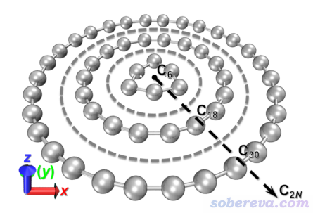

## 1 碳环的稳定性

碳环体系是否有实际应用价值，和它的稳定程度关系密切，十分不稳定的结构很难有实际应用。为了简单评估不同碳环的稳定性，文中定义了平均原子化能，即原子化能除以碳环上的原子数，在精度较好的ωB97M-V/def2-QZVPP级别下的计算结果如下所示

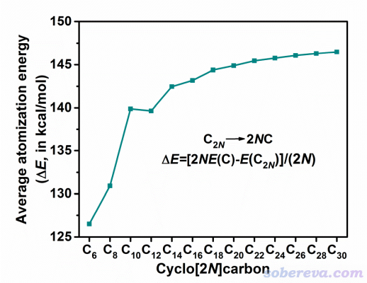

可见，从C14开始，碳环越大，平均原子化能也越大，因此仅仅单纯从C-C成键角度来说，环越大越稳定。而对于更小的环，其电子结构的变化随着环上原子数的增加还没有趋于稳定，不同的环之间电子结构差异性较强，因此从上图可以看到C12的平均原子化能反倒比C10还更小。类似现象在卢天和刘泽玉等人研究不同尺寸碳环的振动谱时也发现了，见Chem Asian J., 16, 56-63 (2021)。还可以看到，在环比较小时，增大环尺寸令平均稳定化能增加的幅度明显比环较大的时候更大。这有一定可能是在环较小时环张力较大，随着环尺寸增大环张力会迅速减小，而当环较大时这种效应随环尺寸的变化就相对弱一些了。从上图还可以看到对cyclo[2N]carbon，每当N从偶数变成奇数时平均原子化能增加得相对最快，比如C8->C10、C12->C14、C16->C18，这在很大程度上是因为C10、C14、C18...这样的体系中in-plane pi轨道和out-of-plane pi轨道上的电子数满足Huckel的4n+2芳香性判据，电子共轭作用稳定化了体系。18碳环的芳香性和电子共轭特征在Carbon, 165, 468-475 (2020)和J. Mol. Model., 27, 42 (2021)中都有深入分析讨论，建议感兴趣的读者阅读。

## 2 前线轨道能级

文中发现从C16开始，碳环的前线轨道能级有十分规律性的变化，在文章的补充材料里面给出了如下的拟合关系

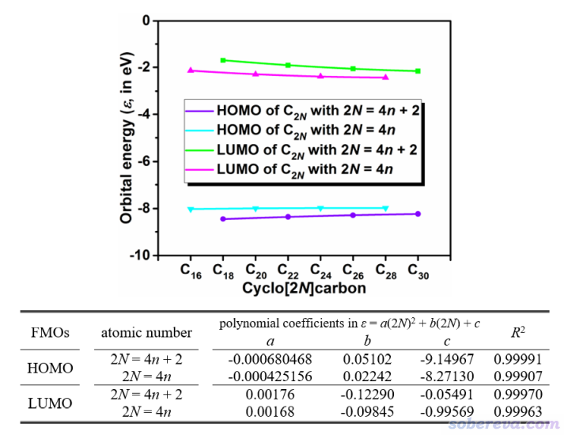

由图可见对于N的奇偶性相同的cyclo[2N]carbon碳环来说，随着环的增大，LUMO能级逐渐下降而HOMO能级逐渐上升。这和众所周知的共轭寡聚物类体系随着链的增长，HOMO-LUMO gap逐渐减小是同样的道理。文中根据cyclo[2N]carbon的N的奇偶性不同，对HOMO、LUMO能级随环尺寸的变化分别拟合了二次多项式，如上图可见R^2好得惊人，基本是完美的1.0。这体现出，任意尺寸的偶数个碳的碳环类体系的前线轨道能级都可以直接用本文给出的关系式来精确预测！注：此文是对ωB97XD/def2-TZVP级别计算的轨道能级拟合的，文章补充材料有细节。

在此文的补充材料里还给出了通过Multiwfn绘制的各个尺寸碳环的态密度图（DOS），以及sigma轨道、平面内pi轨道和平面外pi轨道各自对应的分数DOS（PDOS）图，相关知识和绘制方法见《使用Multiwfn绘制态密度(DOS)图考察电子结构》（<http://sobereva.com/482>）。从这些图可以看出除了最小的C6以外，碳环的sigma占据轨道的能量都低于pi轨道，而平面内和平面外pi轨道的能级分布范围则没有显著差异。

## 3 电子吸收光谱

在ωB97XD/def2-TZVP级别下通过TDDFT方法计算的各种尺寸碳环的电子吸收光谱如下所示

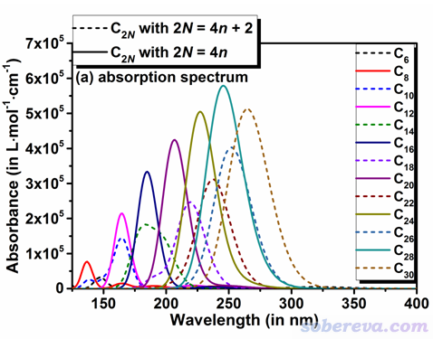

可见随着环尺寸增加，碳环的最大吸收峰位置逐渐向高波长移动，并且吸收强度也逐渐增加。但所有计算的碳环的最大吸收峰位置都在紫外范围，因此至少在不考虑外界因素的影响时它们自身是无色的。还可以看出N为偶数的cyclo[2N]carbon碳环的吸收强度比起相邻的N为奇数的碳环明显更强。

文中对最大吸收波长与环上的碳数的关系进行了拟合，如下所示

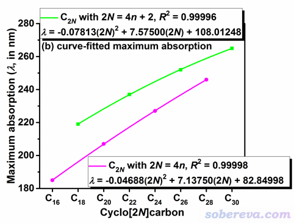

可见根据N为奇数和偶数分别拟合的二次函数关系极度理想，R^2几乎是精确的1.0，因此通过本文提出的关系式可以非常方便地准确预测任意大碳环的最大吸收峰位置，而完全不必再做实际计算。拟合曲线的极大点位置，也即随着碳数增加吸收峰位置会最终收敛到常数的位置，是小于可见光波长下限（约380 nm）的，这说明无论多大的碳环都不会显色。但顺带一提，如《一篇文章深入揭示外电场对18碳环的超强调控作用》（<http://sobereva.com/570>）介绍的ChemPhysChem, 22, 386-395 (2021)一文中所揭示的，强电场、某些阳离子能够令原本无色的碳环体系显色。

《使用Multiwfn做空穴-电子分析全面考察电子激发特征》（<http://sobereva.com/434>）一文介绍的空穴-电子分析是研究电子激发本质的极为重要的分析方法，它将电子激发特征描述为直观的空穴→电子的跃迁，适合任意体系。这种分析也被此文用于了考察不同尺寸碳环的电子激发特征上。这些碳环最大吸收峰对应的电子激发的空穴-电子分析结果如下所示，蓝色和绿色分别是空穴和电子的等值面。

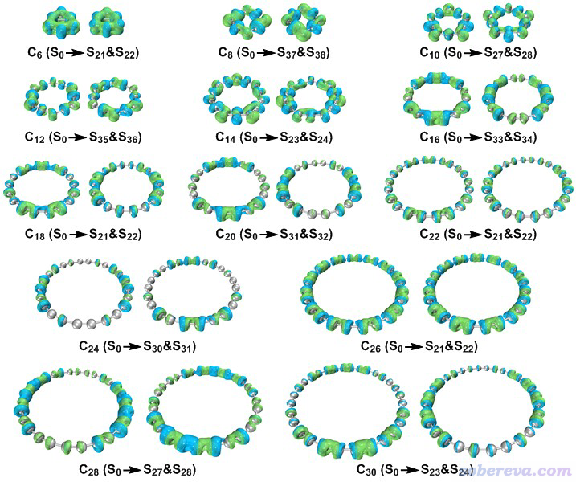

由于上面这些碳环的空穴和电子的等值面都是环绕着C-C键轴分布的，因此不管是什么碳环，最大吸收峰都是由pi-pi*跃迁所导致的，而不涉及sigma轨道。18碳环的电子激发特征在Carbon, 165, 461-467 (2020)中被专门深入研究过，当前的研究证实了各种其它尺寸碳环的光学吸收与18碳环在本质上是有显著共性的。

《正确地认识分子的能隙(gap)、HOMO和LUMO》（<http://sobereva.com/543>）一文说过HOMO-LUMO gap与optical gap（波长最大的吸收峰位置）并没有密切的正相关性。不过，对于同系物，而且吸收峰对应的电子激发特征是相同的情况，二者之间还是可能有明显正相关性的。本文考察了碳环的HOMO-LUMO gap与最大吸收波长（对当前来说相当于optical gap）之间的关系，如下所示，

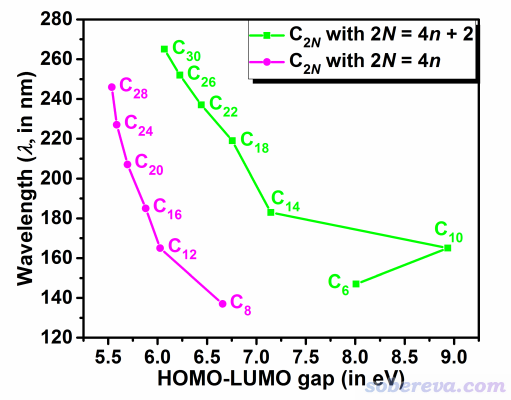

可见除了具有特殊性的C10以外，当cyclo[2N]carbon的N为特定奇偶性时，都是HOMO-LUMO gap越小最大吸收峰波长越大。上图中绿线和粉线分别对应N为奇数和偶数的情况，可见前者的情况HOMO-LUMO gap明显比后者的更大，这和前者具有的芳香性有密切关系，众所周知芳香性特征会令体系具有相对更大的HOMO-LUMO gap。

## 4 非线性光学特征

文中在CAM-B3LYP/aug-cc-pVTZ(-f)级别下对各种尺寸碳环的非线性光学特征进行了全面的研究。首先考察了静态极化率σ(∞)随环尺寸的变化，如下所示。笛卡尔轴和碳环的相对关系如本文第一张图所示，碳环是平行于XY平面的

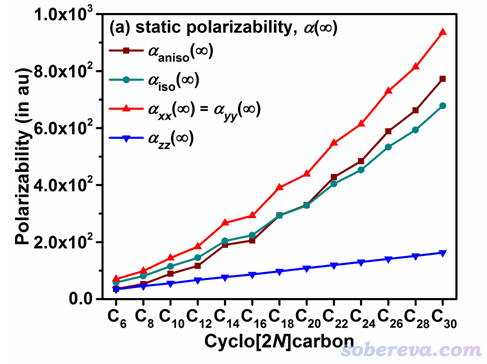

可以看到环越大，体系的极化率就越大。这些碳环的极化率有着极强的各向异性，平行于碳环方向的极化率分量远大于垂直于碳环的分量，而且碳环越大它们相差得越悬殊，这体现在极化率的各向异性σaniso越大上。这样的现象是意料之中的，因为平行于碳环方向电子可以充分地离域，因此可以相当容易地被外电场所极化，这在《一篇文章深入揭示外电场对18碳环的超强调控作用》（<http://sobereva.com/570>）中通过加电场导致的密度差图也充分展现了。而且碳环越大的时候，由于在外场下电子有越大的可移动的范围，电子在平行于碳环的方向对外场的响应程度就越大，体现在上图的σxx越大上。虽然垂直于碳环的极化率分量σzz也随碳原子数增加而增大，但增加只是线性的，而不是像σxx增大得那么快且有一定二次函数特征。

文章的补充材料里将碳环的平均静态极化率与碳原子数的关系通过二次函数进行了拟合，如下所示，可见拟合得颇为理想，利用此关系式可以用来准确预测任意大尺寸碳环的极化率。

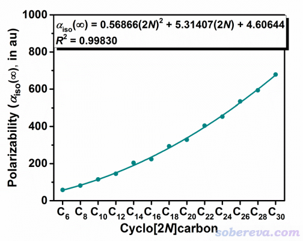

在《使用Multiwfn通过单位球面表示法图形化考察（超）极化率张量》（<http://sobereva.com/547>）中笔者介绍了一种非常有用的图形化展现(超)极化率各向异性的方法，称为单位球面表示法。文中对18碳环绘制了这种图，如下所示，由图可直观、清楚地看出平行于碳环方向的极化率分量远大于垂直于碳环的分量，而且在各个方向上分量是平滑地变化的

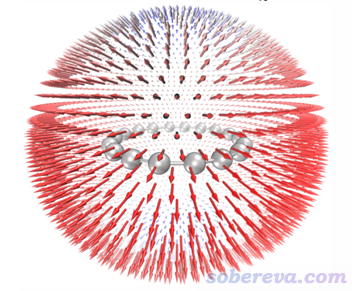

这些碳环体系都有中心对称性，这类体系的第一超极化率精确为0，所以没有纳入文章的研究。但即便碳环自身没有第一超极化率特征，但它有可能能作为donor-pi-acceptor类体系的较好的pi-linker，使整个体系有较大的第一超极化率。

文章还考察了不同碳环的静态和动态第二超极化率γ，如下所示。它们的各向异性以及随碳原子数的变化趋势和极化率相似，但是平行于碳环的γ分量随碳原子数增加提升得远比极化率快得多。这些碳环对外场的响应与外场频率有密切相关性，外场波长越小，γ就越大。

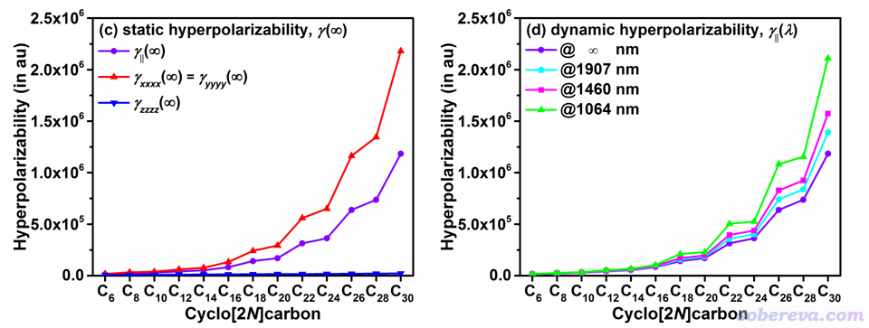

文中探索了γ与环上的碳原子数之间的解析关系。如下所示，静态和动态平均第二超极化率γ||与碳原子数之间的关系都可以通过三次多项式关系极好地表达出来，拟合的R^2几乎精确为1.0。图中也可以看出γ的变化趋势与cyclo[2N]carbon的N的奇偶性有密切联系，必须对N为奇数和为偶数的情况分别拟合，这也反映了芳香性对非线性光学性质的内在影响。可以看出满足Huckel规则的N为奇数的cyclo[2N]carbon碳环的γ比N为偶数的不满足Huckel规则的整体更大，可能是由于前者的电子的整体离域性更好，使得电子在平行于碳环的方向更容易迁移而对外电场能够有更强的响应。

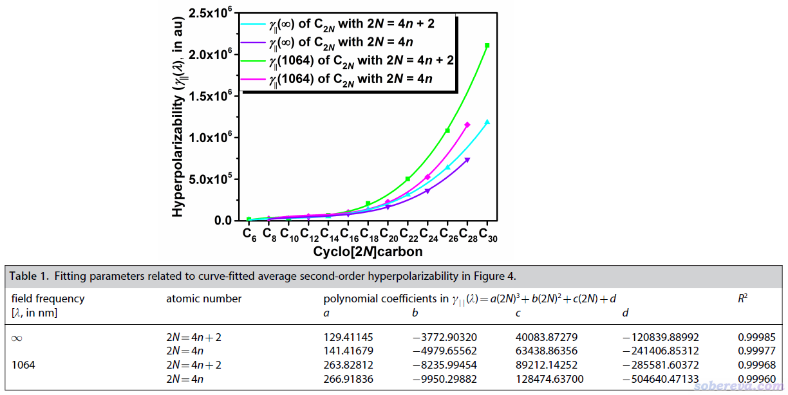

早在1993年，Politzer等人就在J. Chem. Phys., 98, 4305中指出极化率与分子体积存在普遍的正比关系，此关系还被利用于计算原子在化学体系中的极化率，见《使用Multiwfn计算分子中的原子极化率》（<http://sobereva.com/600>）。本文也考察了一下这个关系对碳环体系的适用性，结果如下所示，体积根据《谈谈分子体积的计算》（<http://sobereva.com/102>）介绍的方法利用Multiwfn计算。可见确实随着碳环体积的增加，极化率有明显增加，而第二超极化率增加得明显更快。

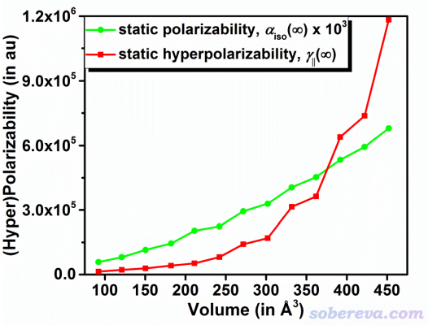

在文章的补充材料表3里还对比了一下C18和同样碳数的线型共轭体系H(C18)H的(超)极化率，以探究环形结构和线型结构的差异性。对比发现垂直于18碳环和垂直于H(C18)H链方向上的(超)极化率差异不大，环状结构并没带来什么特别之处。但是在顺着H(C18)H链的方向，H(C18)H的(超)极化率的分量显著大于18碳环的平行于环方向的分量，这应当是因为H(C18)H在顺着链方向上有比同样碳数的碳环更宽广的电子离域空间范围所致。

## 5 总结

本文介绍的Chem Asian J.文章全面、系统地揭示了新颖的碳环类体系的光学吸收和非线性光学性质，着重考察了环尺寸和cyclo[2N]carbon的N的奇偶性对结果的影响，并且拟合了非常理想的预测任意大尺寸碳环的HOMO/LUMO能级、最大吸收峰位置以及(超)极化率的公式，可以直接用于精确估计文中没有计算的更大尺寸碳环的这些性质。本文不仅有理论意义，也对碳环体系的实际应用有指导作用。例如本研究发现碳环类体系在紫外区域有非常强的光学吸收，因此有可能被利用于过滤紫外线的材料，而且过滤范围可以通过碳环尺寸来进行精细调节。由于本研究发现碳环有着显著的(超)极化率的各向异性，因此碳环晶体（虽然目前尚未得到）有可能被用于有杰出各向异性特征的非线性光学材料。
