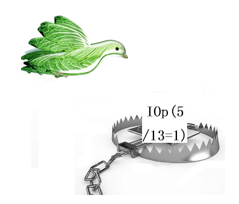

**笔者注：**读者不要说诸如“此文我看了，还是不收敛”、“我用了文中的方法还是不收敛”这类话，然后问我怎么解决，笔者极度反感这种说法。**绝对没有哪个方法能100%保证解决SCF不收敛**。本文绝对没有一条馊主意，所有Gaussian支持的真正有可能能解决SCF不收敛的做法在本文都已经全面列举了，**没有任何遗漏，没有可补充的**。倘若本文的做法都做了尝试还没解决，那也别指望有任何其它方法能解决。才随便试了文中一个做法，或者以不正当的方式（没有真正了解原理的基础上）瞎试几个就说没解决问题，这根本什么也说明不了。要想解决问题，必须认真阅读本文，所有有可能对当前问题有用的方法都依次尝试，有必要的时候几个一起结合使用。本文列举的做法已经把最坏的情况都考虑了，所以出现所谓的“看了本文还是没解决问题”的情况一定是读者还没真正仔细看、认真领会、充分尝试。另外，如果你没量子化学计算的必备知识，必然会导致各种胡算瞎算、胡试瞎试，很可能就算看了此文也依然无法解决或者还有其它硬伤，对这些基础薄弱的读者我强烈建议参加**北京科音初级量子化学培训班（****<http://www.keinsci.com/KEQC>****）完整系统地学一遍怎么正确地做计算**，诸多常见问题自然就迎刃而解了。

**解决SCF不收敛问题的方法**Methods to solve SCF unconvergence problem  
  
文/Sobereva @[北京科音](http://www.keinsci.com/)  
First release: 2010-May-17    Last update: 2025-Mar-17

  

## 1 前言

量子化学计算离不开SCF（自洽场）迭代，如半经验方法、HF、DFT等。在SCF迭代中，由Fock矩阵F对角化获得新的系数矩阵C和轨道能{ε}，然后构造密度矩阵D=C'C'^(T)，其中C'为不含虚轨道的C矩阵，再由D构造新的Fock矩阵，反复进行直到收敛，可以写为F_(1)->C_(1)->D_(1)->F_(2)->C_(2)->D_(2)...。收敛判据不是唯一的，比如Gaussian中用的判据是当前步与上一步的密度矩阵元变化量的最大值和方均根(RMS)以及能量的变化，当数值都小于一定范围就认为已经收敛了。默认判据和设定下多数情况在25步以内能达到收敛。但慢收敛甚至完全不能收敛的情况是经常会遇到的。常见的是迭代后期能量随迭代呈现震荡，直到达到默认的最大步数仍未收敛。也可能能量虽然震荡但总趋势是慢慢降低的，一直迭代下去能收敛，但震荡行为明显拖慢了收敛速度。也可能震荡的规律性不显著，迭代过程能量曲线看上去有随机性，但就是很难达到收敛限。不收敛、难收敛情况的出现有很多数值巧合因素，但有些情况不好收敛是众所周知的，例如：基组含弥散函数、体系处于明显的非平衡构型、HOMO-LUMO能隙较小（过渡金属化合物、成键方式古怪等静态相关较强体系中容易出现此情况）、限制性开壳层(RO)计算、明尼苏达系列泛函。

人们提出过一些方案加速收敛或试图解决不收敛，如DIIS、阻尼方法、温度展宽、能级移动、二次收敛方法等。主流的量化程序，如Gaussian、ORCA中默认就会使用一部分这样的帮助收敛。而这些主流的量化程序为了加速SCF计算耗时，会引入一些数值近似，比如一开始先默认用较低的DFT积分格点、忽略数值较小的积分、Incremental fock方式加速Fock矩阵的构建等等，这些近似有时候会阻碍收敛。

Gaussian中对应SCF不收敛的错误提示是L502出错，并伴随Convergence criterion not met和Convergence failure -- run terminated.的具体提示（但从G16 B.01开始，仅提示Convergence criterion not met而不报错中断）。SCF不收敛怎么办是初学者最最最常问的问题，本文第2节将解决不收敛问题的可行办法进行了汇总，并给出在Gaussian中对应的关键词。缺乏常识的读者千万不要轻易听信计算化学公社论坛（[http://bbs.keinsci.com](http://bbs.keinsci.com/)）以外的网上其它一些地方（尤其是中文的）的关于解决SCF不收敛的说法，那里面的做法很多都是严重误人子弟，白耽误工夫还不有效解决问题。如果读者对其中的DIIS、能级移动、阻尼、温度展宽和二次收敛方法的原理感兴趣，可以阅读本文第3节的详细介绍。

顺带一提，对于Gaussian用户，如果凭经验预感当前体系SCF不容易收敛，或者算的体系比较大，或者遇到SCF不收敛后加了本文提到的帮助收敛的关键词重算，一定要用#P，这样SCF迭代过程的每一轮信息才会输出出来，才能够了解当前已经迭代到了第几轮，能量变化（Delta-E）、密度矩阵元最大变化（MaxDP）和密度矩阵平均变化（RMSDP）是多少，当前离收敛限还有多远（收敛限会在SCF开始之前明确提示）以及迭代过程是否有收敛的趋势。如果没用#P，显然用户会被完全蒙在鼓里。

**关于解决CP2K程序中SCF不收敛问题**，笔者另有一篇文章：《解决CP2K中SCF不收敛的方法》（<http://sobereva.com/665>），其中有些解决思想和本文是共通的。  
**对于ORCA程序**，解决SCF不收敛的策略和本文也很相似，但也有很多其它可用的做法，笔者讲授的**北京科音高级量子化学培训班（**[**http://www.keinsci.com/KAQC**](http://www.keinsci.com/KAQC)**）**中超级全面、深入、系统讲ORCA的那一节里专门详细盘点了并给明了关键词，学一遍就都清楚了。

  

## 2 Gaussian中解决SCF不收敛问题的常用做法

绝对没有哪个或哪些关键词只要加上就一定能解不收敛问题，解决不收敛问题需要在理解关键词含义的基础上反复尝试。以下方法越靠前的往往越值得优先考虑，大多数可以结合在一起使用以得到更好效果。  

- (1) 对于M06、M06-2X等明尼苏达系列泛函可尝试增加泛函积分格点的精度，对于其它泛函这个做法见效几率则比较有限。G09默认是int=fine，相当于(75,302)，可以提升到int=ultrafine，相当于(99,590)，耗时也会增加，收敛的几率也会增加，结果精度也会提升。  
  注：从G16开始，默认就是int=ultrafine了。
- (2) Gaussian会自动在计算初期时降低积分计算精度以加快计算，但有可能因此阻碍收敛。对于使用了弥散函数的情况（其它情况不算）出现不收敛时建议先尝试SCF=NoVarAcc来避免因自动降低积分精度而导致的这个问题。
- (3) 用int=acc2e=12可以增加积分精度，对因为使用大量弥散函数（其它情况不算）导致的大体系难收敛问题奏效几率较大。G09默认的是int=acc2e=10。  
  注：从G16开始，默认就是int=acc2e=12了。
- (4) Gaussian默认使用Incremental Fock方式以近似方式构建Fock矩阵来显著节约迭代过程每一步的时间，但可能因此阻碍收敛。可以用SCF=noincfock避免这个做法。  
  **Hint**：含有很大量弥散函数的基组（如aug-cc-pVTZ及更大）计算中、大体系时，往往很难收敛，建议SCF(novaracc,noincfock) int=acc2e=12三管齐下，解决问题的几率较大，而耗时增加不算很大。但这样并非总是奏效，把弥散去掉后将收敛的波函数作为初猜也是很有效的，见下文的(8)。如果你的基组里弥散函数不多，或者根本都没加弥散函数，靠SCF(novaracc,noincfock) int=acc2e=12解决不收敛的概率不太高，不奏效时别忘了尝试本文其它方法。
- (5) 用能级移动法提升虚轨道能量以增大HOMO-LUMO gap，避免虚轨道和占据轨道间过度混合：SCF=vshift=x。x一般为300~500。这只影响收敛过程，而绝对不影响任何最终计算结果，包括轨道能级。对于HOMO-LUMO gap较小情况，常见的比如含过渡金属的体系，值得尝试此做法。
- (6) 用SCF=conver=N关键词改变收敛限，这代表令密度矩阵RMS收敛限为1E-N，密度矩阵最大变化和能量收敛限都为1E(-N+2)。G09/16对单点计算默认是SCF=tight，相当于SCF=conver=8，然而此时对密度矩阵的收敛要求有点太严了，往往不容易达到，而且达到的时候能量通常都早已经收敛到极高精度了。对于HF、半经验、CASSCF、DFT（双杂化除外）计算单点能的目的可放心降到conver=6，相当于把收敛标准放宽100倍，通常收敛时能量变化已经非常小了。但是做几何优化、振动分析的时候不建议降低默认的SCF收敛限，否则可能结果不准确，还可能阻碍几何优化的收敛。不过，有些体系的初猜结构可能构建得和实际结构偏差较大，导致优化初期SCF收敛难，此时可降低SCF收敛限到=6（但不要设得更松）使结构粗略收敛，再在最后的结构下用默认的SCF收敛限进一步严格优化，是很有帮助的做法。  
  注1：大多时候Gaussian会在计算初期默认用相对较低的精度算积分，到后期才还原为全精度，相当于启用varacc，这时候SCF=conver=N关键词并不生效（我认为这是bug）。用novaracc关闭此做法时才能确保SCF=conver=N肯定能实际生效。  
  注2：如果你用G16做几何优化、振动分析等任务，或使用TDDFT、双杂化、后HF等方法，放宽SCF收敛限的时候必须加上特殊的IOp，否则会因为通不过收敛精度检测而遇到报错，参见《令Gaussian 16中SCF未收敛到默认收敛限也能继续做后续计算的方法》（<http://sobereva.com/625>）。
- (7) 若某个泛函下计算不收敛，可以尝试其它泛函，如果能收敛，再用guess=read读取其收敛的波函数作为初猜。比如M06-2X等明尼苏达系列泛函SCF难度往往高于其它泛函，碰到难收敛的时候，可以试试B3LYP等泛函，如果发现能收敛，将之作为M06-2X的初猜，解决问题的几率不小。有一个值得一提的经验是通常HF成份越高的泛函往往越容易收敛，特别是对于含过渡金属的体系来说。
- (8) 小基组通常比大基组更容易收敛。直接用大基组难收敛但小基组能收敛时可将小基组收敛的波函数作为大基组计算时的初猜。比如原本打算用的def2-TZVP收敛不了，但发现def2-SVP能收敛，于是可尝试用后者收敛的波函数作为def2-TZVP计算时的初猜。再比如，众所周知加弥散函数后收敛会变得更困难，因此比如用aug-cc-pVTZ计算时发现不收敛，应立刻想到试试cc-pVTZ能否收敛，若能则将其收敛的波函数当aug-cc-pVTZ的初猜。但两个基组尺寸差异太大的话这么做也没什么意义，比如拿STO-3G收敛的波函数当def2-TZVP的初猜对收敛并不会带来明显的益处。对于特别难收敛的情况，不嫌麻烦的话可以尝试逐级提升基组档次的做法，步步为营，如STO-3G->3-21G->6-31G*->6-311G**->def2-TZVP。
- (9) 改变默认的初猜方法，可使用比如guess=huckel（指的是扩展Huckel方法）、INDO（实指INDO、CNDO、Huckel的混合）等关键词。默认的是使用Harris泛函的DFT方法的结果作为初猜，是通过自由原子密度叠加作为分子电子密度来构建KS算符，然后将变分得到的轨道用做后续计算的初猜，这步只做一次而不像普通DFT方法继续做迭代。core的初猜是过于粗糙的，说明初始的Fock矩阵元只含单电子项而不含双电子项，即密度矩阵用空矩阵，这默认被用作一些半经验方法计算的初猜。扩展Huckel计算也不需要迭代，也默认被用作一些半经验方法的初猜。INDO由于是迭代的方法，给高等级计算提供初猜波函数之前自身也需要初猜（扩展Huckel方法），本身亦有不收敛的可能。guess=AM1一般不能直接使用。
- (10) 使用二次收敛方法（Quadratic convergence, QC）。这种方法收敛所需步数通常比默认情况更少，有一定可能性解决SCF不收敛。SCF=QC代表使用这种方法。G09中，SCF=XQC代表先用普通方式迭代到64轮（或者自己用scf=maxcyc设的值），如果不收敛再自动切换为QC。而G16中用SCF=XQC时，是用MaxConventionalCycles=N设定常规迭代多少轮不收敛才切换为QC，N默认为32。  
      **笔者强烈不建议轻易尝试QC来试图解决SCF不收敛，更绝对不要把scf=qc或scf=xqc当做默认用的关键词！！！**（然而老有初学者总想着用QC，自取其辱！）用此做法前一定要充分尝试本文说的一大堆其它方法，实在绝望时再试图用QC。QC不能轻易用的原因有三：(1)QC方法耗时颇高，SCF每一轮的耗时是平常的好几倍 (2)如果必须借助此方法SCF才能收敛的话，非常有可能最终并没有收敛到最稳定的波函数，导致得到的能量高于此结构下当前级别的基态的真实值，因此结果无意义。用QC时建议同时加上stable关键词检测一下所得波函数稳定性 (3)用QC时有很高概率照样最后还是不收敛，最终会提示L508报错，这期间会做漫长的计算，导致花了大量时间做无用功。顺带一提，网上有人在低水平场所说QC方法是什么“强制收敛”，这完全不懂装懂的人胡说八道以讹传讹！QC哪可能保证最后一定能收敛？
- (11) 使用Fermi展宽：SCF=Fermi。此时默认也会择情自动使用能级移动和阻尼。
- (12) DIIS是默认的加速SCF收敛的方法，使得收敛所需的步数普遍减少许多。但极个别情况也可能反倒导致不收敛，可尝试关闭之：SCF=noDIIS。
- (13) 略微改变分子几何结构，比如稍微缩短/伸长键长、改变键角，若能得到收敛的波函数，可作为原来的几何构型下计算的初猜。Gaussian在几何优化中一般会自动将当前步结构的收敛波函数作为计算下一步结构的波函数的初猜，与这个策略有相似之处。
- (14) 对于开壳层体系，可以先计算相应的闭壳层离子体系得到收敛的波函数，然后读取其收敛的波函数作为初猜。注意，RO方式计算开壳层体系比非限制性计算(U)难收敛得多得多，如果RO收敛不了，先改成U再说！
- (15) 电子数少的时候往往更容易收敛，比如阳离子比阴离子一般容易收敛。所以可以先计算电离态，将得到收敛波函数用作初猜。
- (16) 对于溶剂下的计算若SCF不收敛，也可以试试其它溶剂下或者真空下或者其它溶剂模型下能否收敛，如果可以，将收敛的波函数当做原溶剂下计算的初猜。
- (17) 用SCF=maxcyc=N（等价于scfcyc=N）加大SCF迭代次数上限到几百、上千。这是绝大多数情况下试图解决SCF不收敛问题的最蠢的方法，但由于以讹传讹，却成了初学者们最爱用的做法。**如果一个搞量子化学的人****碰见SCF不收敛时第一反应是使用这个办法解决，或者看到某人的输入文件里总是带着比如SCF=maxcyc=500****这样的关键词，那么他一定是个菜鸟！**没常识的初学者总喜欢将N设得很大，这种做法>99%的情况下都绝对没用。在Gaussian默认的128轮迭代次数上限内（已经相当大了）若不能收敛，N加大到多大几乎都是白搭，还白白浪费计算时间要算到你设的几百、几千轮去。仅当你观察迭代过程的信息变化，发现随着迭代的进行，能量和密度矩阵变化有逐渐减小的趋势而不是反复震荡，因此预感超过128轮后继续迭代下去有希望收敛，才真正有必要加大迭代次数上限，但极少会有这种情况出现（也就是小核赝势算镧系/锕系配合物容易碰上这种情况，见《使用Gaussian做镧系金属配合物的量子化学计算》<http://sobereva.com/581>）。其实稍微有点基本的逻辑就能明白，倘若迭代次数上限设到几百上千就能解决不收敛，那Gaussian干嘛不默认就设到几百上千？
- (18) 上述做法若都不奏效，索性改用其它方法或基组，或尝试其它程序来计算当前体系。如果发现其它程序用相同的级别计算后SCF能收敛，而你为了保持结果严格可比性又不想换程序，那么可以用Multiwfn载入那个程序产生的含有基函数信息的文件（如.molden，详见《详谈Multiwfn支持的输入文件类型、产生方法以及相互转换》<http://sobereva.com/379>），然后进入主功能100的子功能2，选择导出波函数为fch文件，之后再用Gaussian的unfchk工具将之转换成chk文件，然后Gaussian计算时用guess=read从中读取波函数作为初猜，此时有很大概率可以收敛（Gaussian收敛的波函数也可以反过来给其它程序用，见比如《将Gaussian等程序收敛的波函数作为ORCA的初猜波函数的方法》<http://sobereva.com/517>）。

  
用IOp(5/13=1)是最脑残的“解决”不收敛的做法，文末的附录专门对此进行了大批判。  

需要注意的是，化学意义越强的结构、电子态通常越容易收敛。诸如成键方式普通的有机分子在平衡结构下计算基态时SCF极少会碰到不收敛的情况。遇到非常难收敛的情况**一定要注意是否有以下问题**：

1. 某些原子间距离太近  
2. 用的结构相对于真实的结构有严重变形，此时电子结构很诡异  
3. 搭建的结构异想天开（对体系特征缺乏基本的认识、缺乏结构化学基本常识），或者存在严重不合理性（如该有氢的地方少了氢，用簇模型计算时没有对被截断的共价键进行饱和）  
4. 对于过渡金属配合物，自旋多重度设定得不符合实际基态（非基态的情况往往更难收敛）  
5. 关键词写错了，诸如Gaussian里用赝势基组却只写了gen关键词，导致设的赝势根本没读入。或者输入文件存在某些其它硬伤，例如自定义基组时漏掉了某些原子，以及用赝势基组时只定义了基组部分而没定义赝势部分，等等  
6. 一些设定明显不妥，比如净电荷设的根本不对。或者有些设置就是会导致难收敛，比如考察外电场下的情况，电场越大通常SCF越难收敛，过大的电场甚至会导致电子脱离体系，根本就不可能收敛，参见《一篇文章深入揭示外电场对18碳环的超强调控作用》（<http://sobereva.com/570>）里的讨论

使用Stuttgart小核赝势的时候，含有稀土元素的体系SCF收敛难度比起其它体系往往大得多，这主要是由于它的f电子所致，这时候可以考虑使用Stuttgart大核赝势，这种赝势对稀土元素通常有针对不同氧化态的版本，对应于不同f电子数，应当根据实际体系恰当选取，否则结果没意义。如果算能量时对能量精度要求较高，或者要对稀土元素和周围原子之间成键情况做波函数分析，则一般应使用小核Stuttgart赝势，此时碰到SCF不收敛只能硬着头皮试图通过上述方式解决。相关信息见《使用Gaussian做镧系金属配合物的量子化学计算》（<http://sobereva.com/581>）、《在赝势下做波函数分析的一些说明》（<http://sobereva.com/156>）、《谈谈赝势基组的选用》（<http://sobereva.com/373>）、《详解Gaussian中混合基组、自定义基组和赝势基组的输入》（<http://sobereva.com/60>）。

另外，MCSCF（最常用的形式是CASSCF）也是需要做SCF迭代的方法，其SCF收敛的难度明显高于HF/DFT，其不收敛的解决和上述方法既有一定共性也有明显差异（比如vshift、QC等都没法用）。在Gaussian中，碰到其不收敛的情况有以下办法可以尝试：  
(1)检查活性空间的设置是否合理，是否已经正确调换了轨道顺序  
(2)尝试其它类型的初猜轨道  
(3)尝试不同基组。将小基组收敛的波函数做为中/大基组的初猜的这种做法对CASSCF尤为重要  
(4)用SCF=conver放宽收敛限  
(5)用SCF=maxcyc增大迭代次数上限  
Gaussian在MCSCF这方面的收敛性做得不及ORCA，实在不好收敛的话可以用ORCA。在北京科音高级量子化学培训班（<http://www.keinsci.com/KAQC>）里我专门详细讲了怎么用Gaussian和ORCA做CASSCF和多参考计算。

## 3 促进SCF收敛的一些方法的原理

### 3.1 阻尼方法(Damping)

设正常解得的第n步的密度矩阵为D_(n)，阻尼方法使实际用于构建第n+1步Fock矩阵F_(n+1)的密度矩阵变为D'_(n)，D'_(n)=w*D_(n-1)+(1-w)*D_(n)。w是权重系数，既可以设为常数也可以根据迭代过程动态调整。在迭代出现震荡时，D(n),D(n+1),D(n+2)...的变化呈锯齿状，用w参数平均化后的密度矩阵D'_(n)代替D_(n)就削弱了当前步与上一步密度矩阵之间的差异，使密度矩阵随迭代变化更为平滑，帮助收敛。Gaussian在迭代初期会使用动态阻尼，这个方法对收敛很有帮助，但也并非总能奏效，比如前线轨道能级密集的情况。  
  

### 3.2 迭代子空间中直接求逆(DIIS,Direct Inversion in the Iterative Subspace)

这是由Pulay发展的基于外推的方法。常规的SCF迭代收敛缓慢，DIIS能明显减少收敛所需迭代次数，加快SCF计算，是SCF计算中使用得十分普遍的方法，使多数分子都能在20步以内收敛。这个方法利用之前步的信息来估算出最好（最接近收敛，亦即“误差”最小）的Fock矩阵。下一步的Fock矩阵F_(n+1)由之前步的Fock矩阵线性组合而成，F_(n+1)=∑[i]c(i)*F_(i)，c(i)是组合系数，i的加和从1到n，也可以设成比如从n-10到n。引入的每一步的F(i)都会引入误差，以误差矩阵Err_(i)表示，总误差矩阵Err_tot=∑[i]c(i)Err_(i)，误差函数ErrF(c)为Err_tot的模。若找到一套系数能让误差函数ErrF(c)最小，则组合出的F_(n+1)就是最佳、最接近收敛的Fock矩阵。只需通过令ErrF对每个c(i)求导得0，并且用拉格朗日乘子法将归一化条件∑[i]c(i)=1作为限制，就能求解出各个组合系数。这等价于求解矩阵方程Ac=b，因此c=A^(-1)b，其中对矩阵A直接求逆的操作就是名字中Direct inversion的由来，iterative subspace就是指由之前迭代步的信息构成的子空间。若只利用当前步与此前的10步的信息构建F_(n+1)，则子空间的维度就是10，之前陈旧的信息就被丢掉了，这也是常见做法，因为那些信息对当前迭代的贡献已经很小了，留着还会占内存。  
  
有了上面的思路后还需要具体定义误差矩阵。第n步迭代求解HF方程就是求解F_(n)C_(n)=SC_(n)E_(n)，E是对角矩阵，矩阵元为轨道能。显然用上一步的系数矩阵不可能令此式成立，否则当C_(n-1)=C_(n)时就说明已收敛了，即F_(n)C_(n-1)-SC_(n-1)E_(n)≠0，此式左边的结果正是误差矩阵，若将式子右乘C_(n-1)^(T)S，则可整理为Err_(n-1)=F_(n)D_(n-1)S-SD_(n-1)F_(n)，这就是Pulay定义的误差矩阵。  
  
也有使用以能量描述误差的相似方法，称为EDIIS，E代表Energy，它是DIIS与后文中RCA的思想结合的方法。EDIIS中下一步密度矩阵D_(n+1)=∑[i]c(i)D_(i)，由于总能量是密度矩阵的函数，求出一套系数令总能量最小，就确定了D_(n+1)。注意EDIIS求解c(i)的时候限制它们必须都大于或等于0，而DIIS没这个要求，所以EDIIS被称为内插方法，而DIIS被称为外推方法，但实际上DIIS迭代中既有内插也有外推的情况。EDIIS初猜的密度矩阵比DIIS更为随意，都能很快收敛，但初猜的密度矩阵离收敛比较近时DIIS收敛更快。将EDIIS与DIIS组合使用，误差矩阵最大值较大时使用EDIIS，较小时使用DIIS，可以成为兼具二者优点的既高效又稳健的方法，这也是Gaussian默认的。  
  

### 3.3 能级提升法(Level Shifting)

也称能级移动法。先介绍下SCF迭代过程的本质。设第F_(n)对角化得到的MO轨道波函数系为ψ_(n)（其中包括ψ_(n,1)、ψ_(n,2)...ψ_(n,N)，N为基函数数目，能量由低到高排序），其中占据的轨道部分叫ψocc_(n)，非占据的部分叫ψvir_(n)，下一步n+1的Fock矩阵元F_(n+1)依靠ψocc_(n)的信息构建。以ψ_(n)为基时，显然F_(n)是对角矩阵，矩阵元就是各个轨道的能量。在收敛前以ψ_(n)为基时F_(n+1)不是对角矩阵，如果仍是对角矩阵，等于不用再做对角化，ψ_(n+1)就等于ψ_(n)，就说明已经收敛了。对F_(n+1)进行对角化所得到的变换矩阵X，就是描述在这一次迭代中新得到的ψ_(n+1)是如何由上一步的ψ_(n)转换而来。由于ψ_(n)和ψ_(n+1)都是正交基，所以X为酉矩阵。X可看成由四个子方阵组成，分别是对角块X[occ(n)_occ(n+1)]和X[vir(n)_vir(n+1)]，以及非对角块X[occ(n)_vir(n+1)]和X[vir(n)_occ(n+1)]（二者互为转置关系）。由于占据轨道波函数之间的酉变换不改变体系能量，而虚轨道对能量有没有贡献，所以X[occ(n)_occ(n+1)]和X[vir(n)_vir(n+1)]的数值对迭代能量变化并没有贡献，只有对应占据轨道与虚轨道混合的非对角块X[vir(n)_occ(n+1)]才会使总能量变化。  
  
当前步解出来的虚轨道与占据轨道能量差值越小，说明它们越相似，HF方程的近似解也越容易是由它们为基组合而成，所以下一步所得的占据轨道就会混进很多当前步的虚轨道成分，使总能量变化剧烈，当然总能量下降得快是好事，但也因此可能出现总能量不降反升的情况。若每步虚轨道与占据轨道能量差都不大，则每步它们都有大规模的混合，可能能量降低与升高会混杂出现而产生振荡的情况，必然使收敛缓慢。Saunders等人提出的能级提升法就是人为地将每步得到的虚轨道能量提升（对应的虚轨道波函数也因此改变），这样每步占据轨道与虚轨道的混合就会减小，如果提升得足够多，可以证明一定能在迭代中令总能量不断降低，而不会出现升高的情况，如此可以使能量最终收敛于极小点。虽然虚轨道能量提升越多，收敛越稳定，总能量变化越缓慢，越能保证总能量每步迭代都能降低，但如果原始的迭代过程本来就能让每步的总能量都降低，提升虚轨道能量则会使降低的量也减小，导致收敛速度减慢，还有可能出现低于占据轨道能量的空轨道，形成所谓的“空穴”，这样的非基态结果没什么意义，所以能量也不能肆意提升。能量提升值的选取有一定任意性，对不同虚轨道可以统一提升同一个值也可以提升不同值。  
  
将第n步虚轨道的能量值提升x也就是使得E_(n)对应虚轨道能量的矩阵元都增加了x成为E'_(n)，因此需要修改F_(n)成为F'_(n)，这样通过求解F'_(n)C'_(n)=SC'_(n)E'_(n)就能得到所期望的E'_(n)以及相应的轨道波函数C'_(n)。用于限制性闭壳层SCF，可以推出F'_(n)=F_(n)+x*(S-0.5*SD_(n)S)。  
  
在Gaussian中使用SCF=Vshift=n关键词可以设定将虚轨道能量提升n*0.001hartree，一般n设为几百，若仍不收敛可尝试提高更多，这个方法对解决不收敛问题很有效，可以尝试多提升一些。如果体系本身就容易收敛则不要用这个方法，会使收敛更慢。注意能级移动只是帮助收敛的方法，在最终输出的能量中会从所得虚轨道能量中减去这个值，修正回实际的虚轨道能量，所以对结果没影响。  
  
PS：这个问题可以通过二阶微扰理论做更细致的分析。将f_(n+1)与f_(n)的差作为微扰项f~，对第i个占据轨道的一级校正波函数δψ(i)=∑[j∈vir]H(i,j)/(e(i)-e(j))*ψ_(n,j)，其中H(i,j)=<ψ_(n,i)|f~|ψ_(n,j)>，j为虚轨道，e是相应轨道的能量。所以ψ_(n+1,i)≈ψ_(n,i)+δψ(i)，因此轨道i能量变化为δe(i)=∑[j∈vir]H(i,j)^2/(e(i)-e(j))，体系总能量的变化δE=∑[i∈occ]δe(i)。可见轨道能级差e(i)-e(j)越小，从虚轨道j混进占据轨道i的量越多，δE的值也会越负。  
  
当F~较大时，由于高阶项不可忽略，加上后可能实际的δE是正值，对收敛不利，如果将H(i,j)乘上一个数值较小的阻尼因子，令高阶项可忽略，就能让δE仍是负值，这是上述阻尼方法另外形式的表述。  
  
能级移动法则相应于将e(i)-e(j)项替换为e(i)-e(j)-x。在一般情况下由于占据轨道能量低于虚轨道，因此e(i)-e(j)总是负值，此时能量总是降低的，这没问题。但迭代过程中aufbau定律（即电子按轨道能量从低往上排）并不总是遵守的，这种情况经常出现在过渡金属络合物的体系。原因是波函数离收敛比较远时，分子的平均势场与真实势场偏差较大（“真实”是指相对当前步更真实的下一次迭代的平均势场），此时SCF给出的轨道能量因此与真实偏差较大，甚至顺序是倒转的，这样程序根据此时SCF轨道能量由低到高判断出的轨道占据顺序就与真实顺序不符。当顺序相反时，e(i)-e(j)就成为正值，可能δE也会成为正值，导致迭代后总能量不降反升，这光靠乘上阻尼因子已无法解决，此时若用较大的能级提升量x使e(i)-e(j)-x项为负，就能使能量仍然降低。若e(i)-e(j)本来为负值，从中减去了x就会使其绝对值变大，造成δE绝对值减小，使收敛更慢。  
  

### 3.4 直接最小化(Direct minimization)

这是一类方法而不特指某种具体方法。总能量E是系数矩阵C（或密度矩阵D）的函数，可写作E(C)，变化轨道组合系数会引起总能量发生变化，所以通过SCF寻找总能量最低的波函数实际上可视为常规的非线性优化问题。这十分类似于分子几何结构优化，都是在能量面上寻找极小点。几何优化是不断调整结构找到总能量最低的构型；而SCF过程则是在特定构型下，不断优化各轨道组合系数找到总能量最低的体系波函数。所以几何优化常用的最陡下降法、共轭梯度法、牛顿法、准牛顿法等都可以应用到求解最优电子波函数问题上，MCSCF也利用了牛顿法。而上述的DIIS、EDIIS则反过来也被用在几何优化上，分别称GDIIS和GEDIIS，G代表Geometry。使用直接最小化方法每步不再通过对角化Fock矩阵得到新的系数，而是根据不同方法的定义来不断调整系数。直接最小化能保证一定收敛到一个能量极小点，对于DIIS收敛困难的体系很管用。  
  
直接最小化方法用在求解波函数上虽然要做一些特殊考虑，但大体思路都是一样的，常见方法包括下列：  
**3.4.1 最陡下降法**：每一步按照当前位置的能量负梯度方向走步，也就是能量下降最快的方向，直到走到这个方向能量最低点。最陡下降法往往在初期能量降低得较快，但由于每步之间方向是正交的，进入能量面呈山谷形状的区域后容易反复震荡，收敛缓慢。如果将步幅乘上一个调节因子来减小，避免走到此方向能量最低点，对避免震荡有好处，称调整步幅的最陡下降法(scaled steepest descent)。  
**3.4.2 共轭梯度法**：令每次最陡下降法移动的方向通过前一步的方向进行校正，可缓解最陡下降法的震荡问题，加快收敛。  
**3.4.3 牛顿法**：令E(C)对C进行Taylor展开，舍去三阶及以上项作为近似，并根据dE/dC=0的条件，推得C_(n+1)=C_(n)-E(C)'|C_(n) * (E(C)''|C_(n))^(-1)，这里|C_(n)代表将C_(n)代入左边的变量。显然对于纯二次型区域（是指可以用多变量的二次函数准确描述的区域，三阶及以上导数为0）这个表达式是准确的，可以一步达到极小点。在接近收敛时能量面可近似视为二次区域，所以牛顿法收敛很快，但是在优化初期效率很低，一方面是二次区域的近似不再那么合理，相对于DIIS迭代次数可能需要更多；另一方面是牛顿法需要计算E(C)的二阶导数，每一步运算耗时很长。  
**3.4.4 准牛顿法**：使用估算方法快速得到E(C)''而不是直接计算，比牛顿法大大节约时间，效率甚至接近DIIS。  
**3.4.5 增强型牛顿法(Augmented Newton)**：单纯的牛顿法并不稳定，需要特殊的处理，其中通过修改原始E(C)''来调整步进长度和方向的方法称为增强型牛顿法。  
  
往往不将C或D作为E的变量，而是将前后两次MO的变换矩阵X作为变量，好处是MO是正交归一集，相互独立利于优化。前面已说到，在对能量有影响的只是X的非对角块，所以更具体来说E是X[vir(n)_occ(n+1)]的函数。对E(X)的求导可写为以MO为基的单电子和双电子积分，由于需要从AO的双电子积分变换过来，所以很耗时。  
  
将D作为变量时，根据密度矩阵的性质可将能量写为E(D)=Tr(DF)=Tr(Dh)+Tr(DG(D))，其中h是和G是Fock矩阵中单、双电子部分。D并不能自由变化，由于MO需要正交归一，D需要受制于等幂条件DSD=D，否则结果无意义。然而在优化中满足这个要求并不容易，一种方法是通过3*D^2-2*D^3运算将不等幂的D纯化。等幂条件限制对应于轨道占据数为0或者1，而RCA(relaxed constraints algorithms)过程允许在优化过程中放松这个要求，占据数可以在0至1之间，相当于将等幂条件放松为DSD<=D，而到收敛时自动恢复等幂条件，RCA当中最简单的实现为ODA(Optimal Damping Algorithm)，但速度不如DIIS快。  
  
下面介绍ODA的大致过程。在ODA迭代过程中的任意一段可以这么表示：...D_(n)~-->F_(n+1)~-->D_(n+1)-->D_(n+1)~-->F_(n+2)~-->D_(n+2)...。其中D_(n+1)~=D_(n)~+λ(D_(n+1)-D_(n)~)，λ是通过令能量E(D_(n+1)~)在λ∈[0,1]区间内取得极小值来得到的。由D_(n)~构建F_(n+1)~，再由其本征向量矩阵C_(n+1)构建D_(n+1)，如上方法计算D_(n+1)~，就形成了一次迭代。每一步可以视作由当前位置D_(n)~向D_(n+1)-D_(n)~方向走到能量最低点，这个方向正是能量下降最快的方向。  
  
在Gaussian中可以用SCF选项中的SD和SSD来使用最陡下降法和调整步幅的最陡下降法，但容易出错，不建议使用。SCF=QC是线搜索法和加入了阻尼的准牛顿法的结合，称二次收敛法(quadratically convergent)，虽然往往能解决收敛问题，但速度非常慢，另外可能在收敛末期出现振荡而无法收敛。建议尝试SCF=XQC，在迭代初期仍用效率高的DIIS方法，难以收敛时才转为速度慢但收敛性好的SCF=QC，使收敛性和速度都较好，但往往在DIIS的阶段就已经报错停止。  
  

### 3.5 温度展宽

也叫分数占据法(FON, Fractional occupation number)，在Gaussian中通过SCF=Fermi使用，默认是关闭的。这个方法的特点是使轨道占据数n出现非整数，其数值根据费米-狄拉克分布计算，即n(i)=1/(1+exp((e(i)-e(F))/kT))，e(F)是费米能级，T是虚构的温度，密度矩阵D(i,j)=2*∑[k]n(k)C(i,k)C(j,k)，由于不再分清轨道是否占据，k要对所有轨道加和。此方法用的费米-狄拉克分布函数并没有实际的物理意义，只是由于此方法意图将一部分占据轨道的电子挪到虚轨道上而借用了这个函数的形式。这样的结果就是每一步占据轨道和虚轨道之间混合加剧，前面也已提到，这种混合是使能量降低的驱动力，所以此方法可以加快收敛速度。实际应用中，此方法对于容易收敛的体系收敛速度没什么影响，对一些收敛慢的体系可以大大加快收敛速度，有时也能解决个别体系不能收敛的问题。温度展宽可以结合DIIS、阻尼一起使用以得到更好效果。  
  
e(F)和T都是可变参数，影响FON的效果。e(F)一般设为HOMO与LUMO能量的平均值，实际上设在HOMO之下LUMO之上都可以。T越高，在费米能级附近的分数占据的轨道越多，轨道混合程度越大；T越低，则越趋于还原为整数占据。对于HOMO-LUMO能隙大的分子，T应设大来以起到明显的加速效果；而能隙小的分子由于轨道混合已比较重，不需要太高的T。由于单slater行列式要求轨道占据数必须是整数，T在迭代完成前必须回归为0以满足整数占据条件，因此T是动态变化的。在迭代开始，视分子的能隙或DIIS误差矩阵或将温度设在1000~2000K范围内，之后逐步降低T。可以线性降低，比如每步100K，也可以将T作为DIIS误差矩阵的函数，这样随迭代进行DIIS误差矩阵逐渐减小最终趋近0，T也随之逐渐降至0，对迭代的影响也逐渐减弱，这样在迭代完成时占据数就自动恢复为整数了。  
  
  
另外，还有一种通过Car-Parrinello动力学来获得基态收敛波函数的方法，当其它各种解决波函数不收敛的方法都不灵的时候，这个方法就是最后选择。但这种方法不能在Gaussian中实现。也就是一开始将电子温度设得较高，在动力学过程中慢慢降温，降温到0时就得到了收敛的基态波函数，也就是电子退火过程。  

---

### 附：对Gaussian中IOp(5/13=1)的大批判

轻易试图通过IOp(5/13=1)来“解决”SCF不收敛是计算化学界最最最最脑残的行为，没有之一！我不吝啬任何恶毒的词语来批判用5/13=1的做法。洒家一看到一些人输入文件里的5/13=1就特别来气，简直就像看到大街上有一坨恶翔！

5/13=1意思是，SCF到达迭代次数上限若未收敛也不报错，继续做后面的事。为什么用这个IOp脑残，稍微有一点点量子化学理论常识的人都自然明白。这哪是解决不收敛啊，分明是对不收敛视而不见！完全就是饮鸩止渴！如果到最大圈数时，恰好已经离收敛限不远了（并且收敛限本身设得并不太松），那么结果可以用，但这必须自己查阅输出文件来确认这一点；然而，初学者才不知道查阅输出文件来检查收敛到什么程度了呢！如果到达最大圈数时能量还在明显震荡，由于用了5/13=1又没报错，初学者就会傻乎乎地直接用最后给出的能量，然而这能量根本就不靠谱啊！！！用这样的结果害人害己，轻则结果不准确，重则结果定性错误！可以说，对于不知道自行检查SCF收敛程度的初学者用5/13=1，完全就是对数据不负责任，甚至个别情况可以说是数据造假！

很多对理论知识一无所知的初学者发现平时不收敛会报错的任务一加5/13=1就不报错了，于是就傻乎乎地、无条件地所有任务都加上5/13=1，甚至还让别人加5/13=1，别人甚至连5/13=1都不知道是干什么的，被以讹传讹也傻乎乎地用，这种肤浅至极的做学问的态度真是不忍直视！！！不懂某个关键词是干什么的话就不要加这个关键词，不要盲目地效仿别人（尤其是网上大量计算化学的讨论都是错的），不要被以讹传讹！

在<http://bbs.keinsci.com/forum.php?mod=viewthread&tid=3344>帖子中Gaussian官方客服也已经明确表态绝不应当在任何实际计算中用5/13=1。

顺带一提，有人根据自己的一些计算经验，认为5/13=1对于解决几何优化过程的SCF不收敛是有益的。这种观点的原理是：几何优化初期由于结构不太好，SCF不容易收敛，于是加了5/13=1让程序不报错；等到优化末期，结构收敛到差不多极小点结构附近了，SCF通常也就容易收敛了，此时虽然带着5/13=1，但是照样也能收敛到了标准收敛限，大不了人工检查一下是否SCF收敛了。实际上，即便是出于这种考虑，用5/13=1也是不对的！这里给个例子：[用5_13=1有害的例子.rar](http://sobereva.com/usr/uploads/file/20171025/20171025134553_91690.rar)  
从例子可见，用了5/13=1时，由于波函数未收敛从而进一步导致受力计算烂，而又不试图通过恰当解决SCF不收敛的做法去解决，导致结构也反复震荡难以收敛。而按照本文做法，加了辅助SCF收敛的关键词后，每一步SCF都收敛了，结构也顺利收敛了。

在我来看，能用5/13=1的仅限一种情况：你已经是量化的老司机，很清楚自己在干什么，在对某个初始结构偏离极小点可能较多的体系做几何优化时，发现在优化的第一步SCF不收敛，而且你已经毫无遗漏、费劲千辛万苦去尝试了本文所有办法，但就是死活达不到SCF收敛限，在绝望之际才可以用一次5/13=1。别忘了，如果优化最终顺利结束了，一定要检查最后一步的SCF收敛情况，看是否达到了收敛限，并且确保没虚频，还要用stable关键词做波函数稳定性检测确保收敛到的波函数是稳定的。一般研究极少遇到这种情况，逼不得已这样被迫用5/13=1的往往也就是过渡金属团簇、用小核赝势计算镧系锕系体系（见《使用Gaussian做镧系金属配合物的量子化学计算》<http://sobereva.com/581>）等SCF特别难收敛的情况。注意从G16开始，如果SCF没收敛到默认的收敛精度，后面的任务，如TDDFT、几何优化都不给你做，除非按照《令Gaussian 16中SCF未收敛到默认收敛限也能继续做后续计算的方法》（<http://sobereva.com/625>）回避这个规则。
