**Multiwfn中非常实用的几何操作和坐标变换功能介绍**

Introduction to the very useful geometric operations and coordinate transformation functions in Multiwfn

文/Sobereva@[北京科音](http://www.keinsci.com)

First release: 2021-Aug-16   Last update: 2022-Nov-25

## 0 前言

以前在网上答疑时，经常有人问及一些涉及到几何操作、坐标变换的问题，诸如怎么让某个键平行于笛卡尔轴、怎么让一个分子平面恰好在XY平面上、怎么让某个原子恰好处在坐标原点等等。其实解决起来原理上都不难，都是些基础的几何知识，自己写点小程序，或者借助Excel对坐标运算就能搞定，但没有个现成的、使用简单的程序来处理还是十分不方便。考虑到很多人的实际需求，笔者在Multiwfn程序（<http://sobereva.com/multiwfn>）的子功能300里加入了子功能7，在里面提供了丰富的选项专门做这些涉及到修改几何结构的事情，从而给广大研究者提供便利，本文将对这个功能进行介绍。这个功能可以满足日常研究可能涉及的几乎所有的几何操作。

读者请务必使用目前官网上最新版Multiwfn（不是今天刚下载的就不要认为是最新的）。Multiwfn的相关常识见《Multiwfn入门tips》（<http://sobereva.com/167>）和《Multiwfn FAQ》（<http://sobereva.com/452>）。Multiwfn支持的各种包含原子坐标信息的文件都可以作为本文介绍的功能的输入文件，包括xyz/pdb/gjf/mol/mol2/gro/cif/fch/mwfn/molden/cub/chg/POSCAR等等，格式十分丰富，详见《详谈Multiwfn支持的输入文件类型、产生方法以及相互转换》（<http://sobereva.com/379>）。

## 1 功能介绍

Multiwfn载入含有结构信息的文件，然后进入主功能300的子功能7后，可以看到一个菜单。>0号的选项用来对当前内存里的原子坐标（有时连同晶胞信息）进行操作，每个操作完成后内存里的结构就会被更新，之后还可以继续再用另一个选项进一步进行操作，效果会累加。期间可以随时用选项0查看当前的结构。当所有结构操作都已完成，就可以用选项-1、-2、-3、-4把当前结构分别保存为gjf、pdb、xyz、cif格式。如果当前体系有晶胞信息，晶胞信息也会被写入这些文件。关于这些文件里晶胞信息是如何记录的、哪些输入文件能给Multiwfn提供晶胞信息，参见《使用Multiwfn非常便利地创建CP2K程序的输入文件》（<http://sobereva.com/587>）的第2节。在子功能7里还可以随时用选项-9恢复最初从输入文件里载入的结构，所以不用担心某一步误操作把结构弄废了。

注意如果当前输入文件里有波函数信息，对结构进行涉及旋转的操作在原理上可能导致很多轨道展开系数发生变化，但目前在Multiwfn的这个功能中并不考虑这一点。

对坐标操作的选项在下面依次简要介绍，括号里的数字对应在此功能里的选项序号。这些选项的使用都极为简单，照着屏幕提示即可正确操作。有些选项在后文会给出具体使用例子。

**(1)对选定的一批原子根据指定的矢量进行平移**  
你只需输入一批原子的序号，然后再输入一个矢量，这些原子的位置就会按矢量移动。可能有些人以前通过Excel做这种坐标加加减减的事情，明显用Multiwfn的这个功能方便多了。

**(2)令指定的一批原子的中心在坐标原点**  
程序会让你输入一批原子的序号，并且选择中心的类型（几何中心、质心或者核电荷中心），然后体系会被平移，使得这些原子的中心恰好在坐标原点(0,0,0)位置。

**(3)让特定片段绕着某个轴旋转**  
程序会让你输入一批原子的序号，然后选择令它们绕着某两个原子间的连线、绕着某个自定义的矢量，或是绕着X/Y/Z轴旋转。并且让你输入旋转的度数。对片段旋转之后程序还会把这个变换所使用旋转矩阵（rotation matrix）输出在屏幕上。

**(4)让特定的片段根据某个旋转矩阵进行几何变换**  
对一批原子坐标进行旋转本质上是对坐标矢量应用一个旋转矩阵，此选项允许你直接定义旋转矩阵，详见Multiwfn手册3.300.7节中对这个选项的介绍。

**(5)让某个键平行于某个矢量或某个笛卡尔轴**  
程序会让你输入两个原子序号，整个体系将被旋转，使得这两个原子间的连线平行于你输入的矢量或者平行于某个笛卡尔轴。这个功能极具实际意义，比如常有人研究顺着某个键的方向加电场考察电场产生的效果，若你让这个键先平行于某笛卡尔轴，设置电场时就方便多了。

**(6)令某个矢量平行于某个矢量或某个笛卡尔轴**  
此选项会令整个体系旋转，使得原先的某个矢量在相应地旋转后正好平行于另一个矢量或某个笛卡尔轴。这个功能也非常有用，比如以前有人问怎么让跃迁偶极矩正好平行于X轴以便于考察跃迁偶极矩密度（参考《使用Multiwfn绘制跃迁密度矩阵和电荷转移矩阵考察电子激发特征》<http://sobereva.com/436>），利用Multiwfn的话你只需要把跃迁偶极矩矢量输进去，再选择X轴，就可以立刻达到目的。

**(7)令体系偶极矩平行于某个矢量或某个笛卡尔轴**  
这个选项用上面的选项(6)也可以等效地实现，这里专门提供一个选项是为了更便利。用这个选项的话输入文件必须包含波函数信息，比如wfn/fch/mwfn/molden等格式，这样程序才能计算出来偶极矩。让体系偶极矩平行于某笛卡尔轴很有实际意义，比如第一超极化率在偶极矩方向的分量特别重要，让偶极矩平行于比如X轴后，就便于用《使用Multiwfn计算（超）极化率密度》（<http://sobereva.com/305>）里的做法作图考察其本质。

**(8)令某些原子的最长轴平行于某个矢量或某个笛卡尔轴**  
程序会让你输入一批原子的序号，然后整个体系会被旋转，使得选定的这批原子的最长轴（转动惯量最小的主轴）平行于指定的矢量或某个笛卡尔轴。此功能也很有实用性。比如按照《生成混合组分的磷脂双层膜结构文件的工具genmixmem》（<http://sobereva.com/245>）里的做法构建磷脂膜的时候，需要提供整体平行于Z轴的磷脂的结构文件，这就可以用这个选项来得到。

**(9)对一批原子做镜面反转**  
程序会让你输入一批原子的序号，然后可以对它们相对于XY、YZ或XZ平面进行反转。

**(10)对一批原子做中心反转**  
程序会让你输入一批原子的序号，然后它们的X、Y、Z坐标的符号都会被反转。

**(11)令一批原子对应的平面平行于某个笛卡尔平面**  
程序会让你输入一批原子的序号，然后会通过最小二乘法得到它们的拟合平面，然后体系会被旋转，使得这个拟合平面平行于XY或YZ或XZ平面。这个功能很有实际用处，比如《通过Multiwfn绘制等化学屏蔽表面(ICSS)研究芳香性》（<http://sobereva.com/216>）里介绍的ICSS_ZZ图对于考察共轭环的芳香性非常有用，当被考察的环是歪斜的时候，你就可以用这个功能先让这个环平行于XY平面，之后就能按文中的做法绘制ICSS_ZZ图了。

**(12)对一批原子的笛卡尔坐标进行比例调节（scale）**  
此选项对你指定的一批原子的X或Y或Z坐标乘上指定的系数。显然系数绝对值小于1会令体系在相应方向上收缩，大于1会令体系膨胀。如果当前体系有晶胞信息，程序还会问你是否对所有晶胞矢量的相应笛卡尔分量也进行相应的比例调节，由此可以实现在某个笛卡尔轴方向上令晶胞压缩或膨胀。

**(13)重排原子序号**  
此选项可以按照以下方式之一对原子序号进行重排。另外还有子选项-1令原子序号顺序反转  
• 根据X或Y或Z值由小到大进行排序。如果想从大到小排，之后再选一次子选项-1反转序号即可  
• 令非氢原子的序号都处在氢原子前面。这有实际用处，比如《使用Multiwfn绘制跃迁密度矩阵和电荷转移矩阵考察电子激发特征》（<http://sobereva.com/436>）里绘制原子的跃迁密度矩阵热图的时候一般都是忽略氢的，如果先用这个功能把氢的序号都弄到非氢原子后面去再做计算，则跃迁密度矩阵图的坐标轴上的序号就会和非氢原子序号直接对应  
• 根据键连关系排序。即使得每个孤立的片段内的原子序号是连贯的  
• 根据元素序号排序，元素序号越大的原子排在越前面。如果你想从小到大排，之后再选一次子选项-1反转序号即可  
• 交换两个原子的序号  
• 载入一个文本文件，里面包含新的所有原子的序号顺序（格式见屏幕上的提示）  
• 输入一批原子序号，令这些原子先于其它原子出现

**(15)增加一个原子**  
输入元素以及XYZ坐标，新原子就会被添加作为最后一个原子。

**(16)删除一批原子**  
输入一批原子序号，它们就会从当前体系中删除。

**(17)只保留某些原子**  
输入一批原子序号，只有它们会被保留，其它原子会从当前体系中删除。

**(18)生成随机位移的结构**  
这个选项和其它功能截然不同。此选项不是对当前内存里的结构进行修改，而是产生额外的一批结构并导出为多帧的new.xyz。这批新结构是相对于内存中的结构进行随机位移来产生的，你需要输入被位移的一批原子的序号、设置允许在哪些方向上位移、设置随机位移正态分布的标准偏差，并设置产生多少个新结构。这个选项有许多实际意义，比如你当前体系结构是高对称的，但你不知道实际极小点结构有没有这么高的对称性（若直接用高对称的初始结构优化，可能优化完了高对称性还被强行维持住，因此得到虚假的结构），你就可以用这个选项产生随机位移的结构来破坏对称性。再比如，有时候遇到几何优化不收敛或者优化完了有虚频，或者当前结构算单点SCF不收敛，有一定可能把结构随机位移一下再计算就碰巧避过了这些问题（尽管属于撞大运，成功几率有限）。

下面几个选项必须在输入文件有晶胞信息时才能用。

**(19)对晶胞进行平移复制**  
此功能用来构建超胞，程序会让你输入在各个方向平移复制的次数。

**(20)令被晶胞截断的分子保留完整**  
我们往往想从分子晶体结构中获得一个完整的分子用于量子化学计算，但是用诸如GaussView、VESTA等程序打开cif文件后看到的分子往往是被截断的。在这个功能中Multiwfn会自动对被截断的片段根据晶胞矢量尝试各种平移，拼接出完整的分子结构。

**(21)对晶胞矢量和原子坐标按比例调节**  
程序会让你选择一个晶胞矢量并输入一个系数，然后这个晶胞矢量会被乘以这个系数，与此同时所有原子坐标在这个晶胞矢量的方向也会进行相应的缩放。利用这个功能可以对晶胞密度进行调节。

**(22)将晶胞外面的原子卷到晶胞里面**  
这个功能可以把所有处在晶胞外面的原子卷到当前晶胞内。具体来说，就是对分数坐标处在0~1以外的原子根据晶胞矢量进行平移，使得原子的各个分数坐标都在[0,1]的范围。

**(23)对体系按照晶胞矢量进行平移特定距离**  
这个功能可以让整个体系沿着各个晶轴的方向移动特定距离。程序会让你依次输入在三个方向移动的距离，数值可正可负。移动完之后往往会有原子露在晶胞外面，此时程序会提示，也可以在选项0里肉眼查看情况。如果想把露出来的部分卷回另一头，接着用选项22再处理一下即可。

**(24)平移体系以令特定部分居中**  
程序会让你输入一批原子序号，然后整个体系会被平移，使得选择的这部分的原子的几何中心移动到晶胞的中心。有的时候我们想让感兴趣的区域正好处在盒子中央便于考察，此时这个功能就派上用场了。移动后有可能有原子露在晶胞外面，此时程序会提示，也可以在选项0里肉眼查看情况。如果想把露出来的部分卷回另一头，接着用选项22再处理一下即可。

**(25)产生中心分子+相邻分子的团簇结构**  
在研究分子晶体当中的分子间相互作用时，往往需要抠出来一个团簇，包括一个中心分子和与它紧挨着的一批分子。用这个功能可以极为方便地实现这一点。程序会让你输入一个原子序号，再输入一个阈值，然后这个原子所在的整个分子，以及与这个分子最近邻的一批分子，都会被提取出来。而且当前团簇结构中中心分子的原子序号会在屏幕上显示出来。之后可以在选项0里肉眼观察一下提取出的团簇，没问题就可以保存结构文件了。判断哪些分子是临近分子所用规则是：如果周围某个分子与中心分子最近距离小于相应两个原子的范德华半径和乘以你设的阈值，则这个分子就会被提取。通常阈值用1.2，如果设得更大，比如1.5，可能抠出来的簇会包含距离中心分子更远一些的分子。注意，用这个功能的时候应直接用原胞，不要自己刻意把体系先弄成超胞，否则耗时会剧增！在《使用Multiwfn做IGMH分析非常清晰直观地展现化学体系中的相互作用》（<http://sobereva.com/621>）的5.2节中使用了此功能基于尿素晶体的cif文件很容易地创建出了尿素的团簇结构，在《使用Multiwfn做Hirshfeld surface分析直观展现分子晶体和复合物中的相互作用》（<http://sobereva.com/701>）的3.0节用此功能基于NAOB分子的晶体结构构造出了它的团簇结构，强烈建议一看，是此功能的典型的使用例子。

**(26)设置晶胞信息**  
在此选项里可以重新定义晶胞信息，既可以输入晶胞的平移矢量，也可以输入晶胞的边长和夹角。

**(27)添加边界原子**  
一般晶体结构文件中对位于晶胞边界（壁面、棱上、顶点）上的原子只会记录非重复的部分，而镜像边界原子不会被记录，但这在可视化的时候会显得边界上的原子是缺失的，不好看。虽然Multiwfn的主功能0里可以选Other settings - Toggle showing all boundary atoms让所有边界原子都显示，但是VMD等可视化程序没有这个功能。利用这个选项，可以把镜像边界原子直接加入体系，之后导出结构文件后，在VMD等程序里也可以直接看到所有边界原子了。

**(28)交换坐标轴**  
晶胞有三个矢量a、b、c，此功能可以实现其中指定的两个的交换。比如选择b和c交换，则b和c的边长会相互交换，与此同时所有原子的分数坐标的b分量和c分量将相互交换。这个功能在很多时候很有用。比如体系是二维材料而且当前是正交晶胞，界面原本平行于XY而垂直于Z，如果你想让界面平行于YZ而垂直于X，就可以在此功能里选择令a和c之间交换。

## 2 使用例子

看了上述介绍，并照着Multiwfn特别贴心的屏幕上的提示就已经能毫无困难地使用Multiwfn的几何操作功能了。不过为了避免有的读者有理解障碍，下面还是对部分上述功能给出具体的操作示例，请读者请举一反三。

### 2.1 对富勒烯-晕苯复合物进行旋转，然后调节原点位置，并按笛卡尔坐标对原子序号重排

Multiwfn目录下的examples\C60_coronene.pdb记录的结构如下所示

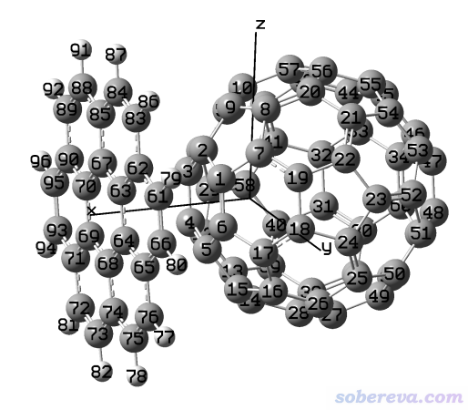

本例要依次实现以下过程：  
(1)令体系绕Y轴旋转90度，使得晕苯在上图的下侧，富勒烯在上侧  
(2)让富勒烯的几何中心处在坐标原点  
(3)让原子序号按照Z坐标由小到大排序

现在启动Multiwfn，依次输入  
examples\C60_coronene.pdb  
300  //其它功能（Part 3）  
7   //对当前体系做几何操作  
3  //令选定的原子绕某个矢量或笛卡尔轴旋转  
[按回车]  //选择所有原子  
2  //绕Y轴旋转  
90  //90度

现在可以看看操作后的结果。选择选项0，就会看到下图，和期望的一致

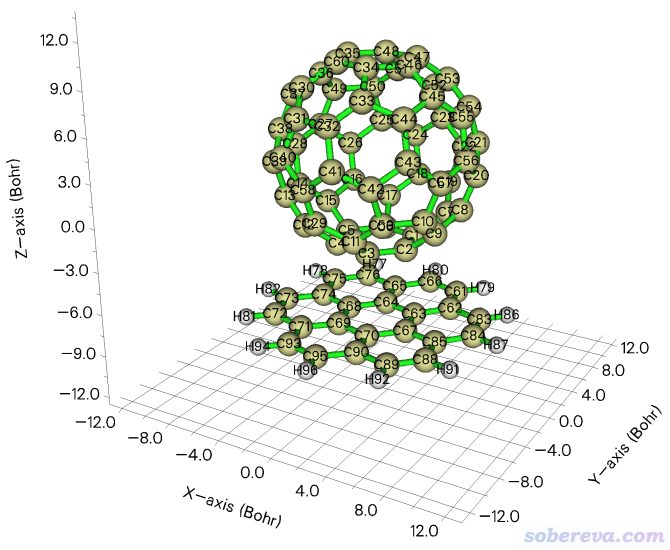

我们接着做后续的事。点击图形窗口右上角的RETURN按钮关闭后接着输入  
2  //令一批原子的中心处在原点  
1  //几何中心  
1-60  //富勒烯的原子序号（技巧：想快速查询其原子序号的话，可以进入Multiwfn主功能0，菜单栏里选择Tools - Select fragment，之后观看图形窗口里富勒烯的原子序号，输入它上面任意一个原子序号并点OK，之后程序就会返回给你整个富勒烯分子的原子序号范围）

此时屏幕上提示这批原子原先的中心坐标是(-0.001827,0.000252,3.646856) Bohr，显然Multiwfn会按照(0.001827,-0.000252,-3.646856) Bohr矢量对体系进行平移。

现在富勒烯的中心已经恰好在(0,0,0)位置了。接着输入  
13  //对原子重新排序  
3  //按照Z坐标从小到大排序  
-3  //将当前内存里的坐标导出为gjf文件  
[按回车]  //如屏幕上提示所示，会导出为当前目录下的C60_coronene.gjf

用GaussView载入C60_coronene.gjf，看到的图像如下，确实富勒烯中心在坐标原点，而且Z坐标越大的原子序号越大。

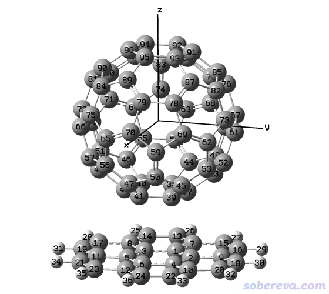

### 2.2 令共轭环状分子的最长方向平行于X轴

<http://sobereva.com/attach/610/mobius-m1.mol2>是一个共轭环状分子的结构文件，如下所示。此例要让这个分子最长的方向平行于X轴。

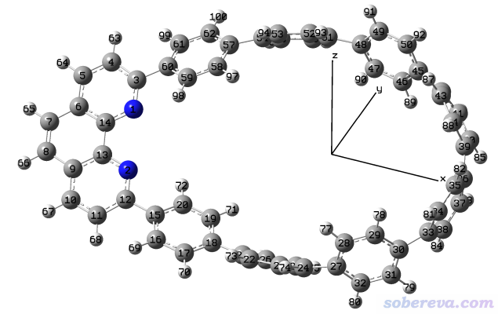

启动Multiwfn然后输入  
mobius-m1.mol2  
300  //其它功能（Part 3）  
7   //对当前体系做几何操作  
8  //令一批原子的最长轴平行于某个矢量或某个笛卡尔轴  
[按回车]  //用体系所有原子定义最长轴方向  
1  //令最长轴朝向X轴

进入选项0，可看到下图，确实达到我们的目的了，体系最长的方向已精准地平行于X轴。

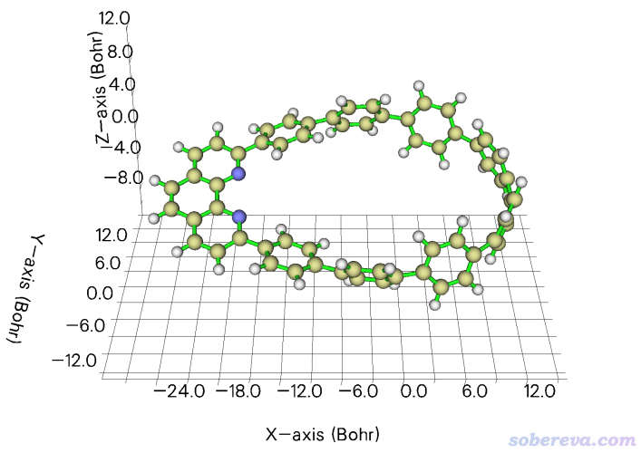

### 2.3 令双氧水的O-H键平行于X轴

笔者之前写过《让指定化学键平行于笛卡尔坐标轴的方法》（<http://sobereva.com/177>），里面用VMD的脚本和命令行来实现令某个键平行于某个笛卡尔轴，对于不熟悉VMD的人来说用起来略麻烦。现在有了Multiwfn的几何操作功能，就完全用不着VMD来实现了。

examples\H2O2.fch是双氧水的fch文件，此例让里面的O3-H4键平行于X轴。启动Multiwfn然后输入  
examples\H2O2.fch  
300  //其它功能（Part 3）  
7   //对当前体系做几何操作  
5  //令某个键平行于某个矢量或某个笛卡尔轴  
3,4  //两个原子的序号  
1  //平行于X轴

然后进入选项0观看结构，如下所示，确实O3-H4键平行于X轴了

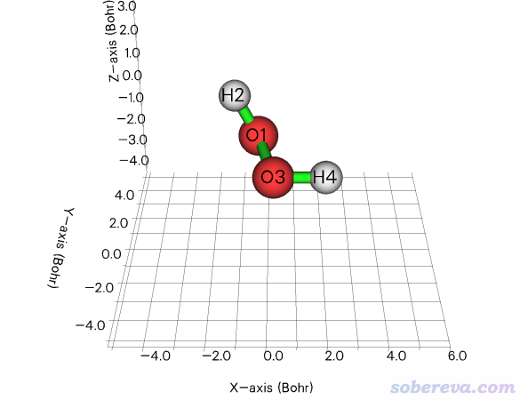

### 2.4 令BaeP的多环芳烃部分平行于XY平面

BaeP是笔者在Struct. Chem., 25, 1521 (2014)中研究过的一个致癌的分子，它的某个构型的结构文件是<http://sobereva.com/attach/610/BaeP-D3.pdb>。此例我们要让它的多环芳烃部分的碳原子（下图绿色部分）平行于XY平面。

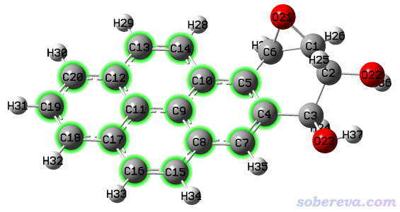

启动Multiwfn然后输入  
BaeP-D3.pdb  
300  //其它功能（Part 3）  
7   //对当前体系做几何操作  
11  //令一批原子对应的平面平行于某个笛卡尔平面  
4-5,7-20  //多环芳烃部分的原子序号。回车之后会在屏幕上看到这些原子拟合平面的拟合误差，以及拟合平面的法向量  
1  //XY平面

之后在选项0里观看时发现确实多环芳烃部分已经精确平行于XY平面了

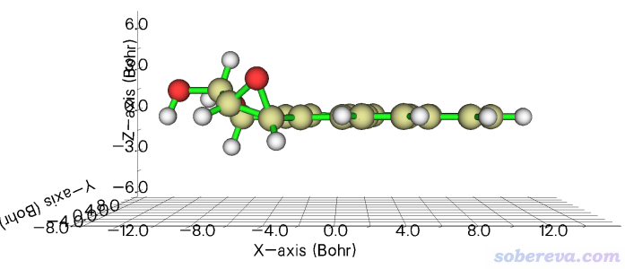

### 2.5 令乙酰胺的偶极矩平行于Y轴

Multiwfn目录下的examples\CH3CONH2.fch是乙酰胺的Gaussian计算出的fch文件，此例我们让这个分子的偶极矩精确平行于Y轴。启动Multiwfn然后输入  
examples\CH3CONH2.fch  
300  //其它功能（Part 3）  
7  //对当前体系做几何操作  
7  //令偶极矩平行于某个矢量或笛卡尔轴。按回车后从屏幕上可以看到Multiwfn计算出的偶极矩矢量为(0.043151,-1.425485,0.174879) a.u.  
2  //平行于Y轴

然后在选项0里看到的图如下图右侧所示，下图左侧的蓝色箭头是GaussView载入这个fch文件后在Results - Charge Distribution里显示的偶极矩矢量。可见确实在Multiwfn中当前分子的偶极矩方向已经精确朝向Y轴了

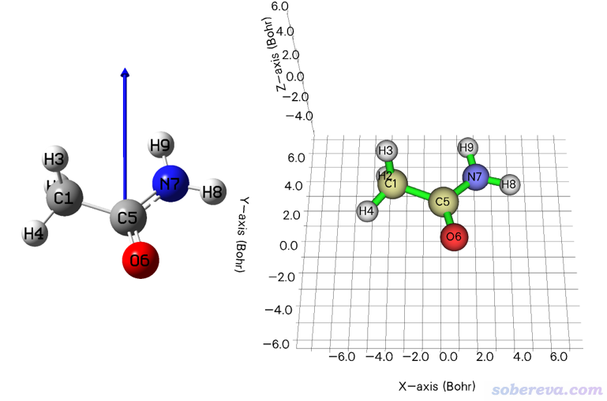

顺带一提，如果你觉得当前体系的方向和你期望的正好相反，即你希望偶极矩方向是朝着Y轴负方向的，可以输入  
9  //镜面反转  
[按回车]  //选择整个体系  
3  //相对于XZ平面反转。这相当于令所有原子Y坐标符号发生了反转

### 2.6 令BODIPY分子的S0->S1激发的跃迁偶极矩指向(1,1,0)方向

笔者之前写过《让体系(跃迁)偶极矩平行于某个笛卡尔轴的方法》（<http://sobereva.com/507>），当时是利用VMD实现的。现在用Multiwfn来实现方便得多。

此例演示怎么让BODIPY分子的S0->S1激发的跃迁偶极矩指向某个特定方向，比如(1,1,0)矢量方向。Multiwfn手册4.11.11节演示了如何对BODIPY绘制荧光光谱，其中用到了一个文件examples\excit\BODIPY_S1_opt.out，这是Gaussian对BODIPY分子的S1激发态做优化的输出文件，在第7333行的位置可以看到S1极小点结构下S0->S1跃迁的跃迁偶极矩为(0.6141,-0.2465,0.0124) a.u.。下面我们用Multiwfn对S1极小点结构进行旋转，从而令这个跃迁偶极矩正好顺着(1,1,0)方向。

把Multiwfn的settings.ini里的iloadGaugeom设为1从而令Multiwfn载入Gaussian输出文件时会载入里面最后一帧的坐标。然后输入  
examples\excit\BODIPY_S1_opt.out  
300  //其它功能（Part 3）  
7  //对当前体系做几何操作  
6  //使某个矢量平行于某个矢量或笛卡尔轴  
0.6141,-0.2465,0.0124  //S0->S1跃迁的跃迁偶极矩矢量  
4  //平行于特定矢量  
1,1,0

现在内存里的坐标就是我们想要的新坐标了，之后可以导出gjf或结构文件。

### 2.7 令C18Br6分子晶体中的分子保持完整

<http://sobereva.com/attach/610/C18Br6.cif>是C18Br6分子的晶体结构文件，直接用GaussView打开的话会看到分子几乎都被晶胞边界截断了，如下所示。

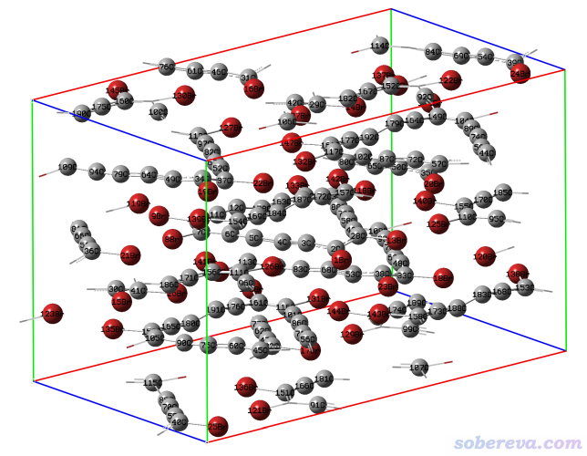

此例我们用Multiwfn令晶胞里的分子保持完整。启动Multiwfn然后输入  
C18Br6.cif  
300  //其它功能（Part 3）  
7  //对当前体系做几何操作  
20  //令被晶胞边界截断的分子变完整

之后进入选项0观看，并且选Other settings - Toggle showing cell frame把晶胞边框显示出来，此时看到下图，可见分子都已变得完整，晶胞里总共有8个分子。

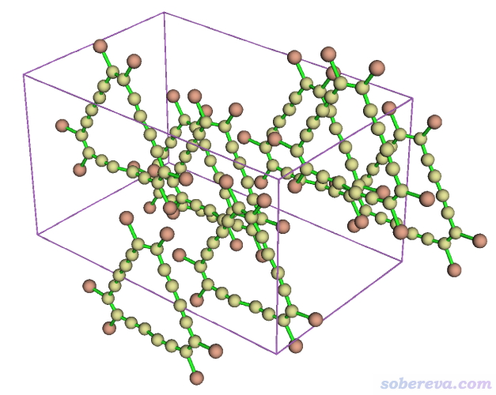

### 2.8 构造黑磷的超胞并调节密度

<http://sobereva.com/attach/610/Phosphorus-black.cif>是黑磷的晶体结构文件。在Multiwfn主功能0里进行显示可看到下图

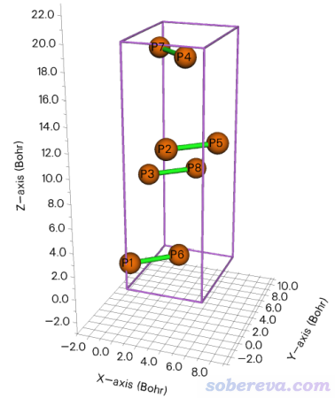

此例演示对黑磷在X、Y方向都扩胞成原先的4倍。启动Multiwfn然后输入  
Phosphorus-black.cif  
300  //其它功能（Part 3）  
7  //对当前体系做几何操作  
19  //平移复制晶胞  
4  //第一个方向（当前正好是X方向）复制为4倍  
4  //第二个方向（当前正好是Y方向）复制为4倍  
1  //第三个方向（当前正好是Z方向）保持不变

之后进入选项0并显示晶胞边框，看到下图

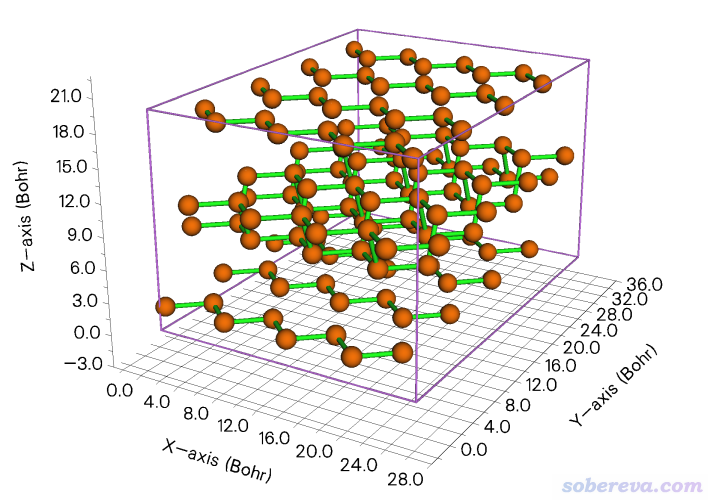

再演示一下对第三个晶格矢方向将其长度压缩为原先的0.7倍并同步调节原子坐标。输入  
21  //修改晶胞矢量长度以及相应地调节原子坐标  
3  //修改第三个晶胞矢量长度  
0.7  //变为原先的0.7倍

之后再进入选项0，会看到晶胞的Z方向已经被压扁了。

### 2.9 对C18产生XY平面上随机位移的一批结构

此例演示产生一批随机位移结构的功能，用18碳环（cyclo[18]carbon）作为演示。笔者对18碳环做过大量、全面、系统的研究，汇总见<http://sobereva.com/carbon_ring.html>。此体系优化后的结构文件为Multiwfn文件包里的examples\C18.xyz，是D9h点群对称性，在Multiwfn主功能0里显示的结构如下所示

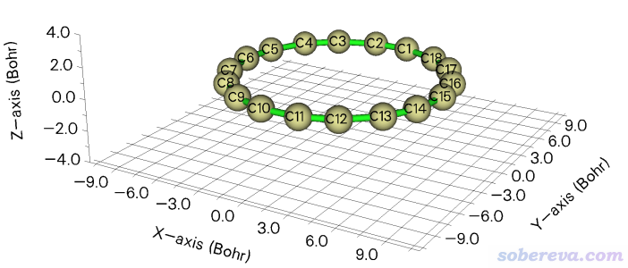

此例我们产生此体系在X和Y方向随机位移的10个结构。启动Multiwfn然后输入  
examples\C18.xyz  
300  //其它功能（Part 3）  
7  //对当前体系做几何操作  
18  //生成一批随机位移的结构  
a  //对所有原子做随机位移  
4  //允许在X和Y方向随机位移  
0.15  //随机位移的幅度满足正态分布，这里让你输入标准偏差，此例设0.15埃。此值越大相对于原先位置整体位移幅度越大  
10  //产生10帧

现在在当前目录下就有了多帧的new.xyz文件。读者可以自行从xyz文件里提取各个坐标，格式介绍见《谈谈记录化学体系结构的xyz文件》（<http://sobereva.com/477>）。也可以将它载入到VMD里，若将里面所有结构叠加显示，并用不同颜色区分帧号，就可以看到下图，可见确实随机位移只在要求的XY方向上。

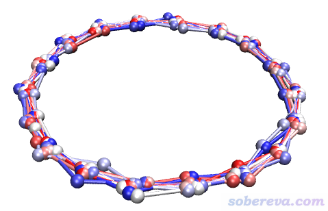

### 2.10 让沸石吸附的分子在晶胞中居中

<http://sobereva.com/attach/610/zeolite.cif>是里面吸附了一个甲苯分子的沸石，如下图所示，甲苯部分用绿色高亮显示了

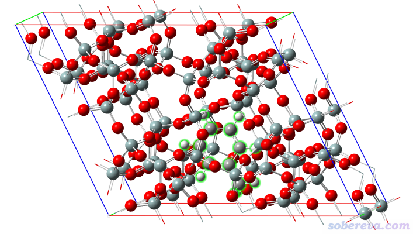

由于甲苯在晶胞非常靠下的位置，在很多时候会给分析带来不便，诸如使用《使用IRI方法图形化考察化学体系中的化学键和弱相互作用》（<http://sobereva.com/598>）和《使用Multiwfn结合CP2K通过NCI和IGM方法图形化考察固体和表面的弱相互作用》（<http://sobereva.com/588>）里的方法进行分析时不便于展示被吸附的分子与它下方的周期镜像沸石原子间的相互作用。

为了让甲苯能处在晶胞中央便于分析考察，在Multiwfn里输入  
zeolite.cif  
300  //其它功能（Part 3）  
7  //对当前体系做几何操作  
24  //平移体系以令特定的部分在晶胞中居中  
217-231  //被吸附的分子的原子序号

此时如屏幕上提示所示，目前有一些原子处在晶胞外部。为了让这些原子卷回到晶胞里面，接着选选项22。之后进入选项0看到的结构如下，如蓝圈所示确实甲苯已处在晶胞中央了。关闭图形窗口后可以用比如选项-4导出常用的cif格式的文件。

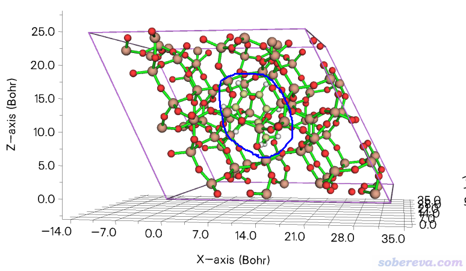

## 3 总结

Multiwfn虽然是波函数分析程序，但也带了不少其它的和计算化学研究密切相关的实用功能。本文介绍了Multiwfn中的几何操作功能，里面提供的丰富的选项可以解决量子化学日常研究中遇到的各种几何操作问题，而且使用非常简单和灵活，支持的输入文件格式众多，给研究者提供了很多便利。Multiwfn的这些功能有的通过VMD程序的命令行也能等效地实现，但使用略微麻烦，对于不懂VMD的人解释起来也比较费劲。

如果你想做的几何操作在Multiwfn的这个功能里无法实现，也可以向笔者反馈，如果笔者觉得有普遍意义的话也会加入到此功能里。
