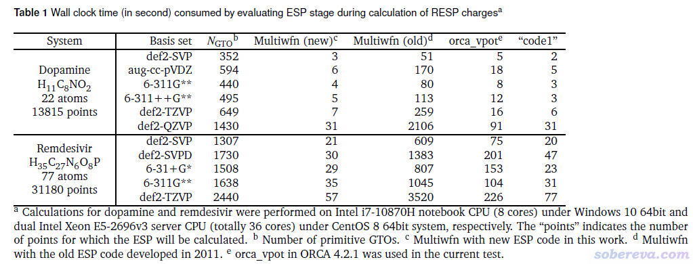
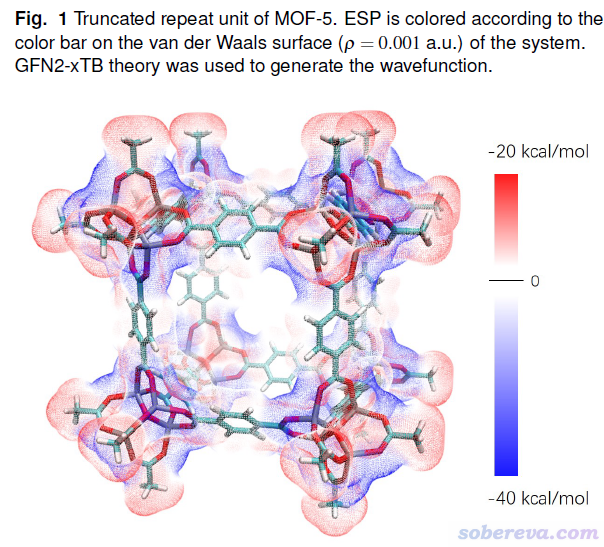
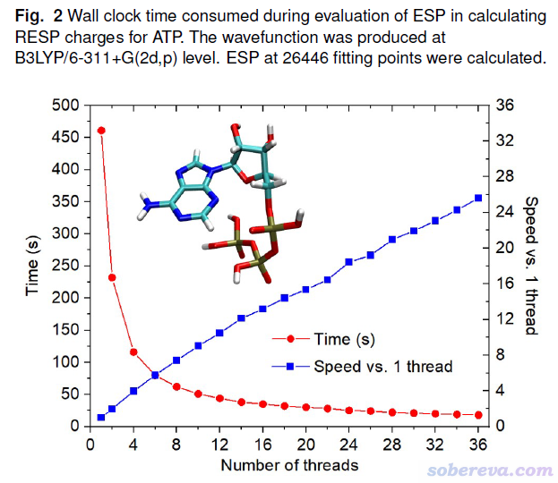

**Multiwfn使用的高效的静电势算法的介绍文章已于PCCP期刊发表！**

An introduction article on the efficient electrostatic potential algorithm employed by Multiwfn has been published in the PCCP journal!

文/Sobereva@[北京科音](http://www.keinsci.com)  2021-Aug-31

近日，深圳湾实验室的张鋆和北京科音自然科学研究中心（<http://www.keinsci.com>）的卢天共同发表的名为Efficient Evaluation of Electrostatic Potential with Computerized Optimized Code的文章刊登于*Phys. Chem. Chem. Phys.*, **23**, 20323 (2021)，可访问此链接查看：<https://doi.org/10.1039/d1cp02805g>。此文专门介绍了一种非常高效的静电势计算算法，并已实现在十分流行的波函数分析程序Multiwfn（<http://sobereva.com/multiwfn>）中，下面简要说明一下。

静电势（electrostatic potential, ESP）是量子化学中的一种极为重要的实空间函数，可以用来解释和预测分子间静电相互作用、计算拟合静电势电荷用于分子模拟、预测亲核和亲电反应位点、计算基于静电势定义的描述符预测体系凝聚相性质，等等。Multiwfn程序支持非常丰富的静电势相关的分析，已被大量计算化学文章所使用。笔者写过诸多相关博文，连同一些重要文献汇总在了《静电势与平均局部离子化能相关资料合集》（<http://bbs.keinsci.com/thread-219-1-1.html>）帖子里。

最早，Multiwfn的静电势计算代码是大约2011年时候写的，使用的是相对容易实现但速度较慢的代码，当时做稍微大一些体系的静电势分析很费劲。后来，Multiwfn支持了调用Gaussian的cubegen程序做静电势计算部分，使得静电势相关的分析耗时有了极大降低，介绍见《Multiwfn现已可以调用cubegen使静电势分析耗时有飞跃式的下降！》（<http://sobereva.com/435>）。再后来，曾经开发过LIBRETA电子积分库的张鋆和笔者共同合作，最终在Multiwfn 3.7版程序中理想地实现了一种非常高效的静电势计算算法，笔者在《Multiwfn的计算静电势的内部代码速度得到了巨幅提升！》（<http://sobereva.com/563>）专门做了介绍。这个算法如今被正式发表在前述的Phys. Chem. Chem. Phys.期刊上，并且也是当前版本算静电势的时候默认使用的。

Phys. Chem. Chem. Phys.这篇文章里关于算静电势的电子积分层面的数学细节在此不做介绍，请感兴趣的读者自行阅读，这里只把文章中的静电势计算速度测试部分说一下。

下面对两个体系在不同的有代表性的基组下按照《RESP拟合静电势电荷的原理以及在Multiwfn中的计算》（<http://sobereva.com/441>）文中的做法计算RESP原子电荷，这个过程耗时几乎完全来自于计算大量的拟合点上的静电势。其中较小的多巴胺（Dopamine）体系的耗时是在普通8核笔记本上测的，较大的瑞德西韦（Remdesivir）体系的耗时是在双路E5-2696v3共36核的服务器上测的。表中的orca_vpot是ORCA量子化学程序中自带的算静电势的独立程序，code1是最知名的商业量子化学程序自带的速度非常快的能够计算静电势的工具，Multiwfn (old)和(new)分别是最早的Multiwfn内部的静电势计算代码和目前版本默认的代码，N_GTO是Primitive Gaussian函数数目。

由上表可见，Multiwfn的新静电势代码比最早的代码快了几十倍，也显著胜于ORCA的计算静电势的工具，在多数情况下比需要付费的代码速度还快。

为了证明Multiwfn的新的静电势代码可以算得动很大体系，笔者从MOF-5晶体当中截取了一个重复单元，边缘用氢恰当饱和，此时化学组成是H120C144O104Zn32，共400个原子。然后通过xtb程序在GFN2-xTB理论下计算得到了molden格式的波函数文件，用于Multiwfn计算表面静电势，然后按照《使用Multiwfn+VMD快速地绘制静电势着色的分子范德华表面图和分子间穿透图》（<http://sobereva.com/443>）中的ESPpt的做法作图，结果如下所示。此体系的Gaussian函数数目多达4840个，被计算静电势的表面顶点数多达259262个，但即便如此，在36核服务器下花了半小时也算完了。这说明Multiwfn的静电势分析、结合VMD对静电势绘图已经可以用于相当大的体系。

Phys. Chem. Chem. Phys.文中对Multiwfn的静电势计算的并行效率也做了测试。测试的是对ATP分子在B3LYP/6-311+G(2d,p)下产生的波函数计算RESP电荷。如下图可见，并行效率很理想，随着调用的核数增多，相对于单线程运行的速度提升得也很理想。因此Multiwfn的静电势分析可以充分利用核数较多的CPU的运算能力。

虽然Multiwfn调用Gaussian的cubegen计算静电势的速度也不错，但相对于直接用Multiwfn当前内部的静电势计算代码有几个不足：  
(1)必须花钱购买程序  
(2)只直接支持fch格式。而Multiwfn的静电势代码是特别普适的，用任意Multiwfn支持的格式作为输入文件都可以，目前包括fch、molden、mwfn、wfn、wfx、gms（不过，Multiwfn倒是也有将mwfn/molden/gms转换为fch的功能，例如早先写过的《巨大体系的范德华表面静电势图的快速绘制方法》<http://sobereva.com/481>里把xtb产生的molden文件转成了fch再让Multiwfn调用cubegen算静电势）。  
(3)Multiwfn有些涉及静电势的功能不支持调用cubegen，比如对静电势用主功能2做拓扑分析。特别值得一提的是在《巨幅降低Multiwfn结合VMD绘制分子表面静电势图耗时的一个关键技巧》（<http://sobereva.com/602>）中笔者提出的巨幅降低绘制分子表面静电势图的方法不能结合cubegen使用，用此文的方法依靠Multiwfn自己的静电势计算代码的耗时远低于结合cubegen的时候。

目前只有一个情况让Multiwfn调用cubegen算静电势的耗时比用Multiwfn自己的代码明显更低，就是利用主功能5计算均匀分布的静电势格点数据的时候（《绘制静电势全局极小点+等值面图展现孤对电子位置的方法》<http://sobereva.com/493>等文章介绍的分析里需要用到）。大抵cubegen专门为这种情况做了特殊考虑，不是一个一个点单独计算而是批量计算，期间共享了很多中间数据，通过避免重复计算一些中间数据而大幅节约了时间。所以如果算中、大体系静电势格点数据的时候有条件的话依然建议调用cubegen算静电势，没有cubegen的话就尽量用CPU核数较多的机子算，并且格点间距设得略大一些让被计算的点数不那么多。

Phys. Chem. Chem. Phys.这篇文章提出的静电势算法以及Multiwfn中相应的静电势计算代码已经很高效了，但还有进一步改进的余地，可能速度在未来还会有不小的提升，包括  
(1)更充分地利用CPU的SIMD指令集  
(2)充分利用积分屏蔽来降低巨大体系的耗时  
(3)针对收缩型基函数优化代码（当前是纯粹基于primitive函数算的。这倒也带来一个好处是即便是用wfn、wfx这样不含基函数信息的输入文件也可以算静电势）

最后提醒一下，如果大家用Multiwfn做静电势相关分析时使用的是程序内部代码计算的静电势，即默认的情况，**请在发表的文章中对前述Phys. Chem. Chem. Phys., 23, 20323 (2021)文章进行提及和引用**，例如可以在Computational Details段落里写上：The electrostatic potential involved in the analyses was evaluated by Multiwfn based on the highly effective algorithm proposed in Ref.[PCCP文章]。
