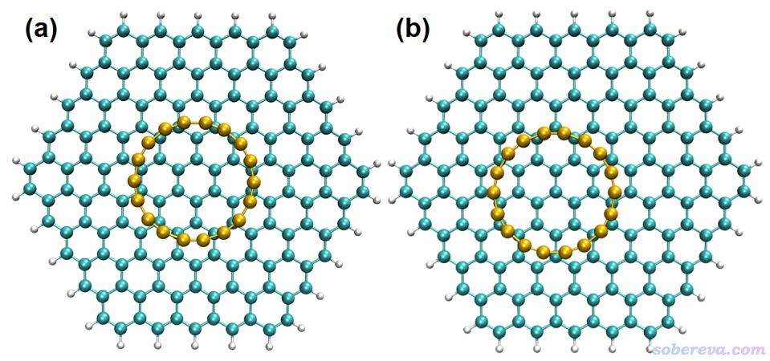
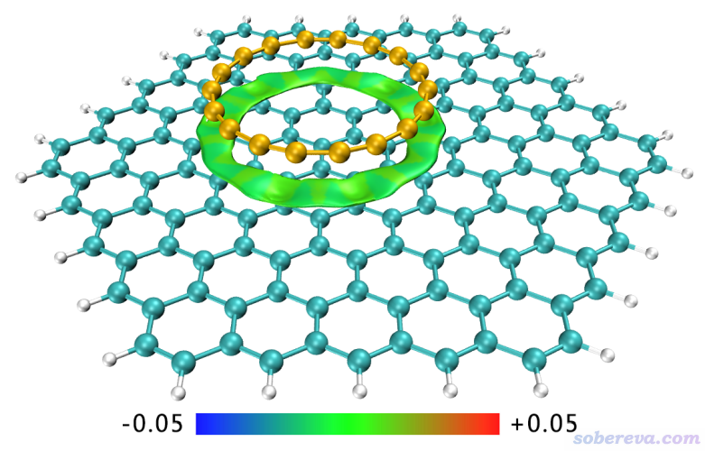
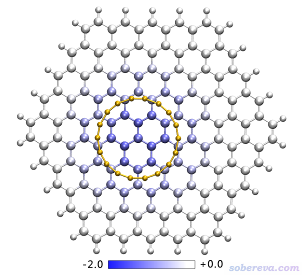
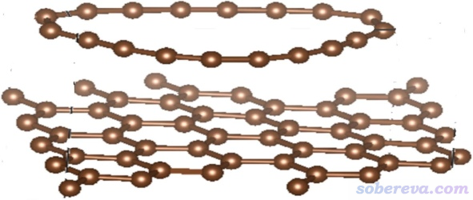
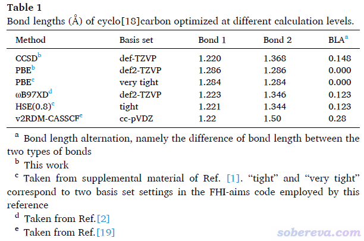
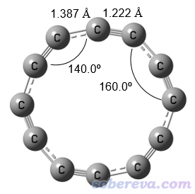

**18碳环（cyclo[18]carbon）与石墨烯的相互作用：基于簇模型的研究一例**

Interaction between cyclo[18]carbon and graphene: An example of research based on cluster model

文/Sobereva@[北京科音](http://www.keinsci.com)  2021-Sep-18

## 1 前言

自从2019年Science, 365, 1299 (2019)报道在凝聚相观测到18个碳组成的环状体系18碳环（cyclo[18]carbon）之后，碳环类体系一直是研究的热点，笔者做了大量研究并发表过一系列工作，汇总见<http://sobereva.com/carbon_ring.html>，目前还有相关研究正在进行中。2020年底笔者读到一篇Iyakutti等人发表的研究18碳环和12碳环与石墨烯相互作用的理论计算文章：Materials Science and Engineering: B, 263, 114895 (2021)。这个研究题材不错，我却惊讶地发现此文里的问题比《我对一篇存在大量错误的J.Mol.Model.期刊上的18碳环研究文章的comment》（<http://sobereva.com/584>）里我评论的那篇文章存在的问题还严重得多。于是笔者很快写了一篇文章，其中一半内容是对Iyakutti等人文章里严重问题的斧正，避免误人子弟，另一半内容是我在真正合理的模型下用准确可靠的方法对18碳环与石墨烯相互作用进行探究并提出我的观点。此文于投出去后经过长达约9个月的漫长审稿，近期已经被接收并发表：Materials Science and Engineering: B, 273, 115425 (2021) <https://doi.org/10.1016/j.mseb.2021.115425>。在2021年10月19日之前可以使用此链接免费阅览：<https://authors.elsevier.com/a/1dfyA3HXllBg4w>，欢迎大家阅读。

下面将首先对我这篇文章里的18碳环与石墨烯相互作用的研究进行介绍，包含大量使用簇模型考察吸附问题的细节和要点的说明，相关文件也给了，一定程度上也算是一篇教程，对于读者研究类似问题会有帮助。读者以类似此文的方法和模型做相关问题计算的时欢迎引用笔者的这篇Materials Science and Engineering: B文章的研究作为范例。之后，本文会对Iyakutti等人文章里存在的严重问题进行讨论，以避免一些理论计算初学者以及碳环类体系的研究同行犯同样的错误。

## 2 18碳环与石墨烯的相互作用特征

为了研究18碳环与石墨烯的相互作用，必须构建个恰当的碳环吸附在石墨烯上面的模型。这类吸附问题用CP2K、Quantum ESPRESSO等第一性原理程序通过周期性模型计算无疑是可以的，特别是用《使用Multiwfn非常便利地创建CP2K程序的输入文件》（<http://sobereva.com/587>）里的做法创建CP2K输入文件非常方便。但当前体系并不太适合用第一性原理程序来做，原因有二：(1)如笔者在Carbon, 165, 468 (2020)文中所指出的，正确描述18碳环这个特殊体系必须用杂化泛函，然而杂化泛函在周期性计算时耗时颇高，而当前体系又需要用原子数很多的基底，所以算起来特别费劲 (2)第一性原理程序支持的理论方法普遍明显少于Gaussian、ORCA等主流量化程序，选择余地太小。所以本研究中使用量子化学程序基于簇模型，即用有限尺寸的孤立结构代替无穷延展的体系，考察18碳环在石墨烯上的吸附。下面把各种相关细节和研究结果说一下。用簇模型研究吸附问题笔者还另有一篇博文《使用量子化学程序基于簇模型计算金属表面吸附问题》（<http://sobereva.com/540>），感兴趣的读者可以看看，其中包含一些本文省略的信息。

为了算18碳环与石墨烯的复合结构，要把石墨烯晶胞复制延展得足够大，保留其中一层，再恰当删原子，最终令剩下的石墨烯片段比18碳环尺寸明显大一圈，大一圈是为了避免边界效应太强而导致有限尺寸的石墨烯片段不能等效表现无限延展的石墨烯。并且要考虑到18碳环在优化后可能出现的滑移，因此不要过于吝啬石墨烯的尺寸（有些人在构建模型时太抠门，不留足够余量。若到时候被审稿人质疑边界效应太强，还得改模型重算，付出更多代价，得不偿失）。之后将石墨烯的边缘用氢饱和避免出现悬键，并对这些氢的位置进行优化使之位置合理。然后再把复合物放在石墨烯上方三点几埃的位置（通常的pi-pi堆积距离），并且让18碳环的中心基本对准石墨烯片段的中央，如下图左侧所示

之后对复合物进行几何优化，优化时冻结石墨烯片段边界一圈的碳原子以及与之相连的氢原子的坐标，操作见《在Gaussian中做限制性优化的方法》（<http://sobereva.com/404>）。之所以冻结了边缘，是为了避免18碳环与石墨烯相互作用导致石墨烯出现变形（虽然变形程度肯定会非常低），在现实当中由于当前石墨烯片段外围还有其它碳束缚它的结构，故这种结构变化是理应不该出现、需要人为避免的。优化出来的无虚频的结构就是上图右侧的结构，可见碳环中心正好对着石墨烯的一个碳原子。最终的结构中的碳环相对于初始结构有了平移，但到最后它与石墨烯的边界原子仍有足够的距离，因此可以放心用于之后的计算。实际优化后发现18碳环与石墨烯几乎保持严格平行，距离为3.334埃。优化后18碳环和石墨烯的结构几乎都没有发生改变，碳环里面化学键变化都没有超过0.001埃，体现这种pi-pi堆积作用对几何结构的影响非常微弱。也因此，算它们的相互作用的时候不需要刻意考虑单体的变形能。优化后的结构的xyz文件可以在<http://sobereva.com/attach/615/C18-graphene.xyz>下载。

之后笔者计算了石墨烯片段与18碳环的高精度结合能，结果是-27.4 kcal/mol（-114.6 kJ/mol），这已经是很大的数值了，说明18碳环与石墨烯之间的pi-pi堆积作用相当强，能达到这种强度的pi-pi堆积是不多见的。在《全面探究18碳环独特的分子间相互作用与pi-pi堆积特征》（<http://sobereva.com/572>）里提到过，之前笔者算的两个18碳环之间的pi-pi堆积结合能是-9.2 kcal/mol，远不如18碳环与石墨烯之间的作用强。顺带一提，如果读者对pi-pi作用感兴趣，非常推荐阅读《谈谈pi-pi相互作用》（<http://sobereva.com/737>）。

要注意对碳环-石墨烯复合物的理论研究中对计算级别的选取上是非常讲究的。对于体系特征、理论方法、基组、程序如果没有充分的理解就一通瞎算，完全不可能得到有意义、令人信服的数据，所以下面将在计算级别和程序选择方面做充分的说明，令读者了解怎么算得又快又好。

优化和振动分析笔者使用的是Gaussian程序，因为其优化算法是几乎所有量子化学程序里最好、最稳健的，而且在普通泛函下做振动分析的速度相对其它程序来说几乎是最快的。优化和振动分析是在ωB97XD泛函下做的，这个泛函优化弱相互作用体系结构不错，比较稳健，而且根据笔者之前的测试，它对18碳环的几何和电子结构描述得都很合理，所以笔者之前发表的一系列碳环类体系的研究文章基本用的都是这个泛函。由于整个复合物原子数多达198个，而且其中碳的数目非常多，大约折合250~300原子的普通有机体系的计算量，所以即便在笔者的不算差的36核机子上也不能用的基组太大。由于石墨烯的原子占复合物的绝大部分，而且相对于18碳环来说其重要性稍低，因此就用保底的6-31G*基组（用6-311G*无疑更好，但算不动，而且对此体系的几何优化结果的影响应当是肉眼难以察觉的程度）。18碳环是最为关键的部分，自然应当用比石墨烯更大的基组，即需要用混合基组算这个复合物，见《详解Gaussian中混合基组、自定义基组和赝势基组的输入》（<http://sobereva.com/60>）。根据笔者在J. Mol. Model., 27, 42 (2021)中专门做过的基组对18碳环描述能力的全面测试，至少6-311G*才能定性正确描述18碳环的结构，因此本研究对复合物中的18碳环使用质量不错但也不过于浪费的def-TZVP基组，它介于便宜的def2-SVP和较昂贵的def2-TZVP之间，且比6-311G*略大，相关信息见《谈谈量子化学中基组的选择》（<http://sobereva.com/336>）。由于当前复合物里18碳环相对于石墨烯滑移方向的势能面特别平缓，因此优化又难收敛、又容易出虚频，这种情况必须非常耐心，严格按照《量子化学计算中帮助几何优化收敛的常用方法》（<http://sobereva.com/164>）和《Gaussian中几何优化收敛后Freq时出现NO或虚频的原因和解决方法》（<http://sobereva.com/278>）里的做法反复折腾最终总能收敛到无虚频的结构。另外，笔者在振动分析期间遭遇了CPHF方程难收敛问题，最终加上CPHF=grid=fine后解决。此复合物的振动分析在36核机子上花了20小时完毕，供读者参考。振动分析的输入文件可以在<http://sobereva.com/attach/615/complex_freq.gjf>下载。

研究弱相互作用复合物显然免不了要算结合能，算这么大的体系的结合能也是很讲究的。算单点能首选是ORCA，里面利用RIJCOSX数值技术可以让杂化泛函耗时巨幅降低，简介见《大体系弱相互作用计算的解决之道》（<http://sobereva.com/214>）。当前研究文章中笔者用的是当时最新的ORCA 4.2.1。ωB97X-V比ωB97XD算弱相互作用能明显更准，仅次于普通泛函里算弱相互作用最好的ωB97M-V一丁点，笔者发现它做碳环类体系的SCF时往往比ωB97M-V更容易收敛。另外，ωB97X-V和ωB97XD一样都是远程100% HF成份泛函（见《不同DFT泛函的HF成份一览》<http://sobereva.com/282>），这样的泛函对18碳环及类似物都可以正确描述。综合这些因素，笔者算18碳环和石墨烯的结合能时用了ωB97X-V，它也是笔者在《全面探究18碳环独特的分子间相互作用与pi-pi堆积特征》（<http://sobereva.com/572>）当中介绍的笔者研究18碳环分子间相互作用的Carbon, 171, 514 (2021)文章里算弱相互作用能的泛函。之所以笔者没用ωB97X-V做几何优化，一方面是Gaussian不支持它，而支持它的ORCA做优化的算法逊于Gaussian而且振动分析速度慢，另一方面是ORCA 4.2.1不支持它的解析梯度，对当前体系优化不可能算得动。虽然从ORCA 5.0开始由于VV10色散校正有了解析导数（见《谈谈ORCA 5.0的新特性和改变》<http://sobereva.com/604>），使得它做当前体系优化也能实现了，但还是没有解析Hessian，因此振动分析根本没法做，所以碳环类体系的优化+振动分析还是在Gaussian里用ωB97XD是首选（必须用ORCA的话，可以用比其更好一丁点的后继者ωB97X-D3）。

在ORCA开了RIJCOSX时，普通泛函即便结合高质量基组算挺大的体系，耗时也不很高，因此算18碳环与石墨烯的结合能时笔者用了较高质量的def2-TZVP。不过，单凭这样的基组算弱相互作用能还是差点意思的，有三种改进方式，都考虑了当然最好，至少也得考虑其一：  
(1)加弥散函数。在《谈谈弥散函数和“月份”基组》（<http://sobereva.com/119>）中专门说过弥散函数对于改进弱相互作用能很重要，尤其是基组没到4-zeta档次时。但是对当前体系加弥散函数的话没有标配的辅助基组，而用ORCA里的autoaux自动生成辅助基组又很容易出现线性相关问题导致没法算，遂不考虑。  
(2)提升到4-zeta，如def2-QZVPP。但对于当前这么大体系，def2-QZVPP在一般条件下根本算不动  
(3)考虑BSSE校正，见《谈谈BSSE校正与Gaussian对它的处理》（<http://sobereva.com/46>），这对于def2-TZVP这样没弥散函数的3-zeta档次基组算弱相互作用的改进是很明显的。ORCA里可以用免费的gCP方法实现，简介见《大体系弱相互作用计算的解决之道》（<http://sobereva.com/214>），也可以用更严格但需要多花几倍耗时的Counterpoise方式，实现方式见《在ORCA中做counterpoise校正并计算分子间结合能的例子》（<http://sobereva.com/542>）。笔者在当前研究中采用了后者。  
前面我给出的18碳环与石墨烯的结合能最终是在ωB97X-V/def2-TZVP + counterpoise组合下算的，ORCA输入文件可以在<http://sobereva.com/attach/615/counterpoise.inp>下载，里面用了grid6 gridx6关键词提升积分格点精度使得结果更准确、SCF也更容易收敛（如果是ORCA 5.0及以后版本就没必要写了，默认的格点就已经够好了）。在笔者的36核机子上此任务花了7个半小时算完。当前的结果已经基本算是时下主流双路服务器能承受的计算耗时下最好的结果了。

光是用量子化学程序做做结构优化、算算结合能，显然研究显得太过于空洞。接下来就是研究弱相互作用的百宝箱Multiwfn要做的事了，其中支持大量重要的分析方法，见《Multiwfn支持的弱相互作用的分析方法概览》（<http://sobereva.com/252>）。笔者的文章里使用了独立梯度模型（IGM）图形化展现了18碳环与石墨烯的相互作用，所得图像如下所示。此方法的介绍见《通过独立梯度模型(IGM)考察分子间弱相互作用》（<http://sobereva.com/407>）和《使用Multiwfn结合CP2K通过NCI和IGM方法图形化考察固体和表面的弱相互作用》（<http://sobereva.com/588>）。

上图中环状绿色的IGM方法定义的δg_inter的等值面非常清晰地展现出了18碳环与石墨烯之间的pi-pi堆积的主要作用区域。等值面是根据sign(λ2)ρ函数进行着色的，等值面全是绿色代表这部分作用区域的电子密度很低，是pi-pi堆积作用的典型特征，前述的笔者研究文章Carbon, 171, 514 (2021)里的18碳环pi-pi堆积二聚体的IGM图也是如此。

笔者之前提出了一种基于力场的能量分解分析方法EDA-FF并实现在了Multiwfn程序里，已经被不少文章所使用，详见《使用Multiwfn做基于分子力场的能量分解分析》（<http://sobereva.com/442>）。这个方法是基于分子力场考察片段间相互作用项，非常便宜且灵活，而且可以把每个原子对结合能的贡献以着色方式展现，明显便于研究者直观考察各个原子对结合起到什么作用。EDA-FF方法也被笔者用于研究18碳环与石墨烯之间的相互作用上。这里用的力场是AMBER力场，石墨烯里的原子都用CA原子类型（对应芳香环上的碳），18碳环的原子都用CZ原子类型（对应sp杂化的碳）。原子电荷都简单地当成零，因为18碳环里以及石墨片层中的每个碳都是等价的，显然原子电荷都理应为0。使用EDA-FF算出来的18碳环与石墨烯间的结合能为-25.4 kcal/mol，这和我们前面用量子化学方法算的可靠的结合能-27.4 kcal/mol吻合很好，这暗示哪怕用非常简单的分子力场，也是可以合理描述18碳环与纯碳物质（除了石墨烯外，还有富勒烯、碳纳米管等）之间的相互作用的，因此此文证明了以普通力场描述18碳环参与的弱相互作用的可行性，是个有意义的发现。

文中将Multiwfn做EDA-FF分析输出的文件结合VMD可视化程序绘图，清晰直观地展现了石墨烯的各个原子对18碳环与石墨烯之间结合能的贡献，如下图所示，色彩刻度条单位是kJ/mol（注：原文有笔误，EDA-FF部分的kcal/mol应为kJ/mol）。

上图中颜色越蓝的原子对结合的贡献越大，即对结合能数值贡献越负。由图可见越接近18碳环中心的碳原子对结合起到的贡献越大，越往外的碳贡献越小，石墨烯边界的原子的贡献都可以忽略不计。之所以越接近碳环中心的碳对结合能贡献越大，这可以通过笔者提出的范德华势角度予以清晰直观的解释，见《谈谈范德华势以及在Multiwfn中的计算、分析和绘制》（<http://sobereva.com/551>）。从此文给出的范德华势的图上可以看到18碳环的范德华势在环的上、下方是最负的，自然使得处在那些区域的石墨烯原子对结合贡献最大。还值得一提的是，从石墨烯原子对结合的贡献这个角度上也可以证明当前用的石墨烯片段已经够大了，倘若边界原子也有不小贡献的话则说明应当把石墨烯再往外扩一圈。前面是从图形上考察，从具体数值上看，石墨烯上碳原子对结合能贡献最大的是-1.3 kJ/mol，即上图最蓝的那个。文中也考察了碳环上的原子对石墨烯与碳环结合能的贡献，发现数值都在-2.9~-3.0 kJ/mol这个很窄的范围，说明每个碳的贡献都较大且很均衡，这是因为每个碳都与石墨烯里一大片碳原子有色散吸引作用。

Multiwfn做上述的18碳环-石墨烯的EDA-FF分析用到的输入文件和输出结果都可以在<http://sobereva.com/attach/615/EDA-FF.zip>下载。

## 3 Iyakutti等人研究文章存在的问题

前述的Iyakutti等人研究文章里面的问题实在太多，基本上看不到什么正确的内容，结论完全是误导性的。下面说一下其中存在的一些关键问题。

他们用的是VASP在PW92泛函下对18碳环和石墨烯做的研究，得到的结构如下所示

一看就知道计算模型完全不合理，取的晶胞尺寸太小，明显会导致18碳环和其相邻镜像存在严重的自相互作用。而且碳环看起来是弯曲的，有可能是优化得有问题，亦很可能是由于和相邻镜像距离太近导致出现了显著互斥作用而挤弯了。

文中说18碳环是“the bond lengths are equal and the bonds are made entirely of double bonds”，这是完全错误的说法。在Science, 365, 1299 (2019)中都已经实验证实了18碳环是长-短键交替的，估计作者连这篇文章都没认真看过。另外，我以及其他研究者的一系列理论计算也都证明了18碳环键长的不均等性，在本文专门列了个表：

可见笔者在高精度的CCSD/def-TZVP级别优化出的18碳环是明显长-短键交替的，ωB97XD/def2-TZVP的结果与之相符也较好。最近有篇文献用高精度方法v2RDM-CASSCF算了18碳环，虽然其用的基组cc-pVDZ太烂，故定量准确度不行，但结果至少也是键长不相等。Iyakutti他们之所以算出来C-C键长都是相同的，在于他们用的是纯泛函，而根据我在Carbon, 165, 468 (2020)中以及未发表的全面测试，目前没有任何一个纯泛函能正确描述18碳环键长交替的结构，例如上面表里的PBE下优化的结果也正是如此。值得一提的是，VASP、Quantum ESPRESSO等第一性原理程序里没法用ωB97XD这种范围分离泛函，用全局杂化泛函又太贵，非要用这些程序来研究18碳环及类似体系可以用修改后的近程杂化泛函HSE06，虽然它比纯泛函贵得多但已经是相对最便宜的选择了。原本这个泛函近程HF成分为25%而长程为0%，没法正确描述18碳环，但在Science, 365, 1299 (2019)的补充材料里作者将其近程HF成份改为80%后就可以不错地描述18碳环的结构，对应上面表格里的HSE(0.8)，可见它和ωB97XD的结果颇为一致。有的程序里可以直接自定义泛函实现HSE(0.8)，如果没法自定义的话，若原本支持HSE06，也可以很简单地修改源代码来使用。

Iyakutti等人的文章里还优化了12碳环的结构，并声称键长是相同的，这也是错误的结论。笔者在可靠的CCSD/def-TZVP级别下也优化了12碳环，所得结构如下，可见键长并不是均等的，是C6h点群

Iyakutti等人的文章用的泛函不仅没法正确描述12和18碳环本身，还完全不能正确描述碳环与石墨烯的pi-pi堆积作用。pi-pi堆积本质是色散作用，在《全面探究18碳环独特的分子间相互作用与pi-pi堆积特征》（<http://sobereva.com/572>）和《谈谈“计算时是否需要加DFT-D3色散校正？”》（<http://sobereva.com/413>）里面我都提到过，因此计算所用的泛函必须能合理地描述色散作用才行。然而他们的文章用的泛函描述色散作用极差，还没带色散校正，所以优化出的结构中18碳环与石墨烯之间的距离明显不合理，达到了3.92埃，比前文笔者在合理的级别下优化出的3.334埃大得多，而且这个距离也已经明显超过常规pi-pi堆积距离范围了。

最令我吃惊的是Iyakutti等人文章里关于18碳环电子组态的这段文字：  
The carbon atom’s electronic configuration will be either 1s4 2s2 or 1s2 2s4. In that scenario, the acquired electronic configuration of carbon may be 1s2 2s4, resonating with 1s2 2s2 2p2.  
...  
This 2s4 electrons of the carbon atoms in the rings may be forming double  
bonds with the two nearby carbon atoms.  
...  
we believe that the acquired electronic configuration of carbon might be  
1s2 2s4.

他们居然以为1s、2s轨道都能占4个电子，这甚至缺乏本科程度的基本化学知识，不知Pauli不相容原理为何物。看到原文的这段时我对此文的审稿人构成更加好奇了（PS：此期刊IF目前4.0，档次并不算低）。为了说明18碳环里碳原子的电子组态是什么样，笔者在ωB97XD/def2-TZVP级别下做了自然布居分析（NPA），结果是1s2 2s0.9 2p3.1，更具体来说，每个2p轨道上的电子数都差不多是1，这和化学直觉相符。

另外，Iyakutti等人的文章里还把18碳环视为是由单、三键组成的，这是许多研究者都抱有的错误认识，完全忽视了电子离域性，之前我在《我对一篇存在大量错误的J.Mol.Model.期刊上的18碳环研究文章的comment》（<http://sobereva.com/584>）介绍的文章里已经专门针对这个问题做了讨论，这里不再累述，建议读者一看。
