**电子空间范围<r^2>和电子径向分布函数的含义以及在Multiwfn中的计算**

The meaning of electronic spatial extent <r^2> and electronic radial distribution function as well as their calculation in Multiwfn

文/Sobereva@[北京科音](http://www.keinsci.com)

First release: 2021-Sep-7  Last update: 2021-Sep-8

## 0 前言

偶尔有人问我Gaussian程序算完了之后，输出文件中Electronic spatial extent (au):  <R**2>后面的值是什么意思，以及笔者的Multiwfn程序能不能算这个。在这里我就写个文章专门说一下。Electronic spatial extent可以翻译为“电子空间范围”，可以表示为<r^2>（**和^都代表取多少次方，本文统一用^符号）。电子密度的径向分布函数（radial distribution function, RDF）和<r^2>有密切联系，借助它可以将不同区域对<r^2>的贡献图形化展现，便于更深层次了解不同体系<r^2>大小的差异，因此一起在此文说一下。<r^2>实际上也可以对电子密度以外的函数进行计算来考察其空间分布广度，在本文最后会提及。

<r^2>和回转半径有密切联系，对于后者我结合过剩电子体系另写了一篇文章做了专门介绍：《使用Multiwfn展现过剩电子（excess electron）并计算它的回转半径》（<http://sobereva.com/658>）。

读者请务必使用2021-Sep-8及之后更新的Multiwfn，否则和本文很多叙述情况不符。

## 1 <r^2>的定义

<r^2>的计算公式如下

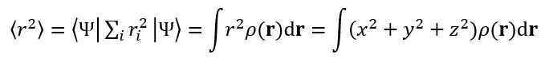

Ψ是体系的电子波函数，i是电子序号，尖括号是Dirac符号。斜体r是指的电子坐标与原点(0,0,0)间的距离，有r^2=x^2+y^2+z^2，这里x、y、z是电子坐标矢量（粗体r）的三个笛卡尔分量。<r^2>显然就是体系波函数的r^2算符的期望值，等同于电子密度ρ乘上相应位置的r^2在全空间进行积分。

根据计算公式可明显看出，当体系的总电子数恒定时，电子整体分布偏离原点越多，或者说空间分布范围越广阔，则<r^2>会越大，这是为什么<r^2>被称为“电子空间范围”。利用<r^2>的这个特点，可以对比不同体系或者同一体系不同状态下的电子整体分布的广度或弥散程度。当然了，<r^2>这个指标定义非常简单，有其局限性，要注意根据其计算形式正确理解其物理意义，不能在不适合使用的时候滥用它来瞎讨论。

## 2 <r^2>的计算

Gaussian计算完毕后直接就给出了<r^2>。Multiwfn的主功能300的子功能5里也能直接输出<r^2>，结果和Gaussian是完全相同的。使用Multiwfn的好处之一在于Multiwfn支持几乎所有主流量子化学程序产生的波函数信息做计算，详见《详谈Multiwfn支持的输入文件类型、产生方法以及相互转换》（<http://sobereva.com/379>），因此如果你是Gaussian以外的量子化学程序的用户也都可以方便地靠Multiwfn计算<r^2>。Multiwfn可以在<http://sobereva.com/multiwfn>免费下载，相关入门知识见《Multiwfn入门tips》（<http://sobereva.com/167>）和《Multiwfn FAQ》（<http://sobereva.com/452>）。

下面举个例子，使用Multiwfn分别计算He的基态和第一激发态的<r^2>，看看有什么不同。这里通过Gaussian 16在wB97XD/aug-cc-pVTZ级别下产生波函数文件。涉及的文件都可以在<http://sobereva.com/attach/616/file.zip>下载。

先计算基态的He，使用的Gaussian输入文件He_GS.gjf内容如下  
%chk=C:\He_GS.chk  
 # wb97XD/aug-cc-pVTZ   
 [空行]  
 He atom  
 [空行]  
 0 1  
 He       注：就一个原子，不用写坐标。此原子会在(0,0,0)位置

计算完毕后就有了He_GS.chk。用formchk将之转成He_GS.fch。启动Multiwfn，载入此文件，然后输入  
300  //其它功能（Part 3）  
5  //计算偶极矩、多极矩和电子空间范围  
程序先输出偶极矩、四极矩、八极矩、十六极矩，然后在末尾看到了<r^2>  
Electronic spatial extent <r^2>:        2.428668  
 Components of <r^2>:  X=       0.809556  Y=       0.809556  Z=       0.809556  
这里<r^2>是用的原子单位，所以写到文章里就写2.43 a.u.即可。由于He的电子密度是球对称分布的，因此<r^2>的三个笛卡尔分量数值是相同的，它们的加和就是<r^2>。

再来算一下S1激发态的<r^2>。使用的Gaussian输入文件如下（如果是G09 C.01之前的版本还需要写上density关键词）。这里使用TDDFT进行计算，写TD默认是root=1，故第一激发态（S1）的波函数对应的自然轨道会被产生并写入到输入文件末尾指定的C:\He_S1.wfn文件里。更多相关细节见《详谈Multiwfn支持的输入文件类型、产生方法以及相互转换》（<http://sobereva.com/379>）。  
# wb97XD/aug-cc-pVTZ out=wfn TD  
 [空行]  
 He atom  
 [空行]  
 0 1  
 He  
 [空行]  
 [空行]  
 C:\He_S1.wfn

把He_S1.wfn载入Multiwfn，还是进入主功能300的子功能5，得到的结果如下  
Electronic spatial extent <r^2>:       20.472770

可见这个值远比基态的2.43大得多得多！说明He的S1态的电子分布远比基态要弥散得多。为什么会这样？可以用Multiwfn打开激发态计算的Gaussian输出文件，按照《使用Multiwfn便利地查看所有激发态中的主要轨道跃迁贡献》（<http://sobereva.com/529>）里的做法看一下S0->S1激发的轨道贡献，显示的是  
#   1  18.7170 eV     66.24 nm   f=  0.00000   Spin multiplicity= 1:  
   H -> L 100.0%  
可见S0->S1激发完全由HOMO->LUMO跃迁所贡献，因此看一下这两个轨道图形就可以知晓电子是怎么激发的。按照《使用Multiwfn观看分子轨道》（<http://sobereva.com/269>）所述，用Multiwfn打开He_GS.fch，在主功能0里看到的HOMO和LUMO图像如下，等值面数值用0.03 a.u.，用points风格显示（记得选择保存图片文件，比直接在图形窗口里看到的图像效果好得多）

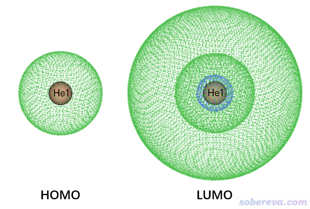

明显HOMO是He的1s轨道，LUMO是He的2s轨道，因为这俩都是球对称的，而且LUMO比HOMO分布广阔得多。由于S0->S1是1s->2s原子轨道的跃迁，必然S1的<r^2>远大于S0的。

实际上，不用<r^2>也可以说明S1态电子分布更广。例如Bader将电子密度0.001 a.u.定义为气相的范德华表面，里面包围的范围作为范德华体积，用Multiwfn以这种定义算范德华表面积和体积也能够说明问题，具体做法在《谈谈分子体积的计算》（<http://sobereva.com/102>）里第3节说了。使用He_GS.fch算的基态的表面积是9.87 Å^2，体积是66.58 Bohr^3。而使用He_S1.wfn计算的激发态的表面积是54.31 Å^2，体积是366.50 Bohr^3。由此也充分体现出He激发态的电子密度分布比基态广阔得多。

Multiwfn还可以对某个轨道的概率密度来计算其<r^2>以衡量其弥散程度，即前述<r^2>计算公式里的ρ不是体系的总电子密度而是特定轨道的概率密度。例如，我们要对S0_GS.fch里记录的HOMO（即1s轨道）分计算其<r^2>，在Multiwfn载入S0_GS.fch后，输入：  
6  //修改波函数  
26  //修改轨道占据数  
0  //选择所有轨道  
0  //占据数清零  
1  //选择1号轨道（对应HOMO）  
1  //占据数设1.0  
q  //返回  
-1  //返回主界面  
300  //其它功能（Part 3）  
5  //计算偶极矩、多极矩和电子空间范围  
此时得到的<r^2>为1.214 a.u.。之后若要再计算LUMO轨道的<r^2>，就返回主界面，重新做一遍上述操作，但是改为把2号轨道（对应LUMO）占据数设1.0，最后得到的<r^2>为20.343 a.u.。这直接体现出2s轨道远比1s空间分布范围要大。

值得一提的是，由于体系的总密度可以写为各个占据轨道密度的加和，因此<r^2>也可以精确分解为所有占据轨道贡献的加和。利用主功能26的子功能6，把其它轨道占据数都设成0，算出来的<r^2>就是这个轨道对<r^2>的贡献。若大家想一次性把所有轨道对<r^2>的贡献都分别得到，自己写个简单的shell脚本就可以轻易实现，参考《详谈Multiwfn的命令行方式运行和批量运行的方法》（<http://sobereva.com/612>）。

在《使用Multiwfn绘制原子轨道图形、研究原子壳层结构及相对论效应的影响》（<http://sobereva.com/152>）中笔者专门说过，相对论效应可能明显影响原子轨道的径向分布，大家感兴趣的话可以也考察一下相对论效应是如何影响原子轨道的<r^2>的。

这一节的例子只是算一个原子，计算分子的<r^2>的过程是完全相同的。需要提醒的是，为了让<r^2>有意义，计算前通常应当让分子的中心在原点位置。如果是Gaussian用户，Gaussian计算时自动就会把体系摆到标准朝向下，此时体系的核电荷中心就在原点位置，这是得当的。如果你用的量子化学程序不会自动这样做，可以用《Multiwfn中非常实用的几何操作和坐标变换功能介绍》（<http://sobereva.com/610>）文中介绍的相应功能让几何优化过的体系的核电荷中心处在坐标原点，之后再做个单点计算得到算<r^2>用的波函数文件。

当电子密度分布偏离球对称特别明显的时候，即各向异性比较强的时候，对不同方向区分讨论是很重要的。比如用Multiwfn计算18碳环cyclo[18]carbon（相关研究见<http://sobereva.com/carbon_ring.html>）的电子密度的<r^2>，会发现平行于环的方向数值达到约2700，而垂直于环的方向数值仅有73.4，充分体现出在平行于环的方向电子分布延展广度远远大于垂直于环的方向。

## 3 <r^2>与分子特征、性质的相关性

<r^2>与体系的一些特征、性质有一定相关性，在一些论文里做了些讨论，这里简单提一下。

J. Mol. Struct.: THEOCHEM, 728, 231 (2005)里专门研究了水合镁离子的特征，考虑了1~9个水与Mg2+配位的情况，1~8个水配位的优化后的结构如下

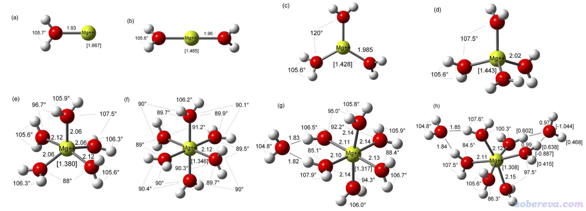

文中对每个结构都计算了<r^2>和各向同性极化率<α>，并绘制了<r^2>^(3/2)与<α>的关系图，如下所示

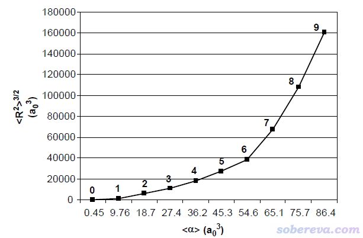

随着配位层的水的数目增多，电子在越广的地方有分布，自然<r^2>会逐渐增大，上图看到的情况完全是理所当然。并且由于有更多的电子可以响应外电场，因此上图所示的极化率随着配位水增加数逐渐增大也是必然的。<r^2>和<α>间的正相关性是比较普遍的现象。

在Chem. Phys. Lett., 454, 323 (2008)中，作者对氮取代的并苯的不同类型的结构做了计算，包括Mobius环、普通环状和线型

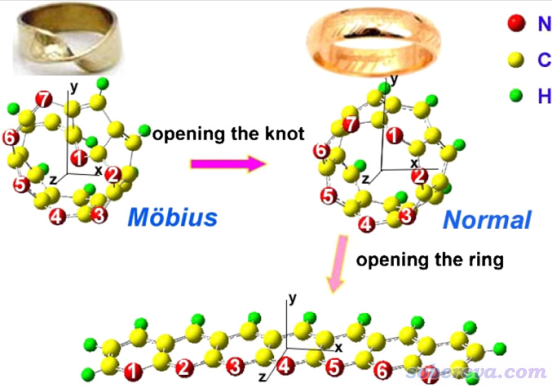

对上面三个体系计算的<r^2>和静态第一超极化率β0如下所示

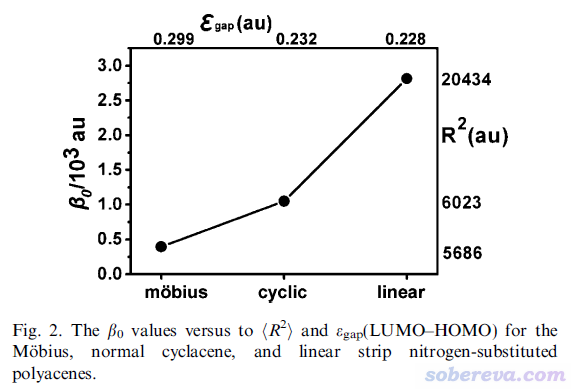

如上可见<r^2>和第一超极化率大小都是线型>普通环状>Mobius环。线型结构是此体系最延展的状态，自然电子分布范围最大，而普通环状和Mobius环的电子分布范围的差异不大，由上图可见二者分别为6023和5686，因此只有借助实际计算的<r^2>才容易定量区分大小。上图体现出<r^2>与第一超极化率往往也有不错的正相关性，在理论研究相似结构的非线性光学特征差异的时候可以顺带关注一下<r^2>。

SN Appl. Sci., 2, 418 (2020)中作者研究了一系列多氯联苯以及带有取代基的情况，研究中对两个苯环间的二面角进行了扫描并计算了各个结构的第一超极化率和<r^2>，如下图所示。可见第一超极化率和<r^2>有正相关性，再次体现出<r^2>与非线性光学性质之间的紧密联系。

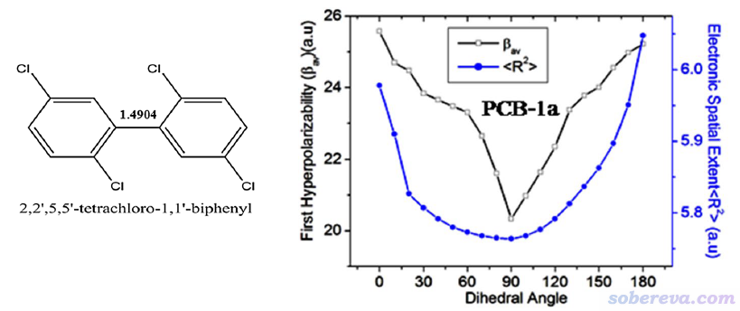

Electrochimica Acta, 115, 234 (2014)的作者将<r^2>视为是离子的电子密度体积的一种衡量，计算了电解液中不同离子的<r^2>，并基于此讨论了纳米多孔电极充电和放电过程的过电势问题。

## 4 电子密度的径向分布函数

某个三维函数f的径向分布函数定义如下。r的含义同前，是距离原点的径向坐标，Ω是球极坐标。注意对RDF从r=0积分到r=∞相当于对f进行整个三维空间的积分。

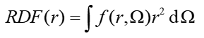

<r^2>与电子密度的RDF之间有如下关系

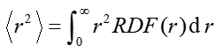

因此，如果你想了解位于不同径向距离的电子对<r^2>的贡献，以及分析不同体系或不同状态间<r^2>差异的来源，可以考察r^2*RDF的曲线图。Multiwfn程序直接提供了绘制和导出任意函数的RDF曲线的功能，大家自行把它再乘上r^2即可。

我们这里绘制一下He的基态的r^2*RDF曲线图。启动Multiwfn，载入He_GS.fch，然后输入  
200  //其它功能（Part 2）  
5  //对指定的实空间函数绘制RDF  
0  //计算RDF和积分曲线  
现在可以选0观看RDF曲线图，但我们目前想考察的是r^2*RDF，因此选5把RDF曲线数据导出为RDF.txt，其中第二列是以埃为单位的径向距离，第三列是RDF数值（a.u.）。之后把RDF.txt导入到比如Origin里，新增加一列D，令其内容为RDF那一列数值乘上径向距离那一列除以0.5291772（变为Bohr为单位）之后的平方，如下所示

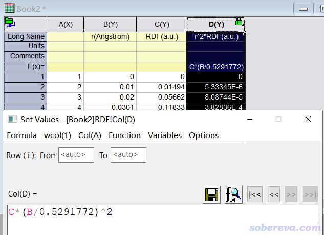

之后将径向距离（B列）和r^2*RDF（D列）分别作为横坐标和纵坐标即可绘制展现不同径向距离对<r^2>贡献的曲线图。以He_S1.wfn为输入文件，也以同样方式获得He的S1态的r^2*RDF(r)曲线数据。下图将S0态和S1态的r^2*RDF曲线绘制在了一起

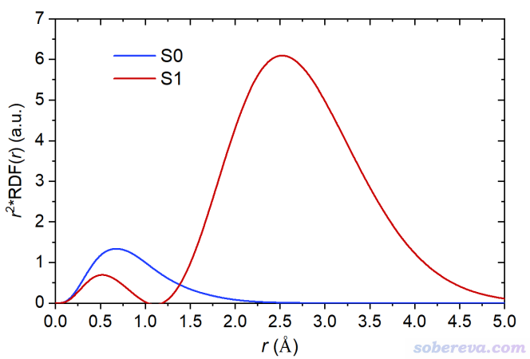

上图曲线下方的积分面积就相当于<r^2>。由于S0态两个电子都在弥散程度很低的1s轨道上，只有距离原子核不太远的区域对<r^2>有贡献。S1态的一个1s电子被激发到了2s上，导致图中出现了两个峰。由于2s上的电子主要分布区域的r较大，导致外侧的峰的面积特别大，即对<r^2>的贡献极大。这也体现出<r^2>的数值极度凸显出分布范围较广的电子的存在感。

## 5 对其它函数考察<r^2>衡量分布范围

实际上，对其它实空间函数也可以计算<r^2>来定量体现它的空间分布广度。在非常灵活的Multiwfn中可以对任意实空间函数计算<r^2>，相当于把前文的<r^2>公式里的电子密度改为相应的函数。这需要用到Multiwfn主功能200的子功能11，这个功能可以对任意Multiwfn支持的实空间函数计算表征其定量分布的指标，也包括<r^2>，详情见Multiwfn手册的3.200.11节。  
注：用这个功能算电子密度的<r^2>也完全可以，只不过这个功能是用的多中心数值格点积分算法来做的，而前文的功能是基于解析积分做的，故这个功能对大体系耗时明显更高，而且精度会稍微低一丁点，所以算电子密度的<r^2>没必要用这个功能。

下面就举个例子，对[(H2O)4]-水合电子体系计算自旋密度的<r^2>来展现此体系中那个未配对的电子分布的广度。在wB97XD/6-311++G**级别结合IEFPCM模型表现水环境的情况下优化的无虚频的[(H2O)4]-结构的波函数文件是<http://sobereva.com/attach/616/file.zip>里面的H8O4-.fchk。对它按照《谈谈自旋密度、自旋布居以及在Multiwfn中的绘制和计算》（<http://sobereva.com/353>）的做法绘制的自旋密度=0.005 a.u.的等值面图如下，可见水合电子主要是被四个水围在中间（但也有部分离域到氧上了），而且四个氢朝着被溶剂化的电子方向形成O-H...e-氢键。

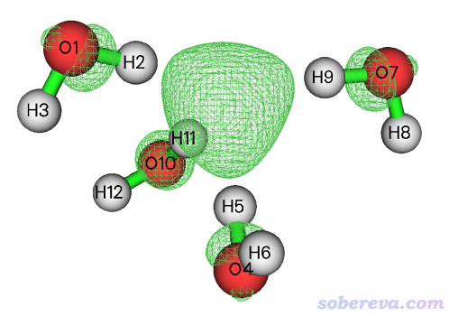

现在来计算这个自旋密度的<r^2>。启动Multiwfn，载入H8O4-.fchk，然后输入  
200  //其它功能（Part 2）  
11  //计算一个实空间函数的中心、一阶矩、二阶矩、回转半径和<r^2>  
3  //选择被考察的函数（默认是电子密度）  
5  //自旋密度  
2  //计算函数的中心位置。然后屏幕上就输出了中心位置  
y  //将这中心位置当做接下来计算各种表征函数分布的量的原点位置  
1  //对选定的函数计算各种表征分布的量

输出信息如下  
Integral over whole space:  9.99955676E-01   //此为自旋密度的全空间积分

The first moment:  
 X=   8.42381720E-15   Y=   9.87404603E-15   Z=   6.21724894E-15  
 Norm=   2.07111665E-28

The second moment:  
 XX=  6.74642468E+00   XY=  6.02776286E-02   XZ=  3.72437358E-02  
 YX=  6.02776286E-02   YY=  5.92056938E+00   YZ= -2.95383533E-02  
 ZX=  3.72437358E-02   ZY= -2.95383533E-02   ZZ=  5.80589584E+00  
 Eigenvalues:  5.79600793E+00  5.92478407E+00  6.75209791E+00  
 Sum of eigenvalues (trace of the second moment tensor):  1.84728899E+01  
 Anisotropy:  8.91701906E-01

Radius of gyration:  4.29810525E+00

Spatial extent of the function <r^2>:       18.472890

即自旋密度的<r^2>为18.47 a.u.，实际上它也正好等于二阶矩（the second moment）矩阵三个对角元的加和。这三个对角元可以分别用来考察X、Y、Z方向各自对<r^2>的贡献是多大。由于XX（6.75）稍微大于YY（5.92）和ZZ（5.80），说明水合电子在X方向上的延展程度比Y、Z方向略微大一点。

上面输出的Radius of gyration（回转半径）也是衡量函数分布广度的指标，它相当于<r^2>除以函数的积分值再开根号。由于当前体系自旋密度全空间积分值为1.0，因此上面输出的回转半径4.298就相当于<r^2>直接开根号。

## 6 计算原子的电子密度的<r^2>

Multiwfn不仅可以计算整个分子的电子密度的<r^2>，还可以计算原子的，由此可以考察化学体系中各个原子上的电子的空间分布的广度，以更好地理解不同原子的特征。Multiwfn的模糊空间分析（子功能15）可以基于模糊式划分定义原子空间，盆分析（主功能17）可以基于电子密度零通量面划分得到AIM理论定义的原子空间，在这两个主功能里都有相应的选项计算原子空间内的偶极矩、多极矩以及<r^2>，这里用的r不是相对于(0,0,0)的距离，而是相对于被考察的那个原子核的距离。

这里举个例子，使用Hirshfeld划分计算氟代乙烷的各个原子的<r^2>。启动Multiwfn，然后依次输入  
examples\C2H5F.wfn  
15  //模糊空间分析  
-1  //修改模糊空间定义  
3  //Hirshfeld划分（基于内置球对称化的原子密度计算）  
2  //计算原子和分子的多极矩以及<r^2>  
程序依次输出了各个原子的多极矩和<r^2>（Atomic electronic spatial extent <r^2>后面的值，X/Y/Z分量在下面一行也给了），最后输出了整个分子的这些量。笔者将各个原子的<r^2>在这里汇总列出，其中1~4号原子是甲基部分，5~7是亚甲基部分：  
C1 12.308481  
H2  2.250021  
H3  2.258035  
H4  2.250021  
C5 12.038875  
H6  2.197460  
H7  2.197460  
F8 10.077855  
可见氢原子的电子分布范围远小于重原子的，这和我们对原子半径的认识也是一致的。C5的<r^2>小于C1的，这可能一定程度上是因为C5连了电负性较大的氟，导致其Hirshfeld原子电荷（在上面计算时一并输出了）0.116比C1的-0.058更正，也因此带的电子数更少。F带的电子数虽然比C更多，但由于F的核电荷更大，电子被束缚得更紧，因此其<r^2>比C1和C5都小（你也可以对孤立的F和C原子进行计算，也是这样的大小关系）。

## 7 总结

本文对Gaussian输出文件里能直接看到的电子空间范围<r^2>的定义、物理意义，以及一些实际应用都做了介绍，并且结合具体例子讲解了如何用Multiwfn来计算<r^2>。从上文可看出，通过Multiwfn考察<r^2>很灵活强大，比靠Gaussian直接来计算有诸多重要好处：(1)不花钱 (2)支持几乎所有量化程序 (3)可以获得<r^2>的不同分量（这对于明显偏离对称的体系尤其重要）(4)可以计算各个轨道的贡献来分析其本质 (5)可以借助径向分布函数洞察<r^2>数值的来源 (6)可以考察各个原子的<r^2>。另外，Multiwfn对于任何实空间函数（无论是Multiwfn直接支持的超过100种函数，还是由其它程序产生并以.cub等格点数据文件记录的）都可以计算<r^2>从而衡量其空间分布广度，对于讨论许多化学问题大有益处。
