**使用Multiwfn计算晶体结构中自由区域的体积、图形化展现自由区域**

Using Multiwfn to calculate volume of free regions in crystal structures and graphically display free regions

文/Sobereva@[北京科音](http://www.keinsci.com)  2021-Sep-15

## 0 前言

之前笔者写过一篇《使用Multiwfn图形化展示分子动力学模拟体系中的孔洞、自由区域》（<http://sobereva.com/539>），讲解怎么用Multiwfn计算分子动力学模拟出的盒子里面的自由区域的体积（free volume）、怎么图形化展示自由区域（free region）。最近更新的Multiwfn在这部分功能上又做了大幅强化，使得这个功能如今也特别适合用于考察实验测定的或理论预测的晶体结构中的自由区域，对于经常和晶体打交道的人非常有用处。在本文就举简单的例子体现Multiwfn在这方面的重要用处，也算是对前文的补充和扩展。绝大部分细节、原理和算法在<http://sobereva.com/539>的第3节里都详细说过了，读者没看过的话一定要仔细看一下，这里就不再重复了。

读者请务必使用2021-Sep-14及以后更新的Multiwfn，可以在<http://sobereva.com/multiwfn>免费下载。如果你对Multiwfn不了解的话看《Multiwfn入门tips》（<http://sobereva.com/167>）和《Multiwfn FAQ》（<http://sobereva.com/452>）了解相关常识。使用本文的方法发表文章时请记得按照Multiwfn启动时的提示恰当引用程序。

使用本文介绍的功能可以用各种Multiwfn支持的包含晶胞信息的文件作为输入文件。比如含有CRYST1字段的pdb文件、GROMACS程序的gro文件、cif文件、VASP的POSCAR、CP2K的restart文件、含有平移矢量（Tv）的Gaussian输入文件，等等，完整列举见《使用Multiwfn非常便利地创建CP2K程序的输入文件》（<http://sobereva.com/587>）的相应部分。本文的例子全都用X光衍射测定的cif文件作为输入文件。

## 1 例1：有机共价框架化合物

### 1.1 计算格点数据

Multiwfn文件包里的examples\COF_12000N2.cif是一个有机共价框架化合物（COF）的晶体结构文件，我们对它计算自由区域的体积并图形化展现之。启动Multiwfn，然后输入  
examples\COF_12000N2.cif  
300  //其它功能（Part 3）  
1  //计算自由区域体积、可视化自由区域  
1  //设置格点并开始计算  
[按回车]  //用默认的(0,0,0)作为格点数据的起点  
[按回车]  //用晶胞的三个边长作为格点数据计算范围的三个边长  
[按回车]  //格点间距用默认的0.25埃。数值越小耗时越高、图像越精细、自由区域体积计算越准确。而同样格点间距下，晶胞越大，格点数就越多，耗时会越高

瞬间就算完了，从屏幕上可见  
Volume of entire box:    2996.151 Angstrom^3  
 Free volume:    1953.217 Angstrom^3, corresponding to   65.19 % of whole space  
即曰自由区域的体积是1953.2 Å^3，占晶胞总体积2996.2 Å^3的65.2%。由于自由区域，即没被原子占据的区域，都达到了差不多2/3，显然这个体系的密度肯定比较低。注意当Multiwfn一开始载入这个cif文件时，从屏幕上可以直接读到此体系的密度，如下所示，可见确实密度很低：  
Density:   0.70565 g/cm^3    (   705.653 kg/m^3 )

格点数据算完后就进入了后处理菜单。虽然里面的选项3可以直接观看平滑后的格点数据等值面，但由于当前体系的晶胞是非正交的，这种情况在Multiwfn里目前还无法正常显示等值面图，因此我们选择选项4将平滑化的格点数据导出为当前目录下的free_smooth.cub，之后可以用VMD、VESTA、ChimeraX等第三方可视化程序观看等值面。

### 1.2 使用VMD显示自由区域

下面我们用VMD观看free_smooth.cub的等值面图。VMD可以在<http://www.ks.uiuc.edu/Research/vmd/>免费下载，这里笔者用的是VMD 1.9.3 Windows版。在VMD里对cub文件快速显示效果很好的等值面的方法在《在VMD里将cube文件瞬间绘制成效果极佳的等值面图的方法》（<http://sobereva.com/483>）里已介绍了。简单来说，把Multiwfn程序包里的examples\scripts目录下的showcub.vmd复制到VMD目录下，用文本编辑器编辑VMD目录下的vmd.rc，在末尾插入一行source showcub.vmd并保存。之后把free_smooth.cub移动到VMD目录下，启动VMD，然后在文本窗口输入cub free_smooth 0.5即可显示出数值为0.5的等值面。然后再在文本窗口里输入pbc box命令显示出边框，即看到下图

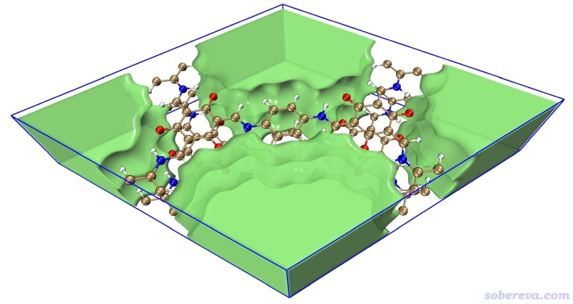

可见绿色等值面非常理想地将自由区域展现了出来。

还可以在VMD main窗口里选Display - Orthographic改为正交视角，然后按一下键盘上的等号键重置视角，从而精确地以垂直的视角观看此体系、更准确地观看自由区域的轮廓，如下所示

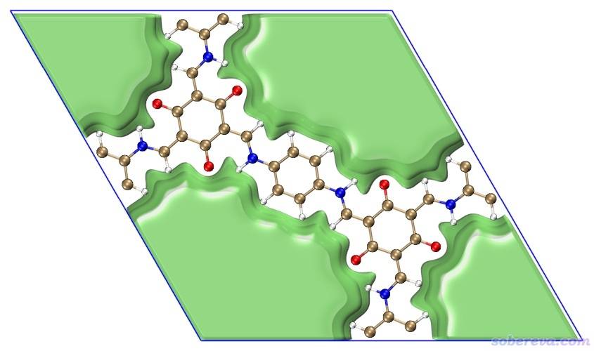

当前等值面覆盖的区域基本上就是不在分子范德华半径内的区域。因此如果在VMD的"Graphics" - "Representation"里把显示体系结构的那个表示的Drawing method改为VDW显示其范德华表面，就会看到范德华表面和等值面几乎精确贴合，如下所示，这体现出当前展示的自由区域的合理性

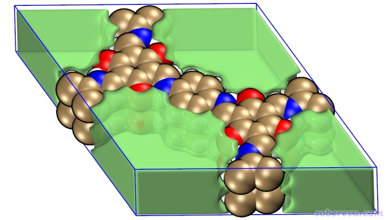

上面是对平滑化的格点数据绘制数值为0.5的等值面，大家可以在"Graphics" - "Representation"里点击第二项（它用于显示正值部分的等值面），修改里面的isovalue值，设得越接近1则自由区域显得越大，越接近0则显得自由区域越小，可以由此微调自由区域的显示效果。

### 1.3 使用VESTA显示自由区域

VESTA是常用的晶体结构可视化程序，也可以显示等值面，在<http://jp-minerals.org/vesta/en/>可免费下载。用VESTA显示自由区域甚至可以得到比VMD更好的效果，所以这里特意说一下。笔者用的是VESTA 3.5.7。

启动VESTA后把free_smooth.cub往里一拖就可以载入，确保界面左侧Style标签页里的Show isosurfaces是选中的状态。然后点击左下角的Properties，选择Isosurfaces标签页，选择列表框里面仅有的那项，把Isosurface level设为0.5。可以再修改一下Opacity 1后面的值，越接近255透明度越低，这里设为220。此时界面里的设置以及看到的图像如下所示，可见图像效果很不错。

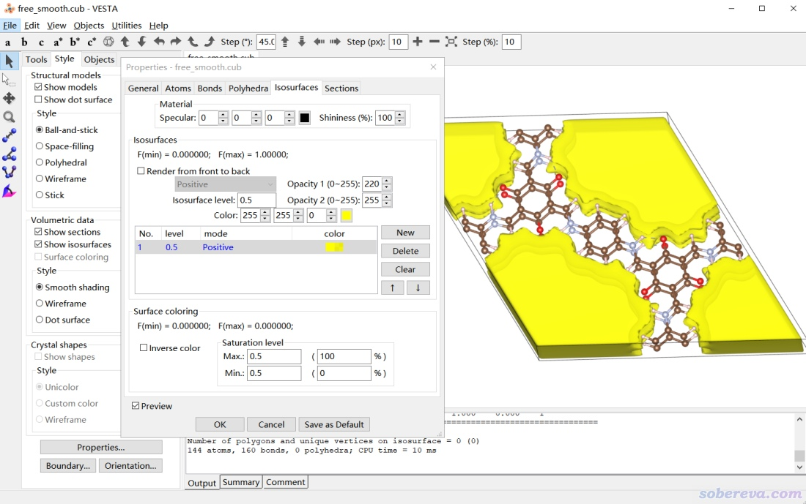

上面在VMD和VESTA里看到的自由区域对应的等值面在盒子边缘处是封闭的，这是由于Multiwfn默认设置下做了特殊处理所致的。如果你不希望边界被封闭，也可以在主功能300的子功能1的界面里选一次“5 Toggle making isosurface closed at boundary”选项使之状态切换为No，之后再按照与前文相同的操作计算格点数据、导出free_smooth.cub。之后拖入VESTA，将界面左侧的Show sections复选框取消选中，然后按前文的方式显示等值面后看到的就是下图的效果

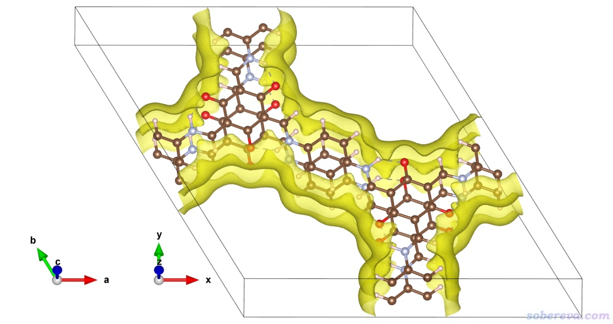

VESTA也可以直接把上图中的自由区域填充显示，只需点击界面左侧的Show sections开启section的显示即可，此时如下所示，效果很好，特别是占据区域与自由区域之间的过渡区域用色彩渐变的方式美观地展示了出来

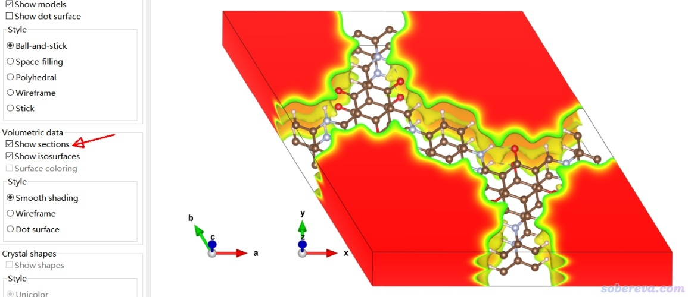

可以再把显示效果改改。这里在界面左侧将等值面的显示风格设为Wireframe，然后点Properties按钮，在Sections标签页里修改透明度、要求显示等值线、色彩刻度改为R-G-B，之后界面状态和看到的图像如下所示，可见非常漂亮。

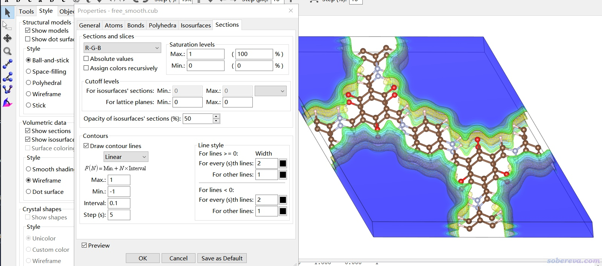

## 2 例2：C60晶体

这个例子我们考察一下C60晶体结构中的自由区域。此体系的cif文件可以在<http://sobereva.com/attach/617/C60.cif>下载。

启动Multiwfn，载入C60.cif，然后输入  
300  //其它功能（Part 3）  
1  //计算自由区域体积、可视化自由区域  
1  //设置格点并开始计算  
[按回车]  //用默认的(0,0,0)作为格点数据的起点  
[按回车]  //用晶胞的三个边长作为格点数据计算范围的三个边长  
0.15  //格点间距为0.15埃  
之后从屏幕上可见，自由区域占了整个晶胞的27.9%，比前例COF的情况小得多。

此例为了图像效果理想，使用了比默认的0.25埃更小的格点间距。由于当前晶胞不大，所以也是瞬间就算完了。如果你对比一下，会发现0.15埃时候的等值面图比0.25埃的时候更平滑。

由于这个体系的晶胞是正交的，因此可以在Multiwfn里直接显示自由区域对应的等值面。在后处理菜单选择3，并且勾选Show cell复选框，就可以看到下图

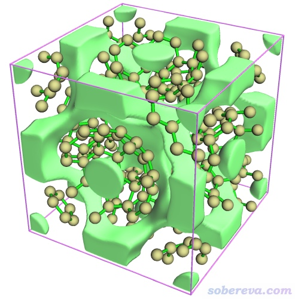

如果导出free_smooth.cub后放到VESTA里绘制，且结构用Stick方式显示，可以把自由区域看得更清楚，如下所示（这里选了View - Perspective切换为了透视视角）。可见在C60中心区域，以及六个富勒烯的接壤处（下图中央部分）都有明显的自由区域。

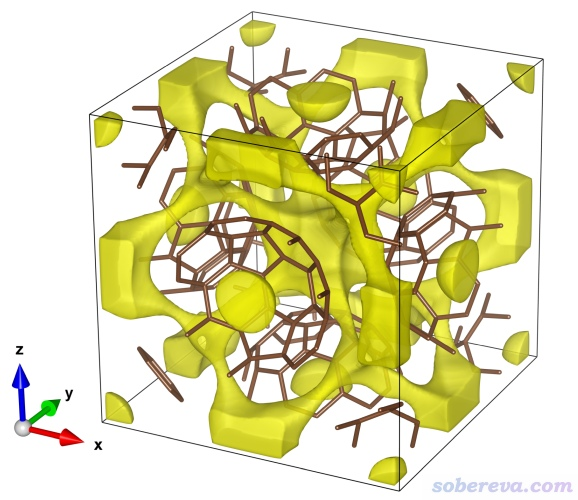

## 3 例3：硫花

这个例子我们考察一下硫花晶体结构中的自由区域。此体系的cif文件可以在<http://sobereva.com/attach/617/sulflower.cif>下载。

载入这个文件，进主功能0，并且选Other settings - Toggle showing cell frame后看到的单胞结构如下。

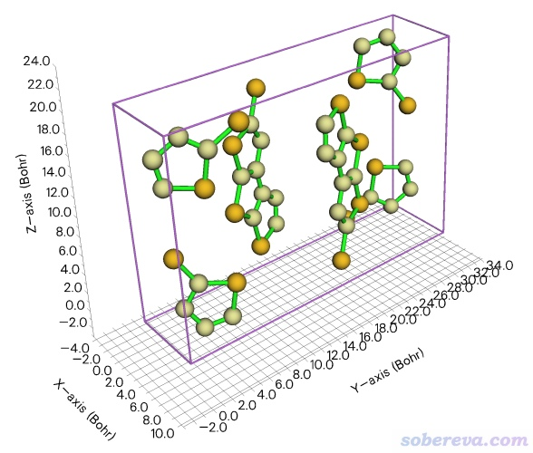

可见晶胞把硫花分子结构截断了，甚至连一个完整的分子都没有。为了能清晰地观察孔洞区域与分子位置的相对关系，我们应当先把晶胞延展复制得大一些，这可以用《Multiwfn中非常实用的几何操作和坐标变换功能介绍》（<http://sobereva.com/610>）里介绍的功能。在Multiwfn里输入  
300  //其它功能（Part 3）  
7  //对当前体系做几何操作  
19  //构造超胞  
3  //第一个方向延展成原先的3倍  
1  //第二个方向保持原状  
2  //第三个方向延展成原先的2倍  
此时可以选0看一下当前的结构，如下所示，可见晶胞基本上够大了

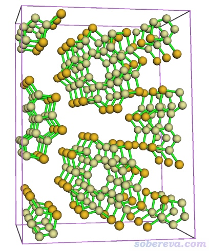

之后可以选相应将当前结构选项保存成结构文件，而我们这里不保存，直接输入-10返回主功能300的界面。之后使用和上一个例子完全相同的过程产生free_smooth.cub并用VESTA绘图。恰当设置等值面数值、颜色和透明度之后看到下图

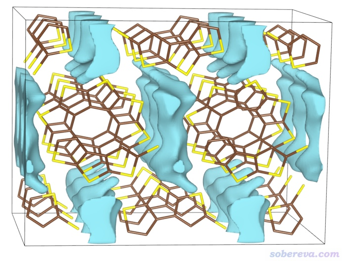

由图可见，硫花堆叠的方向并没有自由区域，因为堆积得很紧密，但是硫花侧向接触的区域却有不小的自由区域。

## 4 总结

本文介绍了使用Multiwfn程序计算晶体中自由体积，以及结合VMD或VESTA绘制出漂亮、清晰的描述自由区域的等值面的方法。本文的方法涉及的程序完全免免费，操作简单，普适性强，对于常见大小的晶胞耗时非常低，因此对于经常和分子晶体、多孔材料等类型晶体打交道的人很有用处，在相关研究文章中都可以放一张这种图。而且通过图形化展现自由区域还便于考察小分子可能的吸附位置，有时候还可以与《谈谈范德华势以及在Multiwfn中的计算、分析和绘制》（<http://sobereva.com/551>）里介绍的对晶体计算范德华势相结合进行更充分的讨论。

另外值得一提的是，使用默认的方法（基于误差函数，scale factor为1）产生的平滑化的格点数据不一定总是图像效果最理想的，有时候在Multiwfn里切换成其它的函数做平滑可能效果更好，这在《使用Multiwfn图形化展示分子动力学模拟体系中的孔洞、自由区域》（<http://sobereva.com/539>）的第3节有专门说明。有时候0.5的等值面对自由区域的展现也不是最理想的，大家可以根据实际情况进行适当调节。

如果你不是想对晶胞、盒子里的孔洞予以展现，而只是想展现笼状、环状分子里的孔洞以及计算其体积，不要用本文的做法，有专门的文章：《使用Multiwfn可视化分子孔洞并计算孔洞体积》（<http://sobereva.com/408>）。

后记：网上有个人看了本文后，问我能不能对他用CP2K做动力学模拟的两个二维材料间的空隙区域予以展现，我遂用Multiwfn载入了他的CP2K的restart文件，按照本文方法作了图。Multiwfn里计算时要求边界不封闭，在VESTA里显示时将section的透明度设为了10%，等值面数值设为了0.95（此时只有最显著的孔洞区域会被展现），得到的图像如下所示，可见非常清晰地把两个片层之间的孔洞以黄色等值面表现了出来。

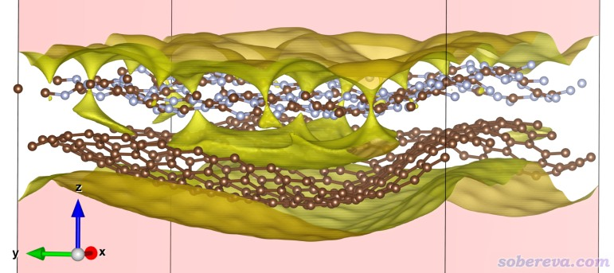
