**使用Multiwfn定量化和图形化考察分子的平面性（planarity）**

Using Multiwfn to quantify and graphically investigate planarity of molecules

文/Sobereva@[北京科音](http://www.keinsci.com) 

First release: 2021-Sep-16   Last update: 2021-Oct-15

## 0 前言

分子的平面性（planarity）是分子的一个很重要的结构特征，有很多问题都和平面性密切相关。对pi共轭体系，由于其平面性明显影响pi电子共轭能力，因此和芳香性、导电性、光学性质等都有密切关系。而且平面性也影响分子间pi-pi相互作用、形成堆积结构的能力。

之前有一次网上有人问我怎么衡量分子的平面性，我仔细搜索发现以前并没有什么很理想、很普适的方法专门考察这个问题。虽然有很多文章都是通过特定的二面角来体现平面性的，但是这种做法局限性很大，如果是比如联苯这种体系还好，靠两个苯环之间的二面角就能体现整体的平面程度，而碰上平面性同时由很多二面角共同决定的情况，比如碗烯，就很难靠二面角来表征平面性了。为了让分子平面性这个重要特征有可靠、简单又普适的方法去考察，笔者提出了两个定量表征平面性的参数MPP和SDP，以及一种图形化展现平面性的方法，近期已发表在了*Journal of Molecular Modeling*, **27**, 263 (2021) <https://doi.org/10.1007/s00894-021-04884-0>。这种分析已经在免费、流行的Multiwfn程序中实现。

下面，将对笔者提出的考察平面性的方法的思想先做简要介绍，更多细节请看原文。之后给出几个在Multiwfn中考察平面性的具体例子，使读者既了解这种方法的价值也了解怎么在Multiwfn中方便地实现。读者请务必使用2021-Sep-16及之后更新的Multiwfn，可在<http://sobereva.com/multiwfn>免费下载。不了解此程序者参见《Multiwfn入门tips》（<http://sobereva.com/167>）和《Multiwfn FAQ》（<http://sobereva.com/452>）。使用Multiwfn按照本文介绍的方法研究平面性时请同时引用Multiwfn程序启动时显示的程序原文和上述的Journal of Molecular Modeling文章。

## 1 定量化和图形化考察平面性的方法

笔者提出的考察平面性的方法依赖于拟合平面。首先要对整个分子或被考察的局部区域根据其中原子的坐标利用最小二乘法拟合出一个平面，并且要求这个平面穿越这些原子的几何中心。这样得到的平面是对被考虑的原子所处的平面的最佳的描述，可以用平面方程Ax+By+Cz+D=0表示。

之后可以计算分子平面性参数（molecular planarity parameter, MPP），它是各个原子距离拟合平面的方均根偏差，如下所示

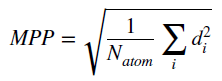

其中N_atom是被考虑的原子总数。d_i代表i原子距离拟合平面的距离，可以由下式得到

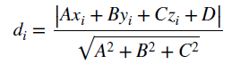

距离d并不区分原子是在拟合平面的哪一侧。为了能够予以区分，笔者定义了距离拟合平面的含符号距离d_s，也即把上式的绝对值符号给去掉。d_s数值为正和为负对应原子在拟合平面的不同两侧

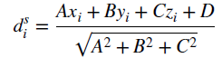

偏离平面跨度（span of deviation from plane, SDP）参数定义如下，其中d_s_max和d_s_min分别是所有被考虑的原子中d_s最正和最负的值

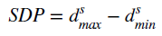

MPP和SDP这两个参数都可以定量衡量平面性，都是数值越小平面性越强、结构越接近平面。完全平面的体系这两个指标同时精确为0。但是它们的特征不同，展现出的信息有明显互补性。MPP体现的被考虑的区域的总体平面性，而SDP衡量的是被考虑的区域中偏离拟合平面的最大程度，即体现了垂直于拟合平面的最大跨距。二者的共性和差异在后文的例子中将会看到。

d_s这个量除了用于计算SDP外还另有用处。笔者发现如果对原子根据其d_s值以不同颜色进行着色，可以非常鲜明直观地体现出各个原子相对于拟合平面的位置和程度，这对于展现体系结构特征非常有益，可以管这叫做“d_s着色表示法”。

Multiwfn计算上面这些量的功能是主功能100的子功能21的一部分，也可以在主菜单里直接输入MPP快速进入。进入后输入要考察的原子序号范围，立刻就能得到MPP和SDP值。之后还可以产生pqr文件，里面的原子charge属性对应的就是原子的d_s值，可以放到VMD程序里对原子根据charge属性进行着色来直观展示各个原子的d_s值。这个功能不仅可以处理单个结构，还可以提供轨迹文件，让Multiwfn一次性对里面的一批结构进行计算。

使用这个功能可以使用Multiwfn支持的任意包含体系结构信息的文件作为输入文件，支持的格式非常丰富，比如pdb、xyz、mol、mol2、gro、cif、Gaussian和ORCA的输入输出文件、POSCAR、fch、mwfn等等，详见《详谈Multiwfn支持的输入文件类型、产生方法以及相互转换》（<http://sobereva.com/379>）。输入的轨迹文件目前只支持xyz格式，格式介绍见《谈谈记录化学体系结构的xyz文件》（<http://sobereva.com/477>）。

下面就演示用Multiwfn来对不同体系计算上面提到的这些量。

## 2 实例1：考察轮烯（annulene）分子的平面性

轮烯是一类环状烃类体系，当碳数n为偶数时通式是CnHn。根据n的不同，由于位阻效应和芳香性的差异，轮烯有的是纯平的有的是扭曲的。Multiwfn程序包的examples目录下的[14]annulene.xyz是ωB97XD/def2-TZVP级别优化的[14]annulene轮烯分子结构，如下所示，可见整体有一定平面性但又不是完全平面。此例我们就用上文介绍的方法定量考察它的平面性

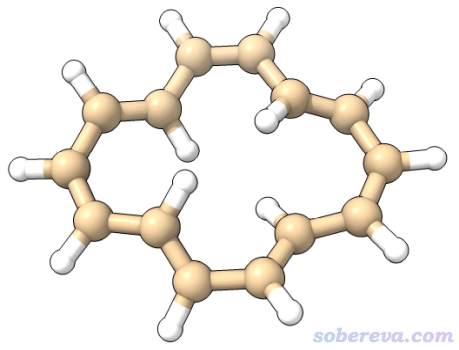

启动Multiwfn，然后输入  
examples\[14]annulene.xyz  
MPP  //进入考察平面性的功能  
h  //代表考虑所有非氢原子，因为氢通常不是我们感兴趣的。这里也可以输入具体原子序号

本文介绍的方法耗时特别低，对于很大体系都不花什么时间，对于当前这种小体系更是一瞬间就得到了结果，屏幕上显示的信息如下所示

Plane equation: A=   1.00000  B=  -0.00000  C=   0.00233  D=   0.00000

Deviation of atom    1(C ) to the plane:  -0.21768 Angstrom  
 Deviation of atom    2(C ) to the plane:   0.21768 Angstrom  
 Deviation of atom    3(C ) to the plane:   0.21430 Angstrom  
 Deviation of atom    4(C ) to the plane:  -0.21430 Angstrom  
 Deviation of atom    5(C ) to the plane:  -0.07768 Angstrom  
 Deviation of atom    6(C ) to the plane:   0.07768 Angstrom  
 Deviation of atom    7(C ) to the plane:  -0.04457 Angstrom  
 Deviation of atom    8(C ) to the plane:   0.04457 Angstrom  
 Deviation of atom    9(C ) to the plane:  -0.02456 Angstrom  
 Deviation of atom   10(C ) to the plane:   0.02456 Angstrom  
 Deviation of atom   11(C ) to the plane:   0.09971 Angstrom  
 Deviation of atom   12(C ) to the plane:  -0.09971 Angstrom  
 Deviation of atom   13(C ) to the plane:  -0.03585 Angstrom  
 Deviation of atom   14(C ) to the plane:   0.03585 Angstrom  
 Maximal positive deviation to the fitted plane is    2(C ):   0.21768 Angstrom  
 Maximal negative deviation to the fitted plane is    1(C ):  -0.21768 Angstrom

Molecular planarity parameter (MPP) is    0.127145 Angstrom  
 Span of deviation from plane (SDP) is    0.435354 Angstrom

由上可见，一开始先显示了拟合的平面方程的参数，然后显示了各个原子偏离拟合平面的含符号距离，即d_s值。然后输出了d_s最正和最负的两个原子，前者减去后者就是后面给出的SDP值。上面信息最后显示出[14]annulene上的碳原子对应的MPP参数值是0.127埃，SDP是0.435埃。这样的值是大是小？一会儿我们和其它尺寸的轮烯做个对比，结合图像考察就能充分明白了。

当前程序问你是否导出pqr文件，这里输入y，然后再输入保存的路径，就得到了pqr文件。现在我们在VMD程序中利用此文件里的d_s值对原子进行着色。VMD可以在<http://www.ks.uiuc.edu/Research/vmd/>免费下载，笔者用的是VMD 1.9.3。

启动VMD后，将pqr文件拖入VMD main窗口里载入，进入Graphics - Representation界面，将Drawing Method改为CPK，然后把Coloring Method改为Charge。在Trajectory标签页里把Color Scale Data Range下面文本框里的色彩刻度下限和上限分别改为-0.5和0.5（输入后按回车生效），当前单位是埃。着色的上下限完全由自己决定，图像效果好即可，但不同体系间横向对比时必须统一。默认色彩变化是红-白-蓝，而笔者习惯用蓝-白-红，故进入Graphics - Colors，将Color Scale标签页里的Method改为BWR。最后把背景改为白色（可以按照《VMD初始化文件(vmd.rc)我的推荐设置》<http://sobereva.com/545>里的做法定义改背景颜色的快捷键），此时就看到了下图左侧。为了便于读者更好地看清楚相对位置关系，用licorice风格显示的侧视图在下图右侧也给出了（色彩刻度条是自行ps上去的，可以把Graphics - Colors界面里显示的色彩刻度条直接挪上去再手动加上上下限标签）

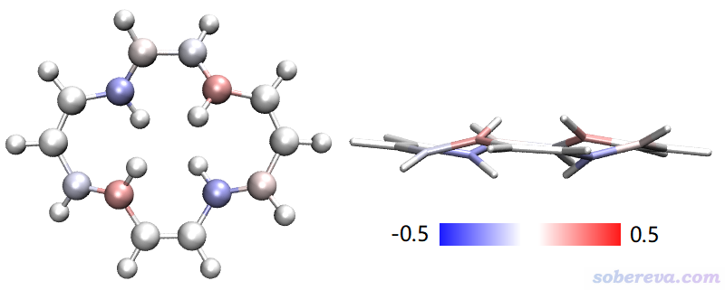

由于当前计算没有考虑氢原子，所以氢原子都是白色的，不用管。那些基本处在拟合平面上的碳原子的颜色都是白色的，说明d_s值非常小。明显处于拟合平面上方和下方的碳原子分别以红色和蓝色清晰地展现了出来，颜色越深说明偏离拟合平面越远。

以相同做法，在前述的J. Mol. Model.文章中笔者对n=4到n=22的所有n为偶数的[n]annulene都计算了MPP、SDP以及d_s着色图，汇总如下

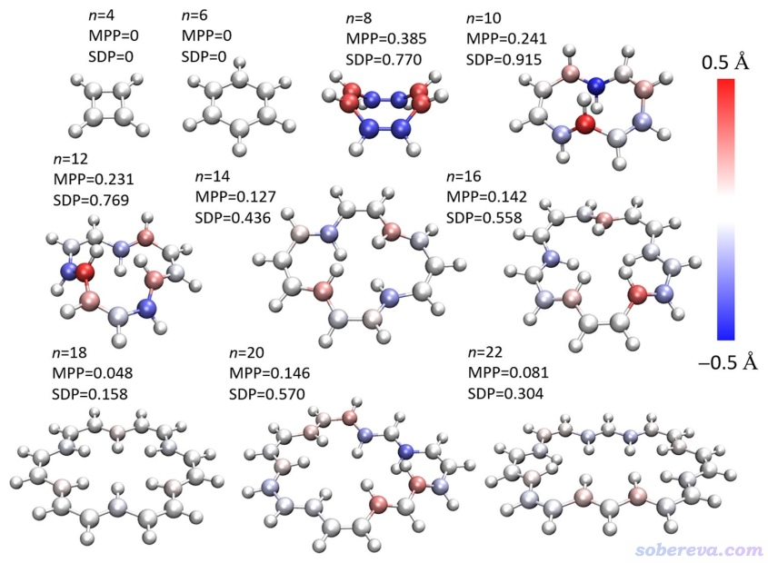

由上图可看出利用本文介绍的方法，可以将不同尺寸的轮烯的平面性特征非常清晰地展现，既定量化成了具体数值，通过原子着色图也能很容易地了解MPP和SDP数值大小的成因。上图体现出[4]annulene和[6]annulene，也相当于环丁二烯和苯，是完全平面的。[18]annulene和[22]annulene也几乎是平面的，MPP很小而SDP也不大，原子基本都是白色。[8]annulene是所有体系中MPP最大的，确实整体来看它弯得最厉害，最不平面。[10]annulene的MPP不如[8]annulene大，说明整体平面性还比[8]annulene好点，但是它的SDP却是所有体系里最大的，这是因为图中特别蓝和特别红的那两个原子偏离整体的拟合平面特别显著，因此偏离平面的跨度特别大，这两个原子的d_s值也分别对应计算SDP参数时的d_s_min和d_s_max。通过对比可看出MPP和SDP在衡量平面性时是互补的，有各自的价值，没有必然的正相关性。

以后大家研究自己的体系时，可以将实际算出来的MPP、SDP以及原子着色的情况与上面展示的不同轮烯的情况做对比，来评估自己的体系的平面性大致算是什么程度，是像比如[18]annulene那样近乎平面，还是类似[14]annulene那样有一定平面性，还是像[8]annulene那样平面性极差。

## 3 实例2：考察BDHN-TTF晶体结构中分子的平面性

使用Multiwfn也可以对整体结构中的某个部分考察其平面性。作为例子，这里我们考察BDHN-TTF分子晶体中的一个分子的平面性。晶体的cif文件可以在<http://sobereva.com/attach/618/BDHN-TTF.cif>下载。

将这个cif载入Multiwfn，在主功能0里直接看到的晶胞的结构如下所示（要在上方菜单中选Other settings - Toggle showing cell frame把晶胞边框也显示出来）

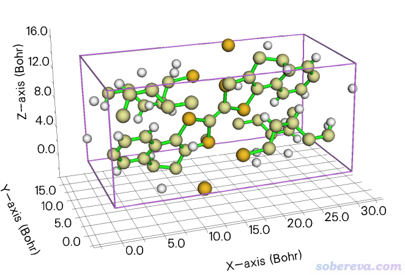

可见分子被晶胞截断了，没法直接考察完整的分子。为了能让一个完整的分子在体系中央，可以用Multiwfn向晶胞的第2、3个方向各复制延展一次构成超胞，并且让Multiwfn把被截断的分子保留完整，做法在《Multiwfn中非常实用的几何操作和坐标变换功能介绍》（<http://sobereva.com/610>）里有介绍。现在关闭主功能0的图形窗口，然后在Multiwfn主菜单里输入  
300  //其它功能（Part 3）  
7  //对当前体系做几何操作  
19  //构建超胞  
1  //晶胞的第1个方向保留原样  
2  //晶胞的第2个方向平移复制成原先的两倍  
2  //晶胞的第3个方向平移复制成原先的两倍  
20  //令分子保持完整  
0  //观看当前的体系

当前体系结构如下所示

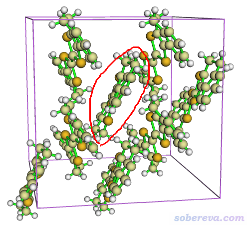

可见晶胞已经够大了，而且如上面红圈所标注的，中间有一个完整的分子，我们就对它来考察平面性，这需要先得到这个分子里的非氢原子的原子序号。做法是先选界面上方的Other settings - Toggle showing hydrogens让氢不显示，然后选界面右侧的Show label复选框显示出原子序号，适当放大体系和旋转视角，记录中间分子中任意一个原子的序号，比如113。然后点Tools - Select fragment，输入113，整个分子就被高亮了，而且其中的所有非氢原子的序号都显示在文本框里了，如下所示

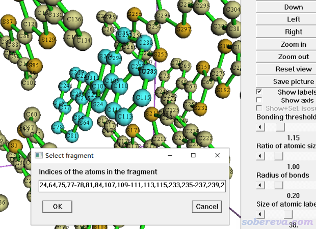

把文本框里的所有序号复制出来备用：24,64,75,77-78,81,84,107,109-111,113,115,233,235-237,239,241,274,285,287-288,291,294,318。之后点OK，再点RETURN按钮关闭图形窗口。接下来就可以效仿前例考察平面性了。依次输入  
-10  //返回到主功能300  
0  //返回到Multiwfn主菜单  
MPP  //进入考察平面性的功能  
24,64,75,77-78,81,84,107,109-111,113,115,233,235-237,239,241,274,285,287-288,291,294,318 //把中央分子的原子序号粘贴进来（如果是用的Windows，在Multiwfn窗口标题栏点右键选“编辑”-“粘贴”）

然后在屏幕上看到以下输出  
Molecular planarity parameter (MPP) is    0.239126 Angstrom  
 Span of deviation from plane (SDP) is    0.796772 Angstrom  
由于MPP不算小，所以此分子的整体的平面性并不好，而且SDP颇大，说明肯定有某些原子极度偏离整体分子对应的拟合平面。

然后选y导出pqr文件，并把它载入到VMD里。在VMD里设成白背景，文本窗口输入pbc box命令显示出盒子边框。然后进入Graphics - Representation，把Drawing method改为Licorice，Bond Radius改为0.1。然后点击Create Rep按钮新建一个表示，在Selected Atoms文本框里输入same fragment as serial 113（113是中间分子中的一个原子的序号，当前语句选择这个原子所在的整个片段，见《VMD里原子选择语句的语法和例子》<http://sobereva.com/504>了解更多信息）。然后把Drawing Method改为CPK，Bond Radius改为0.5，Coloring Method改为Charge，Material改为Edgy Shiny（并确保VMD main窗口里选了Display - Rendermode - GLSL，否则材质的效果无法如实展现）。然后像上一节例子一样把色彩刻度范围设为-0.5~0.5，用蓝-白-红色彩过渡方式着色。之后可以在Graphics - Materials对EdgyShiny材质的定义做一些微调以让图像效果更好。此时看到的图像如下所示

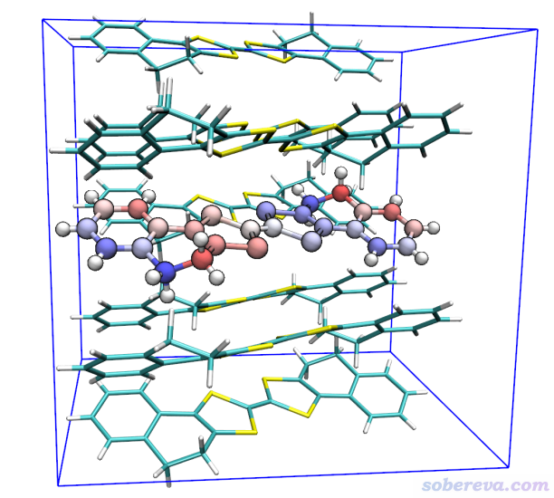

可见大多数非氢原子的颜色都不淡，明显说明整体的平面性较差。颜色最深的原子是体系中sp3杂化的碳，它们偏离拟合平面距离最远，也正是因为它们的存在使得分子结构发生了严重扭曲。

## 4 实例3：计算18碳环在分子动力学轨迹中的平面性变化

笔者对18碳环（cyclo[18]carbon）做过大量研究并发表了系列文章，汇总见<http://sobereva.com/carbon_ring.html>。其中《揭示各种新奇的碳环体系的振动特征》（<http://sobereva.com/578>）一文介绍的Chem. Asian J., 16, 56 (2021) DOI: 10.1002/asia.202001228论文中笔者做了18碳环的从头算动力学模拟，并且指出18碳环在平面内和平面外都有高度的柔性。这一节通过前文介绍考察平面性的方法研究一下整个动力学模拟过程中的18碳环的平面性的变化。298.15 K下动力学模拟的前500 fs轨迹文件是examples目录下的C18_MD_500.xyz，每1 fs保存一次结构，因此共有501帧。初始帧（第0帧）是几何优化后的18碳环极小点结构，是精确平面的结构。

启动Multiwfn然后输入  
examples\C18_MD_500.xyz  
MPP  
a  //代表选择所有原子，a意为all  
a  //代表考虑轨迹文件里的所有帧。也可以输入特定的帧号范围

由于本文介绍的考察平面性的算法简单，而且Multiwfn计算效率高，所以即便有501帧也在一瞬间就算完了。Multiwfn在当前目录下输出了MPP_SDP.txt，其中一行对应一帧，第1、2、3列分别是帧号、MPP和SDP值。可以将之通过Origin之类程序并绘制成曲线图，如下所示（下图是对完整的2000 fs的模拟轨迹绘制的，轨迹文件可以在<http://sobereva.com/multiwfn/extrafiles/C18-MD.xyz>下载）

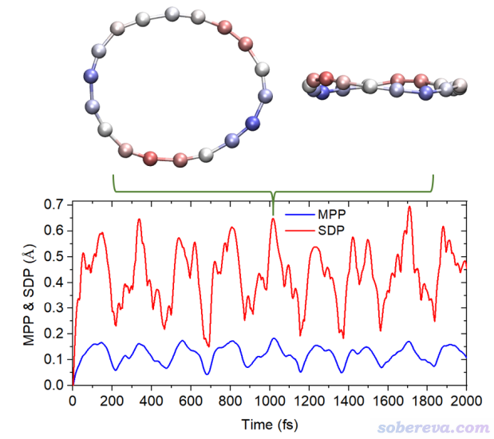

可见上图非常清晰地展现出模拟过程中18碳环平面性的变化，其平面性是周期性波动的，大约220 fs一个周期。由于18碳环的平面外变形比较容易，因此可以看到MPP和SDP的最大值都不小。1015 fs那一刻的d_s着色图也附在上图了，可见这种图把这个时刻的各个原子位置关系清晰地展现了出来，原子越红说明处于整体平面的越上方，越蓝处于整体平面的越下方。

Multiwfn还在当前目录下输出了ds.pqr，包含了我们考虑的总共501帧的结构，每一帧的原子的Charge属性对应的是相应帧结构下原子的d_s值。利用这个文件，我们可以对在VMD播放轨迹时实时根据原子的d_s值进行着色，生动地展现各个时刻原子的平面性特征。不过，VMD 1.9.3版不支持从pqr文件里加载多帧，需要通过笔者写的VMD脚本实现实时着色的目的，做法是：启动VMD并将C18_MD_500.xyz载入，然后把Multiwfn目录下的examples\scripts\ds.tcl脚本文件以及ds.pqr文件都拷到VMD目录下，最后在VMD的命令行窗口输入source ds.tcl执行脚本。之后当你播放轨迹时，原子就会根据ds.pqr里记录的相应帧的d_s值进行着色了。注意这个脚本默认的色彩刻度范围是-0.4~0.4，可择情修改。为了避免有初学者对这段操作犯难，我还特意录了操作视频：<http://sobereva.com/multiwfn/res/ds_color.mp4>，其中还使用了VMD的RMSD trajectory tool工具消除了碳环在模拟过程中的平动和转动以便观看。当前在VMD窗口里播放轨迹时看到的动画如下，可见颇为鲜活生动地展现了各时刻原子的位置。

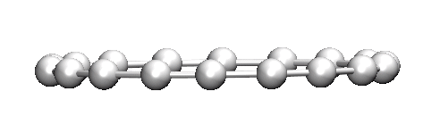

## 5 实例4：考察分子中局部区域的平面性

此例演示一下怎么考察分子中局部区域的平面性。这个体系称为富勒烯捕手，它有两个碗烯片段可以通过pi-pi堆积相互作用牢牢抓住富勒烯。结构文件可以在<http://sobereva.com/attach/618/catcher.pdb>下载。现在我们对其中一个碗烯片段里的碳来考察平面性。显然，这需要获得这些碳的原子序号才能在Multiwfn里输入。你可以肉眼一个一个去看记录序号，而最方便的方法莫过于用GaussView打开，然后按住r键拖动鼠标通过划框方式把要被考察的原子全都选中成为黄色（可以选多次，被选中的会累加），然后在Tools - Atom selection界面里把选中的原子序号从文本框里复制出来，如下所示，可知被选中的原子的序号是9-10,13-30

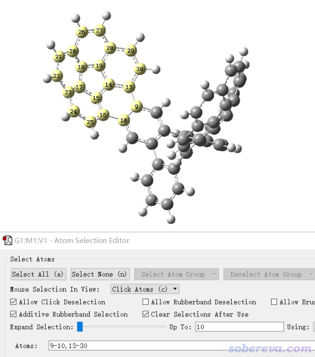

启动Multiwfn，然后输入  
catcher.pdb  
MPP  //进入考察平面性的功能  
9-10,13-30

马上看到结果  
Molecular planarity parameter (MPP) is    0.352135 Angstrom  
Span of deviation from plane (SDP) is    0.882635 Angstrom

之后导出pqr文件，按照第2节的做法在VMD里根据原子的d_s参数进行着色展示。下图是把色彩刻度下限和上限分别设为-0.8和0.8的情况，绘制风格用的是Licorice。此图中粉色和蓝色分别突出显示了碗烯整体平面上方和下方的原子。

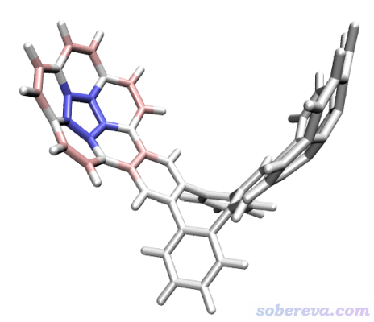

## 6 总结

本文介绍了笔者在J. Mol. Model., 27, 263 (2021)提出的定量考察整个分子或体系中某个局部区域的指标MPP和SDP，其定义简单、严格而且普适，既可以用于比较同一个体系不同构型/构象的平面性差异，也可以横向对比不同体系的平面性。在讨论芳香性、pi共轭、分子堆积等问题都可以结合这两个参数讨论。MPP和SDP也可以视为新的分子描述符，可用于机器学习预测各种性质的目的。本文还介绍了直观展现不同原子相对于拟合平面位置的“d_s着色表示法”，它可以令研究者根据一张图上的原子颜色立刻了解到各个原子在体系平面的哪一侧、偏离平面的程度有多大，完全不需要担心由于视角问题造成的视觉上的误判。这些方法都已经实现在了免费的Multiwfn程序中，并且如上文的例子可见，操作非常简单，而且计算特别快速，对单个分子和晶体都可以考察，不仅可以考察单一结构还可以直接对整条轨迹进行分析，而且结合VMD程序在轨迹播放时还能对原子动态着色来生动地展现其偏离体系平面的情况。本文介绍的平面性的考察方法既方便又实用，预计在以后会被越来越多的化学研究者使用，也非常欢迎大家向同行推广。
