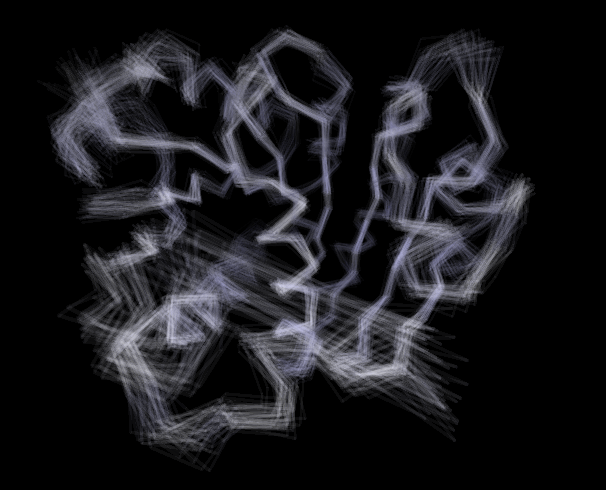
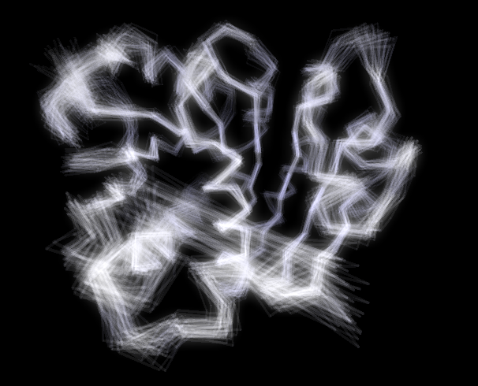

**VMD里通过叠加方式表现蛋白质骨架活动性的脚本**VMD script to represent the activity of protein skeleton in terms of structure superposition

文/Sobereva@[北京科音](http://www.keinsci.com)   2010-May-25

透明的材质的物体越叠加越深，通过这种方法绘制轨迹中每一帧的骨架（CA原子），就容易看出不同位置的活动性，并与B因子/RMSF相互对照。  
  
首先自定义一下材质，在Material窗口中选Transparent，然后点Create New，将新材质命名为a。然后在控制台执行draw material a，并执行draw color iceblue，当然也可以用自己喜欢的颜色，比如orange。这样就说明接下来绘制的物件都是iceblue颜色，用材质a。将Display-Render mode设为GLSL。  
  
然后将下面内容复制到控制台里执行，就新增了supshow命令  
  
proc supshow {fps1 fps2 space} {  
for {set fps $fps1} {$fps<$fps2} {incr fps $space} {  
set selca [atomselect top "name CA" frame $fps]  
set calist [$selca get {x y z}]  
for {set n 0} {$n<[expr [$selca num]-2]} {incr n 1} {  
draw cylinder [lindex $calist $n] [lindex $calist [expr $n+1]] radius 0.1 filled yes resolution 20  
}  
$selca delete  
echo "frame" $fps "done"  
}}  
  
将轨迹载入（并且Align一下消平动转动），然后比如执行supshow 1 80 2就说明从1到80帧每2帧绘制一次骨架结构。绘制到了哪帧会在控制台实时输出。绘制完毕后，自行调整a材质的各个属性，主要是opacity和Ambient，效果会实时展现出来，可以得到类似上图的效果。很明显中间区域alpha螺旋活动性小，线的颜色深，而外侧则比较虚、零散，说明活动性大。若显卡较老不支持GLSL，则没有透明效果。  
  

  
再稍微ps一下，会好看些：  
  

