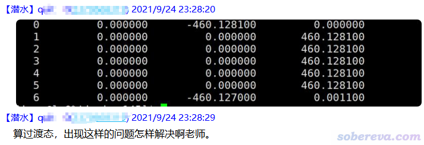
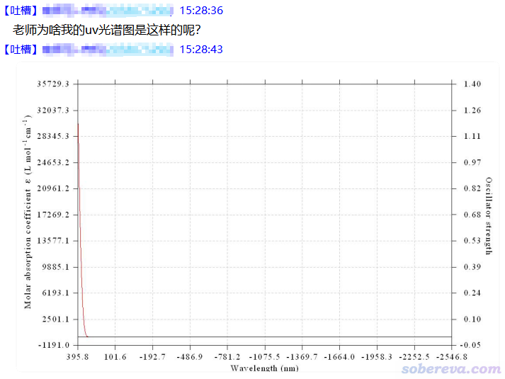
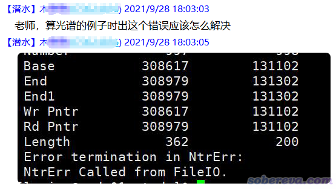
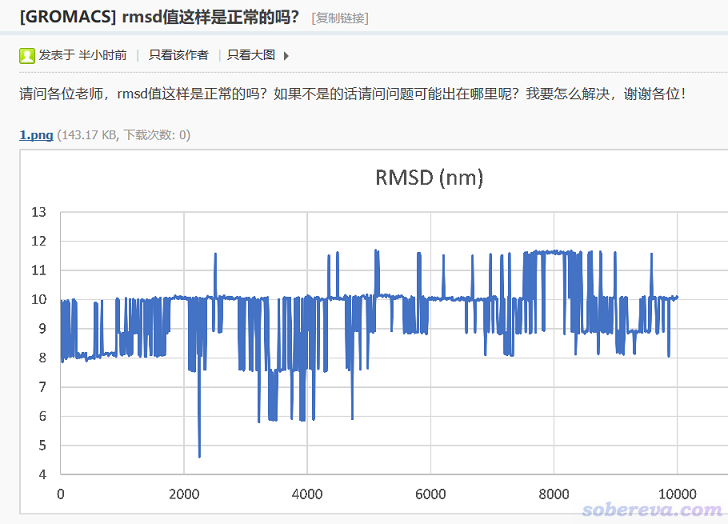
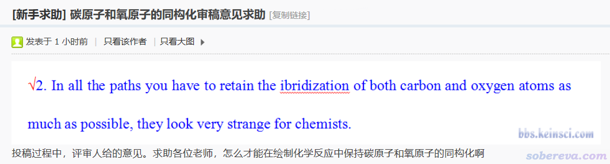
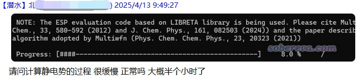

**在网上求助计算化学问题的时候必须把问题描述得详细、具体、准确、清楚、完整**

When asking for help with computational chemistry problems online, one must describe the problem in detail, specificity, accuracy, clarity and completeness

文/Sobereva@[北京科音](http://www.keinsci.com)

First release: 2021-Oct-18  Last update: 2025-Apr-13

笔者从2007年就开始广泛在网上回答计算化学问题，如今在许多个计算化学QQ群（即思想家公社的各个QQ群，见<http://sobereva.com/QQrule.html>）以及一个论坛（计算化学公社<http://bbs.keinsci.com>）每天都花巨量时间回复问题。愈发感觉如今**计算化学新人在提问时普遍越来越偷懒、敷衍了事，而且提问方式变得越来越没基本逻辑、对问题描述能力越来越差，老是在没有任何前提的情况下突然蹦出一、两句没头没尾的话来提问，真是越来越不像话！**（我认为一大原因是研究生扩招太多了） 提问时候表述含糊不明、不提供解决问题需要的很显然的关键性信息、不说清楚前提条件、不肯多打点字把具体情况交代清楚，这些问题真是越来越严重，笔者对这些情况的感触实在太深，经常在答疑时血压升高。每次遇到这类提问者，我都感觉很棘手或挺烦恼，我通常没时间精力去打字引导对方把各种关键要素都一一交代出来，但看着有人在我建立的群/论坛里提问得不到解答我心里又不舒服。我实在忍不住专门写个小文，让读者充分意识到把问题描述详细、具体、准确、清楚的重要性。下面我将我在QQ群和公社论坛答疑时遇到的有代表性的一些提问列出，通过给出我的吐槽让读者认识到提问时该注意什么，怎么避免犯同样的错误，希望新人们在求助时能引以为鉴。记住，不好好交代问题，可能得不到任何回复，也可能在他人一次次地诱导你交代问题详情过程中浪费许多自己和他人的时间，还有可能得到不准确的回复导致自己最终吃亏。以前笔者还写过一篇《在网上求助计算化学问题时的注意事项》（<http://sobereva.com/79>），此文也算是对那篇的一个重要补充。

**Q1**：老师，请问算相互作用前结构优化环节我对双分子体系几种可能构型进行了m062x计算，结果尝试的几种构型的结果自由能仅差0.01，请问是计算误差吗？还是结果可信，用能量较小的体系

我的吐槽：什么体系？什么基组？数值是什么单位？这些关键的什么都没说，还怎么回答？

“双分子”这种描述根本就没有提供充分信息。两个小肽结合也叫双分子，两个氢气分子结合也叫双分子，相互作用能差了N个数量级。具体是什么分子、怎么结合的必须描述清楚，最好直接把几个构型的截图发出来，既省得打字来描述，别人也能确切知道你到底考虑了哪几种构型、构型到底有没有意义。顺带一提，由于初学者总是犯低级错误，用的结构甚至都是大错特错、存在严重硬伤的，笔者答疑时总希望提问者直接把结构贴出来，以判断当前问的问题有没有回答的意义。初学者经常意识不到自己在更基本的层面就可能已经犯了其它的错误，最基本、深层的问题不先解决的话，回答提问者原本问的表面上的问题也就根本没意义。

基组直接影响计算精度，如果没常识地用一个破烂基组计算，精度无从谈起，那后面的问题根本就没必要回复了。居然提问者连如此关键的信息都没给出。

单位是Hartree还是kcal/mol，差大了去了，0.01 kcal/mol可以说没差别，而0.01 Hartree（6.27 kcal/mol）对于弱相互作用来说那就是明显的差异了。提问时单位都不写，都没有最最基本科研工作者的素养，更何况描述能量常用单位很多，包括kcal/mol、kJ/mol、Hartree、eV，哪能把单位给省了？（又不是像比如原子电荷，单位用的统一都是e）

奉劝提问者，在描述当前计算的时候，要拿出写paper的computational details部分的态度来写，要想得到准确、有价值的回答就别在提问上敷衍了事。

顺带一提，提问时候计算级别名字必须要写严谨、准确，M06-2X不要写成m062x，后者那是Gaussian、ORCA等程序才支持的关键词的写法，而不是在一般语境下方法名的正当的写法。

**Q2**：请问一下，使用SIMLE直接生成构象，再用来做结构优化+振动光谱的计算，一般可靠吗？

我的吐槽：根本没有叫SIMLE的东西（那叫SMILES。提问时应当尽可能避免打错任何文字和单词避免引起歧义）。问的具体是什么体系，甚至是哪类体系都不说，还谈什么可靠不可靠？而且靠的是什么程序生成的构象？体系特征、所用程序是此问题的答案的决定因素，居然最重要的信息一个也没给。很多体系柔性很大，通过诸如OpenBabel等程序基于SMILES直接给出的结构根本没法保证能直接优化到最稳定构象，所以算的振动光谱也没实际意义。还有大量体系的立体结构特征根本无法光靠SMILES这样一维信息描述，比如原子图簇。在追问下，提问者才继续吐露了一点信息，说原子数是20~40，这依然让答疑者处于猜谜状态，还是不肯直接说清楚到底是什么类型的体系，交代问题时吞吞吐吐谁还愿意回答？痛痛快快一次性把要被SMILES字符串描述的分子特征说清楚就不行么？

在此强调，问问题时候必须要把自己掌握的一切信息尽可能充分地一次性描述清楚，特别是体系结构，能给出化学式或立体结构的要直接给出，别就交代一些零星信息。你提供的信息越充分，别人就能越快速、越准确地回答。如果没有提供有效信息，你的问题完全就是unanswerable的状态，少数情况有热心人且有闲工夫时可能还会提示你进一步提供信息，而大多数情况根本就没人理了。求助时要搞清楚立场，不是你考别人、玩解谜游戏，要好好想想怎么提问才能吸引别人快速给出有针对性的有效的回复。

**Q3**：Sob老师好，我看到molpro例子中计算HCHO的例子，其中OCC设置为...[略]  
我的吐槽：你指的是哪里的例子？总是有人问看了某某某程序的例子，或者计算某某某问题的例子，之后自己有问题。然而提问者却总是不说这例子到底是什么出处，到底是哪个文档/网页，或哪篇博文/帖子，别人都不知道你看的文章内容是什么、里面原话是怎么写的，这让别人怎么回答？虽然有时提问者会复述一下原文，但由于提问者对知识可能掌握不扎实，往往根本没有正确传达原文的意思，或者漏掉了原文里的重要信息。

在此郑重提醒：**但凡提到某某教程、博文、帖子、论文等等的时候，必须明确指代清楚、避免任何含糊性**。最最起码把标题给出来。如果是论文，把期刊、卷、页码或DOI给出便于别人找到；如果是博文、帖子之类，必须把链接给出来；如果是手册，说清楚哪个版本手册的第几节或第多少页。要拿出你写论文时引用文献的严谨态度！！！顺带一提，我还特别反感有人提问时上来就说诸如“sob老师的教程”、“sob老师的帖子”，我写过的帖子、教程无数，我哪知道你具体说的是哪个！？

**Q4**：gromacs动力学加电场跑10ns分析rmsd，一直达不到平衡态，但相同结构不同电场下，基本在2ns就已经达到平衡了，继续加大步数，改变依然不大。有什么解决办法吗？  
我的吐槽：这问题的逻辑十分莫名其妙，“不同电场”指的是什么电场？原先达不到平衡的电场是什么样？能平衡的时候电场又是什么样？关键信息完全没说清楚，语言表达能力不过关。而且是什么样的体系、电场具体怎么加的也都没说，根本没法回答。

**Q5**：

我的吐槽：这是如今特别特别特别典型和常见的一个情况，提问者就如同写记叙文时候都不知道要有时间、地点、人物、起因、经过、结果这些最基本的要素。什么程序算的？算的什么体系？具体怎么算的？想解决的问题究竟是什么？关键信息一概不说，假定别人有读心术啊？当前问题就是典型的unanswerable问题，给别人出个题，而题目里根本就没足够的解题条件，甚至都不明说让别人回答什么。

**Q6**：

我的吐槽：又是典型的什么重要信息都不描述，光贴个图就了事。什么体系？用什么程序做的电子激发计算？用的关键词是什么？最后靠什么程序（虽然通过图像风格我知道是用Multiwfn）什么方式怎么绘制的图？对于前三个问题，如果懒得把前三个问题打字描述、或者怕语言描述不准确，就直接把电子激发计算输出文件上传到网盘，并在此处贴出链接，别人一看就能彻底一次性了解清楚。

**Q7**：

我的吐槽：“光谱的例子”也不说是哪里的什么例子，什么前提也都不交代，这种描述根本毫无意义。当前用的什么程序、用的什么关键词、算的什么体系都只字不提，上面那种报错又根本不直接体现导致问题的必然原因，而是一个典型的“多对一”的报错提示，因此当前问题根本就无解，或者别人需要长篇大论花好几百字才能把各种可能性全都总结出来，基本不可能有人有这耐心。就算真有超热心、又很懂行的人完整列举出所有可能性，提问者届时还得自己去分辨哪种符合自己当前情况，同时耽误别人和自己的时间。这种情况，也是直接贴出来输出文件的下载链接，内行人一看立马就能给你答案，至少也能把导致出错原因的可能范围大幅度缩小，进而能够针对性地回复。

**Q8**：

我的吐槽：这算的是啥呀？我都根本不知道你在什么设定下算的什么东西，怎么告诉你正常不正常？多描述一点具体情况都不情愿么？

**Q9**：

我的吐槽：不上传输入、输出文件让别人看看具体细节、判断哪里可能不合理，谁猜得到这么灵异的现象是怎么回事？区区几个原子的计算，输出文件压缩后就一丁点大，干嘛不上传？

**Q10**：sob老师，能量最小化时冻结的体系还会跑是什么原因呢  
我的吐槽：就单单这么一句话，啥基本要素都没体现，用什么程序在什么设定下跑的只字不提，神仙也回答不了。

**Q11**：老师您好，最近算两个芳环之间的堆积作用，麻烦问一下，用什么方法和基组计算最好，谢谢  
我的吐槽：此问题前提非常不充分。当前体系多少个原子也不说，计算资源也不说，用的计算程序也不说，要求的精度高低也不说，具体是什么任务（优化还是算能量）也不说，每一条都是对答案产生决定性影响的要素，不交代根本就没法回答。CCSD(T)/aug-cc-pVQZ的精度当然足够好，然而提问者几乎一定算不动。我特别反感不给出基本前提的情况下就问“用什么最好”、“买什么最好”这种问题，起码得交代预算、用途啊！对影响答案的关键性问题做必要的限定，这是最最基本的提问逻辑。

如果这个问题这么问，就可以比较准确地回复了：“我要算两个芳环之间的堆积相互作用能，总共60个原子左右，使用Gaussian 16 A.03程序，有个36核的服务器，希望精度尽可能好。麻烦问一下，用什么方法和基组计算最好？”。

**Q12**：请问一下大家，之前有个帖子是一位老师写的脚本来画势能图的，我找不到了，大家可以给一下嘛~  
我的吐槽：此问题没有基本的逻辑。所谓的势能图是曲线图还是填色图还是等值线图还是地形图？势能数据是什么程序做什么任务算出来的？是什么论坛哪个板块里的帖子？根本什么限定条件都没有，就算是正在用那个人写的脚本的人，看到此问题都没法确定自己用的脚本是不是这个人正在问的。

**Q13**：请问老师 高斯最多能算多少原子？  
我的吐槽：这个问题毫无意义，在什么计算级别下算什么体系的什么问题，以及用的机子性能，全都只字不提。特别是Gaussian里分子力场和CCSD(T)方法能算的尺度甚至相差N个数量级。我只好在群里回复“1个~几万都能算”，当前提问者提供的信息只够给出这么一个极度模糊的答案，显然这对提问者毫无用处。我若根据分子力场、半经验、普通泛函、双杂化泛函、CCSD(T)不同档次方法...再考虑6-31G*、def-TZVP、def2-TZVP、def2-QZVP不同档次基组...再考虑提问者用6核PC机、20多核廉价服务器、50核高性能双路服务器各种计算性能...再考虑计算单点/优化/振动分析/超极化率等各种计算任务...全部情况排列组合分别给出答案（超过100种），我得打多少字？显然没这个闲功夫和精力。这里再次强调，问得不具体，就不要指望别人能回答得具体。

**Q14**：

我的吐槽：有很多人在网上问怎么回复审稿人意见，然而往往就把审稿人意见贴出来，却几乎不怎么在提问时交代自己的体系，真是一点提问的基本逻辑都没有。回答问题的人又没看过你投的文章，根本不知道你研究的是什么体系的什么问题、具体怎么研究的、怎么讨论的，你又不把情况交代清楚，别人怎么回答你的问题？像上面这个问题，甚至提问者连体系结构图都不发出来，别人根本都不知道碳原子和氧原子在什么位置、起到什么作用、同构化具体指什么，怎么可能回答这个问题？每次提问时都要好好想一想，别人在解答你的问题时都可能需要什么信息，凡是可能对答疑有用的信息全都充分、详细交代出来。另外，光是把审稿人意见简简单单一贴，连具体情况都懒得多写点文字、贴图去描述，就直接等着别人帮你写审稿回复，实在显得太没诚意，我都根本不愿意去帮。

**Q15**：老师，请问体系内包括烷基和羰基，他俩结合的时候一般调整谁的位置呢  
我的吐槽：什么体系？俩基团怎么结合的？为什么要调整？调整的目的是什么？当前问题我真是一丁点也看不懂。

**Q16**：windows下做rdf选择完之后怎么退出啊，ctrl+D不行啊  
我的吐槽：又是连用的什么程序都不说。虽然我估计他可能是用的gmx rdf，但是连提问都不好好问，最基本信息都懒得交代一下，显得态度特别敷衍，缺乏求助的诚意，我遂直接无视了。

**Q17**：请教大家一个问题，在计算时，如果要固定两个原子键长不变，应该如何做？  
我的吐槽：至少有几十种程序支持限制性优化或动力学过程中施加限制/约束，做法我全都给你列一遍？

**Q18**：麻烦问一下 H matrix size has been exceeded是什么意思呀  
我的吐槽：什么语境也不交代，谁都不知道这是什么程序做什么计算输出的信息、H矩阵指什么矩阵，怎么回答？不同情况解决方法截然不同，碰到类似这样的提示，说不定有的程序里改个运行参数即可，有的程序则可能需要改源代码里控制矩阵尺寸的变量后重新编译。亦有可能是程序使用方式不当，导致出现开发者没有考虑到的异常情况。顺带一提，如果是用的非主流程序，一般场所里大概率没其他人用过，最好直接发邮件问开发者，或者在相应程序的官方论坛/邮件列表里提问，这样求助最快也最准确。  
PS：我每天时间本来就严重不够用，还要在网上回答巨量问题，如果一个问题交代得清楚而且我也会的话我就回答，而像这样根本没有提供回答问题必要信息的情况我就直接无视了，我基本不会去猜着回答，也基本不会去上赶着要求提问者再补充信息。记住，没人回复绝对不代表没人会，或者会的人没看到，而很大概率是因为提问方式不当。

**Q19**：请问老师，我用mo52x/6-31g*算出来溶解自由能是-40多kcal/mol，这个正常吗  
我的吐槽：老有人问计算的结果是否正常，对体系却只字不提，这种问法明显毫无意义。是小分子还是大分子？是中性的还是带电的？这都直接决定溶解自由能的数量级，不说体系特征怎么可能告诉你正常还是不正常？  
PS：再次顺带提醒，提问时必须把计算级别名字严格写正确，怎么o和0都不分？我知道提问者想说M05-2X，但内行科研工作者普遍是很严谨的，诸如我就很不愿意将错就错、对明显错误的写法视而不见，而每次我给提问者斧正计算级别名字的写法显然对我是个负担。提问者在提问时，尤其是在高水平讨论场所里，必须把计算级别名写准确，省得还需要花费别人的宝贵时间来斧正你。

**Q20**：请问各位老师计算内盐时，优化结构发生严重变形是什么原因呢（采用的是Blyp/6-31G** 并添加了溶剂模型）  
我的吐槽：严重变形是相对于什么状况的严重变形？原先是什么结构也不说，怎么回答？把优化前后的截图都发出来，别人不就立马明白了。如果是一开始建模就很不合理、相对于真实结构是严重扭曲的，通过优化使得结构明显自发变得合理，这显然是再正常不过的事，都根本不需要提问。在这里强调，但凡在提问时候说“发生了...变化”、“使用了不同的...”的时候，都必须要说清楚原先是什么情况、参照物是什么。另外，描述计算方式的时候不要有任何含糊性，"溶剂模型"用的到底是什么溶剂模型？很垃圾的Onsager是溶剂模型，Gaussian默认的IEFPCM也是溶剂模型，而精度、可靠性、适用性有天壤之别。如果你是初学者，我*吐血*建议直接把所有关键词都完整贴出来，既可以避免描述时可能的含糊之处，也可以顺带让内行人看看一下你的关键词用没用对（如果输入文件里还有其它关键信息也要交代。比如Gaussian里用gen或genecp，还必须把具体用的基组交代出来）。

**Q21**：请问开始跑MD了，输入什么命令可以看还要跑多长时间呀？  
我的吐槽：世界上有多少种分子动力学模拟程序，就有多少个答案。

**Q22**：

我的吐槽：  
1 你学中文几天了？能不能好好组织一下语言再问？  
2 ubutu（乌布图）是什么鬼？  
3 这个问题表达的是什么逻辑？如果你想问为什么按照b站某GROMACS安装视频安装但没有装上，你不说视频是哪个视频、具体遇到了什么问题导致没装上，别人怎么回答你？如果你就是想让别人给你指一条安装GROMACS的明路，在此处提b站的GROMACS安装视频又有什么意义？

**Q23**：请问有老师安装过dssp嘛 原来那个方法不行了  
我的吐槽：“原来那个方法”是什么方法？你在哪里看到的？你凭什么觉得就这么轻微一暗示，别人就立马知道你说的是什么？而且“不行了”是怎么个不行法，你不说清楚，别人怎么知道是原本的安装教程就有问题，还是你自己的安装操作或软硬件环境有问题？提问的时候绝对不要当谜语人。

**Q24**：请问 体系有70多个原子用高斯优化一个多星期还没出来，要继续优化吗？  
我的吐槽：又是特别典型、极其常见的没有基本逻辑和常识的提问！所有最关键的信息提问者只字未提，别人怎么可能给你回答？非要让我回答，我只能告诉你“看情况，可能值得继续优化跑完任务，也可能不应当继续优化”，这种含糊其辞的回复对你能有实际意义么？而且提问者居然连怎么算的都只字未提，诸如如果你用CCSD/cc-pVTZ优化这样大小的体系，算到去世也算不完，之前一个多星期本身都已经是完全白算；或者如果当前优化都已经严重规律性震荡了，再怎么跑下去也完全是白搭，早该停了。PS：在我来看，计算化学领域的计算量>95%都是被初学者耗无意义的胡算瞎算白白浪费掉的！

在我常年在网上答疑中老看到有人问“怎么老也算不完”这种问题，几乎每次都是对方提供的少得可怜的信息令别人完全没法回答。我在此明确强调，问这类问题时必须完整提供这些信息。少一条都不行：  
具体算的是什么体系？如总原子数、体系具体类型（有机分子、过渡金属配合物、镧系/锕系配合物、原子团簇、分子团簇等等）、包含的元素都有什么。最好直接给体系截图  
用的程序、版本和完整的关键词是什么？  
用多少核的机子跑的？（假定所有核都已经用于当前计算了）  
当前跑成什么状态了？比如对于几何优化，当前跑了多少步了、优化过程有没有收敛或震荡趋势、结构有没有向预期的结构变化？（用GaussView自行监控便知，这都不会的话看<http://sobereva.com/164>）。如果是比如单点计算，当前算到哪个步骤、屏幕上显示什么了？（外行的话，强烈建议给输出文件最后几十行的截图）

如果你懒得描述上述信息，或者不会准确描述，直接把输出文件提供就完了。

**Q25**：老师，审稿人让我用EOM-CCSD计算一个17个分子在DMSO溶剂中的第一和第二激发态，想问一下一般这种要耗时多久

我的吐槽：“一个17个分子”是什么鬼？到底是一个分子还是17个分子构成的团簇？提问时候最起码保证没有语病、没有错字、没有最基本的逻辑错误，不要让人觉得问题特别迷。不仅当前到底是什么体系没说清楚，用什么基组也不说，什么计算资源下做计算也不说，这问题根本不可能回答。用很好的80核机子在很垃圾的3-21G基组下计算，和很烂的2核机子在较好的cc-pVTZ基组下计算耗时有天壤之别。

**Q26**：问一下sob老师和大家，计算蒙脱石的HOMO和LUMO，只能得到HOMO，不显示LUMO是怎么回事

我的吐槽：什么程序算的？具体用什么设置算的？用什么程序看的轨道？可视化程序里怎么操作的？什么具体信息都没有怎么回答？显然描述必须具体到内行人能根据你的描述在脑中重现出你当前遇到的具体情况、能准确定位出问题的所在。

**Q27**：

我的吐槽：什么乱七八糟的！弥散函数问题、溶剂效应问题、理论方法问题，稀里糊涂瞎搅合在一起，完全不知道在说什么、到底想问什么！而且基组名、泛函名都没写对，态度极其敷衍，令人看着就不爽。

**Q28**：

我的吐槽：根本什么有效信息都没提供，怎么可能回答？这是Multiwfn算静电势的界面，提问者竟然连计算程序的名字都不提，就随随便便截个图，没法更敷衍。当前体系多大？基组是什么？用的什么CPU、多少核用于并行计算？在Multiwfn里输入了什么命令做的计算？这些因素全都是严重影响耗时的，难以置信提问者连哪怕其中一个要素都不提！没这些关键信息，别人怎么判断是快还是慢，是异常还是正常？

**Q29**：请问我在计算三价铁的时候，wultifwn基组默认是DVZP-MOLOPT-SR-GTH-q16，我想要改成q13吗

我的吐槽：这个问题令我三处不爽。首先，Multiwfn被拼成了wultifwn就令我火大，而且明明CP2K里的基组名是DZVP-MOLOPT-SR-GTH-q16居然被拼成了DVZP-MOLOPT-SR-GTH-q16，竟然一条很短的问题就拼错两处，什么素质！？其次，就是这个问题被交代得极其敷衍和不完整，连最最基本的前提都没交代，这个人用Multiwfn想干什么？Multiwfn怎么就和这个基组扯上关系了？Multiwfn在哪默认了这个基组？虽然我大抵能猜到他是想问按照《使用Multiwfn非常便利地创建CP2K程序的输入文件》（<http://sobereva.com/587>）说的用Multiwfn产生CP2K输入文件的事，此功能默认用的基组是DZVP-MOLOPT-SR-GTH，但我就是不直接回答，免得显得他哪怕随便敷衍地乱描述一下我也能心领神会并会给他回答似的，以后肯定会继续敷衍下去。还有，当前这个问题本身的语言逻辑就是混乱的，什么叫“我想要改成q13吗”，我顶多能告诉你这么改是合理还是不合理，但你脑子里“想”什么难道是我能决定的？等什么时候他肯好好把问题描述具体、完整、没语病了我才会回答。

## 总结：

**你提问的时候交代的信息越充分、详细，别人的回复就能越具体、越有针对性、越可能直接解决你的问题。想尽快得到有效的回复就绝对不能让别人必须猜测你当前的情况**。如果都懒得把问题描述得清楚具体，就根本别指望会有人给你靠谱的回复。提问时还必须要杜绝各种语义含糊不明、逻辑不清的描述，和当前问题有直接关联的所有关键性的前提、要素必须全都一次性充分交代清楚，一个都不能漏，绝对不能偷懒。如果不好好描述清楚问题而造成歧义，甚至别人还可能误会你的实际情况，给你错误的答案，结果把你给害了。而且提问时候必须组织好语言，绝对不要有语病、错字、单词/名词误拼，把问题写出来之后必须谨慎地看一遍再发，否则可能给其他人的理解和解答造成严重困难，也显得你缺乏求助的诚意。还要注意你描述问题的语句里是否有可能造成歧义的地方，这一定要避免。

计算化学问题在提问时要考虑的常见关键要素如下。但凡和当前问题可能有联系的要素，都必须在提问时明确说清楚，一次性交代出来。  
•当前研究的是什么体系在什么状态/条件下的什么问题？PS：当体系特征复杂、别人不容易根据你的描述想象时，若不涉及保密的话**强烈建议给出截图**  
•当前问题涉及的是什么计算程序、什么版本？  
•当前计算用的关键词具体是什么？具体计算/操作过程是什么？  
•你的硬件条件如何？（CPU核数、空余内存量）当前的软件环境如何？（操作系统名字、具体版本、编译器信息等。如果用的是虚拟机或WSL之类特殊环境必须说明）  
•对于计算报错，输出文件里都有什么和报错有关的提示？

PS：曾经很多次答疑的时候，都遇到提问者隐藏一些关键信息（而且谁都意料不到对方会那么干），在最后才终于透露出来，造成之前白打字回复半天。这令我无奈，有时甚至气愤，感觉是在被耍。比如曾经有人问怎么Multiwfn在Ubuntu里装不上，我回复好一阵之后也没解决，对方最后才突然说他是在WSL下运行的！WSL和一般的Linux环境能一样么！？再比如，提问者给出了一个动力学模拟的截图，盒子里只有中间部分有一团分子，我以为他是在真空下模拟分子团簇，在我进一步追问下他居然才说那是脱去水之后的结构！**，这么重要的事怎么不事先说！？

对于语言不好全面交代清楚的较为复杂，特别是涉及到一些奇怪情况的计算程序方面的问题，尽可能直接提供输入、输出文件的网盘链接，这是最有效率的提问方式。文件若较大，或者有多个文件，要压缩到一起后提供。当有多个文件时，一定要清楚说明里面每个文件对应什么情况的计算，绝对不要让别人一个个打开查看后去猜。一定要给答疑者尽可能提供便利。
