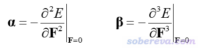
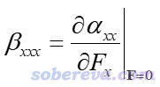
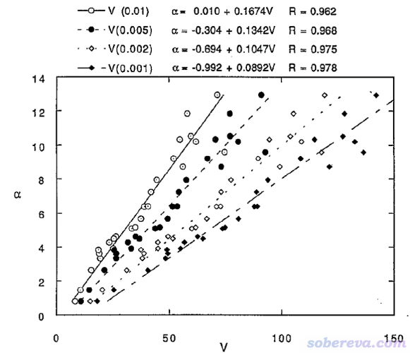
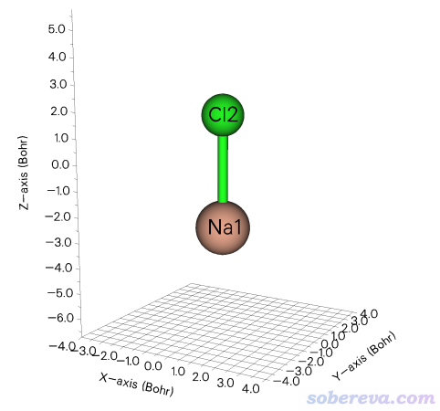
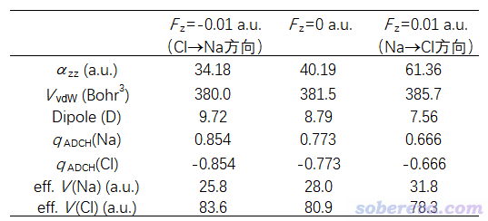
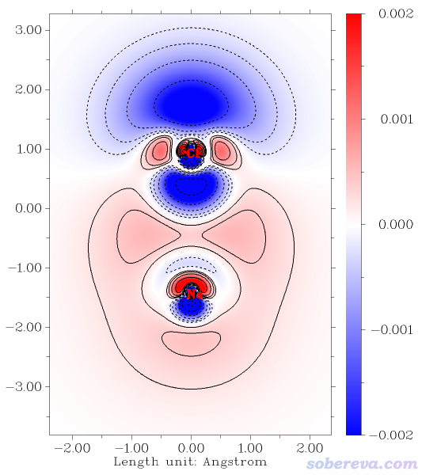
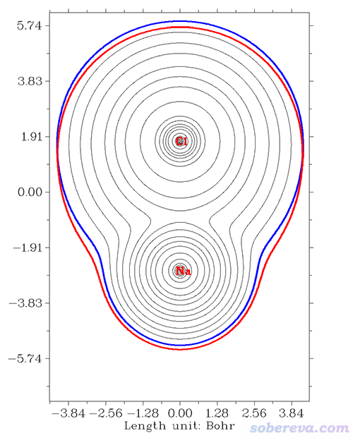

**谈谈第一超极化率(beta)的符号的物理意义**

On the physical meaning of the sign of the first hyperpolarizability (beta)

文/Sobereve@[北京科音](http://www.keinsci.com)    2021-Oct-22

## 1 前言

在《理论设计由18碳环与锂原子构成的电场可控的光学开关》（<http://sobereva.com/630>）里介绍的笔者的Carbon, 187, 78 (2022) DOI: 10.1016/j.carbon.2021.11.005一文里，体系的两种构型对应的第一超极化率(first hyperpolarizability,β)的某个分量的正负号是相反的，审稿人让解释一下原因。可能不少理论研究分子的非线性光学性质的人都没太留意β符号的物理意义问题，被问及时不知道怎么解释正负号的不同，我觉得值得专门写一篇小文谈谈怎么理解beta的正负号所体现的物理本质。本文将以NaCl为例从多个角度去讨论，本文只讨论静态（超）极化率的情况。

## 2 β的符号的意义

极化率(α)和第一超极化率(β)张量的定义如下

对比可知，对某个分量，如x方向，有以下关系

即曰，冲着X正方向施加外电场时如果会导致αxx增大，则βxxx为正，如果导致αxx减小，则βxxx为负。依据这个简单的道理，我们可以从施加的外电场如何影响极化率的角度去讨论超极化率的符号，极化率比起超极化率这个相对抽象的概念要好理解得多。

由电子密度等值面包围区域定义的分子的体积和极化率有密切正相关性，而且对不同类型分子之间对比也是基本适用的，见J. Chem. Phys., 98, 4305 (1993)给出的下图。这是25种种类各异的分子的分子体积V与实验极化率的关系，括号里是定义分子体积用的电子密度等值面数值

在《全面揭示各种尺寸的碳单环体系的独特的光学性质》（<http://sobereva.com/608>）里介绍的笔者发表的Chem. Asian J., 16, 2267 (2021) DOI: 10.1002/asia.202100589里，以及讨论18碳环合成的前驱体C18-(CO)n的非线性光学性质研究的ChemRxiv (2021) DOI: 10.33774/chemrxiv-2021-mkfdj里，也都有分子体积与极化率的关系的详细讨论，欢迎阅读，也非常欢迎引用。

顺带一提，也正是基于极化率和体积的密切正相关性，有人提出了分子体系中原子极化率的计算方法，见《使用Multiwfn计算分子中的原子极化率》（<http://sobereva.com/600>）。

由于上述关系，我们也可以把βxxx的符号是正是负归结于在X正方向加电场的时候分子体积是增加还是减小上，这把问题转化为了电场如何影响体系的电子结构层面上。这样，就可以通过在电子结构分析方面非常强大的Multiwfn程序详细分析讨论了。

## 3 分析实例：NaCl

这里以一个简单体系NaCl为例，说明怎么从它的各方面特征受外电场影响的角度理解它的第一超极化率符号的意义。分析用到的Multiwfn程序可以在主页<http://sobereva.com/multiwfn>免费下载，本文用的是官网上的最新版。不了解此程序者请参看《Multiwfn入门tips》（<http://sobereva.com/167>）和《Multiwfn FAQ》（<http://sobereva.com/452>）。量子化学计算用的是Gaussian 16程序。相关的Gaussian输入、输出文件以及由chk转化出的fch文件都可以在<http://sobereva.com/attach/622/file.rar>里下载。

此例用的NaCl的结构如下，在B3LYP/def2-TZVP下优化过

此例对它在B3LYP/aug-cc-pVTZ级别下，向Z正方向加0.01 a.u.电场、不加电场、向Z负方向加0.01 a.u.电场的情况分别做计算，输入文件分别是本文文件包里的NaCl_z-100.gjf、NaCl.gjf、NaCl_z+100.gjf。注意Gaussian的field关键词设置的电场的方向和习俗相反，这一点在《一篇文章深入揭示外电场对18碳环的超强调控作用》（<http://sobereva.com/570>）介绍的ChemPhysChem, 22, 386 (2021)文章末尾的computational details部分也专门提过。每个输入文件里都有polar关键词，目的是获得不同情况下的分子极化率，参见《使用Multiwfn分析Gaussian的极化率、超极化率的输出》（<http://sobereva.com/231>）。nosymm关键词避免Gaussian可能对结构自动做的旋转，从而确保电场加的方向和期望的一致，见《谈谈Gaussian中的对称性与nosymm关键词的使用》（<http://sobereva.com/297>）。

对不同情况，计算的不同的量如下表所示。Fz=-0.01是冲着Z轴负方向加电场，也相当于从Cl向Na方向加电场；Fz=0.01是冲着Z轴正方向加电场，也相当于从Na向Cl方向加电场。Dipole是电偶极矩，从负电中心指向正电中心。V_vdW是电子密度0.001 a.u.包围区域的体积，即Bader定义的气相范德华体积，计算方法见《谈谈分子体积的计算》（<http://sobereva.com/102>）。eff. V(Na)和eff. V(Cl)是Na和Cl的有效原子体积，介绍和计算方法见《使用Multiwfn计算分子中的原子极化率》（<http://sobereva.com/600>）。q_ADCH是笔者在DOI: 10.1142/S0219633612500113提出的ADCH方法算的原子电荷，是很好的原子电荷计算方法（对比见<http://www.whxb.pku.edu.cn/CN/abstract/abstract27818.shtml>），可以精确重现偶极矩，计算过程例子见Multiwfn手册4.7.2节。

由表中数据可见，冲着Z轴正方向加0.01 a.u.电场后，导致Z方向极化率分量αzz相对于无电场时显著增加，而冲着Z轴负方向加电场则导致Z方向极化率减小。根据第2节的讨论，这对应βzzz为正的情况。确实，无电场时靠polar关键词计算出来的此体系的βzzz=1019.9 a.u.是个明显的正值。

从上表中的范德华体积可见，从Na向Cl方向加电场后导致范德华体积增加，而Cl向Na方向加电场则导致范德华体积减小。这个变化趋势和αzz相一致，这和第2节提到的体积和极化率的相关性完全相符，体现了在电子数不变的情况下，若电子密度分布得越广（对应越大的范德华体积），则体系中的电子对外电场的响应会越显著。

为什么从Na向Cl方向加电场会使得电子分布得更广、极化率变大，而反方向加电场则起到相反效果？这可以从这个体系的电子结构来解释。如上表中无电场时的原子电荷和偶极矩所体现的，Na原子的大部分价电子都转移到了Cl上，显著的电子转移导致了体系很大的偶极矩。Na原子的核电荷在第三周期里是最小的，对其价电子束缚得很弱，这体现在其范德华半径很大、电离能很低，而且原子的极化率很大（162.7 a.u.）上。而与Na同周期的Cl原子的核电荷相对大得多，它的范德华半径较小、电离能较高，而且原子的极化率很小（14.6 a.u.）。因此，如果外加电场能诱导Cl上的电子往Na上转移，就理应导致分子整体的范德华体积增大、极化率增加。从上表中可见，Na向Cl方向加电场时，体系偶极矩减小、Na的原子电荷减小（带的电子增加），说明电场确实诱导电子分布从Cl向Na方向极化。而电场以相反方向加的时候效果则相反，会令Cl从Na上夺走的电子更多、偶极矩变得更大，也进而令范德华体积和极化率更小。

上面表格里还给出了Na和Cl的所谓的有效原子体积，这由分子中的原子周围电子密度分布情况所决定。可见，当电场诱导Na上的电子比无电场时增多时，Na的有效体积明显增加，根据《使用Multiwfn计算分子中的原子极化率》（<http://sobereva.com/600>）所述这也体现出Na对分子的极化率的贡献量有显著的增大。反之，当电场诱导Na上的电子更多地向Cl转移时，Na的有效体积明显减小，对NaCl的整体极化率的贡献也明显下降。

最后，对NaCl绘制穿越键轴的截面图，直观地看一下电场是怎么影响电子分布的。按照《使用Multiwfn作电子密度差图》（<http://sobereva.com/113>）以及Multiwfn手册4.4节绘制各种风格的平面图的例子中的步骤，下面绘制了Na向Cl方向加电场时的电子密度与不加电场时的电子密度间的密度差平面图，红色、实线部分代表电场导致密度增加区域，蓝色、虚线对应密度减小区域。由图可以清楚地看出电场导致Cl的轴线末端的一片电子以及冲着Na方向的一块电子整体向Na方向移动并主要分散在Na的价层的一大片区域。

前面提到过Na向Cl方向加电场会导致范德华体积有所增加。为了较直观地展现这一点，下面给出了Multiwfn的主功能4基于NaCl.fch绘制的无电场时的电子密度等值线图（绘制方法看Multiwfn手册4.4节的例子），蓝色粗线对应于范德华表面。红线是从Na向Cl方向加电场时的范德华表面轮廓（先用Multiwfn对NaCl_z-100.fch绘制等值线图，然后通过ps将其范德华表面对应的粗线叠加到NaCl.fch的图上）。由图可见，在图上方Cl原子末端部分，范德华表面有所收缩，体现出Cl原子半径减小；而在Na附近范德华表面则有明显膨胀，而且膨胀程度比Cl那边收缩的程度更高，这既体现出整个分子范德华体积的增大，也同时体现出Na带的电子数增加、有效原子半径增加。

## 4 总结

本文从电场下分子极化率、范德华体积、电子结构各方面变化的角度充分解释了第一超极化率符号的内在含义，其中充分利用了Multiwfn程序的相关分析和绘图功能。本文的分析手段将相对抽象的第一超极化率与物理意义清晰、更易于考察的各种量相关联使之变得容易理解，这种分析角度值得大家举一反三讨论其它问题。
