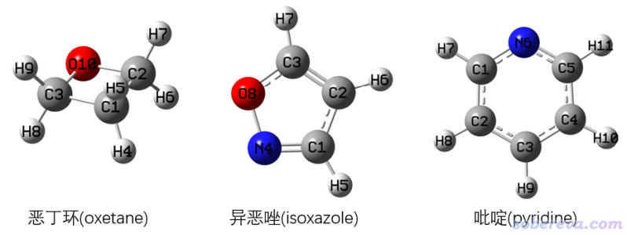
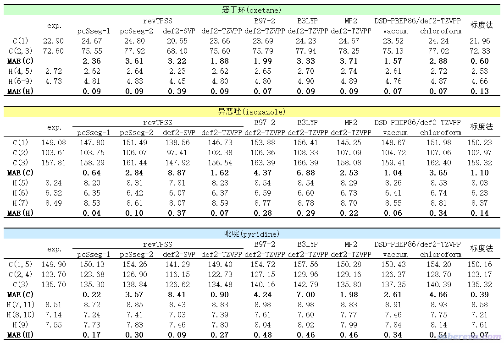
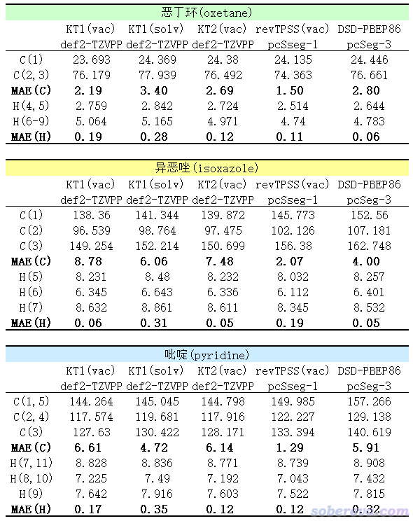
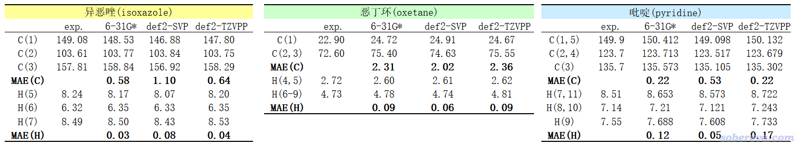

**revTPSS泛函结合pcSseg-1基组是计算NMR很好的选择**

The revTPSS functional combined with the pcSseg-1 basis set is a good choice for NMR calculations

文/Sobereva@[北京科音](http://www.keinsci.com)  2021-Oct-24

## 1 前言

计算NMR化学位移是量子化学常见而且重要的应用之一，之前笔者也写过一篇文章《谈谈如何又好又快地计算NMR化学位移》（<http://sobereva.com/354>）做了相关讨论，不了解这方面计算者强烈建议先看看。《使用Multiwfn绘制NMR谱》（<http://sobereva.com/565>）里也有许多相关知识讲解。

最近在JCTC期刊上出现了一篇文章<https://doi.org/10.1021/acs.jctc.1c00604>，里面对一批泛函计算氢的化学位移的精度进行了横测，使用的是一批有机分子在氯仿中的氢的实验化学位移作为参照。他们是用的最普通的NMR计算方式，即优化极小点，算各向同性磁屏蔽值，将TMS与当前体系的值相减折算成化学位移然后和实验对照。此文声称revTPSS泛函（meta-GGA档次）算氢的化学位移很好，不输于依赖拟合参数的标度法，并发现比普通泛函昂贵得多的双杂化泛函、MP2算氢的NMR的精度平平，比B3LYP等普通泛函并无优势，更是显著输于revTPSS。这些测试结论和之前很多横测不同方法算NMR精度的文章的结论颇有差异，例如在JCTC, 10, 572 (2014)的测试中MP2算氢的NMR精度强于所有所测试的普通泛函，在JCTC, 14, 4756 (2018)的测试中发现双杂化泛函DSD-PBEP86算各种元素化学位移的精度显著好于普通泛函，也略好于MP2。结论有这么明显差异的原因有多方面，一方面是测试集明显不同（后两篇里一般有机体系很少），还有一大原因是后两篇文章都是用的高精度的CCSD(T)在平衡结构的数据作为参照值，但平衡结构下的CCSD(T)的数据和实验值相比也是有明显差异的，除了方法本身误差外还来自于振动校正、对溶剂效应的考虑、用的几何结构等方面的误差。对于搞应用性计算的研究者，真正感兴趣的无疑是在某个便于使用的级别下，且在不考虑昂贵、复杂的振动校正和显式溶剂等情况下，计算的结果和实验相差多大；他们需要的是一个整体误差小、计算省事而且又普适的级别，哪怕表现好的实质上是由于和其它因素误差抵消得较充分也无妨。所以上面提到的第一篇JCTC文中直接以实验数据作为参照衡量误差的测试结论明显更具有实际意义。

笔者下面将对三个有代表性的有机小分子计算NMR，有以下几个目的  
(1)实际检验一下revTPSS算氢的NMR是否如前面JCTC文章里说得表现很好，和文章里该测却没测的B97-2、KT1、KT2泛函相比如何、和标度法相比如何  
(2)前面JCTC文章里没有测试revTPSS算碳谱的NMR的精度，但这也是很重要的问题，这里做一下粗略测试  
(3)看看revTPSS结合哪种基组表现最好。JCTC文中的图中体现此泛函结合pcSseg-1精度最好而且又便宜，但文中推荐的却是revTPSS/cc-pVTZ，非常蹊跷  
(4)看看几何优化级别对revTPSS算NMR结果的影响，以确定一个比较划算的protocol  
(5)看看双杂化泛函算NMR和revTPSS相比如何，值不值得花费比普通泛函更多的时间  
本文的根本目的是确定算普通有机体系NMR理想且划算的级别。

虽说做计算级别的精度测试必须用很大的样本才有说服力，但笔者没有那么多精力，拿三个分子也能多多少少获得一定有用的结论，对于验证上述JCTC文章里的测试结论是否靠谱更是足够了。

## 2 计算结果和分析

本文测试的三个分子如下所示，其中恶丁环和异恶唑在《谈谈如何又好又快地计算NMR化学位移》（<http://sobereva.com/354>）中也被当过测试例子。实验的氢1和碳13的化学位移数据是氯仿下测的。

实验值和不同方式计算的以上三个分子的化学位移（ppm），以及相对于实验值的平均绝对误差(MAE)结果如下。除标度法外，用的几何结构都是B3LYP/def2-TZVPP在真空下优化得到的。其中revTPSS、B97-2、B3LYP、MP2计算是Gaussian 16在IEFPCM溶剂模型表现的氯仿环境下算的。DSD-PBEP86双杂化泛函是用ORCA 5.0.1算的，分别在真空和CPCM表现的氯仿环境下计算。“标度法”是《谈谈如何又好又快地计算NMR化学位移》里的“标度法1”，即B3LYP/6-31G*真空下优化然后在B3LYP/6-31G*结合SMD溶剂模型表现的氯仿环境利用前人拟合的标度法参数得到的（为了和前人拟合标度法参数时用的Gaussian版本一致，刻意用的Gaussian 09做计算）。虽然也有很多其它计算级别的标度法，但没有比当前用的这个明显更好的。

通过以上数据可以看出（注意必须三个体系的数据同时综合考虑，不要光盯着个别数据说事，后同），revTPSS结合恰当的基组算氢的化学位移相当出色。pcSseg系列是专门给计算NMR搞的基组，在计算NMR方面性价比普通基组高得多。其中pcSseg-1大约是6-31G**的大小，revTPSS/pcSseg-1既便宜结果又好，故在此强烈推荐拿它算氢的NMR。这个级别和标度法的耗时基本一样，精度互有胜负，反正都很好。若你不想用标度法（嫌经验性强等原因），那么revTPSS/pcSseg-1是首选，而用标度法的时候也可以同时用revTPSS/pcSseg-1算一算，令结果相互检验，更放心。如果你用其中一个方法算出来的结果和实验值相比存在较大误差，此时可以试另一个。

revTPSS/pcSseg-1算碳的化学位移的精度明显不如算氢的时候那么准，但至少比其它普通泛函结合较贵的def2-TZVPP时还整体更好，不过整体略逊于标度法。所以，算碳的NMR我优先建议用标度法，而必须用标准方式计算的时候则推荐使用revTPSS/pcSseg-1。

上面表格里也简单测试了revTPSS计算结果受基组的影响。用更贵的pcSseg-2反倒结果更差，这体现出revTPSS/pcSseg-1结果好有一部分因素是泛函和基组误差抵消得较好，而且抵消得好还不是个例，而是比较普遍的，这在前述的JCTC文章的图3的对比测试中也有所体现。revTPSS结合普通的2-Zeta档次基组def2-SVP远不如结合与之大小差不多的pcSseg-1，这是因为def2-SVP实在太小，又不是专门给NMR计算设计的属性基组。revTPSS结合常用且较好的def2-TZVPP基组的时候远强于def2-SVP，但比pcSseg-1没优势，再加上又贵得多，因此不值得考虑。由于revTPSS在结合较好的通用基组时表现也很不错，说明revTPSS本身算NMR就是不错，而非必须明显依赖于与基组误差的抵消。

和氯仿下的实验NMR对照时，用隐式溶剂模型表现氯仿环境不一定会使得结果更好，一方面是氯仿的极性很弱，溶剂效应对结果产生的影响有限，另一方面还有误差抵消的因素，所以考虑溶剂模型是否会改进精度有一定不确定性。而有意思的是，双杂化泛函DSD-PBEP86在CPCM表现的氯仿环境下算的NMR明显不如在真空下的，因此强烈不建议此时带溶剂模型。我有所怀疑是ORCA 5.0.1在双杂化泛函算NMR的过程中对溶剂模型产生的影响考虑得不充分。在真空下，DSD-PBEP86结合较好的def2-TZVPP基组时比B97-2、B3LYP、MP2整体都更好，但是比revTPSS/pcSseg-1并没啥优势。所以，我认为碰到某些情况，如果发现标度法、revTPSS/pcSseg-1和实验对比时表现得都不佳的话，才值得再去考虑用明显贵得多的DSD-PBEP86/def2-TZVPP，而且应当在真空下算（假定实验是氯仿环境）。

值得一提的是，Gaussian在MP2下做NMR是非常昂贵的，主流36核服务器在MP2/def2-TZVPP下算吡啶的NMR都得花六分钟。ORCA里利用RI近似做MP2或双杂化泛函的NMR计算则相对来说快得多得多的，在i7-10870H这种主流Intel 8核CPU上用DSD-PBEP86/def2-TZVPP算吡啶的NMR才花了一分半钟就算完了。

在上面的测试做完后，笔者还有些悬念，遂又做了几个额外的测试，见下表。KT系列泛函（包括KT1、KT2、KT3）是极少数专门考虑算磁属性的泛函，在此泛函原文里KT1算NMR是KT系列里最好的，但很多NMR测试文章里只考虑了KT2，并发现KT2完胜其它测试的泛函。因此这里用ORCA 5.0.1对KT1、KT2也做了测试，并且对前者在真空（下表里标注了vac）和CPCM表现的氯仿下（下表里标注了solv）都做了计算。另外也考察了在revTPSS/pcSseg-1在真空中的表现。最后还考察了DSD-PBEP86结合很大基组pcSseg-3的情况，此基组对于计算NMR来说可以算CBS了。

由上面数据以及和之前表格里的数据对比可见，在真空下，KT2其实比KT1好一些，KT2结合def2-TZVPP算氢的精度和revTPSS/pcSseg-1基本可以打成平手，但鉴于KT泛函被量子化学程序支持得较少（Gaussian不支持，ORCA得通过libxc界面才能用），所以有了revTPSS就没必要用它了。考虑溶剂模型并没给KT1计算结果带来什么改进，对于算氢还有所劣化。KT1和KT2结合def2-TZVPP算碳的化学位移比revTPSS/pcSseg-1差得很远。

revTPSS/pcSseg-1在真空下计算结果和在IEFPCM表现的氯仿环境下互有胜负，刻意用真空并不会令整体变得更好。用revTPSS/pcSseg-1的时候还是建议考虑氯仿溶剂环境，毕竟原理上更严格，耗时也多不了多少。

上表中的DSD-PBEP86/pcSseg-3在计算的时候用的是ORCA 5.0发布会的ppt上列的关键词（其实RI-以及D3BJ都是多余的)  
! RI-DSD-PBEP86/2013 D3BJ pcSseg-3 cc-pwCVQZ/C tightSCF NMR defgrid3  
 %basis AuxJ "def2/JK" end  
从上表的结果来看，虽然算氢的精度相比于用def2-TZVPP时有一丝改进，但算碳的精度则下降很多。这也体现出DSD-PBEP86算NMR方面比revTPSS没优势是泛函自身层面的事，用很大的基组也并不改变结论。

最后，笔者测试了一下基于B3LYP结合不同基组（6-31G*、def2-SVP、def2-TZVPP）在真空中优化的结构，在上面推荐的revTPSS/pcSseg-1结合IEFPCM表现的氯仿情况下算的NMR的精度，如下所示。B3LYP优化普通有机分子的精度众所周知足够好，见《谈谈量子化学研究中什么时候用B3LYP泛函优化几何结构是适当的》（<http://sobereva.com/557>），因此不考虑用别的泛函优化。

可见结合不同基组优化结构，对最终的NMR计算结果有些许影响，但影响不大，也没有什么明显规律性。一个很好的发现是优化只需要用很便宜的6-31G*就完全够了，用贵得多的def2-TZVPP不会带来什么改进。也可以说，如果是为了算NMR，只需要用B3LYP/6-31G*在真空下优化即可；而如果是为了其它某些目的在其它恰当级别下优化了结构，也可以直接用这结构来算NMR，不用为了算NMR而再额外特意用某级别来优化。

## 3 结论

本文利用了三个典型的有机小分子，通过测试证明了一开始提到的JCTC上测试文章的结论合理性，即revTPSS特别适合算氯仿环境中的有机体系的氢的化学位移，而且本文进一步明确指出revTPSS/pcSseg-1（IEFPCM表现的氯仿环境下）和标度法（基于B3LYP/6-31G*的）算氢的化学位移在耗时和精度上都相仿佛，前者的好处是经验性低，不依赖于针对元素拟合的参数，因此是更普适的方法。在算氯仿中有机体系的碳的化学位移方面，revTPSS/pcSseg-1也不明显输于标度法，比其它普通泛函以及MP2结合较大基组时明显更好，昂贵得多的双杂化泛函相对于它也没优势。在revTPSS/pcSseg-1算NMR之前的几何优化方面，用B3LYP/6-31G*在真空下优化即可。

相对于revTPSS/pcSseg-1和标度法，至少对于算氯仿中有机体系的氢、碳的NMR方面双杂化泛函没什么优点，不值得为此花高得多的计算代价，但不排除它在计算其它类型体系、其它元素的NMR的时候会有相对于revTPSS泛函在内的普通泛函更好的表现。

由于revTPSS/pcSseg-1和标度法表现出色，ORCA又支持双杂化泛函算NMR，导致MP2在NMR计算上没有什么实用性了。KT2算氢的NMR很不错，但算碳的NMR不推荐，有了revTPSS/pcSseg-1就没必要考虑它了。

需要强调的是，对于精确计算能够与实验相对照的NMR化学位移来说，振动校正不可忽略，但本文始终没有考虑这一点，因为这考虑起来对于中小体系耗时都超极高，而且Gaussian还不直接支持（但ORCA 5.0开始支持VPT2非谐振模型下考虑这种校正）。所以记住，本文关于精度的结论实际上是与忽略振动校正等因素带来的误差相抵消之后的，并不是直接反映计算级别内在的计算磁屏蔽张量的理论精度。由于平时我们做NMR计算一般都不考虑振动校正，所以本文的结论对于实际应用性研究是有直接指导意义的。

鉴于用B3LYP/6-31G*在真空下优化，然后用revTPSS/pcSseg-1在IEFPCM描述的氯仿算氢和碳的NMR非常有价值，笔者已经将Gaussian 16下这个情况的参考物质TMS的碳和氢的磁屏蔽值纳入到《使用Multiwfn绘制NMR谱》（<http://sobereva.com/565>）介绍的Multiwfn的功能里了（从2021-Oct-23更新的版本开始），在绘制NMR的界面里的选项7 Set how to determine chemical shifts里选1 Set reference shielding value to determine chemical shift，再根据屏幕提示选择相应选项就可以把读入的此级别的磁屏蔽值转化为化学位移，然后可以直接作图，省得自行计算TMS的值并且每次都手动输入了。

## 4 附：计算用的关键词和使用细节

这里对上文涉及的计算方法的关键词使用做一些说明。

revTPSS在Gaussian中要写成revTPSSrevTPSS，代表交换泛函和相关泛函都是revTPSS文中定义的。

pcSseg基组在Gaussian 16里（至少截止到目前最新的C.01）还没有内置，可以从BSE基组数据库拷定义来使用，参考《详解Gaussian中混合基组、自定义基组和赝势基组的输入》（<http://sobereva.com/60>）、《在线基组和赝势数据库一览》（<http://sobereva.com/309>）。pcSseg在ORCA里是内置的，可以直接写比如pcSseg-1关键词使用pcSseg-1基组。

B97-2在Gaussian里写作B972。

ORCA里，在CPCM表现的氯仿环境下用DSD-PBEP86/def2-TZVPP做NMR计算的关键词可以这么写  
! DSD-PBEP86 def2-TZVPP def2-TZVPP/C tightSCF NMR miniprint nopop defgrid3 CPCM(chloroform)  
双杂化算NMR时RI近似是强制用的，因此必须用库仑拟合辅助基组，即这里的def2-TZVPP/C。defgrid3要求使用比默认的defgrid2更好的DFT积分格点和COSX格点，手册里建议对于双杂化算NMR用这个。如果要用pcSseg系列基组做双杂化泛函的NMR计算，没有标配的库仑拟合辅助基组可用，但可以用cc-pwCVnZ/C系列，用的pcSseg基组越大则辅助基组应当档次越高，比如如果是高档次的pcSseg-3应当用cc-pwCVQZ/C。之所以pcSseg可以用这种辅助基组，在于pcSseg有比较紧的基函数，cc-pwCVQZ/C本来搭配的cc-pwCVQZ为了描述核-价相关也有比较紧的基函数，因此可以搭配pcSseg。若使用autoaux关键词让ORCA自动构建适合相应pcSseg的辅助基组也可以，但在质量相同的情况下比cc-pwCVQZ/C大不少。对比测试见JCTC, 14, 4756 (2018)的图1。

ORCA目前自身的代码不支持KT系列泛函，但可以通过libxc界面使用。例如用KT2算NMR可以这么写关键词  
! def2-TZVPP tightSCF NMR miniprint nopop defgrid3  
 %method  
 method dft  
 functional gga_xc_kt2  
 end  
这里gga_xc_kt2是libxc泛函库的泛函列表里的名字。orca -libxcfunctionals命令可以显示支持的所有泛函的写法。

对于ORCA自身支持的泛函，是否利用libxc界面来实现，实测对NMR计算结果的影响可忽略不计，但我发现用libxc界面计算耗时会高一些。
