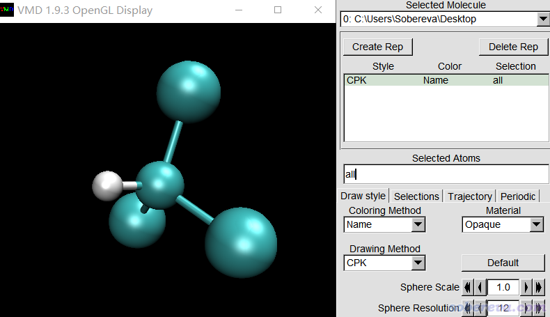
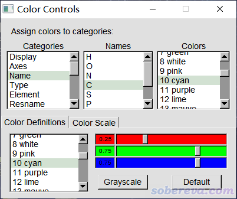
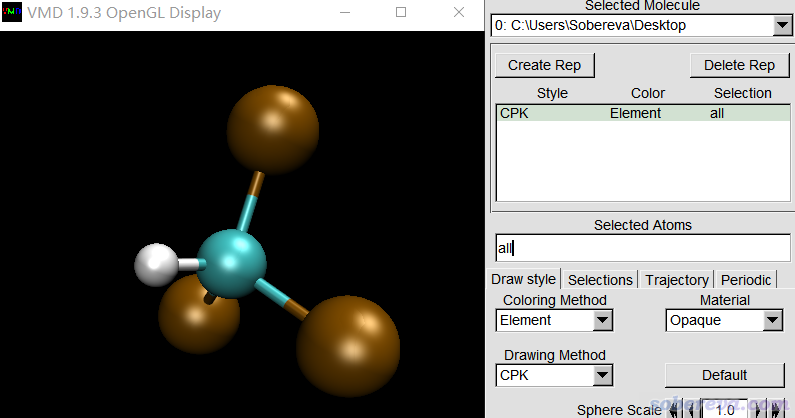
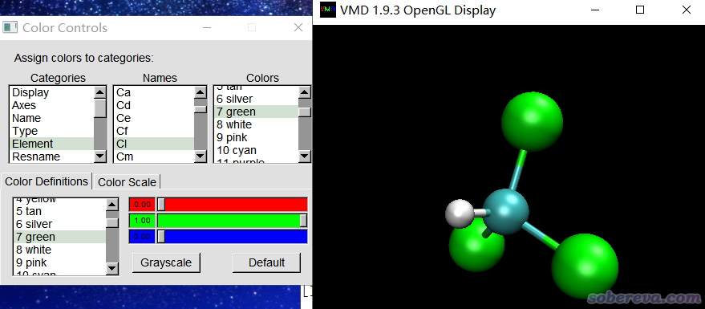

**在VMD程序里对不同元素的原子用不同颜色显示的方法**

The way to display atoms of different elements in different colors in VMD program

文/Sobereva@[北京科音](http://www.keinsci.com)

First release: 2021-Nov-11  Last update: 2022-Sep-16

## 1 前言

之前笔者写了大量的将Multiwfn与VMD相结合的文章，比如《使用IRI方法图形化考察化学体系中的化学键和弱相互作用》（<http://sobereva.com/598>）、《使用Multiwfn+VMD快速地绘制静电势着色的分子范德华表面图和分子间穿透图》（<http://sobereva.com/443>）、《用VMD绘制艺术级轨道等值面图的方法》（<http://sobereva.com/449>）等等，并且做法已被大量同行所使用，令VMD被量子化学的研究者们用得也越来普遍，并有越来越多的人在思想家公社QQ群和计算化学公社论坛里问我VMD的使用问题。其中有一个问题被问得越来越频繁，已经成了半周经问题，也就是怎么对不同元素的原子用不同颜色显示。为了免得老得重复回答，特此写一个小文章专门说一下这事。本文的情况是针对VMD 1.9.3版而言的，其它版本的情况可能相同也可能不同。

笔者还有一篇文章介绍了怎么让VMD对元素的着色和另一个流行的可视化程序GaussView相同，建议阅读，见《在VMD中使用GaussView的元素着色的方法》（<http://sobereva.com/652>）。

## 2 name和element属性

VMD里每个原子都有各种属性。name和element在VMD里是每个原子的两种不同的属性，name是原子的名字，element是元素周期表里的元素符号（第一个字母大写，第二个小写）。在VMD的文本窗口中，输入[atomselect top all] get name命令可以列出当前体系里所有原子的name，输入[atomselect top all] get element命令可以列出当前体系里所有原子的element，都是按原子序号顺序输出。

## 3 不同格式的文件记录的信息

不同输入文件提供给VMD的信息是不一样的，这里对几种典型的文件来说一下。

• xyz文件：介绍见《谈谈记录化学体系结构的xyz文件》（<http://sobereva.com/477>）。在标准的xyz文件中，第一列是每个原子的元素符号。将xyz文件载入VMD后，name和element属性值都是元素符号。

注意有些xyz文件不标准，里面记录的是原子名而非元素符号，比如VMD载入gro文件后直接保存出来的xyz文件里就是原子名。这样的xyz文件载入VMD后name属性值是文件里记录的原子名，element会根据原子名里面的字母部分去猜。比如原子名是HG3的话会被认作汞，因此element被设为Hg。如果猜不出来，比如原子名是CG，则element属性将为X。注意VMD这么猜元素很容易猜错，比如alpha碳在氨基酸里的标准原子名是CA，如果xyz文件里记录的是原子名，VMD就会把它视为是钙，从而令element属性值为Ca。

• gro文件：即GROMACS的结构文件。里面对每个原子记录的是原子名，比如氨基酸里面的碳可以有CA、CB、CG、CG1等等原子名。载入VMD后，name就是这些原子名，而element皆为X。

• mol2文件：同上。

• pdb文件：在标准的pdb文件中，第三列是原子名，最后一列是元素符号。因此，pdb文件载入VMD后可以给VMD分别提供name和element信息，因此element不用根据原子名猜了。但是有些pdb文件不规矩，没有记录元素符号的最后一列，这样的pdb文件载入后element就都为X。

• cub文件：cub文件经常通过VMD程序绘制成等值面图，见比如《在VMD里将cube文件瞬间绘制成效果极佳的等值面图的方法》（<http://sobereva.com/483>）。如《Gaussian型cube文件简介及读、写方法和简单应用》（<http://sobereva.com/125>）所述，此文件里没记录原子名，但记录了各个原子的元素在周期表里的序号。此文件载入VMD后，name和element属性都为元素符号。

还值得一提的是VMD里每个原子还有个type属性，记录的是原子类型，可以用[atomselect top all] get type命令查询。诸如amber的拓扑文件prmtop里记录了原子类型，mol2格式也记录了原子类型（但很多程序输出的mol2文件里原子类型和元素符号相同），因此载入后type属性就是文件里记录的原子类型。而xyz、gro、pdb格式里没记录原子类型，载入后type属性值会和name相同。cub格式里也没记录原子类型，载入后type、name和element都相同。

## 4 对原子的着色设置

这里以氯仿为例进行说明，此分子的pdb文件可以在<http://sobereva.com/attach/624/CHCl3.pdb>下载。

将它载入VMD后，在Graphics - Representation里把Drawing method改为CPK，目前看到的是下图

可见，碳和氯的颜色完全一样，都是青色。为什么没有区分开？原因很简单，如上图所见，Coloring method目前是默认的Name，即根据原子的name属性决定颜色。我们来看一下当前着色用的颜色定义。进入Graphics - Colors，在Categories里选Name，点击C，然后看到下图

如图可见，当前根据name进行着色时并不区分C和Cl，只要首字母是C就都按用cyan颜色着色。

如果想按照元素来着色，就在Graphics - Representation里把Coloring method改为Element，此时图像如下，可见氯和碳的颜色区分开了

氯用棕色明显不好看。我们要把它改为常用的绿色，就进入Graphics - Colors，在Categories里选Element，点击Cl，再选green，此时如下图所示

如果想微调green颜色的具体色彩定义，可以在上图的Color Definitions标签页下方修改红、绿、蓝三种颜色分量的大小。

记住，只有载入的是pdb、xyz这样能直接给VMD提供元素信息的输入文件，才能像上面这样按照element属性来着色。而用比如gro文件的时候，由于不能提供元素信息，就只能按照name来着色了。如果你是GROMACS用户又想按元素着色，就得把gro转成比如pdb格式，按照pdb格式规范在合适的列上补上元素信息后再载入；或者用比如gmx editconf -f md.tpr -o md.pdb把tpr文件转成pdb文件，由于tpr文件里本身有元素信息，所以这样得到的pdb文件里最后一列直接记录了元素信息（顺带一提，之后你可以删除当前仅有的一帧，然后再往这个体系中载入gro文件或轨迹文件，此时载入的只有坐标，而元素信息还是载入pdb时提供给VMD的）。

## 5 设置默认着色方式

如果你想将element作为默认着色方式，并且Cl元素默认用绿色，免得每次在VMD里还得如上操作一遍，可以在vmd.rc文件末尾加入以下两行  
mol default color Element  
color Element Cl green  
每次启动VMD后就会自动执行这两条命令修改默认设置。如果不了解vmd.rc文件的话，看《VMD初始化文件(vmd.rc)我的推荐设置》（<http://sobereva.com/545>）。

另外，如果你想默认用CPK方式显示体系结构，在vmd.rc末尾还可以再加上mol default style CPK。

还值得一提的是VMD有个colordefs.dat文件，记录了默认的着色用的规则。对于Windows版，此文件在VMD目录下的scripts\vmd目录下；对于Linux版，如果安装到了默认目录，此文件在/usr/local/lib/vmd/scripts/vmd目录下。用文本编辑器打开此文件可以看到

Name   H   white  
 Name   O   red  
 Name   N   blue  
 Name   C   cyan  
 Name   S   yellow  
 Name   P   tan  
 Name   Z   silver  
 ...略  
 Element C  cyan  
 Element Ca ochre  
 Element Cd ochre  
 Element Ce ochre  
 Element Cf ochre  
 Element Cl ochre  
 Element Cm ochre  
 ...略

你可以直接在colordefs.dat里修改按照name着色、按照element着色时默认的色彩，比如可以把Element Cl ochre改为Element Cl green使得程序按照element着色时对Cl元素默认用绿色。这里设置的优先级低于自己在vmd.rc末尾添加诸如color Element Cl green这样的设置命令。
