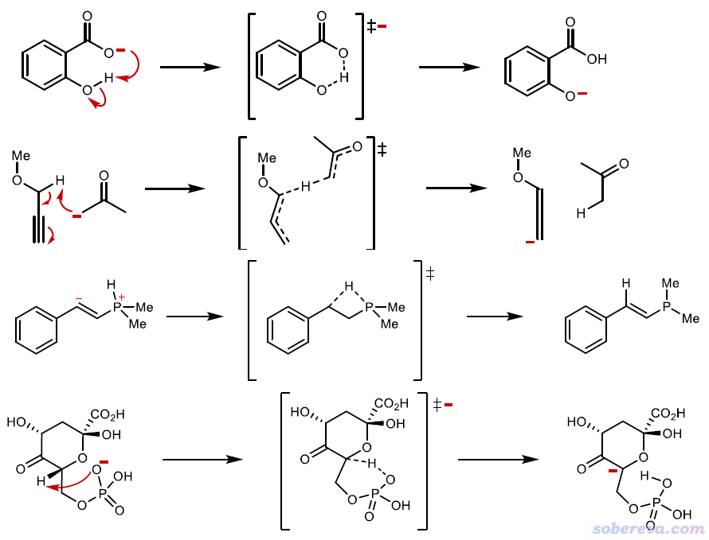
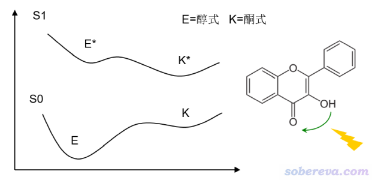
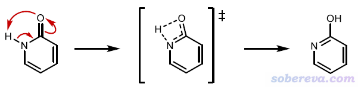
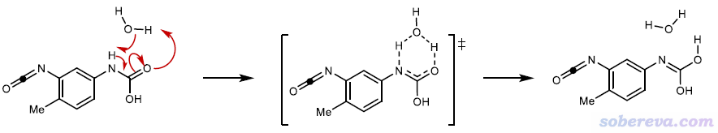
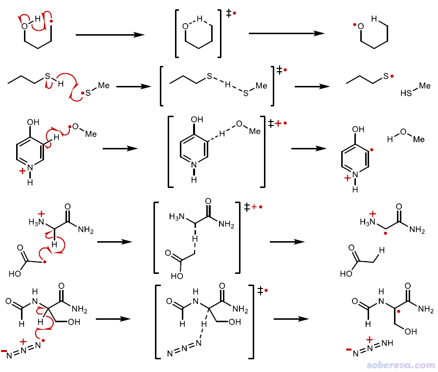
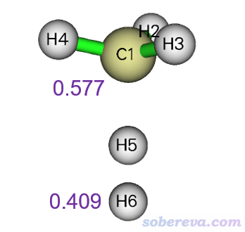
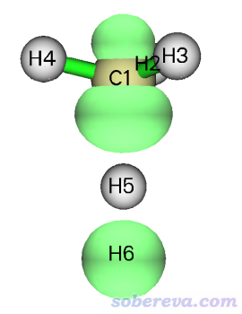
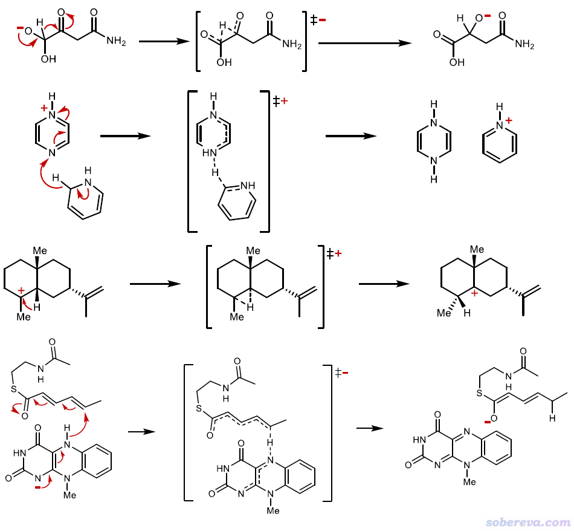
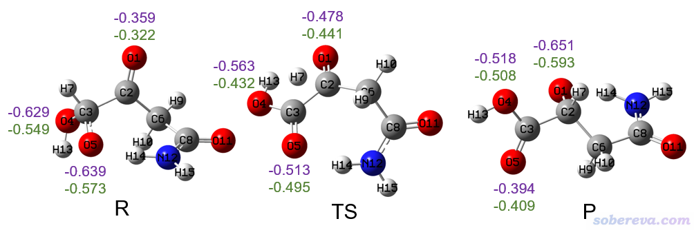
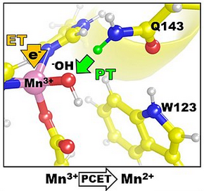

**谈谈****质子转移、氢原子转移、氢负离子转移的关系**

On the relationship between proton transfer, hydrogen atom transfer, and hydrogen anion transfer

文/Sobereva@[北京科音](http://www.keinsci.com)

First release: 2021-Dec-23  Last update: 2025-May-10

## 0 前言

质子转移、氢转移、氢负离子转移是关系密切相关的三个化学过程，有时候有人问相关的问题。我觉得有必要写一个小文总结一下它们的差异，使读者能分清它们的关系。与此同时笔者还会从量子化学波函数分析角度提及一些相关的问题，给我的一些观点，以助于量子化学研究者正确地认识这些过程的本质。

## 1 质子转移（Proton Transfer）

质子转移本意是一个质子（不带电子的氢原子核）的转移。可以在离子间，也可以在中性物质间。可以在不同体系间，也可以在同一个体系内。

### 1.1 离子间质子转移

离子间（至少二者其中一方是离子）质子转移常见的情况有以下这些（孤对电子用:来凸显。离子用括号表示）  
• 阳离子向中性分子转移：(A-H)+ + :B → A: + (H-B)+  
• 阳离子向阴离子转移：(A-H)+ + (:B)- → A: + H-B  
• 中性向阴离子转移：A-H + (B)- → (A:)- + H-B  
直接根据转移前后物质的带电情况就能判断是不是质子转移。比如酸性条件催化乙酸乙酯水解的过程中，第一步是质子化的水(H3O)+将质子向乙酸乙酯的氧转移。

以下是其它离子间（或同一个物质的局部显离子性片段间）的质子转移例子。取自DOI: 10.1021/acs.jctc.1c00694的SI。

### 1.2 中性间质子转移

中性间的质子转移形式有  
• 转移之后还是中性：A-H + :B → A: + H-B  
• 转移之后成为阳离子和阴离子：A-H + :B → (A)- + (H-B)+

注意，接受H和给H的对象，即A和B上会与H连接的原子，都应当是电负性较大的原子，这样转移的H才显著带正电荷，才基本算得上质子。这种情况下，A-H...B在形式上可以被算作是氢键（但未必转移过程的各个几何结构下都能满足氢键判据）。

下面是典型的能发生分子内A-H + :B → A: + H-B型质子转移的体系，3-羟基黄酮。在基态和激发态势能面都可以发生对应醇式->酮式变化的质子转移，但在激发态势能面下无论是动力学上还是热力学上都明显更容易发生，这称为激发态分子内质子转移（excited-state intramolecular proton transfer, ESIPT)。

在高极性溶剂下，氨基酸上的-COOH会向-NH2自发发生质子转移成为-COO-和-NH3+；在水中硫酸会向水质子转移成为[HSO4]-和H3O+，都是典型的A-H + :B → (A)- + (H-B)+的质子转移情况。

下面是2-pyridone向2-hydroxypyridine的异构化。由于给H和受H的分别是N和O，电负性都很大，因此姑且称得上是质子转移。N-H...O也是典型的氢键形式，虽说在初始结构下由于氢键键角太大因此还称不上是氢键。

下面是水辅助的质子转移的例子。虽说H也不是不能从N直接迁移到O上去，但借助水实现质子转移明显势垒低得多。

在这一节最后特别要强调的一点是，现实当中，质子转移过程绝对不是真的像字面意思那样，一个一丁点电子都不带的质子发生转移！对于前面的那些例子，无论对反应物、过渡态还是产物去计算H的各种形式的原子电荷（ADCH、NPA、CHELPG...，不懂的话看《原子电荷计算方法的对比》<http://www.whxb.pku.edu.cn/CN/abstract/abstract27818.shtml>，以及<http://sobereva.com/714>里面说的我的原子电荷的综述文章），H的原子电荷都只有零点几而已，即转移的微观过程中质子上始终附着着不少电子。如果跑IRC或者做一个从头算动力学模拟，也没有哪一帧结构H带的原子电荷恰好是+1，即完全是质子状态。例如下面是2-pyridone向2-hydroxypyridine的质子转移对应的异构化过程的过渡态，在M06-2X/6-31G**级别下对转移的H10通过Multiwfn程序用流行的ADCH、Hirshfeld、Mulliken、CHELPG、Hirshfeld-I方法算的原子电荷分别是0.195、0.143、0.372、0.303、0.412，虽然定量上有所不同但都远小于H只含一个质子时对应的原子电荷1.0。

还要强调的是，上面的一些Lewis式里面的完全定域化形式的电子结构很大程度上和真实电子结构不符。例如第一张图里COO-把负电荷只标在了一个氧上，但实际上对优化后的反应物去计算原子电荷，两个氧的原子电荷相差并不很大，即额外的负电荷是离域在两个氧上的。关于这一点后面还会看到例子。

## 2 氢原子转移（Hydrogen Atom Transfer, HAT）

氢原子转移也相当于氢原子抽取（Hydrogen-Atom Abstraction, HAA）过程，通常形式为A-H + •B → A• + H-B。这种转移强调转移过去的是氢原子，即质子和电子是协同转移的。一般接受氢原子的物质是自由基。和中性分子间的质子转移还有个不同点是A、B不需要都是电负性比较大的原子。接受氢原子的也不非得是自由基。比如Eur. J. Org. Chem., 2017, 2056 DOI: 10.1002/ejoc.201601485这个综述里介绍了光催化剂被光激发后也可以作为抽氢的物质。

下面是一些氢原子转移的典型例子

判断是不是分子间氢原子转移的关键依据就是看转移后是不是接受H的一方电子数增加了1，只要知道反应物和产物是什么自然就能判断。对于判断是不是分子内的氢原子转移，可以对过渡态结构计算给H和受H的原子的自旋布居（做法看《谈谈自旋密度、自旋布居以及在Multiwfn中的绘制和计算》<http://sobereva.com/353>），如果都明显大于0，就算得上是氢原子转移。例如下图是H + CH4 → H2 + CH3的抽氢反应的过渡态结构和Multiwfn程序对B3LYP/6-31G**波函数用Hirshfeld方法算的原子自旋布居，可见两个原子的数值都明显大于0，故是典型的氢原子转移过程。

还需要提醒的是，不要以为氢原子转移在微观机制上是一个一般形态的氢原子转移过去的。一个孤立存在的氢原子是一个原子核带一个未成对电子，原子电荷为0、自旋布居为1。如果是一般形态的氢原子发生转移，在过渡态的时候自旋布居就算达不到理想的1，至少也肯定是显著大于0的数值。但事实上，转移的氢原子可以带着近乎等量的alpha和beta电子，即几乎没有单电子。例如上面的例子，过渡态结构下用Multiwfn画的0.02 a.u.等值面数值的自旋密度图如下，绿色代表正值等值面。可见在转移的H5上等值面没有分布，其Hirshfeld原子自旋布居也基本为0，而其Hirshfeld原子电荷却几乎为0，体现出在这个原子上同时有大约0.5个alpha和0.5个beta电子。

## 3 氢负离子转移（Hydride Transfer）

氢负离子转移，可以为A-H + (B)+ -> (A)+ + H-B，可见H转以后令B那部分不带电了，因此可以认为转移过去的是个氢负离子（氢上带了两个电子）。也可以为(AH)- + B -> A + (HB)-，形式上H带了一个额外负电荷过去。下面是一些具体例子。注意在这个转移过程中，如果用量子化学方法考察，并不会发现H上带明显负电，毕竟H的电负性很小，因此事实上只不过是随着H的转移，电子从A大量流到B上而已。

再强调一下，前面那些Lewis图描述的电子结构很多都是极不确切的。尤其是分子内氢负离子转移，其实只能算得上是“Lewis式变化角度上的氢负离子转移”。如果脱离了Lewis式，从严格的量子化学角度看待，其实说是氢负离子转移是极度牵强的。比如上图第一个反应式，其反应物(R)、过渡态、产物(P)的结构图如下，几个氧原子以及转移的H的Mulliken和ADCH原子电荷分别用紫字和绿字标注了

按照前面的反应式，随着H7的迁移，O5上的一个形式负电荷将会完全转移到O1上。但事实上，从上面图中的原子电荷来看，电子的转移远远远远没有这么夸张。反应物结构下，O5和O4带的负电荷是基本一样多的，在产物结构下，O1带的负电荷也没比O4多多少，所以简单认为这个阴离子体系的负电荷只会集中分布在某个氧上是荒谬的。另外，H迁移前后，O5的ADCH电荷从-0.573变为-0.409，改变了+0.164；O1的ADCH电荷从-0.322变为了-0.593，改变了-0.271。无论从哪一方的原子电荷变化来看，在H转移过程中从O5向O1净转移的电子都远远远远达不到1。另外，转移过程中H的带电量也基本没变化。所以，上例的情况其实只能算得上是有那么一些氢负离子转移的特征罢了，仅当（装傻地、自我欺骗地）把电子结构的定域性夸张描述到Lewis式所表现的程度（而且不考虑Lewis式之间的共振），才能说成是本格的氢负离子转移！至于前面给出的各种反应式里的弯箭头，有的还多多少少有那么一点合理性、能多多少少稍微体现一些电子转移的实际情况，而有的真的就是随意地人为臆测、定性都是错的，因此切勿太当回事。

## 4 其它情况&PCET

最后再提一下，绝对不要但凡看见H的转移的反应，就非得把它归属于质子转移、氢原子转移、氢负离子转移中的一种，尤其是分子内的H转移。比如说HCN→CNH的异构化反应，说它是质子转移，显得不科学。因为如果非要这么说的话，用Lewis式来表达，是从H-C≡N变成(C-)≡(N+)-H，但(C-)≡(N+)-H的描述对于CNH来说很不合理，实际算出来的原子电荷和此Lewis式所示意的情况大相径庭，因此称为质子转移明显不合适。而若说它是氢原子转移，和一般的氢原子转移的情况相比，这反应又没体现出转移前后单电子主要分布位点发生改变，况且本来转移全过程都是闭壳层状态，连单电子都没有。此反应也更是一点氢负离子转移的特征都没有。所以像这种反应，就简简单单地笼统说成“氢转移”就完了，而不要去强行去声明转移的具体形式和氢的形态。

还有一种转移叫质子耦合电子转移（Proton-coupled electron transfer, PCET），是指电子和质子协同发生转移。这表面看起来好像和HAT转移似的，HAT转移的氢原子不就是一个质子带一个电子么？PCET之所以有一个专门的词，是强调转移的质子和电子始于不同的位点，而且去往不同的位点。例如下面的图就是一个例子，Q143氨基酸残基的质子往带负电的OH配体部分转移，与此同时，电子往Mn(III)上转移。

有人问我怎么算PCET。算PCET时，如果体系里已经包含了转移过来的电子的来源，则总电荷不用改，通过对质子转移的IRC的各个点计算原子电荷，就可以考察是不是质子转移时伴随着另一个位点的电子转移了。确认了是PCET过程后，则势垒、反应能之类的平时该怎么算怎么算。
