**谈谈怎么判断分子动力学模拟是否达到了平衡**

On the judgement whether molecular dynamics simulation has reached equilibrium

文/Sobereva@[北京科音](http://www.keinsci.com)  2021-Dec-24

## 0 前言

时常有人在思想家公社QQ群里或计算化学公社论坛（<http://bbs.keinsci.com>）里问关于怎么判断分子动力学模拟中体系是否达到平衡的问题，问是不是看温度、势能变化等等信息判断。然而往往提问的人都不说清楚他的体系是什么特征，导致这根本没法回答。实际上，对于不同类型的体系，判断方式有极大的差异。有一点尤其要搞明白：模拟的体系有各种各样的属性，达到完全平衡的话，所有这些属性都不会再有显著的整体变化（瞬时的波动、涨落不属于这种变化）。光拿那些较容易达到平稳的属性来衡量体系是否已经平衡是没有意义的。衡量是否已达到平衡要用最能反映当前体系从非平衡变化到平衡过程中有关键性变化的那些量，或者用最难达到平衡的那些量。本文就用一些有代表性的体系来进行说明，例子都是北京科音分子动力学与GROMACS培训班（<http://www.keinsci.com/workshop/KGMX_content.html>）里我详细讲过怎么模拟的体系，有的图我就直接贴培训班里的ppt了，分析命令和分析脚本在培训班里也都讲过。

## 1 小分子液体

水、乙醇、尿素等小分子液态体系的模拟相对来说很容易达到平衡。即便初始结构设置得比较随意，比如就是用packmol（<http://sobereva.com/473>）甚至GROMACS自带的粗糙的gmx insert-molecules来建模，由于小分子扩散运动很容易，通常顶多经过几百ps的模拟就能达到平衡。对这类体系衡量是否达到平衡用密度（或盒子体积）、压力、温度、势能、动能之类的衡量整体状态的常见量就可以。对于GROMACS用户来说，这些量直接就可以通过gmx energy命令从edr文件中提取。

例如，笔者对512个乙醇构成的盒子在常温常压下进行100 ps的模拟，在0~30 ps期间参考温度从0 K线性升到298.15 K。这个模拟对应平衡相(equilibrium phase)阶段，目的是让体系从非平衡达到充分平衡状态，如果发现这个模拟阶段中途就已经达到平衡了，那么就可以延续最后一步的状态跑较长时间的产生相（production phase）模拟来获得液体的实际性质。此100 ps平衡相模拟过程中密度变化如下所示

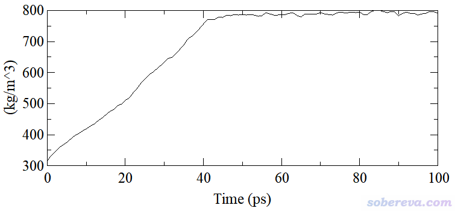

由上图可见，从密度的变化角度来说，从大约50 ps开始就可以认为已达到平衡了，因为之后仅有瞬时的波动而不再有整体的起落。当前模拟用的初始结构是gmx insert-molecules创建的，为了确保512个分子都能成功插进去，盒子设得比较大，因此初始结构非常稀疏、密度严重偏低，这是为什么上图中模拟前期密度迅速升高。

还可以计算漂移(drift)来进一步从数值上辅助说明上图已达到平衡。这里所谓的漂移是对属性随时间的变化做一个线性拟合，然后求直线的末尾时刻与初始时刻的差值。显然，如果被考察的属性如果随模拟进行没有整体升高或整体下降，则拟合的直线斜率将为0，drift也就为0。但现实中，就算体系已经平衡了，由于统计误差，drift也不可能恰好为0，对于密度等属性来说，只要drift值的数量级远远小于统计区段的平均属性值就行。

计算drift值可以自己在比如Origin等程序里拟合，而对于GROMACS用户，在使用gmx energy命令从edr文件提取数据后在屏幕上直接就显示了。对于上图，如果想对从图上看已平衡的50~100 ps区间计算drift值，就输入gmx energy -f eq.edr -b 50 -e 100，屏幕上显示的信息中Tot-Drift下面的值对于此例是8.7，只有程序输出的这段区间平均密度789.3的百分之一，因此密度在50 ps后的整体变化可以忽略不计。

对上例再绘制一下温度的变化，如下所示。可见温度达到平衡比密度更快，在按照退火设置从0~30 ps期间从0 K上升到300 K后，温度就不再有明显变化了。

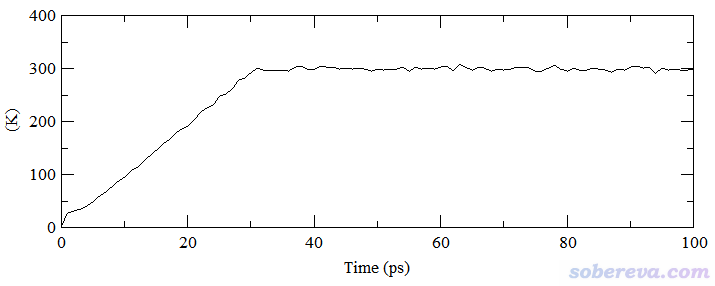

温度正比于体系内粒子的平均动能的，由于温度平衡了，动能自然也就平衡了，所以由于前面已经考察过了温度，故动能就没必要再检验了。通常还会从总能量或势能的角度再考察一下是否达到平衡。下图是模拟期间的势能变化，可见从50 ps开始，势能也已经平稳了。

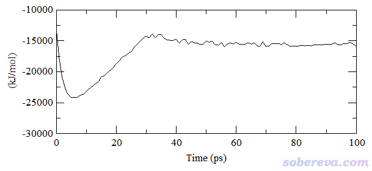

由于上面温度、密度、势能这几个关键指标模拟到大约50 ps时都已经基本达到了平衡，所以当前跑的100 ps的平衡相模拟已经够长了，之后就可以放心地做产生相模拟了。如果有哪一个指标尚未平衡，都不能说体系达到了平衡。

再顺带提及一个初学者经常问的关于压力随时间变化的问题。这里我用一个已经达到平衡的含有884个分子的水盒子来说明，此模拟跑了1 ns且记录了1000次数据。模拟过程压力随时间变化如下所示

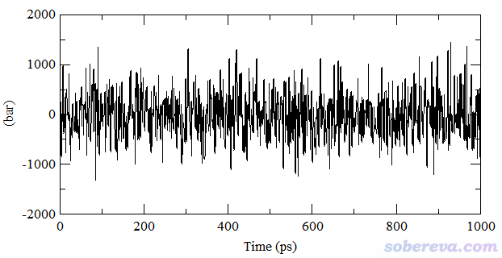

有些人一看这大幅度的压力波动就慌了，纳闷：怎么明明设的参考压力是1 bar，压力波动范围却达到-1000~1000 bar的程度，而且波动剧烈，这也太夸张了吧？有的初学者还因此以为模拟有问题，或者体系没有达到平衡。实际上，体系越大，压力波动会倾向于越小，且压力的波动随着粒子数的增多以平方根为比例而减小。对于只有884个水的盒子，这样的压力波动是极为正常的！另外，由于液体的可压缩系数非常小，压力的很大变化只会导致盒子体积的很轻微变化，所以在模拟过程中盒子尺寸的变化微乎其微。要检验模拟过程中控压是否合理，要关心的是平均压力而非瞬时压力。上图对应的平均压力为1.8 bar，偏离参考压力虽然达到80%，但相对于压力的大范围波动，这种程度的偏离完全可以忽略不计（哪怕差10 bar都没关系），也完全不需要顾虑模拟出的性质会由于这个偏差而不准确，毕竟对盒子尺寸影响甚微。另外，上例的压力drift值算出来为1.98 bar，虽说其数量级和压力平均值已经差不多大，但由于压力的剧烈波动造成drift值的统计误差本来就容易较大，这种程度的drift可以完全忽略不计。

压力的波动程度相对于其它属性总是显得很剧烈，因此难以直接从压力曲线上观察压力的总体变化情况。不过，可以绘制局部平均的压力曲线来进行考察，也就是对相邻一定数目的帧的压力取平均。在Origin、Grace等很多程序中都支持对被载入的数据做这种局部平均化的处理。例如在Grace中，选择Data - Transformations - Running averages，若将length of average设为200，就代表第i个点的数据取前后相邻100个点数据的平均值。对上图的数据做这种处理后，产生的局部平均压力曲线对应下图的红色曲线，可见非常平直，说明在模拟过程中压力未曾有过明显的整体的上升或下降。

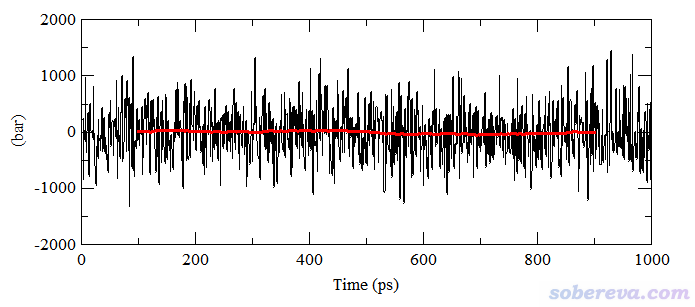

## 2 生物大分子

对于蛋白质、核酸这样的生物大分子，我们关心的对象不是整个体系，而是生物大分子部分，所以检验平衡自然是要看生物大分子的状态是否达到了平衡。最常用的衡量方法是绘制RMSD曲线。RMSD有非质权和质权两种，分别如下所示，其中粗体r是笛卡尔坐标，ref代表参考结构，A循环所有原子，M是分子总质量。

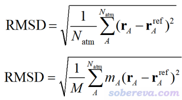

RMSD衡量了当前结构与参考结构的整体差异。考察生物分子是否在模拟中结构达到了平衡状态，通常以轨迹的第一帧作为参考结构计算各帧的生物分子的RMSD并绘制成曲线，如果从某个时间点开始RMSD曲线基本不再有显著的整体变化了，就说明结构已经平衡了。通常被计算的是蛋白质或核酸的不包含侧链的骨架部分原子的RMSD（并且大多不考虑氢原子），也有文章计算的是所有alpha碳原子（这是衡量残基骨架位置的最关键原子）。在计算RMSD之前必须先通过最小二乘法将各帧结构相对于参考结构进行最大程度叠合，从而消除体系的整体运动而令RMSD只体现生物分子内部结构的变化，这称为align或者least squares fit。GROMACS的gmx rms命令和VMD自带的Extensions - RMSD Trajectory Tool都可以计算RMSD曲线，分别默认是质权和非质权形式。

在无数生物分子模拟的文章里都给出了RMSD曲线，以证明模拟的时间足够长。例如下面的图来自笔者的Biochemistry, 48, 7986 (2009)，总共跑了10 ns，这是一个十分典型的蛋白质模拟的RMSD曲线，计算的是alpha碳原子的RMSD，初始结构是晶体结构。

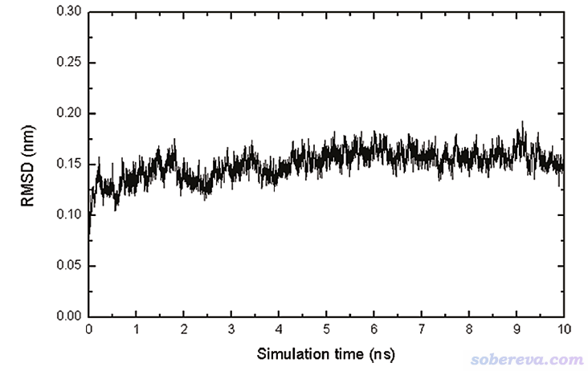

由上图可见，第一帧是参考帧，其RMSD精确为0。在模拟开始后RMSD迅速增大，一方面是蛋白质的热运动必然使其结构在一定程度上偏离参考结构，另一方面是体系从非平衡向平衡状态演变。从上图来看，蛋白质的骨架在模拟中很快就达到了平衡状态，也就跑了几百ps后RMSD就达到了0.13 nm左右，之后就没有显著的变化，后续模拟过程中蛋白质都相当于在最稳定构象对应的相空间的势阱里游历。

需要注意的是，蛋白质骨架的RMSD曲线并不总能反映出蛋白结构特征变化的全貌。一方面，RMSD的计算涉及到一大堆原子的平均，若一个很大的蛋白某个局部出现一定程度的显著的、不可忽视的结构变化，在RMSD计算过程中它会被很大程度淹没掉。另一方面，骨架的RMSD不能反映侧链上出现的一些关键变化。例如上面这篇文章发现，在423 ps的时候磷酸化酪氨酸574残基侧链出现了显著的翻转，这使得被研究的酪氨酸激酶活性位点打开，这在分子生物学角度是一个很重要的现象，而从alpha碳的RMSD曲线上则完全体现不出来这一点。文中图4(A)绘制了这个残基侧链二面角随时间的变化，这才让这关键信息被展现出来。

如果蛋白质的RMSD曲线在已经跑的模拟时间内还没有稳定在一个值附近且持续了较长时间（有零点零几nm的上下波动是可以接受的），而你又需要蛋白质已达到平衡的结构，通常就需要延长模拟时间续跑，直到RMSD基本平稳。例如下图的RMSD仍有明显的整体升高趋势，况且才跑了1 ns，跑1 ns经常还达不到平衡，所以应当继续再跑跑。

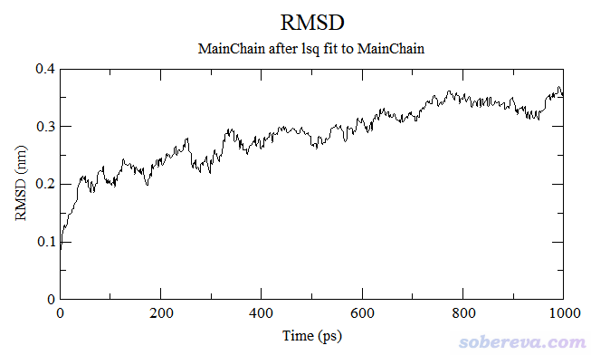

有些人试图用衡量小分子液体的方式衡量生物分子模拟体系是否达到稳定，即还用温度、密度、势能等参数来衡量，这明显不行。因为这些量的收敛速度远快于蛋白质的RMSD的收敛，在这些指标已平稳的时候蛋白质部分通常还明显没达到平衡。虽然蛋白质整体结构的进一步变化必然会对势能等因素有多多少少的影响，但在势能曲线上基本体现不出来。通常模拟蛋白质都是在显式水模型下模拟的，势能绝大部分都是水所贡献的，显然蛋白质结构的改变对总势能的影响通常会被淹没；而且就算在比如GB隐式溶剂模型下模拟（GB模型简介看《谈谈分子模拟中的隐式溶剂模型与GB模型》<http://sobereva.com/42>），蛋白某些局部结构的改变往往在总的势能曲线上也反映得很不明显，除非是构象真的有肉眼都能清楚看出的剧烈改变。举个例子，上面图中蛋白质骨架的RMSD虽然还没平衡，但整个蛋白质+水体系的势能曲线图已经完全平衡了，如下所示（此模拟之前已经做了限制性动力学，即给蛋白质骨架加了限制势，水已经弛豫过了一定时间，所以看上去一开始势能就已经平衡了）。

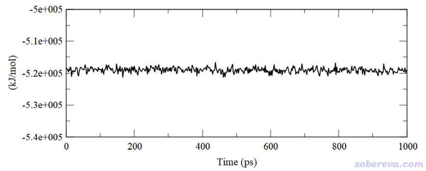

常有人问怎么他的RMSD曲线中途出现了突变。下面两张图是计算化学公社论坛上我答疑时看到的，可见中途RMSD都出现过剧烈的变化，完全超越了平衡状态下的正常波动的程度。这种突变必须给予明确的解释，要不然审稿人看见肯定会问你是怎么回事。始终要记住，RMSD曲线是轨迹变化的定量反映，想解释抽象的RMSD曲线的突然变化是什么导致的，当然要去用VMD程序看轨迹动画才能充分弄清楚原因。绝对不可能RMSD曲线出现厉害的突变时在轨迹动画上却看不出任何端倪。如果你的眼力不好，建议先对结构进行叠合，然后在VMD里把突跃前和突跃后的两帧叠加显示出来。比如第8200帧相对于第8100帧出现了RMSD的巨大升高，想弄清楚结构什么地方发生了怎样的巨大变化，在VMD的Graphics - Representation里选Trajectory标签页，在Draw Multiple Frames里输入8100:100:8200，并且把Coloring Method设为Trajectory - Timestep，这样这两帧就会用不同颜色一起显示出来便于比较在哪里结构有明显变化。

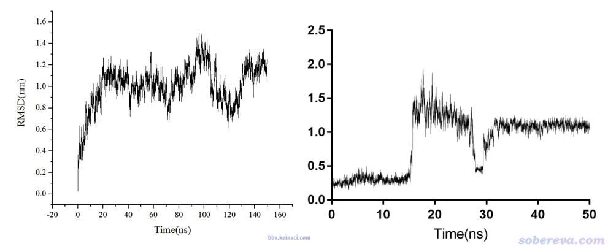

还老有人问他们的RMSD曲线怎么跑成了下面这样，即出现了RMSD瞬间的上上下下的改变。

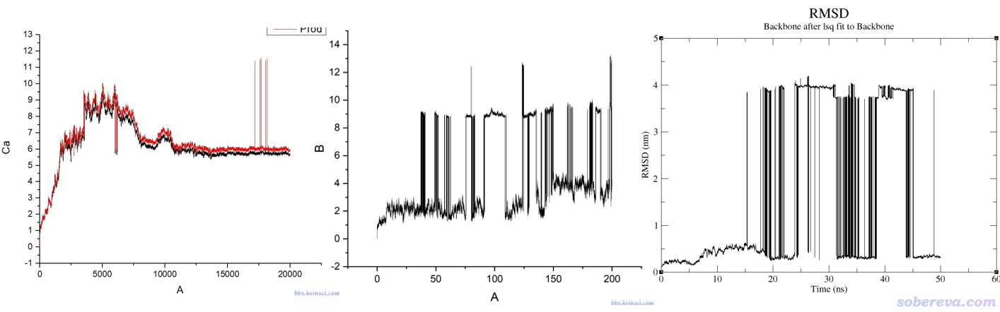

上图这种情况只要在VMD里观看轨迹动画自然能明白原因。就算不看轨迹也100%能断定肯定是因为周期性方式记录轨迹，而被计算RMSD的对象在模拟过程中越过了盒子所致。当某一帧突然体系被弄到了盒子另一头，RMSD自然会出现瞬间的大幅变化。解决这种RMSD曲线不连续性的方法很简单，消除被计算RMSD的对象的整体运动，并保持此对象的完整性就完了。比如在GROMACS里，可以用gmx trjconv结合-pbc mol使得转换出的新轨迹中的分子保持完整，计算RMSD前再经过叠合来消除蛋白质的整体运动，其RMSD曲线就不可能突变。还有一种情况是被计算RMSD的对象是由多个分子组成的，比如有多条链的蛋白、蛋白+配体复合物、含有两条链的核酸，这种情况可能模拟中途只有其中一部分跑出盒子而另一部分还在盒子内，光是用-pbc mol保持单分子完整的话此对象的不同部分还是分家的，对这种情况需要用gmx trjconv结合-pbc cluster让指定的组在轨迹中一直保持完整，组的定义就对应于你要计算的RMSD的对象。顺带一提，对生物分子的模拟，我一般建议让程序在模拟过程中就一直对生物分子消除平动转动，对于GROMACS跑蛋白质来说就是设comm-grps  = protein和comm-mode = angular，这样就避免了生物分子中途跑出盒子的问题。

不同的生物分子体系的RMSD达到平稳时RMSD的数值会有一定不同。柔性越大的体系，平衡时RMSD越大。比如DNA体系骨架柔性比一般较刚性的蛋白质要大，这会体现在达到平衡时RMSD相对较大上。

通过RMSD考察是否平衡不是必须得用初始帧做参考结构。J. Chem. Phys., 109, 10115 (1998)认为以初始结构当参考帧来观察RMSD会高估达到平衡的时间，因此会把一部分其实已经达到平衡的轨迹误认为还没平衡，导致浪费了一些轨迹。作者的观点是相对于初始结构，模拟开始后RMSD的增加由两部分组成：(1)非平衡态到达平衡态 (2)平衡态时在相空间采样。实际上(1)满足了的时候本质上生物分子就已经平衡了，这比起以初始结构为参考帧计算的RMSD曲线达到平稳时更早。为了判断什么时候就已经满足了(1)，作者建议以已经平衡了的结构作为参考帧来计算RMSD。下图是文中的图，作者取500、600、700、800、900 ps分别作为参考帧绘制了RMSD曲线，并假定这些时刻体系都已经达到了平衡。由图可见，每条曲线在参考帧附近都是迅速上升，这体现出已平衡的结构在相空间采样期间由于热运动自然而然地相对于参考结构发生的结构改变；而在图的前200 ps，这几个曲线都明显上升，因此体现出前200 ps是确确实实结构没有达到平衡、有整体性变化的阶段。

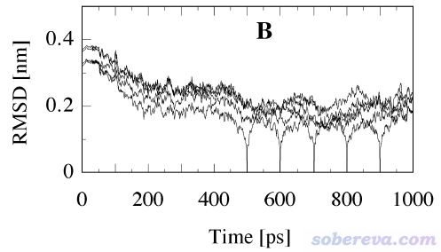

上面这篇文章的做法只是一家之言，不是什么流行的做法，大家仅供参考，许多实际情况也没有这么理想化。另外，上面这篇文章的做法并不能判断当前的模拟是否已经跑成了平衡状态，而只适合你已知体系已经平衡了，然后以它为参考结构，再去判断轨迹从哪里开始就已经达到了平衡并因此能够用于正式分析。那篇JCP文章发表时间较早，当时计算条件较差，所以对轨迹比较珍惜，能少浪费一点是一点；而如今GPU加速的计算条件下，普通的蛋白质+显式水一天就能轻松跑100ns以上，也就没必要那么较真了，因此此文章的方法也没有太大实用价值了。不过值得一提的是，如果你是从一个比较离谱的结构开始跑的动力学，那么上文的做法还是比较有价值的。比如模拟一个未折叠的小肽的折叠过程，如果以初始未折叠的散乱结构作为参考帧来算RMSD曲线，那明显不太适合，最后已平衡的折叠后的结构的RMSD曲线肯定非常大。如果你从已经达到平衡的折叠好的结构当参考帧来算RMSD曲线，就可以比较确切地判断什么时候体系已经平衡了、已经形成了比较稳定的折叠结构，而且根据RMSD曲线从一开始变化的过程上（必然是整体逐渐降低）还可以考察小肽的构象是怎么一点点趋近于最终平衡结构的。

提醒一下，用结构的RMSD是否平稳来衡量是否达到平衡切勿不分场合地乱用。比如有人做分子团簇的模拟，也试图用RMSD判断稳定了没有，这明显不行。分子团簇的动力学过程中，团簇的构型不断变化，分子不断运动、位置不断改变，因此RMSD完全乱掉了，什么也说明不了。这一点根据RMSD的定义结合基本逻辑自然就能明白。对磷脂膜的模拟也是，不可能用所有磷脂的RMSD来衡量是否平衡，因为模拟过程中磷脂分子会不断侧向扩散，RMSD不可能最终平稳到基本不变。

## 3 互溶与分离过程

对于小分子间互溶或分离过程，要判断是否达到平衡，应当取最能直接反映这种过程特征变化的量。

例如，下面的例子是一开始处于两相的水和乙醇的体系，在模拟过程中逐渐互溶的过程。在这个过程中什么特征变化特别明显？显然可以想到氢键的变化。一开始水和乙醇只在界面处彼此间能形成氢键，数目相对较少；而模拟到互溶后，水和乙醇充分混到一起，彼此间显然能形成大量氢键。因此，考察水和乙醇之间的氢键数目的变化就能准确地考察什么时候互溶过程已充分完成、体系已达到平衡。用GROMACS的gmx hbond命令，或者VMD自带的Extensions - Analyais - Hydrogen Bonds插件就可以做这种统计。从下面的图中可见，模拟一开始氢键数目迅速增加，说明互溶不断加剧，到了200 ps时氢键数目基本就稳定了，因此可以认为200 ps的时候这个体系已经达到了平衡。

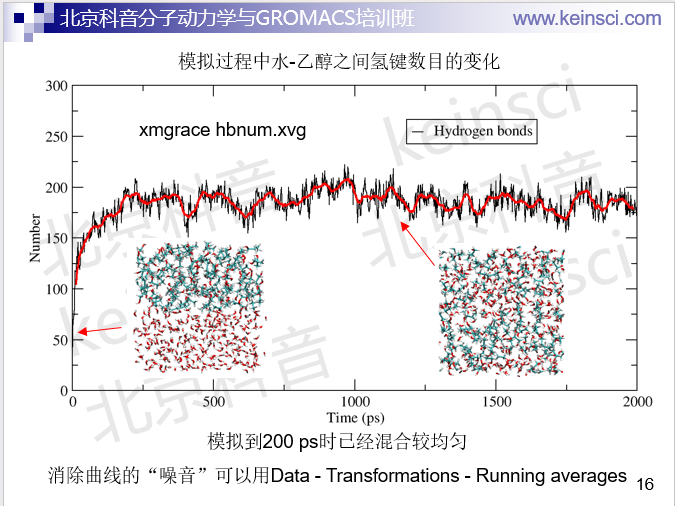

当然，对上面的例子统计氢键数目变化不是唯一考察是否达到平衡的做法，还可以自己写VMD tcl脚本考察乙醇附近水的数目的变化、计算乙醇或者水的溶剂可及表面积（SASA）等等，因为这些量都是对互溶过程很敏感的量，互溶过程中它们都会发生很大变化。此外，还可以监控水和乙醇间非键相互作用能，对于GROMACS用户可以将这两部分都设为能量组，动力学跑完后就可以从edr文件中提取这两类分子间非键相互作用能随时间的变化，体系平衡时这个量肯定也已经平稳了。

对上面这个体系虽然也可以去考察势能、密度等属性的变化，但是凭这些难以判断什么时候体系真正达到了平衡，因为这些量太容易达到平稳。下图是水和乙醇互溶过程中体系密度的变化，可见在大约50 ps的时候曲线就已经平稳了，然而如前所见，此时水和乙醇根本还没完全互溶。笔者也考察了此模拟过程势能的变化，也是大约50 ps就已经平稳了。所以，像温度、势能、密度那些很容易达到平稳的量，只是体系达到平衡的必要而非充分条件，不能只拿这些量说事，除非是本文第1节说的均匀的小分子液体之类的简单体系。

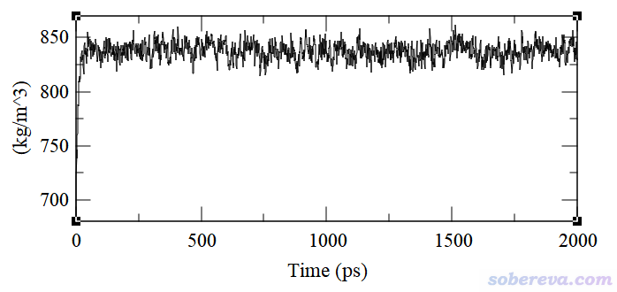

再看另一个例子，模拟的是水-正辛醇自发相分离现象，这在一定程度上是互溶的逆过程。如下图所示，一开始把正辛醇和水均匀混合在一起，进行一段时间模拟后正辛醇和水相互分离开，并且正辛醇形成类似磷脂双层膜的结构，亲水的羟基头部朝水，而疏水的烃链尾巴朝内。

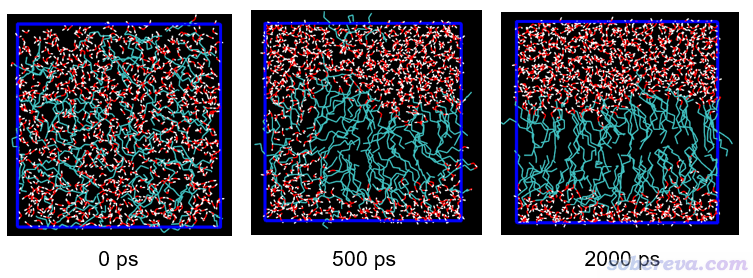

怎么衡量这个过程是否达到了平衡？很容易就想到用SASA来衡量。一开始正辛醇散乱分布，和溶剂水接触面积必然很大，体现在SASA很大上；而当正辛醇组装成为膜之后，就只有头部才能挨着水，自然SASA就比一开始小得多了。什么时候SASA曲线平稳了，就可以说明双层膜已经组装好并且结构已经平稳了、体系达到平衡了。如下图所示，随着正辛醇与水的分相，SASA不断下降，在大约1 ns时就不再下降了，因此可以说1 ns的时候体系已经达到了平衡。

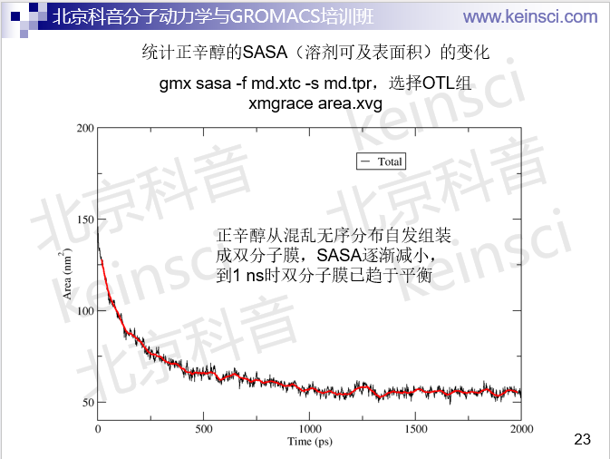

如果想为了稳妥，可以再检验一下密度和势能随时间的变化，笔者发现从势能变化的角度上看在1 ns的时候也已达到了平衡，而单从密度角度来看则800多ps就已经平衡了。若从温度角度看，则模拟刚一开始就已经平衡了，所以检验温度是否达到平衡没多大意义。

再来看一个萃取过程的模拟。一开始把水、甲苯按体积比1:1对应的分子数加入到体系中混匀，并随机加入少量的乙醚，看看水和甲苯分相后，乙醚是否会被甲苯萃取，即只出现在甲苯一相。

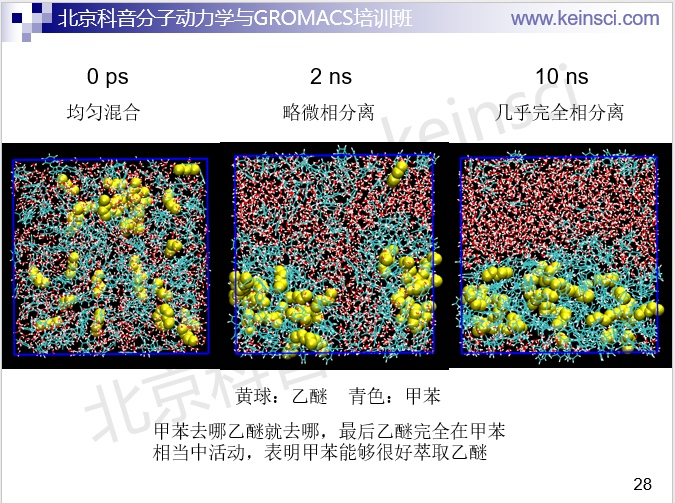

对于上述过程，若达到了平衡，必须水和甲苯两相已经稳定形成了，并且乙醚的分布也已经稳定了。水和甲苯的分离，可以按照前面说的用两部分各自的SASA的变化来衡量，而乙醚的分布怎么衡量其稳定与否？方法很多，比如可以考察乙醚和水、甲苯的作用情况或接触情况。由于乙醚和水之间可以形成氢键，故可以观察它们之间的氢键数目随时间的变化。还可以自己写个VMD tcl脚本，统计一下乙醚周围一定距离（比如3.5埃）内水分子的数目，如下所示。下图还用相同的判据把乙醚（黄色）周围的水在VMD中也显示了出来，便于和变化曲线对照以更好地了解实际情况。可见在第150帧对应的时刻，可以认为甲苯已经把乙醚萃取完成了，乙醚几乎都已经在甲苯相了，因此至少从萃取程度的角度来说体系已经平衡了。

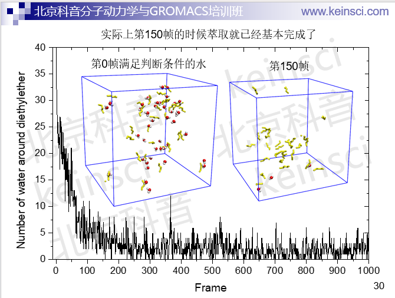

也可以用上面的做法考察乙醚附近的甲苯数、甲苯附近的水数，体系完全平衡时肯定这些量也都平衡了。大家写文章证明体系已经平衡时可以把这些量随时间的变化都画到一张图上，显得依据更充分。

## 4 气体的蒸发

这个例子是在一个10*10*10 nm的盒子中心放一个含有884个水构成的水球，经过常温下模拟达到平衡后，把参考温度设到450 K继续跑5 ns，使水球蒸发，进而变成极高压的水蒸气状态。整个模拟都用NVT系综。模拟过程中的两帧如下

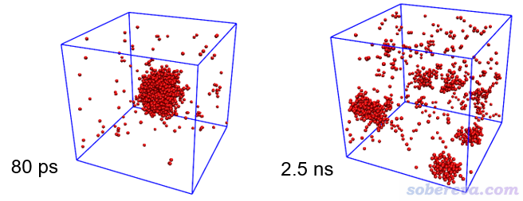

对于这个过程，想判断模拟到什么时候体系已达到平衡，可以先看看势能的变化，虽然这不能作为唯一判据，但至少这个量必须能达到平稳才算平衡了（无论对什么体系皆是如此）。模拟过程的势能变化如下，可见大约500 ps时势能就已平稳。

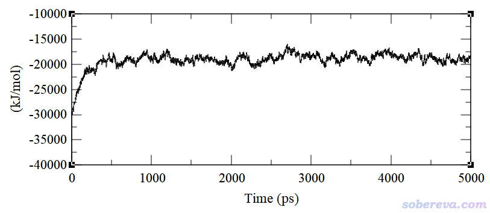

势能只是能量角度上的一个标准，但凡有可能，最好还是再结合一个结构方面的标准来进一步判断平衡，明显会更有说服力。考虑到水球蒸发后会形成一大堆孤立的水分子或小水簇，显然统计一下簇的状况就可以从结构角度对平衡情况进行考察。在GROMACS程序中自带了gmx clustsize命令可以做这种分析。其中会给出簇的数目随时间的变化，如下所示。可见一开始簇的数目极少，因为初始结构主要就是一个在盒子中央的大水球，而随着高温下的模拟进行，大水球蒸发并形成一堆水分子或小水簇，因此簇的数目迅速增长，到达约500 ps时不再显著变化。因此，结合势能和簇的数目的变化，我们可以下结论这个体系在500 ps时已达到平衡。

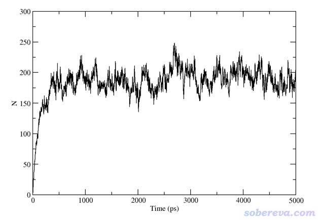

对此体系考察温度变化依然没什么用，此体系才模拟了几ps，温度就已经平稳在期望的450 K左右了。而考察压力变化倒还能说明一些问题。如下所示，模拟刚开始压力很低，毕竟大水球周围全是真空区。随着模拟进行、水球蒸发，压力有明显的上升趋势。到了大约500 ps时，压力就差不多达到了之后模拟过程中压力的平均值了，这也体现了体系此时达到了平衡。

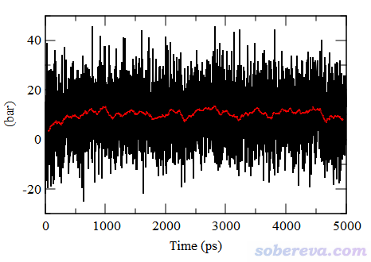

## 5 磷脂膜

对磷脂膜这类体系模拟，也可以考察密度、势能等常规属性的变化，但光是这些易平稳的属性达到平稳还不足矣判断磷脂膜已平衡。磷脂膜有个关键参数是磷脂头部平均面积（area per lipid)。假设磷脂膜平行于XY平面，将模拟的每一帧盒子的X和Y尺寸提取出来，相乘，然后再求时间平均，再除以每一层磷脂数，即可得到这个值。膜体系达到平衡的话，至少平均磷脂头部面积得达到平稳。平衡后的这个参数值和实验值相比偏差如何也是衡量磷脂力场质量好坏的关键指标。下图是笔者模拟的DPPC磷脂双层膜的磷脂头部平均面积随时间的变化图，在标况下跑了2 ns，用半各向同性控压。从这个图来看，模拟至少在1600 ps之前还没达到平衡。从1600 ps开始，磷脂头部平均面积看上去大致平稳了，但是光靠剩下的400 ps模拟的情况还不够下结论。为了保险起见，应当至少再模拟1000 ps观察一下趋势，如果此期间曲线还是平稳的，那么就可以说磷脂膜达到平衡了。

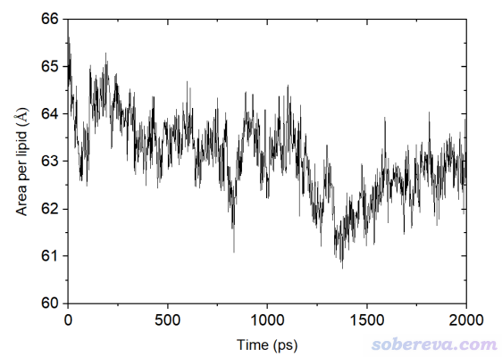

另外，还可以看一下垂直于磷脂方向（Z方向）盒子的尺寸随时间的变化，如下所示。可见这个方向盒子尺寸变化和磷脂头部平均面积有显著的负相关性，也即Z方向尺寸越大、XY面积越小。从目前已经跑的2 ns来看，判断体系已经达到了平衡还言之过早，还应当再跑跑。

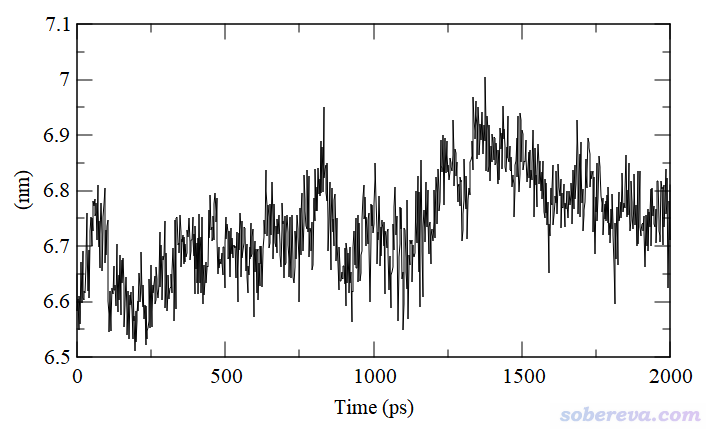

还可以同时从磷脂膜厚度随时间的变化角度检验体系是否达到平衡。可以自己写个VMD tcl脚本，分别计算磷脂膜上层和下层的所有磷原子的平均Z坐标并求差，看看以这种方式衡量的厚度随模拟进行什么时候达到稳定。

还有其它一些和膜有关的参数也可以用来检验平衡。比如膜的可压缩度，计算公式如下，尖括号代表对一段轨迹做时间平均，S是瞬时的膜面积。可以取轨迹的不同区间来计算，比如0~2、1~3、2~4 ns...，看看这个量是否随模拟进行已经趋于平稳。算这个需要自己写脚本。

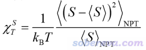

上面这个体系的势能和密度曲线达到平稳的速度远快于磷脂头部平均面积，笔者发现才跑到400 ps左右势能和密度就都已经算得上达到平稳了，再次体现不要光拿这两个量说事。

注意，磷脂膜的平衡远远远远比第1节说的小分子液体那类体系慢得多得多得多，磷脂的侧向扩散运动是相当慢的。上面的模拟笔者是用一个他人已经平衡好的磷脂膜为初始结构跑的。如果你是用比如genmixmem程序（见《生成混合组分的磷脂双层膜结构文件的工具genmixmem》<http://sobereva.com/245>）从头搭建一个磷脂膜结构，可能得花十几甚至几十ns才能达到平衡。如果是多种磷脂组成的混合膜，有时甚至可能得跑到上百100 ns才能达到绝对充分平衡。

## 6 柔性小分子

要注意，并不是所有体系都可以像前面几节的例子一样达到一般意义上的平衡。有些体系在模拟过程中会不断翻越势垒，在不同构象之间反复切换，这种情况下不可能指望结构的RMSD曲线能收敛到一个特定值附近并一直保持基本不变，也不可能指望势能能平稳在一个值附近始终稳定。比如一些小肽，没有普通蛋白质那样单一的稳定构象，就是会在不同构象之间变来变去，这可以通过绘制自由能面图（见《浅谈PCA与g_covar+g_anaeig+ddtdp+sigmaplot做自由能面图的方法》<http://sobereva.com/73>）之类的方式讨论。很多高度柔性的小分子也是如此，有大量低能量的构象，且这些构象间的势垒也比较低。笔者之前写过一篇文章《使用Molclus结合xtb做的动力学模拟对瑞德西韦(Remdesivir)做构象搜索》（<http://bbs.keinsci.com/thread-16255-1-1.html>），当时在比较高的400 K下（为了加速采样）对瑞德西韦分子跑了100 ps动力学，50 fs保存一帧，RMSD图如下所示，共2000帧，每隔500帧我绘制了一个结构附在图上。可见，此分子的构象变化始终没有消停，RMSD曲线反复明显波动。

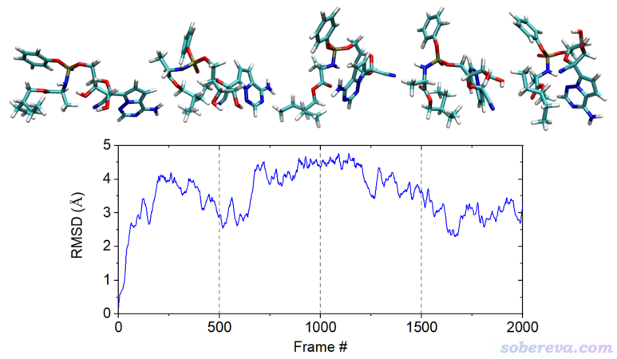

当然了，在常温下，由于分子的热运动比400 K时弱得多，瑞德西韦的构象变化肯定不会这么频繁、剧烈，但跑的时间足够长的话，对这样的柔性分子还是会看到中途有显著的构象变化并导致RMSD曲线出现突变。所以对于柔性体系，不要指望能达到平衡，除非温度低到体系总是会保持一种构象。或者说，在一般温度及更高温度下，对于高度柔性的分子，构象反复变化的状态本身就是这个体系对当前情况而言的平衡状态。

## 7 总结

本文以一系列模拟体系作为例子，示例了如何判断分子动力学模拟有没有达到平衡。可见判断是否平衡没有唯一方法，问别人怎么判断平衡时如果不说清楚被模拟的体系，谁也不可能给出确切答案。显然本文的例子不可能面面俱到，读者应充分理解被模拟的体系的特点、搞清楚判断平衡的各种指标的定义和意义，结合具体问题选择最适合的方式进行判断，务必要在本文的例子的基础上灵活变通、举一反三。对于一些比较特别的模拟体系，还可能需要读者自己设计一些最能反映体系平衡情况的专一性的几何判断标准，由于其特殊性往往没有现成的计算程序，这时就需要自己写脚本来实现计算。
