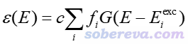
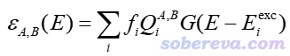
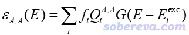
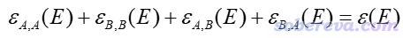
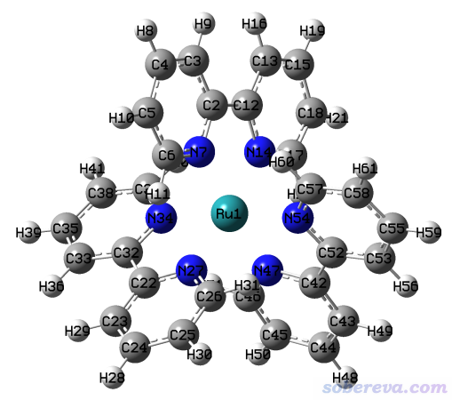
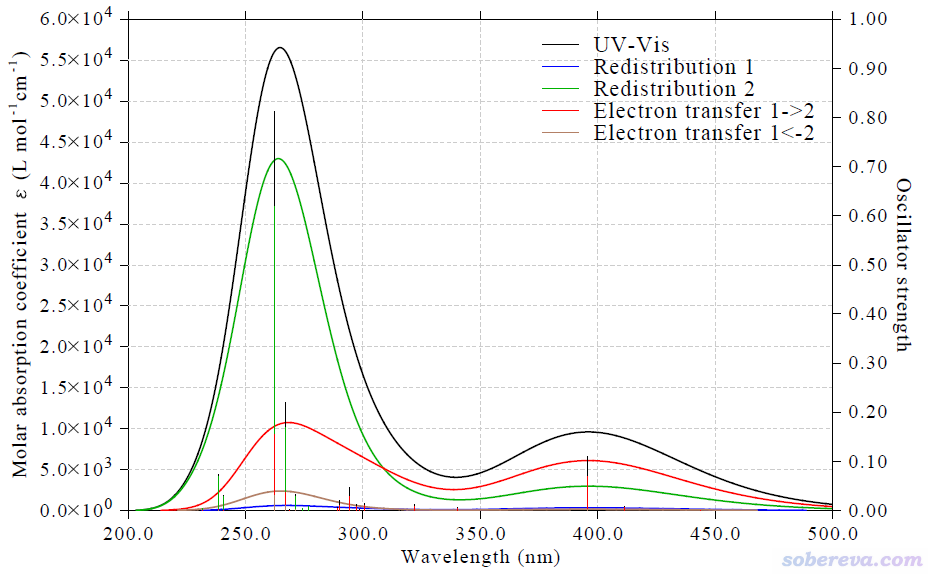
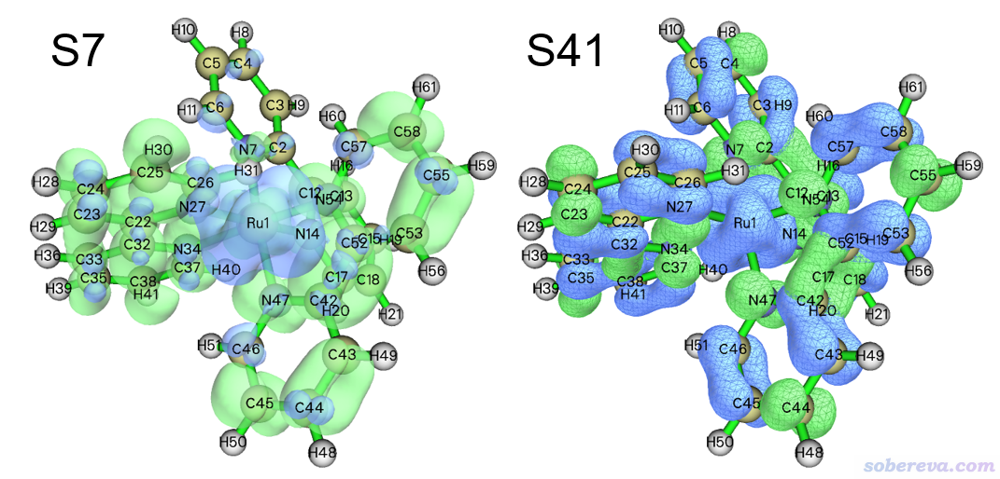
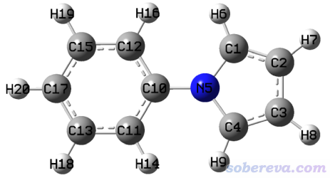
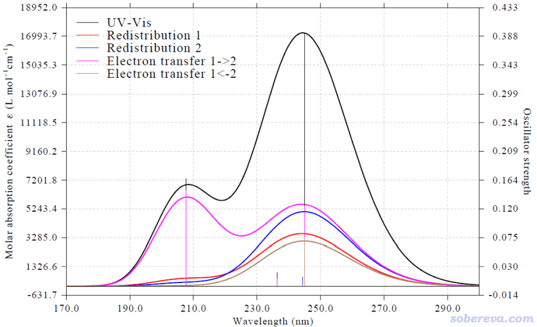

**使用Multiwfn绘制电荷转移光谱(CTS)直观分析电子光谱内在特征**

Using Multiwfn to plot charge transfer spectrum (CTS) to intuitively analyze intrinsic characteristics of electronic spectrum

文/Sobereva@[北京科音](http://www.keinsci.com)

First release: 2021-Dec-31  Last update: 2022-May-11

## 0 前言

Multiwfn程序（<http://sobereva.com/multiwfn>）有强大的空穴-电子分析功能，是分析电子激发问题的利器，见《使用Multiwfn做空穴-电子分析全面考察电子激发特征》（<http://sobereva.com/434>）。简单来说，此方法将电子激发描述为空穴分布（hole）向电子分布（electron）的激发，既可以直观地可视化，又可以给出各种重要的定量指标用于分析对比，已经被广为使用。基于空穴-电子分析理论，笔者又提出了一种非常灵活方便的考察电子激发过程中片段间电荷转移情况的方法IFCT，见《在Multiwfn中通过IFCT方法计算电子激发过程中任意片段间的电子转移量》（<http://sobereva.com/433>）。同时，Multiwfn还有强大灵活的绘制电子光谱的功能，见《使用Multiwfn绘制红外、拉曼、UV-Vis、ECD、VCD和ROA光谱图》（<http://sobereva.com/224>）。笔者后来考虑，能否将IFCT与光谱绘制功能相结合，使得UV-Vis光谱从IFCT分析角度上进行分解，使得光谱图中各个峰对应的主要本质一目了然地展现出来。这个idea笔者发现可行，而且效果很不错，已于近期实现在了Multiwfn程序中，并将其命名为电荷转移光谱（charge-transfer spectrum, CTS）。在本文将对CTS的原理进行介绍，并且给出具体应用实例展现其实际价值。读者将会看到CTS能够从电荷转移分析的角度把UV-Vis谱图中的吸收峰的本质直观地展现出来，对于理解和讨论光谱特征非常有益。

第一篇使用了CTS方法的论文是笔者的Carbon, 187, 78-85 (2022) DOI: 10.1016/j.carbon.2021.11.005，其中的补充材料里对CTS方法的原理进行了介绍，并且使用CTS分析了Li@C18复合物的UV-Vis光谱，这篇文章笔者在《理论设计由18碳环与锂原子构成的电场可控的光学开关》（<http://sobereva.com/630>）中做了详细的介绍和解读，建议读者一看。**使用Multiwfn的CTS功能发表文章时，除了引用Multiwfn启动时提示的程序原文外，也请务必同时引用这篇Carbon文章**。

笔者还有一些文章使用了CTS方法，都是CTS的很好的应用实例，十分欢迎阅读和引用：  
• Carbon, 187, 78-85 (2022)理论研究了Li原子与18碳环形成的光学开关，使用了CTS方法考察了[Li@C18](mailto:Li@C18)复合物的UV-Vis光谱的内在特征。此文的深入浅出的介绍文章见《理论设计由18碳环与锂原子构成的电场可控的光学开关》（<http://sobereva.com/630>）  
• Phys. Chem. Chem. Phys., 24, 7466 (2022)文中对C18-(CO)n系列体系绘制和分析了CTS光谱。此文的深入浅出的介绍文章见《深入揭示18碳环的重要衍生物C18-(CO)n的电子结构和光学特性》（<http://sobereva.com/640>）  
• Chem. Eng. J., 515, 163236 (2025)文中理论研究了由硼氮取代的18碳环的结构和光学性质，对(BN)4C10绘制了CTS光谱探究了其吸收光谱的内在本质。此文的深入浅出的介绍文章见《从18碳环的硼氮取代物中理论筛选出具有优异光学性质的分子：一篇CEJ期刊文章介绍》（<http://sobereva.com/742>）  
• Phys. Chem. Chem. Phys., 27, 11993 (2025)研究了18碳环结合donor、acceptor基团构成的衍生物，通过CTS光谱考察了吸收光谱的本质。此文的深入浅出的介绍文章见《理论设计基于18碳环的donor-π-acceptor型非线型光学材料：探究18碳环作为新的pi-linker的潜力》（<http://sobereva.com/751>）

## 1 原理

本节简要介绍一下CTS方法的原理。建议读者先阅读《在Multiwfn中通过IFCT方法计算电子激发过程中任意片段间的电子转移量》（<http://sobereva.com/433>）了解IFCT分析的思想是什么。

理论模拟的UV-Vis光谱描述了摩尔吸收系数ε随吸收波长E的变化关系，可以写为下面的形式。其中i循环各个激发态，f是振子强度，E_exc是激发能，G是展宽函数，对于模拟UV-Vis谱通常用Gaussian函数。c是一个与体系无关的常数。相关知识在《使用Multiwfn绘制红外、拉曼、UV-Vis、ECD、VCD和ROA光谱图》（<http://sobereva.com/224>）中都介绍过。

根据IFCT理论，假设将体系分割为两个片段A和B，那么任何电子激发都有以下四部分，可以称为IFCT项：  
(1) Q(A,A)：电子在A内的重分布（redistribution）量，也可以视为是在A内局域激发的电子数  
(2) Q(B,B)：电子在B内的重分布量，也可以视为是在B内局域激发的电子数  
(3) Q(A,B)：电子由A向B的转移量  
(4) Q(B,A)：电子由B向A的转移量  
可以证明以上四部分加和为1，对应于电子激发导致一个电子发生跃迁（虽然也另有双电子激发的情况，但不属于本文的讨论范畴）。

基于IFCT的思想，可以把总的UV-Vis光谱分解成不同子曲线。笔者将对应于片段A向片段B电子转移的吸收曲线定义为

对应于在片段A内电子重分布的吸收曲线可写为

片段B内电子重分布的吸收曲线，以及片段B向A的电子转移的吸收曲线也可以类似地定义，分别记为ε(B,B)和ε(B,A)。

由于四种IFCT项的总和为1，所以所有四种子曲线加和正好等于总的吸收曲线

将总的吸收曲线分解为不同部分的贡献一起绘制出来，就可以直观地了解各个吸收峰主要对应于什么特征的电子激发，从而加深对光谱本质特征的认识，令文章的电子激发分析部分增光添彩。这种从片段间电荷转移角度来对总的光谱进行分解，笔者将之命名为电荷转移光谱（charge-transfer spectrum, CTS）。

上面为了简单起见，只以两个片段的情况作为例子，实际上也可以定义任意多个片段来绘制CTS。若定义了N个片段，CTS图就包含N^2个曲线，其中N个对应于片段内重分布，其它对应于片段间转移。例如分为A、B、C三个片段的情况，相对于上面的情况外还有片段C内的重分布光谱曲线、A向C电子转移的光谱曲线、C向B电子转移的光谱曲线，等等。

## 2 Multiwfn绘制CTS的功能

Multiwfn可以在<http://sobereva.com/multiwfn>免费下载，不了解此程序者参看《Multiwfn FAQ》（<http://sobereva.com/452>）和《Multiwfn入门tips》（<http://sobereva.com/167>）。读者请务必使用目前最新版本，否则可能没有CTS绘制功能。

使用Multiwfn绘制CTS用的输入文件和做空穴-电子分析以及IFCT分析是完全相同的，即需要一个含有基函数信息的波函数文件，以及一个记录各个激发态的组态系数的文件。对于Gaussian用户，通常就是先优化基态几何结构，然后做标准的TDDFT计算（算的态数要足够多，从而能令算出来的激发态覆盖整个感兴趣的波长范围），其中通过%chk要求保留chk文件，并且要带上IOp(9/40=4)关键词以输出足够充分的组态系数（用IOp(9/40=3)亦可接受，能节约一些CTS计算时间，但精度会打细微的折扣）。之后用formchk把chk文件转化成fch文件。此时，fch文件和Gaussian输出文件就可以作为输入文件用于绘制CTS所需数据的计算了。如果你缺乏TDDFT计算的相关基本常识，看《Gaussian中用TDDFT计算激发态和吸收、荧光、磷光光谱的方法》（<http://sobereva.com/314>）。Multiwfn绘制CTS的功能绝不仅限于Gaussian用户使用，对于很多其它量子化学程序用户也可以用，看Multiwfn手册3.21节开头关于输入文件的说明。结合ORCA使用涉及的文件准备流程我还专门写了个文章进行介绍：《Multiwfn结合ORCA的TDDFT计算做空穴-电子等分析的方法》（<http://sobereva.com/758>）。

之后，启动Multiwfn并载入含有基函数信息的波函数文件（如fch），先进入主功能18的子功能16，即CTS分析功能。然后按提示定义片段，再载入含有组态系数信息的文件，之后选择以何种空间划分方式计算IFCT项。Mulliken方式计算非常便宜，但不适合有弥散函数的情况；Hirshfeld方式计算更稳健，不怕弥散函数，但耗时更高，请酌情选择。之后Multiwfn会对所有激发态计算IFCT项。等计算完毕后，当前目录下就有了以下文件：  
IFCTdata.txt：记录了各个激发态的各个IFCT项的数值  
IFCTmajor.txt：记录了各个激发态主要的IFCT项（贡献大于5%的项），便于用户了解各个激发态对应的主要跃迁本质  
CT_multiple目录：里面是绘制CTS图要用到的文件。其中CT_multiple.txt是列表文件，其中引入的其它txt文件是绘制CTS谱图中各种曲线要用的跃迁信息文件。如果你仔细读过《使用Multiwfn绘制构象权重平均的光谱》（<http://sobereva.com/383>）中的“同时绘制多个体系的光谱”部分就自然能明白这些文件是怎么回事了

之后重新启动Multiwfn，将CT_multiple.txt作为输入文件，按照《使用Multiwfn绘制红外、拉曼、UV-Vis、ECD、VCD和ROA光谱图》（<http://sobereva.com/224>）所述的标准方式绘制UV-Vis图，看到的就是CTS图了，里面既有总的UV-Vis曲线，也有CTS方法定义的各种子曲线。

## 3 实例

本节使用下图所示的Ru(bpy)3配合物作为例子演示CTS图的绘制，Ru和配体部分分别被定义为片段1和片段2，因此所得的CTS谱图将能够从金属-配体作用角度考察UV-Vis光谱的内在特征。TDDFT计算部分使用Gaussian 16程序。涉及的相关文件可以在<http://sobereva.com/attach/628/file.rar>下载。此体系带2个正电荷，自旋多重度为1，计算在真空下进行。

此体系的TDDFT的输入文件是本文文件包里的excit.gjf，内容如下，结构已经在PBE0/6-31G*&SDD级别下优化过。可见此任务是TD-PBE0结合6-311G*（对配体）和SDD赝势基组（对Ru）计算50个激发态，算这么多态足够覆盖可见光和近紫外区域。

%chk=excit.chk  
#p pbe1pbe/genecp IOp(9/40=4) TD(nstates=50)   
[空行]  
PBE0/SDD&6-31G* opted  
[空行]  
2 1  
 Ru                 0.00000000    0.00000000    0.00000000  
 C                 -0.45555800    2.83991900    0.57731900  
 C                 -0.94982900    3.99874500    1.17495000  
 C                 -1.80398000    3.90063500    2.26543400  
...略  
[空行]  
Ru  
SDD  
****  
C N H  
6-311G*  
****  
[空行]  
Ru  
SDD  
[空行]  
[空行]

计算完毕后，用formchk将excit.chk转换为excit.fch。不了解formchk的话看《详谈Multiwfn支持的输入文件类型、产生方法以及相互转换》（<http://sobereva.com/379>）。

然后启动Multiwfn，依次输入  
excit.fch   //输入含有基函数信息的波函数文件的实际路径。此文件就在本文的文件包里  
18  //电子激发分析  
16  //对所有激发态做IFCT分析以及绘制CTS谱  
2  //定义两个片段  
1  //Ru原子的原子序号  
2-61  //配体部分的原子序号。如屏幕上提示所示，原子序号也允许不连续  
excit.out  //输入含有组态系数信息的文件的实际路径。此文件就在本文的文件包里  
2  //用Hirshfeld划分计算各个激发态的IFCT项

从屏幕上可见，Multiwfn依次计算各个激发态的各个片段所占空穴和电子的百分比。在笔者的i7-10870H 8核笔记本上，花了9分钟算完。由于当前计算没用弥散函数，因此选择Mulliken划分也完全可以，可以节省大量时间，这种情况下只需要花半分钟就能算完，耗时只有Hirshfeld划分时的约1/20。如果你比较一下两种划分的结果，会发现虽然定量有所不同，但定性一致。

所有50个态都算完之后，当前目录下就出现了IFCTdata.txt，内容如下  
state  hole(1) ele(1)  hole(2) ele(2)  redis(1) redis(2)  1->2   1<-2   
   1   0.7467  0.0774  0.2533  0.9226   0.0578   0.2337  0.6889 0.0196  
   2   0.7467  0.0773  0.2533  0.9227   0.0577   0.2337  0.6889 0.0196  
   3   0.7388  0.0134  0.2612  0.9866   0.0099   0.2577  0.7289 0.0035  
   4   0.6824  0.0719  0.3176  0.9281   0.0491   0.2947  0.6334 0.0228  
   5   0.6795  0.0271  0.3205  0.9729   0.0184   0.3119  0.6611 0.0087  
...略  
  49   0.4615  0.0209  0.5385  0.9791   0.0097   0.5273  0.4518 0.0113  
  50   0.1244  0.0210  0.8756  0.9790   0.0026   0.8572  0.1218 0.0184

其中state是激发态的序号，hole(x)和ele(x)分别代表片段x占这种激发中的空穴和电子的比例。redis(x)代表被激发的电子有多少对应于在片段x内的重分布，或者说有多少电子可以算作完全是在片段x内的激发，也即前述的Q(x,x)项。1->2和1<-2分别代表被激发的电子有多少对应于片段1向片段2转移，以及片段2向片段1转移，相当于前述的Q(1,2)和Q(2,1)项。

当前目录下还出现了IFCTmajor.txt，内容如下  
state    f     nm  
   1  0.0001  446.2:  Redis(1)  5.8 %  Redis(2) 23.4 %  1->2 68.9 %  
   2  0.0001  446.2:  Redis(1)  5.8 %  Redis(2) 23.4 %  1->2 68.9 %  
   3  0.0011  443.7:  Redis(2) 25.8 %  1->2 72.9 %  
   4  0.0001  417.4:  Redis(2) 29.5 %  1->2 63.3 %  
   5  0.0085  411.6:  Redis(2) 31.2 %  1->2 66.1 %  
...略  
  49  0.0000  228.0:  Redis(2) 52.7 %  1->2 45.2 %  
  50  0.0002  226.7:  Redis(2) 85.7 %  1->2 12.2 %  
只有大于5%的IFCT项被输出在了这里。可见，比如基态到最低两个激发态（双重简并）的跃迁，即S0->S1以及S0->S2，波长都是446.2nm，振子强度几乎为0，主要特征是片段1向片段2的电子转移，即Ru向配体的转移，这占了此激发68.9%。次要特征是配体内的重分布，或者说配体内的局域激发，占了23.4%。

当前目录下还出现了CT_multiple子目录，基于里面的文件我们就可以绘制CTS谱图了。重新启动Multiwfn，然后输入  
CT_multiple\CT_multiple.txt  //载入绘制多个光谱曲线的列表文件  
11  //绘制光谱  
3  //UV-Vis  
从屏幕上的提示可见Multiwfn根据CT_multiple.txt里记录的路径载入了一系列文件，从里面读取了用于绘制各个CTS曲线的跃迁数据。CT_multiple.txt里还记录了绘制CTS图中的各条曲线用的图例文字，读者可以按需修改。

现在选择0，CTS谱图就立刻显示在屏幕上了。为了让坐标轴看起来更整齐，在图上点右键关闭之，然后输入  
3  //设置横坐标范围  
200,500,50  //绘制范围为200~500 nm，标签间隔50 nm  
4  //设置左边坐标轴的坐标范围。左边坐标轴对应于图中的曲线，体现的是摩尔吸收系数  
0,60000,5000  //摩尔吸收系数下限和上限分别为0和60000，标签间隔5000  
y  //相应地按比例调节右边坐标轴。右边坐标轴对应图中的竖线，体现的是振子强度

之后可以选选项0在屏幕上重新作图。也可以先选选项-4，然后选pdf，再选选项1把CTS图保存成当前目录下的pdf文件，线条和文字看起来会非常平滑而且可以无损缩放。在当前菜单中还有很多其它选项可以调节作图效果，这里就不细说了，在<http://sobereva.com/224>介绍得很充分。做进一步些许调整（文字大小、曲线颜色和粗细、坐标轴数值表示方式）后可以看到最终的CTS图：

图中黑色曲线是常规的UV-Vis光谱曲线，蓝色和绿色曲线分别是片段1和片段2内电子重分布对吸收产生的贡献曲线，红色和棕色曲线分别是片段1向片段2，以及片段2向片段1的电子转移对吸收产生的贡献。由图可以非常直观地看出，400 nm左右的吸收峰主要是在电子激发时Ru向(bpy)3配体的电子转移所致（红色曲线），这称为MLCT（metal-ligand charge transfer），其次体现的是配体内部的电子激发（绿色曲线）。而260~270 nm的很高的峰则主要来自于配体区域内的电子激发，而Ru向(bpy)3的电子转移效应对这个峰也贡献了不少。配体向Ru的电子转移，即LMCT (ligand-to-metal charge transfer)对260~270 nm的峰也有贡献，但相当微弱，对应于棕色曲线很低。

从上面的CTS图中还可以看到，Ru的原子轨道间的跃迁对吸收光谱的贡献（蓝色曲线）可以忽略不计，并不是因为被计算的这些态里不涉及这种跃迁，而是因为这种跃迁起明显贡献的那些电子激发对应的振子强度普遍很小，通过观看IFCTmajor.txt里的信息就可以了解到这一点。例如下面几个跃迁中，Ru原子内激发，即Redis(1)项，都较大，但这些跃迁的振子强度都很小。  
state    f     nm  
  13  0.0010  316.1:  Redis(1) 28.4 %  Redis(2) 16.2 %  1->2 45.1 %  1<-2 10.2 %  
  14  0.0010  316.1:  Redis(1) 28.4 %  Redis(2) 16.2 %  1->2 45.1 %  1<-2 10.2 %  
  18  0.0003  303.0:  Redis(1) 37.3 %  Redis(2) 14.1 %  1->2 32.4 %  1<-2 16.2 %  
  37  0.0022  268.8:  Redis(1) 33.9 %  Redis(2) 16.6 %  1->2 32.1 %  1<-2 17.5 %  
  38  0.0022  268.8:  Redis(1) 33.9 %  Redis(2) 16.6 %  1->2 32.1 %  1<-2 17.5 %  
  42  0.0000  260.5:  Redis(1) 38.0 %  Redis(2) 13.9 %  1->2 31.3 %  1<-2 16.8 %

如果你想对CTS图上比较重要的电子激发做细致的分析讨论、更好地理解CTS图传达的信息，可以按照<http://sobereva.com/434>绘制空穴与电子分布同时显示的图。将IFCTmajor.txt里的振子强度、波长和前面的CTS图对照可见，在395.7 nm处有个f较大的电子激发，是双重简并的S7和S8态，其中S7态的空穴&电子等值面图如下图所示。在262.2 nm处有个很强的吸收，对应S41，其空穴&电子等值面图也展示在下图了。这两张图的等值面数值都是用的0.001 a.u.，绿色和蓝色分别对应电子和空穴。

由图可见，CTS图传递出的信息确实不假。S7的空穴绝大部分在Ru上，而电子全都在配体上，显然Ru向配体的电子转移是其最关键特征。而从上图也可以看到在配体部分也有一定空穴分布（上图刻意用透明方式显示，否则配体上蓝色等值面会被绿色等值面完全覆盖住而基本看不到），因此S7也体现一定的配体内局域激发特征。至于S41，如上图所见，空穴大部分在配体上，电子则完全在配体上，所以它的主要特征是配体内局域激发，但由于空穴在Ru上的分布也比较明显，所以它同时具有一定的Ru向配体的电子转移特征。

此例体现出将CTS图与空穴-电子分析相结合是有益的。CTS可以对整个吸收光谱做一个快速且直观的分解。而对于其中感兴趣的、值得进一步探究的某些态，可以再接着做空穴-电子分析，或者《使用Multiwfn绘制跃迁密度矩阵和电荷转移矩阵考察电子激发特征》（<http://sobereva.com/436>）等分析做更深入的剖析。

值得一提的是，对同一个体系，片段可以有不同的划分方式。例如在《电子激发过程中片段间电荷转移百分比的计算》（<http://sobereva.com/398>）里笔者给过一个W(CO)4(phen)配合物的例子。这个分子你可以像前例一样划分为金属和配体2个片段，也可以把金属、(CO)4和phen设为3个片段，关键在于你想从什么角度去分解光谱。如果你想在CTS光谱里把金属、(CO)4和phen三部分内的电子重分布以及它们之间的六种电子转移方式对光谱的贡献分别得到的话，那就得定义成3个片段。倘若你对(CO)4→phen和(CO)4←phen形式的电子转移对光谱的贡献不感兴趣，不需要单独考察，那么就没必要把两类配体分开定义成不同片段，这样可以减少CTS图中涉及的曲线种类数，更便于讨论。

在Multiwfn绘制光谱的界面里还可以选选项2，可以将上面CTS图中的所有曲线全都导出到当前目录下的curveall.txt中，之后读者可以拖到比如Origin程序里再绘制曲线，届时有更多的作图选项可以按需调节。当定义>=3个片段时，把所有CTS曲线全都画出来可能会比较乱，读者也可以根据需要只显示其中某些曲线。

在Multiwfn手册4.18.6节还有另外的例子，体系如下所示，是一个吡咯和苯基相连，分别被定义为片段1和片段2

按照手册里的步骤操作可以得到下面的CTS图。由图可见在240多nm处的峰同时由吡咯和苯基内的电子重分布以及两个片段间的电子转移所贡献，而且贡献的程度相差不大，这种情况暗示这个峰主要对应的电子激发应该是整个体系的全局激发，画个空穴&电子图就可以验证这一点。而在将近210 nm处的峰，明显是由粉色曲线对应的吡咯→苯基电子转移特征所主导。

## 4 总结

本文介绍了笔者提出的电荷转移光谱（CTS）的思想、在Multiwfn中的实现，并通过具体例子展现了其实际价值。当你要研究UV-Vis光谱且体系适合划分成为两个或者多个特征片段时，就很适合用CTS方法将UV-Vis光谱进行分解，从片段内电子重分布以及片段间电子转移的角度清楚直观地展现各个吸收峰的主要本质。但如果体系并不适合划分成为片段来讨论，也不要强行用CTS方法分解光谱，否则没法得到更多信息。在Carbon, 187, 78-85 (2022) DOI: 10.1016/j.carbon.2021.11.005一文的Li原子与18碳环形成的光学开关的理论研究中，还使用了CTS方法考察了Li@C18复合物的UV-Vis光谱的内在特征，也是CTS分析的典型的例子，欢迎读者阅读此文以及其深入浅出的介绍文章《理论设计由18碳环与锂原子构成的电场可控的光学开关》（<http://sobereva.com/630>）。

在Carbon, 187, 78-85 (2022) DOI: 10.1016/j.carbon.2021.11.005一文的Li原子与18碳环形成的光学开关的理论研究中，还使用了CTS方法考察了[Li@C18](mailto:Li@C18)复合物的UV-Vis光谱的内在特征，也是CTS分析的典型的例子，欢迎读者阅读此文以及其深入浅出的介绍文章《理论设计由18碳环与锂原子构成的电场可控的光学开关》（<http://sobereva.com/630>）。另外，在《深入揭示18碳环的重要衍生物C18-(CO)n的电子结构和光学特性》（<http://sobereva.com/640>）介绍的Phys. Chem. Chem. Phys., 24, 7466 (2022)文中对C18-(CO)n系列体系绘制和分析了CTS光谱，也是CTS应用的不错例子，推荐阅读和引用。

顺带一提，有个人问我对过渡金属配合物“想比较在光照下不同的有机配体向金属转移电子的难易程度”应该怎么比。说明这个问题用CTS真是再合适不过，我的回答是“绘制对应配体向金属转移的CTS曲线，然后对其在实际光源对应的波长范围进行积分（如果不同波长的光源的强度不一样，应当积分时候相应地加权），数值越大说明越容易被光照而出现LMCT”。
