**注**：在撰写本文后笔者还撰写了大量与ELF有关的文章，连同其它各种ELF相关资料，可以在这里访问：“ELF综述和重要文献小合集”（<http://bbs.keinsci.com/thread-2100-1-1.html>）本文讲授的仅仅是最初步的知识，电子定域性/离域性分析的理论知识和ELF、LOL、电子密度拉普拉斯等函数在**量子化学波函数分析与Multiwfn程序培训班**（<http://www.keinsci.com/WFN>）里有极其全面详细的讲授，信息量比本文多一个数量级，非常欢迎对这方面感兴趣的读者参加！

**电子定域性的图形分析**  
Visual study of electron localization

文/Sobereva @[北京科音](http://www.keinsci.com/)  
First release: 2010-Jun-13  Last update: 2012-Oct-24

**摘要**：本文回顾了电子定域性分析的基本问题，介绍了拉普拉斯值函数、ELF函数、LOL函数的基本概念，利用一些实例介绍了这三种函数能够说明的问题以及如何对分子进行分析。同时穿插介绍了函数绘图的方法和经验，最后给出利用Multiwfn (<http://sobereva.com/multiwfn>)生成函数图像的简单例子，便于读者将图形化分析方法投入实际应用。希望本文能对推广分子图形化分析起到一定作用。

## 1. 电子定域性分析杂谈

波函数分析是计算量子化学方法中重要却常被忽视的一个领域，现在更多的人着眼于能量、几何结构、光谱等性质的计算。然而，为了获得精确的属性值而同时不得不“附带”得到的精确波函数却往往被忽视掉。波函数无异于一个黑箱，蕴含着分子一切信息，计算出来的分子性质是已经从中被提取的部分，然而还有无穷未被挖掘的信息，若不利用明显是巨大的浪费。波函数分析的目的是从波函数及衍生信息中提取易于被人所理解的概念，是有助于从更深层次认识分子本性的一大类方法，它既包含理论，又包含“技术”，也就是如何具体下手去解释计算结果。波函数分析的范畴并没有具体的定义，我认为它应包括拓扑分析（如AIM）、布居分析、键级分析、属性分解分析（如能量分解、电荷转移分解，轨道成分分解）、轨道定域化分析、图形化轨道相互作用分析（如前线轨道理论）、概念密度泛函理论等内容。然而绝大部分量化教材里缺乏单独的章节介绍这些方法，是不应该的，很多初学者遇到相应问题也毫无思路，例如总有人问怎么求每个原子轨道对某个轨道的贡献（多数人都说用系数的平方，以讹传讹）。

化学键、孤对电子、sigma/pi/delta键、轨道杂化、lewis结构、VSEPR这些经典理论诞生于大半个世纪前，属于“概念化学”范畴。这些模型化的表述从当今量子化学角度看似乎缺乏根据，是一些很粗俗的观点，但实际上它们并非是完全人为臆断的，它们从量子化学的角度是可以找到充分依据的，定域化分析正是力图通过波函数或其衍生信息还原这些信息。当然我们也不能固步自封，凭借量子化学的威力，在不失传统概念简洁、形象的优点下，可以得到更多的信息，比如精确的定量数据，还可以将应用范围扩展到难以通过经验分析的体系，比如团簇。目前已有不少轨道定域化方法力图实现这样的目的，其中很多是根据一定规则令原本离域的正则HF/DFT占据轨道作酉变换获得定域化轨道(LMO)，常用的比如Boys、Edmiston–Ruedenberg、Pipek–Mezey定域化方法，NBO分析尽管原理不同，但从目的上也可以归为这类。然而如何变换成LMO的方法不是唯一的，由此产生一些矛盾。比如双键，有的方法能得到sigma和pi键形状的LMO，然而有的方法却得到两个香蕉键。再比如苯环，lewis共振结构至少能写出两种，究竟LMO该表示哪种结构？可能分子取向、构型稍稍变化一点，根据程序的判断LMO就从描述一种共振式突然变成描述另一种共振式了，这样的不连续描述若用在某些场合会造成问题，而且从概念上也莫名其妙。

还有一类方法是使用实空间坐标为变量的函数来描述电子定域性特征，这不需要明确地计算定域化轨道，因而避免了上述问题。这些函数将复杂的3N维波函数所携带的关键信息约化、抽象成三维函数，从这些函数在分子附近空间中各点的数值可以分析分子各个位置定域性特征的强弱，使化学键、孤对电子、原子壳层这样电子定域性强的区域充分凸现出来。

PS: 回想基态电子密度包含了分子一切信息，利用各种形式的实空间函数，不仅可以做定域性分析，还有可能将构成分子各种属性的因素皆以图形化方式清晰、生动地展现出来，并由此总结出普遍规律用于分析未知分子的性质，这将有重要的意义。探索、发展这样的函数，可能是潜在的热点。然而现在多数人还是热衷于计算各种分子各种属性的数值，追求精确到小数点后的位数，这实属“暴力”的研究，理论研究应当比这更美。

另外，轨道定域化方法依赖于对基组的选取，假设用非定域的基函数，例如平面波、多项式函数，乃至离散的格点描述，由于无法直接变换成定域轨道，轨道定域化方法就不适用了，尽管也有人用正交投影的方法投影到原子中心的基组来解决这个问题，却不可避免地造成波函数质量的降低。基函数无非只是数学工具，依赖于它的轨道定域化方法从根本上缺乏物理意义。而使用函数的描述形式就避免了这一问题，只依赖于空间各点属性的值，而不管这是以何种数学形式表达的，无论对于适合定域基函数描述的分子体系还是适合离域基函数描述的周期性体系，这类方法都同样适用。

一般通过作图来研究实空间函数数值的分布情况，表现切面上的情况主要通过填色图（也称赝色图）、等值线图、梯度线图、地形图(Relief map)。曾经作这些图操作十分复杂，缺乏简单、通用、免费、小巧、快速的软件，Multiwfn彻底解决了这一问题，使函数图形化分析变得十分容易，从1.4版开始加入了更多的函数，包括下文的ELF和LOL函数。下文的曲线、切面图都是通过由Gaussian计算波函数并载入Multiwfn后直接获得的。函数的三维空间分布一般通过等值面图、颜色映射等值面图（一般将属性映射到电子密度等值面）研究。做这样的图需要先计算格点数据，它包含了离散化的空间上各点函数的数值。格点数据可以由Multiwfn等程序生成，并且可以直接预览等值面。Multiwfn也可以将格点数据导出为cube文件，进而由第三方可视化程序观看。GaussView、Chemcraft、VMD等都支持Cube文件。

下文主要谈谈这类实空间函数中的拉普拉斯值函数、ELF和LOL函数。

## 2. Laplacian函数

拉普拉斯值函数的值被定义为r处电子密度Hessian矩阵的迹，也就是拉普拉斯算符作用到电子密度的结果，亦即电子密度在三个正交方向曲率和。一般这三个正交方向就是指X,Y,Z方向，由于可以对Hessian做酉变换来旋转坐标系而保持迹不变，所以三个正交方向是任意的。在AIM理论的键临界点位置，可以将坐标系变换为一个平行于和两个垂直于键轴的方向而使其意义更明显，其各自的曲率在AIM分析中有重要意义，但本文不考虑拉普拉斯值的具体成分而只考虑总数值。拉普拉斯值函数在某处为正，说明此处电子密度以发散为主；若为负，说明以聚集为主。非极性共价键、孤对电子处由于电子呈聚集状态，因而它们都处于负值区域；极性键也有电子凝聚区域，相对于非极性键发生了偏移、变形。对于这样由价层电子聚集产生的效应称为VSCC(Valence Shell Charge Concentration)。对于闭壳层键（离子、氢键、VDW键）则不出现电子凝聚的成键区域。通过观察拉普拉斯值可以了解分子的特征，这比直接观察电子密度图清晰得多，电子密度从整体看都是以原子为中心向四周呈指数形衰减，成键、孤对电子引起的电子密度聚集仅能微弱影响这个总趋势，从电子密度图上很难分辨其效应。而求电子密度二阶导数就能将这样细部信息鲜明地展现出来，如同信息的放大镜（有兴趣可以做一下比如8*exp(-7*x)+exp(-10*(x-0.5)^2)的函数图和它的二阶导数图来对比一下）。

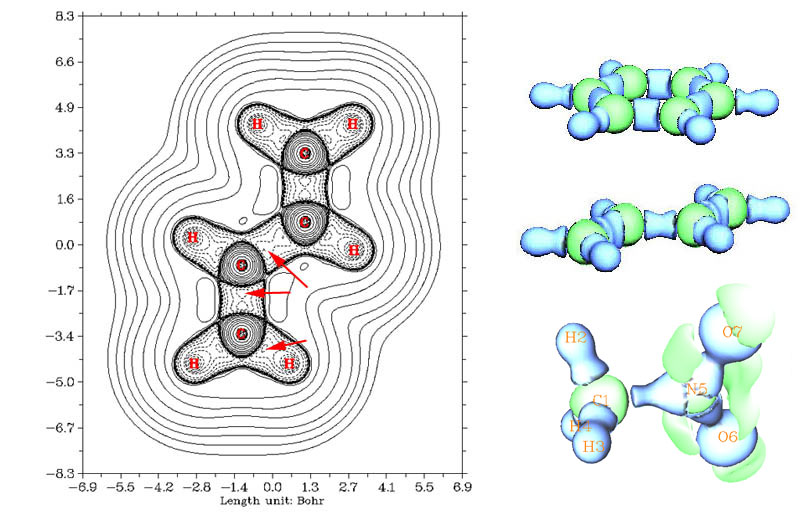

上图的右上是苯分子的拉普拉斯等值面图，这是由Multiwfn生成此属性的格点文件后直接显示出来的，蓝色为负值，绿色为正值。可见分子的整体轮廓被等值面勾勒了出来，成键区域处拉普拉斯值为负。原子由于具有壳层结构，在每个壳层之间都有拉普拉斯值数值为正的区域，C原子处显示的绿色球层就是这个区域。H是比较特殊的原子，仅有单个质子，其电荷与电子的束缚作用并不足以构成具有独立特征的区域，无法形成壳层结构，甚至可看成质子化的孤对电子，所以与成键区域连为一体而没有截面，对于ELF/LOL函数，氢原子也表现这样特征。

图的右侧中央是1,3丁二烯的拉普拉斯等值面图（这三幅图等值面并不一样，没有完全的可比性），众所周知中间的C-C键比两端的C-C键要弱，从图上也能看出这一点，两边的C-C呈椭圆形而中间的C-C键类似于柱形，这是因为两边的C-C键中的pi键更强所致。左图是此分子平面的等值线图，能更清楚地反映细节，箭头所示的是键之间的拉普拉斯值函数极大点所在区域（此处等值线为-1.19）。中间的C-C sigma键之间有两个成键极大点，两个成键极大点中间存在鞍点。两边的C-C键距离更近，成键极大点之间也更为接近，对于乙炔，C-C键更短，中间只有一个极大点。这与后文ELF/LOL函数的情况有所不同，ELF/LOL函数描述的sigma键总是只有一个极大点。

右下方的图是CH3NO2的拉普拉斯值为0.5的等值面图。由于N的电负性比C大很多，所以可以看到C-N键对应的电子密度聚集区域很大程度向N偏移。

用拉普拉斯值函数分析定域性问题的缺点是数值范围不确定，需要反复调整作图的数值范围，远没有ELF、LOL函数有确定的[0,1]区间那么方便。拉普拉斯值在原子内层区域数值波动极大，而且与价层区域不在一个数量级，做填色图的时候原子内层很不好看，做地形图时还必须将其数值在某处截断。虽然大部分能够用ELF、LOL分析的体系用拉普拉斯值函数也能分析出相似的结论，但是对具有定域性特征的区域分辨能力比ELF和LOL偏弱，有时不很明显，甚至几乎无法分辨，有文章指出拉普拉斯函数没法展现出价层主量子数很大的原子的壳层结构。拉普拉斯值函数难以凸显的特征都能用下面的ELF、LOL函数很好地表现。

## 3. ELF(Electron Localization Function，电子定域化函数)

ELF是个三维实空间函数，数值范围在0至1之间。简而言之，数值较高的ELF的等值面包围的区域，电子在里面定域性较强，不容易跑出去，相对地，电子能够容易地在这样的区域内随意运动（在此区域里随意离域）。在那些ELF数值较低的区域，电子定域性弱，即如果把电子放在那里，就很容易离域到其它区域去。能跑到以及容易跑到哪里，可直接通过考察费米穴的分布来衡量。

三维的ELF是对六维的费米穴函数简化而来的，使电子定域性、离域性更易于图形表现。弄清楚了如何通过费米穴衡量定域性、离域性，才能抓住ELF的最本质思想。Bader在这方面做了关键性的工作。详细讨论可参考《电子的定域性与相关穴》（<http://sobereva.com/94>），下面只是简单说说ELF的思想。

ρ_cond(r1,r2)称为条件电子对儿概率，代表已经知道有一个电子出现在r1处（称参考点），在r2处出现另一个相同自旋电子的概率，是电子对儿密度ρ(r1,r2)除以ρ(r1)的值。可以将之变换为ρ_cond(r,s)，称为球形平均电子对儿概率，代表令r为参考点，以其为中心在半径为s的球面上出现相同自旋电子的概率。将ρ_cond(r,s)对s做Taylor级数展开并截取第一个非零项就定义了D(r)函数，代表在r附近出现另一个自旋相同电子的概率，它在r处的值越小被认为r处电子定域性越强。D(r)的值一定大于等于0，为0时则表明完全定域。D(r)是三维函数，比六维函数ρ_cond(r1,r2)或四维函数ρ_cond(r,s)更易于考察。

D(r)的具体表达式为D(r)=1/2*∑[i]N(i)*|▽ψ_i(r)|^2 - |▽ρ(r)|^2/(8*ρ(r))，这里N(i)为第i条轨道轨道占据数，▽为梯度算符，ψ_i是第i条轨道波函数（后HF波函数时为自然轨道），ρ(r)是总电子密度函数。根据Savin等人对其的解释，其中1/2*∑[i]N(i)*|▽ψ_i(r)|^2是当前体系动能密度函数（也称G(r)或梯度动能密度），|▽ρ(r)|^2/(8*ρ(r))是Weizsacker泛函，表现了没有Pauli互斥时，如同玻色子体系的动能密度，因此D(r)本质上体现的是由于Pauli互斥造成的超额动能密度，也称Pauli动能密度，体系超额动能密度越低的区域定域程度越高。用D(r)描述电子定域情况有不妥之处，因为其数值越小代表越定域，这和观念相反，而且它的数值没有上限，观察时不便。所以Becke等人将之变换后定义了ELF函数，ELF(r)=1/(1+(D(r)/D_0(r))^2)，这样就把数值投影到了[0,1]区间，且数越大表明定域程度越高。这样将D(r)变换为ELF(r)的方式本身是任意的，并没有确定的物理含义。式中D_0(r)=3/10*(3*pi^2)^(2/3)*ρ(r)^(5/3)，是Thomas-Fermi均匀电子气动能泛函，是人为引入的参照标准，因此ELF本质上是对定域程度的相对度量而非绝对度量标准。

关于ELF的物理意义的更深入和详细的探讨，以及对于开壳层体系的正确形式，参见《电子定域化函数的含义与函数形式》的讨论（物理化学学报,27,2786-2792 (2011)）。

ELF函数的定义略有缺陷，当r趋近于无穷时，D(r)会渐进地接近0，所以在远离分子的位置ELF会等于1，成了完全定域的情况，这显然不对。但由于D_0(r)具有ρ(r)^(5/3)的行为，往往消失得更快，所以(D(r)/D_0(r))^2在远处一般为无穷大，故ELF在远处一般还是会等于0。然而有时D(r)比D_0(r)更早地接近0，此时ELF在分子外部区域还是会等于1。为了避免这种情况，可以在D(r)上加入极微小量，比如10^-5，这样可确保(D(r)/D_0(r))^2在电子密度已经很小的分子外部区域变得很大（因为D(r)至少有10^-5），故一定能令ELF(r)等于0，这只对分子内部区域ELF函数产生微不足道的影响。

从化学体系的ELF函数分布上可以清晰地看到原子壳层结构、孤对电子、化学键等特征。下图为Kr (cc-pVTZ)的从0到6波尔半径的ELF函数曲线，可见主量子数为1,2,3,4的四个壳层清晰可见，若只是考察总电子密度的变化则只能看到呈指数衰减的曲线，获得不了任何细节信息。如果以曲线各个极小点对应的球面此对空间进行划分，并分别积分其中的电子密度，就能得到每个壳层内的布居数，数值近似等于相同主量子数原子轨道上电子数的加和值，差异来自轨道隧穿效应，而在量化中近似等于轨道指数处在相应壳层范围内的基函数的布居数加和。

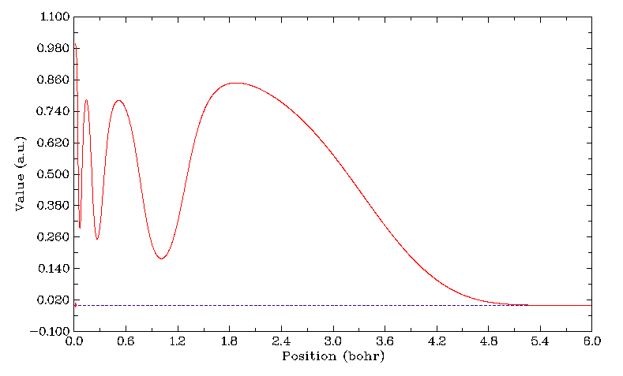

下图中间的图是吡嗪(C4H4N2)分子平面ELF函数的地形图+投影图，投影图部分单独拿出来就是填色图。可见C-N、C-C化学键、N的孤对电子（与C-H区域形状较像）都清楚地显示了出来。

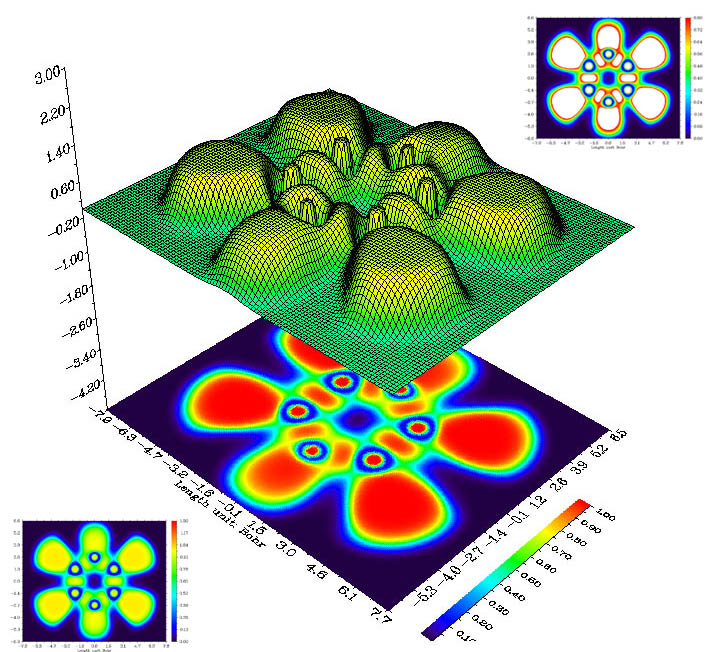

这里顺便说一下填色图的色彩刻度的设置问题。填色图就是根据每个点数值大小，用色彩刻度条上对应数值的颜色显示，最常用的色彩刻度从下限到上限是由蓝变绿再变红，类似彩虹。色彩刻度的上下限的设定是任意的，这会影响到图上格点的颜色，设置标准的关键是要清晰地反映数据的差异。此图将色彩刻度设为了0~1，这一方面是因为ELF函数数值在0~1范围内，但最主要是因为在0~1范围内填色图能比较清晰地反应各个定域化区域。左下角的图是将色彩刻度改为0~1.3的图，原本在红色区域（数值接近1）的位置都变成了黄色，成键区域与绿色区域不易区分，给人的感觉不够明显。右上角是将刻度设为0~0.8，那些超过0.8的数值通常就被自动设成了白色，这样0.8~1.0部分的数值变化就没法分辨了。所以上下限的设置应当比较接近数据集数值主体部分的上下限，这样就能充分利用各种颜色将不同数值区域的点分开。从经验上看，对于ELF函数的填色图适合用0~1的范围，但对于某些分子应进行适当调整，对于LOL函数用0~0.75比较好。

下图是HCN分子在Chemcraft下做的ELF函数等值面图，格点为80*80*150，由内往外的等值面分别为0.97、0.87、0.5。可以看出N的孤对电子以及H附近定域程度最高；随后是一个sigma键和两个pi键，在图中合在一起呈现环形等值面，尽管这看似与一般观念上sigma键和pi键的形状很不像，但实际上是等价的。继续降低等值面数值后pi键等值面范围扩大，成为血小板形状。

类似这样结合不同透明度、不同颜色、不同显示方式，可以同时在一张图里不受影响地表现多层等值面，表现丰富的信息。在Chemcraft里每绘制完一层点一下keep this surface，则已绘制的层会一直保留，不受之后操作的影响，调整设置后绘制新的层，反复如此就可以实现这样的效果。保存图像不宜直接截图，应当用file-save image保存，或者用View-draw export picture再截图，这样就会使用抗锯齿技术使边缘和线条平滑，尤其是用网格线表现等值面的时候效果会好很多。

对ELF函数也可以进行类似AIM的拓扑分析，是对AIM分析的推广，由此可以比图形化观察更细致地定性或定量对体系进行分析以得到更多信息。ELF拓扑分析也有ELF函数的极大点（也称点吸引子）、极小点、临界点、零通量面这样的概念。零通量面划分了盆，不仅包括AIM原子盆那样空间中的一团的形状，还有环形、球层等形状。此外还多了一些额外概念，环吸引子就是比如前面在HCN中看到的C-N三键的圆环，球吸引子就是例如Kr径向ELF函数曲线中每个极大点所对应的一层球面。f-localization domain是指ELF函数值为f的等值面包含的空间区域，域内各点数值都大于f，若只包含一个吸引子称之为不可约的，否则称为可约的，对于可约的定域性化域，当f逐渐加大并超过某一个值后就会分裂为多个包含更少吸引子的定域化域。对于HCN的例子，若将等值面数值进一步降低，三个彼此不相接触的不可约域就会扩张并连通成一个可约域。随f的加大，由最初包含整个分子的可约域最终分裂为各个不可约域的过程可以绘制成树状图。

这些概念对分析问题很有用处。按Bader的分类化学键可分为共享电子相互作用和闭壳层相互作用两大类，前者包括共价、金属键；后者包括离子键、氢键、二氢键、范德华键。Silvi和Savin在Nature 371 (1994) 683指出，对于前一类，在两个原子（氢原子除外）的键径总会出现至少一个用于成键的点吸引子或环吸引子（不参与成键时的孤对电子、内层电子的吸引子不算成键吸引子）；而对后一类不出现这样的情况。这样的规则与前述拉普拉斯值函数的情况很类似，本文各个例子也都验证了这一规则，这给成键的分类提供了明确依据，极大点的数值也可以评估键的强度。对共价键的盆空间内的电子密度进行积分能够用于了解有多少电子用于形成此键。比如Theor.Chem.Acc.108 (2002) 150~156文中就以两金属原子间是否存在ELF函数极大点判断它们是否有直接的共价键作用，并且根据积分Sc-Sc键的盆内电子数推断出除了3d以外，3s、3p也参与了成键。还有人系统地研究了原子电负性大小对某一f值的f-定域化域体积的影响，发现与VSEPR的假设比较吻合，并且指出键的盆布居数与相连的两原子电负性有相关性，键的极性越大，盆布居数越小于2，详见The Quantum Theory of Atoms in Molecules-From Solid State to DNA and Drug Design第六章的讨论。

Multiwfn可以对电子密度、ELF、LOL等各种各样的实空间函数进行拓扑分析和盆分析，见《使用Multiwfn做拓扑分析以及计算孤对电子角度》（<http://sobereva.com/108>）和《使用Multiwfn做电子密度、ELF、静电势、密度差等函数的盆分析》（<http://sobereva.com/179>）。

## 4. LOL (Localized orbital locator，定域化轨道定位函数)

Schmider和Becke在J.Mol.Struct.(Theo) 527 (2000) 51-61中定义了LOL函数γ(r)，γ(r)=t(r)/(1+t(r))，t(r)=D_0(r)/(1/2*∑[i]N_i*|▽ψ_i(r)|^2)。可见t(r)就是均匀电子气动能密度与当前实际体系动能密度的比值，某处动能密度相对于均匀电子气越小，γ越大，定域性越强。所以LOL和ELF引入D_0作为参考函数以获得相对值，是为了令体系各处动能密度的差异更显著地表现出来，否则结果很难考察。将t(r)变换为γ(r)则是为了使数值在[0,1]区间内。

LOL函数的本质也可以与轨道定域化方法进行比较来说明，t(r)具有轨道酉变换不变性，即是说用MO轨道或是定域化后的轨道其结果是一致的，因此这里假设轨道已经是定域化的。成键轨道波函数极大点的梯度为0，因而动能密度1/2*∑[i]N(i)*|▽ψ_i(r)|^2很小（由于定域轨道交叠很小，可把加和号去掉而只保留此成键轨道），导致t(r)很大，γ(r)接近于1，由于轨道波函数是平滑变化的，故轨道波函数极大点附近的数值也很大。而在轨道交叠处，轨道波函数梯度较大，致使t(r)分母较大，t(r)的值较小，所以γ(r)也很小。这就是为什么成键区域LOL的值较大，而在定域性强的区域相交处值较小。Burdett等人也在J.Phys.Chem.A 102 (1998) 6366-6372中从类似的轨道波函数的角度对ELF函数的意义进行了分析。

由于LOL与ELF本质上都是对动能密度函数不同形式的反映，所表现的信息是相仿佛的。实际上由于存在这样的关系：h_bar^2/(4*m)*▽^2*ρ(r)=2*G(r)+V(r)，V(r)为势能密度（总为负值），拉普拉斯值越小动能密度G(r)往往越小，所以拉普拉斯值函数的结论与LOL/ELF函数也很相似。用LOL能给出与ELF定性一致的结果，此文对ELF与LOL的讨论也是可以互相套用的。总体来说LOL给出的图形比ELF的图形更为明晰，更容易分析，而且函数形式更简单，也没有像ELF在远距离时数值可能成为1的情况。所以拉普拉斯值函数、ELF、LOL这三者中最推荐使用LOL进行分析。

下图是乙烯的LOL函数图，格点为120*120*80，用Chemcraft绘制，填色图颜色范围为-0.05~0.7，等值面为0.5。同时取了两个切面显示填色图，由于乙烯有pi键，所以在垂直于分子平面方向比平行于分子平面方向红色区域更大。结合蓝色小点表现的等值面更清楚地显示出pi键的空间形状，由于LOL值为0.5时正是体系动能密度等于相同密度下均匀电子气时的值，所以常用0.5的等值面来划分成键区域。Becke提出可以将0.5等值面以内的体积作为计算键级的依据。

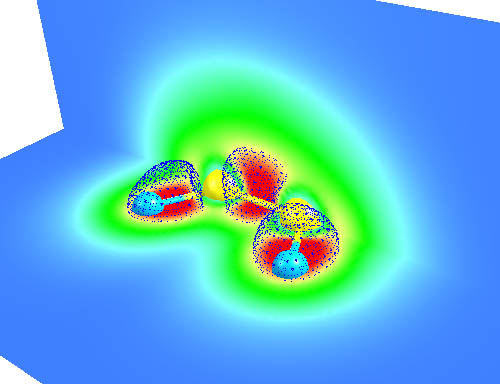

下图是ClO分子的LOL填色图，黑线代表LOL函数为0.51的等值线。上面是Cl下面是O。Cl的内部第一壳层（中心圆点）、第二壳层（黄圈）都明显地展现出来，并且它们并未参与成键而变形，表现了内层电子的惰性。分子中间成键区域，以及原子旁边的孤对电子也都清晰地显现了出来。

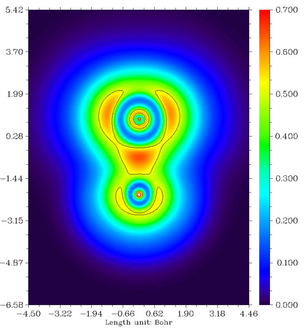

我们来看看F2分子、CH3F分子与LiF分子的LOL图，依次如下所示。

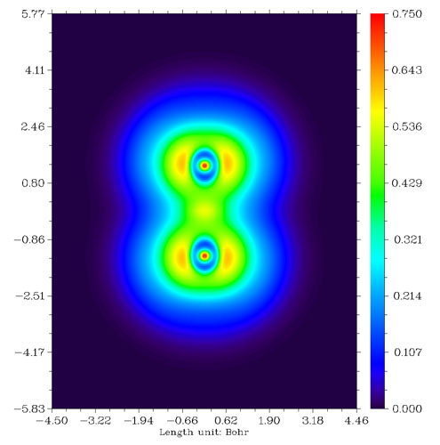  
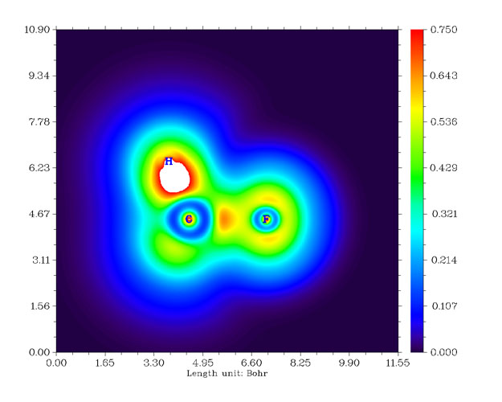  
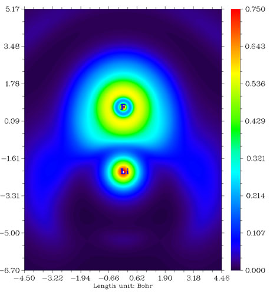

从F2的图上看，两个F之间高定域性区域很微弱，比起CH3F中的C-F键弱很多。这是由于F-F键本质上并不是共价键，而是典型的电荷转移键，详见Chem.Eur.J.,11,6358-6371的讨论。由这种键连接的原子之间并不会像普通共价键一样有明显的电子聚集，也不会有定域性较高的区域。电荷转移键比一般的共价键要弱，例如F-F的键能153KJ/mol明显小于C-H键的平均键能485KJ/mol。CH3F中的C-F键是典型的极性共价键，两原子间有一块定域型较高的区域。LiF是典型的离子键，电子几乎全被F吸走而形成满壳层的F-，F-附近LOL函数值分布基本接近球对称，只因为Li+的正电荷极化效果略有变形而已。由于二者之间主要靠静电力束缚而没有共价相互作用，故二者间没有出现LOL函数较大的区域。

上面的例子凭经验都能猜到原子间是如何成键的，然而对于新颖、复杂的情况，就必须借助ELF或LOL分析了，例如6个Li组成的团簇，凭经验难以分析，而通过LOL函数图（下图左侧）这个问题变得显而易见。从图中可见每个角上的Li与它相邻的两个边上的Li形成了很强的三中心键。而图中右上角的拉普拉斯值函数地形图并没有给予我们任何有用的关于成键的信息，各个Li之间拉普拉斯值几乎为零，所以用拉普拉斯值函数分析成键问题不如LOL。这实际上与Li之间电子密度太小有关，必须将拉普拉斯图的Z轴上下限设得非常小才能看出端倪，缺乏固定的数值范围令拉普拉斯值分析很不方便。图中右下角是这个体系的密度差图，红色和蓝色分别代表孤立原子形成体系后电子增加和减少的区域。由于此体系密度差数值非常小，为了表示清楚，色彩刻度的Z轴上下限已设得非常小，可见Li背后的电子在形成强三中心键的区域富集，而三个处在边上的Li之间电子没有发生富集。对这个体系进一步进行Mayer键级分析，发现处在边上的Li与相邻的处在角上的Li之间的键级为0.386898，而处在边上的Li与另一个处在边上的Li之间的键级为0.165081，从LOL图上可见，前一种成键方式跨越红色区域程度很大，而后一种情况跨越程度很小，这在一定程度上解释了Mayer键级的结果。这个问题还可以进一步与多中心键级分析结果相比较。

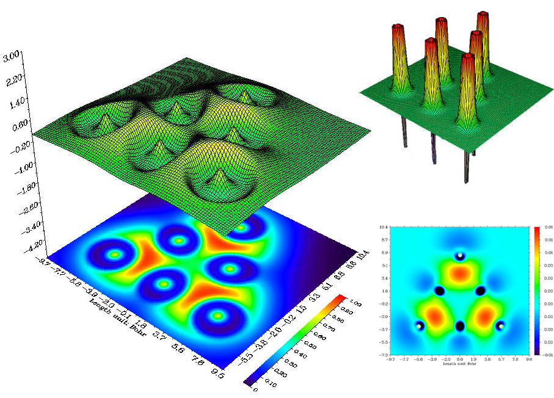

ELF/LOL不仅可以用于讨论分子的静态特征，还能用于研究化学反应过程，通过观察反应路径中成键区域和孤对电子的出现、消失、范围和形状的变化，可以得到很多重要的结论，限于笔者时间和精力不在此举例，十分建议阅读LOL函数原文中的几个例子，其中包括SN2反应、水分子解离、HCN异构化、1,3丁二烯环化反应。

计算上述函数所用波函数质量会对结果有所影响。不要使用极小基，这样的基组变分自由度太小，缺乏柔性，价层区域的实际情况难以正确描述。至少使用双分裂价+极化函数级别的基组，6-31G*是比较适合的，对于阴离子、弱相互作用、激发态体系需要加上弥散函数，这样才能较好描述距原子核较远处的信息。然而再大的基组没有必要，上述函数的空间分布不像能量等属性对基组那么敏感，6-31G*一般已经足够，试图加大基组对结果影响微乎甚微。对于大体系如果用6-31G*基组仍然困难，可以使用混合基组，只在感兴趣的区域用大基组。从计算方法看，使用后HF波函数显然最好，但考虑计算时间，通常使用DFT波函数就可以。是否使用含电子相关作用的方法计算波函数对分析上述函数一般不会有定性影响，HF波函数也是完全可以的。但如果要求分析的精度比较高，比如几种分子的上述函数差异很小，却需要从这微小的差别中分析它们的不同点，或者要求准确的定量数据，比如求函数极大点的位置和数值或者计算f定域化域的体积，则应当使用更高质量的波函数。

上述函数也可以用于配合物体系，这总要涉及到赝势。利用上述函数分析化学上感兴趣的区域并不需要全电子基组，使用赝势会虽然使得原子内部区域函数值为0，也因此不会显示壳层结构，但价层的行为是完全正确的，感兴趣的区域一般只与这部分相关，所以不必担心赝势会造成问题。选用的赝势应当包含亚价层电子，因为亚价层轨道会在一定程度上延展到价层区域。特别是有些分子，比如Li6Ca2[Mn2N6]的Mn的内层电子也涉及成键[Angew.Chem. 110 (2000) 1667]，或者分子处于电离态而使内层电子直接暴露，必须明确考虑亚价层的影响。如果必须要用全电子基组的话，也可以在几何优化的过程中使用赝势来节省时间。

## 5. 使用Multiwfn绘图简单实例

ELF/LOL函数的意义显著，分析方法容易掌握，适用性广泛，熟练运用可以使文章增光添彩，值得大力推广，也很值得作为黑箱方法纳入普通化学教材。当然ELF/LOL分析若要普及开来必须有方便的程序，Multiwfn正符合要求。下面是使用Multiwfn获得ClF3分子在分子平面内LOL函数填色图以及等值面图的具体步骤，操作一遍就会发现这十分容易。此例只是Multiwfn的最基本的应用之一，其它功能请参阅程序手册和《Multiwfn波函数分析程序的意义、功能与用途》（<http://sobereva.com/184>）。

Multiwfn需要利用.wfn或.fch文件中的波函数信息进行计算。首先用GaussView生成ClF3的输入文件，并在Route section部分写上out=wfn，在分子坐标末尾空一行写上.wfn文件输出的路径。也就是例如下面这样，用Gaussian执行之：  
=====================  
# B3LYP/6-31G* opt out=wfn  
   
Title Card Required  
   
0 1  
 Cl                 0.00000000    0.00000000   -0.32113636  
 F                 -1.57000000    0.00000000   -0.32113636  
 F                  0.00000000   -0.00000000    1.24886364  
 F                  1.57000000    0.00000000   -0.32113636

c:\ClF3.wfn  
[空行]  
[空行]  
=====================  
这样就得到了优化后的ClF3的波函数文件。先做填色图，启动Multiwfn，按照以下顺序依次输入，//后面是注释。  
c:\ClF3.wfn //输入文件名  
4 //选择绘制平面图  
10 //选择LOL函数  
1 //选择填色图  
按回车 //两个方向格点数，越大越精细。按回车代表用默认设定(200,200)  
3 //选择YZ平面  
0 //设定YZ平面是X=0的YZ平面，也就是分子平面  
立刻图像就显示出来了。然而图像对比度显得不高，成键区域特征区分得不是很清楚，这是因为默认的色彩刻度范围偏大所致，所以需要进行调节。在图上点击鼠标右键关闭图像，然后输入  
1 //设定色彩刻度范围  
0,0.7 //色彩刻度上下限为0,0.7  
-1 //重新显示图像  
结果如下图所示。

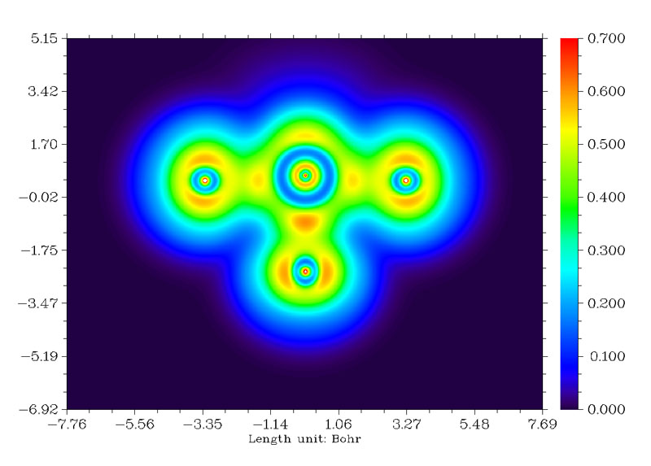

从图中可见，在赤道上的F（图中下方的F）与Cl的成键比轴向的两个F与Cl更强，有更显著的电子定域性区域。如果进行Mayer键级分析，会发现轴向的F与Cl的键级为0.7168，而赤道的F与Cl的键级为0.8367。另外，优化出的结构中轴向的F-Cl键长为1.7288埃，而赤道的F-Cl键长更短，为1.6517埃。都与LOL函数的结论十分吻合，即赤道的F-Cl键更强。  
在图像上点击右键来关闭图像，之后输入0可以将此图像保存到当前目录下的以DISLIN为前缀的.png图像文件中。

做等值面图需要先用Multiwfn计算格点文件，启动Multiwfn然后依次输入：  
c:\ClF3.wfn  
5 //计算格点文件  
10 //选择LOL函数  
2 //中等质量格点  
现在格点开始计算。计算速度取决于总格点数和高斯函数数目，数目越多计算越慢。Multiwfn计算ELF/LOL函数格点数据速度很快，远胜于Checkden、DGrid等程序。计算完毕后选-1可以预览等值面，将isovalue稍微调大至0.53，显示的图形如下图所示。从中能看到Cl的两个孤对电子。而F的孤对电子组成了环形等值面。

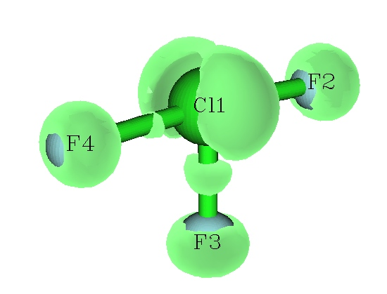

点击Return关闭窗口后，可以选2将格点数据保存为cube文件，之后可以用第三方可视化工具，如VMD、molekel、gview、chemcraft等工具观看等值面。
