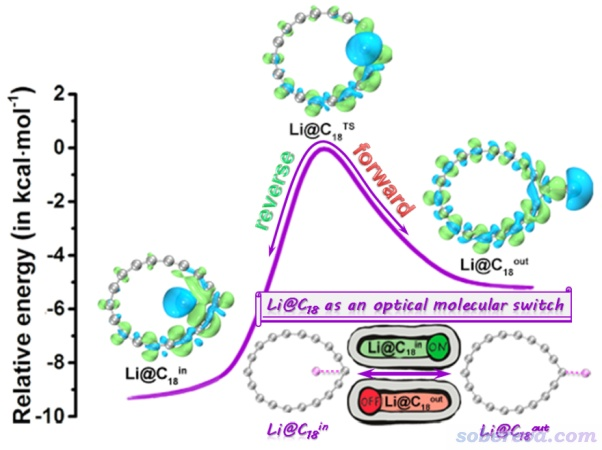
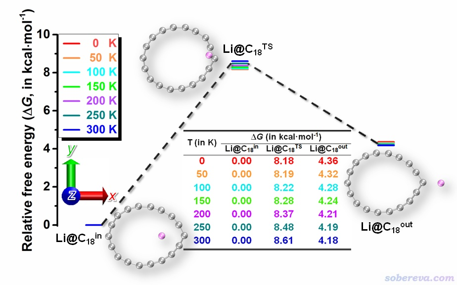
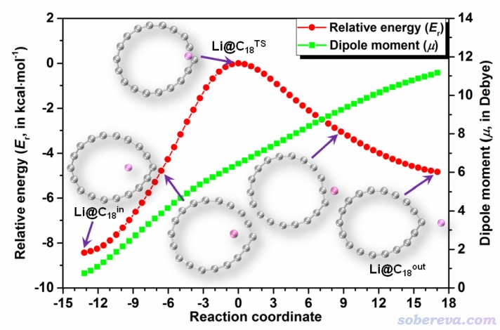
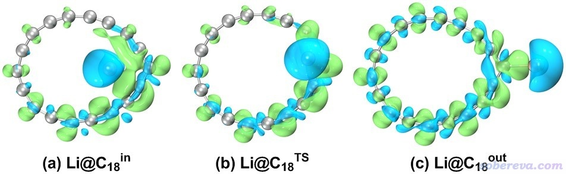
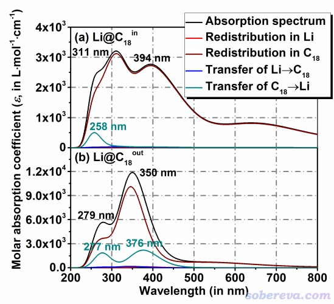
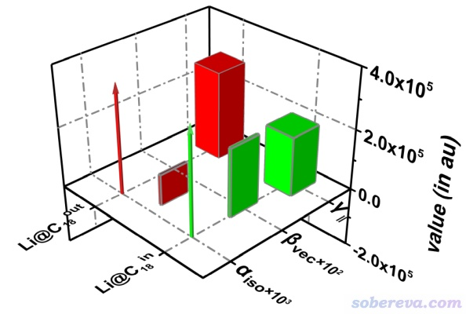
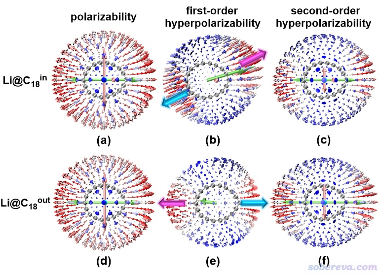
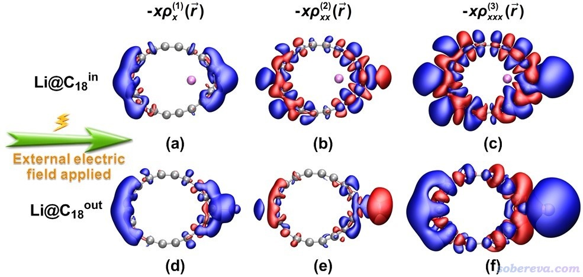
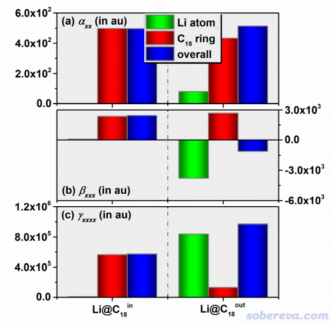

**理论设计由18碳环与锂原子构成的电场可控的光学开关**

Theoretical design of an electric field controllable optical switch composed of cyclo[18]carbon and a lithium atom

文/Sobereva@[北京科音](http://www.keinsci.com)  2022-Jan-2

## 1 前言

18碳环（cyclo[18]carbon）自从2019年在凝聚相中被实验观测到后，掀起了研究热潮。笔者通过量子化学和波函数分析方法对此体系和衍生物的各方面特性做了大量研究并发表了一系列工作，汇总见<http://sobereva.com/carbon_ring.html>。

近期，北京科音自然科学研究中心的卢天和江苏科技大学的刘泽玉等人在碳化学领域有重要影响力的期刊Carbon上发表了Potential optical molecular switch: Lithium@cyclo[18]carbon complex transforming between two stable configurations一文（Carbon, 187, 78-85 (2022)），可以在<https://doi.org/10.1016/j.carbon.2021.11.005>访问。这篇文章从理论角度上，将18碳环与锂原子相结合，设计了一个独特的光开关，可以通过外加电场切换开关的状态，即控制Li原子在18碳环内还是在碳环外，从而实现对Li@C18复合物体系的非线性光学性质的人为调控，示意图如下（文章的TOC）

下面，笔者将对此文章的主要内容进行深入浅出的介绍，并对其中涉及到的相关知识和计算细节做一些补充说明，便于读者更好地理解此工作的思想、研究方法和主要发现，从而能在此研究的基础上进一步拓展。论文中很多细节本文就不提了，请自行阅读文章原文和补充材料。

## 2 基于18碳环的光学开关的设计思想

在这一节先简要介绍一下研究背景和基于18碳环的光学开关的设计思想。

光学开关是指一种独特的分子设备，可以通过分子在不同构型间的切换来实现对其光学特征的改变。对小分子或团簇引入碱金属是构造分子开关的常用手段。另外，对已有物质掺杂碱金属或者超碱金属（即碱金属连着电负性很大的原子的原子团）是显著提升物质非线性光学(NLO)性质的常用策略，例如笔者的J. Comput. Chem., 38, 1574 (2017)中将Li3O、Na3O、K3O超碱金属引入Si12C12团簇上得到了第一超极化率(beta)依次升高的三种物质，其中K3O@Si12C12的beta甚至可达到20000 a.u.以上。

笔者在Carbon, 165, 461 (2020)以及《全面揭示各种尺寸的碳单环体系的独特的光学性质》（<http://sobereva.com/608>）一文介绍的Chem. Asian J., 16, 2267 (2021)的文章中对碳环类体系的NLO性质已经做了充分的研究，发现这类体系具有极强的光学吸收和显著的作为非线性光学材料的应用潜力。另外，在《全面探究18碳环独特的分子间相互作用与pi-pi堆积特征》（<http://sobereva.com/572>）介绍的Carbon, 171, 514 (2021)一文中还证明了18碳环具有较强的在环中心结合原子和小分子的能力。

基于以上信息，容易联想到将碱金属原子与18碳环复合，将可能得到具有很强NLO特征的物质。而且碱金属结合在环内和环外应该有不同的极小点结构，碱金属位置的不同可能对应NLO特性的明显的不同，因此可以试图通过切换碱金属的位置实现对NLO特征的操控，即构成光学开关。而光学开关的状态又该如何人为操纵？一个容易联想到的策略是外加电场。加外电场容易在现实中实现，而且碱金属在碳环内和环外的状态下偶极矩应当有极大的不同，与外电场的作用也因此会有极大的不同，故有理由认为外电场能够明显调节碱金属在环内和环外两种构型的相对能量，从而实现控制优势构型，或者说切换开关的状态。顺带一提，笔者之前已对18碳环体系如何受外电场的影响做了全面深入的研究，见《一篇文章深入揭示外电场对18碳环的超强调控作用》（<http://sobereva.com/570>）介绍的ChemPhysChem, 22, 386 (2021)一文，阅读此文对于认识电场对物质的影响很有好处。

在碱金属掺杂的非线性光学物质研究中锂原子用的非常普遍，本研究也选取了锂原子作为掺杂进18碳环的碱金属原子。经过一系列计算研究，构造Li@C18复合物光学开关的思路被证明确实可行。下面就对相关计算结果做具体的介绍。

## 3 Li@C18复合物的结构与能量

文中对Li@C18复合物做极小点和过渡态的结构优化以及振动分析是在ωB97XD/ma-TZVP级别下进行的。笔者在Carbon, 165, 468 (2020)中证实了ωB97XD泛函很适合研究18碳环，而且本身此泛函也整体比较稳健，因此用来优化Li@C18复合物是很适合的。ma-TZVP是在常用的高质量基组def2-TZVP基础上加了s和p角动量弥散函数的版本，见《给def2以ma-方式加弥散函数的Gaussian格式的基组定义文件（含所有def2支持的元素）》（<http://sobereva.com/509>）和《给ahlrichs的def2系列基组加弥散的方法》（<http://sobereva.com/340>）。这部分计算弥散函数不是非加不可，之所以此研究加上了，是考虑到电负性很小的Li会向18碳环明显转移电子，使18碳环部分带有一定整体负电荷，而且外加电场时会还在一定程度上令部分区域的电子偏离原子核变得更明显，加上弥散函数有助于描述这种情况的电子结构。

ωB97XD/ma-TZVP计算能量的精度还算可以，但在力所能及的情况下，尤其是对于18碳环这种电子结构比较特殊的较难算准的体系，算能量时应当用尽可能好的级别。如Carbon, 165, 468 (2020)所证明的，双杂化泛函算18碳环体系普遍不适合，而直接用CCSD(T)结合较好基组又算不动（更何况Li@C18还是开壳层的，在耗时方面严重雪上加霜），因此笔者使用DLPNO-CCSD(T)/cc-pVTZ来计算，并且为了保证较好精度用了tightPNO设置。DLPNO-CCSD(T)的简介见《详谈Multiwfn产生ORCA量子化学程序的输入文件的功能》（<http://sobereva.com/490>）。笔者后来还试过改成更大的cc-pVQZ基组算，发现结果没有明显改变，因此cc-pVTZ对当前研究足够了。之后，按照《使用Shermo结合量子化学程序方便地计算分子的各种热力学数据》（<http://sobereva.com/552>）中的做法，笔者用Shermo程序（<http://sobereva.com/soft/shermo>）基于DLPNO-CCSD(T)高精度单点能和ωB97XD做振动分析得到的信息，在Grimme的准RRHO热力学模型下，计算了不同温度时的复合物的气相高精度自由能。

优化后的Li在18碳环内的结构（Li@C18_in）、在碳环外的结构（Li@C18_out），以及两种结构间转换的过渡态，如下所示。在不同温度下计算的相对于Li@C18_in的自由能差都给出了。

由以上数据可见，Li在环外的时候自由能明显比在环内时要高。虽然只是高4 kcal/mol多一点，但是根据《根据Boltzmann分布计算分子不同构象所占比例》（<http://sobereva.com/165>）的做法计算常温下分布情况的话，Li@C18_out相对于Li@C18_in状态的出现比率可谓微乎其微。从自由能垒来看，[Li@C18_in→Li@C18_out](mailto:Li@C18_in→Li@C18_out)（正向）的能垒是8 kcal/mol多一点，而逆向的能垒是4 kcal/mol左右，都显著低于《谈谈如何通过势垒判断反应是否容易发生》（<http://sobereva.com/506>）一文提到的21 kcal/mol的常温下容易发生反应的判据，说明常温下两种Li@C18构型间的互变是相当容易的。文中通过《基于过渡态理论计算反应速率常数的Excel表格》（<http://sobereva.com/310>）中的做法基于自由能垒计算了正向和逆向的Li转移的速率，分别高达3.4*10^6 /s和3.7*10^9 /s。

本研究还对体系跑了IRC，此过程中电子能量变化和偶极矩变化如下所示。可见Li从环内到环外的转移过程是通过跨越碳环翻过碳原子来实现的。在这个过程中，偶极矩大小猛增。Li在环内时偶极矩接近0，而转移到环外时，偶极矩已经超过了11 Debye。Li在环外时体系的偶极矩如此之大，直接暗示出Li带明显正电，而碳环带明显负电，这和下一节的分析相一致。

正是由于Li@C18的两种构型下偶极矩差异巨大，外加电场才有可能显著影响两种构型间的相对能量。在ChemPhysChem, 22, 386 (2021)中我提到过外电场矢量F与分子的永久偶极矩矢量μ的相会作用会令能量改变-F▪μ。若在上图中从左到右水平方向加电场（基本平行于偶极矩），由于Li@C18_out比Li@C18_in的偶极矩大得多，电场越大会将导致Li@C18_out相对于Li@C18_in能量有越多的下降。此研究中在以这种方式施加一个中等大小的电场（0.0025 au，折合0.13 V/Å）的情况下计算了两个构型的自由能，此时Li@C18_out比Li@C18_in状态低5.9 kcal/mol，按照Boltzmann分布常温时Li在环外时的比率是在环内时的约20000倍。可见，适度的外电场，就可以让Li原本几乎都在环内的状态变成几乎都在环外的状态。如果环内和环外两个状态的NLO特性存在显著差异（见下面第6节），那么自然就证明Li@C18体系是个电场可控的光学开关了。

## 4 Li@C18复合物的电子结构特征

考察Li和C18的相互作用情况对了解Li@C18复合物的内在特征是很重要的。文中用Multiwfn程序按照《使用Multiwfn作电子密度差图》（<http://sobereva.com/113>）的做法计算了密度差格点数据，然后按照《在VMD里将cube文件瞬间绘制成效果极佳的等值面图的方法》（<http://sobereva.com/483>）将Multiwfn导出的cube文件在VMD里绘制成等值面图，如下所示。绿色和蓝色等值面分别对应Li和C18复合之后电子密度增加和减少的区域。由于Li明显被蓝色等值面所包围，说明无论是在什么构型下，Li都显著向C18转移了电子。

文中做了自然布居分析(NPA)，发现在上图的三个驻点结构下，Li的原子电荷都是将近1.0，体现出Li把它的仅有的一个2s价电子给了C18。文中还按照《谈谈自旋密度、自旋布居以及在Multiwfn中的绘制和计算》（<http://sobereva.com/353>）用Multiwfn基于Hirshfeld划分计算了自旋布居，Li的自旋布居近乎为0，这进一步体现出Li目前处于1s2的闭壳层组态了。因此，Li@C18中的Li其实明显不是Li原子状态，而是Li+离子，Li@C18实际上属于Li+ [C18]-盐的状态。这也是为什么如前所见，Li+在环外的时候偶极矩会远大于Li+在环内的情况，这是由于在前者的情况下正负电荷分离程度最大。文中还计算了Li和C18之间的Wiberg键级（即所有18个Li...C键级的总和），各种构型下结果都小于0.1，这体现出Li+和[C18]-之间共价相互作用基本可以忽略，二者的结合必然是静电相互作用所主导（但也会伴随着明显的极化作用）。

文中还计算了Li与C18的结合能，在环内和环外结合分别是-36.0和-29.4 kcal/mol。较大的数值说明二者之间的结合还是比较稳定的，至少是在忽略溶剂效应、自由能热校正的情况下。

## 5 Li@C18复合物的电子吸收光谱特征

此文在ωB97XD/ma-TZVP级别下做了TDDFT计算，然后使用Multiwfn程序按照《使用Multiwfn绘制红外、拉曼、UV-Vis、ECD、VCD和ROA光谱图》（<http://sobereva.com/224>）的做法绘制了UV-Vis光谱。另外，文中还按照《使用Multiwfn绘制电荷转移光谱(CTS)直观分析电子光谱内在特征》（<http://sobereva.com/628>）所介绍的方法绘制了Li@C18的电荷转移光谱(CTS)来将总UV-Vis吸收曲线分解为不同激发特征的贡献，从而能够从Li和C18这两个片段间的电荷转移角度洞悉UV-Vis光谱吸收峰是由什么形式的电子激发所导致的。UV-Vis谱和CTS曲线如下所示

由上图可见，Li@C18的两个构型在紫外区域都有明显的吸收，而只有当Li在C18内侧时，在可见光区域才有明显的吸收。这体现出当Li在碳环内外切换时，可能引发体系在有色和无色之间切换。另外，从上图中彩色的CTS曲线上可见，Li@C18_in的光学吸收基本都是C18部分自身的电子激发所致，但258 nm附近的吸收一定程度上来自于吸收光子时引发的C18向Li的电子转移。从上面的Li@C18_out的图中可以看到，其总的吸收曲线主要也来自于C18部分的局域激发，但在紫外吸收区域里它比Li@C18_in的情况在更大程度上展现出C18→Li的电子转移特征。上图还体现出Li自身原子轨道间的跃迁和Li→C18电子转移没有出现在计算出来的有光学活性的电子激发中，这也容易理解，因为Li上已经没有价电子了，没得转移（如果1s电子被激发则需要很高能量）。

## 6 Li@C18复合物的非线性光学特征

此研究使用ωB97XD结合LPol-ds（对碳）和d-aug-cc-pVTZ（对Li）基组通过Gaussian程序对Li@C18的两种构型计算了极化率(alpha)和NLO性质，后者包括第一超极化率(beta)和第二超极化率(gamma)。相关数据使用Multiwfn从Gaussian的polar=gamma关键词的输出文件中提取和进一步运算得到，详见《使用Multiwfn分析Gaussian的极化率、超极化率的输出》（<http://sobereva.com/231>）。之所以对碳用LPol-ds，是因为此基组是专门用来计算对电场的响应性质的基组，对于（超）极化率的计算从基组的角度来说可以达到很理想的精度，笔者在《谈谈量子化学中基组的选择》（<http://sobereva.com/336>）和《各种Sadlej基组的Gaussian格式的定义》（<http://sobereva.com/345>）中都说过这点。由于LPol-ds对Li没有定义，为了达到尽可能好的精度，对Li用了在cc-pVTZ基础上对每个角动量加上多达两层弥散函数的基组d-aug-cc-pVTZ。

静态外场下的极化率和NLO性质计算结果如下。alpha_iso、beta_vec和gamma_||的含义在文中的补充材料里和Multiwfn手册里都有说明。由数据可见Li在碳环的内、外对极化率影响甚微，但是对第一超极化率影响巨大，甚至影响了其符号。为什么符号会变，在文章的补充材料的S2节里通过电场对电子密度体积的影响角度做了清晰的解释，这种笔者独创的分析方式在《谈谈第一超极化率(beta)的符号的物理意义》（<http://sobereva.com/622>）里做了全面的阐述。注意C18由于是中心对称分子，其原本的beta精确为0。Li的引入对于C18的gamma_||也有显著影响，Li在碳环内和环外gamma_||分别是194117和292959 a.u.，分别是Carbon, 165, 461 (2020)中报道的C18孤立状态下数值的1.38和2.08倍。可见Li的引入显著提升了C18的NLO性能，而且对电场的响应程度还可以由外电场通过改变其构型来控制，因此Li@C18确实是个有效的、可控的光学开关。

文中还计算了常用的实验波长1340 nm下的Li@C18的动态（含频）alpha_iso、beta_vec和gamma_||，此时beta_vec和gamma_||的结果分别比静态外场时增加了15和54倍以上，显示出明显的共振效应。

在《使用Multiwfn通过单位球面表示法图形化考察（超）极化率张量》（<http://sobereva.com/547>）中介绍了Multiwfn中支持的单位球面表示法，这对于考察（超）极化率张量的各向异性特征极为有用，十分直观。此研究对Li@C18_in和Li@C18_out构型分别绘制了极化率、第一超极化率和第二超极化率的这种图，如下所示，它们可以展现出Li@C18对各个方向打来的电场会产生何种响应，详细讨论见本文介绍的Carbon原文。例如，如果按照下图(d)中的紫色（青色）大箭头标注的方向同时向体系施加两个外电场，那么就会导致在相同（相反）方向产生显著的诱导偶极；而如果电场是冲着图中蓝色很短的箭头方向施加的话，诱导偶极就会非常微弱。从这些图上能看出，总的来说，Li@C18的NLO响应只有平行于碳环的方向上才可能比较大，而且在顺着Li偏离碳环中心的方向相对更大。

如《使用Multiwfn计算（超）极化率密度》（<http://sobereva.com/305>）所介绍的，Multiwfn能够计算的（超）极化率密度对于展示和分析空间上不同区域对（超）极化率的贡献很有用处。因此，文章最后对Li@C18的两种构型绘制了极化率密度、第一超极化率密度和第二超极化率密度在下图所示外电场方向的分量，分别对应下图的1、2、3列

并且，此文还用Multiwfn计算了Li和C18部分对（超）极化率各自产生的定量贡献，如下所示

由以上两张图可见，Li在环内的时候，对（超）极化率贡献基本为0，而Li在环外时，则对超极化率产生了极为显著的贡献。这体现出Li@C18光学开关所处的状态不仅影响了体系的超极化率的大小，还能够明显决定其主要内在来源。

## 7 总结

本文对Carbon, 187, 78-85 (2022)一文的主要内容进行了解读，便于读者快速了解文章的主要思想和重要发现，同时对本研究中许多细节信息做了补充说明。本项理论研究展现了新颖独特的18碳环的衍生物作为非线性光学材料、电场可控的光学开关的重要潜力，希望其研究思想对读者们研究基于碳单环的非线性光学类物质有所启发。文章所用的研究手段也可以供读者在研究其它类型体系时借鉴，可以将此文作为范例引用。

此论文也展现了Multiwfn程序（<http://sobereva.com/multiwfn>）在光学性质研究上的关键性应用价值。充分掌握Multiwfn并灵活运用可以令这类问题的研究明显更深入透彻，使文章大为增光添彩。除本文涉及的方法外，Multiwfn在(非)线性光学研究方面还有很多其它用处，例如《使用Multiwfn基于完全态求和(SOS)方法计算极化率和超极化率》（<http://sobereva.com/232>）里提到的对外场频率做二维扫描考察共振效应、《使用Multiwfn计算与超瑞利散射(HRS)实验相关的量》（<http://sobereva.com/499>）里介绍的HRS相关分析、《使用Multiwfn对第一超极化率做双能级和三能级模型分析》（<http://sobereva.com/512>）里介绍的双/三能级分析，等等。
