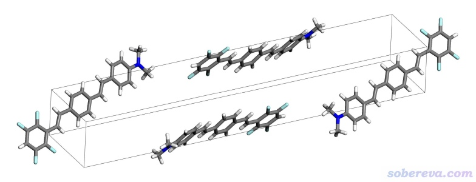
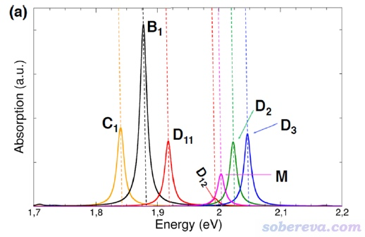
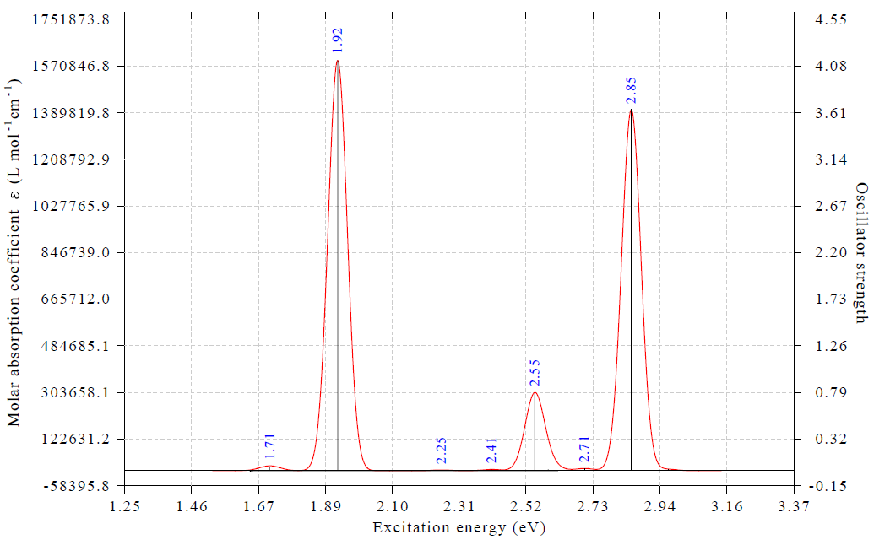
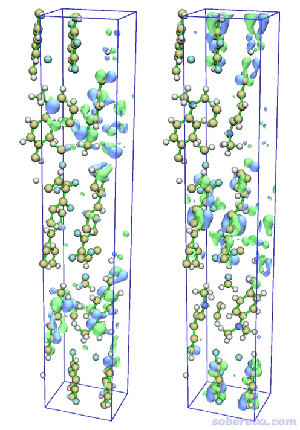
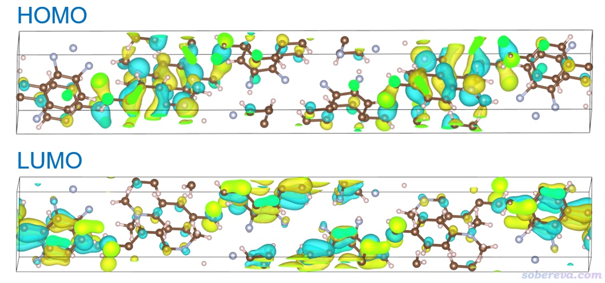
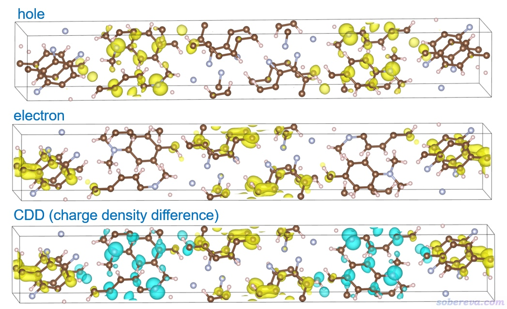
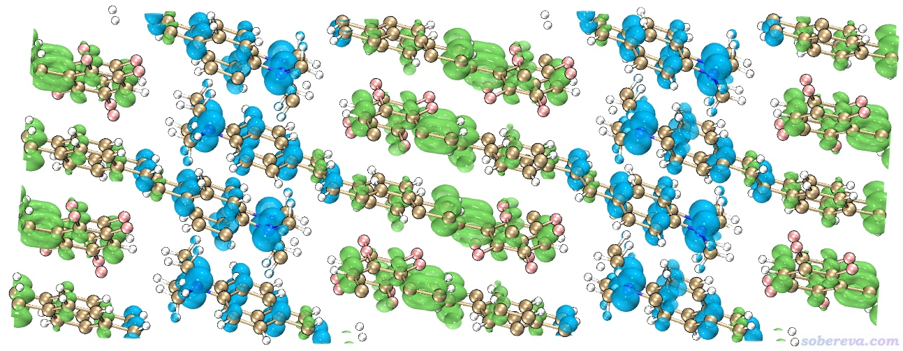
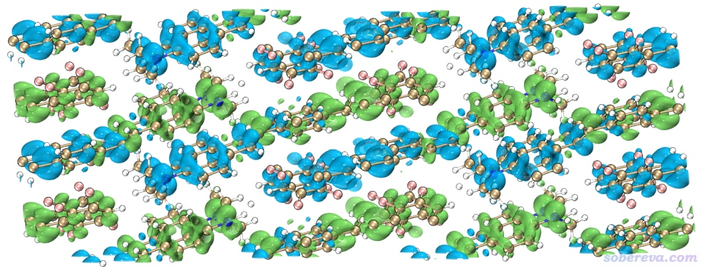
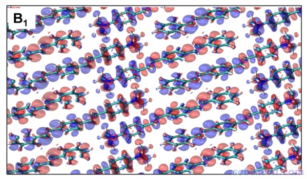

**使用CP2K结合Multiwfn对周期性体系模拟UV-Vis光谱和分析电子激发态**

Using CP2K combined with Multiwfn to simulate UV-Vis spectra and analyze electronic excited states for periodic systems

文/Sobereva@[北京科音](http://www.keinsci.com)

First release: 2022-Feb-28  Last update: 2023-Feb-10

## 0 前言

波函数分析程序Multiwfn（<http://sobereva.com/multiwfn>）有十分丰富的电子激发分析功能，已被量子化学研究者广为使用，在《Multiwfn支持的电子激发分析方法一览》（<http://sobereva.com/437>）有全面的功能介绍。而且Multiwfn还有灵活强大的绘制电子光谱的功能，见《使用Multiwfn绘制红外、拉曼、UV-Vis、ECD、VCD和ROA光谱图》（<http://sobereva.com/224>）。以往都是Gaussian、GAMESS-US、ORCA等量子化学程序用户在研究电子激发相关问题时使用Multiwfn的这些功能，而近期，Multiwfn的一些相关功能也已支持了CP2K第一性原理程序。免费、高效的CP2K算周期性大体系的TDDFT相当快。CP2K用户使用TDDFT计算分子或周期性体系的激发态后，可以非常方便地使用Multiwfn绘制UV-Vis谱和分析电子激发特征。而且Multiwfn具有非常方便的创建CP2K的TDDFT输入文件的功能，上手计算十分容易。本文的目的是通过一个典型的分子晶体例子，令读者了解使用Multiwfn和CP2K通过TDDFT研究周期性体系电子激发问题的基本做法，不少关键性的细节也一起说明，以便读者能举一反三，解决自己研究中的问题。

读者务必使用2023-Feb-10及以后更新的Multiwfn版本，否则和本文介绍的情况会有所不同。Multiwfn可以在官网<http://sobereva.com/multiwfn>免费下载，不了解Multiwfn者建议看《Multiwfn FAQ》（<http://sobereva.com/452>）和《Multiwfn入门tips》（<http://sobereva.com/167>），使用Multiwfn发表文章别忘了按照程序启动时的提示进行恰当引用。本文用的CP2K是9.1版，安装方法见《CP2K第一性原理程序在CentOS中的简易安装方法》（<http://sobereva.com/586>）。如果读者对TDDFT计算完全缺乏了解，建议阅读《Gaussian中用TDDFT计算激发态和吸收、荧光、磷光光谱的方法》（<http://sobereva.com/314>）和《乱谈激发态的计算方法》（<http://sobereva.com/265>）了解相关基本知识。

本文涉及的相关文件都可以在<http://sobereva.com/attach/634/file.rar>里得到。文件约20MB，如果下载慢请换个时段下。

本文对CP2K的电子激发计算部分仅仅做非常简要的描述，在笔者讲授的**北京科音CP2K第一性原理计算培训班**有专门的一节非常详细讲授CP2K做电子激发计算（也包括X光吸收），介绍见<http://www.keinsci.com/workshop/KFP_content.html>，非常欢迎了解和参加。

## 1 体系特征和一些计算细节

本文的例子是一个Donor-π-Acceptor型分子4-(N,N-dimethyl-amino)-4′-(2,3,5,6-tetrafluorostyryl)-stilbene构成的晶体，如下所示，晶胞里有4个分子，共192个原子。我们将要绘制它的UV-Vis谱，并对其中对应强吸收峰的电子激发分析其本质。此体系X光衍射得到的晶体结构是本文文件包里的bulk.cif。

这个体系实际上是ACS Omega, 3, 10481 (2018)一文中理论研究的体系，文中深入研究了这个分子晶体的J聚集导致吸收峰相对于单体分子红移的本质。作者用的是Quantum ESPRESSO做的TDDFT计算，而本例我们将用CP2K做TDDFT。

此晶体的原胞的三个边长分别是7.59、5.87、41.51埃。由于前两个晶胞尺寸较短，而CP2K的TDDFT计算时不能考虑k点，所以如果想更准确计算吸收光谱的话建议将体系复制成2*3*1的超胞。这是常见做法，J. Chem. Theory Comput., 17, 5214 (2021)在TDDFT计算分子晶体光谱时还特意对超胞尺寸做了结果的收敛性测试。搞成超胞自然会导致耗时剧增，由于本文只是示例目的，为了节约耗时，就只用原胞来算了。ACS Omega那篇文章里也是直接用的原胞来计算和分析。

由于X光衍射得到的晶体结构中的氢的位置一般都是不准的，《实验测定分子结构的方法以及将实验结构用于量子化学计算需要注意的问题》（<http://sobereva.com/569>）里也说过这个问题，因此电子激发计算前应当至少先对氢做优化，不过本文暂且忽略这个步骤，而自己实际研究中应当注意这个问题。

CP2K的TDDFT只支持TDA近似形式，也可以叫TDA-DFT，计算出的振子强度不如严格的TDDFT准确，但激发能的准确度并没打折扣。

ACS Omega原文里是基于PBE泛函做的TDDFT，我们也用这个泛函来做。众所周知，虽然纯泛函在第一性原理程序里计算比杂化泛函快得多得多，但有明显低估激发能的倾向（尤其是对于电荷转移激发），故读者实际研究时如果对激发能的准确性有要求，届时别忘了用PBE0等适合的杂化泛函来算，这在CP2K中也是支持的，而且能算不小的体系。没有CP2K里杂化泛函使用常识者必须看《CP2K做杂化泛函计算的关键要点和简单例子》（<http://sobereva.com/690>），免得犯低级错误。

CP2K 9.1 CP2K做TDDFT只支持GPW，即必须用赝势基组而不能用全电子基组（后记：从2022.1开始支持了GAPW的TDDFT，可以用全电子基组了）。对于TDDFT目的用TZVP-GTH赝势基组就不错，精度足够，而且也不很贵。再好一点还可以用TZV2P-GTH。用CP2K里常用的DZVP-MOLOPT-SR-GTH赝势基组算TDDFT时还能比TZVP-GTH更便宜一些，但是由于此基组收缩度太高，导致之后用Multiwfn做很多分析的时候在计算格点数据时会非常昂贵，所以本文用TZVP-GTH。

## 2 使用CP2K做TDDFT计算

用Multiwfn创建CP2K输入文件非常方便，在《使用Multiwfn非常便利地创建CP2K程序的输入文件》  
（<http://sobereva.com/587>）里有详细说明。

启动Multiwfn，然后输入  
bulk.cif  //在本文文件包里提供了  
cp2k  //产生CP2K输入文件  
bulk_TDDFT.inp  //将要生成的CP2K输入文件的文件名  
15  //开启激发态计算  
y  //让计算任务顺带输出记录分子轨道的molden文件  
30  //把最低30个空轨道算出来并存到molden文件里  
16  //设置激发态计算数目  
50  //算最低50个激发态  
2  //选择基组  
-3  //TZVP-GTH  
0  //生成输入文件

现在当前目录下就有了bulk_TDDFT.inp。输入文件默认的CUTOFF等设置对于当前计算来说都是适合的，所以不用做额外改动。直接用CP2K运行此文件，输出文件是本文文件包里的bulk_TDDFT.out。任务同时产生了molden文件bulk_TDDFT-MOS-1_0.molden。

如《详谈使用CP2K产生给Multiwfn用的molden格式的波函数文件》（<http://sobereva.com/651>）一文所述，CP2K直接产生的molden文件里不含晶胞信息，没法用于Multiwfn做分析，因此必须手动把晶胞信息填进去，做法在此文也明确说了。现在把以下内容插入到molden文件的第二行，本文文件包里的molden文件是我已经改好的。这部分内容大家直接从CP2K输入文件里的&CELL部分复制过去即可。

 [Cell]  
 7.59400000     0.00000000     0.00000000  
 0.00000000     5.87400000     0.00000000  
-3.11381184     0.00000000    41.39304623

下面说一些和当前的TDDFT计算有关的细节。

输入文件里的&PROPERTIES - &TDDFPT是TDDFT计算的相关设置，含义在Multiwfn自动产生的注释里都写明了。其中的MIN_AMPLITUDE 0.01代表组态系数的绝对值大于0.01的才会输出，这个数设得越小，之后Multiwfn做空穴-电子分析、跃迁密度分析、NTO分析等会越精确。要求较高的话建议改小到0.001，但由于输出的组态会更多，会令输出文件信息量更大，而且在Multiwfn的激发态分析过程中耗时也会高一些。如果只需要大概看个分析结果，用Multiwfn默认设的0.01就够了，至少结果是定性正确的。

之所以此任务要求产生记录了分子轨道的molden文件，是因为之后使用Multiwfn做许多电子激发分析都需要利用到分子轨道信息。这里只要求记录最低30个空轨道而非所有空轨道，并非是为了节约耗时（相对于激发态计算过程，算出所有空轨道并记录也不会增加多少耗时），而是因为记录所有空轨道的话molden文件可能非常大，对大体系甚至可能达到几GB，又占硬盘拷贝又慢。TDDFT计算中，每个激发态波函数都是由一大批组态函数线性组合来描述的，不同组态函数形式上对应于不同形式的轨道跃迁，每个组态函数对激发态波函数都各有各的贡献量，参看《电子激发任务中轨道跃迁贡献的计算》（<http://sobereva.com/230>）。我们当前算出来的激发态的组态函数的系数在CP2K输出文件里可以直接看到，如下所示。对于能量比较低的一批激发态，如果在电子激发分析时只考虑贡献不可完全忽略的组态函数（如组态系数绝对值大于0.01的），则这些组态函数只可能涉及到占据轨道向比较低阶空轨道的跃迁。对本文的例子，算最低30个空轨道基本足够了，如果想绝对稳妥的话建议算50个空轨道。一般来说，对越高阶激发态做空穴-电子分析，建议算越多的空轨道，因为越高阶激发态中涉及越高空轨道的组态函数越可能无法被忽略。后文还会再专门提到怎么准确检验算的空轨道数目是否确实够。

 -------------------------------------------------------------------------------  
 -                            Excitation analysis                              -  
 -------------------------------------------------------------------------------  
        State             Occupied              Virtual             Excitation  
        number             orbital              orbital             amplitude  
 -------------------------------------------------------------------------------  
             1   1.64779 eV  
                               296                  297              -0.902183  
                               294                  298               0.306244  
                               295                  299               0.275238  
                               293                  300              -0.124557  
                               296                  302              -0.013313  
                               294                  304               0.013288  
                               293                  303               0.013231  
                               295                  301              -0.012515  
...略  
            50   2.97063 eV  
                               295                  307              -0.629538  
                               294                  306              -0.596348  
                               293                  305              -0.350078  
                               296                  308              -0.348347  
                               296                  310              -0.036322  
                               294                  309               0.019915  
                               294                  303              -0.016826  
                               293                  304              -0.016232  
                               296                  301               0.015761  
                               295                  302               0.014885  
                               284                  297               0.013140  
                               283                  298               0.012456

算的激发态数目越多，计算耗时越高。当前的例子只计算了50个激发态，对于获得较完整的UV-Vis光谱来说并不够。从输出文件里以下部分可见，第50激发态的激发能是2.97 eV，折合417 nm，连可见光区都没覆盖完整。但考虑到纯泛函算的激发能整体明显偏低，如果用诸如PBE0算，可能最高能达到比如3.6 eV （344 nm）左右，届时可见光部分就都覆盖了。如果要把近紫外区也都算出来，需要算的态数建议翻倍。

         State    Excitation        Transition dipole (a.u.)        Oscillator  
         number   energy (eV)       x           y           z     strength (a.u.)  
         ------------------------------------------------------------------------  
 TDDFPT|      1       1.64779  -3.4173E-08  4.5488E-09 -1.0672E-08   5.25777E-17  
 TDDFPT|      2       1.66084  -1.4486E-08 -8.1846E-08  9.6347E-09   2.84886E-16  
 TDDFPT|      3       1.66146   8.5244E-08  3.6451E-02  5.0929E-08   5.40824E-05  
...略  
 TDDFPT|     49       2.96978   2.8362E-01 -9.3226E-07  2.7092E-01   1.11931E-02  
 TDDFPT|     50       2.97063  -6.2827E-06 -1.6851E-01 -3.5284E-05   2.06651E-03

从以上信息中也可以看到振子强度、跃迁偶极矩这些信息，和Gaussian等量子化学程序做TDDFT给出的信息形式非常类似。

## 3 绘制电子光谱

用Multiwfn绘制电子光谱功能的全面介绍、各种细节以及相关的基本原理请读者看《使用Multiwfn绘制红外、拉曼、UV-Vis、ECD、VCD和ROA光谱图》（<http://sobereva.com/224>），这里仅画个很简单的图。多数UV-Vis谱横坐标用的是nm，但在前述的ACS Omega文章里研究这个晶体的光谱时横坐标用的是eV，如下所示。其中黑线是和我们计算模型一致的bulk状态的吸收曲线，我们试图重现一下。图中M、D、C分别是作者自行基于晶体结构构造的分子单体、二聚体、链状排列时的吸收曲线，这不是我们本例关心的。

启动Multiwfn然后载入bulk_TDDFT.out，之后输入  
11  //绘制光谱  
3  //UV-Vis  
10  //修改横坐标单位  
1  //eV  
8  //设置峰展宽用的半高全宽（FWHM）  
0.07 eV  //和ACS Omega文章里用的一致。顺带一提，Multiwfn默认用的FWHM比这个大得多，一般适合溶液的吸收光谱。算晶体的话可以设小一些  
16  //设置显示光谱极大极小点的标签  
1  //设置标签状态  
1  //把曲线的极大点数值显示出来  
3  //设置标签上的小数位数  
2  //两位小数  
0  //返回  
0  //作图

现在看到的图如下所示（注：笔者为了光谱曲线更平滑，此处先选择-4把导出格式设为了pdf，然后选了1导出pdf文件，下图实际上是pdf的截图，这比直接在屏幕上显示的光滑得多，且可以无损缩放）。读者也可以自行再用Multiwfn界面上的选项修改横、纵坐标范围和标签间隔，使得坐标轴的标签更整齐。

由于我们算了50个激发态，比文献里算的更多，因此上面的光谱差不多把3 eV激发能以内的电子激发对应的吸收都算出来了。上图中红色曲线是吸收光谱，对应左边坐标轴，蓝色标签标注的是吸收峰的位置。由图可见，在1.71 eV处有个很弱的吸收峰（振子强度0.04），而在1.92 eV处的吸收巨强，振子强度超过4（具体是4.13）。这和ACS Omega文章中的谱图的特征非常吻合。那篇文章补充材料中的表S1里，正好在1.71 eV处也有个激发，振子强度仅为0.08，而在1.887 eV处有个振子强度7.96的贼强的激发。我们算的电子激发能和文献里相符极好，但振子强度比文献里的小了将近一倍，这主要是由于CP2K用了TDA近似所致。不过由于不同的峰的相对高度受TDA的影响远小于绝对高度受其影响，而我们一般只关心曲线形状，所以基于CP2K的TDDFT算的光谱是可以用的。

想搞清楚各个吸收峰对应哪个电子激发很简单。在Multiwfn当前的绘制光谱的界面里选-1，就能把激发态序号、不同单位的激发能以及振子强度都直接显示出来，如下所示。上面的谱图里黑色竖线横坐标位置是激发能，竖线高度对应右边坐标轴，是振子强度，和以下信息一对照便知各个峰对应什么激发态。显然，1.71 eV的极弱吸收对应的是第8激发态（S8），1.92 eV的极强吸收对应的是第13激发态（S13）。接下来我们要着重对S13这个重要的电子激发做一些分析，看看它对应的本质为何。

Index  Excit.energy(eV       nm        1000 cm^-1)       Oscil.str.  
   1         1.64779      752.42719       13.29032        0.00000  
   2         1.66084      746.51502       13.39558        0.00000  
   3         1.66146      746.23644       13.40058        0.00005  
   4         1.67536      740.04512       13.51269        0.00471  
   5         1.70466      727.32510       13.74901        0.00153  
   6         1.70527      727.06492       13.75393        0.00000  
   7         1.70540      727.00950       13.75498        0.00000  
   8         1.70974      725.16406       13.78998        0.03991  
   9         1.73479      714.69284       13.99203        0.00786  
  10         1.74660      709.86030       14.08728        0.00000  
  11         1.75022      708.39209       14.11648        0.00025  
  12         1.75461      706.61970       14.15189        0.00000  
  13         1.92496      644.08715       15.52585        4.13484  
  14         2.15741      574.69002       17.40069        0.00000  
...略

## 4 考察主要的分子轨道跃迁

特别常见的分析电子激发的方式是看激发中哪些分子轨道的跃迁对激发有主要贡献，然后去看轨道图形考察。计算贡献的方法在《电子激发任务中轨道跃迁贡献的计算》（<http://sobereva.com/230>）中专门说了，并且如《使用Multiwfn便利地查看所有激发态中的主要轨道跃迁贡献》（<http://sobereva.com/529>）所述，利用Multiwfn还可以极其便利地一键得到所有电子激发中的各种轨道跃迁贡献，这里就对当前体系用一下。

启动Multiwfn，载入bulk_TDDFT.out，之后输入  
18  //电子激发分析  
15  //显示所有激发态中的分子轨道跃迁情况  
马上看到以下内容

 #   1   1.6478 eV    752.43 nm   f=  0.00000   Spin multiplicity= 1:  
   H -> L 81.4%, H-2 -> L+1 9.4%, H-1 -> L+2 7.6%  
 #   2   1.6608 eV    746.52 nm   f=  0.00000   Spin multiplicity= 1:  
   H -> L+1 75.2%, H-2 -> L 21.1%  
...略  
 #  12   1.7546 eV    706.62 nm   f=  0.00000   Spin multiplicity= 1:  
   H-3 -> L+3 61.6%, H-1 -> L+2 21.2%, H-2 -> L+1 14.5%  
 #  13   1.9250 eV    644.09 nm   f=  4.13484   Spin multiplicity= 1:  
   H-2 -> L+2 30.3%, H -> L+3 25.6%, H-3 -> L 20.2%, H-1 -> L+1 17.6%  
...略

可见基态S0到S13的激发同时由多个轨道跃迁所明显贡献，HOMO-2 -> LUMO+2贡献了30.3%、HOMO -> LUMO+3贡献了25.6%、HOMO-3 -> LUMO贡献了20.2%、HOMO-1 -> LUMO+1贡献了17.6%。像这种情况就极度不适合通过观看分子轨道来分析，因为得同时看一大堆轨道，极其麻烦。这种情况最理想的分析方法就是用Multiwfn独家的空穴-电子（hole-electron）分析，对于任何激发都能转化为“空穴”到“电子”的跃迁，分析时只需要看这两个函数的分布即可，在下一节我们将做这种分析。

由以上信息可见S0到S1的激发倒是有主导性的分子轨道跃迁，即HOMO -> LUMO贡献达到81.4 %，此时看这一对轨道的特征就能大致判断电子激发情况。这里不妨就看一下HOMO和LUMO的分布是什么样的。关于Multiwfn显示分子轨道在《使用Multiwfn观看分子轨道》（<http://sobereva.com/269>）有详细介绍。

启动Multiwfn，载入bulk_TDDFT-MOS-1_0.molden。注意屏幕上显示了如下的晶胞信息：  
Cell angles:  Alpha=  90.0000  Beta=  94.3020  Gamma=  90.0000 degree  
可见当前晶胞不是正交的，这种情况下Multiwfn在计算格点数据后直接显示的等值面不完全正确，需要用Multiwfn导出格点数据后通过VMD或VESTA来显示等值面。不过，由于此例的Beta角偏离90度也不太大，因此直接用Multiwfn观看等值面也勉强可以。

进入主功能0，此时文本窗口显示了HOMO-LUMO gap等轨道相关信息。在图形界面里点击右侧Show Labels关闭原子标签、点击Show axis关闭坐标轴。选择菜单栏Other settings - Toggle showing cell frame关闭盒子边框。选择菜单栏Isosur. quality - Good quality。然后在界面右下角的文本框里输入h然后按回车，代表显示HOMO。之后把右下角的Isovalue（等值面数值）改成一个合适的值0.026。此时看到的HOMO等值面图如下图左侧所示。然后在右下角列表里点击297切换到LUMO轨道，图像如下图右侧所示。

由对比可见，HOMO和LUMO主体分布于不同分子上，因此S0-S1是分子间电荷转移激发。关于电子激发类型介绍看《图解电子激发的分类》（<http://sobereva.com/284>）。

下面我们让Multiwfn导出HOMO和LUMO的格点数据，从而之后能放到专门的可视化程序里观看得到更好的效果。点当前图形窗口右上角的RETURN按钮返回主菜单，然后输入

200 //主功能200  
3  //计算并导出轨道波函数的格点文件  
h  //HOMO  
9  //根据晶胞设置格点数据的盒子原点、边长和格点间距  
[回车]  //用(0,0,0)作为原点  
[回车]  //格点数据的盒子的三个矢量和当前晶胞相同  
[回车]  //用默认的0.25 Bohr格点间距（为了降低耗时也可以设大一些，如0.4）

然后当前目录下就出现了h.cub。将之拖入VESTA，直接就看到了下图，效果不错。对LUMO也这么干。

## 5 空穴-电子分析

下面做空穴-电子分析。此方法的原理、细节、大量用于分子体系的实例在《使用Multiwfn做空穴-电子分析全面考察电子激发特征》（<http://sobereva.com/434>）都给出了，没读过的话务必一读，也请按照此文所述恰当引用相关文章。

启动Multiwfn，载入bulk_TDDFT-MOS-1_0.molden，然后输入  
18 //电子激发分析  
1  //空穴-电子分析  
bulk_TDDFT.out  //CP2K输出文件  
13  //分析第13激发态(S13)，也就是那个吸收极强的激发态

注意此时屏幕上会看到提示Involved highest unoccupied orbital:   324 (HOMO+    28)，即这个激发态涉及到的组态函数里（即由于系数绝对值>0.001因而被输出到CP2K输出文件里的）最高牵扯到的空轨道是第28个空轨道。前面说了，我们当前的TDDFT计算让CP2K把最低30个空轨道信息写入了molden文件，比28更大，所以记录的空轨道数是够多的。如果记录的数目小于这里的28，则对这个激发态做的空穴-电子分析可能不准确。每次做空穴-电子分析的时候建议留意一下这里的信息，如果发现存入molden文件里的空轨道数不够多，应该把CP2K输入文件里ADDED_MOS后面的值改大，然后重算一次单点任务得到新的molden文件，基于它和之前的TDDFT任务的输出文件做空穴-电子分析。

接着输入  
1  //可视化空穴、电子、跃迁密度等函数  
9  //根据晶胞设置格点数据的盒子原点、边长和格点间距  
[回车]  //用(0,0,0)作为原点  
[回车]  //格点数据的盒子的三个矢量和当前晶胞相同  
[回车]  //用默认的0.25 Bohr格点间距（为了降低耗时也可以设大一些，如0.4）

在笔者的8核i7-10870H笔记本上两分钟算完，然后出现了后处理菜单。虽然用此处的选项在Multiwfn里也能直接显示空穴、电子等函数的等值面，但由于盒子不是正交的，所以还是先导出格点数据再用VMD、VESTA等程序来显示。在空穴-电子分析框架里有很多定量指数和函数可以考察电子激发特征，这一节我们就考察空穴、电子以及密度差（charge density difference，当前语境下对应于电子减去空穴），因此在后处理菜单中依次选择选项10、11、15导出它们的格点数据分别成为hole.cub、electron.cub、CDD.cub。它们在本文的文件包里也提供了。

把这三个cub文件分别拖到VESTA里显示。等值面数值用0.001（Properties里选Isosurfaces标签页，点击当前仅有的项，把Isosurface level设为0.001），在Objects - Volumetric Data里取消选择Show Sections，即不显示截面，然后得到的图如下所示。

由图可见，S0-S13激发也是个典型的电荷转移激发，因为空穴和电子分布在明显不同的分子上。从CDD图上考察甚至更方便，只需一张图就展现出了电子是怎么转移的，青色和黄色分别是电子激发时电子减少和增加的地方。

如果用VMD来显示等值面，还可以直接在显示的时候把周期镜像显示出来，由于此时能看到完整分子，明显更加容易观察，如下所示

这里具体说一下用VMD怎么作上面的图。在《在VMD里将cube文件瞬间绘制成效果极佳的等值面图的方法》（<http://sobereva.com/483>）中专门给了一个脚本用来十分快捷地显示效果理想的等值面图，先使用这个脚本把CDD.cub的0.001等值面显示出来。然后在Graphics - Representation里把显示分子结构的那个Representation（以下简写为Rep）删掉，对于分别显示CDD的正值和负值等值面的那两个Rep，在Periodic标签页里都把-X和+Y都选上，这样等值面就在X负方向和Y正方向各复制了一次，看上去像超胞的情况。之所以这里没有把当前分子结构也这么操作来显示相邻的镜像，是因为这么做之后跨盒子的键是显示不了的，看起来略别扭。为了得到与当前等值面相对应的超胞结构文件，下面使用《Multiwfn中非常实用的几何操作和坐标变换功能介绍》（<http://sobereva.com/610>）文中介绍的做法。在Multiwfn载入bulk_TDDFT-MOS-1_0.molden后输入  
300  //主功能300  
7  //对结构进行操作  
19  //对体系进行平移复制  
-1  //在第一个方向负方向复制一次  
2  //在第二个方向正方向复制为原先两倍  
1  //在第三个方向保持不变  
-2  //把当前结构导出为pdb文件  
supercell.pdb  
现在当前目录下就有了supercell.pdb。将之拖到已显示出CDD等值面的VMD图形窗口里，把其显示方式设为CPK，即得到上图。

## 6 跃迁密度分析

前述的ACS Omega文章里通过所谓的induced charge density分布考察了分子晶体中不同分子在激发时的激子耦合对激发能的影响。实际上induced charge density就是《使用Multiwfn绘制跃迁密度矩阵和电荷转移矩阵考察电子激发特征》（<http://sobereva.com/436>）中笔者介绍的跃迁密度（transition density），文中的这类图都可以用Multiwfn精确重复出来。这里我们也画一下。

之前Multiwfn做完空穴-电子分析进入后处理菜单后，可以看到选项13是用来导出跃迁密度的cub文件的，选择它，在当前目录下就出现了transdens.cub，在本文的文件包里也提供了。按照上一节的方式对它绘制等值面图，等值面数值为±0.0005的情况如下所示

读者若仔细将上图和ACS Omega文中图2里的体相的induced charge density（下图）相对比，会发现是完全一样的，说明了计算的合理性。

至于怎么讨论激子耦合本文就不详述了，读者可自行参看ACS Omega文中的讨论，以及Multiwfn手册4.A.9节中的计算激子耦合的介绍。

## 7 NTO分析

NTO（自然跃迁轨道）分析是很流行的激发态分析方法，在《使用Multiwfn做自然跃迁轨道(NTO)分析》（<http://sobereva.com/377>）里有专门介绍和例子，本文就不再累述了。这个分析在Multiwfn中现在也可以用于周期性体系，这里我们就做一下。值得一提的是，CP2K自身也有NTO分析功能，但笔者发现很难用，一次只能对一个激发态输出NTO轨道波函数，而且产生的非占据NTO轨道还明显异常，因此很不推荐用CP2K自己的NTO功能，至少对目前的版本来说。

启动Multiwfn，载入bulk_TDDFT-MOS-1_0.molden，然后输入   
18 //电子激发分析  
6  //NTO分析  
bulk_TDDFT.out  //CP2K输出文件  
13  //考察S0-S13激发

立刻就在屏幕上给出了本征值最大的10个NTO对的本征值：

The highest 10 eigenvalues of NTO pairs:  
   0.311175    0.270759    0.215496    0.195281    0.000291  
   0.000248    0.000180    0.000177    0.000000    0.000000  
Sum of all eigenvalues:  0.993608

由数据可见，NTO方法对当前这个电子激发表现极差！在本文第4节我们看到，对这个激发贡献最大的四对MO跃迁贡献分别是30.3%、25.6%、20.2%、17.6%，而在变换成NTO跃迁描述之后，依然还是有四对贡献很大的跃迁，分别是31.1%、27.1%、21.5%、19.5%，比起原先的描述根本就没什么改进。所以NTO分析在很多情况下是失败、无用的，而空穴-电子分析则比NTO普适得多，对于任何情况都能很理想地使用。所以若无特殊情况（比如非要得到轨道相位信息等），不建议用NTO而应当用空穴-电子分析。虽然NTO对于分子体系多半情况表现得还行，但我发现对于周期性体系大多时候NTO派不上什么用处，即没法将电子激发充分简化描述成一对NTO跃迁所主导的情况。

虽然此例NTO分析没用，但作为演示，还是看看NTO轨道。在Multiwfn里选择3，再输入S13_NTO.mwfn，在当前目录下就出现了此文件。然后重新启动Multiwfn，载入S13_NTO.mwfn，进入主功能0，然后在图形窗口顶端的菜单中选择Orbital info. - Show up to LUMO+10，此时在文本窗口可看到

...略  
Orb:   292 Ene(au/eV):     0.000291       0.0079 Occ: 2.000000 Type:A+B (?   )  
Orb:   293 Ene(au/eV):     0.195281       5.3139 Occ: 2.000000 Type:A+B (?   )  
Orb:   294 Ene(au/eV):     0.215496       5.8639 Occ: 2.000000 Type:A+B (?   )  
Orb:   295 Ene(au/eV):     0.270759       7.3677 Occ: 2.000000 Type:A+B (?   )  
Orb:   296 Ene(au/eV):     0.311175       8.4675 Occ: 2.000000 Type:A+B (?   )  
Orb:   297 Ene(au/eV):     0.311175       8.4675 Occ: 0.000000 Type:A+B (?   )  
Orb:   298 Ene(au/eV):     0.270759       7.3677 Occ: 0.000000 Type:A+B (?   )  
Orb:   299 Ene(au/eV):     0.215496       5.8639 Occ: 0.000000 Type:A+B (?   )  
Orb:   300 Ene(au/eV):     0.195281       5.3139 Occ: 0.000000 Type:A+B (?   )  
Orb:   301 Ene(au/eV):     0.000291       0.0079 Occ: 0.000000 Type:A+B (?   )  
...略

这里以a.u.为单位的能量对应的是NTO本征值。可见占据和非占据NTO是配对的。比如296和297号轨道构成一个对电子激发贡献31.1%的NTO对，其中296和297分别是占据和非占据的NTO。轨道图形请读者效仿前面第四节自行观看，笔者就不多说了。

## 8 总结

本文介绍了如何将Multiwfn与CP2K相结合，绘制电子光谱，并对电子激发特征进行分析。可见二者结合使用，使得研究周期性体系的电子激发相关问题相当容易和便利，比起常见的Gaussian+Multiwfn的组合研究分子体系的电子激发并没有额外的复杂性。希望读者在本文的基础上举一反三，使用CP2K+Multiwfn研究更多类型的周期性体系的电子激发。

Multiwfn的电子激发分析分析功能非常多，远远不限于以上所述的几种。但这些方法中目前只有部分明确支持周期性体系，有些分析在原理或程序上不支持周期性，而有些可能能支持但尚未做测试。明确支持周期性的分析在Multiwfn手册2.9.2.2节说了。以后Multiwfn在周期性分析方面还会不断做扩展和完善，使得更多方法完美兼容周期性体系。如有疑问欢迎在程序启动时提示的Multiwfn论坛上发帖咨询。
