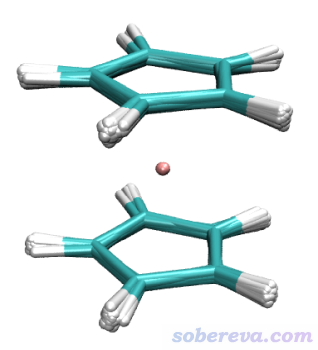

**使用Sobtop超级方便地创建二茂铁的GROMACS的拓扑文件**

Using Sobtop to create GROMACS topology file for ferrocene super conveniently

文/Sobereva@[北京科音](http://www.keinsci.com)   2022-Feb-17

## 0 前言

Sobtop是笔者开发的主要用于产生各种类型体系的GROMACS拓扑文件的程序，可以在主页<http://sobereva.com/soft/Sobtop>免费下载。过渡金属配合物体系的拓扑文件在以往是很难产生的一类情况，因为里面牵扯到GAFF、OPLS-AA、GROMOS等主流有机分子力场不支持的元素，里面涉及到的键/键角/二面角参数在那些力场里也没有，所以acpype、Ligpargen、ATB等程序根本没法搞。而这类体系，用Sobtop则可以超级容易地产生拓扑文件。AmberTools里的MCPB.py程序虽然能产生这类体系的拓扑文件，但是过程麻烦至极，在<http://bbs.keinsci.com/thread-27796-1-1.html>里有人演示了怎么借助MCPB.py产生二茂铁的GROMACS的拓扑文件，估计大多数人看了后会打退堂鼓。Sobtop的详情以后会另文专门系统性地介绍，本文仅简单演示一下怎么用Sobtop快捷地产生二茂铁的拓扑文件，通过对比大家可以充分认识到用Sobtop有多么方便。

本文牵扯到的所有输入输出文件都可以在<http://sobereva.com/attach/635/file.rar>里找到。Sobtop用的是2022-Feb-16发布的预览版1.0(dev)。Multiwfn用的是2022-Feb-17更新的版本，Multiwfn可以在主页<http://sobereva.com/multiwfn>免费下载。

## 1 用Gaussian做优化和振动分析

首先用Gaussian对二茂铁做优化和振动分析。要注意，二茂铁的两个茂环间仅在低温晶体中是交错式的，而在真空中极小点结构是重叠式的（参看Materials, 8, 7723 (2015)和<https://en.wikipedia.org/wiki/Ferrocene#Determining_the_structure>中的相关信息），因此本例用重叠式（D5h点群）的初始结构。记得Gaussian计算前最好用GaussView做对称化，这样优化得又精准速度又快。

关于计算级别，本例用的TPSSh/def2-TZVP级别对于过渡金属配合物体系通常是很理想的选择。关于泛函的选择看《简谈量子化学计算中DFT泛函的选择》（<http://sobereva.com/272>）。如果想明显更便宜，Fe可以用SDD，配体可以用6-311G*。

此例的Gaussian输入文件如下

%chk=Ferrocene.chk  
 #p tpssh/def2tzvp opt freq  
 [空行]  
 Generated by Multiwfn  
 [空行]  
 0 1  
  C                  0.71056100   -0.97800331    1.65426528  
  C                 -0.00000000    1.20887857    1.65426528  
  C                 -0.71056100   -0.97800331    1.65426528  
  H                  2.17848562    0.70783289    1.62195576  
  H                 -2.17848562    0.70783289    1.62195576  
  Fe                 0.00000000    0.00000000   -0.00000000  
  C                  1.14971184    0.37356402    1.65426528  
  C                 -1.14971184    0.37356402    1.65426528  
  H                  1.34637816   -1.85313055    1.62195576  
  H                 -0.00000000    2.29059533    1.62195576  
  H                 -1.34637816   -1.85313055    1.62195576  
  C                  1.14971184    0.37356402   -1.65426528  
  C                 -1.14971184    0.37356402   -1.65426528  
  C                  0.71056100   -0.97800331   -1.65426528  
  C                  0.00000000    1.20887857   -1.65426528  
  C                 -0.71056100   -0.97800331   -1.65426528  
  H                  2.17848562    0.70783289   -1.62195576  
  H                 -2.17848562    0.70783289   -1.62195576  
  H                  1.34637816   -1.85313055   -1.62195576  
  H                  0.00000000    2.29059533   -1.62195576  
  H                 -1.34637816   -1.85313055   -1.62195576  
 [空行]  
 [空行]

算完了之后，用formchk把当前目录下的Ferrocene.chk转换为Ferrocene.fchk。不知道formchk是什么和怎么用的话看《详谈Multiwfn支持的输入文件类型、产生方法以及相互转换》（<http://sobereva.com/379>）里相关部分。

还需要得到二茂铁的mol2文件，并且要求其中记录的键连关系和期望的一致，这决定了Sobtop给出的拓扑文件里都有哪些力场项。很多程序都可以实现这个，此例我们用常用的GaussView打开Ferrocene.fchk，如果看到Fe和各个C之间没显示键的话就手动连上（设几重键都无所谓，Sobtop只看有没有键）。然后保存为Ferrocene.mol2。

## 2 计算RESP电荷

RESP电荷很适合用于动力学模拟的目的，我们要让拓扑文件里的原子电荷对应RESP电荷。计算RESP电荷非常强大、方便、灵活的程序是Multiwfn，见《RESP拟合静电势电荷的原理以及在Multiwfn中的计算》（<http://sobereva.com/441>）。要注意对二茂铁体系不宜直接按照常规方式算RESP电荷，因为拟合点的分布不会恰好满足D5h对称性，因此得到的等价原子的原子电荷会有微小的偏差。为了让所有等价的原子的电荷都严格相同，在Multiwfn中计算RESP电荷时应当设置等价性。

启动Multiwfn，然后输入  
Ferrocene.fchk  
7  //计算原子电荷  
18  //计算RESP电荷  
5  //等价性约束设置  
11  //根据点群自动判断等价性  
a  //根据整个体系的结构判断点群  
y  //当前屏幕上显示的点群确实是D5h，列出的原子等价性没错，所以这里输入y确认。然后当前目录下有了等价性设置文件eqvcons_PG.txt  
q  //返回  
1  //从文本文件里读取等价性设置  
eqvcons_PG.txt  //刚才产生的文件  
2  //开始一步式RESP电荷拟合  
[回车]  //程序提示Fe缺半径，按回车表示用推荐的半径  
Multiwfn算RESP电荷效率很高，RESP电荷很快就产生了，从屏幕上给出的结果看确实原子电荷合理，而且满足等价性。按y把产生的原子电荷导出为当前目录下的Ferrocene.chg。

## 3 用Sobtop产生拓扑文件

启动Sobtop，然后依次输入  
Ferrocene.mol2  
7  //指定原子电荷  
10  //从Multiwfn的chg文件中读取原子电荷  
Ferrocene.chg  
0  //返回  
2  //产生GROMACS的.gro文件  
[回车]  //此时当前目录下产生了Ferrocene.gro  
1  //产生GROMACS的拓扑文件  
2  //优先用GAFF原子类型，缺的自动用UFF力场的。原子类型决定了拓扑文件里的LJ参数  
2  //所有成键相关参数基于振动分析产生的fchk文件里的Hessian矩阵生成  
Ferrocene.fchk  //如果此文件和Ferrocene.mol2在相同目录下，此处直接按回车可以快捷载入  
[回车]  //在当前目录下产生Ferrocene.top  
[回车]  //在当前目录下产生Ferrocene.itp

现在拓扑文件在当前目录下出现了，Sobtop可以关了。现在可以打开itp文件看看内容，会看到没有任何问题，文件整齐干净，注释也特别清楚。

## 4 测试拓扑文件合理性

产生拓扑文件之后，我一般建议在真空下对这个体系跑一下动力学，根据模拟过程中结构变化情况大致判断拓扑文件是否合理。做这个模拟要用的Ferrocene.gro、Ferrocene.top、Ferrocene.itp前面我们都已经产生了。做这个模拟用的md.mdp在本文的文件包里也给了，可见是控温在298.15K下模拟100 ps，1 fs一步，每100 fs往xtc里写入一帧，没有用PBC。笔者此例用的是GROMACS 2018.8。这个mdp不兼容GROMACS较新版本，较新版本用户需要在一个足够大的空盒子里在考虑PBC的情况下跑NVT模拟。

把前述的gro、itp、top、mdp都放到当前目录下，运行以下命令  
gmx grompp -f md.mdp -c Ferrocene.gro -p Ferrocene.top -o md.tpr  
gmx mdrun -v -deffnm md

然后用VMD载入轨迹，用Extensions - Analysis - RMSD Trajectory Tool工具对system选区做align消除平动转动后，每10帧叠加显示一次，得到下图

可见模拟过程中二茂铁很好地维持了刚性，说明拓扑文件合理。

## 5 总结&其它

本例充分体现了使用Sobtop结合Multiwfn程序产生过渡金属配合物体系拓扑文件的便利，把复杂度降低到了极限。此文只以极为简单的体系做了示例，对更复杂的情况，诸如多核金属配合物、除了刚性部分还带有可旋转键的柔性部分的配合物，Sobtop也都能很容易地产生拓扑文件。凡是体系全为刚性的情况都可以直接效仿本文的做法；对于既有刚性配位区域也有柔性基团的配合物，在Sobtop问你怎么产生成成键相关(bonded)参数时，建议选择相应选项，让bond和angle参数用特定方法基于Hessian产生，而其它的用预置力场参数，这样可以使得GAFF的参数用于描述柔性部分二面角可旋转特征。

实际中二茂铁的茂环的旋转势垒是非常低的，常温下是可以旋转的，但本文得到拓扑文件对应的是纯刚性二茂铁。本文暂不考虑茂环间可相对旋转的问题，这也不是什么重要问题。

本文的做法比起MCPB.py实在方便百倍，而且MCPB.py用的Seminario方法产生力常数也不如本文的方法合理（当前版本Sobtop默认用的是modified Seminario，产生的键角力常数远好于Seminario）。

做优化和振动分析用免费的ORCA亦可，文中用fchk的地方改成用ORCA振动分析产生的.hess文件即可。

对于体系没有对称性的情况，算RESP电荷时不需要本文这样做对称等价设置，直接在Multiwfn的RESP界面里选择1用常规的两步式拟合即可。更多细节看《RESP拟合静电势电荷的原理以及在Multiwfn中的计算》（<http://sobereva.com/441>）。

本文的例子直接从chg文件中载入了RESP电荷。也可以在Sobtop里先不设置电荷，等itp产生出来之后再手动把要用的电荷写入到[ atoms ]部分。

使用Sobtop产生拓扑文件发表文章时记得按照Sobtop主页<http://sobereva.com/soft/Sobtop>的说明进行引用。引用方式在未来会有所变化，请记得发文章之前看一下主页上最新的引用说明。
