**使用CP2K结合Multiwfn绘制密度差图、平面平均密度差曲线和电荷位移曲线**

Use CP2K combined with Multiwfn to plot density difference maps, plane averaged density difference curves and charge displacement curves

文/Sobereva@[北京科音](http://www.keinsci.com)

First release: 2022-Mar-10  Last update: 2024-Jun-18

## 1 前言

电子密度差（electron density difference, EDD）是分析成键、电子转移非常常用的手段。波函数分析程序Multiwfn（<http://sobereva.com/multiwfn>）在绘制和分析密度差方面非常灵活、方便、强大，笔者之前有不少文章与此相关，见《使用Multiwfn作电子密度差图》（<http://sobereva.com/113>）、《使用Multiwfn考察分子轨道、NBO等轨道对密度差、福井函数的贡献》（<http://sobereva.com/502>）、《使用Multiwfn计算激发态之间的密度差》（<http://sobereva.com/429>）、《使用Multiwfn做电子密度、ELF、静电势、密度差等函数的盆分析》（<http://sobereva.com/179>）等。之前笔者写的密度差有关的文章主要是对于孤立体系写的，本文的目的之一是介绍怎么将非常流行、免费强大的CP2K第一性原理程序与Multiwfn相结合，对周期性体系绘制密度差图。在此顺带特别强调，electron density difference的中文是密度差，“差分密度”是对密度差的严重不当称呼，绝对不要用这个词！

本文另一个目的是介绍怎么通过Multiwfn绘制平面平均密度差（plane-averaged EDD）曲线，它是密度差的衍生。密度差是个三维空间函数，经常通过绘制平面图、等值面图方式图形化考察。虽然这两种图很直观，但平面图会受到截面选取的影响，而等值面图会受到等值面数值（isovalue）选取的影响，因此都有一定任意性，也不容易定量讨论。对于电子转移有比较明确方向的情况，可以绘制平面平均密度差曲线，由此可以清楚地考察垂直于选取的方向上每个截面上的密度差积分值，在定量讨论、对比上比较便利。例如，固体表面上吸附一个小分子，吸附导致垂直于表面方向有明显的电子转移，就可以在垂直于表面的方向上绘制平面平均密度差曲线来准确、细致地考察不同截面处的电子净增、减情况。还有一种图叫做电荷位移曲线（charge displacement curve），它相当于平面平均密度差曲线的积分曲线，对于定量讨论电荷转移量情况很有帮助，本文也会介绍怎么通过Multiwfn绘制这种图。

本文使用的例子是NaCl板吸附一个CO分子，NaCl和CO将被定义为两个片段，通过密度差考察吸附导致的电子转移情况。本文文件包里的opt目录下的NaCl_CO-1.restart是CP2K在PBE-D3(BJ)/DZVP-MOLOPT-SR-GTH级别下对这个体系做优化产生的restart文件，我们将基于这个结构绘制密度差。为简化问题，在优化的时候整个NaCl板的坐标被冻结为了晶体坐标的状态，因此不涉及表面重构。

下文涉及到的相关文件可以在<http://sobereva.com/attach/638/file.rar>下载。cub文件由于体积太大，文件包里就不提供了。

本文的计算使用CP2K 9.1，安装方法见《CP2K第一性原理程序在CentOS中的简易安装方法》（<http://sobereva.com/586>）。VMD使用的是1.9.3版，可在<http://www.ks.uiuc.edu/Research/vmd/>免费下载。读者务必使用Multiwfn最新版，如果不知道是不是最新的就现在立刻去主页<http://sobereva.com/multiwfn>下载一个。如果对Multiwfn不了解，看《Multiwfn FAQ》（<http://sobereva.com/452>）和《Multiwfn入门tips》（<http://sobereva.com/167>）。不了解cub文件的话可以看看《Gaussian型cube文件简介及读、写方法和简单应用》（<http://sobereva.com/125>）。

笔者假定读者已经具备了CP2K基本的使用知识，如果不熟悉CP2K的话，非常推荐参加**北京科音CP2K第一性原理计算培训班（**[**http://www.keinsci.com/workshop/KFP_content.html**](http://www.keinsci.com/workshop/KFP_content.html)**）**完整、系统、深入学一遍第一性原理计算和CP2K程序。

## 2 计算密度差格点数据

这一节我们要得到整个体系、NaCl板和CO的各自的电子密度的cub文件，然后由Multiwfn求差。

我们先创建一个计算整个体系的电子密度cub文件的CP2K输入文件。启动Multiwfn，然后输入  
NaCl_CO-1.restart  //在本文文件包里  
cp2k  //创建CP2K输入文件。在《使用Multiwfn非常便利地创建CP2K程序的输入文件》（<http://sobereva.com/587>）一文里有详述  
NaCl_CO.inp  //产生的输入文件的路径

现在进入了创建CP2K输入文件的界面。为了之后绘制的平面平均密度差曲线比较好观看，最好把当前体系挪到盒子中央附近。先看一眼当前的结构是什么样，输入  
-11  //进入几何操作界面。此界面的详细介绍见《Multiwfn中非常实用的几何操作和坐标变换功能介绍》（<http://sobereva.com/610>）  
0  //观看当前结构

现在出现了图形窗口。点击菜单上的Other settings - Toggle showing cell frame把盒子边框显示出来，再选Other settings - Toggle showing all boundary atoms把边界原子显示出来。现在看到的图如下

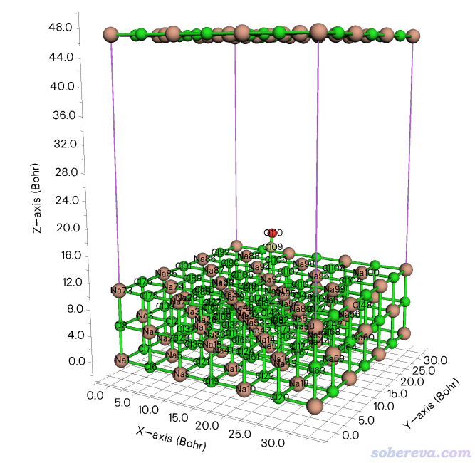

可见当前整个体系在盒子底部，NaCl有三层，由于最下层的原子正好在Z=0的位置，因此这些边界原子在盒子顶端也显示了出来。点击右上角的RETURN按钮返回。为了把体系挪到盒子中央去，输入  
24  //平移体系使得选中的部分在晶胞中居中  
1-110  //当前体系里所有原子。也可以直接按回车选中整个体系  
0  //再次观看体系  
可见此时体系确实在盒子中央了

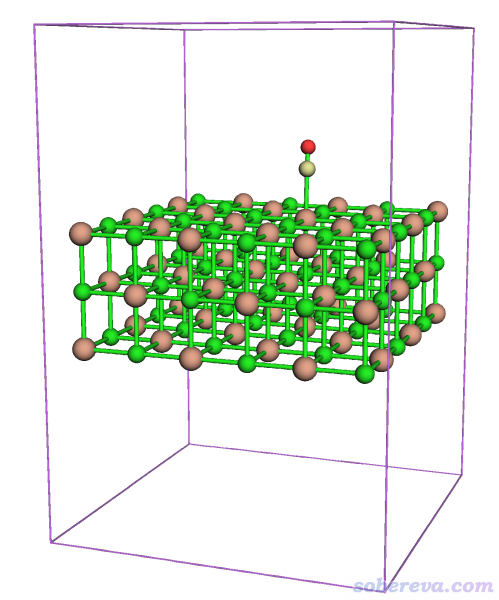

关闭图形窗口，接着输入  
-10  //返回CP2K输入文件创建界面  
-7  //设置周期性  
XY  //XY方向二维周期性  
-3  //要求产生cube文件  
1  //电子密度  
0  //产生CP2K输入文件

现在当前目录下就有了NaCl_CO.inp。读者可根据要求修改里面的CUTOFF等设置，本例不那么讲究，就用默认的。运行之，算完后当前目录下就有了NaCl_CO-ELECTRON_DENSITY-1_0.cube，将之改名为NaCl_CO.cub。

将NaCl_CO.inp复制为NaCl.inp，用文本编辑器打开，把其中PROJECT NaCl_CO改为PROJECT NaCl，把&COORD里面C和O原子删掉。用CP2K运行NaCl.inp，将得到的cub文件改名为NaCl.cub。

将NaCl_CO.inp复制为CO.inp，用文本编辑器打开，把PROJECT NaCl_CO改为PROJECT CO，把&COORD里面Na和Cl原子删掉。用CP2K运行CO.inp，将得到的cub文件改名为CO.cub。

现在用Multiwfn对三个cub文件求差。启动Multiwfn，然后输入  
NaCl_CO.cub  //输入此文件实际路径  
13  //处理格点数据  
11  //格点数据运算  
4  //减去另一个格点数据  
NaCl.cub  //输入此文件实际路径  
11  //格点数据运算  
4  //减去另一个格点数据  
CO.cub  //输入此文件实际路径

现在内存里的格点数据就已经是密度差格点数据了。想观看一下等值面的话，可以进入选项-2 Visualize isosurface of present grid data。由于物理吸附对应的密度差的数量级往往很小，所以要用比较小的等值面数值才能清楚看到。在图形窗口右侧把等值面数值设为0.0005后，看到的图像如下（点save picture按钮保存的图像比直接在图形窗口里看到的更好）

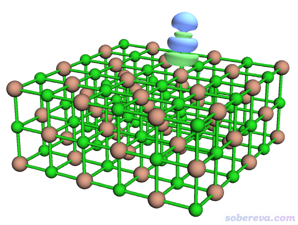

绿色和蓝色等值面分别代表格点数据数值为正和为负的部分。当前密度差是按照ρ(NaCl...CO)-ρ(NaCl)-ρ(CO)算的，显然绿色体现吸附后电子密度增加的部分，蓝色体现电子密度减少的部分。点击右上角RETURN关闭图形窗口。

若想得到密度差的cub文件，就选0 Export present grid data to Gaussian-type cube file (.cub)，输入EDD.cub，然后内存里的格点数据就被导出为了当前目录下的EDD.cub。

使用《在VMD里将cube文件瞬间绘制成效果极佳的等值面图的方法》（<http://sobereva.com/483>）里提供的我写的脚本，在VMD程序里只需要输入一行命令cub EDD 0.0004，就可以把EDD.cub的0.0004等值面显示出来（如果没显示出来，一个字一个字看<http://sobereva.com/483>这篇文章）。在文本窗口里输入pbc box把盒子显示出来，再改成正交视角，经过Tachyon渲染看到的就是下面的图。图中蓝色小球是Na，棕色是Cl，等值面的蓝色和绿色和前面Multiwfn里的定义相同。

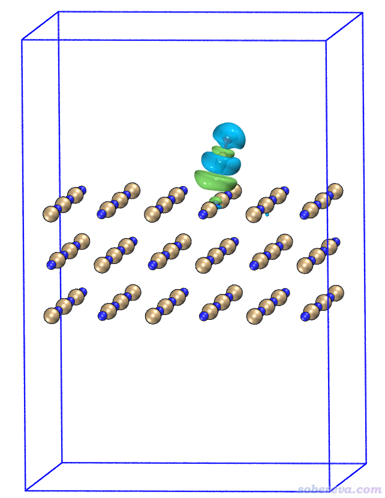

从此图可以明显看出，CO的碳结合到Na上后，C和O上的电子密度整体大幅减少，很大程度往Na的方向上转移了。这也容易理解，当前体系里Na带显著的正电荷，CO结合上去，特别是C还带着丰富的孤对电子，必然其电子会被往Na那边显著地极化。

再来看看把等值面数值设得更小的情况。在VMD文本窗口里输入cubiso 0.0001把等值面数值调为0.0001，稍微调整视图后看到的图如下

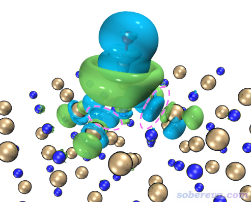

可见此时的密度差图展现了比之前更多的信息。粉色虚线圈住的地方电子密度有一定降低，由于仅在等值面数值很小的时候才能显现出来，所以这部分降低量很少（想通过积分得到确切值的话需要用Multiwfn的盆分析功能，前面<http://sobereva.com/179>文中介绍过）。这部分电子密度降低是因为CO向Na这边转移了电子，由于交换互斥作用，使得原本这部分的电子被排斥开，向更远处转移。

## 3 绘制密度差局部积分曲线和平面平均密度差曲线

这一节绘制密度差局部积分曲线和平面平均密度差曲线，首先了解一下定义。某个三维空间函数的局部积分曲线（local integral curve）可以对任意方向绘制，如果对比如Z方向绘制，则表达式为

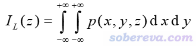

其中p是被考察的函数。如果p取为密度差的话，那么这个曲线就是前述的密度差局部积分曲线了。

还有个概念叫积分曲线（integral curve），就是对局部积分曲线再进一步积分。例如对Z方向如下所示

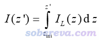

其中积分的起点z_ini由自己决定。如果被考察的函数是密度差，则这个积分曲线对应的就是前述的电荷位移曲线。

平面平均曲线（plane-averaged curve）定义如下，其中A_XY是格点数据对应的盒子在XY方向的面积。这种曲线体现的是被考察的函数在特定截面上的平均值。

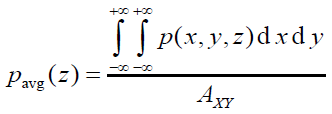

在Multiwfn里可以基于格点数据对任意函数绘制上述三种曲线，需要先把相应的格点数据存到内存里。比如可以通过主功能5格点数据运算功能算出来后自动存到内存里，也可以启动时从cub等格点数据文件里直接载入，等等。

下面绘制密度差局部积分曲线。如果你之前已经关了Multiwfn，就再启动Multiwfn，载入密度差格点数据文件EDD.cub，然后进入主功能13，再进入子功能18，这是用来绘制（局部）积分曲线和平面平均曲线的功能。如果你按照上一节操作之后还没关Multiwfn，则内存里的格点数据正是密度差格点数据，因此直接进入子功能18就行了。

在子功能18里，Multiwfn先问你对哪个方向绘制，我们想垂直于NaCl界面绘制，因此输入Z，因为NaCl界面平行于XY方向。之后Multiwfn问你绘制范围的下限和上限位置是什么，此例想对整个Z范围进行绘制，因此按照屏幕上的提示直接输入a。之后会看到一个菜单，通过相应选项可以直接绘制积分曲线、局部积分曲线、平面平均曲线，可以保存它们的图像，还可以把曲线数据导出为文本文件便于用Origin、gnuplot、qtgrace等第三方程序绘图。

现在选择屏幕上的选项2 Plot graph of local integral curve，由于当前内存里的格点数据是密度差，所以下图就是密度差局部积分曲线

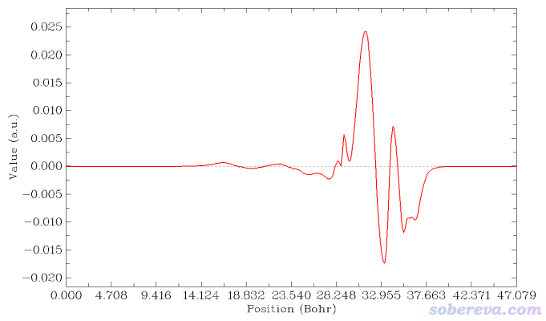

读者如果想让等值面图和密度差局部积分曲线便于准确对照，可以用屏幕上相应选项让Multiwfn导出局部积分曲线数据为当前目录下的locintcurve.txt（每一列的含义看导出时屏幕上的提示），然后放到Origin等程序里作图。之后在VMD里用正交视角，把盒子边框显示出来，把保存的等值面图和局部积分曲线图放到一起，把前者的白色背景设为透明色或者抠掉，再调节位置和大小让两张图边框位置正好对上，如下所示。不会用Photoshop的话用版本不很老的PowerPoint也可以完成

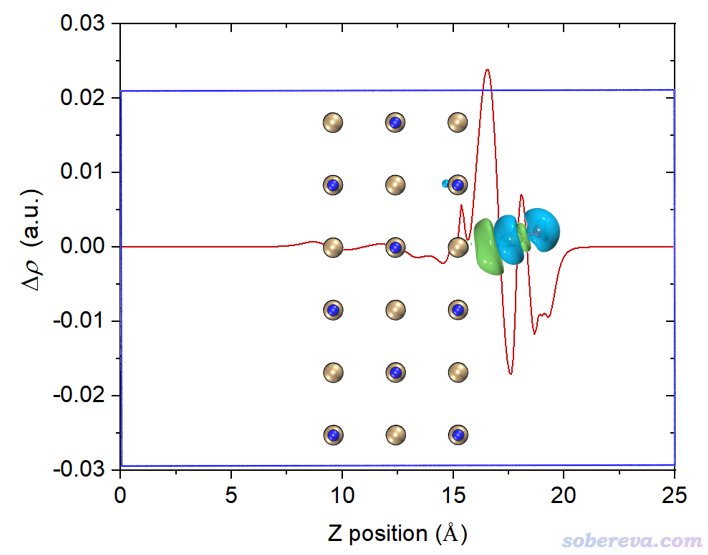

再改一下透明度，裁切一下边缘去掉盒子边框，最终得到下面的图，效果很好。由这个图可以比较准确地捕捉各个截面上电子的净增减，可见在C与表层的NaCl相接的地方电子密度由于相互作用而增加明显（但绝对的数量级并不算大）。

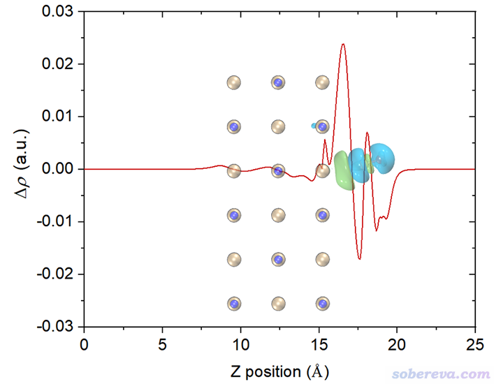

如果想要绘制平面平均密度差曲线，前面选2 Plot graph of local integral curve的地方改成选3 Plot graph of plane-averaged curve即可，其它不变。

## 4 绘制电荷位移曲线

在Multiwfn当前界面里选1 Plot graph of integral curve，由于当前内存里的格点数据是密度差，因此得到的积分曲线的就是电荷位移曲线了：

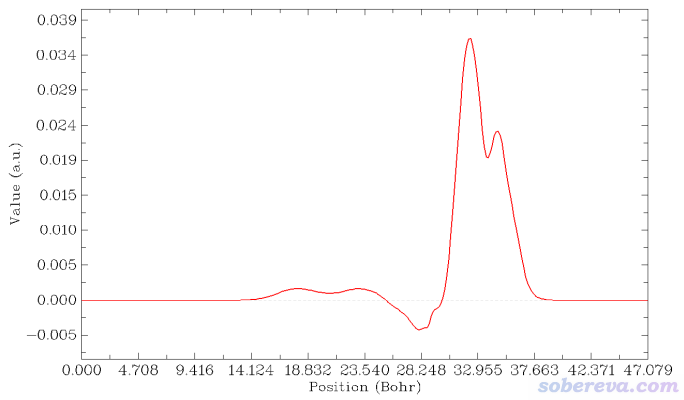

上图横轴左端对应于NaCl...CO体系Z=0的位置，横轴右端对应于NaCl...CO体系Z=25埃（盒子Z尺寸）的位置。这个图是对上一节的密度差局部积分曲线从左向右积分产生的，从肉眼可以清楚看出来对应关系。曲线最右边数值为0，体现了密度差全空间积分为0，也即CO与NaCl结合没有导致总电子数有净变化。

为了便于观看，将电荷位移曲线和结构图+等值面图叠加起来。我也把曲线最高的峰的横、纵坐标位置标注上了。电荷位移曲线纵坐标是无量纲的，因为对应的是电子数。

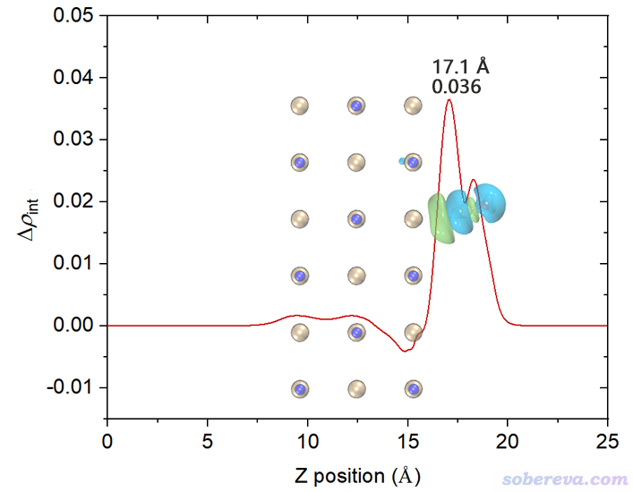

这张图体现出，在Z<17.1埃的区域里，电子数净增加了0.036。如果姑且把这个位置作为CO和NaCl的分界，那么说成是CO向NaCl净转移了0.036个电子是可以的。对于其它吸附体系，未必在表面和被吸附物之间恰好有一个峰，读者可以自己决定哪个Z值可作为两部分的分界面（这有一定任意性），从而从电荷位移曲线上读出电子净转移量。考察电荷位移曲线显然不是唯一的判断电荷转移量的方法，更普适、更常用的是计算片段电荷，即某个片段里所有原子电荷的加和。片段电荷的计算结果明显受原子电荷计算方法的选取所影响。原子电荷计算方法有很多，比如基于CP2K的波函数Multiwfn可以计算CM5、Hirshfeld、Hirshfeld-I、MBIS、Mulliken等电荷，详见《使用Multiwfn对周期性体系计算Hirshfeld(-I)、CM5和MBIS原子电荷》（<http://sobereva.com/712>）。

## 5 对其它函数计算（局部）积分曲线

上面介绍的Multiwfn计算（局部）积分曲线和平面平均曲线对任何三维空间函数都适用，这里顺带再举个例子。比如想考察NaCl...CO这个体系不同Z位置的电子密度分布，就启动Multiwfn，依次输入  
NaCl_CO.cub  
13  //处理格点数据  
18  //绘制（局部）积分曲线  
Z  //顺着Z方向绘制  
a  //整个Z范围  
-1  //将横坐标单位切换为埃  
2  //绘制局部积分曲线  
由于载入的NaCl_CO.cub里记录的是电子密度，所以此时看到的下面的局部积分曲线体现了对应不同Z值的XY截面上的电子量。中间三个很高的峰正对应于NaCl板的每一层，18.8埃附近的小峰来自于CO的电子。

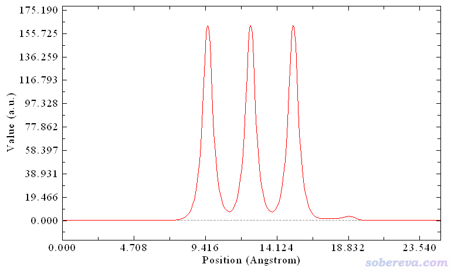

可见，不管什么函数，Multiwfn都能画（局部）积分曲线或平面平均曲线，只要提供记录相应函数的格点数据文件就可以。诸如自旋密度也同样可以绘制这些曲线，比如你有个反铁磁性体系，位于不同层上的原子自旋磁矩情况各有不同，就可以对自旋密度绘制局部积分或平面平均曲线，清楚地考察电子自旋分布情况。对于静电势也可以绘制平面平均曲线，特别是对于界面体系，在垂直于界面方向的这种图是计算功函数的关键。用户只要给Multiwfn提供静电势的格点数据文件即可，比如流行的CP2K就可以直接产生，即在Multiwfn产生CP2K输入文件的界面里选择导出cube文件的内容的时候选4 Hartree potential (negative of ESP)。

在<http://bbs.keinsci.com/thread-29906-1-1.html>一贴里有VASP用户通过本文介绍的功能基于VASP计算的CHGCAR和LOCPOT文件，用Multiwfn分别考察了平面平均电子密度曲线和平面平均静电势曲线，和文献里的结果相当一致，读者可以看看。

## 6 总结&其它

本文介绍了（局部）积分曲线、平面平均密度差曲线、电荷位移曲线这些概念，并详解介绍了如何将CP2K第一性原理程序与强大的Multiwfn波函数分析程序相结合绘制密度差图以及这些曲线。从本文的例子可见，密度差等值面图能很直观地展现三维空间中各处电子密度的净增减，而对于恰当的情况（电子转移和极化以单一方向为主），若将之与平面平均密度差曲线、电荷位移曲线相结合，则能考察得更清楚、更便于定量讨论，还便于准确地横向对比。例如一个固体表面吸附不同分子，想考察电子转移特征的差异，就可以把不同情况的平面平均密度差曲线同时绘制在一张图上，差异一目了然。

本文的做法绝不仅限于CP2K用户使用。记录电子密度的cub文件用任何其它程序产生也都可以，cub是化学领域最常见的记录格点数据的格式，因此被支持得很广泛。Multiwfn支持的格点数据文件格式有很多，还包括dx、grd、vti、VASP的CHGCAR/CHG/ELFCAR/LOCPOT。对于VASP用户，想得到密度差，可以先用Multiwfn载入CHGCAR，进主功能13用子功能0转成cub文件，对整体和各个片段都这么做得到各自的电子密度cub文件后，再按上文方式进行操作。

Multiwfn也可以基于波函数文件直接用主功能5计算密度差格点数据。如果你是Gaussian、ORCA等主流量子化学程序用户，一般都建议先计算出各个状态的波函数文件（支持的格式和产生方法见《详谈Multiwfn支持的输入文件类型、产生方法以及相互转换》<http://sobereva.com/379>），之后用主功能5的自定义运算功能可轻松得到密度差格点数据（参考《使用Multiwfn作电子密度差图》<http://sobereva.com/113>里使用主功能5的过程），然后直接就能去主功能13里的子功能18里绘制密度差局部积分曲线、平面平均密度差和电荷位移曲线。对于CP2K也可以如此，先对涉及的各个状态产生记录波函数信息的molden文件，按照《使用Multiwfn结合CP2K通过NCI和IGM方法图形化考察固体和表面的弱相互作用》（<http://sobereva.com/588>）里的说明自行把晶胞信息作为[Cell]字段写进去，然后用主功能5做自定义运算就可以获得密度差格点数据。

在《全面探究18碳环独特的分子间相互作用与pi-pi堆积特征》（<http://sobereva.com/572>）和《一篇文章深入揭示外电场对18碳环的超强调控作用》（<http://sobereva.com/570>）介绍的我关于18碳环体系的研究中都使用了本文提到的功能绘制了密度差的局部积分曲线，由其中的例子可见这对于考察分子间相互作用和外电场对电子分布的影响特别有好处，非常直观。

本文的做法是非常普适的，绝不仅限于展现片段间相互作用的密度差。对于电子激发导致激发态相对于基态电子密度分布改变的密度差、外加电场导致电子分布变化的密度差、体系电离或附着电子导致的密度变化的密度差等等，都可以按本文的方法绘制相应的（局部）积分曲线来研究。

**使用本文的做法通过Multiwfn产生相关数据若用于发表，记得需要按照程序启动时的提示恰当引用Multiwfn。**
